# خواننده تلگرام

<!-- MSG START -->

---
📅 بروزرسانی: 1405/02/21 08:09
---

## VahidOOnLine — post 239451

  

برایان مست، رییس کمیته امور خارجی مجلس نمایندگان آمریکا، گفت: «هرگز نمی‌توان به رژیم ایران اعتماد کرد.»

این نماینده جمهوریخواه همچنین گفت حکومت ایران چاره‌ای جز بازگشت به میز مذاکره ندارد و دونالد ترامپ، رییس‌جمهوری آمریکا، فشار بر تهران را ادامه خواهد داد تا زمانی که جمهوری اسلامی ناچار به توافقی جدی شود.
‌🏁 🇬🇧 IranintlTV

🤖 @VahidOOnLine

## VahidOOnLine — post 239450

  

آژانس خبری کردپا بر اساس «گزارش‌ها و شواهد از شهر سقز در استان کردستان» از افزایش فزاینده قیمت کالاهای اساسی، کمبود شدید نقدینگی و اختلال در خدمات بانکی خبر داد.

کردپا نوشت: «روایت‌های مردمی نشان می‌دهد که تنها طی دو هفته، قیمت بسیاری از کالاهای مصرفی و مواد اولیه چند برابر شده و همزمان توان خرید و معیشت بخش بزرگی از جامعه به‌شدت کاهش یافته است.»

این گزارش حاکی است در شهر سقز، خانه‌ای برای اجاره با کمتر از ۵۰۰ میلیون تومان رهن و ۱۵ میلیون تومان اجاره ماهانه یافت نمی‌شود؛ آن هم برای واحدی کوچک با یک اتاق و آشپزخانه.

در این میان، بسیاری از مراکز تولیدی به دلایلی مانند نبود مواد اولیه، هزینه بالای تولید، افزایش نرخ انرژی و کرایه‌ها تعطیل شده‌اند.

در شهرک صنعتی سقز نیز تا ابتدای اردیبهشت‌ماه بیش از ۳۰۰ کارگر، یعنی حدود نیمی از نیروی کار، اخراج شده‌اند و حدود ۱۵۰ کارگر دیگر با نصف حقوق مشغول به کار هستند.

بر اساس این گزارش، هم‌زمان با بحران اقتصادی، آسیب‌های اجتماعی از جمله «سرقت، راه‌زنی و کسب درآمد از راه‌های نابه‌هنجار» افزایش یافته است.
‌🏁 🇬🇧 IranintlTV

🤖 @VahidOOnLine

## VahidOOnLine — post 239449

  

به گزارش خبرگزاری فرانسه، نرگس محمدی، برنده جایزه نوبل صلح، در پی نگرانی‌های جدی درباره وضعیت جسمانی‌اش با قرار وثیقه از زندان آزاد شد.

بر اساس این گزارش، تصمیم برای آزادی او پس از تشدید مشکلات پزشکی و افزایش فشار خانواده و نهادهای حقوق بشری برای رسیدگی فوری به وضعیت سلامتی‌اش اتخاذ شده است.

نرگس محمدی که به‌دلیل فعالیت‌های حقوق بشری بازداشت شده بود، طی ماه‌های اخیر با مشکلات جدی سلامتی روبه‌رو بوده و فعالان حقوق بشر بارها نسبت به شرایط جسمانی او هشدار داده بودند.

‌🏁 🇬🇧 IranintlTV

🤖 @VahidOOnLine

## VahidOOnLine — post 239448

  

به گزارش خبرگزاری فرانسه، نرگس محمدی، برنده جایزه نوبل صلح، در پی نگرانی‌های جدی درباره وضعیت جسمانی‌اش با قرار وثیقه از زندان آزاد شد.

بر اساس این گزارش، تصمیم برای آزادی او پس از تشدید مشکلات پزشکی و افزایش فشار خانواده و نهادهای حقوق بشری برای رسیدگی فوری به وضعیت سلامتی‌اش اتخاذ شده است.

نرگس محمدی که به‌دلیل فعالیت‌های حقوق بشری بازداشت شده بود، طی ماه‌های اخیر با مشکلات جدی سلامتی روبه‌رو بوده و فعالان حقوق بشر بارها نسبت به شرایط جسمانی او هشدار داده بودند.

‌🏁 🇬🇧 IranintlTV

🤖 @VahidOOnLine

## VahidOOnLine — post 239447

  

بر اساس داده‌های شرکت کپلر، دو نفتکش پس از خاموش کردن سیستم‌های ردیابی خود با عبور از تنگه هرمز، این منطقه را ترک کردند.

بر اساس این گزارش، خاموش شدن دستگاه‌های موقعیت‌یاب باعث شد مسیر حرکت این نفتکش‌ها به طور دقیق قابل رصد نباشد.
‌🏁 🇬🇧 IranintlTV

🤖 @VahidOOnLine

## VahidOOnLine — post 239446

  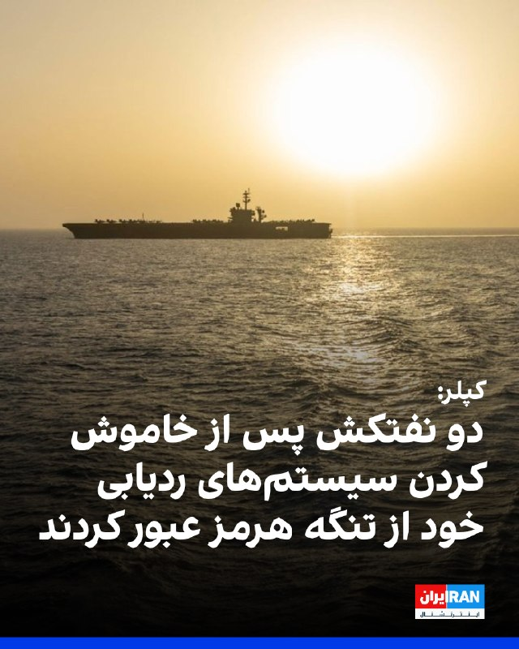

بر اساس داده‌های شرکت کپلر، دو نفتکش پس از خاموش کردن سیستم‌های ردیابی خود با عبور از تنگه هرمز، این منطقه را ترک کردند.

بر اساس این گزارش، خاموش شدن دستگاه‌های موقعیت‌یاب باعث شد مسیر حرکت این نفتکش‌ها به طور دقیق قابل رصد نباشد.
‌🏁 🇬🇧 IranintlTV

🤖 @VahidOOnLine

## VahidOOnLine — post 239445

  

♦️بنیامین نتانیاهو، نخست‌وزیر اسرائیل در پاسخ به مجری برنامه «۶۰ دقیقه» سی‌بی‌اس که از او پرسید نظرش درباره وضعیت مجتبی خامنه‌ای چیست؟ گفت: اگر می‌پرسید، زنده است یا خیر؛ بله به نظرم زنده است. اما گفتن اینکه وضعیتش چیست دشوار است، او در مخفیگاه است و می‌کوشد قدرت و اختیار به دست آورد اما هرگز قدرت و نفوذ پدرش را ندارد. نتانیاهو گفت که همین مساله، شکاف و آشفتگی بیشتری در ساختار رژیم ایران ایجاد کرده که «چیز بدی نیست.»
‌🇸🇦 Indypersian

🤖 @VahidOOnLine

## VahidOOnLine — post 239444

  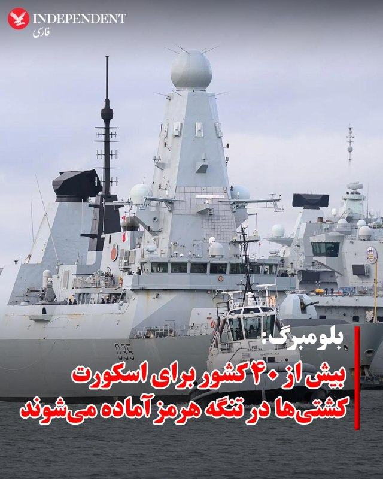

♦️بلومبرگ گزارش داد بریتانیا و فرانسه روز دوشنبه میزبان نشستی با حضور بیش از ۴۰ کشور خواهند بود تا درباره مشارکت نظامی در ماموریت اروپایی اسکورت کشتی‌ها در تنگه هرمز پس از برقراری آتش‌بس گفتگو کنند.

بر اساس این گزارش، کشورهای شرکت‌کننده قرار است توانایی‌هایی مانند مین‌روبی، اسکورت دریایی و گشت هوایی ارائه دهند. این ماموریت دفاعی به رهبری بریتانیا و فرانسه با هدف اطمینان‌بخشی به کشتی‌های تجاری برای عبور از تنگه هرمز طراحی شده است.
جان هیلی، وزیر دفاع بریتانیا، گفت لندن و پاریس در حال تبدیل توافق دیپلماتیک به برنامه عملی نظامی برای بازگرداندن اعتماد به کشتیرانی در تنگه هرمز هستند.
‌🇸🇦 Indypersian

🤖 @VahidOOnLine

## VahidOOnLine — post 239443

  

یک مقام ارشد امنیتی عراق گزارش‌های منتشرشده درباره ایجاد پایگاه نظامی مخفی اسرائیل در صحرای غربی این کشور برای پشتیبانی از حملات علیه ایران را رد کرد و آن‌ها را «نادرست» خواند.

به گزارش آناتولی، این مقام که نامش فاش نشده، گفت ادعاها درباره فعالیت کنونی یک سایت نظامی اسرائیل در خاک عراق صحت ندارد.

این واکنش پس از گزارش وال‌استریت ژورنال مطرح شد که مدعی بود اسرائیل پیش از حملات ۹ اسفند، با اطلاع آمریکا پایگاهی مخفی در صحرای عراق ایجاد کرده است.

بر اساس آن گزارش، این پایگاه محل استقرار نیروهای ویژه و مرکز پشتیبانی لجستیکی بوده و نزدیک بود در ماه مارس پس از گزارش یک چوپان درباره فعالیت‌های مشکوک فاش شود.

مقام‌های عراقی پیش‌تر از درگیری با یک «عملیات هوایی مرموز» در منطقه النخیب خبر داده بودند که به کشته و زخمی شدن چند نظامی انجامید.

ارتش اسرائیل درباره این ادعاها اظهار نظر نکرده و تنش‌های منطقه‌ای همچنان ادامه دارد.
بیشتر بخوانید

‌🏁 🇬🇧 IranintlTV

🤖 @VahidOOnLine

## VahidOOnLine — post 239442

  

♦️انجمن جهانی ناشران خبر (WAN-IFRA) برندگان جوایز رسانه‌های دیجیتال خاورمیانه در سال ۲۰۲۶ را معرفی کرد که در میان آنها، شبکه «ایران اینترنشنال» موفق به کسب سه جایزه معتبر شد. پروژه «ربات تلگرامی ایران اینترنشنال» توانست دو جایزه «تعامل با مخاطب» و «نوآورانه‌ترین محصول دیجیتال» را از آن خود کند. داوران با تمجید از عملکرد این ابزار در زمان قطع اینترنت در ایران، خاطرنشان کردند که این بات فراتر از یک ابزار جمع‌آوری خبر، به یک پل ارتباطی میان ایرانیان خارج از کشور و خانواده‌هایشان در داخل تبدیل شد؛ به طوری که پیام‌های ارسالی از طریق ماهواره برای کسانی که به اینترنت دسترسی نداشتند، پخش می‌شد. همچنین، نقشه تعاملی اهداف اسرائیل در جنگ ۱۲ روزه که با ترکیب داده‌های شهروند-خبرنگاران و راستی‌آزمایی‌های تحریریه طراحی شده بود، جایزه «بهترین بصری‌سازی داده‌ها» را دریافت کرد. در بخش بازاریابی نیز، کارزار «زن، زندگی، آزادی» که به مناسبت سومین سالگرد جان‌باختن مهسا امینی و با نماد مرغ‌های آمین (اوریگامی) اجرا شد، به عنوان بهترین کارزار تبلیغاتی شناخته شد. جوایز رسانه‌های دیجیتال خاورمیانه که توسط اتحادیه جهانی روزنامه‌ها و ناشران خبر برگزار می‌شود، معتبرترین رقابت در صنعت رسانه‌های دیجیتال منطقه است. این جایزه به رسانه‌هایی اهدا می‌شود که توانسته‌اند با استفاده از فناوری‌های نوین، استراتژی‌های خلاقانه و روزنامه‌نگاری داده‌محور، با مخاطبان خود ارتباط موثر برقرار کنند.
‌🇸🇦 Indypersian

🤖 @VahidOOnLine

## VahidOOnLine — post 239441

  

نیویورک‌تایمز در گزارشی از موج اخراج‌ها پس از جنگ نهم اسفند خبر داد و نوشت حملات آمریکا و اسرائیل به صنایع فولاد و پتروشیمی، اختلال در واردات به‌دلیل محاصره بنادر و نیز سیاست‌هایی مانند قطع اینترنت، فشار سنگینی بر اقتصاد ایران وارد کرده است.

به نوشته این روزنامه، برخی آمارهای داخلی از بیکاری مستقیم و غیرمستقیم تا دو میلیون نفر و ثبت رکورد ۳۱۸ هزار رزومه در یک روز حکایت دارد؛ موضوعی که می‌تواند به کاهش قابل توجه درآمدهای مالیاتی دولت منجر شود.

در بخش صنعت، کمبود مواد اولیه و آسیب به کارخانه‌های بزرگ باعث کاهش تولید و اخراج‌های گسترده شده است.

مهدی بستانچی، رییس شورای هماهنگی شهرک‌های صنعتی سراسر کشور، به نیویورک تایمز گفت تا ۳.۵ میلیون کارگر ممکن است تحت تاثیر این روند انقباضی قرار گیرند.

همچنین قطعی اینترنت، صنعت فناوری را دچار بحران کرده و روزانه ده‌ها میلیون دلار خسارت به اقتصاد دیجیتال وارد می‌کند. این گزارش می‌افزاید نارضایتی اقتصادی که در سال‌های اخیر به اعتراضات انجامیده، همچنان برطرف نشده است.
‌🏁 🇬🇧 IranintlTV

🤖 @VahidOOnLine

## VahidOOnLine — post 239440

  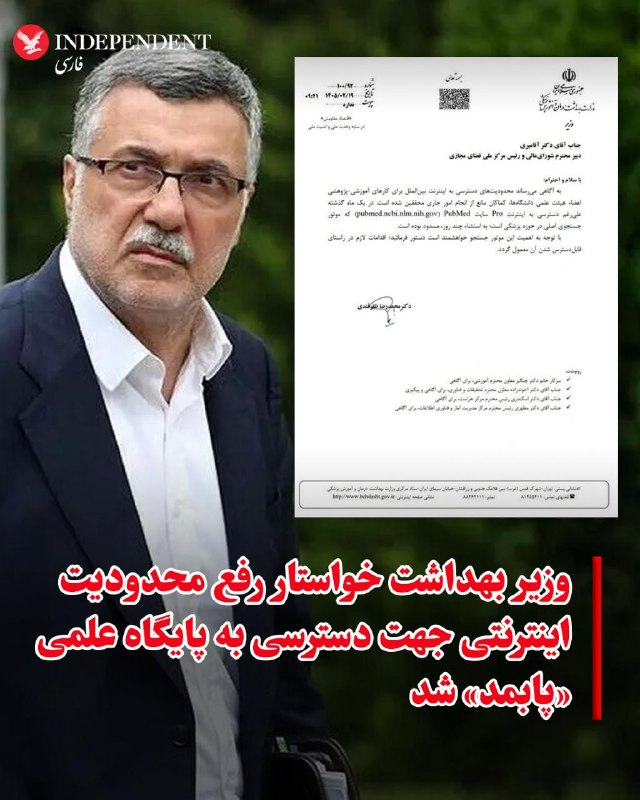

♦️همزمان با هفتادودومین روز قطع سراسری اینترنت در ایران، محمدرضا ظفرقندی، وزیر بهداشت دولت پزشکیان در نامه‌ای به رئیس مرکز ملی فضای مجازی، خواستار رفع محدودیت پایگاه علمی «پابمد» شد و تاکید کرد که محدودیت‌های اینترنت بین‌الملل، حتی با وجود دسترسی به «اینترنت پرو»، فعالیت‌های آموزشی و پژوهشی اساتید و محققان علوم پزشکی را با چالش جدی مواجه کرده است. به گزارش ایسنا، این درخواست در حالی مطرح می‌شود که کارشناسان نسبت به پیامدهای تداوم اختلال در دسترسی به این موتور جستجوی حیاتی و تاثیر مستقیم آن بر افت رتبه علمی کشور هشدار داده‌اند؛ چرا که پاب‌مد اصلی‌ترین مرجع جستجوی مقالات معتبر در حوزه‌های زیست‌شناسی و داروسازی محسوب می‌شود که در یک ماه اخیر به‌جز چند روز، به‌طور کامل از دسترس خارج بوده است.
‌🇸🇦 Indypersian

🤖 @VahidOOnLine

## VahidOOnLine — post 239439

  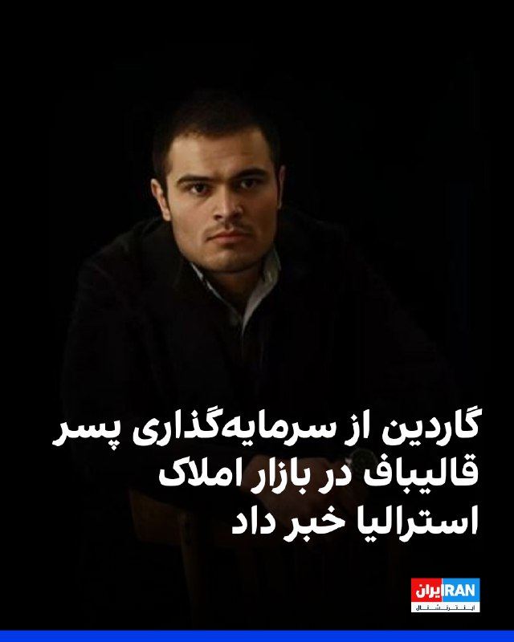

روزنامه گاردین استرالیا گزارش داد اسحاق قالیباف، فرزند محمدباقر قالیباف، در دوران اقامت خود در استرالیا با یک مرکز پژوهشی در دانشگاه ملبورن همکاری داشته و همزمان از محل اجاره حداقل یک ملک در این کشور درآمد کسب می‌کرده است.

بر اساس اسناد ارائه‌شده در پرونده حقوقی او برای دریافت اقامت دائم کانادا، قالیباف بین سال‌های ۲۰۱۵ تا ۲۰۱۸ در ملبورن زندگی و در مقطع کارشناسی ارشد مهندسی تحصیل کرده و به‌عنوان دستیار پژوهشی در یک مرکز دانشگاهی مشغول به کار بوده است.

اسناد بانکی نشان می‌دهد او در سال ۲۰۱۸ مبالغی به‌عنوان «اجاره دریافتی» از یک آژانس املاک در ملبورن دریافت کرده، هرچند مالکیت دقیق املاک مشخص نیست. این گزارش همچنین به ارتباط نام کارفرمای او در ایران با چهره‌های نزدیک به سپاه اشاره کرده است. درخواست اقامت دائم قالیباف در کانادا در بهمن ۱۴۰۴ رد شد.

گاردین در ادامه به نگرانی بخشی از جامعه ایرانیان استرالیا درباره حضور بستگان مقام‌های جمهوری اسلامی در این کشور پرداخته است. برخی سیاستمداران استرالیایی نیز این موضوع را نشانه ضعف در چارچوب تحریم‌های این کشور دانسته‌اند.
بیشتر بخوانید

‌🏁 🇬🇧 IranintlTV

🤖 @VahidOOnLine

## VahidOOnLine — post 239438

  

♦️لین جیان، سخنگوی وزارت خارجه چین، روز دوشنبه اعلام کرد دونالد ترامپ، رئیس‌جمهوری آمریکا، به دعوت شی جین‌پینگ، رئیس‌جمهوری چین، در بازه زمانی ۲۳ تا ۲۵ اردیبهشت در سفری رسمی به چین خواهد رفت.

خبرگزاری شین‌هوا گزارش داد این سفر در چارچوب دیدار رسمی میان رهبران دو کشور انجام می‌شود.
‌🇸🇦 Indypersian

🤖 @VahidOOnLine

## VahidOOnLine — post 239437

  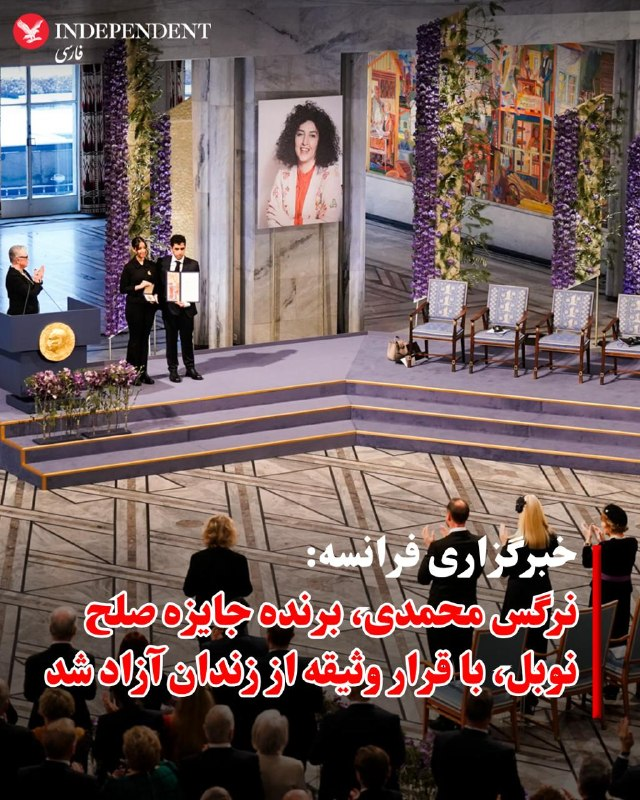

♦️خبرگزاری فرانسه گزارش داد نرگس محمدی، فعال حقوق بشر و برنده جایزه صلح نوبل، روز یکشنبه پس از افزایش نگرانی‌ها درباره وضعیت جسمانی‌اش، با قرار وثیقه از زندان آزاد و برای درمان پزشکی به تهران منتقل شد.

بنیاد نرگس محمدی اعلام کرد او پس از ۱۰ روز بستری بودن در بیمارستانی در زنجان، با «تعلیق حکم و وثیقه سنگین» آزاد شده و با آمبولانس به بیمارستانی در تهران انتقال یافته است تا تحت درمان تیم پزشکی خود قرار گیرد.

حامیان نرگس محمدی پیش‌تر هشدار داده بودند او پس از دو حمله قلبی مشکوک در دوران حبس، در خطر مرگ قرار دارد. تقی رحمانی، همسر او، گفته بود: «جان نرگس محمدی در خطر است.»

مصطفی نیلی، وکیل نرگس محمدی، نیز در اکس تایید کرد که انتقال او به تهران در پی دستور توقف اجرای حکم برای درمان پزشکی انجام شده است.
‌🇸🇦 Indypersian

🤖 @VahidOOnLine

## VahidOOnLine — post 239436

  

وب‌سایت «اسرائیل نشنال‌نیوز» به نقل از المیادین گزارش داد جمهوری اسلامی در مذاکرات با آمریکا فهرستی از مطالبات گسترده مطرح کرده که با واکنش تند دونالد ترامپ روبه‌رو شده است.

تهران خواستار پایان فوری جنگ، تضمین آتش‌بس در لبنان، لغو کامل تحریم‌ها، آزادسازی دارایی‌های بلوکه‌شده و ازسرگیری بدون محدودیت صادرات نفت شده و کنترل تنگه هرمز را «خط قرمز» خود دانسته است. همچنین ترامپ هشدار داده «ایران دیگر نخواهد خندید.»

در عین حال، منابعی به نیویورک‌تایمز گفته‌اند دو طرف در حال بررسی توافقی موقت برای تمدید ۳۰ روزه آتش‌بس و توقف محاصره هرمز هستند تا مذاکرات ادامه یابد.

به نوشته وال‌استریت ژورنال، اختلاف اصلی بر سر ذخایر اورانیوم غنی‌شده پابرجاست؛ تهران کاهش شدید ذخایر را نپذیرفته و تنها درباره افزایش نظارت آژانس بین‌المللی انرژی اتمی اعلام آمادگی کرده است.

مذاکرات با میانجی‌گری پاکستان همچنان ادامه دارد و ارزیابی‌ها از وجود فرصت برای دستیابی به تفاهم حکایت دارد.
بیشتر بخوانید

‌🏁 🇬🇧 IranintlTV

🤖 @VahidOOnLine

## VahidOOnLine — post 239435

  

دولت بریتانیا اعلام کرد همراه با فرانسه روز سه‌شنبه میزبان نشستی چندملیتی درباره برنامه‌های نظامی برای بازگرداندن جریان تجارت در تنگه هرمز خواهد بود.

به گزارش خبرگزاری فرانسه، این خبر ساعاتی پس از آن اعلام شد که جمهوری اسلامی به لندن و پاریس درباره اعزام کشتی‌های جنگی به منطقه هشدار داد.

در بیانیه وزارت دفاع بریتانیا آمده است: «جان هیلی، وزیر دفاع، همراه با همتای فرانسوی خود، کاترین ووترین، ریاست مشترک نشستی با حضور وزیران دفاع بیش از ۴۰ کشور را برای آغاز مأموریت چندملیتی بر عهده خواهد داشت.»

این نشست مجازی پس از گردهمایی دو روزه کارشناسان نظامی در لندن در ماه گذشته برگزار می‌شود. در آن نشست، جنبه‌های عملی یک مأموریت چندملیتی به رهبری بریتانیا و فرانسه برای حفاظت از ناوبری در این آبراه کلیدی پس از برقراری آتش‌بس پایدار بررسی شد.

هیلی گفت: «ما در حال تبدیل توافق دیپلماتیک به برنامه‌های نظامی عملی برای بازگرداندن اعتماد به کشتیرانی از طریق تنگه هرمز هستیم.»
‌🏁 🇬🇧 IranintlTV

🤖 @VahidOOnLine

## VahidOOnLine — post 239434

  

♦️بنیامین نتانیاهو، نخست‌وزیر اسرائیل در گفتگو با برنامه ۶۰ دقیقه سی‌بی‌اس تاکید کرد که اگر رژیم ایران سقوط کند، کار حزب‌الله و حماس هم تمام است. او گفت که به همین دلیل است که جمهوری اسلامی می‌گوید اگر قرار است آتش‌بس باشد، باید شامل حزب‌الله هم باشد، چون می‌خواهد حزب‌الله در لبنان بماند و به شکنجه مردم لبنان و حمله به اسرائیل ادامه دهد. نتانیاهو گفت، ما می‌خواهیم از شر این خطر خلاص شویم. او در پاسخ به مجری که پرسید آیا امکان سقوط رژیم ایران وجود دارد، گفت: نمی‌توان زمان آن را پیش‌بینی کرد. او گفت که امکانش وجود دارد اما تضمین ‌شده نیست. نتانیاهو گفت در صحبت با ترامپ هم به او نگفتم که این موضوع قطعی و تضمین شده است و گفتیم که گرچه اقدام کردن خطراتی دارد، اما اقدام نکردن خطرات بیشتری خواهد داشت.
‌🇸🇦 Indypersian

🤖 @VahidOOnLine

## VahidOOnLine — post 239433

  <a href="telegram/content/VahidOOnLine_239433_1778474372.mp4">🎬 Download video</a>

ویدیوهای دریافتی نشان می‌دهد جمعی از ایرانیان ساکن اسپانیا، روز یک‌شنبه ۲۰ اردیبهشت، در حمایت از فراخوان شاهزاده رضا پهلوی در مادرید تجمع کردند و ضمن برگزاری پرفورمنسی علیه اجرای احکام اعدام از سوی حکومت، اعلام کردند که در ۴۷ سال گذشته هیچ آتش‌بسی در جنگ جمهوری اسلامی علیه مردم ایران وجود نداشته است.
‌🏁 🇬🇧 IranintlTV

🤖 @VahidOOnLine

## VahidOOnLine — post 239432

  

بنیامین نتانیاهو در گفت‌وگو با برنامه «۶۰ دقیقه» شبکه سی‌بی‌اس گفت جنگ اخیر با ایران «دستاوردهای بزرگی» داشته اما هنوز پایان نیافته است، زیرا به گفته او همچنان اورانیوم غنی‌شده، تأسیسات هسته‌ای، برنامه موشک‌های بالستیک و شبکه نیروهای نیابتی ایران باید مهار شوند.

او تأکید کرد اگر حکومت ایران تضعیف یا سرنگون شود، شبکه نیروهای نیابتی از جمله حزب‌الله، حماس و حوثی‌ها نیز فرو خواهد پاشید، هرچند تغییر حکومت «تضمین‌شده نیست.»

نتانیاهو درباره خارج کردن اورانیوم با غنای بالا گفت در صورت وجود توافق می‌توان «وارد شد و آن را خارج کرد»، اما درباره گزینه‌های نظامی توضیحی نداد.

او همچنین طرح ایران برای پیوند زدن آتش‌بس در همه جبهه‌ها را رد کرد و گفت برخی کشورهای عربی خواهان تقویت همکاری با اسرائیل برای مهار تهران هستند.

نتانیاهو حمله ۷ اکتبر را بخشی از «محور ایران» برای نابودی اسرائیل توصیف کرد.
بیشتر بخوانید
‌🏁 🇬🇧 IranintlTV

🤖 @VahidOOnLine

## mwarmonitor — post 8866

✈️دو فروند هواپیمای سوخت‌رسان KC-135R استراتوتانکر نیروی هوایی ایالات متحده که از پایگاه هوایی الظفره به پرواز درآمده‌اند، در حال حاضر بر فراز دریای عمان فعال هستند.

✈️همچنین یک فروند هواپیمای گشت دریایی P-8A پوزیدون نیروی دریایی آمریکا در حال انجام عملیات بر فراز خلیج فارس و در سواحل امارات متحده عربی است.

@mwarmonitor

## mwarmonitor — post 8865

🔸وال‌استریت ژورنال: علی الزیدی، نخست‌وزیر مأمور تشکیل دولت عراق، تحت فشار واشنگتن قرار دارد تا نفوذ شبه‌نظامیان مورد حمایت تهران را محدود کند.

@mwarmonitor

## mwarmonitor — post 8864

🔸لیندسی گراهام: این ایده که ایران در چارچوب یک راه‌حل مذاکره‌شده، تمام تأسیسات غنی‌سازی خود را به‌طور کامل نابود نکند، منطقی به نظر نمی‌رسد. تعلیق بدون برچیدن کامل تأسیسات و توانمندی‌های غنی‌سازی، عملاً همان برجام می‌شود.

🔹من اطمینان دارم که امتناع ایران از نابود کردن توان غنی‌سازی خود، قاطعانه رد خواهد شد.

@mwarmonitor

## mwarmonitor — post 8863

  <a href="telegram/content/mwarmonitor_8863_1778474375.mp4">🎬 Download video</a>

✈️🇺🇸نیروی هوایی ایالات متحده ساعات گذشته نیز انتقال هوایی گسترده‌ای را بر فراز اروپا به سمت خاورمیانه ادامه داد. با به بن‌بست خوردن مذاکرات، آماده‌سازی‌ها برای احتمال ازسرگیری حملات به‌طور جدی در حال انجام است…

@mwarmonitor

## mwarmonitor — post 8862

  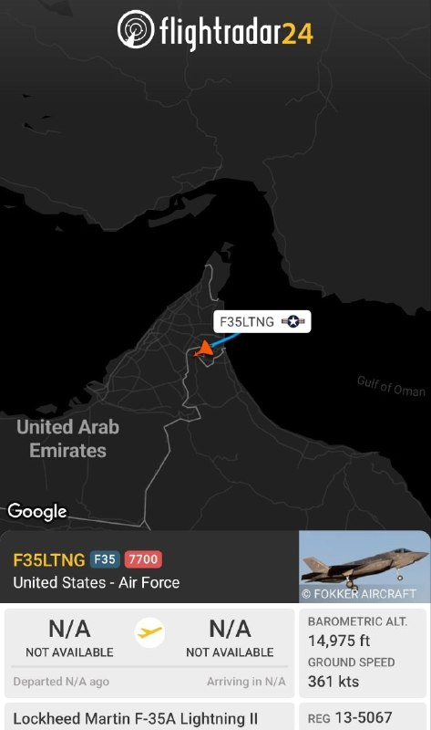

✈️یک فروند جنگنده F-35A لایتنینگ II نیروی هوایی ایالات متحده هنگام پرواز بر فراز دریای عمان در مسیر حرکت به سمت امارات متحده عربی وضعیت اضطراری در حین پرواز اعلام کرده و کد اسکواک ۷۷۰۰ را ارسال کرده است.

@mwarmonitor

## pm_afshaa — post 90526

  <a href="telegram/content/pm_afshaa_90526_1778474377.jpg">🎬 Download video</a>

🔴نتانیاهو: رژیم ایران الان در ضعیف‌ترین وضعیت خود از زمان تسلط بر مردم ایران قرار داره. تندروها همچنان همان مواضع قبلی رو دارن، اما در داخل حکومت شکاف‌هایی ایجاد شده، چون در نتیجه عملیات مشترک نظامی ما ضربات بسیار سنگینی خوردن.

💧 Rainbet.com the #1 Non-KYC Crypto Casino & Sportsbook @rainbetcom

😁 @Pm_Afshaa

## pm_afshaa — post 90525

  <a href="telegram/content/pm_afshaa_90525_1778474378.jpg">🎬 Download video</a>

🔴نتانیاهو: چین از ایران و اجزای خاصی از ساخت موشک حمایت میکنه؛ چین باید در روابط خود با تهران تجدید نظر کنه.

چین مقدار مشخصی از حمایت و اجزای خاصی از تولید موشک رو ارائه کرد، اما من نمیتونم بیشتر ازش بگم.
آیا واقعاً میخواد ایران راه‌های آبی رو برای تأمین انرژی مورد نیاز چین کنترل کنه؟ آیا ترجیح نمیدید آبراه‌هایی باز داشته باشید که در معرض این نوع باج‌گیری خشونت‌آمیز قرار نگیرن؟

💧Rainbet.com the #1 Non-KYC Crypto Casino & Sportsbook @rainbetcom

😁 @Pm_Afshaa

## pm_afshaa — post 90524

  <a href="telegram/content/pm_afshaa_90524_1778474378.jpg">🎬 Download video</a>

🔴نتانیاهو: سرنگونی رژیم ایران ممکنه اما قطعی نیست و زمان تغییر هم غیرقابل پیش‌بینیه.

💧 Rainbet.com the #1 Non-KYC Crypto Casino & Sportsbook @rainbetcom

😁 @Pm_Afshaa

## IranIntlTV — post 336579

  

برایان مست، رییس کمیته امور خارجی مجلس نمایندگان آمریکا، گفت: «هرگز نمی‌توان به رژیم ایران اعتماد کرد.»

این نماینده جمهوریخواه همچنین گفت حکومت ایران چاره‌ای جز بازگشت به میز مذاکره ندارد و دونالد ترامپ، رییس‌جمهوری آمریکا، فشار بر تهران را ادامه خواهد داد تا زمانی که جمهوری اسلامی ناچار به توافقی جدی شود.
https://iranintl.com/202605117347

## IranIntlTV — post 336578

  

آژانس خبری کردپا بر اساس «گزارش‌ها و شواهد از شهر سقز در استان کردستان» از افزایش فزاینده قیمت کالاهای اساسی، کمبود شدید نقدینگی و اختلال در خدمات بانکی خبر داد.

کردپا نوشت: «روایت‌های مردمی نشان می‌دهد که تنها طی دو هفته، قیمت بسیاری از کالاهای مصرفی و مواد اولیه چند برابر شده و همزمان توان خرید و معیشت بخش بزرگی از جامعه به‌شدت کاهش یافته است.»

این گزارش حاکی است در شهر سقز، خانه‌ای برای اجاره با کمتر از ۵۰۰ میلیون تومان رهن و ۱۵ میلیون تومان اجاره ماهانه یافت نمی‌شود؛ آن هم برای واحدی کوچک با یک اتاق و آشپزخانه.

در این میان، بسیاری از مراکز تولیدی به دلایلی مانند نبود مواد اولیه، هزینه بالای تولید، افزایش نرخ انرژی و کرایه‌ها تعطیل شده‌اند.

در شهرک صنعتی سقز نیز تا ابتدای اردیبهشت‌ماه بیش از ۳۰۰ کارگر، یعنی حدود نیمی از نیروی کار، اخراج شده‌اند و حدود ۱۵۰ کارگر دیگر با نصف حقوق مشغول به کار هستند.

بر اساس این گزارش، هم‌زمان با بحران اقتصادی، آسیب‌های اجتماعی از جمله «سرقت، راه‌زنی و کسب درآمد از راه‌های نابه‌هنجار» افزایش یافته است.
https://iranintl.com/202605118671

## IranIntlTV — post 336577

  <a href="telegram/content/IranIntlTV_336577_1778474380.mp4">🎬 Download video</a>

ویدیوهای دریافت‌شده نشان می‌دهد ایرانیان مقیم شهرهای والنسیا در اسپانیا و مونیخ آلمان، روز یک‌شنبه ۲۰ اردیبهشت، هم‌صدا با کارزار جهانی «یک ملت در گروگان»، علیه اعدام‌های جمهوری اسلامی و قطع اینترنت تجمع کردند و حمایت خود را از مردم ایران نشان دادند.
@iranintltv

## IranIntlTV — post 336574

  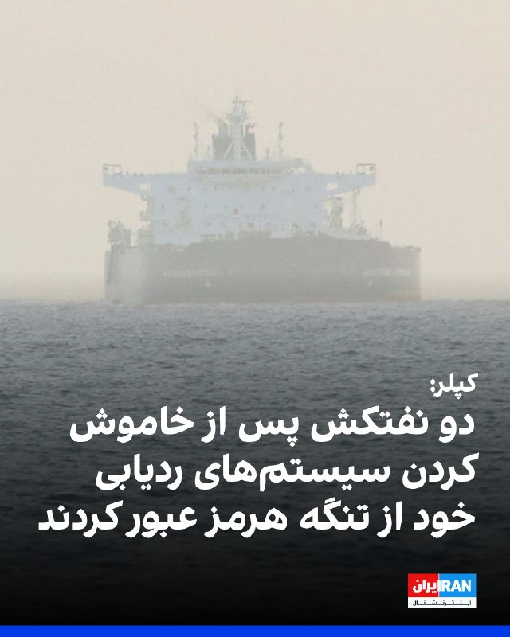

بر اساس داده‌های شرکت کپلر، دو نفتکش پس از خاموش کردن سیستم‌های ردیابی خود با عبور از تنگه هرمز، این منطقه را ترک کردند.

بر اساس این گزارش، خاموش شدن دستگاه‌های موقعیت‌یاب باعث شد مسیر حرکت این نفتکش‌ها به طور دقیق قابل رصد نباشد.
https://iranintl.com/202605116330

## IranIntlTV — post 336573

  <a href="telegram/content/IranIntlTV_336573_1778474382.mp4">🎬 Download video</a>

جمعی از ایرانیان مقیم آمریکا، روز یک‌شنبه ۲۰ اردیبهشت، در حمایت از مردم ایران و شاهزاده رضا پهلوی و نیز در اعتراض به اعدام‌های جمهوری اسلامی و قطع اینترنت، در لس‌آنجلس تجمع کردند. آن‌ها هم‌صدا با کارزار جهانی «یک ملت در گروگان»، خواستار توجه جامعه بین‌المللی به وضعیت بحرانی داخل ایران شدند.
@iranintltv

## IranIntlTV — post 336571

  

یک مقام ارشد امنیتی عراق گزارش‌های منتشرشده درباره ایجاد پایگاه نظامی مخفی اسرائیل در صحرای غربی این کشور برای پشتیبانی از حملات علیه ایران را رد کرد و آن‌ها را «نادرست» خواند.

به گزارش آناتولی، این مقام که نامش فاش نشده، گفت ادعاها درباره فعالیت کنونی یک سایت نظامی اسرائیل در خاک عراق صحت ندارد.

این واکنش پس از گزارش وال‌استریت ژورنال مطرح شد که مدعی بود اسرائیل پیش از حملات ۹ اسفند، با اطلاع آمریکا پایگاهی مخفی در صحرای عراق ایجاد کرده است.

بر اساس آن گزارش، این پایگاه محل استقرار نیروهای ویژه و مرکز پشتیبانی لجستیکی بوده و نزدیک بود در ماه مارس پس از گزارش یک چوپان درباره فعالیت‌های مشکوک فاش شود.

مقام‌های عراقی پیش‌تر از درگیری با یک «عملیات هوایی مرموز» در منطقه النخیب خبر داده بودند که به کشته و زخمی شدن چند نظامی انجامید.

ارتش اسرائیل درباره این ادعاها اظهار نظر نکرده و تنش‌های منطقه‌ای همچنان ادامه دارد.
بیشتر بخوانید

https://iranintl.com/202605114193

## IranIntlTV — post 336570

  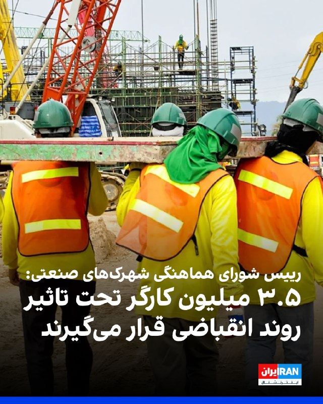

نیویورک‌تایمز در گزارشی از موج اخراج‌ها پس از جنگ نهم اسفند خبر داد و نوشت حملات آمریکا و اسرائیل به صنایع فولاد و پتروشیمی، اختلال در واردات به‌دلیل محاصره بنادر و نیز سیاست‌هایی مانند قطع اینترنت، فشار سنگینی بر اقتصاد ایران وارد کرده است.

به نوشته این روزنامه، برخی آمارهای داخلی از بیکاری مستقیم و غیرمستقیم تا دو میلیون نفر و ثبت رکورد ۳۱۸ هزار رزومه در یک روز حکایت دارد؛ موضوعی که می‌تواند به کاهش قابل توجه درآمدهای مالیاتی دولت منجر شود.

در بخش صنعت، کمبود مواد اولیه و آسیب به کارخانه‌های بزرگ باعث کاهش تولید و اخراج‌های گسترده شده است.

مهدی بستانچی، رییس شورای هماهنگی شهرک‌های صنعتی سراسر کشور، به نیویورک تایمز گفت تا ۳.۵ میلیون کارگر ممکن است تحت تاثیر این روند انقباضی قرار گیرند.

همچنین قطعی اینترنت، صنعت فناوری را دچار بحران کرده و روزانه ده‌ها میلیون دلار خسارت به اقتصاد دیجیتال وارد می‌کند. این گزارش می‌افزاید نارضایتی اقتصادی که در سال‌های اخیر به اعتراضات انجامیده، همچنان برطرف نشده است.
https://iranintl.com/202605111091

## IranIntlTV — post 336569

  

روزنامه گاردین استرالیا گزارش داد اسحاق قالیباف، فرزند محمدباقر قالیباف، در دوران اقامت خود در استرالیا با یک مرکز پژوهشی در دانشگاه ملبورن همکاری داشته و همزمان از محل اجاره حداقل یک ملک در این کشور درآمد کسب می‌کرده است.

بر اساس اسناد ارائه‌شده در پرونده حقوقی او برای دریافت اقامت دائم کانادا، قالیباف بین سال‌های ۲۰۱۵ تا ۲۰۱۸ در ملبورن زندگی و در مقطع کارشناسی ارشد مهندسی تحصیل کرده و به‌عنوان دستیار پژوهشی در یک مرکز دانشگاهی مشغول به کار بوده است.

اسناد بانکی نشان می‌دهد او در سال ۲۰۱۸ مبالغی به‌عنوان «اجاره دریافتی» از یک آژانس املاک در ملبورن دریافت کرده، هرچند مالکیت دقیق املاک مشخص نیست. این گزارش همچنین به ارتباط نام کارفرمای او در ایران با چهره‌های نزدیک به سپاه اشاره کرده است. درخواست اقامت دائم قالیباف در کانادا در بهمن ۱۴۰۴ رد شد.

گاردین در ادامه به نگرانی بخشی از جامعه ایرانیان استرالیا درباره حضور بستگان مقام‌های جمهوری اسلامی در این کشور پرداخته است. برخی سیاستمداران استرالیایی نیز این موضوع را نشانه ضعف در چارچوب تحریم‌های این کشور دانسته‌اند.
بیشتر بخوانید

https://iranintl.com/20260510

## IranIntlTV — post 336568

  

وب‌سایت «اسرائیل نشنال‌نیوز» به نقل از المیادین گزارش داد جمهوری اسلامی در مذاکرات با آمریکا فهرستی از مطالبات گسترده مطرح کرده که با واکنش تند دونالد ترامپ روبه‌رو شده است.

تهران خواستار پایان فوری جنگ، تضمین آتش‌بس در لبنان، لغو کامل تحریم‌ها، آزادسازی دارایی‌های بلوکه‌شده و ازسرگیری بدون محدودیت صادرات نفت شده و کنترل تنگه هرمز را «خط قرمز» خود دانسته است. همچنین ترامپ هشدار داده «ایران دیگر نخواهد خندید.»

در عین حال، منابعی به نیویورک‌تایمز گفته‌اند دو طرف در حال بررسی توافقی موقت برای تمدید ۳۰ روزه آتش‌بس و توقف محاصره هرمز هستند تا مذاکرات ادامه یابد.

به نوشته وال‌استریت ژورنال، اختلاف اصلی بر سر ذخایر اورانیوم غنی‌شده پابرجاست؛ تهران کاهش شدید ذخایر را نپذیرفته و تنها درباره افزایش نظارت آژانس بین‌المللی انرژی اتمی اعلام آمادگی کرده است.

مذاکرات با میانجی‌گری پاکستان همچنان ادامه دارد و ارزیابی‌ها از وجود فرصت برای دستیابی به تفاهم حکایت دارد.
بیشتر بخوانید

https://iranintl.com/202605107880

## IranIntlTV — post 336567

  

دولت بریتانیا اعلام کرد همراه با فرانسه روز سه‌شنبه میزبان نشستی چندملیتی درباره برنامه‌های نظامی برای بازگرداندن جریان تجارت در تنگه هرمز خواهد بود.

به گزارش خبرگزاری فرانسه، این خبر ساعاتی پس از آن اعلام شد که جمهوری اسلامی به لندن و پاریس درباره اعزام کشتی‌های جنگی به منطقه هشدار داد.

در بیانیه وزارت دفاع بریتانیا آمده است: «جان هیلی، وزیر دفاع، همراه با همتای فرانسوی خود، کاترین ووترین، ریاست مشترک نشستی با حضور وزیران دفاع بیش از ۴۰ کشور را برای آغاز مأموریت چندملیتی بر عهده خواهد داشت.»

این نشست مجازی پس از گردهمایی دو روزه کارشناسان نظامی در لندن در ماه گذشته برگزار می‌شود. در آن نشست، جنبه‌های عملی یک مأموریت چندملیتی به رهبری بریتانیا و فرانسه برای حفاظت از ناوبری در این آبراه کلیدی پس از برقراری آتش‌بس پایدار بررسی شد.

هیلی گفت: «ما در حال تبدیل توافق دیپلماتیک به برنامه‌های نظامی عملی برای بازگرداندن اعتماد به کشتیرانی از طریق تنگه هرمز هستیم.»
https://iranintl.com/202605114087

## IranIntlTV — post 336566

  <a href="telegram/content/IranIntlTV_336566_1778474386.mp4">🎬 Download video</a>

ویدیوهای دریافتی نشان می‌دهد جمعی از ایرانیان ساکن اسپانیا، روز یک‌شنبه ۲۰ اردیبهشت، در حمایت از فراخوان شاهزاده رضا پهلوی در مادرید تجمع کردند و ضمن برگزاری پرفورمنسی علیه اجرای احکام اعدام از سوی حکومت، اعلام کردند که در ۴۷ سال گذشته هیچ آتش‌بسی در جنگ جمهوری اسلامی علیه مردم ایران وجود نداشته است.

## IranIntlTV — post 336565

  

بنیامین نتانیاهو در گفت‌وگو با برنامه «۶۰ دقیقه» شبکه سی‌بی‌اس گفت جنگ اخیر با ایران «دستاوردهای بزرگی» داشته اما هنوز پایان نیافته است، زیرا به گفته او همچنان اورانیوم غنی‌شده، تأسیسات هسته‌ای، برنامه موشک‌های بالستیک و شبکه نیروهای نیابتی ایران باید مهار شوند.

او تأکید کرد اگر حکومت ایران تضعیف یا سرنگون شود، شبکه نیروهای نیابتی از جمله حزب‌الله، حماس و حوثی‌ها نیز فرو خواهد پاشید، هرچند تغییر حکومت «تضمین‌شده نیست.»

نتانیاهو درباره خارج کردن اورانیوم با غنای بالا گفت در صورت وجود توافق می‌توان «وارد شد و آن را خارج کرد»، اما درباره گزینه‌های نظامی توضیحی نداد.

او همچنین طرح ایران برای پیوند زدن آتش‌بس در همه جبهه‌ها را رد کرد و گفت برخی کشورهای عربی خواهان تقویت همکاری با اسرائیل برای مهار تهران هستند.

نتانیاهو حمله ۷ اکتبر را بخشی از «محور ایران» برای نابودی اسرائیل توصیف کرد.
بیشتر بخوانید
https://iranintl.com/202605112648

## IranIntlTV — post 336564

  

پیت هگست، وزیر جنگ آمریکا، سخنان سناتور مارک کلی،‌ عضو سنای ایالات متحده، مبنی بر اینکه وضعیت ذخایر موشک‌های این کشور در میانه جنگ با ایران «تکان‌دهنده» است و ممکن است سال‌ها طول بکشد تا ترمیم یابد را رد کرد.

او در شبکه اجتماعی ایکس نوشت که کلی «در تلویزیون (به دروغ و احمقانه) در مورد یک گزارش طبقه‌بندی‌شده پنتاگون که دریافت کرده است، یاوه‌گویی می‌کند.»

هگست اضافه کرد که مشاور حقوقی وزارت جنگ بررسی خواهد کرد که آیا این سناتور «سوگند خود را نقض کرده است یا خیر.»

پیش از این، کلی در پی دریافت گزارش محرمانه پنتاگون درباره تأثیر جنگ ایران بر ذخایر تسلیحاتی آمریکا گفته بود: «واقعاً شوکه‌کننده است که تا چه اندازه از این ذخایر مصرف کرده‌ایم.»

او اشاره کرد که ذخایر موشک‌های تاماهاوک، اتکمز، اس‌ام-۳، سامانه تاد و موشک‌های پاتریوت به شدت کاهش یافته‌اند؛ به‌ویژه موشک‌های رهگیر دفاعی که برای حفاظت از نیروها و پایگاه‌های آمریکا استفاده می‌شوند.

به گفته او، بازسازی این ذخایر ممکن است سال‌ها زمان ببرد و این مسئله می‌تواند توانایی آمریکا را در صورت وقوع یک درگیری احتمالی با چین تحت تأثیر قرار دهد.

## IranIntlTV — post 336563

  

سناتور راجر ویکر، نماینده جمهوری‌خواه مجلس سنای آمریکا، در پیامی خطاب به دونالد ترامپ در شبکه اجتماعی ایکس نوشت: «آقای رییس‌جمهور، شما با رژیم اسلام‌گرای ایران بسیار صبور بوده‌اید. حالا وقت بازگشت به عمل است.»

او از رییس‌جمهوری ایالات متحده خواست تا عملیات «پروژه آزادی» تنگه هرمز را از سر بگیرد.
https://iranintl.com/202605112515

## IranIntlTV — post 336562

  <a href="telegram/content/IranIntlTV_336562_1778474390.mp4">🎬 Download video</a>

ویدیوهای دریافت‌شده نشان می‌دهد ایرانیان مقیم آمریکا، در شهرهای دالاس و سان‌فرانسیسکو، روز یک‌شنبه ۲۰ اردیبهشت، در پی فراخوان شاهزاده رضا پهلوی علیه جمهوری اسلامی تجمع کردند.

## Shin_Persian — post 5951

📦 mhrv-rs v1.9.21 released

• Perf: skip H2 for Full-tunnel batch requests (PR #1040)

Files (Android APKs, Windows, macOS, Linux, OpenWRT) on the files channel:

👉 v1.9.21 — all files with SHA-256

Channel:
https://t.me/mhrv_rs
or: https://t.me/+R1OyoHX2boA1ZDgx

#v1921

## FarsiVOA — post 217396

⚡️در برنامه تفسیر خبر امروز، مهدی آقازمانی با کارشناسان مهمان، درباره مجموعه از تحولات روز از جمله گفتگوهای جاری در کانال‌های دیپلماتیک همزمان با تشدید تنش‌ها در منطقه و زیر سایه حملات پهپادی به کویت و یک کشتی تجاری در آبهای قطر، گفتگو میکند
@FarsiVOA

## FarsiVOA — post 217395

  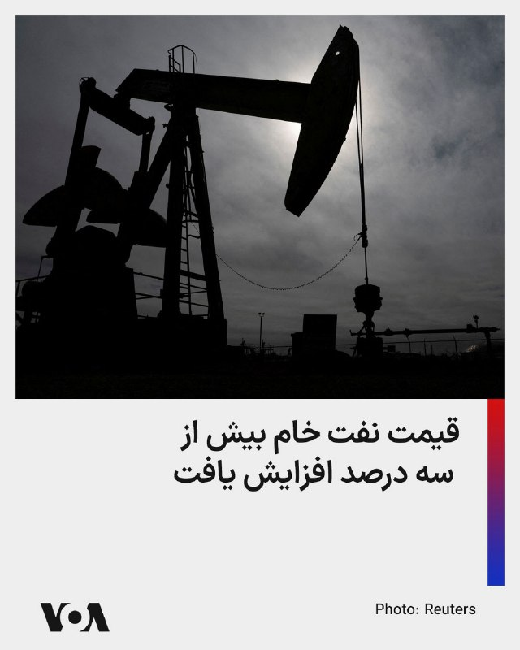

⚡️در پی به توافق نرسیدن ایالات متحده و جمهوری اسلامی، قیمت نفت خام در معاملات اولیه روز دوشنبه حدود ۳ دلار در هر بشکه افزایش یافت. به گزارش رویترز، قیمت نفت خام برنت، به بیش از ۱۰۴ دلار در هر بشکه رسید.
@FarsiVOA

## FarsiVOA — post 217394

🔺نتانیاهو: جنگ جهنم است؛ اسرائيل هر کاری بتواند می‌کند تا غیرنظامیان آسیب نبینند اما گاهی اوقات چاره‌ای نیست

▪️بنیامین نتانیاهو، نخست وزیر اسرائيل، در مصاحبه‌ای با شبکه آمریکایی سی‌بی‌اس گفت اسرائيل «هر کاری که بتواند» انجام می‌دهد تا از تلفات غیرنظامیان در طرف مقابل جلوگیری کند.

⬇️ بیشتر بخوانید:
https://ir.voanews.com/a/8148755.html
@FarsiVOA

## FarsiVOA — post 217393

  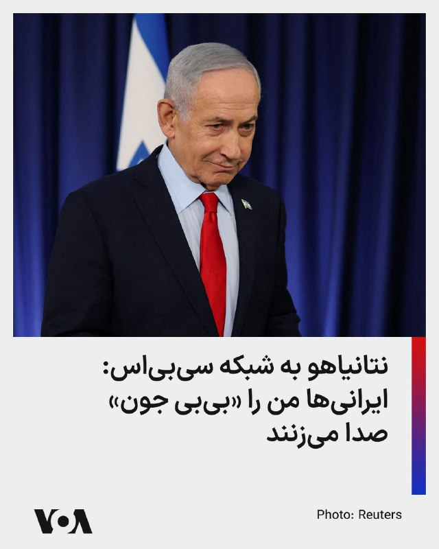

⚡️بنیامین نتانیاهو، نخست وزیر اسرائيل، در مصاحبه با شبکه خبری سی‌بی‌اس گفت مردم در ایران، خیابان‌هایی را به اسم او، و دونالد ترامپ، رئیس جمهوری آمریکا، نام‌گذاری کرده‌اند. آقای نتانیاهو به مجری برنامه «۶۰ دقیقه» این شبکه آمریکایی گفت که مردم او را به فارسی «بی‌بی جون» صدا می‌زنند.
@FarsiVOA

## FarsiVOA — post 217392

  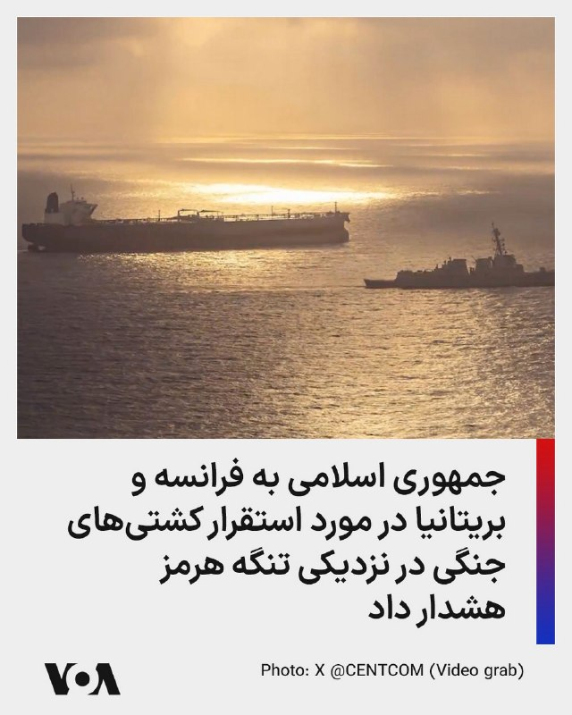

⚡️کاظم غریب‌آبادی، معاون وزیر خارجه جمهوری اسلامی، فرانسه و بریتانیا را تهدید کرد که اگر برای کمک به تلاش‌ها برای تامین امنیت تنگه هرمز، کشتی‌های جنگی خود را اعزام کنند، با «پاسخ قاطع و فوری» نیروهای مسلح جمهوری اسلامی مواجه خواهند شد. غریب‌آبادی در مورد تنگه هرمز، که یک آبراه بین المللی است، مدعی شد که «ملک مشاع قدرت‌های فرامنطقه‌ای» نیست و «تعیین ترتیبات حقوقی آن» حق جمهوری اسلامی است. پیشتر مایک والتز، سفیر آمریکا در سازمان ملل متحد، با اشاره به قطعنامه‌ای که آمریکا و متحدانش در خاورمیانه برای برقراری امنیت تنگه هرمز پیش می‌برند، گفت بیش از ۷۰ کشور پیش‌نویس این قطعنامه را امضا کرده‌اند.
@FarsiVOA

## FarsiVOA — post 217391

  

⚡️سناتور جمهوری‌خواه دیوید مک‌کورمیک، رئيس کمیته فرعی روابط خارجی در حوزه خاور نزدیک، در مصاحبه‌ای با فاکس نیوز که روز یکشنبه پخش شد گفت جمهوری اسلامی ایران باید در مذاکرات برای پایان دادن به جنگ «اورانیوم غنی‌شده، سلاح‌های هسته‌ای و مسیر به سوی سلاح‌های هسته‌ای خود را رهاکند.» او اشاره کرد که اگر توافقی حاصل نشود، خصومت‌های نظامی بین آمریکا و جمهوری اسلامی ادامه می‌یابد.
@FarsiVOA

## Persian_Trend_Official — post 13868

وی گفت هدف اصلی، دفاع از منافع و حقوق ملت ایران است و مردم باید شرایط دشوار اقتصادی و منطقه‌ای را با واقع‌بینی تحلیل کنند.

اظهارات پزشکیان در شرایطی مطرح می‌شود که بحث احتمال مذاکرات غیرمستقیم میان تهران و واشنگتن دوباره در رسانه‌های منطقه‌ای داغ شده است.

━━━━━━━━━━━━━━

🛰 #امنیت

◾️ وزارت اطلاعات: دو هسته وابسته به موساد متلاشی شدند

وزارت اطلاعات اعلام کرد دو شبکه تروریستی مرتبط با موساد شناسایی و منهدم شده‌اند و در جریان عملیات، یکی از عناصر این گروه‌ها کشته شده است.

جزئیات بیشتری از محل عملیات یا هویت افراد منتشر نشده اما نهادهای امنیتی ایران طی هفته‌های اخیر بارها از افزایش فعالیت‌های خرابکارانه در برخی استان‌ها خبر داده‌اند.

━━━━━━━━━━━━━━

💥 #چابهار

◾️ انفجار چابهار مربوط به خنثی‌سازی مهمات بود

سپاه شهرستان چابهار اعلام کرد صدای انفجار ظهر دیروز ناشی از انهدام مهمات عمل‌نکرده باقی‌مانده از جنگ بوده است. طبق این اطلاعیه، عملیات پاکسازی و خنثی‌سازی مهمات در روزهای آینده نیز ادامه خواهد داشت.

پس از انتشار ویدیوهای انفجار در شبکه‌های اجتماعی، شایعات مختلفی درباره حمله یا عملیات خرابکارانه مطرح شده بود که مسئولان آن را رد کردند.

━━━━━━━━━━━━━━
📌 @persian_trend_official
پرشین ترند | متفاوت‌ترین کانال نظامی

## Persian_Trend_Official — post 13867

☕️ #صبحانه_استراتژیک
📍 بولتن صبحگاهی پرشین ترند
🗓 ۲۱ اردیبهشت ۱۴۰۵

━━━━━━━━━━━━━━

🛢 #انرژی_و_ترانزیت

◾️ جنگ ایران، ترافیک کانال پاناما را ۲۰ درصد افزایش داد

فایننشال تایمز به نقل از مدیر کانال پاناما گزارش داد که از زمان آغاز درگیری‌ها در خلیج فارس، حجم عبور کشتی‌ها از این آبراه به شکل محسوسی افزایش یافته است. بسیاری از شرکت‌های کشتیرانی ترجیح داده‌اند برای کاهش ریسک عبور از منطقه خلیج فارس و دریای عمان، مسیرهای طولانی‌تر اما امن‌تر را انتخاب کنند.

تحلیلگران می‌گویند این مسئله نشان می‌دهد بحران خلیج فارس فقط یک بحران منطقه‌ای نیست و عملاً زنجیره جهانی انرژی و تجارت را تحت تأثیر قرار داده است. افزایش فشار روی کانال پاناما همچنین می‌تواند هزینه حمل‌ونقل جهانی را بالا ببرد.

━━━━━━━━━━━━━━

🚢 #تنگه_هرمز

◾️ اولین نفتکش قطری پس از آغاز جنگ از تنگه هرمز عبور کرد

شبکه الجزیره با استناد به داده‌های دریانوردی اعلام کرد نفتکش گاز «الخریطیات» بندر راس‌لفان قطر را ترک کرده و در مسیر پاکستان قرار دارد. این نخستین عبور ثبت‌شده یک نفتکش قطری از تنگه هرمز پس از آغاز بحران اخیر عنوان شده است.

کارشناسان معتقدند این حرکت می‌تواند نشانه‌ای از تلاش کشورهای حاشیه خلیج فارس برای سنجش وضعیت امنیتی مسیرهای انرژی باشد. بازار جهانی LNG همچنان نسبت به هرگونه تهدید در هرمز بسیار حساس است.

━━━━━━━━━━━━━━

🔥 #حادثه_دریایی

◾️ کشتی فله‌بر نزدیک قطر هدف قرار گرفت

سازمان عملیات تجارت دریایی بریتانیا (UKMTO) اعلام کرد یک کشتی فله‌بر در نزدیکی سواحل قطر هدف یک پرتابه ناشناس قرار گرفته است. طبق گزارش منتشرشده، آتش‌سوزی ایجادشده مهار شده و تلفات جانی ثبت نشده است.

خبرگزاری فارس مدعی شده این کشتی با پرچم آمریکا در حال تردد بوده است. هنوز هیچ گروهی مسئولیت این حمله را برعهده نگرفته اما این حادثه بار دیگر نگرانی‌ها درباره امنیت خطوط کشتیرانی منطقه را افزایش داده است.

━━━━━━━━━━━━━━

⚔️ #تحرکات_نظامی

◾️ ارتش: جابه‌جایی تجهیزات دشمن ادامه دارد

سخنگوی ارتش اعلام کرد کشورهای همراه با تحریم‌های آمریکا ممکن است در عبور از تنگه هرمز با مشکلاتی مواجه شوند. وی همچنین تأکید کرد که ایران در دوره آتش‌بس نیز روند به‌روزرسانی بانک اهداف و بازآرایی مواضع آفندی و پدافندی را ادامه داده است.

این اظهارات در شرایطی مطرح می‌شود که طی روزهای اخیر تصاویر متعددی از انتقال تجهیزات آمریکایی در منطقه، خصوصاً در پایگاه‌های قطر، بحرین و امارات منتشر شده است.

━━━━━━━━━━━━━━

🚤 #توان_دریایی_ایران

◾️ فایننشال تایمز: ایران بیش از هزار شناور بدون سرنشین دارد

این روزنامه بریتانیایی در گزارشی مدعی شد ایران اکنون بیش از ۱۰۰۰ قایق بدون سرنشین مجهز به موشک یا اژدر در اختیار دارد. همچنین تعداد قایق‌های تندرو هجومی ایران بین ۵۰۰ تا ۱۰۰۰ فروند برآورد شده است.

تحلیلگران غربی معتقدند تهران طی سال‌های اخیر تمرکز زیادی روی جنگ دریایی نامتقارن گذاشته و این شناورها می‌توانند در عملیات‌های ازدحامی علیه ناوهای بزرگ نقش‌آفرینی کنند.

━━━━━━━━━━━━━━

✈️ #نیروی_هوایی

◾️ ارتش: اف-۵ ها بازگشتند اما سوخو۲۴ آسیب دید

سخنگوی ارتش مدعی شد در روزهای ابتدایی جنگ، جنگنده‌های ایرانی مأموریت‌هایی علیه پایگاه‌های آمریکا در کویت، قطر و اربیل انجام داده‌اند. به گفته او جنگنده‌های اف-۵ سالم بازگشتند اما تعدادی از سوخو۲۴ ها در مسیر بازگشت هدف قرار گرفتند.

وی دلیل این موضوع را تقویت سامانه‌های پدافندی دشمن پس از موج اول حملات عنوان کرد. این نخستین‌بار است که جزئیاتی از عملکرد عملیاتی اف-۵ ها در این سطح مطرح می‌شود.

━━━━━━━━━━━━━━

🚨 #F35

◾️ جنگنده F-35 آمریکایی کد اضطراری ۷۷۰۰ ارسال کرد

روز گذشته یک فروند F-35 آمریکایی هنگام پرواز بر فراز دریای عمان کد اضطراری ۷۷۰۰ را مخابره کرد. این کد در هوانوردی به معنای وقوع وضعیت اضطراری عمومی است و معمولاً در شرایط نقص فنی یا تهدید ایمنی استفاده می‌شود.

هنوز جزئیات بیشتری درباره علت این وضعیت منتشر نشده اما این اتفاق در فضای شبکه‌های نظامی و رهگیری پروازها بازتاب گسترده‌ای داشته است.

━━━━━━━━━━━━━━

🌍 #دیپلماسی

◾️ پاکستان: به میانجیگری ادامه می‌دهیم

عاصم منیر، فرمانده ارتش پاکستان، اعلام کرد اسلام‌آباد تلاش می‌کند به‌صورت بی‌طرفانه برای کاهش تنش‌ها در خاورمیانه نقش‌آفرینی کند. او گفت پاکستان تمام تلاش خود را برای رسیدن به یک صلح پایدار به کار خواهد گرفت.

پاکستان طی هفته‌های اخیر تماس‌های متعددی با تهران، ریاض، واشنگتن و برخی کشورهای عربی داشته و تلاش می‌کند نقش میانجی فعال‌تری ایفا کند.

━━━━━━━━━━━━━━

🏛 #سیاست_داخلی

◾️ پزشکیان: مذاکره به معنای عقب‌نشینی نیست

رئیس‌جمهور تأکید کرد هرگونه بحث درباره مذاکره نباید به معنای تسلیم تعبیر شود.

## RadioFarda — post 157042

  <a href="https://t.me/radiofarda/157042">📎 Download file</a>

📻بشنوید: سرخط خبرها با رادیوفردا، ۲۱ اردیبهشت ۱۴۰۵‌

@RadioFarda

## BBCPersian — post 280722

  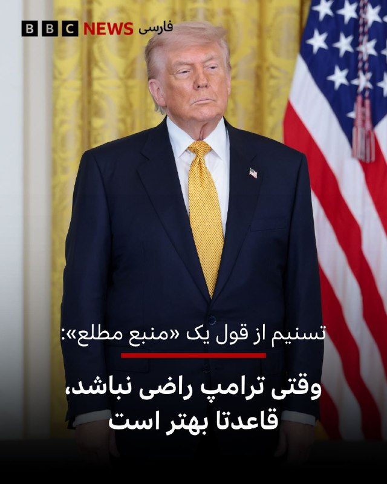

‌
اسماعیل بقایی، سخنگوی وزارت خارجه ایران، روز یکشنبه و پس از آن که اعلام شد تهران پاسخ خود به واشنگتن را تحویل مقامات در اسلام‌آباد داده است، گفت: در چنین روزی در سال ۵۳ قبل از میلاد، در نبرد حرّان، سردار بزرگ ایرانی، سورنا، با افراد و‌‌ تجهیزاتی کمتر، لژیون‌های مجهز روم را در جنگی نامتقارن در هم شکست؛ کراسوس، یکی از قدرتمندترین مردان روم، کشته و تصور شکست‌ناپذیری روم برباد رفت و رؤیای پیشروی آن به شرق فروپاشید. تاریخ، برای آنان که آن را نمی‌خوانند، و درس‌های آن را برنمی‌تابند، دوباره تکرار می‌شود.»

در همین حال، ساعتی بعد از اظهارات تند دونالد ترامپ و «کاملا غیرقابل قبول» خواندن پاسخ ایران، خبرگزاری تسنیم به نقل از یک «منبع مطلع» و ناشناس نوشت: «همین الان واکنش «به اصطلاح رئیس‌جمهور آمریکا» را به پاسخ ایران دیدیم. هیچ اهمیتی ندارد؛ کسی در ایران برای خوشایند ترامپ طرح نمی‌نویسد. تیم مذاکره‌کننده فقط برای حق ملت ایران باید طرح بنویسد و وقتی ترامپ از آن راضی نباشد، قاعدتا بهتر است. ترامپ کلا واقعیت را دوست ندارد؛ به همین دلیل مدام از ایران شکست می‌خورد.»

📸 Getty

https://bbc.in/4wllZ7N
@BBCPersian

## BBCPersian — post 280713

🖌ساکشی ونکاترامان و ربه‌کا پیدر:

🔻پنتاگون مجموعه اسنادی را که درباره بشقاب پرنده‌ها هستند و تاکنون دیده‌ نشده‌‌اند، منتشر کرده است. این اسناد شامل شرح مشاهده‌هایی است که هم توسط غیرنظامیان روی زمین و هم فضانوردان روی ماه گزارش شده‌اند.

این اسناد که چند دهه را در بر می‌گیرند، از طبقه‌بندی محرمانه خارج شدند و به دستور دونالد ترامپ، رئیس‌جمهور آمریکا، اینترنتی منتشر شدند. آقای ترامپ پیش‌تر گفته بود که این اسناد را «به دلیل علاقه عظیمی که نشان داده شده» منتشر خواهد کرد.

📸 Getty/ US DEPARTMENT OF DEFENSE

https://bbc.in/4uaMsDW
@BBCPersian

## BBCPersian — post 280712

  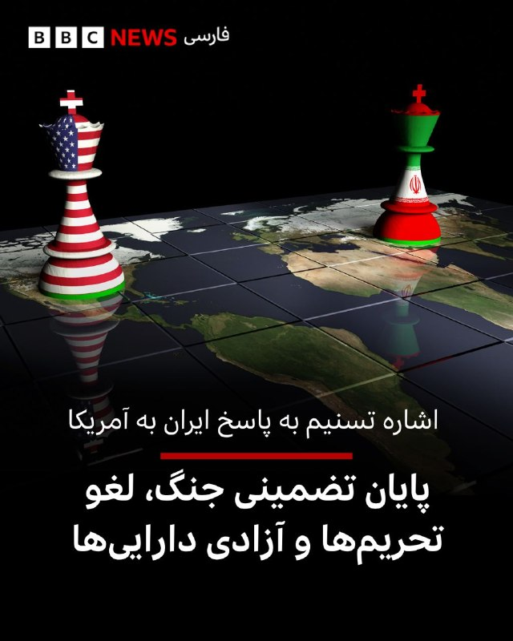

🔻خبرگزاری تسنیم - نزدیک به سپاه پاسداران - در واکنش به گزارش وال استریت ژونال که در آن پاسخ ایران به پیشنهادات آمریکا بررسی شده، نوشته است که یک منبع رسمی گفته «بخش‌هایی از آن - گزارش وال استریت ژورنال - ناظر بر واقعیت نیست».

تسنیم به نقل از این مقام که نام و سمت او منتشر نشده نوشته است: «متن ایران بر ضرورت پایان فوری جنگ و تضمین عدم تعرض مجدد به ایران، ضرورت لغو تحریمهای آمریکا، پایان جنگ در همه جبهه‌ها و مدیریت ایرانی تنگه هرمز در صورت انجام برخی تعهدات از طریق آمریکا تاکید دارد.»

تسنیم به بازه زمانی ۳۰ روزه‌ای در پیشنهاد ایران اشاره کرده که در آن تهران خواستار «آزادی دارایی های بلوکه شده با تفاهم اولیه» شده و همچنین پایان محاصره دریایی «بلافاصله بعد از امضای تفاهم اولیه» مطرح شده است.

📸 Getty

https://bbc.in/4d3t59I
@BBCPersian

## BBCPersian — post 280711

🔻خبرگزاری صدا و سیما: آمریکا باید حاکمیت ایران بر تنگه هرمز را به رسمیت بشناسد

خبرگزاری صدا و سیما جمهوری اسلامی در شبکه اجتماعی ایکس مدعی شده بخشی از پاسخ ایران به آمریکا که روز یکشنبه از طریق پاکستان منتقل شد حاوی مفاد زیر است:

پرداخت خسارات جنگی به ايران از سوی ايالات متحده امريکا

به رسميت شناختن حاکميت ايران بر تنگه هرمز

پايان تحريم‌های امريکا عليه ايران

آزادسازی دارايی‌های مسدودشده ايران توسط امريکا

وزارت خارجه ایران یا نهادهای رسمی حکومتی در این کشور هنوز درباره جزییات این پاسخ به آمریکا واکنشی نشان نداده‌اند اما دونالد ترامپ، عصر یکشنبه در اظهاراتی تند گفت پاسخ تهران را خوانده و از نظر او «کاملا غیرقابل قبول است».

https://bbc.in/4d3t59I
@BBCPersian

## BBCPersian — post 280703

🖌سمیر هاشمی, خبرنگار اقتصادی، بی‌بی‌سی عربیدر,دوبی:

🔻در اوایل دهه ۱۹۹۰ میلادی، قطر با بحران اقتصادی روبه‌رو بود. بدهی‌‌های بالا و درآمدهای دولتی پایین، فشار سنگینی بر بودجه عمومی وارد می‌کرد. برای تغییر مسیر اقتصاد، این کشور کوچک خلیج فارس تصمیم گرفت روی گاز طبیعی سرمایه‌گذاری کند؛ تصمیمی سرنوشت‌ساز که بعدها اقتصاد قطر را متحول کرد.

قطر توسعه ذخایر عظیم گازی دریایی خود را آغاز کرد و مهم‌تر از آن، فناوری سردسازی گاز تا دماهای بسیار پایین را به کار گرفت تا آن را به گاز طبیعی مایع تبدیل کند؛ سوختی که می‌توان آن را با کشتی به کشورهای سراسر جهان صادر کرد.

این تصمیم منجر به ایجاد شهر صنعتی راس لفان در ساحل قطر، در حدود ۹۰ کیلومتری دوحه، شد. طی سه دهه بعد، راس لفان به بزرگ‌ترین مرکز صادرات گاز طبیعی مایع در جهان تبدیل شد و نقش مهمی در تبدیل قطر به یکی از ثروتمندترین کشورهای دنیا ایفا کرد.

اما در ۱۸ مارس، این داستان سرشار از موفقیت، با ضربه‌ای جدی روبه‌رو شد.

https://bbc.in/4dAEv4N
@BBCPersian

---
📅 بروزرسانی: 1405/02/21 03:42
---

## VahidOOnLine — post 239425

  

درور بالازاده، تحلیلگر ایران در کانال ۱۴ اسرائیل، گزارش داد که جمهوری اسلامی به‌رغم اطلاع از این موضوع که مقداری از نفت استخراجی به دریا نشت می‌کند، از نفتکش‌های قدیمی استفاده می‌کند.

او با استناد به «اطلاعات به‌دست‌آمده»، گفت رژیم ایران همچنان به پمپاژ نفت به نفتکش‌هایی که دهه‌ها مورد استفاده قرار نگرفته‌اند، به‌رغم مشکلات شدید نشت نفت، ادامه می‌دهد، زیرا از اینکه توقف تولید به چاه‌های نفت آسیب برساند، نگران است.

بالازاده همچنین به نقل از «منابع خود» گفت: «چهره‌های داخل صنعت نفت ایران پس از درک شدت بحران ایجاد شده توسط محاصره دریایی، در حال بررسی راه‌هایی برای خروج از کشور هستند.»
‌🏁 🇬🇧 IranintlTV

🤖 @VahidOOnLine

## VahidOOnLine — post 239424

  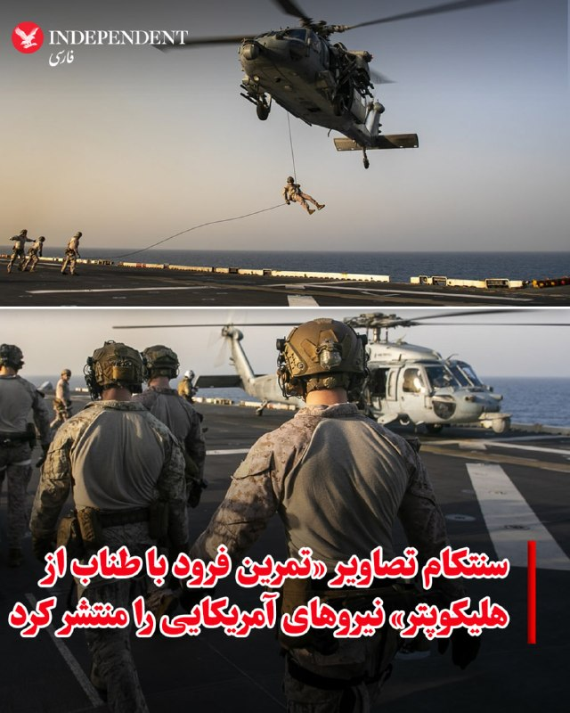

♦️ستاد فرماندهی مرکزی ایالات متحده، سنتکام، روز یکشنبه با انتشار تصاویری از تمرینات نظامی نیروهای آمریکایی، بر آمادگی رزمی تفنگداران دریایی برای اجرای ماموریت‌های حساس در جریان محاصره دریایی ایران تاکید کرد. سنتکام در اکس نوشت: «تفنگداران دریایی ایالات متحده در حال تمرین فرود با طناب از هلیکوپتر بر روی عرشه پرواز ناو یو‌اس‌اس تریپولی هستند. این تمرینات تضمین می‌کند که نیروهای ما در صورت فراخوانده شدن برای ورود به کشتی‌های متخلف در جریان محاصره ایران، در آمادگی کامل باقی بمانند.»
‌🇸🇦 Indypersian

🤖 @VahidOOnLine

## VahidOOnLine — post 239415

بیش از ۳۶ هزار نام در این فهرست ثبت شده؛
اما هیچ کلامی نمی‌تواند توضیح بدهد که هر کدام از این جوانان چه کسی بودند و نبودنشان چه چیزی را از این سرزمین کم کرد.
یکی سرطان را شکست داده بود،
یکی دانشجوی مکانیک بود،
یکی مربی ورزش،
یکی کارگر انبار،
و یکی هنوز با رویای آینده درس می‌خواند.
عسل شاکری، محمدرضا سیفی، عرشیا رضایی، محمدحسین پایدار حسینی، سیدامیر رستمیان، علیرضا قسیمی، کامران (مهدی) احمدی و فاطمه (لونا) کرمانی‌نژاد
جاویدنامان انقلاب ملی ایرانیان؛
نام‌هایی که هر کدام، یک زندگی و یک رویای ناتمام بودند.
#جاویدنامان_انقلاب_ملی_ایرانیان
‌🏁 🇬🇧 IranintlTV

🤖 @VahidOOnLine

## VahidOOnLine — post 239414

  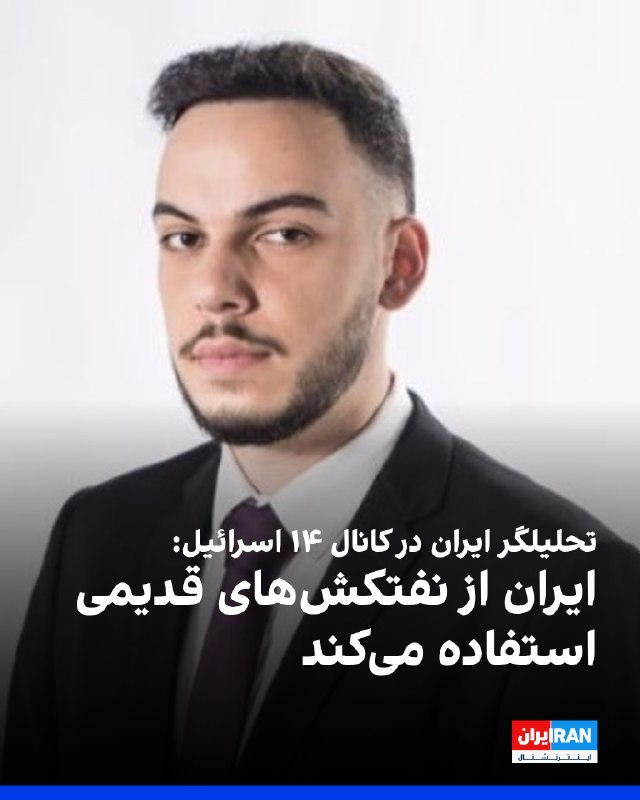

درور بالازاده، تحلیلگر ایران در کانال ۱۴ اسرائیل، گزارش داد که جمهوری اسلامی به‌رغم اطلاع از این موضوع که مقداری از نفت استخراجی به دریا نشت می‌کند، از نفتکش‌های قدیمی استفاده می‌کند.

او با استناد به «اطلاعات به‌دست‌آمده»، گفت رژیم ایران همچنان به پمپاژ نفت به نفتکش‌هایی که دهه‌ها مورد استفاده قرار نگرفته‌اند، به‌رغم مشکلات شدید نشت نفت، ادامه می‌دهد، زیرا از اینکه توقف تولید به چاه‌های نفت آسیب برساند، نگران است.

بالازاده همچنین به نقل از «منابع خود» گفت: «چهره‌های داخل صنعت نفت ایران پس از درک شدت بحران ایجاد شده توسط محاصره دریایی، در حال بررسی راه‌هایی برای خروج از کشور هستند.»
‌🏁 🇬🇧 IranintlTV

🤖 @VahidOOnLine

## VahidOOnLine — post 239413

  

♦️به گزارش «عرب‌نیوز»، شرکت «آرامکو»، غول نفتی عربستان سعودی، روز یکشنبه از جهش ۲۵ درصدی سود خود در سه ماهه نخست سال جاری خبر داد. این موفقیت مالی در حالی به دست آمده که تنش‌ها در تنگه هرمز، صادرات انرژی را با بحران جدی روبه‌رو کرده است، اما آرامکو با بهره‌گیری حداکثری از ظرفیت «خط لوله شرق به غرب» خود، موفق شد نفت را بدون عبور از این آبراهِ مسدود شده، به دریای سرخ و بازارهای جهانی برساند. امین ناصر، مدیرعامل آرامکو، با اعلام سود ۳۲.۵ میلیارد دلاری برای این دوره، تاکید کرد که خط لوله استراتژیک این کشور اکنون با حداکثر ظرفیت یعنی روزانه ۷ میلیون بشکه فعالیت می‌کند تا بخشی از شوک جهانی انرژی ناشی از جنگ با ایران را جبران کند.
‌🇸🇦 Indypersian

🤖 @VahidOOnLine

## VahidOOnLine — post 239412

  <a href="telegram/content/VahidOOnLine_239412_1778458351.mp4">🎬 Download video</a>

ویدیوهای منتشرشده در شبکه‌های اجتماعی، به همراه تصاویر دریافتی، نشان می‌دهد یکی از حامیان جمهوری اسلامی روز یک‌شنبه ۲۰ اردیبهشت وارد تجمع ضدحکومتی ایرانیان در تورنتو شده و سپس پرچم جمهوری اسلامی را برافراشته و تکان می‌دهد.
بر اساس گزارش‌های منتشرشده، در پی این حمله، دست‌کم یک نفر زخمی شده و به چندین خودرو آسیب وارد شده است.

عکس از پیمان خواجه‌حسنی، خبرنگار
‌🏁 🇬🇧 IranintlTV

🤖 @VahidOOnLine

## VahidOOnLine — post 239411

  

فرماندهی مرکزی ایالات متحده، ‌سنتکام، نوشت که تمرین‌‌های تفنگداران دریایی آمریکا تضمین می‌کند که آن‌ها در صورت فرا خوانده شدن برای پیاده شدن بر عرشه کشتی‌‌های متخلف در طول محاصره ایران توسط ایالات متحده آماده باشند.

سنتکام در این ارتباط، تصاویری از تمرین‌های تفنگداران دریایی بر روی عرشه ناو تریپولی را در شبکه اجتماعی ایکس منتشر کرد.
‌🏁 🇬🇧 IranintlTV

🤖 @VahidOOnLine

## VahidOOnLine — post 239410

  

♦️وال استریت ژورنال در گزارشی درباره غیبت طولانی مجتبی خامنه‌ای که سومین رهبر نظام معرفی شده، به سکوت او درباره مساله هسته‌ای اشاره کرد و نوشت در حالی که بحث مذاکره و توافق با آمریکا مطرح است، در بیانیه‌های منتسب به رهبر جدید نظام هیچ اشاره ای به موضوع هسته‌ای نشده است. علی خامنه‌ای، پدر کشته شده او نیز اغلب در موضوعات مهم از جمله مساله هسته‌ای موضعی مبهم اتخاذ می‌کرد. رویکردی که برخی آن را به تلاش رهبر سابق جمهوری اسلامی برای نپذیرفتن مسئولیت تصمیم‌گیری‌های مهم ارتباط می‌دادند. وال استریت ژورنال بااشاره به جراحت‌های شدید مجتبی خامنه‌ای در حمله دو ماه پیش که پدر، پسر و همسرش را کشت، می‌نویسد: از آن زمان تاکنون، تنها چیزی که از او شنیده شده، پیام‌هایی منتسب به مجتبی خامنه‌ای و تصاویری است که با هوش مصنوعی تولید یا دستکاری شده‌اند. این روزنامه آمریکایی در ادامه، نبود مجتبی خامنه‌ای را مشکلی برای نظام و طرفدارانش توصیف می‌کند و به نقش روح‌الله خامنه‌ای در نوشیدن جام زهر در اواخر دهه ۶۰ و نقش علی خامنه‌ای در نرمش قهرمانانه منتهی به برجام اشاره می‌کند. وال استریت ژورنال می‌نویسد: مقام‌های جمهوری اسلامی حتی یک فایل صوتی تازه از رهبر جدید نظام منتشر نکرده‌اند؛ کاری که رهبر پیشین نظام گاهی هنگام تهدیدهای امنیتی انجام می‌داد. بسیاری اکنون می‌پرسند آیا او اصلا زنده است یا نه. این در حالی است که محتوای پیام‌های منتسب به او نیز آن‌قدر کلی بوده که حتی حامیانش، تردید دارند خامنه‌ای نقشی در نگارش آن‌ها داشته باشد. مقامات جمهوری اسلامی در روزهای اخیر تلاش کرده‌اند ادعا‌هایی را درباره دیدار با او مطرح کنند یا اطلاعاتی درباره میزان جراحتش ارایه دهند اما به نوشته وال استریت ژورنال، این اقدامات نیز نتوانسته تردید‌ها را درباره وضعیت مجتبی خامنه‌ای از بین ببرد.
‌🇸🇦 Indypersian

🤖 @VahidOOnLine

## pm_afshaa — post 90523

  <a href="telegram/content/pm_afshaa_90523_1778458355.jpg">🎬 Download video</a>

🔴نتانیاهو: مجتبی خامنه‌ای احتمالا زندست ولی آسیب دیده و وضعیتش مشخص نیست.

من فکر میکنم او سعی میکنه قدرت خودش رو اعمال کنه. من فکر نمی‌کنم ایشون همون اختیاراتی رو که پدرش داشت، داشته باشه. این هم باعث ایجاد اختلال در آن رژیم میشه، و من فکر نمی‌کنم چیز بدی باشه.

💧 Rainbet.com the #1 Non-KYC Crypto Casino & Sportsbook @rainbetcom

😁 @Pm_Afshaa

## pm_afshaa — post 90522

🔴نتانیاهو:اگر رژیم ایران سقوط کند، به معنای پایان حزب‌الله، حماس و احتمالاً حوثی‌ها نیز خواهد بود

💧 Rainbet.com the #1 Non-KYC Crypto Casino & Sportsbook @rainbetcom

😁 @Pm_Afshaa

## pm_afshaa — post 90521

کانفینگ با سرعت موشک شارژ کردم هر کی خواست بیاد دایرکت چنل هم پرداخت ریالی داریم هم ارزی 5 گیگ 1800 10 گیگ 3200

## pm_afshaa — post 90520

کانفینگ با سرعت موشک شارژ کردم

هر کی خواست بیاد دایرکت چنل

هم پرداخت ریالی داریم هم ارزی

5 گیگ 1800
10 گیگ 3200

## iaghapour — post 2598

✍ حدودا 500 پیام بررسی نشده از 2 روز پیش داریم که پشتیبانی تا فردا همه رو بررسی میکنه.

جدا از بحث بالا، از ته دل آرزو میکنم تو این روزهای عجیب و غریبی که داریم می‌گذرونیم، حال دلتون خوب باشه. می‌بینیم و حس میکنم که زندگی چقدر برای خیلی‌ها سخت شده و دغدغه‌ها چقدر زیادن.

امیدواریم هرچه زودتر این روزهای سخت جاشون رو به روزهای روشن‌تری بدن. هوای خودتون و دلتون رو داشته باشید.

## IranIntlTV — post 336561

  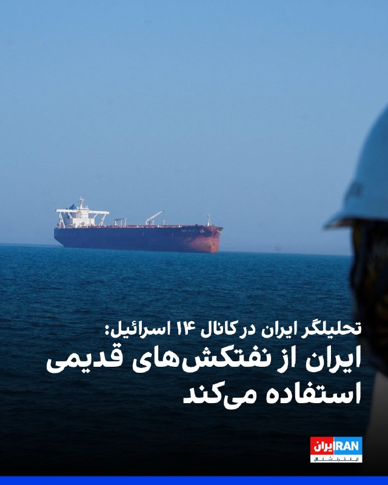

درور بالازاده، تحلیلگر ایران در کانال ۱۴ اسرائیل، گزارش داد که جمهوری اسلامی به‌رغم اطلاع از این موضوع که مقداری از نفت استخراجی به دریا نشت می‌کند، از نفتکش‌های قدیمی استفاده می‌کند.

او با استناد به «اطلاعات به‌دست‌آمده»، گفت رژیم ایران همچنان به پمپاژ نفت به نفتکش‌هایی که دهه‌ها مورد استفاده قرار نگرفته‌اند، به‌رغم مشکلات شدید نشت نفت، ادامه می‌دهد، زیرا از اینکه توقف تولید به چاه‌های نفت آسیب برساند، نگران است.

بالازاده همچنین به نقل از «منابع خود» گفت: «چهره‌های داخل صنعت نفت ایران پس از درک شدت بحران ایجاد شده توسط محاصره دریایی، در حال بررسی راه‌هایی برای خروج از کشور هستند.»
https://iranintl.com/202605104249

## IranIntlTV — post 336552

بیش از ۳۶ هزار نام در این فهرست ثبت شده؛
اما هیچ کلامی نمی‌تواند توضیح بدهد که هر کدام از این جوانان چه کسی بودند و نبودنشان چه چیزی را از این سرزمین کم کرد.
یکی سرطان را شکست داده بود،
یکی دانشجوی مکانیک بود،
یکی مربی ورزش،
یکی کارگر انبار،
و یکی هنوز با رویای آینده درس می‌خواند.
عسل شاکری، محمدرضا سیفی، عرشیا رضایی، محمدحسین پایدار حسینی، سیدامیر رستمیان، علیرضا قسیمی، کامران (مهدی) احمدی و فاطمه (لونا) کرمانی‌نژاد
جاویدنامان انقلاب ملی ایرانیان؛
نام‌هایی که هر کدام، یک زندگی و یک رویای ناتمام بودند.
#جاویدنامان_انقلاب_ملی_ایرانیان

## IranIntlTV — post 336550

  <a href="telegram/content/IranIntlTV_336550_1778458357.mp4">🎬 Download video</a>

ویدیوهای منتشرشده در شبکه‌های اجتماعی، به همراه تصاویر دریافتی، نشان می‌دهد یکی از حامیان جمهوری اسلامی روز یک‌شنبه ۲۰ اردیبهشت وارد تجمع ضدحکومتی ایرانیان در تورنتو شده و سپس پرچم جمهوری اسلامی را برافراشته و تکان می‌دهد.
بر اساس گزارش‌های منتشرشده، در پی این حمله، دست‌کم یک نفر زخمی شده و به چندین خودرو آسیب وارد شده است.

عکس از پیمان خواجه‌حسنی، خبرنگار

## IranIntlTV — post 336549

  

فرماندهی مرکزی ایالات متحده، ‌سنتکام، نوشت که تمرین‌‌های تفنگداران دریایی آمریکا تضمین می‌کند که آن‌ها در صورت فرا خوانده شدن برای پیاده شدن بر عرشه کشتی‌‌های متخلف در طول محاصره ایران توسط ایالات متحده آماده باشند.

سنتکام در این ارتباط، تصاویری از تمرین‌های تفنگداران دریایی بر روی عرشه ناو تریپولی را در شبکه اجتماعی ایکس منتشر کرد.
https://iranintl.com/202605106827

## FarsiVOA — post 217390

⚡️ایران، زندگی شهروندان میان خاموشی اینترنت و نهیب شبانه «حیدر حیدر»
@FarsiVOA

## FarsiVOA — post 217389

⚡️وضعیت رسانه‌ها در افغانستان و ایران؛ از بازداشت خبرنگاران تا قطع اینترنت و سانسور رسانه‌ای
@FarsiVOA

## FarsiVOA — post 217388

⚡️نگرانی‌ها از وقوع همه‌گیری ویروس مرگبار هانتا و نشانه‌های بیماری؛ گفت‌وگو با دکتر کیوان زندی
@FarsiVOA

## FarsiVOA — post 217387

⚡️افشای عملیات اسرائیل در خاک عراق و فشار واشنگتن برای پایان‌ نفوذ جمهوری اسلامی در دولت جدید
@FarsiVOA

## FarsiVOA — post 217386

⚡️چرا جمهوری اسلامی به‌رغم برقراری آتش‌بس به حملات خود به کشورهای منطقه ادامه می‌دهد
@FarsiVOA

## BBCPersian — post 280702

پایان پوشش زنده...

با ورود به بامداد دوشنبه - ۲۱ اردیبهشت - پوشش زنده ما هم در صفحه جدید این روز ادامه خواهد یافت.

لطفا برای مرور تحولات روز یکشنبه به پایین همین صفحه بروید و آخرین تحولات از جمله ارسال پاسخ ایران به آمریکا و واکنش تند رئیس جمهور این کشور به این پاسخ را بخوانید.

https://bbc.in/49HMElB
@BBCPersian

## BBCPersian — post 280701

  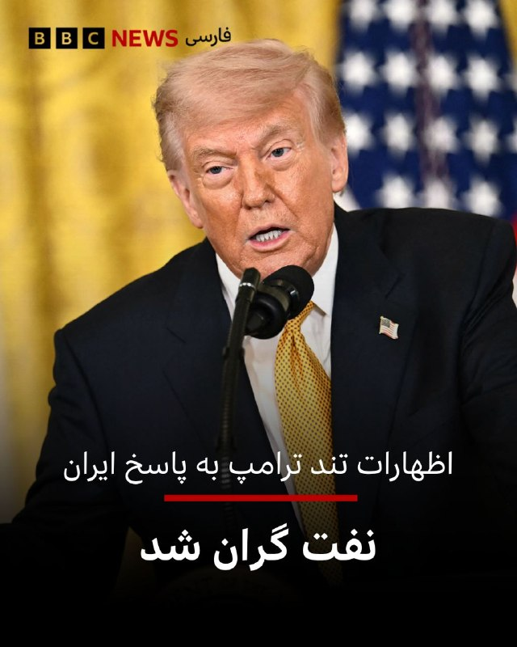

🔻اظهارات تند دونالد ترامپ درباره ایران و پاسخ این کشور به پیشنهادهای او خیلی زود بر بازارهای نفتی آسیا در صبح دوشنبه تاثیر گذاشت و موجب افزایش حدود ۳ درصدی آن شد.

نفت برنت شمال صبح دوشنبه به بهای ۱۰۴/۰۹ دلار در بشکه رسید.

📸 Getty

https://bbc.in/49HMElB
@BBCPersian

## BBCPersian — post 280700

  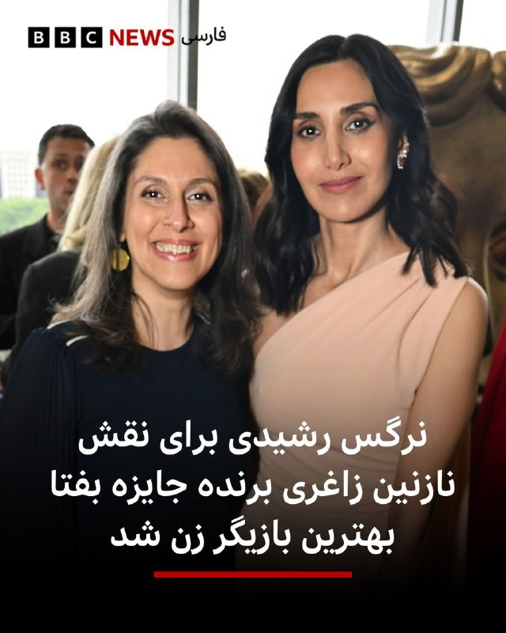

🔻نرگس رشیدی، بازیگر ایرانی - آلمانی که در ایران متولد شده است، برای بازی در نقش نازنین زاغری-رتکلیف در سریال درام «زندانی ۹۵۱» شبکه بی‌بی‌سی وان، که بر اساس زندگی واقعی ساخته شده است، جایزه بهترین بازیگر زن نقش اول را از آن خود کرد.

این سریال روایتی مستند از تجربه خانم زاغری است: از لحظه بازداشت او در فرودگاه تهران تا آزادی‌اش ۶ سال پس از آن و بازگشتش به بریتانیا.

این مستند بر اساس کتابی است که خانم زاغری از خاطرات زندانی شدنش در ایران نوشته است.

نرگس رشیدی این جایزه را به نازنین زاغری-رتکلیف که شش سال در تهران زندانی بود و خانواده‌اش تقدیم کرد و در این مراسم گفت: «مقاومت، وقار و عشق شما در شرایط غیرممکن، همه ما را تحت تأثیر قرار داده است.»

شجاعت تو تا آخر عمر با من خواهد ماند. این برای توست.

خانم زاغری رتکلیف در سال ۲۰۱۶ توسط سپاه پاسداران به اتهام جاسوسی دستگیر شد، اتهامی که او آن را همیشه رد کرده است. او در مارس ۲۰۲۲ و پس از پیگیری‌های مداوم همسرش ریچارد رتکلیف آزاد شد.

📸 Getty

https://bbc.in/49HMElB
@BBCPersian

---
📅 بروزرسانی: 1405/02/21 02:43
---

## VahidOOnLine — post 239409

  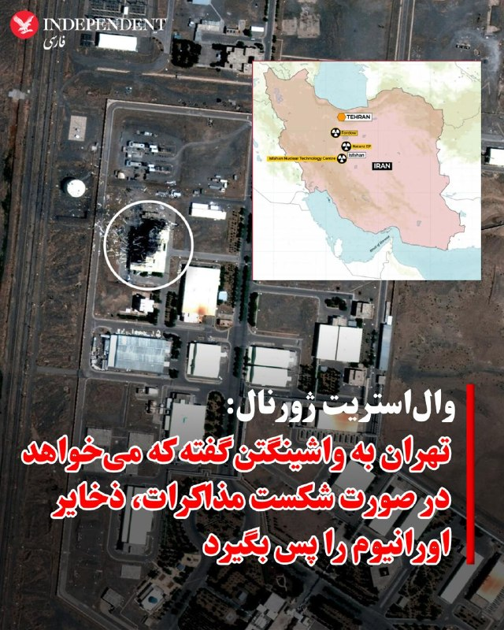

♦️درحالی که دونالد ترامپ، پاسخ تهران به پیشنهاد آمریکا را که پس از ۱۰ روز ارسال شده، «کاملا غیرقابل قبول» توصیف کرده است، وال استریت ژورنال جزئیاتی از این پاسخ را به نقل از منابع آگاه، روایت کرده است. این روزنامه آمریکایی می نویسد، تهران به‌طور رسمی پاسخی چندصفحه‌ای به آخرین پیشنهاد آمریکا برای پایان دادن به جنگ ارسال کرده و در آن خواسته‌های خود را با جزئیات مطرح کرده است؛ پاسخی که به گفته افراد مطلع، همچنان شکاف‌هایی میان دو طرف باقی می‌گذارد.
به گفته این منابع، پاسخ جدید مسئله اصلی مورد مطالبه آمریکا یعنی دریافت تعهدات قبلی درباره سرنوشت برنامه هسته‌ای ایران و ذخایر اورانیوم با غنای بالای آن را حل نمی‌کند. در عوض، تهران پیشنهاد داده است که همزمان با لغو محاصره کشتی‌ها و بنادر ایران از سوی آمریکا، جنگ متوقف شود و تنگه هرمز به‌تدریج به روی رفت‌وآمد تجاری باز شود.
این منابع گفتند مسائل هسته‌ای طی ۳۰ روز آینده مذاکره خواهد شد. به گفته آن‌ها، ایران پیشنهاد داده بخشی از اورانیوم با غنای بالای خود را رقیق کند و بقیه به کشور ثالث منتقل شود.
به گفته این افراد، پاسخ تهران که به میانجی‌‌های پاکستان تحویل داده و سپس به واشینگتن منتقل شده، شامل درخواست تضمین‌هایی است که در صورت شکست مذاکرات یا خروج بعدی آمریکا از توافق، اورانیوم منتقل‌شده دوباره به ایران بازگردانده شود.
آن‌ها افزودند ایران همچنین اعلام کرده حاضر است غنی‌سازی اورانیوم را تعلیق کند، اما برای دوره‌ای کوتاه‌تر از توقف ۲۰ ساله‌ای که آمریکا پیشنهاد داده است. به گفته این منابع، رژیم ایران با برچیدن تاسیسات هسته‌ای خود مخالفت کرده است.
تسنیم، وابسته به سپاه پاسداران، به نقل از یک «منبع آگاه» گزارش داد که روایت روزنامه وال‌استریت ژورنال درباره پیشنهادهای ایران در زمینه مواد هسته‌ای «صحت ندارد.»
گزارش تسنیم می‌گوید رژیم ایران خواستار لغو تحریم‌های دفتر کنترل دارایی‌های خارجی آمریکا علیه فروش نفت ایران در دوره پیشنهادی ۳۰ روزه شده است. جمهوری اسلامی همچنین خواهان آزادسازی دارایی‌های مسدودشده خود در خارج از کشور است.
‌🇸🇦 Indypersian

🤖 @VahidOOnLine

## VahidOOnLine — post 239408

  <a href="telegram/content/VahidOOnLine_239408_1778454814.mp4">🎬 Download video</a>

گردهمایی ایرانیان سانفرانسیسکو
‌🏁 🇬🇧 ManotoTV

🤖 @VahidOOnLine

## VahidOOnLine — post 239407

  <a href="telegram/content/VahidOOnLine_239407_1778454816.mp4">🎬 Download video</a>

گردهمایی ایرانیان هامبورگ
‌🏁 🇬🇧 ManotoTV

🤖 @VahidOOnLine

## VahidOOnLine — post 239406

  <a href="telegram/content/VahidOOnLine_239406_1778454819.mp4">🎬 Download video</a>

نیکوزیا|قبرس؛ راهپیمایی و گردهمایی ایرانیان
‌🏁 🇬🇧 ManotoTV

🤖 @VahidOOnLine

## VahidOOnLine — post 239405

  

جیسون برادسکی، مدیر سیاست‌گذاری اتحاد علیه ایران هسته‌ای، در مورد تماس تلفنی دونالد ترامپ و بنیامین نتانیاهو در مورد پاسخ جمهوری اسلامی نوشت: «تغییر وضع موجود ضروری است. محاصره لازم است، اما کافی نیست.»

او در شبکه اجتماعی ایکس تاکید کرد ترکیب محاصره با اقدام نظامی مهم خواهد بود.

برادسکی همچنین اشاره کرد: «برخلاف تصوری که رسانه‌ها و برخی مفسران ایجاد کرده‌اند، رییس‌جمهور همچنان نشان می‌دهد که به هیچ توافقی با رژیم ایران، صرف نظر از شرایط، مشتاق نیست. اگر او واقعا برای هر توافقی مشتاق بود، مدت‌ها پیش توافقی حاصل شده بود.»
‌🏁 🇬🇧 IranintlTV

🤖 @VahidOOnLine

## VahidOOnLine — post 239404

  

سناتور لیندزی گراهام در واکنش به گمانه‌زنی‌ها درباره توافق احتمالی با ایران، در حساب کاربری خود در شبکه ایکس نوشت

او تأکید کرد تعلیق موقت غنی‌سازی بدون نابودی کامل زیرساخت‌ها و توانمندی‌ها، عملاً بازگشت به توافق برجام خواهد بود.

گراهام افزود هرگونه مخالفت تهران با برچیدن کامل ظرفیت غنی‌سازی از سوی آمریکا «قاطعانه رد خواهد شد». او در بخش دیگری از پیام خود از حمایت دونالد ترامپ قدردانی کرد و آن را برای خود «بسیار ارزشمند» خواند.

گراهام گفت به اعتماد ترامپ، چه به‌عنوان سناتور و چه به‌عنوان دوست، افتخار می‌کند و از همراهی با او در آنچه «بزرگ‌ترین بازگشت سیاسی در تاریخ آمریکا» توصیف کرد، ابراز خرسندی کرد.

وی همچنین تأکید کرد در سنای آمریکا برای پیشبرد دستورکار ترامپ جهت «امن‌تر و ثروتمندتر کردن آمریکا» تلاش خواهد کرد.
‌🏁 🇬🇧 IranintlTV

🤖 @VahidOOnLine

## VahidOOnLine — post 239403

  

♦️بنیامین نتانیاهو، نخست‌وزیر اسرائیل در مصاحبه با برنامه ۶۰‌ دقیقه سی‌بی‌اس در پاسخ به مجری که از او پرسید چه طرحی را برای خارج کردن ذخایر اورانیوم غنی‌شده از ایران متصور است گفت: باید نیروها وارد شوند و ذخایر را بردارند و از ایران بیرون ببرند. او گفت که در دیدار اخیر با دونالد ترامپ، رئیس‌جمهوری آمریکا به او گفته است که می‌خواهد نیروها را وارد کند و این کار را به طور فیزیکی انجام دهد. نتانیاهو گفت اگر توافقی باشد و نیروها بتوانند براساس آن وارد شوند و ذخایر را خارج کنند، مشکلی نیست. نخست‌وزیر اسرائیل در پاسخ به مجری که از او پرسید اگر توافقی در کار نباشد، آیا از نیروی زمینی استفاده می‌شود؟ گفت: در مورد برنامه‌ها و طرح‌های نظامی صحبت نمی‌کند. او همچنین گفت که بازه زمانی را نیز در این مورد ارایه نمی‌دهد. نتانیاهو این ماموریت را «به‌شدت مهم» توصیف کرد. او در همین بخش مصاحبه تاکید کرد که برنامه هسته‌ای ایران به دلیل حمله‌ها آسیب دیده اما هنوز همه ظرفیت غنی‌سازی از بین نرفته و تاسیسات غنی‌سازی باید برچیده شوند. او همچنین به نیروهای نیابتی جمهوری اسلامی اشاره کرد و آن را یکی دیگر از مشکلات باقی‌مانده درباره رژیم ایران توصیف کرد.
‌🇸🇦 Indypersian

🤖 @VahidOOnLine

## pm_afshaa — post 90517

پرداخت کارتیم از فردا اکی میکنم همکاریم بالا 100 گیگ موجوده

## pm_afshaa — post 90516

امستردام هلند

💧 Rainbet.com the #1 Non-KYC Crypto Casino & Sportsbook @rainbetcom

😁 @Pm_Afshaa

## pm_afshaa — post 90515

بدون قطعی خودمم پشتیبانی میکنم سرورارو فقطم پرداختش با ارز دیجیتاله

## pm_afshaa — post 90514

کانفینگ با سرعت موشک گیر اوردم فقط 10 گیگ و 5 گیگ موجوده هر کی خواست بیاد دایرکت چنل

## pm_afshaa — post 90513

کانفینگ با سرعت موشک گیر اوردم
فقط 10 گیگ و 5 گیگ موجوده هر کی خواست بیاد دایرکت چنل

## pm_afshaa — post 90511

دونالد ترامپ پست جدیدی در تروث خود از صحبت های مارک لوین با محتوای ضرورت آموزش نظامی مردم ایران ( گارد جاویدان ) را منتشر کرد.

💧 Rainbet.com the #1 Non-KYC Crypto Casino & Sportsbook @rainbetcom

😁 @Pm_Afshaa

## pm_afshaa — post 90510

🔴مارک فاکس، معاون سابق فرماندهی مرکزی آمریکا : آتش‌بس با ایران به اسرائیل اجازه داد تا ذخایر مهمات خودشو دوباره پر کنه و اطلاعات بیشتری جمع‌آوری کنه

💧 Rainbet.com the #1 Non-KYC Crypto Casino & Sportsbook @rainbetcom

😁 @Pm_Afshaa

## kianmeli1 — post 87339

‏🔴العربیه: قیمت جهانی نفت با سه درصد افزایش، جهش کرد و نفت برنت پس از اظهارات دونالد ترامپ درباره «غیرقابل قبول بودن پاسخ ایران» بالای ۱۰۴ دلار در هر بشکه معامله شد
https://t.me/kianmeli1

## kianmeli1 — post 87338

🔴صدا و سیما

ایران آخرین پیشنهاد آمریکا را رد کرد
https://t.me/kianmeli1

## IranIntlTV — post 336548

  <a href="telegram/content/IranIntlTV_336548_1778454823.mp4">🎬 Download video</a>

یکی از شرکت‌کنندگان در تجمع «یک ملت گروگان» در واشینگتن به اردوان روزبه، خبرنگار ایران‌اینترنشنال، گفت: «افتخار می‌کنیم که در حمایت از مردم ایران و به نمایندگی از آن‌ها در این مراسم شرکت کنیم.»

او افزود: «امروز همچنین روز مادر در آمریکاست و می‌خواهیم به مادران ایران، به‌ویژه مادرانی که فرزندانشان را از دست داده‌اند، ادای احترام کنیم. حداقل کاری که می‌توانستیم انجام دهیم، حضور در این مراسم بود.»
@iranintltv

## IranIntlTV — post 336547

  

جیسون برادسکی، مدیر سیاست‌گذاری اتحاد علیه ایران هسته‌ای، در مورد تماس تلفنی دونالد ترامپ و بنیامین نتانیاهو در مورد پاسخ جمهوری اسلامی نوشت: «تغییر وضع موجود ضروری است. محاصره لازم است، اما کافی نیست.»

او در شبکه اجتماعی ایکس تاکید کرد ترکیب محاصره با اقدام نظامی مهم خواهد بود.

برادسکی همچنین اشاره کرد: «برخلاف تصوری که رسانه‌ها و برخی مفسران ایجاد کرده‌اند، رییس‌جمهور همچنان نشان می‌دهد که به هیچ توافقی با رژیم ایران، صرف نظر از شرایط، مشتاق نیست. اگر او واقعا برای هر توافقی مشتاق بود، مدت‌ها پیش توافقی حاصل شده بود.»
https://iranintl.com/202605105974

## IranIntlTV — post 336546

  <a href="telegram/content/IranIntlTV_336546_1778454826.mp4">🎬 Download video</a>

مراد ویسی، تحلیل‌گر ارشد ایران‌اینترنشنال، گفت: «سفر ترامپ به پکن می‌تواند پیام هشدار جدی‌تری برای تهران داشته باشد. به‌ویژه با توجه به تهدید دوباره ترامپ به بمباران شدیدتر در صورت عدم توافق. اعلام مذاکره ترامپ و شی جین‌ پینگ درباره جمهوری اسلامی، احتمال شکل‌گیری معامله و بده‌بستان میان واشینگتن و پکن بر سر پرونده ایران را پررنگ‌تر کرده است.»
@iranintltv

## IranIntlTV — post 336545

  <a href="telegram/content/IranIntlTV_336545_1778454828.mp4">🎬 Download video</a>

دونالد ترامپ پاسخ جمهوری اسلامی به پیشنهاد آمریکا را غیرقابل قبول دانست.

او پیش‌تر گفته بود جمهوری اسلامی ۴۷ سال با آمریکا و جهان بازی کرده و با تاخیر، زمان خریده است، اما این اتفاق دیگر نخواهد افتاد.

گفت‌وگو با شایان سمیعی، کارشناس امنیت ملی
@iranintltv

## IranIntlTV — post 336544

  <a href="https://t.me/IranintlTV/336544">📎 Download file</a>

🎧نسخه صوتی سیاست با مراد ویسی: دست رد ترامپ بر پیشنهاد جمهوری‌اسلامی
@iranintlTV

## IranIntlTV — post 336543

  <a href="telegram/content/IranIntlTV_336543_1778454831.mp4">🎬 Download video</a>

دونالد ترامپ از دریافت پاسخ تهران به طرح پیشنهادی ایالات متحده خبر داد و آن را غیرقابل قبول خواند.

این اظهارات ترامپ با واکنش‌های گسترده‌ای در شبکه‌های اجتماعی و رسانه‌ها همراه شده است.

جزییات بیشتر در گزارش امیر گیتی، عضو تحریریه ایران‌اینترنشنال
@iranintltv

## IranIntlTV — post 336542

  

سناتور لیندزی گراهام در واکنش به گمانه‌زنی‌ها درباره توافق احتمالی با ایران، در حساب کاربری خود در شبکه ایکس نوشت این ایده که جمهوری اسلامی در چارچوب یک توافق مذاکره‌شده، تأسیسات غنی‌سازی خود را به‌طور کامل برچیند، منطقی نیست.

او تأکید کرد تعلیق موقت غنی‌سازی بدون نابودی کامل زیرساخت‌ها و توانمندی‌ها، عملاً بازگشت به توافق برجام خواهد بود.

گراهام افزود هرگونه مخالفت تهران با برچیدن کامل ظرفیت غنی‌سازی از سوی آمریکا «قاطعانه رد خواهد شد». او در بخش دیگری از پیام خود از حمایت دونالد ترامپ قدردانی کرد و آن را برای خود «بسیار ارزشمند» خواند.

گراهام گفت به اعتماد ترامپ، چه به‌عنوان سناتور و چه به‌عنوان دوست، افتخار می‌کند و از همراهی با او در آنچه «بزرگ‌ترین بازگشت سیاسی در تاریخ آمریکا» توصیف کرد، ابراز خرسندی کرد.

وی همچنین تأکید کرد در سنای آمریکا برای پیشبرد دستورکار ترامپ جهت «امن‌تر و ثروتمندتر کردن آمریکا» تلاش خواهد کرد.
https://iranintl.com/202605106523

## Shin_Persian — post 5950

Shin ✓ @hey_itsmyturn
Sun, 10 May 2026 22:45:03 UTC

NOW @ 2244Z -
AA activity over northwestern Tehran, Tehran Province, #Iran

فارسی

هم‌اکنون در ۲۲۴۴ زولو (۰۲:۱۴ به وقت تهران) -
فعالیت پدافند هوایی در شمال غرب تهران، استان تهران، #Iran

𝕏 · @shin_persian

## Shin_Persian — post 5949

  <a href="telegram/content/Shin_Persian_5949_1778454834.mp4">🎬 Download video</a>

Shin ✓ @hey_itsmyturn
Sun, 10 May 2026 22:36:12 UTC

Earlier @ 1800Z -
AA activity,
ring road near Ziba Shahr in Dezful.
Khuzestan Province, #Iran
(Via @mamlekate)

فارسی

پیش‌تر در ساعت ۱۸۰۰ زولو (۲۱:۳۰ به وقت تهران) -
فعالیت پدافند هوایی،
کمربندی نزدیک زیباشهر در دزفول.
استان خوزستان، #Iran
(از طریق @mamlekate)

𝕏 · @shin_persian

## ManotoTV — post 105286

  <a href="telegram/content/ManotoTV_105286_1778454835.mp4">🎬 Download video</a>

گردهمایی ایرانیان سانفرانسیسکو

## ManotoTV — post 105285

  <a href="telegram/content/ManotoTV_105285_1778454837.mp4">🎬 Download video</a>

گردهمایی ایرانیان هامبورگ

## ManotoTV — post 105284

  <a href="telegram/content/ManotoTV_105284_1778454839.mp4">🎬 Download video</a>

نیکوزیا|قبرس؛ راهپیمایی و گردهمایی ایرانیان

## FarsiVOA — post 217385

⚡️در جلسه مجلس شورای اسلامی برای گرانی چه گذشت؟
@FarsiVOA

## FarsiVOA — post 217384

  

⚡️رسانه‌های جمهوری اسلامی می‌گویند یک فروند «پهپادشناسایی دشمن» در منطقه جنوب غرب منهدم شد. پیشتر، کانال تلگرامی وحیدآنلاین به نقل از کاربران از شنیده شدن صدای چندین انفجار در دزفول و اندیمشک خبر داده بود.
@FarsiVOA

## FarsiVOA — post 217383

  

⚡️سناتور جمهوری‌خواه لیندزی گراهام، یکشنبه عصر در شبکه اجتماعی ایکس نوشت «هیچ معنایی ندارد» که جمهوری اسلامی «در چارچوب یک توافق مذاکره‌شده» تأسیسات غنی‌سازی خود را به‌طور کامل نابود نکند. او افزود «یک تعلیق موقت، بدون برچیدن کامل تأسیسات و قابلیت‌های غنی‌سازی، در واقع همان برجام است.» آقای گراهام گفت: «من مطمئن هستم که مخالفت [جمهوری اسلامی] ایران با نابود کردن توان غنی‌سازی‌اش، به‌طور قاطع رد خواهد شد.»
@FarsiVOA

## IranianMinds — post 19923

  

🔴 ترامپ به آکسیوس گفت که پاسخ ایران به آخرین پیش‌نویس توافق برای پایان دادن به جنگ را رد خواهد کرد؛ پاسخی که پس از ۱۰ روز انتظار آمریکا برای دریافت جواب تهران ارسال شده بود.

او گفت: «نامه‌شان را دوست ندارم. نامناسب است. از پاسخشان خوشم نیامد.»
ترامپ همچنین افزود که ایران «۴۷ سال است بسیاری از کشورها را بازی داده است.»

او تایید کرد که روز یکشنبه با نتانیاهو گفت‌وگو کرده؛ تماسی که آن را «بسیار خوب» توصیف کرد، اما تأکید داشت که مذاکرات با ایران «مسئله من است، نه مسئله دیگران.

@IranianMinds

## IranianMinds — post 19922

فقط کافیه مرغ از خیابون رد کنی و‌پولت چند برابر کنی
💵👌

## IranianMinds — post 19921

  <a href="telegram/content/IranianMinds_19921_1778454843.mp4">🎬 Download video</a>

بچه ها اسم این بازی عبور مرغ از خیابون  هست ویدئو نگاه کنید خیلی راحت 8 میلیون ازش سود گرفتیم😍

😤اگ توم دوس داری خیلی راحت از بازی های انلاین پول در بیاری حتما عضو کازینو شبانه شو
✅

توی کازینو شبانه بهت اموزش میدیم از بازی های انلاین پول دربیاری👌

کازینو شبانه راهی برای چند برابر کردن سرمایت 🤷‍♂

کسب درامد انلاین با یه ادم حرفه ای یاد بگیر و‌ پول دربیار 
💵
ae20
🎯همین حالا عضو شو و شروع کن👇
https://t.me/+OS-QBvyDO4M2ZGY0
https://t.me/+OS-QBvyDO4M2ZGY0

## BBCPersian — post 280699

  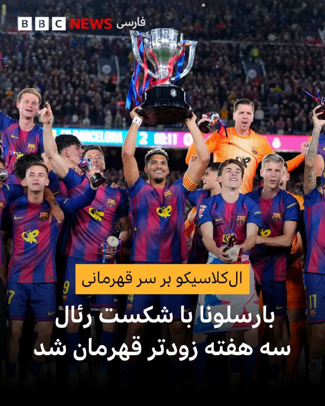

🔻تیم فوتبال بارسلونا با شکست دو بر صفر رئال مادرید، با وجود سه مسابقه باقی‌مانده، قهرمان شد و برای ۲۹مین بار جام قهرمانی باشگاه‌های اسپانیا - لالیگا - را تصاحب کرد.

دو تیم عصر یکشنبه در مهمترین الکلاسیکو سال و در قالب هفته سی و پنجم لالیگا روبروی هم قرار گرفتند که شاگردان فلیک در همان دقایق ابتدایی - دقیقه ۹ - با کاشته زیبا رشفورد جلو افتادند.

تورس تنها ۹ دقیقه بعد - در دقیقه ۱۸ - گل دوم بارسلونا را زد تا هانسی فلیک در همان نیمه اول برق قهرمانی در چشمانش ثبت شود.

این قهرمانی برای بارسلونا ارزش مضاعفی داشت چرا که آنها با شکست مستقیم رقیب سنتی خود جام را کسب کردند.

📸 Getty

@BBCPersian

## Dirty_Kids — post 389251

  <a href="https://t.me/Dirty_Kids/389251">📎 Download file</a>

✅ اپلیکیشن اندروید سایت جهانی دربی بت

💰اولین سایت جهانی با امکان شارژ و برداشت ریالی(کارت به کارت)

🔗 برای ورود فیلترشکن روی کشور مناسب قرار دهید مانند فنلاند و المان و....

😀Telegram Channel
👇
https://t.me/+bcynkEgSW2dlYTc0

## Dirty_Kids — post 389250

  

😤دنبال یه سایت شرط بندی بین المللی بودی که به ایرانیا خدمات بده؟!
⛔

👍دربی بت همون انتخاب  100%

💎ویژگی های سایت جهانی Derby Bet:

⬅️امکان شارژ امن با کارت بانکی

⬅️واریز اول دوبل شارژ می شوید(بونوس۱۰۰٪)

⬅️پر اپشن ترین سایت فعال در ایران

⬅️تسویه حساب کمتر از 5 دقیقه

⬅️برگشت بخشی از باخت به صورت هفتگی

🚨کد هدیه ثبت نام:GG007

⚠️برای دانلود اپلکیشن کلیک کنید
👉

🔔کانال دربی بت :

🪙https://t.me/+bcynkEgSW2dlYTc0

## Dirty_Kids — post 389249

  

#بخوابیم

@Dirty_Kids 👻

## Dirty_Kids — post 389248

  

محصول مشترک الجزایر، فرانسه، ادیداس کرج و کردستان: @Dirty_Kids 👻

## Dirty_Kids — post 389247

  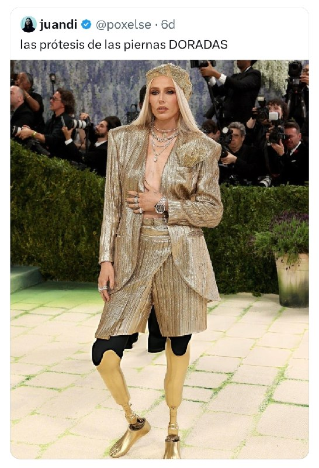

بلایی که یه پریود ساده ممکنه سرت بیاره.

این خانوم لارن وسر مدل آمریکاییه که بخاطر استفاده از تامپون تو سن ۲۴ سالگی دچار TSS یا سندروم شوک مسمومیت میشه و هر دو پاش رو از دست میده.

@Dirty_Kids 👻

## Dirty_Kids — post 389246

  

نه داداش تو نمیدونی جمهوری اسلامی خیلی خوب داره دووم میاره جلو آمریکا و اسرائیل :

@Dirty_Kids 👻

## Dirty_Kids — post 389245

  

دیگه نمیشه یبار مصرف کرد
باید بعد استفاده بشوریمش رو بند آویزون کنیم

@Dirty_Kids 👻

## configx2ray — post 38724

  <a href="https://t.me/ConfigX2ray/38724">📎 Download file</a>

کانفیگ برای Npv tunnel ⭕️

به هیچ وج دانلود نزنید باهاش
❤️

رمز فایل : @ConfigX2ray

Channel : https://t.me/ConfigX2ray

## configx2ray — post 38723

  <a href="https://t.me/ConfigX2ray/38723">📎 Download file</a>

کانفیگ برای Npv tunnel ⭕️

به هیچ وج دانلود نزنید باهاش
❤️

رمز فایل : @ConfigX2ray

Channel : https://t.me/ConfigX2ray

## configx2ray — post 38722

بیدارید 
🫤

## manototv — post 105286

  <a href="telegram/content/manototv_105286_1778454850.mp4">🎬 Download video</a>

گردهمایی ایرانیان سانفرانسیسکو

## manototv — post 105285

  <a href="telegram/content/manototv_105285_1778454852.mp4">🎬 Download video</a>

گردهمایی ایرانیان هامبورگ

## manototv — post 105284

  <a href="telegram/content/manototv_105284_1778454854.mp4">🎬 Download video</a>

نیکوزیا|قبرس؛ راهپیمایی و گردهمایی ایرانیان

<!-- MSG END -->
<!-- NAV START -->
[صفحه قبل](telegram/content/archive_1.md)
<!-- NAV END -->
