# خواننده تلگرام

<!-- MSG START -->

---
📅 بروزرسانی: 1405/02/19 14:44
---

## VahidOOnLine — post 239072

  

همزمان با شرایط پرتنش منطقه، رویداد «در امارات بسازید» در ابوظبی برگزار شد و شرکت‌های تجاری نزدیک به ۴۶ میلیارد دلار در امارات سرمایه‌گذاری کردند.

بر اساس اعلام اوپک، این رقم بیش از مجموع درآمد نفتی جمهوری اسلامی، ۴۵.۳ میلیارد دلار، در سال ۲۰۲۵ میلادی است.

النهار گزارش کرد این سرمایه‌گذاری شامل صنایع دفاعی و تکنولوژیک، دارویی، شیمیایی و انرژی است. این رویداد چهارروزه حتی در شرایط جنگی تعطیل نشد و توانست جایگاه امارات را به عنوان یک قطب صنعتی در منطقه تقویت کند.
‌🏁 🇬🇧 IranintlTV

🤖 @VahidOOnLine

## VahidOOnLine — post 239071

  <a href="telegram/content/VahidOOnLine_239071_1778325252.mp4">🎬 Download video</a>

⭕️ آتش‌بس شکننده لبنان؛
اسرائیل بار دیگر جنوب لبنان را هدف قرار داد

♦️رسانه‌های لبنان از وقوع حملات تازه در جنوب این کشور خبر دادند، حملاتی که همزمان با مشاهده ستون‌های دود و شنیده شدن صدای انفجار در مناطق مرزی، نگرانی‌ها درباره فروپاشی آتش‌بس شکننده میان اسرائیل و حزب‌الله را افزایش داده است.
ویدئوهای منتشرشده از منطقه مرجعیون در جنوب لبنان، برخاستن دود غلیظ از مناطق هدف قرارگرفته را نشان می‌دهد. خبرگزاری رسمی لبنان نیز اعلام کرده چند نقطه در جنوب کشور هدف حملات قرار گرفته‌اند، هرچند جزئیات بیشتری درباره تلفات یا خسارات احتمالی منتشر نشده است.
این حملات در حالی رخ می‌دهد که بنیامین نتانیاهو، نخست‌وزیر اسرائیل، دو روز پیش تاکید کرده بود «هیچ مصونیتی» برای دشمنان اسرائیل وجود ندارد. اظهارات او پس از آن مطرح شد که ارتش اسرائیل برای نخستین بار از زمان آتش‌بس ماه گذشته، یکی از فرماندهان حزب‌الله را در ضاحیه جنوبی بیروت هدف قرار داد.
‌🇸🇦 Indypersian

🤖 @VahidOOnLine

## VahidOOnLine — post 239070

  <a href="telegram/content/VahidOOnLine_239070_1778325255.mp4">🎬 Download video</a>

♦️دست‌کم پنج نفر در پی آتش‌سوزی گسترده در یک نمایشگاه و شهربازی شلوغ در ایالت تاباسکوی مکزیک جان باختند.
به گزارش خبرگزاری فرانسه، این آتش‌سوزی در جریان برگزاری «نمایشگاه تاباسکو ۲۰۲۶» در شهر ویافرموسا رخ داد و شعله‌های آتش به‌سرعت بخش‌هایی از محل برگزاری نمایشگاه و شهربازی را فرا گرفت.
مقام‌های محلی اعلام کرده‌اند چندین نفر نیز در این حادثه زخمی شده‌اند و تحقیقات درباره علت وقوع آتش‌سوزی ادامه دارد.
‌🇸🇦 Indypersian

🤖 @VahidOOnLine

## VahidOOnLine — post 239069

  

بر پایه گزارش‌های منتشر شده امیرحسین رضایی، روزنامه‌نگار و دانشجوی علوم سیاسی دانشگاه تهران، ۱۶ اردیبهشت ماه با یورش ماموران امنیتی با یورش به منزل پدری او در اراک بازداشت و به مکان نامعلومی منتقل شده است. ماموران اقدام به ضبط وسائل الکترونیکی و کتاب‌های این روزنامه نگار روزنامه دنیای اقتصاد، که به تازگی و در موج تعدیل جدید بر پایه تسویه‌ سیاسی درون روزنامه، اخراج شده بود، کرده‌اند. آقای رضایی، مرشد زورخانه و نوازنده سه‌تار و خواننده آواز سنتی ایرانی نیز هست.
‌🏁 🇬🇧 ManotoTV

🤖 @VahidOOnLine

## VahidOOnLine — post 239068

  

وزارت کشور بحرین روز شنبه اعلام کرد که ۴۱ نفر را بازداشت کرده که به گفته این وزارتخانه با سپاه پاسداران انقلاب اسلامی در ارتباط بوده‌اند؛ خبرگزاری رسمی این کشور این خبر را منتشر کرده است.این وزارتخانه همچنین اعلام کرد که تحقیقات دادستانی عمومی شامل پرونده‌هایی درباره ابراز همدلی با حملات جمهوری‌اسلامی نیز بوده است. پیش‌تر نیز گزارش شده بود مجلس نمایندگان بحرین عضویت سه نماینده را لغو کرده است. این اقدام پس از آن انجام شده که این نمایندگان با اقدامات انجام‌شده علیه افرادی که به داشتن «گرایش یا همدلی با ایران» متهم شده بودند، مخالفت کرده بودند. جمهوری‌اسلامی از زمان آغاز درگیری‌ها در ماه فوریه، بارها حملاتی را علیه بحرین و دیگر کشورهای عربی حاشیه خلیج فارس انجام داده است.
‌🏁 🇬🇧 ManotoTV

🤖 @VahidOOnLine

## VahidOOnLine — post 239067

  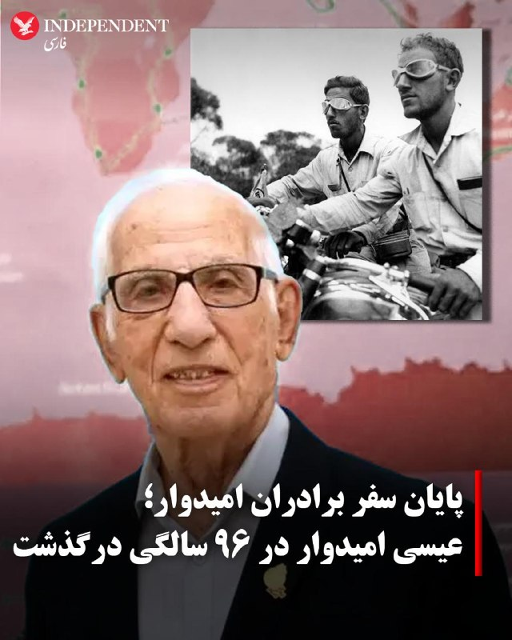

♦️عیسی امیدوار، جهانگرد، مستندساز و پژوهشگر پیشکسوت ایرانی که همراه برادرش از چهره‌های ماندگار تاریخ جهانگردی معاصر ایران به شمار می‌رفت، روز شنبه ۱۹ اردیبهشت ماه در ۹۷ سالگی درگذشت.
به گزارش ایرنا او به‌دلیل بیماری و کهولت سن چند روزی در بیمارستان بستری بود.
عیسی امیدوار، متولد دوم دی ۱۳۰۸، به همراه برادرش عبدالله از نخستین جهانگردان ایرانی معاصر بودند که در دهه‌های میانی قرن بیستم سفرهای طولانی و پژوهشی خود را به نقاط دورافتاده جهان آغاز کردند. این دو برادر که اصالتشان به روستای فشندک طالقان در استان البرز بازمی‌گردد، به سفر در میان قبایل، فرهنگ‌ها و جوامع کمتر شناخته‌شده پرداختند.
برادران امیدوار با موتورسیکلت، خودرو و ابزارهای ساده سفر، سال‌ها در قاره‌های مختلف جهان گردش کردند و مجموعه‌ای کم‌نظیر از فیلم‌ها، عکس‌ها و اسناد مردم‌شناسی از مناطقی ثبت کردند که بسیاری از آن‌ها امروز دگرگون شده یا دیگر وجود ندارند.
موزه برادران امیدوار در مجموعه کاخ سعدآباد همچنان یادآور این سفرها و تلاش‌های پژوهشی است. قرار بود در روز جهانی موزه، ۲۸ اردیبهشت ۱۴۰۵، از عیسی امیدوار نیز تجلیل شود، اما او پیش از این مراسم درگذشت.
عبدالله امیدوار، برادر کوچک‌تر او، نیز در ۲۳ تیر ۱۴۰۱ در ۹۰ سالگی در شیلی درگذشته بود.
‌🇸🇦 Indypersian

🤖 @VahidOOnLine

## mwarmonitor — post 8746

  

✈️یک فروند هواپیمای آمریکایی Bombardier E-11A Battlefield Airborne Communications Node در نقش «گره ارتباطات هوابرد میدان نبرد» به‌کار گرفته شده.
این هواپیما برای تقویت و پشتیبانی ارتباطات فرماندهی و کنترل در مناطق عملیاتی استفاده می‌شود.

@mwarmonitor

## mwarmonitor — post 8745

  

🚢کشتی حامل LNG متعلق به قطر به نام «Al Kharaitiyat» در حال نزدیک شدن به تنگه هرمز است؛ اگر متوقف نشود، ممکن است اولین نفتکش غیرمرتبط با ایران باشد که در چند روز اخیر اجازه عبور پیدا می‌کند.

مقصد: پاکستان.

@mwarmonitor

## pm_afshaa — post 90401

🔴ایرنا: بخاطر قطع اینترنت بین‌الملل و تعدیل نیرو و بیکاری، تعداد دست فروش‌ها روز به روز داره بیشتر می‌شه

💧 Rainbet.com the #1 Non-KYC Crypto Casino & Sportsbook @rainbetcom

😁 @Pm_Afshaa

## pm_afshaa — post 90400

🔴کارشناس صداوسیما: آرایش نیروهای آمریکایی خبر از یک جنگ بزرگ می‌دهد

💧 Rainbet.com the #1 Non-KYC Crypto Casino & Sportsbook @rainbetcom

😁 @Pm_Afshaa

## pm_afshaa — post 90399

🔴نیویورک تایمز به نقل از مقامات آمریکایی: روسیه از طریق دریای خزر قطعات پهپاد را به ایران صادر می‌کند و به این کشور در بازسازی قابلیت‌هایش کمک می‌کند

💧 Rainbet.com the #1 Non-KYC Crypto Casino & Sportsbook @rainbetcom

😁 @Pm_Afshaa

## pm_afshaa — post 90398

المیادین:نیروهای مسلح جمهوری اسلامی ورود یک ناوشکن آمریکایی به آب‌های امارات را رصد کرده و تحرکات آن را دنبال می‌کند

💧 Rainbet.com the #1 Non-KYC Crypto Casino & Sportsbook @rainbetcom

😁 @Pm_Afshaa

## pm_afshaa — post 90397

💰تعرفه
💰

1 گیگ    
⬆️ 295 ت

500 مگ 
⬆️ 185 ت

100 مگ 
⬆️ 55 ت

⭐️ اتصال پایدار در نت ملی

⭐️ مناسب اینستاگرام و تلگرام و یوتیوب

⭐️ دارای سایت استعلام باقی حجم

⭐️ بدون محدودیت کاربر و بدون انقضا

⭐️ ضمانت بازگشت وجه درصورت عدم رضایت

🌟 تست هم موجود میباشد 
🌟

جهت خرید به آیدی زیر پیام دهید 
⬆️

Admin : @Four_Support 
👨‍💻

Channel : @Four_Vpn_4 
🩵

🎇داخل گروه زیر هر شب قرعه کشی ۱۰ اشتراک رایگان انجام میشود 
⬆️
https://t.me/+v8GFmLXjHa5jNDZk

## DEJradio — post 4533

  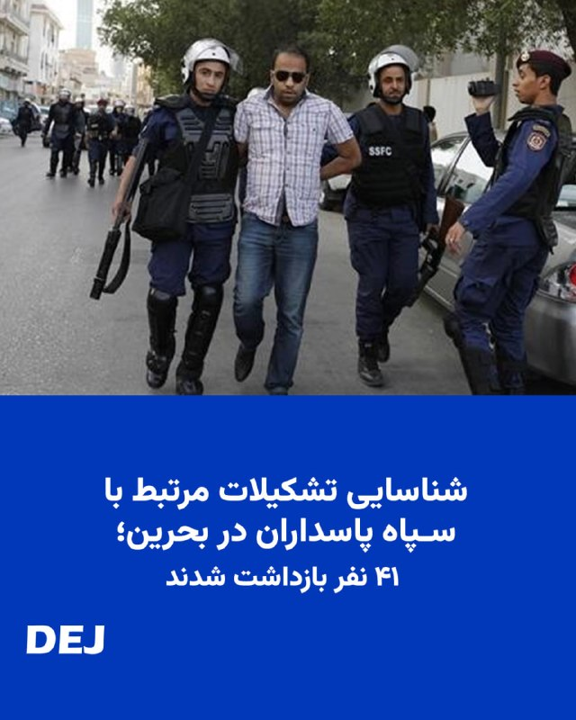

🚨📢 شناسایی تشکیلات مرتبط با سـپاه پاسداران در بحرین؛ ۴۱ نفر بازداشت شدند

وزارت کشور بحرین اعلام کرد دستگاه‌های امنیتی این کشور یک تشکیلات مرتبط با سپاه پاسداران انقلاب اسلامی و اندیشه «ولایت فقیه» را شناسایی و ۴۱ نفر از اعضای آن را بازداشت کرده‌اند.
بر پایه اعلام وزارت کشور بحرین در روز شنبه ۱۹ اردیبهشت، این اقدام بر اساس نتایج گزارش‌‌های امنیتی در پرونده‌های «جاسوسی برای نهادهای خارجی» و «همدلی با حملات جمهوری اسلامی» انجام شده است.
عملیات جستجو و تحقیق به منظور «شناسایی و برخورد قانونی» با دیگر افراد مرتبط با این تشکیلات ادامه دارد.
پیش از این، دادستانی بحرین نیز اعلام کرده بود در دو پرونده جداگانه مربوط به جاسوسی، برای دو تبعه افغانستانی و سه شهروند بحرینی حکم حبس ابد صادر شده است.

#بحرین #IRGCterrorists

## DEJradio — post 4532

  <a href="telegram/content/DEJradio_4532_1778325263.mp4">🎬 Download video</a>

🤡
🔺 فقط کشکک مجتبی مجروح شده است!

در حالی که بیش از دو ماه از حذف هدفمند خامنه‌ای و خانواده او می‌گذرد و پسرش، مجتبی خامنه‌ای با وجود منسوب شدن به رهبری، هنوز تصویر یا صدایی از او منتشر نشده، مظاهر حسینی، مسئول دیدارهای دفتر خامنه‌ای، در تجمع شبانه حکومتیريال مدعی شده که مجتبی در جریان بمباران کاخ مرمر، تنها از ناحیه کشکک زانو، کمر و کمی پشت گوش آسیب دیده است.

#موشتبا #حذف_هدفمند
@DEJradio

## IranIntlTV — post 336279

  

همزمان با شرایط پرتنش منطقه، رویداد «در امارات بسازید» در ابوظبی برگزار شد و شرکت‌های تجاری نزدیک به ۴۶ میلیارد دلار در امارات سرمایه‌گذاری کردند.

بر اساس اعلام اوپک، این رقم بیش از مجموع درآمد نفتی جمهوری اسلامی، ۴۵.۳ میلیارد دلار، در سال ۲۰۲۵ میلادی است.

النهار گزارش کرد این سرمایه‌گذاری شامل صنایع دفاعی و تکنولوژیک، دارویی، شیمیایی و انرژی است. این رویداد چهارروزه حتی در شرایط جنگی تعطیل نشد و توانست جایگاه امارات را به عنوان یک قطب صنعتی در منطقه تقویت کند.
https://iranintl.com/202605091828

## IranIntlTV — post 336278

  <a href="telegram/content/IranIntlTV_336278_1778325267.mp4">🎬 Download video</a>

هم‌زمان با ادامه تلاش‌ها برای دستیابی به توافق میان جمهوری اسلامی و آمریکا، دونالد ترامپ گفت احتمالا تهران تا شنبه پاسخ خود را به طرح توافق ارائه خواهد کرد. او افزود اگر این توافق نهایی نشود، دولتش ممکن است رویکرد متفاوتی در پیش گیرد.

ارزیابی لیلا مروتی، تحلیل‌گر سیاسی
@iranintltv

## IranIntlTV — post 336277

  <a href="telegram/content/IranIntlTV_336277_1778325269.mp4">🎬 Download video</a>

وزارت جنگ آمریکا با دستور دونالد ترامپ مجموعه تازه‌ای از اسناد طبقه‌بندی‌شده درباره بشقاب‌پرنده‌ها یا «یوفوها» را منتشر کرد. در این گزارش‌ها به مشاهده برخی بشقاب‌پرنده‌ها در آسمان خلیج فارس و مناطق نزدیک به ایران نیز اشاره شده است.

جزییات بیشتر در گفت‌وگو با پیام دریابی، عضو تحریریه ایران‌اینترنشنال
@iranintltv

## IranIntlTV — post 336276

  <a href="telegram/content/IranIntlTV_336276_1778325272.mp4">🎬 Download video</a>

سرخط خبرهای شنبه ۱۹ اردیبهشت
@iranintltv

## IranIntlTV — post 336275

یک شهروند با ارسال پیامی به ایران اینترنشنال می‌گوید قدرت خرید و وضع معیشت به قدری بد شده که نوشیدن یک قهوه روزانه برای او تبدیل به حسرت شده است. پیام مخاطب برای حفظ امنیتش با هوش مصنوعی خوانده شده است.

## IranIntlTV — post 336274

یک شهروند با ارسال پیامی به ایران اینترنشنال می‌گوید بانک اموال و کارخانه او را به دلیل ضمانتش برای وام شرکتی دیگر توقیف کرده است. پیام او برای حفظ امنیتش با هوش مصنوعی خوانده شده است.

## ManotoTV — post 105182

  

بر پایه گزارش‌های منتشر شده امیرحسین رضایی، روزنامه‌نگار و دانشجوی علوم سیاسی دانشگاه تهران، ۱۶ اردیبهشت ماه با یورش ماموران امنیتی با یورش به منزل پدری او در اراک بازداشت و به مکان نامعلومی منتقل شده است. ماموران اقدام به ضبط وسائل الکترونیکی و کتاب‌های این روزنامه نگار روزنامه دنیای اقتصاد، که به تازگی و در موج تعدیل جدید بر پایه تسویه‌ سیاسی درون روزنامه، اخراج شده بود، کرده‌اند. آقای رضایی، مرشد زورخانه و نوازنده سه‌تار و خواننده آواز سنتی ایرانی نیز هست.

## ManotoTV — post 105181

  

وزارت کشور بحرین روز شنبه اعلام کرد که ۴۱ نفر را بازداشت کرده که به گفته این وزارتخانه با سپاه پاسداران انقلاب اسلامی در ارتباط بوده‌اند؛ خبرگزاری رسمی این کشور این خبر را منتشر کرده است.این وزارتخانه همچنین اعلام کرد که تحقیقات دادستانی عمومی شامل پرونده‌هایی درباره ابراز همدلی با حملات جمهوری‌اسلامی نیز بوده است. پیش‌تر نیز گزارش شده بود مجلس نمایندگان بحرین عضویت سه نماینده را لغو کرده است. این اقدام پس از آن انجام شده که این نمایندگان با اقدامات انجام‌شده علیه افرادی که به داشتن «گرایش یا همدلی با ایران» متهم شده بودند، مخالفت کرده بودند. جمهوری‌اسلامی از زمان آغاز درگیری‌ها در ماه فوریه، بارها حملاتی را علیه بحرین و دیگر کشورهای عربی حاشیه خلیج فارس انجام داده است.

## FarsiVOA — post 217258

  

مقامات بریتانیایی اعلام کردند که دو مرد را پس از ضبط ویدئوهایی یهودستیزانه برای شبکه‌های اجتماعی تیک‌تاک متهم کرده‌اند.

پلیس بریتانیا روز شنبه گزارش داد که این دو مرد به یک منطقه یهودی‌نشین در شمال لندن سفر کرده و این ویدیوها را آنجا ضبط کرده‌اند. بر اساس این گزارش، این دو نفر به «آزار و اذیت با انگیزه دینی» متهم شده‌اند.

دادستانی کل بریتانیا اعلام کرد که این دو مرد، آدام بدویی ۲۰ ساله و عبدالقادر امیر بوسلوب ۲۱ ساله، قرار است در دادگاه حاضر شوند.

پیشتر کی‌یر استارمر، نخست‌وزیر بریتانیا، در هشداری مستقیم به جمهوی اسلامی گفت هرگونه تلاش برای دامن زدن به خشونت، نفرت یا تفرقه در جامعه بریتانیا «تحمل نخواهد شد.»

استارمر روز سه‌شنبه گذشته در نشستی در دفتر نخست‌وزیری با رهبران جامعه یهودیان، مقام‌های دولتی و مسئولان پلیس گفت یکی از محورهای تحقیقات این است که آیا یک کشور خارجی پشت برخی از حملات اخیر به جامعه یهودیان بریتانیا بوده است یا نه.
@FarsiVOA

## FarsiVOA — post 217257

  

خبرگزاری دولتی ایرنا در گزارشی میدانی از تهران، عملاً تأیید کرده است که قطع اینترنت بخشی از فروشگاه‌های مجازی را از فضای آنلاین بیرون رانده و به خیابان و پیاده‌رو کشانده است.

ایرنا نوشته پررنگ شدن دستفروشی فقط محدود به نقاط مرکزی تهران نیست و از بازار امامزاده حسن در جنوب غرب تهران تا شهرک اندیشه شهریار نیز دیده می‌شود.

به گزارش این خبرگزاری، مدارای شهرداری و «دستور آگاهانه» برای برخورد نکردن با دستفروشان، این روند را آشکارتر کرده و بخش‌هایی از شهر را به ویترین بساط‌گرانی تبدیل کرده است که به‌اجبار از اینستاگرام به خیابان کوچ کرده‌اند.

به این ترتیب، خاموشی اینترنت فقط فروش آنلاین را متوقف نکرده، بلکه بخشی از اقتصاد خرد دیجیتال را از صفحه موبایل به پیاده‌رو عقب رانده است.

ایرنا نوشته فروشندگانی که تا چند ماه پیش با صفحه اینستاگرامی، پرداخت آنلاین و ارسال سفارش فعالیت می‌کردند، حالا در نبود اینترنت آزاد و پایدار، ناچار شده‌اند در خیابان بساط کنند.

در روزهای اخیر، گزارش‌های متعددی درباره افزایش بیکاری، به‌ویژه در میان زنان و صاحبان کسب‌وکارهای خرد، در پی قطع اینترنت منتشر شده است.
@FarsiVOA

## FarsiVOA — post 217256

🔺گزارش‌ها از سهمیه‌بندی سرم و آنتی‌بیوتیک؛ بحران دارو از بازار به بیمارستان رسید

◾️گزارش‌های رسیده به صدای آمریکا از سهمیه‌بندی سرم در بیمارستان‌ها و ابلاغ دستورالعمل تازه برای کاهش مصرف سرم و آنتی‌بیوتیک حکایت دارد.

◾️یک مدیر بیمارستان خصوصی در تهران به صدای آمریکا گفت بر اساس دستورالعمل جدید، مصرف سرم در بخش اورژانس بیمارستان‌ها باید دست‌کم ۵۰ درصد کاهش پیدا کند.

◾️یک دکتر داروساز نیز به صدای آمریکا گفته بحران سرم و آنتی‌بیوتیک در داروخانه‌ها جدی شده و توزیع این دو قلم با تأخیر و بسیار کمتر از تقاضای واقعی انجام می‌شود.

⬇️ بیشتر بخوانید:
https://ir.voanews.com/a/8148262.html

## FarsiVOA — post 217255

🔺بحرین: ۴۱ عضو یک گروه مرتبط با سپاه پاسداران بازداشت شدند

◾️وزارت کشور بحرین اعلام کرد که ۴۱ نفر را که با سپاه پاسداران مرتبط بوده‌اند، بازداشت کرده است.

◾️گزارش شده این افراد اعضای هسته اصلی «یک سازمان مرتبط با سپاه پاسداران» و مدافع تئوری «ولایت فقیه» بوده‌اند.

◾️پیشتر رسانه‌های بحرینی روز پنجشنبه ۱۷ اردیبهشت، گزارش دادند که پارلمان بحرین سه نفر از نمایندگان خود را به اتهام «حمایت از [رژیم] ایران و ستایش حملات آن» برکنار کرده است.

◾️همچنین در ۷ اردیبهشت ماه دولت بحرین اعلام کرد، که تابعیت ۶۹ نفر را لغو کرده و در این‌باره توضیح داد که آنها «با [رژیم] ایران ابراز همدردی کرده و از اقدامات خصمانه و مجرمانه آن در حمله به بحرین تمجید کرده‌ بودند.»

⬇️ بیشتر بخوانید:
https://ir.voanews.com/a/8148261.html

## DW_Farsi — post 124473

  

🔶ترامپ: اگر توافق نشود به اجرای پروژه آزادی تنگه هرمز برمی‌گردیم

دونالد ترامپ، رئیس جمهور آمریکا روز شنبه ۱۹ اردیبهشت (۹ مه) در گفتگو با خبرنگاران درباره اجرای دوباره "پروژه آزادی" در تنگه هرمز هشدار داد و گفت، اگر همه توافق‌ها نهایی و کامل نشود، واشنگتن ممکن است به این طرح بازگردد؛ اما این بار با نسخه‌ای گسترده‌تر تحت عنوان "پروژه آزادی پلاس".

رئیس جمهور آمریکا صبح روز چهارشنبه ۱۶ اردیبهشت نیز در پلتفرم "تروث سوشال" خبر داده بود که به دلیل درخواست پاکستان و برخی کشورهای دیگر "پروژه آزادی" را بطور موقت متوقف می‌کند.

به گفته رئیس جمهور آمریکا، توافق شده بود که با وجود تداوم کامل محاصره دریایی، "پروژه آزادی" (اسکورت و هدایت کشتی‌ها برای خروج از تنگه هرمز) برای مدت کوتاهی متوقف شود.

ترامپ همچنین توضیح داد که این توقف برای بررسی احتمال نهایی‌شدن توافق و امضای آن انجام می‌شود.

@dw_farsi

## DW_Farsi — post 124472

  <a href="telegram/content/DW_Farsi_124472_1778325278.mp4">🎬 Download video</a>

🎥ویدئوی پنتاگون از حمله به دو نفتکش ایران

ارتش آمریکا می‌گوید نیروهایش روز جمعه ۸ ماه مه (۱۸ اردیبهشت) پس از تبادل آتش در تنگه هرمز، به دو نفتکش جمهوری اسلامی شلیک کرده و آنها را از کار انداخته‌اند.

سنتکام می‌گوید نفتکش‌های ام‌تی‌سودا و ام‌تی‌سی استار۳ در حال حرکت به سمت بنادر ایران در خلیج عمان بودند و جنگنده‌های آمریکایی با حمله به دودکش و سکان آنها، مانع ادامه حرکتشان شدند.

در بیانیه ارتش آمریکا آمده است که یک جنگنده اف/ای-۱۸ سوپر هورنت متعلق به ناو هواپیمابر جورج دبلیو بوش، با شلیک مهمات هدایت‌شونده به دودکش‌های دو نفتکش، آنها را از ادامه حرکت بازداشته ‌است.

سنتکام همچنین اعلام کرد که نیروهای آمریکایی ششم ماه مه نفتکش "ام/تی حسنا" را نیز هنگام حرکت به سمت یکی از بنادر ایران در خلیج عمان از کار انداختند.

@dw_farsi

## Persian_Trend_Official — post 13743

جنگنده F-16C نیروی هوایی ایالات متحده از اسکادران 79 جنگنده "تایگرز" بر فراز خاورمیانه، که حداقل یک نشان برای انهدام یک هدف با موشک AGM-88 HARM بر روی سیستم راداری ایران دارد. 📌 @persian_trend_official پرشین ترند | متفاوت‌ترین کانال نظامی

## Persian_Trend_Official — post 13742

🔴خانعلی‌زاده» کارشناس صداوسیما با اشاره به تحرکات نظامی آمریکا در منطقه گفت آرایش فعلی نیروهای آمریکایی «خبر از یک جنگ بزرگ می‌دهد».

🫆:Tony

📌 @persian_trend_official
پرشین ترند | متفاوت‌ترین کانال نظامی

## Persian_Trend_Official — post 13741

🔴 ارتش اسرائیل: یک پهپاد انفجاری حزب‌الله در شمال اسرائیل شناسایی شد

ارتش اسرائیل اعلام کرد امروز شنبه یک پهپاد انفجاری که توسط حزب‌الله شلیک شده بود، در شمال اسرائیل و در نزدیکی مرز لبنان شناسایی شده است.

طبق بیانیه ارتش:

▪️ این پهپاد پیش از رسیدن به هدف کشف شده
▪️ هیچ خسارت یا زخمی گزارش نشده است
▪️ نیروهای امنیتی در محل در حال خنثی‌سازی پهپاد هستند
▪️ ادامه رسیدگی به حادثه به پلیس اسرائیل واگذار شده است

🫆:Tony

📌 @persian_trend_official
پرشین ترند | متفاوت‌ترین کانال نظامی

## Persian_Trend_Official — post 13740

  

⭕️ توییت جدید ولید گادبان مشاور سیاسی هیئت اسرائیل در سازمان ملل در ژنو:

📝 Nick

📌 @persian_trend_official
پرشین ترند | متفاوت‌ترین کانال نظامی

## RadioFarda — post 156999

  

🔸رسانه‌های داخل ایران روز شنبه از گفت‌وگوی تلفنی عباس عراقچی، وزیر خارجه جمهوری اسلامی، با همتای ترکیه‌ای‌اش خبر دادند، تماسی که او در آن از «رویکرد مخرب آمریکا در روند دیپلماسی» انتقاد کرده است.

🔸او گفت: «رویکرد مخرب آمریکا روند دیپلماسی را تضعیف می‌کند.»

🔸به گزارش خبرگزاری ایسنا، عراقچی در گفت‌وگو با هاکان فیدان،‌ وزیر امور خارجه ترکیه، چنین شکایت کرده است:‌ «تنش‌آفرینی اخیر نیروهای آمریکایی در خلیج فارس و اقدامات متعدد آنان در نقض آتش‌بس، بر سوء ظن‌ها نسبت به انگیزه و جدیت طرف آمریکایی در مسیر دیپلماسی افزوده است.»

🔸به نظر می‌رسد اشاره این مقام جمهوری اسلامی به ادامه محاصره دریایی بنادر ایران و حمله تازه ارتش آمریکا به دو نفتکش ایرانی باشد که روز جمعه گذشته رخ داد.

🔸ارتش آمریکا روز جمعه تأیید کرد که با حمله به دو نفتکش ایرانی دیگر، مانع از عبور آنها از محاصره دریایی اعمال شده بر بنادر و کشتیرانی ایران شده است.

🔸انتقاد عراقچی از دولت آمریکا در زمانی در رسانه‌های ایران بازتاب یافته که دونالد ترامپ در انتظار دریافت پاسخ حکومت ایران به پیشنهاد تازه برای پایان جنگ است.

@RadioFarda

## IranianMinds — post 19831

  

😂😂😂😂😂😂

@IranianMinds

## IranianMinds — post 19830

🔴خانعلی‌زاده کارشناس صداوسیما:

آرایش نیروهای آمریکایی، خبر از یک جنگ بزرگ می‌دهد.

@IranianMinds

## IranianMinds — post 19829

🔴اپلیکیشن تلگرام در عراق رفع فیلتر شد.

@IranianMinds

## IranianMinds — post 19828

🔴نیویورک‌تایمز به نقل از مقامات آمریکایی:

روسیه برای کمک به بازسازی توان موشکی ایران، از طریق دریای خزر ، قطعات موشکی به ایران ارسال می‌کند.

همچنین کالاهایی که پیش‌تر از تنگه هرمز عبور می‌کردند، اکنون از این مسیر تأمین می‌شوند و حجم حمل‌و‌نقل بار به ایران از طریق دریای خزر در ماه‌های اخیر افزایش یافته است.

@IranianMinds

## IranianMinds — post 19827

🔴العربیه:

اسرائیل از آمریکا خواست که از طولانی کردن مذاکرات با ایران خودداری کند.

@IranianMinds

## BBCPersian — post 280572

🔻معاون وزیر ارتباطات خسارت قطع اینترنت برای اقتصاد دیجیتال در پلتفرم‌های بزرگ را «۵۵ همت» اعلام کرد

احسان چیت‌ساز، معاون وزیر ارتباطات ایران امروز در یک نشست خبری خسارت‌های ناشی از قطع اینترنت برای اقتصاد دیجیتال ایران، در پلتفرم‌های بزرگ را ۵۵ هزار میلیارد تومان اعلام کرد.

او گفته است: «مجموع عدم‌النفع (کاهش درآمد) این حوزه نزدیک به ۱۶/۳۲ هزار میلیارد تومان برآورد می‌شود.»

معاون وزیر ارتباطات ایران همچنین گفته است قطعی اینترنت در حوزه مخابرات و ارتباطات حدود ۶/۴ هزار میلیارد تومان کاهش درآمد مستقیم کسب‌وکارها را در بر داشته است.

آقای چیت‌ساز گفته است: «قطع اینترنت برای کسب‌وکار اقتصاد دیجیتال ممکن است برای چند ساعت قابل تحمل باشد، اما قطع گسترده و سراسری آن عملا یک شوک اقتصادی ایجاد می‌کند.»

یازده هفته از قطع سراسری اینترنت در ایران می‌گذرد.

افشین کلاهی، ازاعضای اتاق بازرگانی ایران، پیش از این گفته بود که خسارت مستقیم قطع اینترنت در ایران ۳۰ تا ۴۰ میلیون دلار در روز است و خسارت مستقیم و غیرمستقیم این محدودیت تا۸۰ میلیون دلار در روز می‌رسد.

https://bbc.in/4dfzXzs
@BBCPersian

## BBCPersian — post 280571

🔻رئیس جمهور لبنان بر «همبستگی» کشورش با امارات در «شرایط حساس» منطقه تاکید کرد

جوزف عون، رئیس جمهور لبنان در تماسی تلفنی با شیخ محمد بن زاید آل نهیان، رئیس امارات متحده عربی، درباره وضعیت منطقه و رویدادهای اخیر صحبت کرد.

جوزف عون در این تماس بر «همبستگی مردم لبنان با امارات در شرایط حساس فعلی» تاکید کرد.

امارات متحده عربی، ایران را به حمله به تاسیسات نفتی فجیره متهم کرده است. ایران اما می‌گوید هیچ دخالتی در این حمله نداشته است.

آقای عون همچنین همتای اماراتی خود را در جریان آخرین تحولات مرتبط با مذاکرات بین مقام‌های دولت لبنان با آمریکا و اسرائیل قرار داد.

این مذاکرات که در واشنگتن برگزار شده بود، با مخالفت و انتقاد حزب‌الله لبنان، گروه‌ همسو با ایران، مواجه شد.

در یک سال گذشته، روابط ایران با دولت لبنان و امارات به شدت متشنج شده است.

https://bbc.in/48L2Cew
@BBCPersian

## Dirty_Kids — post 389158

«تلگرام» در عراق رفع فیلتر شد

سازمان رسانه و ارتباطات عراق از لغو ممنوعیت فعالیت اپلیکیشن تلگرام در سراسر این کشور خبر داد.

@Dirty_Kids 👻

## Dirty_Kids — post 389156

جمهوری اسلامی ورداشته عكس آیسان اسلامی‌رو گذاشته تو شهرهای آمل و بابل...

آیسانم ویدیو گرفته جوابشونو داده: 🤣🤣🤣

@Dirty_Kids 👻

## Dirty_Kids — post 389154

  <a href="telegram/content/Dirty_Kids_389154_1778325282.mp4">🎬 Download video</a>

⚽️رسمی؛ شکیرا و بورنابوی خواننده‌های آهنگ رسمی جام‌جهانی ۲۰۲۶ ان و در تاریخ ۲۴ اردیبهشت کارو میدن بیرون.

@Dirty_Kids 👻

## Dirty_Kids — post 389153

  <a href="https://t.me/Dirty_Kids/389153">📎 Download file</a>

✅ اپلیکیشن اندروید سایت جهانی دربی بت

💰اولین سایت جهانی با امکان شارژ و برداشت ریالی(کارت به کارت)

🔗 برای ورود فیلترشکن روی کشور مناسب قرار دهید مانند فنلاند و المان و....

😀Telegram Channel
👇
https://t.me/+bcynkEgSW2dlYTc0

## Dirty_Kids — post 389152

  

😤دنبال یه سایت شرط بندی بین المللی بودی که به ایرانیا خدمات بده؟!
⛔

👍دربی بت همون انتخاب  100%

💎ویژگی های سایت جهانی Derby Bet:

⬅️امکان شارژ امن با کارت بانکی

⬅️واریز اول دوبل شارژ می شوید(بونوس۱۰۰٪)

⬅️پر اپشن ترین سایت فعال در ایران

⬅️تسویه حساب کمتر از 5 دقیقه

⬅️برگشت بخشی از باخت به صورت هفتگی

🚨کد هدیه ثبت نام:GG007

⚠️برای دانلود اپلکیشن کلیک کنید
👉

🔔کانال دربی بت :

🪙https://t.me/+bcynkEgSW2dlYTc0

## Hranews — post 112842

  

اعتراضات دی‌‌ماه ۱۴۰۴؛ گزارشی از آخرین وضعیت آبان و حسن موسوی در زندان وکیل آباد
 

❗️
❗️
❗️
❗️
❗️ – آبان (زینب) موسوی و حسن موسوی که در اسفند سال گذشته در رابطه با اعتراضات دی‌‌ماه ۱۴۰۴ بازداشت شدند، اکنون در زندان وکیل آباد مشهد به سر می‌برند. چندی پیش جلسه دادگاه رسیدگی به پرونده این خواهر و برادر، از بابت اتهاماتی از جمله “محاربه”، در دادگاه انقلاب مشهد برگزار شده است.
 
به گزارش خبرگزاری هرانا، ارگان خبری مجموعه فعالان حقوق بشر در ایران، سیده زینب موسوی و برادرش سید حسن موسوی در زندان وکیل آباد مشهد هستند.
 
براساس اطلاعات دریافتی هرانا، جلسه دادگاه رسیدگی به پرونده این شهروندان در تاریخ ۶ اردیبهشت‌ماه امسال برگزار شده است. این خواهر و برادر با اتهاماتی از جمله محاربه مواجه هستند؛ موضوعی که نگرانی خانواده و نزدیکان آنها را نسبت به احتمال صدور احکام سنگین افزایش داده است.
 
ادامه مطلب
 
#آبان_موسوی #زینب_موسوی #حسن_موسوی
 
↘️
@hranews_bot تماس ✉️ -  @Hranews  کانال هرانا 🆑

## manototv — post 105182

  

بر پایه گزارش‌های منتشر شده امیرحسین رضایی، روزنامه‌نگار و دانشجوی علوم سیاسی دانشگاه تهران، ۱۶ اردیبهشت ماه با یورش ماموران امنیتی با یورش به منزل پدری او در اراک بازداشت و به مکان نامعلومی منتقل شده است. ماموران اقدام به ضبط وسائل الکترونیکی و کتاب‌های این روزنامه نگار روزنامه دنیای اقتصاد، که به تازگی و در موج تعدیل جدید بر پایه تسویه‌ سیاسی درون روزنامه، اخراج شده بود، کرده‌اند. آقای رضایی، مرشد زورخانه و نوازنده سه‌تار و خواننده آواز سنتی ایرانی نیز هست.

## manototv — post 105181

  

وزارت کشور بحرین روز شنبه اعلام کرد که ۴۱ نفر را بازداشت کرده که به گفته این وزارتخانه با سپاه پاسداران انقلاب اسلامی در ارتباط بوده‌اند؛ خبرگزاری رسمی این کشور این خبر را منتشر کرده است.این وزارتخانه همچنین اعلام کرد که تحقیقات دادستانی عمومی شامل پرونده‌هایی درباره ابراز همدلی با حملات جمهوری‌اسلامی نیز بوده است. پیش‌تر نیز گزارش شده بود مجلس نمایندگان بحرین عضویت سه نماینده را لغو کرده است. این اقدام پس از آن انجام شده که این نمایندگان با اقدامات انجام‌شده علیه افرادی که به داشتن «گرایش یا همدلی با ایران» متهم شده بودند، مخالفت کرده بودند. جمهوری‌اسلامی از زمان آغاز درگیری‌ها در ماه فوریه، بارها حملاتی را علیه بحرین و دیگر کشورهای عربی حاشیه خلیج فارس انجام داده است.

## alonews — post 118855

  <a href="telegram/content/alonews_118855_1778325288.jpg">🎬 Download video</a>

👈 کمیسیونر اروپایی کمک‌های بشردوستانه و مدیریت بحران: اتحادیه اروپا به حمایت‌های لازم از مردم لبنان ادامه خواهد داد، با اشاره به اینکه بیش از ۲۰٪ جمعیت به دلیل جنگ مجبور به ترک خانه‌های خود شده‌اند و زیرساخت‌های اساسی در جنوب لبنان هدف قرار گرفته است که وضعیت را در آنجا وخیم‌تر کرده است

✅ @AloNews خبر جنگ

## alonews — post 118854

  <a href="telegram/content/alonews_118854_1778325288.jpg">🎬 Download video</a>

👈 کرملین: آتش‌بس با اوکراین تنها سه روز دوام خواهد داشت و تمدید نخواهد شد.

🔴در مذاکرات سه‌جانبه بین روسیه، ایالات متحده و اوکراین وقفه‌ای ایجاد شده است.
طرف اوکراینی می‌داند چه باید کرد تا دور بعدی مذاکرات موفقیت‌آمیز باشد.

🔴رسیدن به توافق صلح درباره اوکراین زمان زیادی خواهد برد.

✅ @AloNews خبر جنگ

## alonews — post 118853

  <a href="telegram/content/alonews_118853_1778325288.jpg">🎬 Download video</a>

👈رئیس مرکز تحقیقات صداوسیما: مرجع اصلی خبر مردم، اول صداوسیما و بعدا شبکه‌های اجتماعی داخلی است!!

✅ @AloNews خبر جنگ

## alonews — post 118852

  <a href="telegram/content/alonews_118852_1778325289.jpg">🎬 Download video</a>

👈مجلس ایران : فردا اولین نشست خودمون رو به صورت مجازی و آنلاین برگزار میکنیم

✅ @AloNews خبر جنگ

## alonews — post 118851

  <a href="telegram/content/alonews_118851_1778325289.jpg">🎬 Download video</a>

👈حمله‌ی ارتش اسرائیل به لبنان

✅ @AloNews خبر جنگ

## alonews — post 118850

  <a href="telegram/content/alonews_118850_1778325289.jpg">🎬 Download video</a>

👈کارشناس صداوسیما: آرایش نیروهای آمریکایی خبر از یک جنگ بزرگ می‌دهد

✅ @AloNews خبر جنگ

---
📅 بروزرسانی: 1405/02/19 13:37
---

## VahidOOnLine — post 239066

ویدیوی رسیده به ایران اینترنشنال نشان می‌دهد ایرانیان استرالیا در شهر بریزبن روز شنبه تجمع برگزار کرده و در حمایت از انقلاب ملی شعار داده و تصاویری از جاویدنامان و زندانیان سیاسی را به دست گرفتند.
‌🏁 🇬🇧 IranintlTV

🤖 @VahidOOnLine

## VahidOOnLine — post 239065

♦️دریاچه مهارلو شیراز که با نام‌های «دریاچه صورتی»، «تالاب مهارلو» و «دریاچه نمک» نیز شناخته می‌شود، پس از بارندگی‌های اخیر بار دیگر آبگیری شده و جلوه‌ای تازه از طبیعت جنوب ایران را به نمایش گذاشته است. تصاویری که امیر صدقیان در تسنیم منتشر کرده، بازگشت آب و حضور دوباره شهروندان در اطراف این تالاب را نشان می‌دهد، جایی که در ماه‌ها و سال‌های گذشته بارها با خشکی و بحران زیست‌محیطی دست‌وپنجه نرم کرده بود.

دریاچه مهارلو در حدود ۲۵ کیلومتری جنوب‌شرقی شیراز قرار دارد و یکی از شناخته‌شده‌ترین تالاب‌های فصلی ایران به شمار می‌رود. شهرت اصلی این دریاچه به رنگ صورتی خاص آن بازمی‌گردد، پدیده‌ای که به دلیل وجود نوعی جلبک و باکتری شورپسند در آب‌های بسیار شور دریاچه ایجاد می‌شود و در برخی فصل‌ها منظره‌ای کم‌نظیر و چشم‌نواز خلق می‌کند. این تالاب همچنین زیستگاه گونه‌های مختلف پرندگان مهاجر از جمله فلامینگوها بوده و نقش مهمی در اکوسیستم منطقه فارس دارد.

مهارلو در سال‌های اخیر بارها به‌طور کامل یا گسترده خشک شده بود.
‌🇸🇦 Indypersian

🤖 @VahidOOnLine

## VahidOOnLine — post 239064

  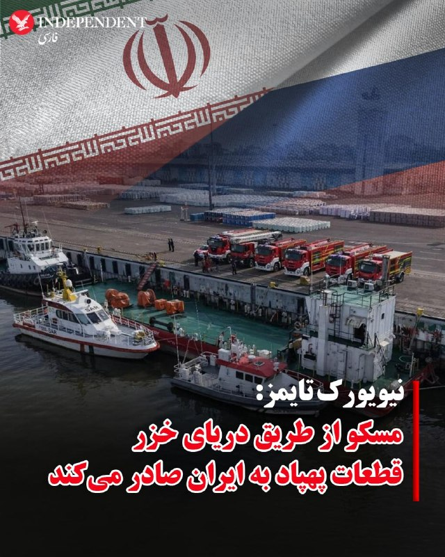

♦️روزنامه نیویورک‌تایمز، روز یکشنبه ۱۹ اردیبهشت ماه در گزارشی نوشت روسیه پس از بسته شدن تنگه هرمز، بخشی از انتقال کالا و تجهیزات به جمهوری اسلامی را از طریق دریای خزر انجام می‌دهد و این دریاچه اکنون به یکی از شریان‌های اصلی همکاری تهران و مسکو در دوران جنگ تبدیل شده است.
نیویورک‌تایمز به نقل از مقام‌های آمریکایی می‌نویسد، روسیه از طریق دریای خزر قطعات پهپاد به ایران ارسال می‌کند تا تهران بتواند پس از از دست دادن حدود ۶۰ درصد زرادخانه پهپادی خود در جنگ اخیر، توان تهاجمی‌اش را بازسازی کند.
بر اساس این گزارش روسیه اکنون بخشی از کالاهایی را که پیش‌تر از مسیر تنگه هرمز عبور می‌کردند، از طریق مسیرهای جایگزین و دریای خزر به ایران منتقل می‌کند.
مقام‌های ایرانی نیز گفته‌اند تلاش‌ها برای گسترش مسیرهای تجاری جایگزین با سرعت در حال انجام است و چهار بندر ایران در حاشیه دریای خزر به‌صورت شبانه‌روزی در حال دریافت گندم، ذرت، خوراک دام، روغن آفتابگردان و دیگر کالاهای اساسی هستند.
پیشتر محمدرضا مرتضوی، رئیس انجمن صنایع غذایی ایران، به صداوسیمای جمهوری اسلامی گفته بود تهران در حال انتقال واردات کالاهای اساسی و مواد غذایی از طریق دریای خزر است.
‌🇸🇦 Indypersian

🤖 @VahidOOnLine

## VahidOOnLine — post 239063

  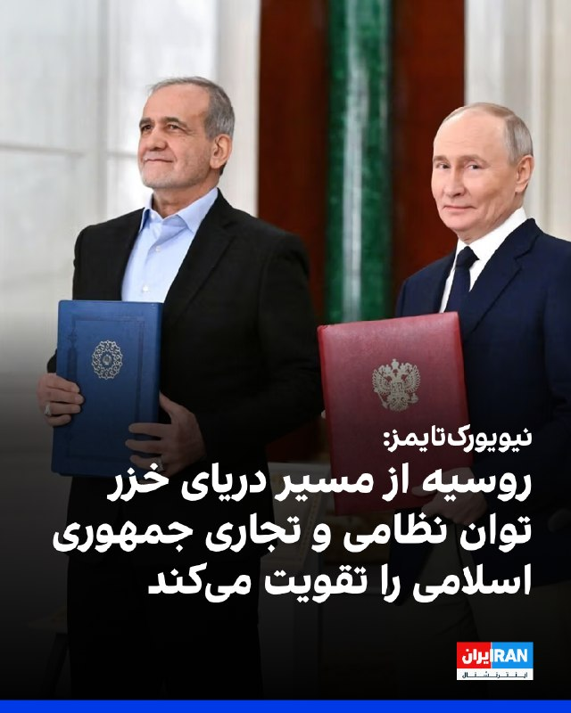

روزنامه نیویورک‌تایمز گزارش داد روسیه از طریق دریای خزر کالاهای نظامی و تجاری به ایران ارسال می‌کند تا توان جمهوری اسلامی را برای مقاومت در برابر حملات آمریکا تقویت کند.

این رسانه به نقل از مقام‌های آمریکایی نوشت روسیه از مسیر دریای خزر قطعات پهپاد به ایران منتقل می‌کند تا جمهوری اسلامی بتواند توان تهاجمی خود را بازسازی کند.

بر اساس این گزارش، روسیه همچنین کالاهایی را تامین می‌کند که پیش‌تر معمولا از تنگه هرمز عبور می‌کردند.

آمارهای تجاری روسیه نشان می‌دهد حمل‌ونقل از طریق دریای خزر در ماه‌های اخیر افزایش یافته است. ویتالی چرنوف، مدیر بخش تحلیل در گروه رسانه‌ای پورت‌نیوز، گفت سالانه دو میلیون تن گندم روسیه که پیش‌تر از دریای سیاه به ایران ارسال می‌شد، اکنون از مسیر خزر منتقل می‌شود. او افزود: «در سایه بی‌ثباتی در خاورمیانه، مسیرهای خزر به ایران بسیار جذاب‌تر به نظر می‌رسند.»

الکساندر شاروف، رییس موسسه روس‌ایران‌اکسپو که به صادرکنندگان روس برای یافتن خریداران ایرانی کمک می‌کند، برآورد کرد حجم بار عبوری از خزر ممکن است امسال دو برابر شود.
‌🏁 🇬🇧 IranintlTV

🤖 @VahidOOnLine

## VahidOOnLine — post 239062

  

وزارت کشور بحرین اعلام کرد دستگاه‌های امنیتی این کشور یک تشکیلات مرتبط با سپاه پاسداران و تفکر «ولایت فقیه» را شناسایی کرده‌اند و ۴۱ نفر از اعضای آن را بازداشت کرده‌اند.

در بیانیه وزارت کشور بحرین آمده است این اقدام بر اساس نتایج بررسی‌ها و گزارش‌های امنیتی و همچنین تحقیقات پیشین دادستانی کل در پرونده‌های جاسوسی برای نهادهای خارجی و همدلی با آنچه «تجاوز آشکار ایران» توصیف شده، انجام شده است.

بر اساس این بیانیه، عملیات جست‌وجو و بررسی برای شناسایی و برخورد با هر فردی که نقش او در فعالیت‌های این تشکیلات و ارتکاب اقدامات خلاف قانون اثبات شود، ادامه دارد.
‌🏁 🇬🇧 IranintlTV

🤖 @VahidOOnLine

## VahidOOnLine — post 239061

  <a href="telegram/content/VahidOOnLine_239061_1778321274.mp4">🎬 Download video</a>

وزارت کشور بحرین اعلام کرد پنج نفر را به اتهام همکاری با سپاه پاسداران بازداشت کرده و هویت نفر ششمی را که خارج از کشور است، شناسایی کرده است.
در بیانیه وزارت کشور بحرین آمده این افراد اطلاعات حساس و دقیق را از طریق «عناصر تروریستی» در ایران در اختیار سپاه پاسداران قرار می‌دادند. به گفته مقام‌های بحرینی، متهمان از مراکز حیاتی، اماکن مهم و چند هتل در این کشور عکس و مختصات جغرافیایی تهیه کرده و برای سپاه پاسداران ارسال کرده‌اند.
بحرین می‌گوید این اطلاعات در حملات ایران علیه این کشور مورد استفاده قرار گرفته است. وزارت کشور بحرین جزئیات بیشتری درباره هویت بازداشت‌شدگان منتشر نکرده است.
هفته گذشته نیز مقام‌های بحرینی چهار نفر دیگر را به اتهام جاسوسی برای سپاه پاسداران بازداشت کرده بودند.
‌🏁 🇬🇧 ManotoTV

🤖 @VahidOOnLine

## VahidOOnLine — post 239060

  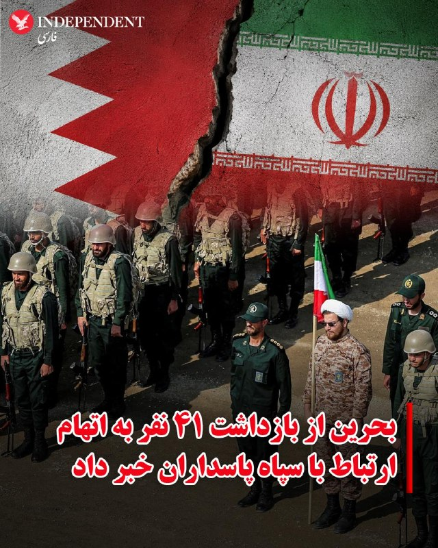

♦️وزارت کشور بحرین اعلام کرد ۴۱ نفر را در ارتباط با شبکه‌ای وابسته به سپاه پاسداران جمهوری اسلامی بازداشت کرده است.
این وزارتخانه در بیانیه‌ای اعلام کرد یک «سازمان مرتبط با سپاه پاسداران» را شناسایی کرده که با «طرف‌های خارجی» همکاری داشته است.
بحرین پیشتر اعلام کرده بود، تابعیت ۶۹ نفر از شهروندانش را به دلیل حمایت از حملات جمهوری اسلامی به این کشور سلب کرده است. منامه این افراد را به همدلی با تهران و «تبانی با نهادهای خارجی» متهم کرده است.
‌🇸🇦 Indypersian

🤖 @VahidOOnLine

## VahidOOnLine — post 239059

  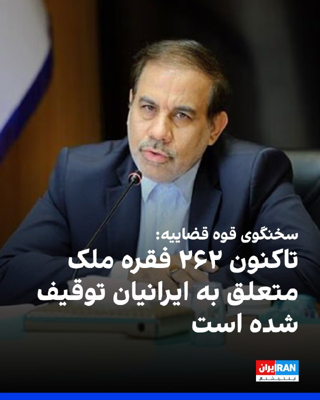

اصغر جهانگیر، سخنگوی قوه قضاییه در نشست خبری ۱۹ اردیبهشت اعلام کرد تاکنون ۲۶۲ فقره ملک متعلق به ایرانیان، با اتهامات مربوط به جنگ، توقیف شده است.
او اضافه کرد بر اساس گزارشی که از سازمان ثبت اسناد و املاک کشور دریافت شده، تاکنون در پی نامه‌های دادستانی کل کشور درباره بازداشت و توقیف اموال شهروندان، ۷۲۲ استعلام از سوی سازمان ثبت اسناد و املاک کشور انجام شده است.
‌🏁 🇬🇧 IranintlTV

🤖 @VahidOOnLine

## VahidOOnLine — post 239058

  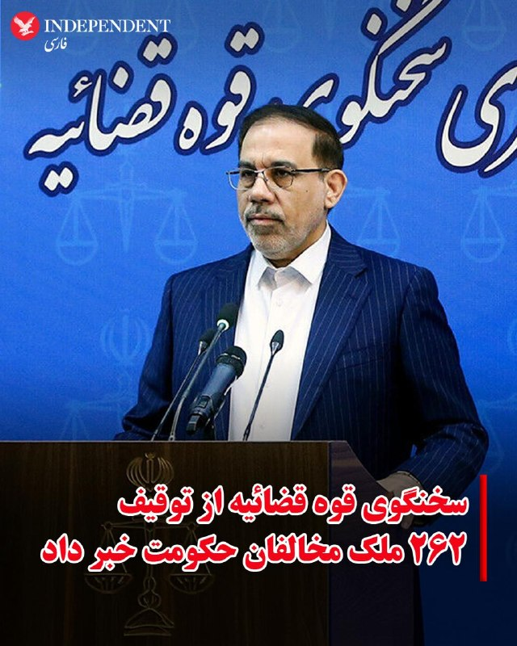

♦️اصغر جهانگیر، سخنگوی قوه قضائیه، روز یکشنبه ۱۹ اردیبهشت ماه، اعلام کرد ۲۶۲ ملک در کشور با اتهاماتی مرتبط به جنگ و همکاری با دشمن توقیف شده است.

جهانگیر گفت، قوه قضائیه در هفته‌های اخیر درباره «بازداشت و توقیف اموال وطن‌فروشان» ۷۲۲ استعلام از سوی سازمان ثبت اسناد و املاک کشور انجام داده است است.

به گفته سخنگوی قوه قضائیه بیشتر این املاک در استان‌های تهران، گیلان، البرز، مازندران و اصفهان قرار دارند.
قوه قضائیه جمهوری اسلامی از اسفند ماه سال گذشته اعلام کرده بود اموال ایرانیان مخالف حکومت را توقیف خواهد کرد.
‌🇸🇦 Indypersian

🤖 @VahidOOnLine

## VahidOOnLine — post 239057

  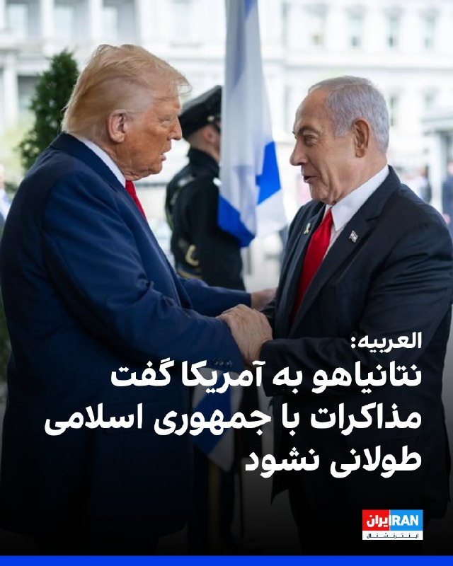

شبکه العربیه به نقل از منابع آگاه گزارش داد که بنیامین نتانیاهو، نخست‌وزیر اسرائیل، به دولت آمریکا اعلام کرده است که روند مذاکره با جمهوری اسلامی نباید طولانی شود. این منابع گفتند که نتانیاهو همچنین گفته است که هر توافقی که برنامه هسته‌ای جمهوری اسلامی را برچیند، کافی نخواهد بود.

بر اساس این گزارش، اسرائیل با آمریکا درباره گزینه‌های احتمالی تشدید تنش، از جمله هدف قرار دادن تاسیسات انرژی در ایران، گفت‌وگو کرده است.
‌🏁 🇬🇧 IranintlTV

🤖 @VahidOOnLine

## mwarmonitor — post 8744

🏥سازمان جهانی بهداشت (WHO) تأیید کرد که از میان ۸ مورد مشکوک گزارش‌شده مرتبط با شیوع بیماری در کشتی کروز MV Hondius، تاکنون ۶ مورد ابتلای آزمایشگاهیِ قطعی به هانتاویروس شناسایی شده است.
🔸بر اساس این گزارش، ۳ نفر جان باخته‌اند که معادل نرخ مرگ‌ومیر ۳۸ درصدی است.

@mwarmonitor

## mwarmonitor — post 8743

🔴نیویورک تایمز به نقل از مقام‌های آمریکایی:

🇷🇺🇮🇷روسیه از طریق دریای خزر قطعات و اجزای پهپادها را به ایران صادر می‌کند؛ اقدامی که به بازسازی و تقویت توانمندی‌های پهپادی ایران کمک می‌کند.

🇷🇺روسیه کالاهایی را در اختیار ایران قرار می‌دهد که پیش‌تر معمولاً از تنگه هرمز عبور می‌کردند.

🇷🇺در ماه‌های اخیر، افزایش چشمگیری در تردد و حمل‌ونقل دریایی به ایران از طریق دریای خزر مشاهده شده است.

@mwarmonitor

## pm_afshaa — post 90396

🔴پوتین در رژه روز پیروزی:پیروزی همیشه از آنِ ما بوده و خواهد بود

+نیروهای روسیه در اوکراین با جبهه‌ای تهاجمی که از سوی تمام ناتو حمایت می‌شود مقابله می‌کنند و با وجود این، همچنان در حال پیشروی هستن

💧 Rainbet.com the #1 Non-KYC Crypto Casino & Sportsbook @rainbetcom

😁 @Pm_Afshaa

## pm_afshaa — post 90395

🔴العربیه:تل‌آویو گزینه‌های احتمالی تشدید تنش از جمله هدف قرار دادن تأسیسات انرژی را با واشنگتن بررسی کرده

💧 Rainbet.com the #1 Non-KYC Crypto Casino & Sportsbook @rainbetcom

😁 @Pm_Afshaa

## pm_afshaa — post 90394

🔴قوه قضاییه خبر از توقیف اموال 264 نفر از مخالفان حکومت را داد

💧 Rainbet.com the #1 Non-KYC Crypto Casino & Sportsbook @rainbetcom

😁 @Pm_Afshaa

## DEJradio — post 4531

  <a href="telegram/content/DEJradio_4531_1778321277.jpg">🎬 Download video</a>

🚨
🔸 خبر ۲۱
آدینه ۱۸ اردیبهشت ۱۴۰۵

#خبر۲۱
@DEJradio

## mamlekate — post 103486

📝 واشنگتن بیش از ۱۳ کیلوگرم اورانیوم غنی‌شده را از ونزوئلا خارج و به آمریکا منتقل کرد

وزارت انرژی آمریکا روز جمعه ۱۸ اردیبهشت اعلام کرد تحت رهبری دونالد ترامپ، ۱۳.۵ کیلوگرم اورانیوم غنی‌شده با درجه خلوص بالا را از یک رآکتور تحقیقاتی در ونزوئلا خارج و به ایالات متحده منتقل کرده است.

📝 چرا خروج اورانیوم غنی‌شده ونزوئلا پیروزی بزرگ برای آمریکاست؟

@mamlekate

## mamlekate — post 103485

📝 ترامپ: اگر مذاکرات با تهران شکست بخورد، «پروژه آزادی پلاس» را آغاز می‌کنیم

دونالد ترامپ، رئیس‌جمهوری آمریکا، اعلام کرد که ایالات متحده در انتظار پاسخ جمهوری اسلامی درباره توافق احتمالی است، اما در صورت به نتیجه نرسیدن مذاکرات طرح‌های دیگری در نظر گرفته شده است.

📝 بلومبرگ: ترامپ برای بازگشایی تنگه هرمز، پرونده هسته‌ای و موشکی ایران را موقتا کنار گذاشته است

@mamlekate

## mamlekate — post 103484

📝 در حمله مسلحانه ماموران به روستای پیان در ایذه، ۷ نفر بازداشت و ۳ نفر مجروح شدند

@mamlekate

## IranIntlTV — post 336273

  <a href="telegram/content/IranIntlTV_336273_1778321277.mp4">🎬 Download video</a>

در فرانسه، مدل هوش مصنوعی «میسترال» با بازسازی سبک و جهان نمایشی مولیر، نویسنده‌ای که حدود چهار قرن پیش زندگی می‌کرد، نمایشنامه‌ای تازه خلق کرده است. این نمایش که در کاخ ورسای و در اپرای سلطنتی به روی صحنه رفت، حالا بحث تازه‌ای درباره مرز میان خلاقیت انسانی و هوش مصنوعی به راه انداخته است.

گزارش فرزیا ثابتی، خبرنگار ایران‌اینترنشنال
@iranintltv

## IranIntlTV — post 336272

ویدیوی رسیده به ایران اینترنشنال نشان می‌دهد ایرانیان استرالیا در شهر بریزبن روز شنبه تجمع برگزار کرده و در حمایت از انقلاب ملی شعار داده و تصاویری از جاویدنامان و زندانیان سیاسی را به دست گرفتند.

## IranIntlTV — post 336271

  <a href="telegram/content/IranIntlTV_336271_1778321278.mp4">🎬 Download video</a>

ارتش اسرائیل اسنادی از مکاتبات داخلی حماس منتشر کرد. بر اساس این اسناد این گروه برنامه‌ریزی طولانی مدت برای حمله هفتم اکتبر را با هماهنگی حزب‌الله لبنان و جمهوری اسلامی انجام داده است.

اشکان صفایی، خبرنگار ایران‌اینترنشنال، گزارش می‌دهد
@iranintltv

## IranIntlTV — post 336270

🔻نتیجه یک پژوهش درباره حمله هفت اکتبر: با برنامه‌ریزی طولانی‌مدت و در هماهنگی با تهران بود

🖋تحلیل - اشکان صفایی
خبرنگار ایران‌اینترنشنال در اسرائیل

روزنامه معاریو در گزارشی نوشت اسناد محرمانه و نامه‌های تازه منتشرشده از یحیی سنوار و رهبران حماس، از برنامه‌ریزی‌های طولانی‌مدت این گروه برای حمله هفتم اکتبر خبر می‌دهد و هماهنگی دقیق با «محور مقاومت»، از جمله حزب‌الله لبنان و جمهوری اسلامی.

بر اساس این گزارش، این افشاگری‌ها که حاصل یک پژوهش بر روی مکاتبات داخلی حماس است، نشان می‌دهد برخلاف تصور نهادهای امنیتی اسرائیل مبنی بر مرعوب بودن حماس، این گروه از سال ۲۰۲۱ در حال تدارک عملیاتی برای نابودی اسرائیل بوده است.

در این میان، نقش رایزنی‌های سطح بالا با مقامات ارشد ایرانی از جمله اسماعیل قاآنی و توافق کلیدی رهبران «جبهه مقاومت» برای اطلاع‌رسانی مستقیم به علی خامنه‌ای درباره سناریوی حمله هم‌زمان چندجبهه‌ای، از اهمیت ویژه‌ای در طراحی این عملیات برخوردار بوده است.
حمله چگونه آغاز شد؟

شمارش معکوس برای این حمله گسترده از ماه می سال ۲۰۲۱ و پس از نبرد موسوم به «نگهبان دیوارها» آغاز شد. نبردی که حماس آن را لحظه‌ای تعیین‌کننده برای نابودی اسرائیل در نظر گرفت.

بر اساس اسناد به‌دست آمده از سوی ارتش اسرائیل و تحلیل شده به‌وسیله دکتر دانیال سوبلمن، رهبران حماس از آن زمان اسرائیل را «کشوری ضعیف» می‌پنداشتند و نیروهای خود را برای یک اقدام دراماتیک که آن را «پروژه بزرگ» می‌نامیدند، آموزش می‌دادند.

در این مدت، حماس با استفاده از خطای محاسباتی اسرائیل که آن‌ها را تنها «یک گروه تبهکار» و نه یک ارتش ده‌ها هزار نفری می‌دید، در زیر سایه غفلت نهادهای امنیتی، تدارکات نظامی خود را برای نبردی استراتژیک تکمیل کرد.
بخش مهمی از این اسناد به تلاش‌های یحیی سنوار برای متقاعد کردن متحدان منطقه‌ای خود، به ویژه حزب‌الله لبنان و جمهوری اسلامی، اختصاص دارد.

اگرچه در ابتدا حسن نصرالله، دبیرکل وقت حزب الله، به دلیل اولویت داشتن مسائل مرتبط با ایران نسبت به موضوع فلسطین دچار تردید بود و سنوار نیز در مقطعی از ابای نسبی ایران و حزب‌الله برای پیوستن به حمله خبر داده بود، اما رایزنی‌ها برای جلب مشارکت آن‌ها به شدت جریان داشت.

دو سال پیش از حمله هفتم اکتبر، دیداری تعیین‌کننده در بیروت با حضور نصرالله، اسماعیل هنیه و قاآنی، فرمانده نیروی قدس سپاه پاسداران انقلاب اسلامی، برگزار شد که در آن، حاضران بر امکان‌پذیر بودن متلاشی کردن اسرائیل تاکید کردند.

نقطه اوج این هماهنگی‌ها در ماه ژوییه سال ۲۰۲۲ رقم خورد؛ زمانی که هنیه به سنوار اطلاع داد نصرالله به طور قاطع از سناریوی اول و مطلوب حماس، یعنی حمله هم‌زمان و غافلگیر‌کننده از چند جبهه، حمایت کرده است.

🔗ادامه این تحلیل را اینجا بخوانید
@iranintltv

## IranIntlTV — post 336269

  

روزنامه نیویورک‌تایمز گزارش داد روسیه از طریق دریای خزر کالاهای نظامی و تجاری به ایران ارسال می‌کند تا توان جمهوری اسلامی را برای مقاومت در برابر حملات آمریکا تقویت کند.

این رسانه به نقل از مقام‌های آمریکایی نوشت روسیه از مسیر دریای خزر قطعات پهپاد به ایران منتقل می‌کند تا جمهوری اسلامی بتواند توان تهاجمی خود را بازسازی کند.

بر اساس این گزارش، روسیه همچنین کالاهایی را تامین می‌کند که پیش‌تر معمولا از تنگه هرمز عبور می‌کردند.

آمارهای تجاری روسیه نشان می‌دهد حمل‌ونقل از طریق دریای خزر در ماه‌های اخیر افزایش یافته است. ویتالی چرنوف، مدیر بخش تحلیل در گروه رسانه‌ای پورت‌نیوز، گفت سالانه دو میلیون تن گندم روسیه که پیش‌تر از دریای سیاه به ایران ارسال می‌شد، اکنون از مسیر خزر منتقل می‌شود. او افزود: «در سایه بی‌ثباتی در خاورمیانه، مسیرهای خزر به ایران بسیار جذاب‌تر به نظر می‌رسند.»

الکساندر شاروف، رییس موسسه روس‌ایران‌اکسپو که به صادرکنندگان روس برای یافتن خریداران ایرانی کمک می‌کند، برآورد کرد حجم بار عبوری از خزر ممکن است امسال دو برابر شود.
https://iranintl.com/202605097553

## IranIntlTV — post 336268

  <a href="telegram/content/IranIntlTV_336268_1778321282.mp4">🎬 Download video</a>

مراسم هشتاد و یکمین سالگرد پیروزی متفقین در جنگ جهانی دوم در میدان سرخ مسکو برگزار شد. روسیه پیش‌تر اعلام کرده بود به‌ دلیل افزایش تهدیدهای اوکراین، رژه امسال را در ابعادی کوچک‌تر برگزار خواهد کرد.

گفت‌وگو با شهناز کامل‌زاده، خبرنگار ایران‌اینترنشنال
@iranintltv

## IranIntlTV — post 336267

🔻سنتکام: نیروهای آمریکا در سراسر منطقه همچنان برای انجام ماموریت آماده‌اند

ستاد فرماندهی مرکزی ارتش آمریکا، سنتکام، تصویری از یک جنگنده اف-۱۶ نیروی هوایی این کشور منتشر کرد و اعلام کرد این هواپیما در حریم هوایی خاورمیانه پرواز می‌کند.

سنتکام شنبه ۱۹ اردیبهشت در توضیح این تصویر نوشت: «نیروهای آمریکا در سراسر منطقه همچنان برای انجام ماموریت آماده هستند.»

ستاد فرماندهی مرکزی ایالات متحده پیش‌تر اعلام کرد نیروهای آمریکا دو نفتکش با پرچم جمهوری اسلامی را در دریای عمان، پیش از رسیدن به بنادر ایران، متوقف کردند.

بنا بر اعلام سنتکام، دو نفتکش خالی «سودا» و «سی‌استار۳» پس از نقض محاصره دریایی، با حمله جنگنده اف-۱۸ و شلیک مهمات هدایت‌شونده به دودکش آن‌ها از کار افتادند.
هم‌زمان، فواد مرادزاده، فرماندار بندر لنگه، اعلام کرد: «در حمله اخیر جنگنده‌های آمریکایی به شناورهای باری و صیادی ایرانی در نزدیکی بندر خصب در عمان، شش نفر مفقود شدند.»

مرادزاده درباره حمله‌ای که به گفته او پنج‌شنبه ۱۷ اردیبهشت رخ داد، گفت: «در این حادثه شش فروند قایق متعلق به اهالی بندر معلم از توابع بخش مرکزی شهرستان بندر لنگه هدف قرار گرفت که در مجموع ۲۰ نفر سرنشین داشتند.»

از سوی دیگر، دونالد ترامپ، رییس‌جمهوری آمریکا، درباره چشم‌انداز توافق با جمهوری اسلامی به خبرنگاران گفت: «اگر همه چیز امضا و نهایی نشود، مسیر متفاوتی را در پیش خواهیم گرفت. اگر اتفاقی نیافتد، ممکن است به پروژه آزادی تنگه هرمز بازگردیم، اما آن پروژه آزادی پلاس خواهد بود؛ یعنی پروژه آزادی به اضافه موارد دیگر.»

او در پاسخ به پرسش یک خبرنگار مبنی بر اینکه آیا جمهوری اسلامی عمدا روند مذاکرات را به کندی پیش می‌برد نیز گفت: «به‌زودی خواهیم فهمید.»

ترامپ پیش‌تر اعلام کرد با توجه به درخواست پاکستان و برخی کشورهای دیگر، و همچنین «پیشرفت بزرگ» در مسیر دستیابی به توافقی کامل و نهایی با نمایندگان تهران، موافقت کرده است «پروژه آزادی» برای مدت کوتاهی متوقف شود.

به دنبال اعلام توقف اجرای این پروژه، حسین نوش‌آبادی، مدیرکل پارلمانی وزارت امور خارجه جمهوری اسلامی، گفت «پروژه آزادی» آمریکا به علت «پاسخ کوبنده نیروهای مسلح و هشدارهای جدی سپاه پاسداران و ناتوانی ایالات متحده در عبور از تنگه هرمز» به شکست انجامید.

نوش‌آبادی افزود: «هرگونه ماجراجویی نظامی آمریکا و متحدانش در تنگه هرمز و خلیج فارس، هزینه‌های غیرقابل تحمل را برای آنان به همراه داشته و به پیچیده‌تر شدن ماجرا منجر خواهد شد.»
رسانه‌های بین‌المللی به نقل از داده‌های کشتی‌رانی گزارش دادند که جمهوری اسلامی نهاد جدیدی را برای کنترل کشتی‌رانی در تنگه هرمز ایجاد کرده است؛ هر چند مقامات تهران گفته‌اند در حال بررسی توافق صلح با آمریکا هستند.

آسوشیتدپرس ۱۷ اردیبهشت به نقل از شرکت داده‌های کشتی‌رانی «لوییدز لیست اینتلیجنس» گزارش داد که جمهوری اسلامی یک نهاد دولتی جدید برای تایید عبور و دریافت عوارض از کشتی‌ها در تنگه ایجاد کرده است و این اقدام بر نگرانی‌ها درباره تضعیف آزادی کشتی‌رانی که تجارت جهانی به آن وابسته است، افزوده است.
🔗وب‌سایت ایران‌اینترنشنال
@iranintltv

## IranIntlTV — post 336266

🔻روزنامه ژاپنی یومیوری شیمبون: ایرانیان میان جنگ و بحران، هنوز به تغییر امید دارند

روزنامه ژاپنی یومیوری شیمبون در گزارشی تحلیلی به قلم کنجی ناکانیشی، خبرنگار پیشین خود در تهران، نوشت با وجود جنگ، بحران اقتصادی و فشارهای سیاسی، بسیاری از شهروندان ایرانی همچنان در کشور مانده‌اند و آینده ایران را نه قدرت‌های خارجی، بلکه خود مردم ایران تعیین خواهند کرد.

نویسنده گزارش با بازگشت به مراسم تشییع عباس کیارستمی در سال ۲۰۱۶، آن مراسم را نمادی از احساسات پنهان جامعه ایران توصیف می‌کند؛ جامعه‌ای که به نوشته او به دلیل ترس از نظارت حکومتی، کمتر احساسات واقعی خود را آشکار می‌کند.

ناکانیـشی می‌نویسد هزاران نفر در مراسم خاکسپاری کیارستمی در تهران شرکت کرده بودند و زمانی که اصغر فرهادی در سوگنامه خود از ماندن کیارستمی در ایران «با وجود طرد شدن و سنگ‌اندازی‌ها» سخن گفت، جمعیت با تشویقی طولانی واکنش نشان دادند.

به نوشته این گزارش، کیارستمی پس از انقلاب ۱۳۵۷ قصد ترک ایران را داشته، اما در نهایت به دلیل خانواده‌اش در کشور مانده بود. او در سال‌های بعد نیز با وجود سانسور شدید، محدودیت‌های حکومتی و ممنوعیت نمایش صحنه‌هایی مانند نوشیدن الکل یا بوسه، به فعالیت سینمایی ادامه داد و حتی گفته بود: «محدودیت است که تخیل را شکوفا می‌کند.»

ناکانیشی سپس به جنگ کنونی حکومت ایران و آمریکا و پیامدهای آن می‌پردازد و می‌نویسد بیش از دو ماه پس از آغاز حملات آمریکا و اسرائیل، جمهوری اسلامی همچنان با بستن تنگه هرمز و فشار بر اقتصاد جهانی به مقابله ادامه می‌دهد، هرچند آتش‌بس شکننده‌ای برقرار شده است.
در این گزارش آمده بحران اقتصادی در ایران به‌شدت تشدید شده است. یکی از شهروندان ایرانی به نویسنده گفته قیمت تخم‌مرغ طی یک ماه سه تا چهار برابر شده، شیر هر روز گران‌تر می‌شود و قیمت نان بربری افزایش یافته، در حالی که اندازه آن کوچک‌تر شده است.

با این حال، برخلاف تصور اولیه، نشانه‌ای از موج گسترده خروج مردم از ایران دیده نمی‌شود. بر اساس داده‌های کمیساریای عالی پناهندگان سازمان ملل، شمار افرادی که از ایران وارد ترکیه می‌شوند کاهش یافته و در مقابل، تعداد سفرها از ترکیه به ایران افزایش یافته است. این نهاد اعلام کرده بیشتر سفرها با اهداف گردشگری، تجاری یا خانوادگی انجام می‌شود و هنوز نشانه‌ای از آوارگی گسترده مشاهده نشده است.

خبرنگار پیشین یومیوری شیمبون در تهران، به پیام‌های منتشرشده در شبکه‌های اجتماعی از سوی شهروندان تهرانی نیز اشاره می‌کند؛ پیام‌هایی که نگرانی، خستگی و هم‌زمان امید به آینده را بازتاب می‌دهند.

یکی از این روایت‌ها متعلق به زنی است که دوران جنگ ایران و عراق را در کودکی تجربه کرده و اکنون نگران تکرار همان تجربه برای دختر هشت‌ساله‌اش است. او نوشته بود: «این فقط یک خاطره نیست؛ تاریخ در حال تکرار شدن است.»

این زن در پاسخ به پرسشی درباره دلیل ماندن مردم در ایران گفته است سقوط ارزش پول ملی و دشوار شدن مهاجرت، یکی از دلایل اصلی است. او همچنین گفته مردم ایران در برابر جنگ و خبرهای بد «مقاوم‌تر» شده‌اند و بسیاری امیدوارند این جنگ در نهایت به «نتیجه‌ای مثبت» یعنی تغییرات سیاسی و اقتصادی منجر شود.
نویسنده در ادامه به مقاله چندی پیش جواد ظریف، وزیر امور خارجه پیشین حکومت ایران، در مجله فارن افرز اشاره می‌کند؛ مقاله‌ای که در آن ظریف هشدار داده ادامه جنگ با آمریکا و اسرائیل تنها به نابودی بیشتر زیرساخت‌ها و جان غیرنظامیان منجر خواهد شد.

ناکانیشی در بخشی از مقاله خود به پیشنهاد ظریف اشاره می‌کند که نوشته بود ایران در ازای لغو تحریم‌ها، محدودیت‌هایی بر برنامه هسته‌ای خود بپذیرد، تنگه هرمز را بازگشایی کند و حتی برای کاهش تنش‌ها با آمریکا، پیمان عدم تعرض متقابل را بررسی کند.

ناکانیـشی با این حال می‌نویسد حتی در صورت دستیابی به توافق، تضمینی وجود ندارد که خواسته‌های مردم ایران برای آزادی، رفاه اقتصادی و زندگی عادی تحقق یابد. او تاکید می‌کند پاسخ ندادن ایرانیان به فراخوان دونالد ترامپ برای «قیام» به معنای رضایت آن‌ها از حکومت نیست.

در بخش پایانی گزارش، یک شهروند ایرانی که نخواست نامش فاش شود، می‌گوید: «ما ایرانی می‌خواهیم که بتوانیم در آن با آرامش زندگی کنیم، اینترنت عادی داشته باشیم و بدون ترس از زندان آزادانه حرف بزنیم. مردم واقعا خسته شده‌اند.»

نویسنده یومیوری شیمبون در پایان نتیجه می‌گیرد که آینده ایران را نه جنگ و نه قدرت‌های خارجی، بلکه خود مردم ایران تعیین خواهند کرد؛ مردمی که مانند عباس کیارستمی سال‌ها سختی و محدودیت را تحمل کرده‌اند.
🔗وب‌سایت ایران‌اینترنشنال
@iranintltv

## IranIntlTV — post 336265

  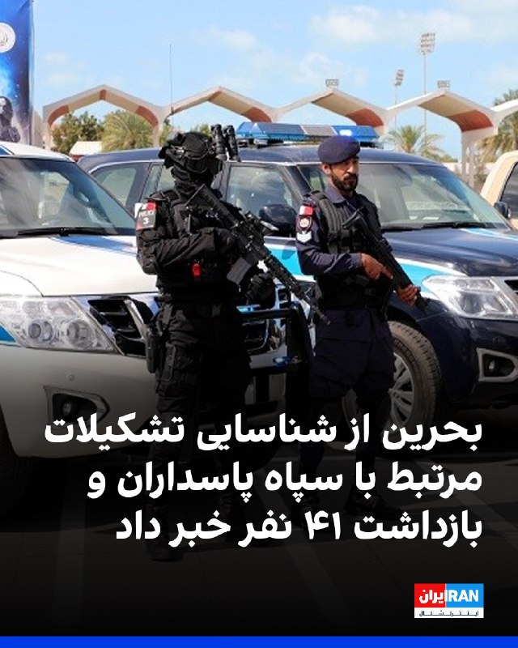

وزارت کشور بحرین اعلام کرد دستگاه‌های امنیتی این کشور یک تشکیلات مرتبط با سپاه پاسداران و تفکر «ولایت فقیه» را شناسایی کرده‌اند و ۴۱ نفر از اعضای آن را بازداشت کرده‌اند.

در بیانیه وزارت کشور بحرین آمده است این اقدام بر اساس نتایج بررسی‌ها و گزارش‌های امنیتی و همچنین تحقیقات پیشین دادستانی کل در پرونده‌های جاسوسی برای نهادهای خارجی و همدلی با آنچه «تجاوز آشکار ایران» توصیف شده، انجام شده است.

بر اساس این بیانیه، عملیات جست‌وجو و بررسی برای شناسایی و برخورد با هر فردی که نقش او در فعالیت‌های این تشکیلات و ارتکاب اقدامات خلاف قانون اثبات شود، ادامه دارد.
https://iranintl.com/202605096184

## IranIntlTV — post 336264

  

اصغر جهانگیر، سخنگوی قوه قضاییه در نشست خبری ۱۹ اردیبهشت اعلام کرد تاکنون ۲۶۲ فقره ملک متعلق به ایرانیان، با اتهامات مربوط به جنگ، توقیف شده است.
او اضافه کرد بر اساس گزارشی که از سازمان ثبت اسناد و املاک کشور دریافت شده، تاکنون در پی نامه‌های دادستانی کل کشور درباره بازداشت و توقیف اموال شهروندان، ۷۲۲ استعلام از سوی سازمان ثبت اسناد و املاک کشور انجام شده است.
https://iranintl.com/202605097737

## IranIntlTV — post 336263

  <a href="telegram/content/IranIntlTV_336263_1778321285.mp4">🎬 Download video</a>

مهدی تاج گفت برای حضور تیم ملی فوتبال در جام جهانی در آمریکا، برای فدراسیون جهانی فوتبال، ۱۰ شرط تعیین کرده است. او افزود صدور ویزا برای تمامی بازیکنان و اعضای تیم ملی که در سپاه خدمت کرده‌اند از جمله این شروط است.

گفت‌وگو با علیرضا مدیری، عضو تحریریه ایران‌اینترنشنال
@iranintltv

## IranIntlTV — post 336262

🔻سی‌ان‌ان: رهبر مجروح جمهوری اسلامی پنهان شده اما همچنان در راهبری جنگ نقش دارد

شبکه سی‌ان‌ان به نقل از منابع آگاه از ارزیابی‌های اطلاعاتی آمریکا گزارش داد مجتبی خامنه‌ای، رهبر جدید جمهوری اسلامی، با وجود پنهان بودن از انظار عمومی و ادامه درمان جراحات شدید ناشی از حملات آغاز جنگ، همچنان در شکل‌دهی به راهبرد حکومت و مذاکرات با آمریکا نقش دارد.

هرچند به نوشته سی‌ان‌ان، میزان دقیق اختیارات او در ساختار قدرتِ «چندپاره» جمهوری اسلامی روشن نیست. بر اساس این گزارش، مجتبی خامنه‌ای پس از حمله‌ای که به کشته شدن پدرش و چند فرمانده ارشد نظامی حکومت ایران انجامید، به‌عنوان رهبر جدید جمهوری اسلامی معرفی شد، اما جامعه اطلاعاتی آمریکا تاکنون نتوانسته حضور یا محل اقامت او را به‌طور مستقیم تایید کند.

منابع آگاه به سی‌ان‌ان گفته‌اند خامنه‌ای برای ارتباطات خود از هیچ وسیله الکترونیکی استفاده نمی‌کند و تنها از طریق ملاقات حضوری یا پیام‌رسان‌های فیزیکی با اطرافیان در تماس است. این منابع افزودند او همچنان در انزوا به سر می‌برد و تحت درمان جراحاتی از جمله سوختگی شدید در صورت، بازو، تنه و پا قرار دارد.

سی‌ان‌ان گزارش داد دولت دونالد ترامپ همچنان به دنبال پایان دیپلماتیک جنگ است؛ آن هم در شرایطی که آتش‌بس بیش از یک ماه ادامه یافته و ارزیابی‌های اطلاعاتی آمریکا نشان می‌دهد [حکومت] ایران، با وجود خسارات گسترده، همچنان بخش مهمی از توان نظامی خود را حفظ کرده و قادر است ماه‌ها دیگر نیز محاصره آمریکا را تحمل کند.

بر اساس ارزیابی‌های تازه اطلاعاتی، حدود دو سوم پرتابگرهای موشکی حکومت ایران همچنان سالم مانده‌اند؛ رقمی که از برآوردهای قبلی بالاتر است. مقام‌های آمریکایی معتقدند آتش‌بس به حکومت ایران فرصت داده بخشی از تجهیزات مدفون‌شده در حملات را بازیابی کند.
گزارش دیگری از سازمان سیا نیز نتیجه گرفته [حکومت] ایران احتمالا می‌تواند تا چهار ماه دیگر بدون فروپاشی کامل اقتصادی در برابر محاصره آمریکا دوام بیاورد.

سی‌ان‌ان نوشت با وجود آتش‌بس، در روزهای اخیر نیروهای آمریکایی و ایرانی همچنان درگیر تبادل آتش بوده‌اند و عبور و مرور در تنگه هرمز تقریبا متوقف شده است؛ در حالی که هر دو طرف مدعی کنترل این آبراه هستند.

یک مقام ارشد اطلاعاتی آمریکا به سی‌ان‌ان گفت محاصره اعمال‌شده از سوی دولت ترامپ «تجارت ایران را قطع، درآمدها را نابود و روند فروپاشی ساختاری اقتصاد را تسریع کرده است.» این مقام همچنین گفت نیروی دریایی [حکومت] ایران «نابود شده» و رهبران جمهوری اسلامی در مخفیگاه به سر می‌برند.

کاخ سفید نیز اعلام کرد عملیات نظامی و محاصره اقتصادی، همراه با شکاف‌های داخلی در ساختار قدرت ایران، توان تهران را برای ارائه مواضع واحد در مذاکرات کاهش داده است.

با این حال، منابع اطلاعاتی آمریکا به سی‌ان‌ان گفته‌اند مجتبی خامنه‌ای احتمالا از تصمیم‌گیری‌های روزمره فاصله دارد و دسترسی به او محدود است. به گفته این منابع، فرماندهان ارشد سپاه پاسداران انقلاب اسلامی به همراه محمد باقر قالیباف، رییس مجلس شورای اسلامی، عملا اداره روزمره کشور و جنگ را در دست گرفته‌اند.

این گزارش می‌افزاید پرسش‌ها درباره وضعیت جسمی و میزان قدرت رهبر جدید جمهوری اسلامی، کار دولت ترامپ را برای مذاکره دشوار کرده است؛ زیرا هنوز روشن نیست چه کسی در ایران اختیار واقعی برای توافق نهایی را دارد.

مارکو روبیو، وزیر خارجه آمریکا، جمعه ۱۸ اردیبهشت گفت: «ساختار آن‌ها همچنان به‌شدت دچار شکاف و ناکارآمدی است و همین موضوع ممکن است مانعی برای مذاکرات باشد.»
سی‌ان‌ان همچنین گزارش داد ارزیابی‌های اطلاعاتی آمریکا پیش از آغاز جنگ نیز پیش‌بینی کرده بودند که حذف رهبر پیشین جمهوری اسلامی لزوما به سقوط حکومت منجر نخواهد شد، زیرا جانشینان او نیز عمدتا از چهره‌های تندرو و نزدیک به سپاه هستند.

بر اساس این گزارش، دولت ترامپ در هفته‌های اخیر تلاش کرده از طریق مذاکرات به توافقی برای پایان جنگ برسد، اما اختلافات داخلی در ساختار قدرت ایران روند مذاکرات را پیچیده کرده است.

سی‌ان‌ان نوشت پیش از مذاکرات اسلام‌آباد، جی‌دی ونس، معاون رییس‌جمهوری آمریکا، از برخی کشورهای خلیج فارس درباره اینکه چه کسی در ایران اختیار واقعی مذاکره دارد، مشورت خواسته بود و برخی مقام‌های منطقه‌ای، قالیباف را موثرترین چهره جمهوری اسلامی در این زمینه معرفی کرده بودند.

قالیباف دور نخست مذاکرات با آمریکا در اسلام‌آباد را رهبری کرد، اما این مذاکرات بدون توافق پایان یافت و دور دوم گفت‌وگوها در پاکستان نیز برگزار نشد. ترامپ دلیل این شکست را «شکاف شدید در حکومت ایران» عنوان کرده بود.

سی‌ان‌ان در پایان نوشت دولت ترامپ همچنان می‌گوید آتش‌بس برقرار است و تهران در حال بررسی تازه‌ترین پیشنهاد آمریکا برای پایان جنگ است.
🔗وب‌سایت ایران‌اینترنشنال
@iranintltv

## IranIntlTV — post 336261

🔻وای‌نت: جنگ شاید پایان یابد، اما بحران داخلی جمهوری اسلامی تازه آغاز شده است

وب‌سایت وای‌نت در تحلیلی نوشت حتی اگر جنگ [حکومت] ایران و آمریکا با آتش‌بس دائمی پایان یابد، جمهوری اسلامی با بحران‌های عمیق داخلی، اقتصادی و سیاسی درگیر خواهد ماند؛ بحران‌هایی که به گفته این تحلیل ممکن است روند تغییرات سیاسی در ایران را تسریع کند.

در این تحلیل آمده است جنگ در شرایطی آغاز شد که جمهوری اسلامی پیشاپیش با یکی از شدیدترین بحران‌های داخلی خود پس از انقلاب ۱۳۵۷ مواجه بود؛ بحرانی که پس از گسترده‌ترین موج اعتراضات ضدحکومتی در سال‌های اخیر تشدید شد.

به نوشته وای‌نت، حکومت ایران اکنون با بحران مشروعیتی عمیق روبه‌رو است؛ بحرانی که از شکاف فزاینده میان حکومت و جامعه، به‌ویژه نسل جوان، ناشی می‌شود و هم‌زمان با مشکلات شدید اقتصادی، کمبود آب و بحران برق همراه شده است.

این تحلیل با اشاره به اعتراض‌های پراکنده در بازار تهران می‌گوید چنین تجمع‌هایی به‌تنهایی نشانه آغاز موج جدید اعتراضات نیست، زیرا اعتراض به بخشی دائمی از فضای اجتماعی ایران تبدیل شده است. بر اساس پژوهشی از دانشگاه استنفورد که در این گزارش به آن اشاره شده، تهران بین سال‌های ۲۰۰۹ تا ۲۰۲۴ به‌طور متوسط هر سه روز یک‌بار شاهد نوعی اعتراض بوده است.
با این حال، وای‌نت می‌نویسد جنگ اخیر هم‌زمان باعث تقویت احساسات ملی‌گرایانه در بخشی از جامعه ایران شده است. در این تحلیل آمده ادامه حملات به زیرساخت‌های ملی و دانشگاه‌ها، تهدیدهای دونالد ترامپ درباره «بازگرداندن ایران به عصر حجر» و گزارش‌هایی درباره تلاش برای تحریک اقلیت‌های قومی، حتی در میان برخی مخالفان جمهوری اسلامی نیز نگرانی‌هایی درباره حفظ تمامیت و استقلال ایران ایجاد کرده است.

این تحلیل به نقل از بیژن عبدالکریمی، استاد دانشگاه وابسته به حکومت، می‌نویسد بسیاری از شهروندان، در کنار خواست زندگی بهتر، اکنون حفظ استقلال سیاسی ایران را نیز ضروری می‌دانند و نگران‌اند تلاش برای فروپاشی حکومت به تهدیدی علیه موجودیت کشور تبدیل شود.

وای‌نت در ادامه تاکید می‌کند رهبران جمهوری اسلامی به‌خوبی از خطر بازگشت اعتراضات اجتماعی پس از پایان جنگ آگاه‌اند. در این گزارش به هشدار یک جامعه‌شناس ایرانی اشاره شده که گفته فشار اقتصادی، طبقه متوسط ایران را فرسوده کرده و جامعه را به سمت شکاف شدید میان اقلیتی ثروتمند و اکثریتی فقیر سوق داده است.

بر اساس این تحلیل، حتی اگر توافق احتمالی میان تهران و واشینگتن به کاهش تحریم‌ها منجر شود، مشکلات ساختاری اقتصاد ایران - از جمله فساد، سوءمدیریت و سلطه نهادهای دولتی و شبه‌دولتی - همچنان پابرجا خواهد ماند و لغو تحریم‌ها به‌تنهایی قادر به حل بحران اقتصادی نخواهد بود.

وای‌نت همچنین از شکل‌گیری آنچه «جمهوری اسلامی سوم» توصیف شده سخن می‌گوید؛ مرحله‌ای که به نوشته این تحلیل، پس از مرگ علی خامنه‌ای و با افزایش نقش سپاه پاسداران انقلاب اسلامی، ساختار قدرت از حکومت دینی به نوعی اقتدارگرایی نظامی تغییر یافته است.

به نوشته این تحلیل، رهبران جدید حکومت ایران در کوتاه‌مدت بر بقا و جلوگیری از ازسرگیری جنگ متمرکزند، اما پس از پایان درگیری‌ها ناچار خواهند شد با پیامدهای گسترده اقتصادی و اجتماعی جنگ روبه‌رو شوند.
در این تحلیل آمده است بر اساس گزارش‌های رسمی، تنها در استان تهران حدود ۶۰ هزار واحد مسکونی آسیب دیده و مقام‌های حوزه انرژی هشدار داده‌اند بازسازی زیرساخت‌ها ممکن است حدود دو سال زمان ببرد. همچنین پیش‌بینی شده زمستان آینده از نظر تامین انرژی برای صنعت، کشاورزی و خدمات بسیار دشوار باشد و مصرف بخش خصوصی احتمالا باید تا ۴۰ درصد کاهش یابد.

وای‌نت همچنین هشدار می‌دهد پایان جنگ ممکن است شکاف‌های داخلی در ساختار قدرت جمهوری اسلامی را تشدید کند؛ به‌ویژه در شرایطی که حکومت تاکنون عمدتا به دلیل وضعیت جنگی انسجام خود را حفظ کرده است.

این تحلیل به وضعیت مجتبی خامنه‌ای نیز اشاره می‌کند و می‌نویسد رهبر جدید جمهوری اسلامی ممکن است زودتر از انتظار با انتقادها درباره جانشینی موروثی و توانایی خود برای تثبیت قدرت روبه‌رو شود؛ موضوعی که از نگاه بسیاری با اصول اولیه جمهوری اسلامی در تضاد است.

وای‌نت در پایان نتیجه می‌گیرد که حتی اگر تغییر حکومت در کوتاه‌مدت محتمل نباشد، پایان جنگ می‌تواند جمهوری اسلامی را ناچار کند با بحران‌های انباشته اقتصادی، اجتماعی و سیاسی مواجه شود؛ بحران‌هایی که به نوشته این تحلیل ممکن است روند فرسایش و افول نظام را تسریع کنند.
🔗وب‌سایت ایران‌اینترنشنال
@iranintltv

## IranIntlTV — post 336260

🔻اف‌بی‌آی: عامل تیراندازی مرگبار آستین به جمهوری اسلامی و خامنه‌ای علاقه داشت

اف‌بی‌آی اعلام کرد عامل تیراندازی مرگبار آستین در تگزاس که سه کشته و بیش از ۱۲ زخمی برجا گذاشت، به جمهوری اسلامی و علی خامنه‌ای علاقه داشت، اما هیچ ارتباطی با سازمان‌های تروریستی خارجی نداشت و به‌تنهایی عمل کرده است.

اداره تحقیقات فدرال آمریکا، اف‌بی‌آی، در جمع‌بندی نهایی خود درباره تیراندازی مرگبار ماه مارس اعلام کرد عامل حمله به‌تنهایی عمل کرده و هیچ ارتباطی با سازمان‌های تروریستی خارجی نداشته است؛ هرچند تحقیقات نشان می‌دهد او تحت تاثیر «جنگ ایران» و اقدامات نظامی آمریکا و اسرائیل علیه جمهوری اسلامی قرار داشته و به رهبر کشته شده جمهوری اسلامی علاقه نشان می‌داده است.

به گزارش ای‌بی‌سی نیوز
، فرد مهاجم «اندیاگا دیاگنه» ۵۳ ساله، شهروند آمریکاییِ سنگالی‌تبار، صبح اول مارس در خیابان معروف «سیکس استریت» آستین به سوی مردم تیراندازی کرد که در نتیجه آن سه نفر کشته و بیش از ۱۲ نفر زخمی شدند. او در نهایت در درگیری با نیروهای پلیس کشته شد.

اف‌بی‌آی در آغاز تحقیقات احتمال ارتباط این حمله با تروریسم سازمان‌یافته را بررسی کرده بود، اما در گزارش نهایی اعلام کرد «هیچ مدرکی» دال بر هدایت خارجی یا ارتباط او با گروه‌های تروریستی وجود ندارد.
در بیانیه رسمی اف‌بی‌آی آمده است: «تحقیقات نشان می‌دهد تشدید رفتار خشونت‌آمیز او تا حدی با محرک‌ها و نارضایتی‌های شخصی مرتبط با اقدامات نظامی آمریکا و اسرائیل علیه [حکومت] ایران ارتباط داشته و در نهایت به حمله‌ای خشونت‌آمیز و ناگهانی منجر شده است.»

بر اساس این گزارش، زمان وقوع تیراندازی هم‌زمان با آغاز جنگ کنونی ایران و آمریکا بوده؛ جنگی که طی آن حملات آمریکا و اسرائیل به کشته شدن علی خامنه‌ای، رهبر جمهوری اسلامی، منجر شد.

اف‌بی‌آی همچنین اعلام کرد تحقیقات نشان داده دیاگنه «احترام و علاقه عمیقی» به خامنه‌ای داشته است. او هنگام حمله تی‌شرتی با طرح پرچم ایران و سوییشرتی با عبارت «Property of Allah» («متعلق به الله») بر تن داشته است.

این نهاد امنیتی تاکید کرد: «اگرچه علاقه او به ایران و آیت‌الله خامنه‌ای بدون تردید در گرایش او به خشونت نقش داشته، اما اف‌بی‌آی هنوز به شواهد قطعی درباره انگیزه دقیق او یا دلیل انتخاب محل حمله دست نیافته است.»

اف‌بی‌آی اعلام کرد تحقیقات برای روشن شدن همه ابعاد پرونده ادامه خواهد یافت و مقام‌های فدرال همچنان تمامی سرنخ‌های مرتبط با این حمله را بررسی می‌کنند.
🔗وب‌سایت ایران‌اینترنشنال
@iranintltv

## IranIntlTV — post 336258

  <a href="telegram/content/IranIntlTV_336258_1778321287.mp4">🎬 Download video</a>

روزنامه نیویورک‌ پست به نقل از منابع آگاه گزارش داد جنگ، موقعیت سپاه پاسداران را در ایران تقویت کرده و به جناح‌های تندرو انگیزه طولانی کردن درگیری را داده است.

گفت‌وگو با محمدجواد اکبرین، عضو تحریریه ایران‌اینترنشنال
@iranintltv

## IranIntlTV — post 336257

  <a href="telegram/content/IranIntlTV_336257_1778321288.mp4">🎬 Download video</a>

🔻عبدالحسین خسروپناه، دبیر شورای عالی انقلاب فرهنگی در یک سخنرانی درباره مخالفت برخی مقامات جمهوری اسلامی برای حضور تیم ملی در جام جهانی گفت: «بعضی از مسئولین ورزشی مخالف حضور در جام‌جهانی بودند، من گفتم اگر آمریکا در را ببندد باید از پنجره رفت. ما حتما باید حضور داشته باشیم.»

🔹هفته گذشته عبدالحسین خسروپناه، دبیر شورای عالی انقلاب فرهنگی و محمدحسین حسنخانی، معاون فرهنگی و توسعه ورزش همگانی وزیر ورزش، در تمرین تیم ملی فوتبال حاضر شدند و با امیر قلعه‌نویی، سرمربی، و بازیکنان تیم ملی دیدار کردند.

@iranintltvsport

## ManotoTV — post 105180

  <a href="telegram/content/ManotoTV_105180_1778321290.mp4">🎬 Download video</a>

وزارت کشور بحرین اعلام کرد پنج نفر را به اتهام همکاری با سپاه پاسداران بازداشت کرده و هویت نفر ششمی را که خارج از کشور است، شناسایی کرده است.
در بیانیه وزارت کشور بحرین آمده این افراد اطلاعات حساس و دقیق را از طریق «عناصر تروریستی» در ایران در اختیار سپاه پاسداران قرار می‌دادند. به گفته مقام‌های بحرینی، متهمان از مراکز حیاتی، اماکن مهم و چند هتل در این کشور عکس و مختصات جغرافیایی تهیه کرده و برای سپاه پاسداران ارسال کرده‌اند.
بحرین می‌گوید این اطلاعات در حملات ایران علیه این کشور مورد استفاده قرار گرفته است. وزارت کشور بحرین جزئیات بیشتری درباره هویت بازداشت‌شدگان منتشر نکرده است.
هفته گذشته نیز مقام‌های بحرینی چهار نفر دیگر را به اتهام جاسوسی برای سپاه پاسداران بازداشت کرده بودند.

## FarsiVOA — post 217254

  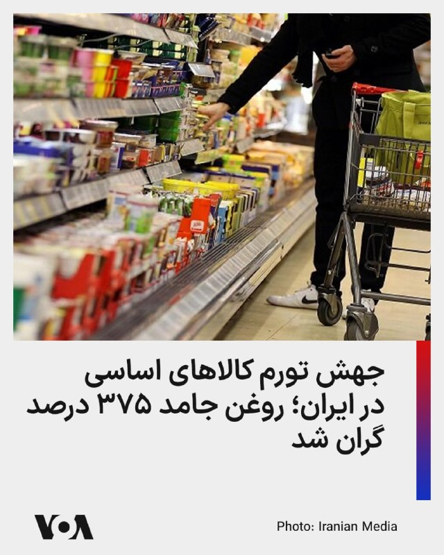

تازه‌ترین داده‌های مرکز آمار ایران نشان می‌دهد قیمت برخی کالاهای اساسی خوراکی در فروردین ۱۴۰۵ نسبت به مدت مشابه سال قبل جهش کم‌سابقه‌ای داشته است.

بنابر این گزارش، روغن جامد با تورم نقطه‌ای ۳۷۵ درصدی، بیشترین افزایش قیمت را در میان اقلام خوراکی ثبت کرده و قیمت آن از حدود ۸۱ هزار تومان در فروردین ۱۴۰۴ به بیش از ۳۸۵ هزار تومان رسیده است. روغن مایع نیز با افزایش ۳۰۸ درصدی، از حدود ۷۴ هزار تومان به بیش از ۳۰۰ هزار تومان رسیده است.

برنج خارجی درجه یک با رشد ۲۰۹ درصدی، مرغ ماشینی با ۱۹۱ درصد، سس مایونز با ۱۹۰ درصد و تخم‌مرغ با ۱۷۰ درصد افزایش قیمت، از دیگر اقلام پرتورم بوده‌اند.

این جهش قیمت‌ها در حالی رخ داده که فعالان کارگری سبد معیشت خانوار کارگری را بیش از ۷۱ میلیون تومان برآورد کرده‌اند، اما حداقل مزد پایه ماهانه کارگران در سال ۱۴۰۵ حدود ۱۶ میلیون و ۶۰۰ هزار تومان است؛ شکافی که نشان می‌دهد حتی درآمد رسمی کارگران فاصله‌ای چندبرابری با هزینه حداقلی زندگی دارد.
@FarsiVOA

## FarsiVOA — post 217253

🔺اموال بیش از ۲۶۰ شهروندان ایرانی با اتهام‌های سیاسی توقیف شد

◾️قوه قضائیه جمهوری اسلامی، دستگاهی که نقش مهمی در سرکوب‌ها در ایران دارد، اعلام کرد تاکنون ۲۶۲ فقره ملک در کشور توقیف شده است.

◾️این املاک متعلق به شهروندان ایرانی است که از سوی حکومت با اتهام‌های سیاسی مواجه شده‌اند.

◾️او کسانی را که حکومت املاک آنان را توقیف کرده، «وطن‌فروش، خائن و مزدور دشمن» توصیف کرد، و گفت که بیشترین فراوانی این املاک توقیف شده، «مربوط به استان‌های تهران، گیلان، البرز، مازندران و اصفهان» است.

◾️سیاست مصادره اموال شهروندان ساکن داخل و خارج از کشور، به منظور ارعاب و ساکت کردن شهروندان اجرا می‌شود.

⬇️ بیشتر بخوانید:
https://ir.voanews.com/a/8148260.html

## FarsiVOA — post 217252

  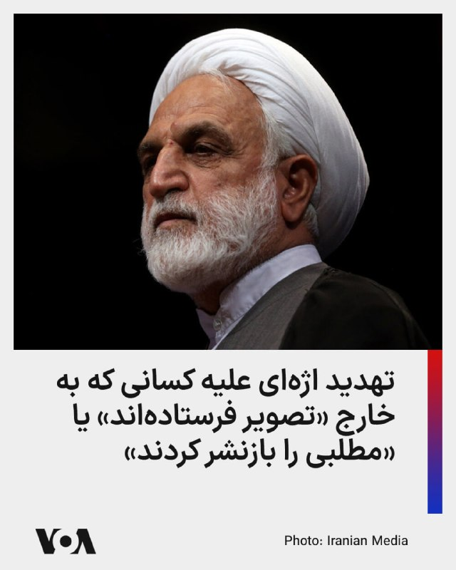

رئیس‌ قوه قضائیه جمهوری اسلامی کسانی را که به گفته او «تصویری» به خارج از کشور فرستاده‌اند یا «مطلبی را بازنشر کرده‌اند» به برخورد شدید قضایی تهدید کرد.

در اظهاراتی که روز شنبه از سوی خبرگزاری میزان وابسته به قوه قضائیه منتشر شده، غلامحسین محسنی اژه‌ای، این افراد را «پیاده‌نظام» دشمن خواند و گفت: «پیاده‌نظام دشمنان تابلودار نظام را تعقیب و محاکمه و مجازات می‌کنیم.» او ادعا کرد: «افعال و اقدامات پیاده نظام دشمن را نباید کوچک بشماریم؛ با دیده اغماض نگوییم فلان فرد، صرفاً فلان مطلبِ کذبِ تولیدشده توسط دشمن را بازنشر کرده است، اینها اقدامات کوچکی نیست.»

جمهوری اسلامی پیش از جنگ اخیر نیز شدیدترین سانسورها را در زمینه آزادی بیان و آزادی اینترنت به اجرا می‌گذاشت، اما از زمان آغاز عملیات آمریکا و اسرائیل علیه حکومت ایران، جمهوری اسلامی سرکوب‌ها را شدت بخشید و اینترنت را به طور سراسری قطع کرد.

اژه‌ای دلیل چنین سرکوبی را «شرایط جنگی» اعلام کرد و گفت: «ما در قوه قضائیه به صورت فوق‌العاده به پرونده این عناصر رسیدگی می‌کنیم.»
@FarsiVOA

## FarsiVOA — post 217251

🔺قطع اینترنت در ایران وارد هفته یازدهم شد؛ هشدار بنیانگذار نت‌بلاکس در مورد ناامنی پیام‌رسان‌های ایرانی

◾️نت‌بلاکس، نهاد مستقل پایش دسترسی به اینترنت، از ورود خاموشی اینترنت در ایران به هفتادویکمین روز و عبور مدت این اختلال از ۱۶۸۰ ساعت خبر داد.

◾️همزمان، آلپ توکر، بنیانگذار این نهاد مستقل پایش اینترنت، نیز در گفت‌وگو با بلومبرگ گفته پیام‌رسان‌های ایرانی رمزگذاری دوسویه ندارند و مقام‌ها می‌توانند به پیام‌ها، موقعیت مکانی و سوابق کاربران دسترسی داشته باشند.

◾️خاموشی بی‌سابقه اینترنت در ایران، در عین حال از یک محدودیت ارتباطی به بحرانی اقتصادی و اجتماعی برای کسب‌وکارهای کوچک تبدیل شده است.

⬇️ بیشتر بخوانید:
https://ir.voanews.com/a/8148259.html

## DW_Farsi — post 124471

  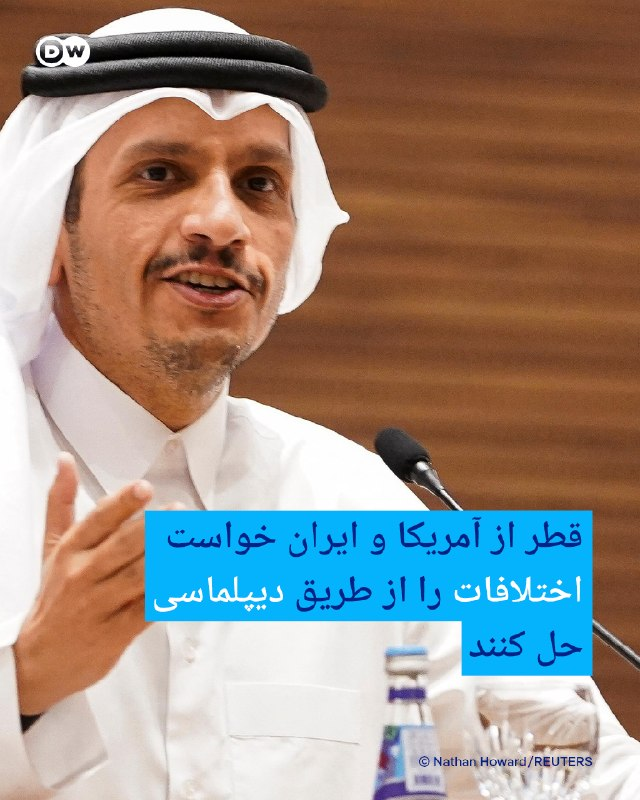

🔶قطر از آمریکا و ایران خواست اختلافات را از طریق دیپلماسی حل کنند

محمد بن عبدالرحمن آل‌ثانی، نخست‌وزیر قطر در دیدار با جی‌دی ونس، معاون رئیس‌جمهور آمریکا در واشنگتن خواستار احیای تلاش‌های دیپلماتیک برای پایان دادن به جنگ ایران شده است.

بر اساس بیانیه وزارت خارجه قطر که روز جمعه ۱۸ اردیبهشت (۸ مه) در شبکه اجتماعی ایکس منتشر شد، آل‌ثانی در این دیدار تاکید کرده است که "همه طرف‌ها باید در تلاش‌های میانجی‌گرانه جاری مشارکت کنند تا راه برای مقابله با ریشه‌های بحران از طریق روش‌های مسالمت‌آمیز و گفت‌وگو هموار شود."

او همچنین گفته است که هدف، دستیابی به "توافقی جامع است که صلح پایدار در منطقه را تضمین کند."

طبق این گزارش، در این گفت‌وگوها همچنین به تلاش‌های میانجی‌گرانه پاکستان در این درگیری اشاره شده است.

@dw_farsi

## DW_Farsi — post 124470

🔶اعتراض هزاران جوان آلمانی علیه خدمت اجباری

روز جمعه هشتم ماه مه (۱۸ اردیبهشت) جوانان در ده‌ها شهر آلمان با شعار "اعتصاب مدرسه علیه خدمت اجباری" در مخالفت با احتمال بازگشت خدمت سربازی اجباری در این کشور و نیز معاینه اجباری مشمولان تظاهرات کردند.

پلیس هامبورگ شمار شرکت‌کنندگان در تظاهرات در این شهر را دو هزار و ۳۰۰ نفر اعلام کرد، در حالی که برگزارکنندگان از حضور شش هزار نفر خبر دادند.

در برلین نیز پلیس از هزار و ۲۰۰ شرکت‌کننده و برگزارکنندگان از پنج هزار نفر خبر دادند. در پایتخت آلمان، راهپیمایی از دروازه براندنبورگ تا مقر حزب دموکرات مسیحی آلمان ادامه داشت. بر روی برخی پلاکاردها نوشته شده بود: "آموزش به جای بمب".

@dw_farsi

## DW_Farsi — post 124469

  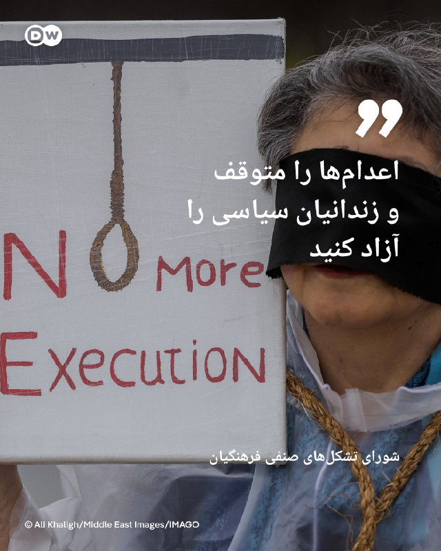

🔶شورای تشکل‌های صنفی فرهنگیان: اعدام‌ها را متوقف و زندانیان سیاسی را آزاد کنید

شورای هماهنگی تشکل‌های صنفی فرهنگیان ایران با گرامی‌داشت یاد فرزاد کمانگر، معلم و فعال مدنی و دیگر جان‌باختگان، تداوم اعدام و سرکوب در جمهوری اسلامی را به‌ویژه در فضای امنیتی پس از جنگ با اسرائيل و آمریکا محکوم کرده و خواستار توقف فوری اعدام‌ها و آزادی زندانیان سیاسی، عقیدتی و صنفی، از جمله معلمان زندانی شده است.

این شورا در کانال تلگرامی خود متن نامه‌ فرزاد کمانگر از زندان را نیز منتشر کرده که در آن با لحنی عاطفی و خطاب به دانش‌آموزانش، از دلتنگی، فقر، آرزوهای کودکان و نابرابری‌های اجتماعی سخن گفته بود و بر اهمیت رویا، زبان مادری و امید به تغییر تأکید کرده است.

فرزاد کمانگر یکی از زندانیان سیاسی بوده است که به همراه شیرین علم‌هولی، فرهاد وکیلی و علی حیدریان، سه زندانی سیاسی کرد در ۱۹ اردیبهشت ۸۹ اعدام شدند.

@dw_farsi

## DW_Farsi — post 124468

  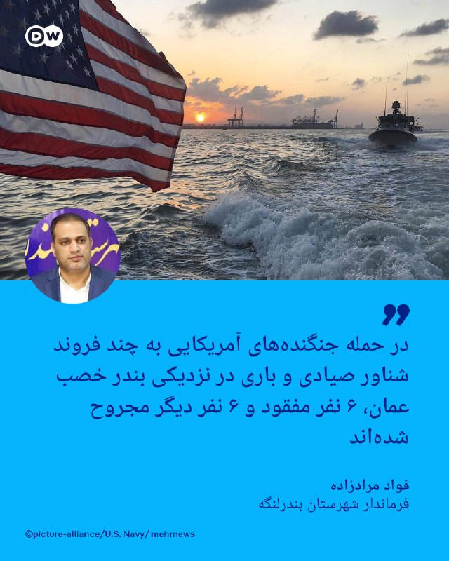

🔶ایران: در حمله آمریکا به شناورهای ایرانی ۶ نفر مجروح شدند

فواد مراد‌زاده، فرماندار شهرستان بندرلنگه صبح روز شنبه ۱۹ اردیبهشت (۹ مه) اعلام کرد، در حمله شب گذشته جنگنده‌های آمریکایی به چند فروند شناور صیادی و باری در نزدیکی بندر خصب عمان، ۶ نفر مفقود و ۶ نفر دیگر مجروح شده‌اند.

به گفته این مقام محلی، شناورها متعلق به صیادان بندر معلم در بخش مرکزی بندرلنگه بوده و در مجموع ۲۰ سرنشین داشته‌اند.

مجروحان این حادثه برای درمان به بیمارستانی در عمان منتقل شده‌اند و حال عمومی آنان مساعد گزارش شده است.

بر اساس این گزارش، سایر سرنشینان این شناورها به سلامت بازگشته‌اند.

@dw_farsi

## DW_Farsi — post 124467

  

📸عکس روز: عکس گروهی با نخستین راهب انسان‌نما

راهبان بودایی کره جنوبی در سئول با "گابی" در مراسمی مذهبی در معبد جوگیه (Jogye) عکسی گروهی می‌اندازند. این نخستین بار است که یک ربات در نقش راهبی بودایی ظاهر می‌شود. رسانه‌ها هدف این پروژه را همزیستی سنت و فناوری و جذب هرچه بیش‌تر نسل جوان نامیده‌اند. گابی که تسبیح ۱۰۸ دانه‌ای مالا بر گردنش بود سوگند خود که به تعهدات اخلاقی آیین بودیسم پایبند باشد.

@dw_farsi

## Persian_Trend_Official — post 13739

  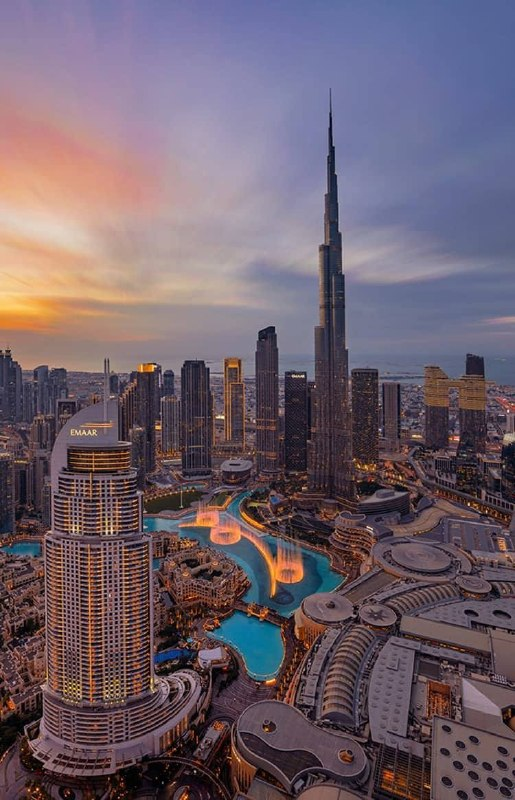

🔻 امارات ‌دست به اخراج گروهی از شیعیان پاکستانی مقیم امارات زده که برای جمهوری اسلامی تبلیغ می‌کردند.

🔻 امارات چند سال پیش یک وام ۳.۵ میلیارد دلاری هم به پاکستان داده بود، که چون پاکستان آه در بساط نداشت، هی تمدید می‌کرد، که بعد از خودشیرینی‌های پاکستان برای جوش دادن معامله بین جمهوری اسلامی و ترامپ، امارات بهش گفت سریعا این بدهی‌ات رو پرداخت کن!
که یک شوک عظیم روی اقتصاد پاکستان ایجاد کرد.

📝 Nick

📌 @persian_trend_official
پرشین ترند | متفاوت‌ترین کانال نظامی

## Persian_Trend_Official — post 13738

  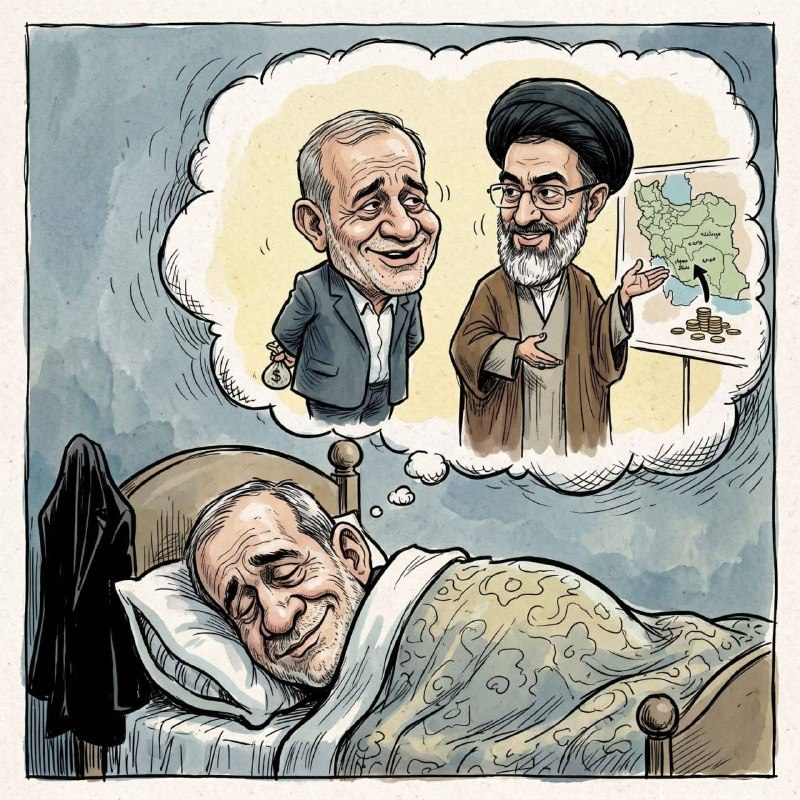

💢عکس منتشر شده در کانال فارسی زبان اسرائیل...

🫆:Tony

📌 @persian_trend_official
پرشین ترند | متفاوت‌ترین کانال نظامی

## Persian_Trend_Official — post 13737

🔴 گزارش‌ها از بازداشت چند روحانی شیعه در بحرین 💢منابع محلی و فعالان بحرینی گزارش می‌دهند چند روحانی شیعه از جمله «جمیل العالی»، «محمود العالی»، «رضی القفاص» و «جاسم المؤمن» توسط نیروهای امنیتی بحرین بازداشت شده‌اند. 💢بر اساس این گزارش‌ها، این افراد به مکانی…

## Persian_Trend_Official — post 13736

  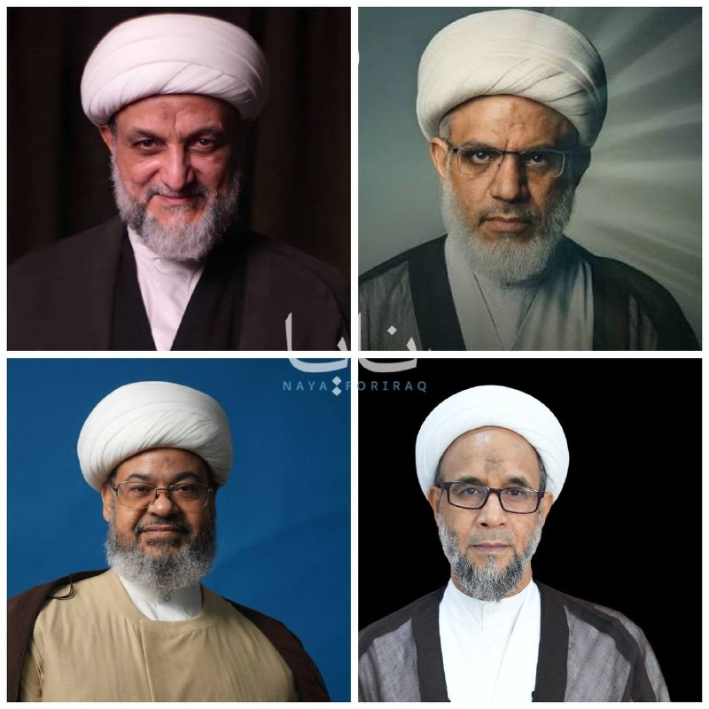

🔴 گزارش‌ها از بازداشت چند روحانی شیعه در بحرین

💢منابع محلی و فعالان بحرینی گزارش می‌دهند چند روحانی شیعه از جمله «جمیل العالی»، «محمود العالی»، «رضی القفاص» و «جاسم المؤمن» توسط نیروهای امنیتی بحرین بازداشت شده‌اند.

💢بر اساس این گزارش‌ها، این افراد به مکانی نامعلوم منتقل شده‌اند و تاکنون اطلاعاتی درباره وضعیت یا محل نگهداری آنان منتشر نشده است.

💢برخی منابع مخالف دولت بحرین مدعی‌اند این بازداشت‌ها با انگیزه‌های فرقه‌ای و امنیتی انجام شده، اما مقام‌های رسمی بحرین هنوز جزئیات یا اتهامات احتمالی را اعلام نکرده‌اند.

🫆:Tony

📌 @persian_trend_official
پرشین ترند | متفاوت‌ترین کانال نظامی

## RadioFarda — post 156998

🔸تصاویری که خبرگزاری رویترز منتشر کرده است برخاستن ستون دود در جنوب لبنان را نشان می‌دهد.

🔸همزمان روز شنبه ۱۹ اردیبهشت خبرگزاری ملی لبنان از حملاتی به این کشور خبر داد.

🔸بنیامین نتانیاهو، نخست‌وزیر اسرائیل روز پنجشنبه گفت که هیچ «مصونیتی» برای دشمنان اسرائیل وجود ندارد.

🔸ارتش اسرائیل روز چهارشنبه در اولین حمله خود به حومه جنوبی بیروت از زمان اعلام آتش بس در ماه گذشته، یک فرمانده حزب‌الله را هدف قرار داد.

🔸حمله روز چهارشنبه فشار بر آتش‌بس لبنان را که به موازات آتش‌بس در جنگ خاورمیانه پدید آمده است، افزایش می‌دهد. توقف حملات اسرائیل به لبنان یکی از خواسته‌های اصلی ایران در مذاکرات تهران با واشنگتن بود.

🔸آتش بس لبنان که توسط دونالد ترامپ، رئیس‌جمهور ایالات متحده ماه گذشته اعلام شد، منجر به کاهش خصومت‌ها شد و بیروت هفته‌ها قبل از حمله روز چهارشنبه مورد حمله اسرائیل قرار نگرفته بود.

@RadioFarda

## RadioFarda — post 156997

  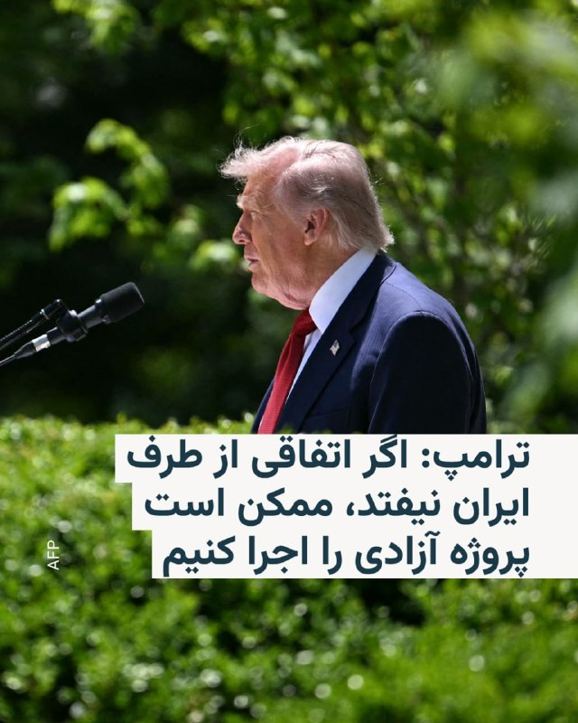

🔸دونالد ترامپ، رئیس جمهور آمریکا، روز جمعه خبر داد که احتمالا تا شب پاسخ ایران به پیشنهادات خود را خواهد گرفت.

🔸پیشتر وزیر خارجه آمریکا هم خبر داده بود که واشینگتن انتظار دارد روز جمعه پاسخ ایران به پیشنهاد واشینگتن برای پایان دادن به جنگ را دریافت کند.

🔸مارکو روبیو در این زمینه توضیح داد: «خواهیم دید که این پاسخ شامل چه چیزهایی است. امید ما این است که چیزی باشد که بتواند ما را وارد یک روند جدی مذاکره کند.»

🔸با این حال تا ظهر شنبه هنوز خبری از پاسخ ایران به پیشنهاد آمریکا برای رسیدن به توافق و پایان دادن به جنگ منتشر نشده است.

🔸ترامپ روز جمعه گفته بود: «ظاهرا قرار است امشب نامه‌ای دریافت کنم، خواهیم دید چه خواهد شد.»

🔸رئیس جمهور آمریکا که در محوطه کاخ سفید با خبرنگاران حرف می‌زد همچنین تهدید کرد که اگر از طرف ایران اتفاق مثبتی نیفتد، احتمال دارد آمریکا بار دیگر «پروژه آزادی» را اجرا کند.

🔸هفته گذشته دولت آمریکا از طرحی به عنوان «پروژه آزادی» رونمایی کرد، شامل اسکورت و هدایت کشتی‌ها برای خروج از تنگه هرمز.

@RadioFarda

## IranianMinds — post 19826

  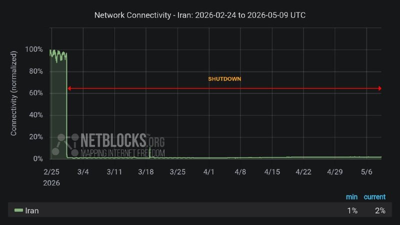

🔴نت‌بلاکس:

قطعی اینترنت در ایران، وارد یازدهمین هفته شد.

@IranianMinds

## BBCPersian — post 280570

  <a href="telegram/content/BBCPersian_280570_1778321297.mp4">🎬 Download video</a>

🔻در پی فوران آتشفشان کوه دوکونو در اندونزی سه کوهنورد جان باختند.

امدادگران باقی بازماندگان یک گروه ۲۰ نفره‌ از کوهنوردان را که در پی شروع فوران مفقود شده بودند، پیدا کرده و نجات دادند.

مقامات اندونزی می‌گویند، با وجود ممنوعیت صعود، اعضای این گروه در حال بالا رفتن از کوه به سمت آتشفشان بودند.

طبق اعلام سازمان آتشفشان‌شناسی اندونزی، فوران آتشفشان دوکونو، ستونی از خاکستر را به ارتفاع ده کیلومتر به آسمان فرستاده است.
@BBCPersian

## BBCPersian — post 280569

  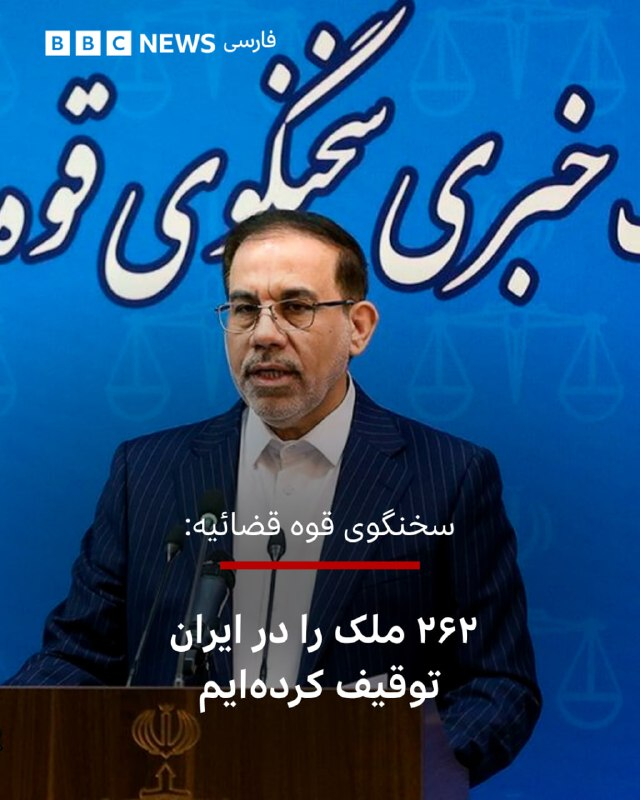

🔻اصغر جهانگیر، سخنگوی قوه قضائیه ایران تعداد املاک توقیف شده پس از آغاز جنگ را ۲۶۲ مورد اعلام کرده است.

او گفته است: «طبق اعلام سازمان ثبت اسناد تا کنون ۷۲۲ استعلام از سازمان ثبت اسناد صورت‌ گرفته که ۲۶۲ فقره ملک در کشور توقیف شد.»

او همچنین گفته است: «این موارد علاوه بر حساب‌هایی است که از مزدوران و متهمین شناسایی و توقیف شده است. این موارد بعد از نهایی‌شدن در دادگاه به نفع ملت ایران مصادره خواهد شد.»

قوه قضائیه پیشتر اتهام این افراد را «همراهی با دشمن» اعلام کرده بود.

جزئیات روند دادرسی منجر به توقیف اموال این افراد هنوز مشخص نیست.

با شدت گرفتن ضبط اموال افرادی که در میان آنها طیف وسیعی از اقشار جامعه از خبرنگار تا بازیگران سابق و فعالان سیاسی و هنرمندان، دیده می‌شود، قوه قضائیه جمهوری اسلامی اقداماتی را هم برای جلوگیری از انتقال اموال آغاز کرده است.

فعالان حامی جمهوری اسلامی در جریان جنگ اخیر اسرائیل و آمریکا با ایران، در فضای مجازی فراخوان‌هایی برای معرفی مخالفان جمهوری اسلامی که آنها را «حامی جنگ» خواندند، داده بودند.

@BBCPersian
📷 Defapress

## Hranews — post 112841

قوه قضاییه از توقیف ۲۶۲ ملک در پرونده‌های امنیتی خبر داد
 

❗️
❗️
❗️
❗️
❗️ – سخنگوی قوه قضاییه از توقیف ۲۶۲ ملک در نقاط مختلف ایران خبر داد و اعلام کرد این املاک متعلق به افرادی است که نهادهای قضایی و امنیتی آنها را تحت عنوان «وطن‌فروش» و «همکار دشمن» معرفی کرده‌اند.
 
ادامه مطلب
 
#توقیف_اموال

↘️
@hranews_bot تماس ✉️ -  @Hranews  کانال هرانا 🆑

## Hranews — post 112840

  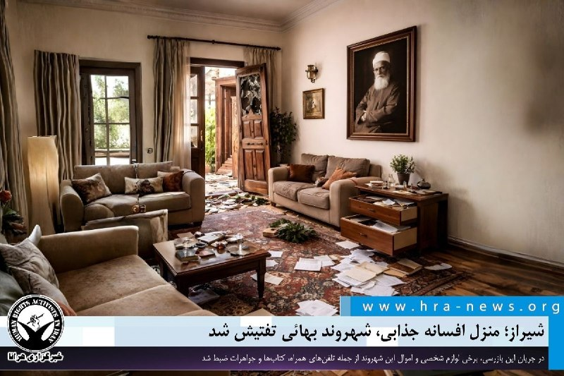

شیراز؛ منزل افسانه جذابی، شهروند بهائی تفتیش شد
 

❗️
❗️
❗️
❗️
❗️ – صبح روز سه‌شنبه ۱۵ اردیبهشت‌ماه، منزل افسانه جذابی (راسخی)، شهروند ۶۶ ساله #بهائی ساکن شیراز، توسط نیروهای امنیتی تفتیش شد. در جریان این بازرسی، ماموران شماری از لوازم شخصی و کتب دینی این شهروند را ضبط کردند.
 
به گزارش خبرگزاری هرانا، ارگان خبری مجموعه فعالان حقوق بشر در ایران، منزل افسانه جذابی، شهروند بهائی در شیراز مورد تفتیش قرار گرفت.
 
بر اساس اطلاعات دریافتی هرانا، صبح روز سه‌شنبه ۱۵ اردیبهشت ۱۴۰۵، مأموران امنیتی با ارائه حکم قضایی وارد منزل خانم جذابی شده و اقدام به تفتیش محل سکونت وی کردند. در جریان این بازرسی، وسایل متعددی از جمله کتاب‌ها، قاب‌ها، گوشی موبایل و یک پلاک و زنجیر طلا توسط مأموران ضبط شده است.
 
ادامه مطلب
 
#افسانه_جذابی #افسانه_راسخی #تفتیش_منزل

↘️
@hranews_bot تماس ✉️ -  @Hranews  کانال هرانا 🆑

## configx2ray — post 38680

  <a href="telegram/content/configx2ray_38680_1778321299.jpg">🎬 Download video</a>

socks://Og@62.220.126.56:30170#https://t.me/ConfigX2ray

ترکیبی با سایفون وصله 
✅

آموزش استفادع : 
👇
https://t.me/ConfigX2ray0/1665

Channel : https://t.me/ConfigX2ray

## configx2ray — post 38679

https://t.me/proxy?server=94.101.191.94&port=4580&secret=6d087d0e01b54d2a50a78047a4a21d80

https://t.me/proxy?server=213.233.184.133&port=6777&secret=dd3b54584a0135f19594825070bb1450d0

https://t.me/proxy?server=213.233.184.133&port=6777&secret=dd3b54584a0135f19594825070bb1450d0

یک دقیقه زمان بدید وصل میشه❤️

بدونه vpn باید وصل بشید 
⚡️
Channel : https://t.me/ConfigX2ray

## manototv — post 105180

  <a href="telegram/content/manototv_105180_1778321300.mp4">🎬 Download video</a>

وزارت کشور بحرین اعلام کرد پنج نفر را به اتهام همکاری با سپاه پاسداران بازداشت کرده و هویت نفر ششمی را که خارج از کشور است، شناسایی کرده است.
در بیانیه وزارت کشور بحرین آمده این افراد اطلاعات حساس و دقیق را از طریق «عناصر تروریستی» در ایران در اختیار سپاه پاسداران قرار می‌دادند. به گفته مقام‌های بحرینی، متهمان از مراکز حیاتی، اماکن مهم و چند هتل در این کشور عکس و مختصات جغرافیایی تهیه کرده و برای سپاه پاسداران ارسال کرده‌اند.
بحرین می‌گوید این اطلاعات در حملات ایران علیه این کشور مورد استفاده قرار گرفته است. وزارت کشور بحرین جزئیات بیشتری درباره هویت بازداشت‌شدگان منتشر نکرده است.
هفته گذشته نیز مقام‌های بحرینی چهار نفر دیگر را به اتهام جاسوسی برای سپاه پاسداران بازداشت کرده بودند.

## alonews — post 118849

  

👈نت‌بلاکس: قطعی اینترنت در ایران، وارد یازدهمین هفته شد.

✅ @AloNews خبر جنگ

## alonews — post 118848

  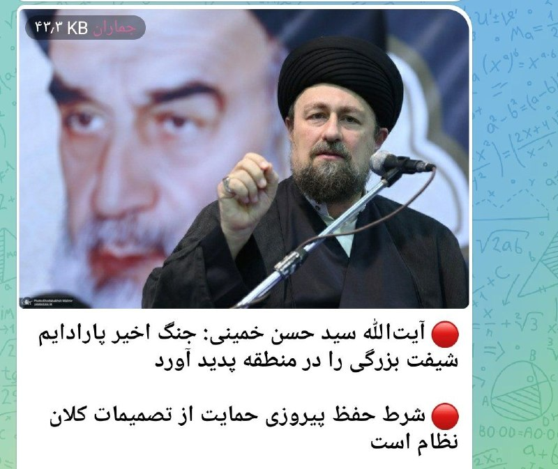

👈سایت جماران در اقدامی قابل تامل از لقب آیت الله برای سید حسن خمینی استفاده کرد

#دیسبک

✅ @AloNews خبر جنگ

## alonews — post 118847

  <a href="telegram/content/alonews_118847_1778321301.jpg">🎬 Download video</a>

👈منابع العربیه: تل‌آویو گزینه‌های احتمالی تشدید تنش از جمله هدف قرار دادن تأسیسات انرژی را با واشنگتن بررسی کرد

🔴نتانیاهو به واشنگتن اطلاع داد که هر توافقی که برنامه هسته‌ای را متوقف نکند کافی نخواهد بود

✅ @AloNews خبر جنگ

## alonews — post 118846

  <a href="telegram/content/alonews_118846_1778321302.mp4">🎬 Download video</a>

👈پوتین در رژه پیروزی: مهم نیست تکنیک‌ها و روش‌های جنگ چگونه تغییر کنند، یک چیز قطعی است: سرنوشت کشور توسط مردم تعیین می‌شود.

✅ @AloNews خبر جنگ

## alonews — post 118845

  <a href="telegram/content/alonews_118845_1778321303.jpg">🎬 Download video</a>

👈آسوشیتد پرس: گزینهٔ حمله نظامی قریب الوقوع آمریکا به کوبا در دستور کار کاخ سفید نیست

✅ @AloNews خبر جنگ

## alonews — post 118844

  <a href="telegram/content/alonews_118844_1778321303.jpg">🎬 Download video</a>

👈نیویورک پست، به نقل از منابع: واشنگتن پیشنهاد داد در ازای توقف غنی‌سازی اورانیوم توسط ایران و بازگشایی تنگه هرمز برای کشتیرانی، تحریم‌ها را کاهش دهد

✅ @AloNews خبر جنگ

## alonews — post 118843

  <a href="telegram/content/alonews_118843_1778321304.jpg">🎬 Download video</a>

👈پولیتیکو: ارتش چین عملیات آمریکا علیه ایران را با دقتی فوق‌العاده مطالعه می‌کند تا نقاط ضعفی را که می‌توان در یک درگیری با ایالات متحده از آنها بهره‌برداری کرد، را شناسایی کند.

🔴چین از نزدیک زیر نظر دارد که فرماندهان نظامی آمریکایی چگونه عملیات را برنامه‌ریزی می‌کنند، طرح‌های خود را اجرا می‌نمایند، و این شامل سرعت حملات موشکی و جمع‌آوری اطلاعات شناسایی نیز هست.

🔴پنتاگون همچنان عملکرد تاکتیکی قدرتمندی نشان می‌دهد، اما در نبود یک سیاست و استراتژی روشن، آمریکا در سطح عملیاتی جنگ دچار مشکل است

🔴چینی‌ها می‌دانند که هر موشکی که در ایران استفاده شود، موشکی است که نمیتوان از آن برای بازداشتن دشمن در منطقه اقیانوس هند و آرام استفاده کرد.

🔴منحرف کردن مسیر کشتی‌ها، سامانه‌های دفاع هوایی و نیروها از اقیانوس آرام به خاورمیانه، نشانهای است از اینکه زرادخانه آمریکا نامحدود نیست.

✅ @AloNews خبر جنگ

## alonews — post 118842

  <a href="telegram/content/alonews_118842_1778321304.jpg">🎬 Download video</a>

👈نیویورک تایمز به نقل از مقامات آمریکایی: روسیه از طریق دریای خزر قطعات پهپاد را به ایران صادر می‌کند و به این کشور در بازسازی قابلیت‌هایش کمک می‌کند.

🔴روزنامه نیویورک تایمز با استناد به داده‌های تجاری روسیه، از افزایش قابل توجه ترافیک کشتیرانی به ایران از طریق دریای خزر در ماه‌های اخیر خبر می‌دهد

🔴این روزنامه گزارش می دهد که روسیه کالاهایی را که معمولاً از تنگه هرمز عبور می‌کنند، به ایران عرضه می‌کند.

✅ @AloNews خبر جنگ

## alonews — post 118838

  <a href="telegram/content/alonews_118838_1778321304.jpg">🎬 Download video</a>

👈جنگنده‌های اسرائیل چندین شهر در جنوب لبنان را بمباران کردند.

✅ @AloNews خبر جنگ

## alonews — post 118837

  <a href="telegram/content/alonews_118837_1778321304.mp4">🎬 Download video</a>

👈نیروهای امنیتی بحرین صبح امروز با یورش به خانه دهها عالم شیعه، بسیاری از آن‌ها را بازداشت کردند

✅ @AloNews خبر جنگ

## alonews — post 118836

  <a href="telegram/content/alonews_118836_1778321305.mp4">🎬 Download video</a>

👈 سربازهای کره شمالی تو میدان سرخ برای رژه پیروزی

✅ @AloNews خبر جنگ

## alonews — post 118835

  <a href="telegram/content/alonews_118835_1778321307.jpg">🎬 Download video</a>

👈رئیس دانشگاه آزاد: امتحانات دانشگاه آزاد در شرایط فعلی به‌صورت مجازی برگزار می‌شود/تعیین وضعیت حضوری یا مجازی بودن امتحانات بر عهده شورای امنیت کشور است

✅ @AloNews خبر جنگ

## alonews — post 118834

  <a href="telegram/content/alonews_118834_1778321307.jpg">🎬 Download video</a>

👈ان‌بی‌سی به نقل از مقامات آمریکایی: سعودی‌ها می‌ترسیدند «پروژه آزادی» ترامپ، ایران را به حمله تحریک کند

🔴 عملیات آزادی تنگه هرمز به زودی از سر گرفته نخواهد شد، زیرا نگرانی‌های متحدان خلیج فارس همچنان پابرجا است

🔴 کویت [در مورد عملیات آمریکا در تنگه] گفت تا زمانی که ترامپ این رویه را تغییر ندهد، استفاده نظامی آمریکا از پایگاه‌ها و حریم هوایی خود را نمی‌دهد.

✅ @AloNews خبر جنگ

## alonews — post 118833

  <a href="telegram/content/alonews_118833_1778321307.jpg">🎬 Download video</a>

👈خبرگزاری ایرنا : به خاطر قطع اینترنت بین الملل و تعدیل نیرو و بیکاری تعداد دست فروش ها روزبه روز داره بیشتر میشه...

✅ @AloNews خبر جنگ

## alonews — post 118832

  <a href="telegram/content/alonews_118832_1778321307.jpg">🎬 Download video</a>

👈خبرنگار المیادین: ایران ورود یک ناوشکن آمریکایی به سواحل امارات را رصد کرده و تحرکات آن را زیر نظر دارد

✅ @AloNews خبر جنگ

## alonews — post 118831

  <a href="telegram/content/alonews_118831_1778321307.jpg">🎬 Download video</a>

👈سازمان رسانه و ارتباطات عراق : تلگرام رفع فیلتر کردیم

✅ @AloNews خبر جنگ

## alonews — post 118830

  <a href="telegram/content/alonews_118830_1778321307.jpg">🎬 Download video</a>

👈معاون وزیر ارتباطات: کسب و کارهای بزرگ حوزه دیجیتال حدود ۵۵ همت خسارت مستقیم دید

✅ @AloNews خبر جنگ

<!-- MSG END -->
<!-- NAV START -->
[صفحه قبل](telegram/content/archive_1.md)
<!-- NAV END -->
