# خواننده تلگرام

<!-- MSG START -->

---
📅 بروزرسانی: 1405/02/20 12:36
---

## VahidOOnLine — post 239243

  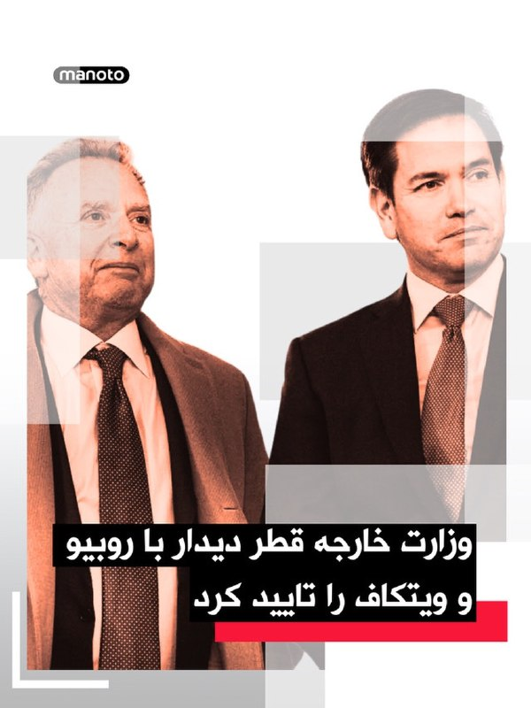

وزارت خارجه قطر اعلام کرد شیخ محمد بن عبدالرحمن بن جاسم آل ثانی، نخست‌وزیر و وزیر خارجه این کشور، در میامی با مارکو روبیو، وزیر خارجه آمریکا، و استیو ویتکاف، فرستاده آمریکا در امور خاورمیانه، دیدار کرده است.

به گزارش خبرگزاری رسمی قطر، در این دیدار روابط راهبردی دو کشور، به‌ویژه در حوزه‌های دفاع و انرژی، تحولات منطقه و تلاش‌های میانجی‌گرانه برای کاهش تنش‌ها بررسی شد.

وب‌سایت اکسیوس نیز گزارش داد این دیدار بخشی از تلاش‌ها برای دستیابی به توافقی برای پایان دادن به جنگ در ایران بوده است.
‌🏁 🇬🇧 ManotoTV

🤖 @VahidOOnLine

## VahidOOnLine — post 239242

  

رحیم نادعلی، معاون فرهنگی سپاه «محمد رسول‌الله» تهران گفت: «در جشن بزرگ پیوند آسمانی زوج‌های جان‌فدا، خودروهای جیپ جنگی برای جابه‌جایی عروس و دامادها در نظر گرفته شده که با گل‌آرایی، پرچم جمهوری اسلامی و تصاویر رهبری تزئین شده و زوج‌ها در این خودروها در مراسم حضور خواهند یافت.»

او افزود زوج‌های شرکت‌کننده قرار است با «ماشین‌های عروسی به شکل جیپ نظامی» و «خودروهای نظامی گل‌کاری‌شده» در سطح شهر حضور پیدا کنند تا «فضای شهر را به یک شکل هنری و نظامی» درآورند.

به گفته او، هدف این است که نشان داده شود این «زوج‌های جانفدا» جان خود را «زیر پرچم جمهوری اسلامی تقدیم این نظام خواهند کرد» و «از هیچ چیز نمی‌ترسند.»

او همچنین این مراسم را با ازدواج‌ها در «بحبوحه جنگ» در دهه ۶۰ مقایسه کردند و گفت همان‌طور که در آن دوران «سنت الهی» ازدواج ادامه داشت، اکنون نیز در شرایط جنگ و تهدید، این سنت‌ها ادامه خواهد یافت و «یک قاب تصویر جدید» به دنیا نشان داده می‌شود.
‌🏁 🇬🇧 IranintlTV

🤖 @VahidOOnLine

## VahidOOnLine — post 239241

  

نت‌بلاکس اعلام کرد قطعی گسترده اینترنت در ایران پس از ۱۷۰۴ ساعت همچنان ادامه دارد و این محدودیت بی‌سابقه اکنون وارد سومین ماه خود شده است؛ در حالی که مقام‌های جمهوری اسلامی همچنان دسترسی عمومی به اینترنت بین‌المللی را برای مردم داخل ایران محدود نگه داشته‌اند.
‌🏁 🇬🇧 ManotoTV

🤖 @VahidOOnLine

## VahidOOnLine — post 239240

  <a href="telegram/content/VahidOOnLine_239240_1778403965.mp4">🎬 Download video</a>

ویدیوهایی که از ملبورن به ایران‌اینترنشنال رسیده، نشان می‌دهد ایرانیان مقیم این شهر در استرالیا، یکشنبه ۲۰ اردیبهشت با حضور گسترده خود در تجمع اعتراضی علیه جمهوری اسلامی، فریاد «جاوید شاه» سردادند.
‌🏁 🇬🇧 IranintlTV

🤖 @VahidOOnLine

## VahidOOnLine — post 239239

  

♦️خبرگزاری فارس، وابسته به سپاه پاسداران درباره کشتی باری هدف ‌قرارگرفته شده در نزدیکی سواحل قطر، به نقل از منبعی که نامش را فاش نکرد، گزارش داد این کشتی با پرچم آمریکا تردد می‌کرده و متعلق به ایالات متحده بوده است.
سازمان «عملیات تجارت دریایی بریتانیا» (UKMTO) صبح یکشنبه گزارش داد که یک پرتابه به سمت یک کشتی باری  در ۲۳ مایل دریایی (۳۷ کیلومتری) شمال شرقی دوحه شلیک شده است.
بنا بر این گزارش یک آتش‌سوزی کوچک در این کشتی رخ داده که خاموش شده است و تلفات جانی نیز نداشته است.
این خبر در حالی اعلام شده است که مارکو روبیو، وزیر امور خارجه آمریکا روز شنبه با محمد بن عبدالرحمن آل ثانی، نخست‌وزیر و وزیر امور خارجه قطر، در میامی دیدار و گفتگو کرد و شراکت دو کشور را برای بازدارندگی در برابر تهدیدات و تقویت ثبات در خاورمیانه حائز اهمیت خواند.
پیشتر دونالد ترامپ رئیس جمهوری ایالات متحده نسبت به شلیک به کشتی‌های آمریکایی به جمهوری اسلامی هشدا داده بود.
‌🇸🇦 Indypersian

🤖 @VahidOOnLine

## VahidOOnLine — post 239238

  <a href="telegram/content/VahidOOnLine_239238_1778403967.mp4">🎬 Download video</a>

بر اساس ویدیوهای رسیده به ایران‌اینترنشنال، ایرانیان مقیم ژاپن یکشنبه ۲۰ اردیبهشت در پی فراخوان شاهزاده رضا پهلوی، علیه اعدام‌های جمهوری اسلامی و قطع اینترنت در ایران، در شهر توکیو تجمع کردند.
‌🏁 🇬🇧 IranintlTV

🤖 @VahidOOnLine

## VahidOOnLine — post 239237

  

فاطمه پوررضاقلی، دبیر انجمن پیوند کلیه ایران گفت: «در حوزه آنتی‌بیوتیک‌ها با مشکلاتی مواجه هستیم و برخی از این داروها بسیار نایاب شده‌اند.»

او افزود: «در حال حاضر نیز کمبود برخی داروهای عمومی و در دسترس، به‌تدریج محسوس شده است.»

پوررضاقلی ادامه داد: «بخشی از ذخایر دارویی و بیمارستانی طی ماه‌های گذشته مصرف شده و اگر گشایشی در روند تامین دارو ایجاد نشود، احتمال بروز مشکلات جدی در آینده وجود دارد.»
‌🏁 🇬🇧 IranintlTV

🤖 @VahidOOnLine

## VahidOOnLine — post 239236

  <a href="telegram/content/VahidOOnLine_239236_1778403970.mp4">🎬 Download video</a>

ویدیوهای رسیده به ایران‌اینترنشنال نشان می‌دهد ایرانیان مقیم نیوزیلند یکشنبه ۲۰ اردیبهشت در پاسخ به فراخوان شاهزاده رضا پهلوی و علیه اعدام‌های جمهوری اسلامی، با هم‌خوانی سرود «ای ایران» در شهر دنیدن تجمع کردند.
‌🏁 🇬🇧 IranintlTV

🤖 @VahidOOnLine

## VahidOOnLine — post 239235

🗣روایت شما از بیکاری و گرانی زیرسایه آتش‌بس- یکشنبه ۲۰ اردیبهشت ۱۴۰۵

 

🔹گرانی بیداد می‌کنه اما حکومت هیچ برنامه‌ای نداره و فقط سکوت کرده. بدون جنگ هم تا دو ماه دیگه این اقتصاد سقوط می‌کنه، شک نکنید.

 

🔹همه‌ی کالاها از لبنیات و روغن گرفته تا برنج، پلاستیک و دستمال، تقریباً هر فاکتور جدیدی که بیاد، قیمت‌ها افزایش پیدا کرده.

 

🔹من از تهران صحبت می‌کنم، از زمان اعتراضات دی‌ماه که دولت دلار رو برای کالاهای اساسی آزاد کرد، تورم و فشار اقتصادی تشدید شده و در همه مناطق کشور هم همین وضعیت هست.

 

🔹حتی اگه همین فردا هم اینترنت رو وصل کنید، هیچ‌وقت این ظلم و جنایتی که اعضای «شعام» (که حتی می‌ترسن اسم کامل‌شون رو اعلام کنن) در حق معیشت و روان ما کردن رو فراموش نمی‌کنیم.

 

🔹وضعیت اینترنت داغونه. بعد دو ماه با بدبختی تونستم وصل بشم. وضعیت شغل‌ها خرابه و همه بیکار شدن. درست حقوق نمی‌دن و همه‌چیز خیلی زیاد گرونه. به امید آزادی ایران.

 

🔹از اصفهان پیام می‌دم؛ هیچ کاری نمی‌شه کرد. این مدت هر کاری برای امرار معاش کردم، اما زورم به هیچی نمی‌رسه، حتی جمع کردن خودم. خدا لعنت کنه جمهوری اسلامی رو.

 

🔹اوضاع اصلاً جالب نیست. وام‌های طرح مهربانی بانک ملی اصلاً نمی‌ذاره نفس بکشیم. باقی بانک‌ها یه‌کم بهتر هستن، درواقع یعنی انتخاب بین بد و بدتر. با این رکود و وضعیت اقتصادی، قسط وام‌ها کمرشکن شده واقعاً.

 

🔹کارگاه تولیدی داشتیم و از پس اقساط برمی‌اومدیم، ماهانه ۳۰ میلیون قسط می‌دیم. متأسفانه بعد از جنگ و با قیمت افتضاح ورق فولادی، ورشکسته شدیم و اگر وام یک ماه رو پرداخت نکنید، سریع و بدون هشدار از حساب ضامن کم می‌کنه.
‌🏁 🇬🇧 IranintlTV

🤖 @VahidOOnLine

## VahidOOnLine — post 239234

  <a href="telegram/content/VahidOOnLine_239234_1778403971.mp4">🎬 Download video</a>

ویدیوهای رسیده به ایران‌اینترنشنال نشان می‌دهند ایرانیان مقیم استرالیا یکشنبه ۲۰ اردیبهشت با فراخوان شاهزاده رضا پهلوی در شهر ملبورن راهپیمایی کردند.
‌🏁 🇬🇧 IranintlTV

🤖 @VahidOOnLine

## VahidOOnLine — post 239233

  

قتل «مریم آقابابایی» دختر ۳۰ ساله اهل شهرکرد که پس از سوار شدن به یک تاکسی اینترنتی ناپدید شده بود، واکنش‌های گسترده‌ای در پی داشته است.

بر اساس گزارش رسانه‌های ایران، جسد سوخته مریم چند روز بعد توسط یک چوپان در اطراف شهرکرد پیدا شد. پلیس اعلام کرده متهم اصلی پرونده بازداشت شده و در بازجویی‌های اولیه به قتل اعتراف کرده است.

خانواده مریم می‌گویند انگیزه قتل هنوز به‌طور دقیق مشخص نیست. برخی گزارش‌های محلی از احتمال تعرض خبر داده‌اند، اما متهم تاکنون انگیزه را «سرقت طلا» عنوان کرده است.

همزمان، تجمع‌هایی در شهرکرد برای مطالبه عدالت و امنیت زنان برگزار شده است. پرونده همچنان در مرحله تحقیقات قرار دارد.
‌🏁 🇬🇧 ManotoTV

🤖 @VahidOOnLine

## VahidOOnLine — post 239232

  

رسانه‌های حکومتی در ایران از احتمال شنیده شدن صدای «انفجارهای کنترل‌شده» در اصفهان خبر دادند

بر اساس اطلاعیه منتشرشده در رسانه‌های نزدیک به حکومت، از جمله خبرگزاری فارس و رسانه‌های وابسته به سپاه، احتمال شنیده شدن صدای انفجار از ساعت ۹ تا ۱۵ امروز در برخی مناطق اصفهان وجود دارد.

در این اطلاعیه آمده که انفجارها در مناطق اقارب‌پرست، حکیم نظامی و بلوار کشاورز انجام می‌شود و «جای هیچ‌گونه نگرانی برای شهروندان نیست.»

در روزهای اخیر نیز رسانه‌های حکومتی چندین بار خبرهایی مشابه درباره «انفجارهای کنترل‌شده» در اصفهان و شهرهای دیگر منتشر کرده‌اند. روابط عمومی سپاه حضرت صاحب‌الزمان استان اصفهان در اطلاعیه‌های قبلی، مسئولیت انتشار این هشدارها را برعهده گرفته بود.
‌🏁 🇬🇧 ManotoTV

🤖 @VahidOOnLine

## VahidOOnLine — post 239231

  

نت‌بلاکس، نهاد ناظر بر اختلال‌های اینترنتی، صبح یکشنبه اعلام کرد قطعی اینترنت در ایران پس از بیش از ۱۷۰۰ ساعت، وارد هفتادودومین روز خود شده است.

بر اساس این گزارش، هیچ نشانه‌ای از برقراری اینترنت وجود ندارد و مقام‌های حکومت دسترسی عمومی به اینترنت بین‌المللی را محدود کرده‌اند.
‌🏁 🇬🇧 IranintlTV

🤖 @VahidOOnLine

## VahidOOnLine — post 239230

  

حمیدرضا حاجی‌بابایی، نایب‌رییس مجلس گفت: «پس از ناامیدی از اغتشاشات داخلی، آمریکا با همراهی ۵۴ کشور یک جنگ تمام‌عیار نظامی علیه ما آغاز کرد اما سیاست ما نه سازش و نه تسلیم؛ نبرد با آمریکاست.»

او ادامه داد: «آمریکا قصد داشت با جلوگیری از جابه‌جایی نفت، ما را تحت فشار قرار دهد، اما ما با باز کردن مرز‌های ۱۶ استان کشور این توطئه را خنثی کردیم.»

او افزود: «دنیا می‌داند اگر تنگه هرمز بسته بماند، در کمتر از یک ماه بحران عظیم نفتی و افزایش شدید قیمت‌ها گریبان اروپا و آمریکا را خواهد گرفت.»
‌🏁 🇬🇧 IranintlTV

🤖 @VahidOOnLine

## mwarmonitor — post 8785

  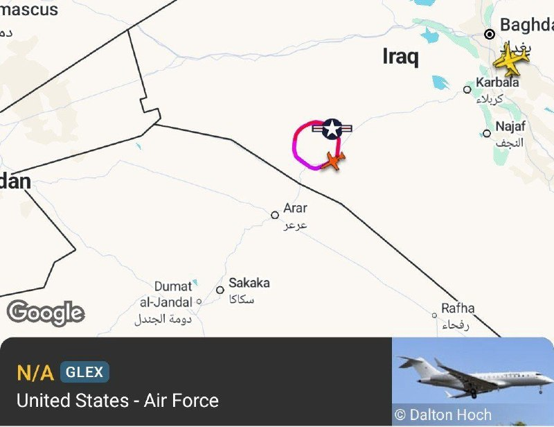

📌موقعیت احتمالی یک پایگاه نظامی محرمانه اسرائیل در صحرای عراق در مختصات 31.66697°N, 42.44864°E که دارای یک باند خاکی حدود ۱.۷ کیلومتری است. 🔸این محل که تنها ۷۰ کیلومتر با مرز عربستان فاصله دارد، به نظر می‌رسد چند روز پیش از آغاز جنگ با ایران ساخته شده باشد.…

## mwarmonitor — post 8784

🇮🇶 پارلمان عراق وزرای امنیت را برای بررسی گزارشی درباره ادعای وجود یک پایگاه مخفی اسرائیلی احضار می‌کند — شبکه i24

@mwarmonitor

## mwarmonitor — post 8783

  

🔴به گفته منابع آگاه از این موضوع، از جمله مقام‌های آمریکایی، اسرائیل یک پایگاه نظامی مخفی در بیابان غربی عراق ایجاد کرده بود تا از کارزار هوایی خود علیه ایران پشتیبانی کند. 🔸بر اساس گزارش‌ها، این تأسیسات پنهانی محل استقرار نیروهای ویژه اسرائیل بوده و به‌عنوان…

## mwarmonitor — post 8780

✈️ساعت 08:52 به وقت زرلو، شناسه SPOOF 30، یک فروند بمب‌افکن B-52H به‌صورت تک از پایگاه فرفورد (Fairford) به پرواز درآمده و روی فرکانس نظامی Swan Mil با فرکانس 278.600 در حال فعالیت است.

@mwarmonitor

## mwarmonitor — post 8779

  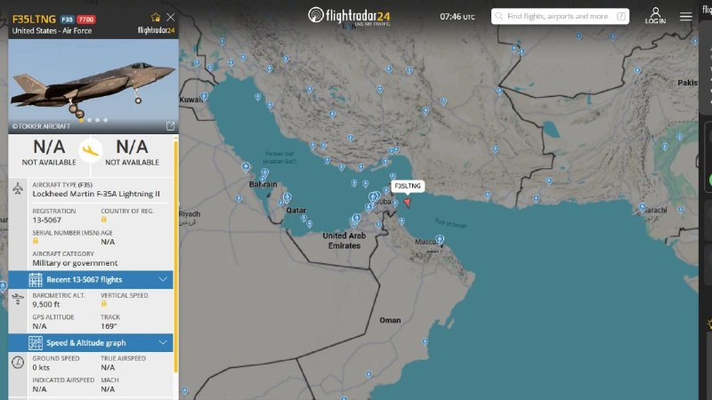

✈️🇺🇸جنگنده F-35 نیروی هوایی آمریکا (USAF) در حال ارسال کد اضطراری 7700 بر فراز تنگه هرمز است.

@mwarmonitor

## mwarmonitor — post 8778

  <a href="telegram/content/mwarmonitor_8778_1778403977.mp4">🎬 Download video</a>

📝 باید به حالِ سیرکی گریست که در آن، یک «مرغِ دیپورتی» که حتی درِ دستشویی‌های تورنتو را هم به رویش باز نکردند، حالا در نقشِ «ناجیِ دیپلماسی» برای یک ملت منبر می‌رود. این انگلِ خوش‌اشتها چنان با وقاحت از «ماندن تا آخرین لحظه» حرف می‌زند که انگار ماندنش یک تکلیف الهی است، نه یک مأموریتِ شکمی برای لیسیدنِ ته‌مانده‌ی دیگِ بیت‌المال.
🔸 درد اینجاست که او جام جهانی را نه برای فوتبال، بلکه به عنوان یک «گروگانِ سیاسی» می‌خواهد تا پشتِ آن قایم شود و به ریشِ مردمی بخندد که هزینه‌ی ویزاهای ریجکت‌شده‌اش را می‌دهند. او نگرانِ جایگزین شدنِ ایران توسط فیفا نیست؛ او می‌ترسد که اگر این سیرک تمام شود، دیگر جایی برای چریدن نداشته باشد. حقیقتِ تلخ و گزنده این است: ما در زمینی بازی می‌کنیم که داورش یک جیره‌بگیرِ بی‌مصرف است که در خارج از مرزها حتی به عنوان «ضایعات» هم پذیرفته نمی‌شود، اما در داخل، تاجِ افتخارِ مدیریتی بر سر می‌گذارد. این دیگر طنز نیست، این بوی گندِ تعفنی است که با هیچ ادکلنِ دیپلماتیکی پاک نمی‌شود؛ حکایتِ موجودی که تا آخرین قطره‌ی خونِ فوتبال را نمک نزند، دست از سرِ جنازه‌ی این ورزش بر نمی‌دارد.

@mwarmonitor

## pm_afshaa — post 90454

رئیس اتحادیه کسب‌وکارهای اینترنتی: درآمد برخی فعالان شبکه‌های اجتماعی به نزدیک صفر رسیده

💧 Rainbet.com the #1 Non-KYC Crypto Casino & Sportsbook @rainbetcom

😁 @Pm_Afshaa

## pm_afshaa — post 90453

🔴یدیعوت آحارونوت: پهپادهای هدایت‌شونده با فیبر نوری حزب‌الله به منبع نگرانی ارتش اسرائیل تبدیل شده

‌
💧 Rainbet.com the #1 Non-KYC Crypto Casino & Sportsbook @rainbetcom

😁 @Pm_Afshaa

## pm_afshaa — post 90452

پزشکیان: دشمن پس از ناکامی در جنگ نظامی، تلاش دارد جنگ را به عرصه اقتصاد منتقل کند و مردم باید با نقش‌آفرینی و همراهی خود، این توطئه را نیز ناکام بگذارن

💧 Rainbet.com the #1 Non-KYC Crypto Casino & Sportsbook @rainbetcom

😁 @Pm_Afshaa

## DEJradio — post 4541

  <a href="telegram/content/DEJradio_4541_1778403979.mp4">🎬 Download video</a>

🎥
👑 ۱۹ دی‌ماه ۱۴۰۴؛ تیراندازی بـ.ـسیجی‌ها به مردم از پشت سر
وقتی مردم برای نجات جان خود در کوچه‌ها پنهان شده‌ بودند نیروهای سرکوبگر از پشت سر به آنها تیراندازی کردند.

#سرکوبگران #دیماه
@DEJradio

## DEJradio — post 4540

  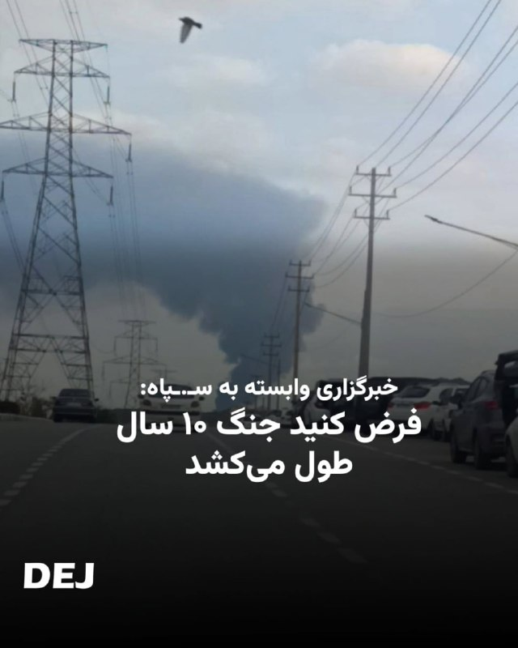

⭕️
🔺 چند هفته پس از پایان جنگ ۴۰ روزه، بازار کار ایران با یکی از شدیدترین موج‌های بیکاری و تعدیل نیرو روبرو شده است. بسیاری از کارخانجات تعطیل شده‌اند و هزاران نفر شغل‌شان را از دست داده‌اند.
خبرگزاری فارس وابسته به سـ.ـپاه با اشاره به تعطیلی کارخانه‌ها و تولیدی‌ها به نقل از یک تولیدگر نوشته «اوضاع افتضاح است.»
این خبرگزاری به نقل از یک «تحلیلگر اقتصادی» می‌نویسد، «حتی اگر درگیر جنگ هم نبودیم، در دنیای امروز، اقتصاد کشور باید با فرض یک جنگ ۱۰ ساله بازمعماری شود. دولت باید با مردم حرف بزند و به سرعت وضعیتی که تصمیم‌ها را موقت، سرمایه‌گذاری‌ها را معلق و زنجیره‌های تولید را شکننده نگه داشت، پایان یابد.»
به نوشته فارس «بذر یک اقتصاد مقاوم در پذیرش یک افق هرچند دشوار کاشته می‌شود. فرض جنگی ۱۰ ساله، هرچند بی‌رحم است اما دست‌کم نقشه‌راه دارد؛ همان نقشه‌ای که می‌تواند چراغ کارخانه‌ای را پس‌از ماه‌ها خاموشی، دوباره روشن کند.»

#بیکاری #فقر
@DEJradio

## DEJradio — post 4539

  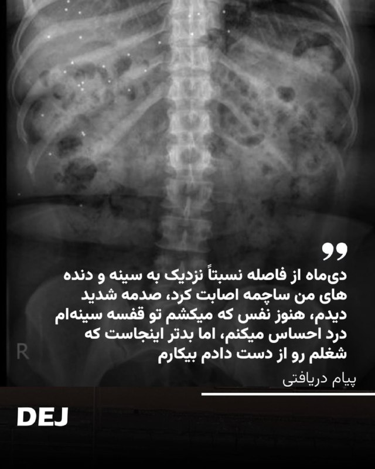

📢
🔺 “دی‌ماه از فاصله نسبتاً نزدیک به سینه و دنده‌های من ساچمه اصابت کرد، صدمه شدید دیدم، هنوز وقتی نفس که میکشم تو قفسه سینه‌ام درد میکنم، اما بدتر اینجاست که شغلم رو از دست دادم بیکارم

#پیام_دریافتی #دیماه
@DEJradio

## mamlekate — post 103490

❗️ بندرعباس ۲۰ اردیبهشت ساعت ۱۲:۰۰ هواپیمای مسافری بلند شد بعد ۱۵ دقیقه بعد صدای ۲ انفجار شدید از سمت پایگاه هوایی و فرودگاه اومد.

❗️ توی قشم هم احساس شد

📝 همین الان باز داره صدای هواپیما داره میاد و خبری نیست. مهمات عمل نکرده بوده احتمالا. ما میدون تره و بار بودیم دقیقا اون دست پایگاه هوایی

@mamlekate

## IranIntlTV — post 336428

  <a href="telegram/content/IranIntlTV_336428_1778403982.mp4">🎬 Download video</a>

وال‌استریت ژورنال گزارش داد اسرائیل برای پشتیبانی از عملیات هوایی در جنگ با جمهوری اسلامی، پایگاهی سری در غرب عراق ایجاد کرده‌ است.

جزییات بیشتر در گفت‌وگو با اشکان صفایی، خبرنگار ایران‌اینترنشنال

@iranintltv

## IranIntlTV — post 336427

  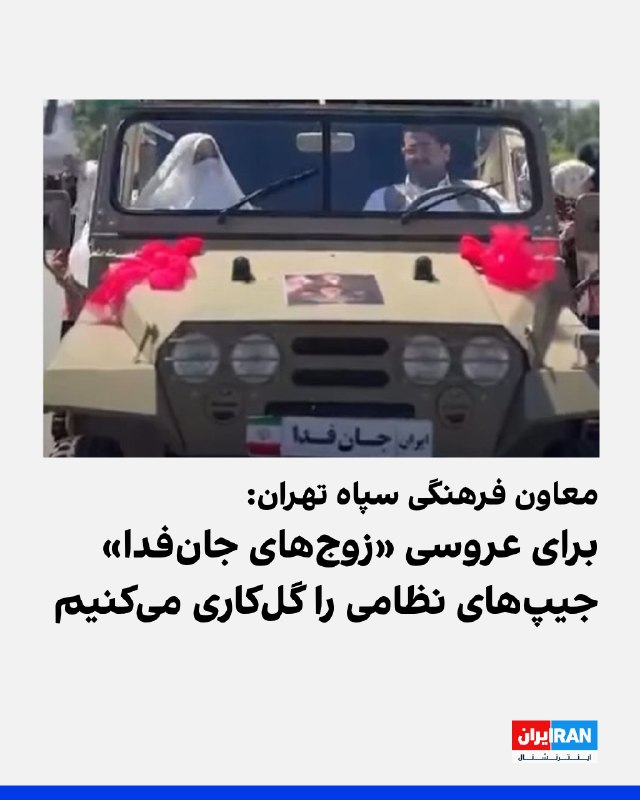

رحیم نادعلی، معاون فرهنگی سپاه «محمد رسول‌الله» تهران گفت: «در جشن بزرگ پیوند آسمانی زوج‌های جان‌فدا، خودروهای جیپ جنگی برای جابه‌جایی عروس و دامادها در نظر گرفته شده که با گل‌آرایی، پرچم جمهوری اسلامی و تصاویر رهبری تزئین شده و زوج‌ها در این خودروها در مراسم حضور خواهند یافت.»

او افزود زوج‌های شرکت‌کننده قرار است با «ماشین‌های عروسی به شکل جیپ نظامی» و «خودروهای نظامی گل‌کاری‌شده» در سطح شهر حضور پیدا کنند تا «فضای شهر را به یک شکل هنری و نظامی» درآورند.

به گفته او، هدف این است که نشان داده شود این «زوج‌های جانفدا» جان خود را «زیر پرچم جمهوری اسلامی تقدیم این نظام خواهند کرد» و «از هیچ چیز نمی‌ترسند.»

او همچنین این مراسم را با ازدواج‌ها در «بحبوحه جنگ» در دهه ۶۰ مقایسه کردند و گفت همان‌طور که در آن دوران «سنت الهی» ازدواج ادامه داشت، اکنون نیز در شرایط جنگ و تهدید، این سنت‌ها ادامه خواهد یافت و «یک قاب تصویر جدید» به دنیا نشان داده می‌شود.
https://iranintl.com/202605106327

## IranIntlTV — post 336426

🔻وای‌نت: تنگه هرمز به «زندان شناور» برای ۲۰ هزار ملوان تبدیل شده است

وای‌نت در گزارشی از وضعیت کشتی‌های گرفتار در تنگه هرمز نوشت بیش از ۲۰ هزار ملوان و خدمه دریایی، پس از ۶۵ روز تنش و درگیری میان جمهوری اسلامی و آمریکا، همچنان در خلیج فارس گرفتار مانده‌اند؛ در حالی که ذخایر آب، غذا و دارو رو به پایان است و صدها کشتی امکان خروج از منطقه را ندارند.

بر اساس این گزارش، تنها سه روز پس از آنکه دونالد ترامپ «پروژه آزادی» برای بازگشایی مسیر تردد کشتی‌های تجاری در تنگه هرمز را متوقف کرد، تبادل حملات میان آمریکا و حکومت ایران بار دیگر از سر گرفته شد و تهران تهدید کرد «پاسخی قاطع» خواهد داد.

وای‌نت نوشت اکنون هزاران ملوان در انتظار پاسخ نیروی دریایی حکومت ایران هستند تا مشخص شود چه زمانی اجازه خروج از تنگه را خواهند داشت.

یکی از این ملوانان، شمیم صابر، ناوبر اهل بنگلادش در یک کشتی تحقیقاتی، به وال‌استریت ژورنال گفته است: «ذخایر آب و غذای ما هر روز کمتر می‌شود. نگرانم و برای جانم می‌ترسم. وضعیت بسیار بد است و ما درمانده شده‌ایم.»

او گفت مقام‌های ایرانی پس از درخواست خروج از طریق رادیو به آن‌ها گفته‌اند عبور از تنگه «قرمز» و بسیار خطرناک است.
به نوشته وای‌نت، صدها کشتی در صفی طولانی تا خروجی تنگه لنگر انداخته‌اند، در حالی که پهپادها بر فراز آن‌ها پرواز می‌کنند و زباله‌های کشتی‌های دیگر روی آب شناور است.

این گزارش می‌افزاید خدمه کشتی‌ها اکنون میان حفظ جایگاه خود در صف انتظار یا حرکت به سمت بنادر برای تامین دوباره آب و غذا مردد مانده‌اند؛ زیرا هیچ‌کس نمی‌داند چه زمانی مسیر خروج باز خواهد شد.

وای‌نت وضعیت کنونی خلیج فارس را «زندان شناور» برای بیش از ۸۰۰ کشتی توصیف کرده که بیش از دو ماه است در منطقه گرفتار شده‌اند.

بر اساس داده‌های سازمان بین‌المللی دریانوردی که در این گزارش به آن استناد شده، در جریان تبادل حملات میان حکومت ایران و آمریکا، بیش از ۳۰ کشتی هدف موشک‌ها و پهپادهای ایرانی قرار گرفته‌اند و دست‌کم ۱۰ ملوان کشته شده‌اند.

این گزارش همچنین به روایت یک ملوان هندی اشاره می‌کند که گفته شاهد سوختن کامل کشتی مجاور خود بوده، در حالی که خدمه آن در انتظار امدادی بودند که هرگز نرسید.

او گفته داروهای کشتی به پایان رسیده و خودش نیز دیگر داروی فشار خون در اختیار ندارد.

به نوشته وای‌نت، برخی خدمه معتقدند برای عبور از محاصره ایران باید به سپاه پاسداران انقلاب اسلامی پول پرداخت شود، اما هماهنگی این پرداخت‌ها تنها میان دولت‌ها انجام می‌شود و ملوانان خارجی در بلاتکلیفی به سر می‌برند.

این گزارش یادآوری می‌کند ترامپ اوایل ماه جاری «پروژه آزادی» را با هدف ازسرگیری عبور کشتی‌های تجاری از تنگه هرمز آغاز کرد؛ عملیاتی که او آن را «اقدامی بشردوستانه» توصیف کرده بود.

بر اساس اعلام فرماندهی مرکزی آمریکا، قرار بود این عملیات با پشتیبانی ناوشکن‌های موشک‌انداز، بیش از ۱۰۰ هواگرد و حدود ۱۵ هزار نیروی نظامی اجرا شود، اما تنها پس از ۳۶ ساعت متوقف شد.
روز بعد، پس از آنکه جمهوری اسلامی به سوی ناوشکن‌های آمریکایی عبوری از تنگه آتش گشود و ارتش آمریکا پاسخ داد، درگیری‌ها بار دیگر شدت گرفت.

حکومت ایران آمریکا را به نقض آتش‌بس متهم کرد و تهدید به پاسخ داد. ترامپ نیز هم‌زمان با تهدید تهران، تاکید کرد «آتش‌بس همچنان برقرار است.»

در ادامه این تنش‌ها، امارات متحده عربی از فعال شدن سامانه‌های پدافند هوایی خود خبر داد، هرچند مشخص نشد چه اهدافی رهگیری شده‌اند.

سخنگوی نیروهای نظامی جمهوری اسلامی نیز آمریکا را به «نقض آتش‌بس» متهم کرد و هشدار داد تهران «قاطعانه و بدون تردید» پاسخ خواهد داد.

با این حال، تلویزیون حکومت در ایران ساعاتی بعد از «بازگشت شرایط به حالت عادی» خبر داد؛ وضعیتی که به نوشته وای‌نت، همچنان با ادامه محاصره هرمز و سرگردانی صدها کشتی همراه است.

🔗وب‌سایت ایران‌اینترنشنال
@iranintltv

## IranIntlTV — post 336425

🔻فاکس‌نیوز: «نقطه کور» برنامه هسته‌ای ایران نادیده گرفته شده است

شبکه فاکس نیوز گزارش داد کارشناسان هسته‌ای و عدم اشاعه به دولت دونالد ترامپ هشدار داده‌اند هرگونه توافق جدید با جمهوری اسلامی باید شامل ممنوعیت کامل استفاده ایران از پلوتونیوم برای ساخت سلاح هسته‌ای باشد؛ زیرا تهران ممکن است از این مسیر به‌عنوان «نقطه کور» مذاکرات استفاده کند.

بر اساس این گزارش، تمرکز اصلی دولت آمریکا و بسیاری از کارشناسان تاکنون بر برنامه غنی‌سازی اورانیوم جمهوری اسلامی بوده، اما برخی تحلیلگران هشدار می‌دهند جمهوری اسلامی می‌تواند به‌صورت مخفیانه از پلوتونیوم موجود در سوخت مصرف‌شده نیروگاه‌های هسته‌ای برای تولید بمب اتمی استفاده کند.

جیسون برودسکی، مدیر سیاست‌گذاری سازمان «اتحاد علیه ایران هسته‌ای»، به فاکس نیوز گفت هر توافق احتمالی با تهران باید «مسیر پلوتونیوم» را نیز پوشش دهد.

او با اشاره به حملات اسرائیل به راکتور آب سنگین اراک در ژوئن ۲۰۲۵ و مارس ۲۰۲۶ گفت اطلاعات موجود نشان می‌دهد حکومت ایران حتی پس از بمباران نیز تلاش کرده این تاسیسات را بازسازی کند.

فاکس‌نیوز نوشت برخی کارشناسان معتقدند جمهوری اسلامی می‌تواند از پلوتونیوم موجود در سوخت مصرف‌شده نیروگاه بوشهر برای ساخت بمب هسته‌ای استفاده کند.

هنری سوکولسکی، مقام پیشین وزارت جنگ آمریکا و مدیر مرکز «آموزش سیاست عدم اشاعه»، در مقاله‌ای هشدار داده واشینگتن باید اطمینان حاصل کند [حکومت] ایران سوخت مصرف‌شده بوشهر را خارج نکرده و پلوتونیوم آن را استخراج نمی‌کند.
او پیشنهاد کرده است پنتاگون با استفاده از ماهواره‌ها و پهپادها بر نیروگاه بوشهر نظارت کند و هر توافق احتمالی با [حکومت] ایران نیز شامل نظارت تقریبا لحظه‌ای بر راکتور و مخازن سوخت مصرف‌شده باشد.

سوکولسکی همچنین در مقاله‌ای دیگر مدعی شده ایران پلوتونیوم کافی برای ساخت بیش از ۲۰۰ بمب هسته‌ای در اختیار دارد.

به نوشته فاکس‌نیوز، او هشدار داده فاصله ۹۰ روزه میان بازرسی‌های آژانس بین‌المللی انرژی اتمی از بوشهر می‌تواند فرصت کافی برای انتقال سوخت مصرف‌شده و استفاده احتمالی از آن در برنامه تسلیحاتی ایجاد کند.

سخنگوی وزارت خارجه آمریکا به فاکس نیوز گفت برنامه هسته‌ای جمهوری اسلامی «تهدیدی برای آمریکا و کل جهان» است و تهران با عدم همکاری کامل با آژانس، تعهدات خود در معاهده منع گسترش سلاح‌های هسته‌ای را نقض کرده است.

با این حال، برخی کارشناسان نسبت به عملی بودن مسیر پلوتونیوم تردید دارند.

دیوید آلبرایت، بازرس پیشین تسلیحاتی و رییس مؤسسه علوم و امنیت بین‌المللی، گفت بسیار بعید است [حکومت] ایران از پلوتونیوم سوخت مصرف‌شده بوشهر برای ساخت سلاح هسته‌ای استفاده کند.
او استدلال کرد [حکومت] ایران هنوز طراحی لازم برای بمب پلوتونیومی را توسعه نداده و هیچ نشانه‌ای در اسناد هسته‌ای جمهوری اسلامی از چنین برنامه‌ای دیده نشده است.

آلبرایت همچنین گفت هرگونه انتقال سوخت از بوشهر به‌سرعت شناسایی می‌شود و می‌تواند باعث توقف همکاری هسته‌ای روسیه با ایران شود.

او افزود بیشتر پلوتونیوم موجود در سوخت مصرف‌شده بوشهر «درجه راکتوری» دارد و نه «درجه تسلیحاتی» و استفاده از آن برای ساخت بمب بسیار دشوار است.

در همین حال، آندره‌آ استریکر، از کارشناسان بنیاد دفاع از دموکراسی‌ها، به فاکس نیوز گفت آمریکا باید در هر توافق آینده با تهران بر «ممنوعیت دائمی و قابل راستی‌آزمایی بازفرآوری پلوتونیوم» اصرار کند.

او افزود روسیه پس از حملات سال ۲۰۲۵ بر بازگشت بازرسان آژانس به بوشهر تاکید کرده و این بازرسی‌ها دوباره آغاز شده است.

استریکر همچنین گفت [حکومت] ایران از اوایل دهه ۲۰۰۰ تمرکز چندانی بر مسیر پلوتونیوم نداشته و برای حرکت در این مسیر به تاسیسات بازفرآوری و تجهیزات پیچیده شیمیایی نیاز دارد؛ مسائلی که به گفته او موانع مهمی در برابر استفاده نظامی از پلوتونیوم ایجاد می‌کنند.

فاکس‌نیوز در پایان نوشت برخی کارشناسان پیشنهاد کرده‌اند آژانس بین‌المللی انرژی اتمی با افزایش دفعات بازرسی از بوشهر و انتقال سوخت مصرف‌شده توسط روسیه، خطر اشاعه هسته‌ای را کاهش دهد.

🔗وب‌سایت ایران‌اینترنشنال
@iranintltv

## IranIntlTV — post 336424

  <a href="telegram/content/IranIntlTV_336424_1778403983.mp4">🎬 Download video</a>

ویدیوهایی که از ملبورن به ایران‌اینترنشنال رسیده، نشان می‌دهد ایرانیان مقیم این شهر در استرالیا، یکشنبه ۲۰ اردیبهشت با حضور گسترده خود در تجمع اعتراضی علیه جمهوری اسلامی، فریاد «جاوید شاه» سردادند.

## IranIntlTV — post 336423

  <a href="telegram/content/IranIntlTV_336423_1778403985.mp4">🎬 Download video</a>

بر اساس ویدیوهای رسیده به ایران‌اینترنشنال، ایرانیان مقیم ژاپن یکشنبه ۲۰ اردیبهشت در پی فراخوان شاهزاده رضا پهلوی، علیه اعدام‌های جمهوری اسلامی و قطع اینترنت در ایران، در شهر توکیو تجمع کردند.

## IranIntlTV — post 336422

  <a href="telegram/content/IranIntlTV_336422_1778403986.mp4">🎬 Download video</a>

همزمان با ادامه نبرد آمریکا و جمهوری اسلامی بر سر کنترل تنگه هرمز، دونالد ترامپ تصاویری گرافیکی از نابودسازی نیروی دریایی سپاه منتشر و بر پیروزی در جنگ تاکید کرد. سپاه پاسداران نیز ایالات متحده را به اقدام نظامی تهدید کرد.

گفت‌وگو با مرتضی کاظمیان، عضو تحریریه ایران‌اینترنشنال
@iranintltv

## IranIntlTV — post 336421

  <a href="telegram/content/IranIntlTV_336421_1778403988.mp4">🎬 Download video</a>

رجب طیب اردوغان، رییس‌جمهوری ترکیه، ضمن محکوم کردن حملات جمهوری اسلامی، بر حمایت کامل کشورش از امنیت و حاکمیت امارات متحده عربی و دولت اقلیم کردستان عراق تاکید کرد.
نرگس هورخش، خبرنگار ایران‌اینترنشنال، گزارش می‌دهد
@iranintltv

## IranIntlTV — post 336420

  

فاطمه پوررضاقلی، دبیر انجمن پیوند کلیه ایران گفت: «در حوزه آنتی‌بیوتیک‌ها با مشکلاتی مواجه هستیم و برخی از این داروها بسیار نایاب شده‌اند.»

او افزود: «در حال حاضر نیز کمبود برخی داروهای عمومی و در دسترس، به‌تدریج محسوس شده است.»

پوررضاقلی ادامه داد: «بخشی از ذخایر دارویی و بیمارستانی طی ماه‌های گذشته مصرف شده و اگر گشایشی در روند تامین دارو ایجاد نشود، احتمال بروز مشکلات جدی در آینده وجود دارد.»
https://iranintl.com/202605109657

## IranIntlTV — post 336419

  <a href="telegram/content/IranIntlTV_336419_1778403990.mp4">🎬 Download video</a>

ویدیوهای رسیده به ایران‌اینترنشنال نشان می‌دهد ایرانیان مقیم نیوزیلند یکشنبه ۲۰ اردیبهشت در پاسخ به فراخوان شاهزاده رضا پهلوی و علیه اعدام‌های جمهوری اسلامی، با هم‌خوانی سرود «ای ایران» در شهر دنیدن تجمع کردند.

## IranIntlTV — post 336418

🗣روایت شما از بیکاری و گرانی زیرسایه آتش‌بس- یکشنبه ۲۰ اردیبهشت ۱۴۰۵

 

🔹گرانی بیداد می‌کنه اما حکومت هیچ برنامه‌ای نداره و فقط سکوت کرده. بدون جنگ هم تا دو ماه دیگه این اقتصاد سقوط می‌کنه، شک نکنید.

 

🔹همه‌ی کالاها از لبنیات و روغن گرفته تا برنج، پلاستیک و دستمال، تقریباً هر فاکتور جدیدی که بیاد، قیمت‌ها افزایش پیدا کرده.

 

🔹من از تهران صحبت می‌کنم، از زمان اعتراضات دی‌ماه که دولت دلار رو برای کالاهای اساسی آزاد کرد، تورم و فشار اقتصادی تشدید شده و در همه مناطق کشور هم همین وضعیت هست.

 

🔹حتی اگه همین فردا هم اینترنت رو وصل کنید، هیچ‌وقت این ظلم و جنایتی که اعضای «شعام» (که حتی می‌ترسن اسم کامل‌شون رو اعلام کنن) در حق معیشت و روان ما کردن رو فراموش نمی‌کنیم.

 

🔹وضعیت اینترنت داغونه. بعد دو ماه با بدبختی تونستم وصل بشم. وضعیت شغل‌ها خرابه و همه بیکار شدن. درست حقوق نمی‌دن و همه‌چیز خیلی زیاد گرونه. به امید آزادی ایران.

 

🔹از اصفهان پیام می‌دم؛ هیچ کاری نمی‌شه کرد. این مدت هر کاری برای امرار معاش کردم، اما زورم به هیچی نمی‌رسه، حتی جمع کردن خودم. خدا لعنت کنه جمهوری اسلامی رو.

 

🔹اوضاع اصلاً جالب نیست. وام‌های طرح مهربانی بانک ملی اصلاً نمی‌ذاره نفس بکشیم. باقی بانک‌ها یه‌کم بهتر هستن، درواقع یعنی انتخاب بین بد و بدتر. با این رکود و وضعیت اقتصادی، قسط وام‌ها کمرشکن شده واقعاً.

 

🔹کارگاه تولیدی داشتیم و از پس اقساط برمی‌اومدیم، ماهانه ۳۰ میلیون قسط می‌دیم. متأسفانه بعد از جنگ و با قیمت افتضاح ورق فولادی، ورشکسته شدیم و اگر وام یک ماه رو پرداخت نکنید، سریع و بدون هشدار از حساب ضامن کم می‌کنه.

## IranIntlTV — post 336417

  <a href="telegram/content/IranIntlTV_336417_1778403992.mp4">🎬 Download video</a>

ویدیوهای رسیده به ایران‌اینترنشنال نشان می‌دهند ایرانیان مقیم استرالیا یکشنبه ۲۰ اردیبهشت با فراخوان شاهزاده رضا پهلوی در شهر ملبورن راهپیمایی کردند.

## IranIntlTV — post 336416

  

نت‌بلاکس، نهاد ناظر بر اختلال‌های اینترنتی، صبح یکشنبه اعلام کرد قطعی اینترنت در ایران پس از بیش از ۱۷۰۰ ساعت، وارد هفتادودومین روز خود شده است.

بر اساس این گزارش، هیچ نشانه‌ای از برقراری اینترنت وجود ندارد و مقام‌های حکومت دسترسی عمومی به اینترنت بین‌المللی را محدود کرده‌اند.
https://iranintl.com/202605108444

## IranIntlTV — post 336415

  <a href="telegram/content/IranIntlTV_336415_1778403994.mp4">🎬 Download video</a>

بریتانیا اعلام کرد پس از پایان رسمی درگیری‌های ایالات متحده و اسرائیل با جمهوری اسلامی، برای تامین امنیت عبور کشتی‌ها از تنگه هرمز یک ناو جنگی به خاورمیانه اعزام می‌کند.
گفت‌وگو با روح‌الله رحیم‌پور، روزنامه‌نگار و تحلیل‌گر سیاسی
@iranintltv

## IranIntlTV — post 336414

  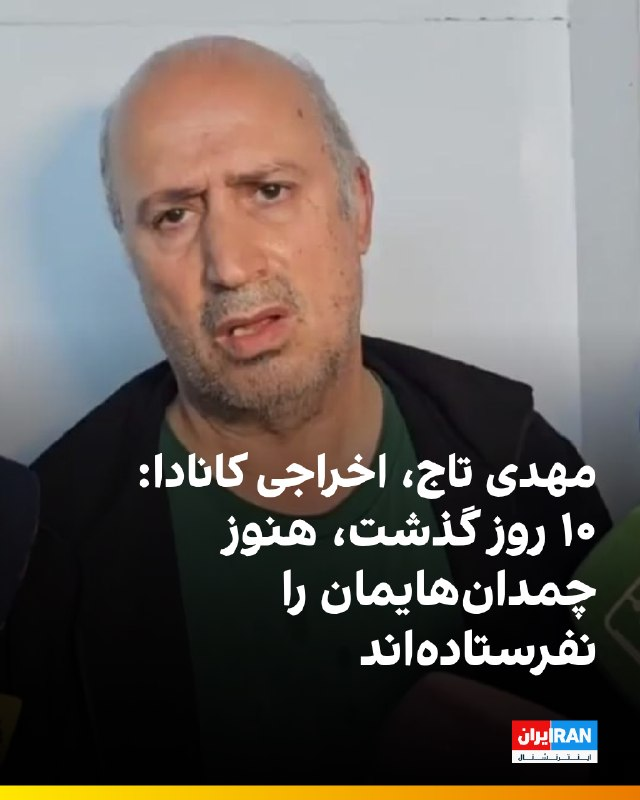

🔻مهدی تاج، رئیس فدراسیون فوتبال، در گفت‌وگو با صداوسیمای جمهوری اسلامی اعلام کرد: «۱۰ روز است که از کانادا برگشته‌ایم ولی هنوز چمدان‌هایمان را نفرستاده‌اند؛ نمی‌دانم سرنوشت چمدان‌های ما چه شده است.»

🔹پلیس کانادا از ورود مهدی تاج، هدایت ممبینی، دبیرکل فدراسیون و دو عضو کمیته روابط بین‌الملل به خاک این کشور جلوگیری کرد. این افراد پس از ساعت‌ها حضور در فرودگاه، از کانادا اخراج شدند.

🔹اخراج تاج پس از انتشار گزارش اختصاصی ایران‌اینترنشنال صورت گرفت؛ گزارشی که فاش کرد برای تاج «مجوز اقامت موقت» یا ویزای TRP صادر شده است.

🔹مهدی تاج سابقه فرماندهی در اطلاعات سپاه پاسداران اصفهان را دارد. دولت کانادا از خرداد ۱۴۰۳، سپاه پاسداران را در فهرست گروه‌های «تروریستی» قرار داده است.

@iranintltvsport

## IranIntlTV — post 336413

  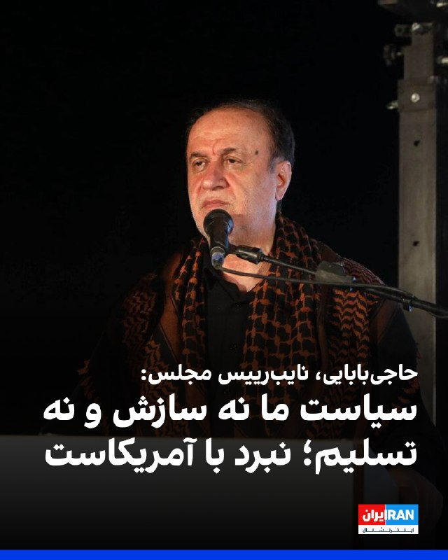

حمیدرضا حاجی‌بابایی، نایب‌رییس مجلس گفت: «پس از ناامیدی از اغتشاشات داخلی، آمریکا با همراهی ۵۴ کشور یک جنگ تمام‌عیار نظامی علیه ما آغاز کرد اما سیاست ما نه سازش و نه تسلیم؛ نبرد با آمریکاست.»

او ادامه داد: «آمریکا قصد داشت با جلوگیری از جابه‌جایی نفت، ما را تحت فشار قرار دهد، اما ما با باز کردن مرز‌های ۱۶ استان کشور این توطئه را خنثی کردیم.»

او افزود: «دنیا می‌داند اگر تنگه هرمز بسته بماند، در کمتر از یک ماه بحران عظیم نفتی و افزایش شدید قیمت‌ها گریبان اروپا و آمریکا را خواهد گرفت.»
https://iranintl.com/202605100111

## Shin_Persian — post 5917

Shin ✓ @hey_itsmyturn
Sun, 10 May 2026 08:51:58 UTC

Possibly UXO EOD

فارسی

احتمال وجود مهمات عمل‌نکرده (UXO) و نیاز به خنثی‌سازی بمب (EOD)

𝕏 · @shin_persian

## Shin_Persian — post 5916

Shin ✓ @hey_itsmyturn
Sun, 10 May 2026 08:50:08 UTC

2 blasts in Bandar Abbas, Hormozgan Province, #Iran

فارسی

۲ انفجار در بندرعباس، استان هرمزگان، #Iran

𝕏 · @shin_persian

## ManotoTV — post 105227

  

وزارت خارجه قطر اعلام کرد شیخ محمد بن عبدالرحمن بن جاسم آل ثانی، نخست‌وزیر و وزیر خارجه این کشور، در میامی با مارکو روبیو، وزیر خارجه آمریکا، و استیو ویتکاف، فرستاده آمریکا در امور خاورمیانه، دیدار کرده است.

به گزارش خبرگزاری رسمی قطر، در این دیدار روابط راهبردی دو کشور، به‌ویژه در حوزه‌های دفاع و انرژی، تحولات منطقه و تلاش‌های میانجی‌گرانه برای کاهش تنش‌ها بررسی شد.

وب‌سایت اکسیوس نیز گزارش داد این دیدار بخشی از تلاش‌ها برای دستیابی به توافقی برای پایان دادن به جنگ در ایران بوده است.

## ManotoTV — post 105226

  

نت‌بلاکس اعلام کرد قطعی گسترده اینترنت در ایران پس از ۱۷۰۴ ساعت همچنان ادامه دارد و این محدودیت بی‌سابقه اکنون وارد سومین ماه خود شده است؛ در حالی که مقام‌های جمهوری اسلامی همچنان دسترسی عمومی به اینترنت بین‌المللی را برای مردم داخل ایران محدود نگه داشته‌اند.

## ManotoTV — post 105225

  

قتل «مریم آقابابایی» دختر ۳۰ ساله اهل شهرکرد که پس از سوار شدن به یک تاکسی اینترنتی ناپدید شده بود، واکنش‌های گسترده‌ای در پی داشته است.

بر اساس گزارش رسانه‌های ایران، جسد سوخته مریم چند روز بعد توسط یک چوپان در اطراف شهرکرد پیدا شد. پلیس اعلام کرده متهم اصلی پرونده بازداشت شده و در بازجویی‌های اولیه به قتل اعتراف کرده است.

خانواده مریم می‌گویند انگیزه قتل هنوز به‌طور دقیق مشخص نیست. برخی گزارش‌های محلی از احتمال تعرض خبر داده‌اند، اما متهم تاکنون انگیزه را «سرقت طلا» عنوان کرده است.

همزمان، تجمع‌هایی در شهرکرد برای مطالبه عدالت و امنیت زنان برگزار شده است. پرونده همچنان در مرحله تحقیقات قرار دارد.

## ManotoTV — post 105224

  

رسانه‌های حکومتی در ایران از احتمال شنیده شدن صدای «انفجارهای کنترل‌شده» در اصفهان خبر دادند

بر اساس اطلاعیه منتشرشده در رسانه‌های نزدیک به حکومت، از جمله خبرگزاری فارس و رسانه‌های وابسته به سپاه، احتمال شنیده شدن صدای انفجار از ساعت ۹ تا ۱۵ امروز در برخی مناطق اصفهان وجود دارد.

در این اطلاعیه آمده که انفجارها در مناطق اقارب‌پرست، حکیم نظامی و بلوار کشاورز انجام می‌شود و «جای هیچ‌گونه نگرانی برای شهروندان نیست.»

در روزهای اخیر نیز رسانه‌های حکومتی چندین بار خبرهایی مشابه درباره «انفجارهای کنترل‌شده» در اصفهان و شهرهای دیگر منتشر کرده‌اند. روابط عمومی سپاه حضرت صاحب‌الزمان استان اصفهان در اطلاعیه‌های قبلی، مسئولیت انتشار این هشدارها را برعهده گرفته بود.

## FarsiVOA — post 217325

🔺وال‌استریت ژورنال: نقش مجتبی خامنه‌ای در مذاکرات و تصمیم‌سازی‌ها مبهم است

▪️وال‌استریت ژورنال در گزارشی نوشته جمهوری اسلامی در لحظه‌ای حساس برای پایان دادن به جنگ با یک مشکل جدی روبه‌روست: مجتبی خامنه‌ای، در انظار عمومی دیده نمی‌شود، درباره مذاکرات سکوت کرده و مشخص نیست تا چه اندازه در تصمیم‌گیری واقعی حضور دارد.

▪️مقام‌های جمهوری اسلامی می‌گویند دلیل این غیبت، مسائل امنیتی است. آن‌ها می‌گویند اسرائیل پیش از آتش‌بس، مقام‌های ارشد جمهوری اسلامی را هدف قرار می‌داد و مجتبی خامنه‌ای همچنان در فهرست اهداف اسرائیل قرار دارد.

▪️با این حال، وال‌استریت ژورنال می‌نویسد این توضیحات نتوانسته این برداشت را از بین ببرد که مجتبی خامنه‌ای برای اداره روزمره کشور بیش از حد بیمار یا غایب است.

⬇️ بیشتر بخوانید:
https://ir.voanews.com/a/8148463.html

## FarsiVOA — post 217324

  

منابع غزه‌ای گزارش دادند در حملات ارتش اسرائیل به یک جیپ در خان‌یونس، سه نفر کشته شدند.

بر اساس این گزارش‌ها، یکی از کشته‌شدگان وسام عبدالهادی، مسئول بخش تحقیقات حماس در خان‌یونس، بوده است. منابع محلی همچنین اعلام کردند فادی هیکل، از همراهان او، نیز در این حملات کشته شده است.

هدف اصلی این حملات، بنا بر گزارش‌های اولیه، وسام عبدالهادی معرفی شده؛ فردی که از او به‌عنوان فرمانده بخش تحقیقات حماس در خان‌یونس نام برده می‌شود.
@FarsiVOA

## FarsiVOA — post 217322

🔺مذاکرات پاکستان با جمهوری اسلامی برای دریافت گاز مایع قطر

▪️خبرگزاری رویترز از قول یک منبع آگاه گزارش داده که پاکستان در حال مذاکره با جمهوری اسلامی برای عبور ایمن تعداد محدودی از کشتی‌های حامل گاز مایع قطر از تنگه هرمز است. قطر بزرگترین تأمین‌کننده گاز مایع، ال‌ان‌جی، پاکستان است.

▪️پاکستان که میانجی و میزبان مذاکرات جمهوری اسلامی و آمریکا است طی هفته‌های گذشته به خاطر انسداد تنگه هرمز با کسری شدید گاز مواجه شده است.

▪️جمهوری اسلامی حدود یک ماه پیش دو تانکر حامل ال‌ان‌جی قطر در مسیر تنگه هرمز را بدون هیچ توضیحی متوقف کرده بود، اما خبرگزاری بلومبرگ روز شنبه از عبور یک کشتی حامل گاز مایع قطر از کنار جزیره لارک ایران در تنگه هرمز خبر داد.

⬇️ بیشتر بخوانید:
https://ir.voanews.com/a/8148462.html

## FarsiVOA — post 217321

  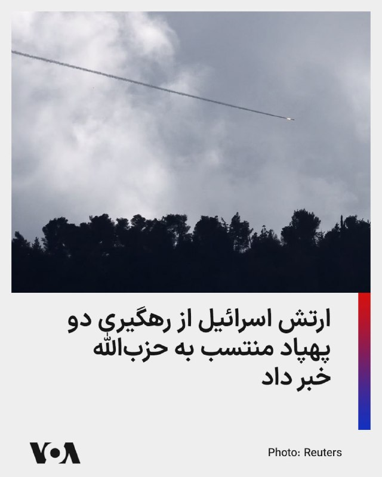

ارتش اسرائیل اعلام کرد دو پهپاد که به‌ظاهر متعلق به حزب‌الله بودند، صبح یکشنبه بر فراز مناطقی در جنوب لبنان که نیروهای اسرائیلی در آن مستقر هستند، شناسایی و رهگیری شدند.

به گزارش تایمز اسرائیل، ارتش اسرائیل گفته این دو پهپاد پیش از آنکه به نیروها یا مواضع اسرائیلی آسیب بزنند، سرنگون شده‌اند و در این دو حادثه گزارشی از زخمی شدن افراد منتشر نشده است.

این رخداد در حالی گزارش می‌شود که تنش در مرز اسرائیل و لبنان، با وجود آتش‌بس شکننده، همچنان ادامه دارد. در روزهای گذشته، ارتش اسرائیل چندین بار از حمله به مواضع حزب‌الله در جنوب لبنان خبر داده و رسانه‌های لبنانی نیز از حملات هوایی اسرائیل به چند منطقه در جنوب این کشور گزارش داده‌اند.
@FarsiVOA

## FarsiVOA — post 217320

  

وزارت کشور سوریه می‌گوید طی یک عملیات «امنیتی سریع» با مشارکت اداره مبارزه با تروریسم، وجیه علی عبدالله دستیار نظامی بشار اسد، دیکتاتور سابق سوریه را بازداشت کرده است.

حساب وزارت کشور سوریه در شبکه ایکس با اعلام این خبر گفته است سرلشکر وجیه علی عبدالله به مدت ۱۳ سال سمت مدیر دفتر امور نظامی «بشار اسدِ جنایتکار فراری» را بر عهده داشت.

این دستگیری بخشی از یک کارزار علیه مقامات نظامی و امنیتی سابق سوریه است که متهم به دست داشتن در نقض حقوق بشر، بازداشت‌های غیرقانونی، شکنجه و کشتار شهروندان در دوران بشار اسد هستند.
@FarsiVOA

## DW_Farsi — post 124512

  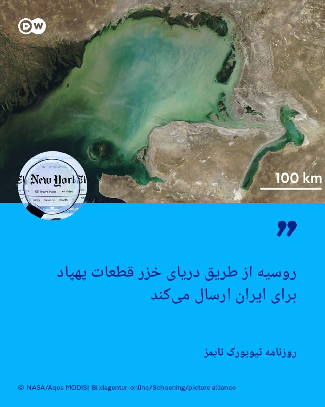

🔸نیویورک تایمز: روسیه از طریق دریای خزر قطعات پهپاد برای ایران ارسال می‌کند

روزنامه نیویورک تایمز روز شنبه نهم مه (۱۹ اردیبهشت) در گزارشی به نقل از مقامات آمریکایی نوشت که روسیه با دور زدن محاصره تنگه هرمز، از دریای خزر برای ارسال قطعات پهپاد به ایران استفاده می‌کند و از این طریق به جمهوری اسلامی برای بازسازی توان تهاجمی‌اش کمک می‌رساند.

در این گزارش آمده است که پس از محاصره دریایی بنادر جنوبی ایران توسط آمریکا، دریای خزر اکنون به یک مسیر حیاتی تجاری میان این دو متحد تبدیل شده است و روسیه در حال حاضر کالاهایی را که به‌طور سنتی از طریق تنگه هرمز منتقل می‌شدند، به بنادر حاشیه دریای خزر ارسال می‌کند.

این گزارش می‌گوید که رصد تجارت در دریای خزر از فاصله دور دشوار است و تنها پنج کشوری که با این دریا هم‌مرز هستند به آن دسترسی دارند. به نوشته نیویورک تایمز، کشتی‌هایی که به‌طور منظم در این مسیر رفت‌وآمد می‌کنند، سیستم‌های ردیابی خود را خاموش می‌کنند.
@dw_farsi

## DW_Farsi — post 124511

🔸پوتین شرودر، صدراعظم اسبق آلمان را به عنوان میانجی مطرح کرد

ولادیمیر پوتین، رئیس جمهور روسیه، گرهارد شرودر، صدراعظم اسبق آلمان، را که سال‌هاست با او دوستی نزدیکی دارد، به عنوان میانجی مورد نظر خود در جنگ میان روسیه و اوکراین مطرح کرده است.

پوتین شنبه ۹ مه پس از رژه پیروزی به مناسبت پایان جنگ جهانی دوم در مسکو، در یک کنفرانس خبری گفت که گرچه آمریکا برای میانجی‌گری تلاش کرده، اما او از میان سیاستمداران اروپایی، می‌تواند گرهارد شرودر، رهبر پیشین حزب سوسیال دموکرات آلمان، را به عنوان میانجی تصور کند.

پوتین اعلام کرد: «از میان همه سیاستمداران اروپایی، گفت‌وگو با شرودر را ترجیح می‌دهم.»

شرودر به دلیل نزدیکی‌اش به پوتین و شرکت‌های روسی، بارها هدف انتقادهای شدید قرار گرفته است. صدراعظم اسبق آلمان اواخر ژانویه گذشته، در یادداشتی برای "برلینر تسایتونگ"، تجاوز نظامی روسیه علیه اوکراین را مغایر حقوق بین‌الملل توصیف کرد، اما در عین حال افزود: «با شیطان‌سازی از روسیه به عنوان دشمنی ابدی نیز مخالفم.»

ولادیمیر پوتین در کنار انتقاد شدید از حمایت اروپا از اوکراین، تأکید کرد که برای گفت‌وگوی مستقیم با ولودیمیر زلنسکی، رئیس جمهور اوکراین، آماده است، البته به این شرط که زلنسکی به مسکو برود. زلنسکی پیش‌تر چنین سفری را رد کرده بود.

روسیه و اوکراین از دیروز شنبه ۹ ماه مه (۱۹ اردیبهشت) به ابتکار دونالد ترامپ، رئیس جمهور آمریکا، بر سر آتش‌بسی سه روزه تا ۱۱ مه، به همراه تبادل هزار اسیر جنگی از هر دو طرف، توافق کرده‌اند.

@dw_farsi

## DW_Farsi — post 124510

  

📸عکس روز: رقص کشتی‌های یدک‌کش در قلب هامبورگ

۸۳۷ سال از تأسیس بندر هامبورگ می‌گذرد و به همین مناسبت کشتی‌های یدک‌کش چنان بر فراز رودخانه "البه" می‌لغزند که گویی برای رقصی مشترک با هم قرار گذاشته‌اند. آن‌ها با هماهنگی ظریف و برازنده خود خطوطی پرشور و مواج را بر پهنه آب ترسیم می‌کنند. در پس‌زمینه این صحنه، فرهنگسرا و تالار کنسرت ‌فیلارمونی هامبورگ دیده می‌شود که همچون رهبر ارکستر بر باله یدک‌کش‌ها در این دومین شهر بزرگ آلمان نظاره می‌افکند.

@dw_farsi

## DW_Farsi — post 124509

  

🔸مریم دریسی، فعال مدنی در حکمی جدید به بیش از یک سال حبس محکوم شد

دادگاه انقلاب شیراز در حکمی تازه مریم دریسی، فعال مدنی اهل کازرون، را به یک سال و سه ماه حبس تعزیری محکوم کرد.

به گزارش سایت حقوق بشری هرانا، این حکم به اتهام "تبلیغ علیه نظام" برای مریم دریسی صادر و در حالی به وکیل او ابلاغ شده است که حداکثر مجازات قانونی این اتهام یک سال حبس است اما دادگاه با استناد به مقررات تکرار جرم، مجازات او را تشدید کرده است.

مریم دریسی اسفندماه سال گذشته با تودیع وثیقه آزاد شده بود. دادگاه کیفری کازرون ۲۴ فروردین امسال در حکمی غیابی او را به اتهام "اخلال در نظم و آسایش عمومی" به یک سال حبس و ۷۴ ضربه شلاق محکوم کرده بود.

در متن دادنامه صادر شده علیه این فعال مدنی که هرانا تصویر آن را منتشر کرده، "شعار دادن‌های هنجارشکنانه و تشویق نمودن مردم جهت دست زدن و کل کشیدن به قصد تحریک جمعیت حاضر و کنترل جمعیت در مراسم" یادبود بهنام عنایت، از جانباختگان اعتراضات دی‌ماه ۱۴۰۴، از مصادیق اتهامات مطروحه علیه این فعال مدنی عنوان شده است.

@dw_farsi

## DW_Farsi — post 124503

🔸چه کسانی از جنگ در ایران سود می‌برند؟

🔻گزارشی از آتفه چهارمحالیان

با ادامه درگیری‌های نظامی میان ایران، آمریکا و اسرائیل و هم‌زمان با تشدید بحران‌های اقتصادی و سیاسی در ایران پرسش درباره این‌که هزینه‌های جنگ بر دوش چه کسانی قرار می‌گیرد و چه بخش‌هایی از ساختار قدرت از این وضعیت سود می‌برند، به یکی از موضوعات بحث‌برانگیز اقتصاد سیاسی کشور تبدیل شده است.

مهرداد وهابی، پژوهشگر ، نویسنده و استاد اقتصاد دانشگاه سوربن شمالی فرانسه در گفت‌وگو با دویچه وله به تعدادی از پرسش‌های جاری در فضای عمومی درباره پیامدهای اقتصادی جنگ پاسخ داده است. به باور او، اقتصاد ایران پیش از جنگ نیز با تورم مزمن، شوک‌های ارزی، کاهش ارزش ریال و کسری بودجه روبه‌رو بوده، اما شرایط جنگی این بحران‌ها را تشدید کرده است.

از منظر این اقتصاددان، در حالی که بخش بزرگی از جامعه، نیروی کار و دولت رسمی ایران از پیامدهای جنگ آسیب دیده‌اند، نهادهای وابسته به بخش ولایی و سپاه پاسداران انقلاب اسلامی از افزایش قیمت نفت، تجارت موازی و تمرکز بیشتر منابع اقتصادی سود برده‌اند.

@dw_farsi

## DW_Farsi — post 124502

🔸جام ۱۹۳۰؛ گیرمو استابیله، ستاره‌ای که از صافی می‌گذشت

گیرمو استابیله (Guillermo Stabile) اگرچه از تکنیک چندان خوبى برخوردار نبود، اما از آن‌جایى که در کنار فوتبال به ورزش دو و میدانى، به ویژه دو سرعت علاقه داشت، توانست نقش مهمى در مستطیل سبز ایفا کند.

این مهاجم آرژانتینى که در دوران نوجوانى، ۱۰۰ متر را در ۱۱ ثانیه طى مى‌کرد، بازی فوتبال را در باشگاه "اِسپورتیوو مِتان" آغاز کرد. او پس از مدت کوتاهی به تیم دسته برتری، اما نه‌چندان مطرح "اوراکان بوئنوس آیرس" (Huracán Buenos Aires) در پایتخت ملحق شد.

گیرمو استابیله، ستاره تیم ملی فوتبال آرژانتین در دهه ۳۰ قرن گذشتهگیرمو استابیله، ستاره تیم ملی فوتبال آرژانتین در دهه ۳۰ قرن گذشته
گیرمو استابیله در جام جهانی ۱۹۳۰ اورگوئه خوش درخشیدعکس: Getty Images/AFP
استابیله چون بازیکن چندان تکنیکى‌اى نبود، مربیان از وجود او استفاده نمی‌کردند، تا این‌که مهاجم میانى ثابت "اوراکان" دچار مصدومیت سختى شد و استابیله این فرصت را یافت تا توانایی‌هایش در سرعت، شتاب و شوت‌هاى دقیق به نمایش بگذارد.

بازیکنان تکنیکى این باشگاه معمولا در کنار خط حرکت مى‌کردند و یاران حریف را به سمت خود مى‌کشاندند؛ به‌طورى که در خط دفاعى شکاف‌هایى پدید مى‌آمد. استابیله هم با توجه به سرعت بالایی که داشت، پاس‌هاى دریافتى از گوشه‌ها را با خونسردى و مهارت کامل به گل تبدیل مى‌کرد.

قابلیت‌های نفوذى این مهاجم آرژانتینى باعث شد که هواداران به او لقب El Filtrador بدهند: "مردى که از صافى مى‌گذرد".

@dw_farsi

## DW_Farsi — post 124496

🔸چه کسانی از جنگ در ایران سود می‌برند؟

🔻گزارشی از آتفه چهارمحالیان

با ادامه درگیری‌های نظامی میان ایران، آمریکا و اسرائیل و هم‌زمان با تشدید بحران‌های اقتصادی و سیاسی در ایران پرسش درباره این‌که هزینه‌های جنگ بر دوش چه کسانی قرار می‌گیرد و چه بخش‌هایی از ساختار قدرت از این وضعیت سود می‌برند، به یکی از موضوعات بحث‌برانگیز اقتصاد سیاسی کشور تبدیل شده است.

مهرداد وهابی، پژوهشگر ، نویسنده و استاد اقتصاد دانشگاه سوربن شمالی فرانسه در گفت‌وگو با دویچه وله به تعدادی از پرسش‌های جاری در فضای عمومی درباره پیامدهای اقتصادی جنگ پاسخ داده است. به باور او، اقتصاد ایران پیش از جنگ نیز با تورم مزمن، شوک‌های ارزی، کاهش ارزش ریال و کسری بودجه روبه‌رو بوده، اما شرایط جنگی این بحران‌ها را تشدید کرده است.

از منظر این اقتصاددان، در حالی که بخش بزرگی از جامعه، نیروی کار و دولت رسمی ایران از پیامدهای جنگ آسیب دیده‌اند، نهادهای وابسته به بخش ولایی و سپاه پاسداران انقلاب اسلامی از افزایش قیمت نفت، تجارت موازی و تمرکز بیشتر منابع اقتصادی سود برده‌اند.

@dw_farsi

## Persian_Trend_Official — post 13813

کانال رسمی پرشین ترند pinned «https://youtube.com/shorts/3Y-nec_YFoI?si=BzoGOXd-FGHyJLOw»

## Persian_Trend_Official — post 13812

https://youtube.com/shorts/3Y-nec_YFoI?si=BzoGOXd-FGHyJLOw

## Persian_Trend_Official — post 13811

  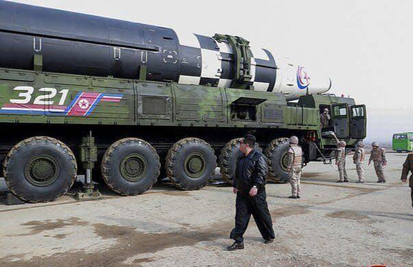

🔴 کره شمالی «حمله هسته‌ای خودکار» را وارد قانون اساسی کرد

بر اساس گزارش روزنامه «تلگراف»، کره شمالی قانون اساسی خود را به‌گونه‌ای اصلاح کرده که در صورت کشته شدن یا ناتوان شدن «کیم جونگ اون» بر اثر حمله خارجی، پاسخ هسته‌ای به‌صورت خودکار الزامی شود.

طبق این گزارش:

▪️ اگر ساختار فرماندهی نیروهای هسته‌ای کره شمالی در معرض تهدید قرار گیرد
▪️ ارتش موظف است فوراً حمله هسته‌ای تلافی‌جویانه را آغاز کند

🫆:Tony

📌 @persian_trend_official
پرشین ترند | متفاوت‌ترین کانال نظامی

## Persian_Trend_Official — post 13810

  

🔴 دقایقی پیش یک فروند جنگنده F-35 Lightning II متعلق به نیروی هوایی ایالات متحده، هنگام پرواز بر فراز دریای عمان، کد اضطراری ۷۷۰۰ را ارسال کرد.

🔹این کد نشان‌دهنده بروز وضعیت اضطراری جدی و نیاز فوری هواپیما به فرود است.

☆Phantom☆
📌 @persian_trend_official
پرشین ترند | متفاوت‌ترین کانال نظامی

## Persian_Trend_Official — post 13808

این بنده خدا نمیدونست من با ایدیش میتونم کامنتهای قبلیش رو ببینم ! 😄

حداقل برای کسی این کامنت رو بزار که ۵ ماه هرشب اتاق جنگ نداشته باشه 🤦🏻

## RadioFarda — post 157025

🔸نت‌بلاکس که میزان دسترسی به اینترنت در سراسر جهان را رصد می‌کند نوشت که روز یک‌شنبه عدم دسترسی مردم عادی در ایران به اینترنت بین‌المللی به ۷۲ روز رسیده است. 🔸ایران بیش از ۴۰ روز پیش در این زمینه به رکوردی جهانی رسید و از آن پس تنها هر روز رکورد خود را شکسته…

## RadioFarda — post 157024

  

🔸نت‌بلاکس که میزان دسترسی به اینترنت در سراسر جهان را رصد می‌کند نوشت که روز یک‌شنبه عدم دسترسی مردم عادی در ایران به اینترنت بین‌المللی به ۷۲ روز رسیده است.

🔸ایران بیش از ۴۰ روز پیش در این زمینه به رکوردی جهانی رسید و از آن پس تنها هر روز رکورد خود را شکسته است.

🔸در پی آغاز حملات گسترده آمریکا و اسرائیل به ایران،‌ مقامات جمهوری اسلامی اولین کاری که کردند این بود که دسترسی مردم به اینترنت بین‌المللی و تماس آنها با جهان خارج را قطع کردند.

🔸این در حالی است که خود در تمام این مدت با «سیم‌کارت سفید» به اینترنت بدون محدودیت دسترسی داشته‌اند. عباس عراقچی، وزیر خارجه جمهوری اسلامی،‌ در مصاحبه‌ای در پاسخ به یک سوال درباره این که چرا او و مقامات و نه مردم عادی در کشور به اینترنت دسترسی دارند ادعا کرد که وظیفه او رساندن صدای مردم به خارج از کشور است.
@RadioFarda

## RadioFarda — post 157023

  

🔸مرکز عملیات تجارت دریایی بریتانیا روز یک‌شنبه در حساب رسمی خود در شبکه ایکس از اصابت «پرتابه‌ای ناشناس» به یک کشتی فله‌بر در نزدیکی ساحل قطر خبر داد.

🔸به گفته این مرکز، این رخداد باعث بروز «حریقی مختصر» در کشتی شده که خاموش شده و مجروحی نیز برجا نگذاشته است.

@RadioFarda

## RadioFarda — post 157022

]]

## RadioFarda — post 157021

  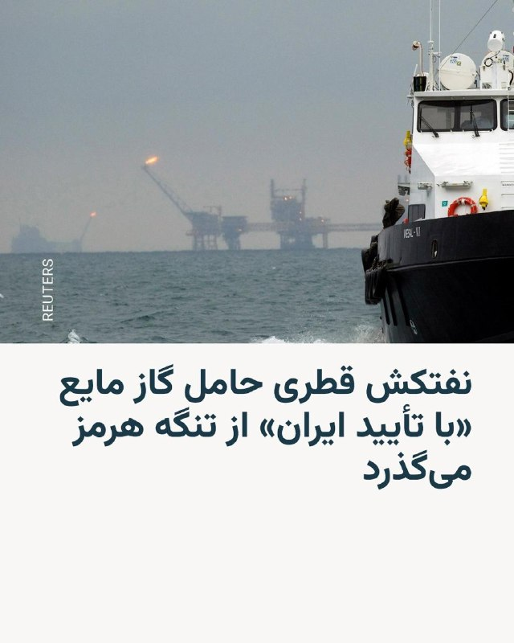

🔸وزیر خارجه آمریکا روز شنبه در حالی با نخست وزیر قطر در میامی در فلوریدا دیدار داشت که یک نفتکش قطری حامل گاز مایع در راه پاکستان از تنگه هرمز می‌گذشت.

🔸بر اساس اطلاعات کشتی‌رانی در خلیج فارس که خبرگزاری رویترز شنبه شب گزارش کرد، این نفتکش حامل گاز طبیعی مایع روز شنبه به مقصد پاکستان در حال گذر از تنگه هرمز بود.

🔸این خبرگزاری به نقل از منابعی نوشته است که گذر این نفتکش «با تأیید» جمهوری اسلامی صورت می‌گیرد، اقدامی برای اعتمادسازی با دو کشور قطر و پاکستان که هر دو در جنگ آمریکا و اسرائیل با ایران نقش میانجی را ایفا کرده‌اند.

🔸از زمان آغاز جنگ، این نخستین باری خواهد بود که یک نفتکش قطری می‌تواند برای انتقال سوخت از تنگه هرمز بگذرد.

🔸همزمان، بر اساس بیانیه‌ای که وزارت خارجه آمریکا روز شنبه منتشر کرد، مارکو روبیو در دیدار با محمد بن عبدالرحمن آل ثانی، نخست وزیر قطر، درباره نیاز به ادامه همکاری دو کشور «برای رفع تهدیدها و ارتقای ثبات و امنیت در خاورمیانه» گفت‌وگو کرده است.

🔸در این بیانیه به طور مستقیم به ایران اشاره‌ای نشده است.

@RadioFarda

## BBCPersian — post 280644

  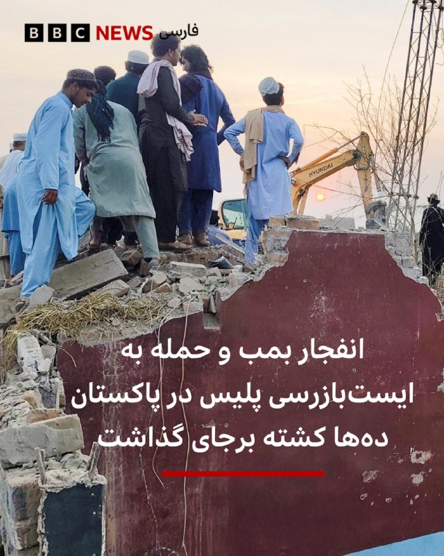

‌ ‌ ‌
گزارش‌ها از شمال غربی پاکستان حاکی از آن است که شبه‌نظامیان مسلح یک خودروی بمب‌گذاری شده را در یک ایست بازرسی پلیس منفجر کردند.

پس از انفجار این خودرو، شبه‌نظامیان سپس به سمت ماموران پلیس آتش گشودند که در این حمله حداقل دوازده نفر کشته و و چندین نفر دیگر زخمی شدند.

پلیس پاکستان گفته که یک بمب‌گذار انتحاری خودرویی مملو از مواد منفجره را به ایست بازرسی در منطقه بنو کوبید و پس از آن چندین نیروی مسلح وارد ایست بازرسی کنار جاده‌ای شده و شروع به تیراندازی کردند.

طبق گزارش‌ها، برخی از ماموران پلیس‌ هم هنگام رسیدن به محل حادثه برای کمک، در کمین افتاده و درگیری مسلحانه کشته می‌شوند.

اسلام‌آباد می‌گوید که کابل به شبه‌نظامیانی که از خاک افغانستان برای توطئه و حملات در پاکستان استفاده می‌کنند، پناه داده است.

طالبان این اتهامات را رد کرده است.

📷 Reuters
@BBCPersian

## BBCPersian — post 280643

🔻 به شرکت‌های داروسازی و تجهیزاتی هلال‌احمر «۱/۵ همت» خسارت وارد شده است

رئیس سازمان تدارک پزشکی جمعیت هلال احمر می‌گوید که به شرکت‌های داروسازی و تجهیزاتی هلال احمر ایران در جنگ اخیر «۱/۵ همت» خسارت وارد شده است.

به گفته محمدرضا شانه‌ساز، «شرکت داروسازی و شرکت تجهیزات پزشکی هلال احمر در موج حملات آسیب دیدند زیرا برخی کانون‌های انفجار بسیار به این مراکز نزدیک بود.»

رئیس سازمان تدارک پزشکی جمعیت هلال احمر همچنین گفت: «قسمت‌های آزمایشگاه، سالن تولید و بخش‌های دیگر در این شرکت‌ها آسیب دید به‌طوریکه دو روز شرکت ما از مدار تولید خارج شد.»

او گفت که این شرکت‌ها در جنگ ۱۲ روزه هم هدف قرار گرفته بودند.

https://bbc.in/4wbrmXc
@BBCPersian

## BBCPersian — post 280642

🔻 فارس: کشتی‌ای که در سواحل قطر هدف قرار گرفت متعلق به آمریکا بود

خبرگزاری فارس به نقل از «یک منبع آگاه» نوشت کشتی فله‌بری که در نزدیکی سواحل قطر هدف قرار گرفت متعلق به ایالات متحده آمریکاست و «با پرچم آمریکا» تردد می‌کرد.

شبکه خبر ایران هم به نقل از منابع آگاه گفت کشتی باری که هدف قرار گرفت با پرچم آمریکا حرکت می‌کرد و متعلق به آمریکاست.

آمریکا اظهار نظری نکرده است.

اداره عملیات تجارت دریایی بریتانیا ساعاتی پیش گزارش کرده بود یک کشتی در فاصله ۴۳ کیلومتری شمال شرقی دوحه، پایتخت قطر، هدف «پرتابه ناشناس» قرار گرفته و آتش‌سوزی کوچکی در آن ایجاد شده است.

https://bbc.in/4d6jA8c
@BBCPersian

## BBCPersian — post 280641

🔻 ارتش اسرائیل: یک پرتابه را در جنوب لبنان رهگیری کردیم

ارتش اسرائیل می‌گوید که یک پرتابه «مشکوک» را در منطقه‌ حضور نیروهایش در جنوب لبنان شناسایی و رهگیری کرده است.

ارتش اسرائیل همچنین گفت که در دو روز گذشته بیش از ۴۰ نقطه زیرساختی حزب‌الله را در جنوب لبنان هدف قرار داده است.

این ارتش در شبکه اجتماعی ایکس نوشت که نیروهایش ۱۰ عضو حزب‌الله را در جنوب لبنان کشته‌اند و انبارهای سلاح و یک پرتابگر را هدف گرفته‌اند.

مقامات لبنانی می‌گویند که در حملات دیروز اسرائیل دست‌کم ۲۴ نفر کشته شده‌اند.

https://bbc.in/42qfNOo
@BBCPersian

## BBCPersian — post 280640

🔻 ارتش ایران: کشورهایی که از تحریم‌های آمریکا تبعیت کنند، برای عبور از تنگه هرمز مشکل خواهند داشت

به گفته سخنگوی ارتش ایران، «از این پس کشورهایی که از آمریکا در اعمال تحریم علیه جمهوری اسلامی ایران تبعیت کنند، حتما در عبور از تنگه هرمز با مشکل مواجه می‌شوند.»

به گزارش خبرگزاری دولتی ایرنا، محمد اکرمی‌نیا گفت: «آمریکایی‌ها هرگز قادر نخواهند بود این گستره وسیع در شمال اقیانوس هند را با پوشش ناوگان خود به یک محاصره واقعی تبدیل کنند.»

او همچنین گفت: «بدون شک، هدف از ادعای 'اعمال محاصره' تلاشی برای خنثی‌سازی مدیریت جمهوری اسلامی ایران بر تنگه هرمز از طریق اقدامات تبلیغاتی بوده است» و «تجارت دریایی ما همچنان به سهولت در جریان است؛ تنها تعداد معدودی کشتی توقیف شده‌اند که در مقابل، ما نیز توانسته‌ایم مانع تردد و فعالیت کشتی‌های رژیم صهیونیستی شویم و آنها را توقیف کنیم.»

https://bbc.in/42V76vA
@BBCPersian

## BBCPersian — post 280639

🔻 کشته شدن دو شهروند سوریه در حمله پهپادی اسرائیل به لبنان

خبرگزاری ملی لبنان گزارش کرد که در حمله پهپادی نیروهای اسرائیلی به یک موتورسیکلت در جاده اصلی بین القلیله و دیر قانون، دو سوری کشته شده‌اند.

بنابر این گزارش، «تیم‌های دفاع مدنی با هماهنگی ارتش لبنان در حال تلاش برای جابه‌جایی اجساد هستند.»

اسرائیل به شهرهای شقرا و صفد البطیخ هم حمله هوایی کرده و خانه‌ها را در روستاها و شهرهای خط مقدم، به‌ویژه در شهر بنت جبیل و شهر طیری تخریب کرده است.

به گفته خبرگزاری ملی لبنان، اسرائیل در سپیده دم به شهر صریفا حمله هوایی کرده‌ است.

https://bbc.in/4wiuYGS
@BBCPersian

## BBCPersian — post 280638

دادستانی تهران علیه عباس عبدی و صادق زیباکلام اعلام جرم کرد. به گزارش میزان، خبرگزاری قوه قضائیه، دلیل این اعلام جرم یادداشت هفته گذشته عباس عبدی در روزنامه اعتماد و مصاحبه صادق زیباکلام با خبرگزاری آنا بوده است. دادستانی تهران گفته که برای هر دو رسانه هم…

## BBCPersian — post 280637

  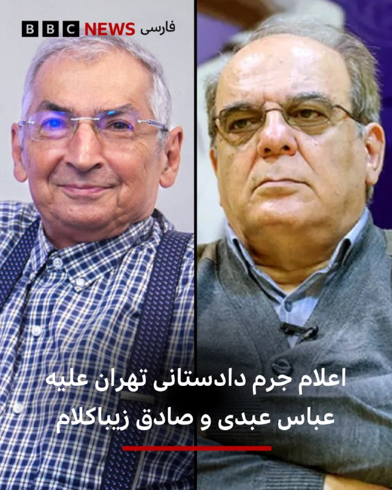

دادستانی تهران علیه عباس عبدی و صادق زیباکلام اعلام جرم کرد.

به گزارش میزان، خبرگزاری قوه قضائیه، دلیل این اعلام جرم یادداشت هفته گذشته عباس عبدی در روزنامه اعتماد و مصاحبه صادق زیباکلام با خبرگزاری آنا بوده است.

دادستانی تهران گفته که برای هر دو رسانه هم «اعلام جرم کرده تا پرونده آنها مورد رسیدگی قرار بگیرد.»

عباس عبدی، روزنامه‌نگار و فعال سیاسی، در یادداشت خود در روزنامه اعتماد نوشته بود که «یکی دیگر از کارهای تندروهای طرفدار جنگ بی‌پایان، ایفای نقش سخنگویی از طرف رهبری است» که «بدون اطلاع دقیق از میدان و وضع کشور در پی ادامه جنگ هستند و برای سیاستگذاران جریان‌سازی می‌کنند ... بدتر اینکه اکثریت مردم هم با تصمیماتی که یک اقلیت رانتی از کف خیابان تحمیل کنند همدلی نخواهند داشت.»

📷 Fararu/Khabaronline
@BBCPersian

## Dirty_Kids — post 389205

تتوی جدید ریحانا از نقاشی بچش
داداش خب یه شیش ماه صبر میکردی شاید تو نقاشی پیشرفت میکرد

@Dirty_Kids 👻

## Dirty_Kids — post 389204

  <a href="telegram/content/Dirty_Kids_389204_1778404006.mp4">🎬 Download video</a>

شکار سربازان و تجهیزات ارتش روسیه با کمک #پهپاد_انتحاری 🇺🇦🇷🇺

@Dirty_Kids 👻

## Hranews — post 112857

  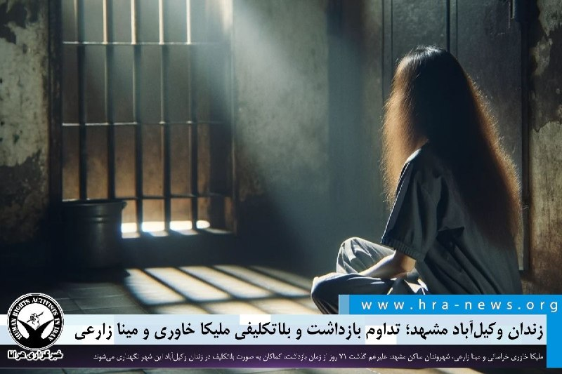

زندان وکیل‌آباد مشهد؛ تداوم بازداشت و بلاتکلیفی ملیکا خاوری و مینا زارعی

❗️
❗️
❗️
❗️
❗️ – ملیکا خاوری خراسانی و مینا زارعی، شهروندان ساکن مشهد، علیرغم گذشت ۷۱ روز از زمان بازداشت، کماکان به صورت بلاتکلیف در زندان وکیل‌آباد این شهر نگهداری می‌شوند.

به گزارش خبرگزاری هرانا، ارگان خبری مجموعه فعالان حقوق بشر در ایران، ملیکا خاوری خراسانی و مینا زارعی، کماکان در بازداشت به سر می‌برند.

یک منبع مطلع نزدیک به خانواده این شهروندان، ضمن تایید این خبر به هرانا گفت: «ملیکا خاوری خراسانی و مینا زارعی، به صورت جداگانه در تاریخ ۱۰ اسفند ۱۴۰۴ توسط نیروهای امنیتی بازداشت شدند. با گذشت زمان، این شهروندان کماکان به صورت بلاتکلیف در قرنطینه زندان وکیل‌آباد مشهد نگهداری می‌شوند.»

ادامه مطلب

#ملیکا_خاوری_خراسانی
#مینا_زارعی

↘️
@hranews_bot تماس ✉️ -  @Hranews  کانال هرانا 🆑

## Hranews — post 112856

  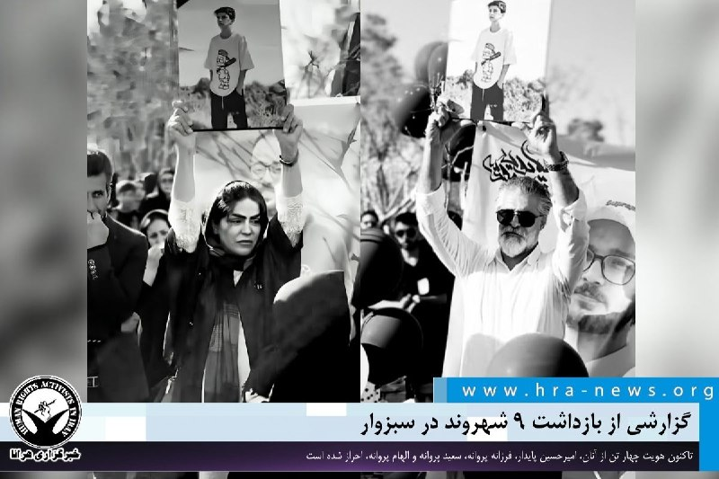

گزارشی از بازداشت ۹ شهروند در سبزوار

❗️
❗️
❗️
❗️
❗️ – در روزهای اخیر، ۹ شهروند در سبزوار توسط نیروهای امنیتی #بازداشت و به زندان تربت‌حیدریه منتقل شدند. تاکنون هویت چهار تن از آنان، امیرحسین پایدار، فرزانه پروانه، سعید پروانه و الهام پروانه، از اعضای خانواده ابوالفضل پایدار، از جان‌باختگان اعتراضات دی‌ماه ۱۴۰۴، احراز شده است.

به گزارش خبرگزاری هرانا، ارگان خبری مجموعه فعالان حقوق بشر در ایران، روز سه شنبه ۱۵ اردیبهشت ۱۴۰۵، دست‌کم ۹ شهروند توسط نیروهای امنیتی در سبزوار بازداشت و به زندان تربت‌حیدریه منتقل شدند.

بر اساس اطلاعات دریافتی هرانا، بازداشت این شهروندان در پی اقدام به برگزاری مراسم تولد ابوالفضل پایدار، یکی از جان‌باختگان اعتراضات دی‌ماه ۱۴۰۴، صورت گرفته است. تاکنون هویت چهار تن از بازداشت‌شدگان که از اعضای خانواده ابوالفضل پایدار هستند، به نام‌های امیرحسین پایدار، فرزانه پروانه، سعید پروانه و الهام پروانه، احراز شده است.

ادامه مطلب

#امیرحسین_پایدار
#فرزانه_پروانه
#سعید_پروانه
#الهام_پروانه

↘️
@hranews_bot تماس ✉️ -  @Hranews  کانال هرانا 🆑

## Hranews — post 112855

  

نت‌بلاکس، که محدودیت دسترسی به #اینترنت در جهان را رصد می‌کند، اعلام کرد که قطع اینترنت در ایران وارد هفتادودومین روز خود شده است. این نهاد با اشاره به تداوم محدودیت‌ها پس از ۱۷۰۴ ساعت، اعلام کرد که دسترسی کاربران ایرانی به اینترنت جهانی همچنان در وضعیت «تقریبا متوقف» قرار دارد و نشانه‌ای از بازگشت گسترده اینترنت بین‌المللی مشاهده نمی‌شود.

↘️
@hranews_bot تماس ✉️ -  @Hranews  کانال هرانا 🆑

## Hranews — post 112854

دادستان تهران علیه عباس عبدی، صادق زیباکلام و دو رسانه اعلام جرم کرد

❗️
❗️
❗️
❗️
❗️ – مرکز رسانه قوه قضاییه از #اعلام_جرم دادستان تهران علیه عباس عبدی و صادق زیباکلام خبر داد. همچنین دو رسانه منتشرکننده اظهارات این افراد نیز با گشایش پرونده قضایی مواجه شده‌اند.

ادامه مطلب

#عباس_عبدی
#صادق_زیباکلام

↘️
@hranews_bot تماس ✉️ -  @Hranews  کانال هرانا 🆑

## configx2ray — post 38710

  <a href="https://t.me/ConfigX2ray/38710">📎 Download file</a>

کانفیگ برای Npv tunnel ⭕️

به هیچ وج دانلود نزنید باهاش
❤️

رمز فایل : @ConfigX2ray

Channel : https://t.me/ConfigX2ray

## configx2ray — post 38709

  <a href="telegram/content/configx2ray_38709_1778404008.jpg">🎬 Download video</a>

vless://f3ef1255-1807-45d5-8872-324c6943175b@iman.neticoapp.ir:80/?type=ws&encryption=none&flow=&host=srv3.diamond-tech.online&path=%2F#https://t.me/ConfigX2ray

ترکیبی با سایفون وصله 
✅

آموزش استفادع : 
👇
https://t.me/ConfigX2ray0/1665

Channel : https://t.me/ConfigX2ray

## manototv — post 105227

  

وزارت خارجه قطر اعلام کرد شیخ محمد بن عبدالرحمن بن جاسم آل ثانی، نخست‌وزیر و وزیر خارجه این کشور، در میامی با مارکو روبیو، وزیر خارجه آمریکا، و استیو ویتکاف، فرستاده آمریکا در امور خاورمیانه، دیدار کرده است.

به گزارش خبرگزاری رسمی قطر، در این دیدار روابط راهبردی دو کشور، به‌ویژه در حوزه‌های دفاع و انرژی، تحولات منطقه و تلاش‌های میانجی‌گرانه برای کاهش تنش‌ها بررسی شد.

وب‌سایت اکسیوس نیز گزارش داد این دیدار بخشی از تلاش‌ها برای دستیابی به توافقی برای پایان دادن به جنگ در ایران بوده است.

## manototv — post 105226

  

نت‌بلاکس اعلام کرد قطعی گسترده اینترنت در ایران پس از ۱۷۰۴ ساعت همچنان ادامه دارد و این محدودیت بی‌سابقه اکنون وارد سومین ماه خود شده است؛ در حالی که مقام‌های جمهوری اسلامی همچنان دسترسی عمومی به اینترنت بین‌المللی را برای مردم داخل ایران محدود نگه داشته‌اند.

## manototv — post 105225

  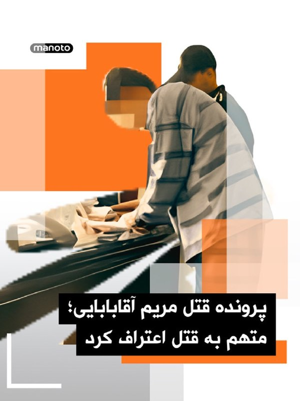

قتل «مریم آقابابایی» دختر ۳۰ ساله اهل شهرکرد که پس از سوار شدن به یک تاکسی اینترنتی ناپدید شده بود، واکنش‌های گسترده‌ای در پی داشته است.

بر اساس گزارش رسانه‌های ایران، جسد سوخته مریم چند روز بعد توسط یک چوپان در اطراف شهرکرد پیدا شد. پلیس اعلام کرده متهم اصلی پرونده بازداشت شده و در بازجویی‌های اولیه به قتل اعتراف کرده است.

خانواده مریم می‌گویند انگیزه قتل هنوز به‌طور دقیق مشخص نیست. برخی گزارش‌های محلی از احتمال تعرض خبر داده‌اند، اما متهم تاکنون انگیزه را «سرقت طلا» عنوان کرده است.

همزمان، تجمع‌هایی در شهرکرد برای مطالبه عدالت و امنیت زنان برگزار شده است. پرونده همچنان در مرحله تحقیقات قرار دارد.

## manototv — post 105224

  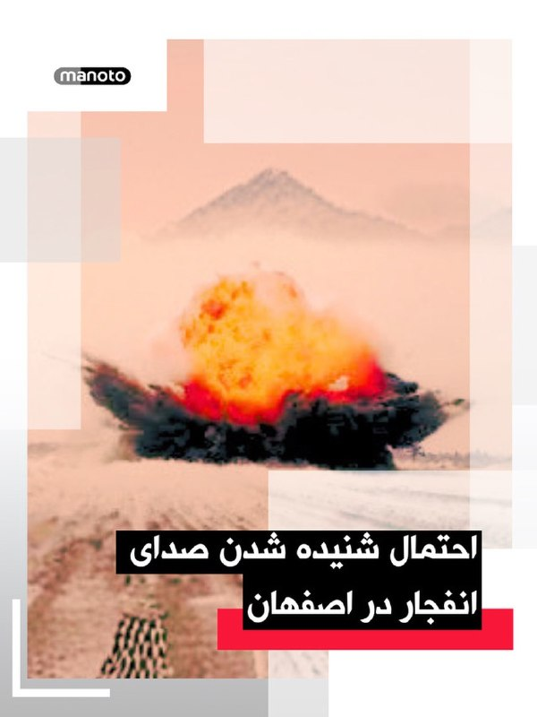

رسانه‌های حکومتی در ایران از احتمال شنیده شدن صدای «انفجارهای کنترل‌شده» در اصفهان خبر دادند

بر اساس اطلاعیه منتشرشده در رسانه‌های نزدیک به حکومت، از جمله خبرگزاری فارس و رسانه‌های وابسته به سپاه، احتمال شنیده شدن صدای انفجار از ساعت ۹ تا ۱۵ امروز در برخی مناطق اصفهان وجود دارد.

در این اطلاعیه آمده که انفجارها در مناطق اقارب‌پرست، حکیم نظامی و بلوار کشاورز انجام می‌شود و «جای هیچ‌گونه نگرانی برای شهروندان نیست.»

در روزهای اخیر نیز رسانه‌های حکومتی چندین بار خبرهایی مشابه درباره «انفجارهای کنترل‌شده» در اصفهان و شهرهای دیگر منتشر کرده‌اند. روابط عمومی سپاه حضرت صاحب‌الزمان استان اصفهان در اطلاعیه‌های قبلی، مسئولیت انتشار این هشدارها را برعهده گرفته بود.

## alonews — post 119018

  <a href="telegram/content/alonews_119018_1778404010.jpg">🎬 Download video</a>

👈غضنفری،‌ نماینده مجلس: از شیخ‌های مفت خور عرب بیشتر عوارض میگیریم

✅ @AloNews خبر جنگ

## alonews — post 119017

  <a href="telegram/content/alonews_119017_1778404010.jpg">🎬 Download video</a>

👈پزشکیان: اگر سخنی از گفت‌وگو یا مذاکره مطرح می‌شود، معنای آن تسلیم یا عقب‌نشینی نیست، بلکه هدف، احقاق حقوق ملت ایران و دفاع مقتدرانه از منافع ملی است

✅ @AloNews خبر جنگ

## alonews — post 119016

  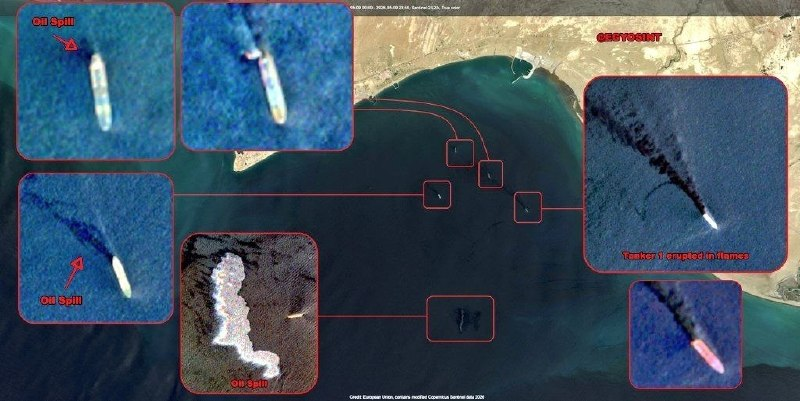

👈تصویر ماهواره ای از چهار نفتکش ایرانی که اخیرا مورد هدف قرار گرفته اند.

✅ @AloNews خبر جنگ

## alonews — post 119015

  <a href="telegram/content/alonews_119015_1778404011.jpg">🎬 Download video</a>

👈 نخست‌وزیر و وزیر امور خارجه قطر با وزیر امور خارجه آمریکا، روبیو، و فرستاده خاورمیانه ویتکاف در میامی دیدار کردند تا درباره شراکت استراتژیک، وضعیت منطقه‌ای و تلاش‌های میانجیگری پاکستان برای کاهش تنش‌ها گفتگو کنند، طبق اعلام وزارت امور خارجه قطر. نخست‌وزیر بر ضرورت پاسخگویی همه طرف‌ها به تلاش‌های میانجیگری تأکید کرد.

✅ @AloNews خبر جنگ

## alonews — post 119014

  <a href="telegram/content/alonews_119014_1778404011.jpg">🎬 Download video</a>

👈سی‌ان‌ان: ترامپ با وجود تغییر شرایط جنگ با ایران، همچنان همان روایت‌های قبلی درباره پایان نزدیک جنگ و تمایل تهران به توافق را تکرار می‌کند

✅ @AloNews خبر جنگ

## alonews — post 119013

  <a href="telegram/content/alonews_119013_1778404011.jpg">🎬 Download video</a>

👈الجزیره: عبور اولین نفتکش قطر از تنگه هرمز از زمان آغاز جنگ

🔴داده‌های دریانوردی نشان می‌دهد که نفتکش گاز «الخریطیات»، بندر راس لفان قطر را ترک کرده و قرار است محموله خود را در بندر قاسم در پاکستان تخلیه کند.

✅ @AloNews خبر جنگ

## alonews — post 119012

  <a href="telegram/content/alonews_119012_1778404011.jpg">🎬 Download video</a>

👈فرمانده نیروی دریایی ارتش: زیردریایی‌های ما در آب‌های تنگه هرمز دست به ماشه هستند

✅ @AloNews خبر جنگ

## alonews — post 119011

  <a href="telegram/content/alonews_119011_1778404011.jpg">🎬 Download video</a>

👈تلگراف: کره شمالی قانون اساسی خود را تغییر داده است تا حمله هسته‌ای خودکار را در صورت کشته شدن یا ناتوان شدن کیم جونگ اون توسط حمله خارجی الزامی کند.

🔴بر اساس قانون اصلاح‌شده، اگر فرماندهی نیروهای هسته‌ای کره شمالی تهدید شود، ارتش باید فوراً حمله هسته‌ای تلافی‌جویانه را آغاز کند.

✅ @AloNews خبر جنگ

## alonews — post 119010

  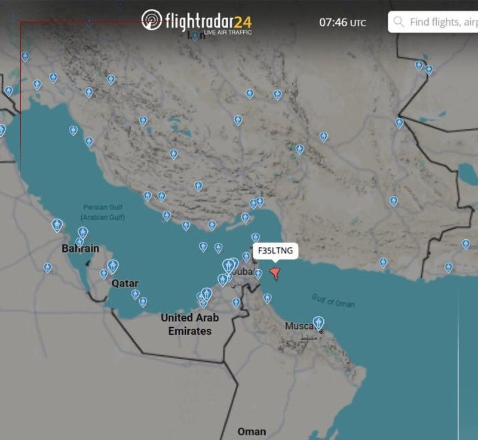

👈دقایقی پیش یک فروند جنگنده  F-35 Lightning II نیروی هوایی ایالات متحده آمریکا هنگام پرواز بر فراز دریای عمان کد اضطراری ۷۷۰۰ را مخابره کرد.

🔴 ارسال این کد به معنای وجود یک وضعیت اضطراری و فوری است که نیاز به فرود دارد.

✅ @AloNews خبر جنگ

## alonews — post 119009

  <a href="telegram/content/alonews_119009_1778404012.jpg">🎬 Download video</a>

👈وزارت خارجه قطر: وزیر خارجه قطر با روبیو و ویتکاف دیدار کرد

🔴وزارت خارجه قطر اعلام کرد که شیخ محمد بن عبدالرحمن بن جاسم آل ثانی ، در میامی با مارکو روبیو، وزیر خارجه آمریکا، و استیو ویتکاف، فرستاده آمریکا در امور خاورمیانه، دیدار کرده است.

🔴وزارت خارجه قطر در بیانیه‌ای افزود که در این دیدار، مشارکت راهبردی بین دو کشور، همچنین وضعیت منطقه و میانجیگری قطر برای کاهش تنش‌ها مورد بحث و بررسی قرار گرفته است.

🔴این وزارت‌خانه اشاره کرد که نخست‌وزیر قطر در جریان این دیدار با روبیو و ویتکاف بر ضرورت پاسخگویی همه طرف‌ها به تلاش‌های میانجیگرانه تأکید کرده است.

✅ @AloNews خبر جنگ

## alonews — post 119008

  <a href="telegram/content/alonews_119008_1778404012.jpg">🎬 Download video</a>

👈رئیس اتحادیه کسب‌وکارهای اینترنتی: درآمد برخی فعالان شبکه‌های اجتماعی به نزدیک صفر رسیده است

✅ @AloNews خبر جنگ

## alonews — post 119007

  <a href="telegram/content/alonews_119007_1778404012.jpg">🎬 Download video</a>

👈یدیعوت آحارونوت: پهپادهای هدایت‌شونده با فیبر نوری حزب‌الله به منبع نگرانی ارتش اسرائیل تبدیل شده‌اند

🔴ارتش اسرائیل از بالگردها، هواپیماها و سامانه گنبد آهنین برای مقابله با این پهپادها استفاده می‌کند ، اما این ابزارها بی‌اثر هستند.

🔴 بسیاری از شرکت‌ها راه‌حل‌های نوآورانه‌ای ارائه می‌دهند، اما در این مرحله، «این پهپادهای ساده و فیبر نوری، هوشمندتر از همه راه‌حل‌های دیگر هستند.»

✅ @AloNews خبر جنگ

## alonews — post 119006

  <a href="telegram/content/alonews_119006_1778404012.jpg">🎬 Download video</a>

👈بیاتی نماینده مجلس: در اولین جلسه مجلس خروج از NPT را بررسی می‌کنیم.

🔴تنگه هرمز برگ برنده ماست آمریکا می‌خواهد آن را از ما را بگیرد.

🔴به هیچ وجه و در چارچوب هیچ مذاکره ای ایران غنی سازی را صفر و اورانیوم غنی شده را به آمریکا نمی دهد.

🔴مدیریت تنگه هرمز را راها نمی کنیم

✅ @AloNews خبر جنگ

## alonews — post 119005

  <a href="telegram/content/alonews_119005_1778404013.jpg">🎬 Download video</a>

👈فایننشال تایمز : آلمان تلاش‌های خودشو برای خرید موشک‌های "تاماهاوک" از آمریکا، از سر گرفته

✅ @AloNews خبر جنگ

## alonews — post 119004

  

امروز May10؛ روز جهانی مادره.

مادرها روزتون مبارک❤️

[@AloTweet]

## alonews — post 119003

  <a href="telegram/content/alonews_119003_1778404013.jpg">🎬 Download video</a>

👈مرکز عملیات دریایی انگلیس گزارش کرد که «یک کشتی فله‌بر در نزدیکی قطر مورد اصابت یک پرتابه ناشناس قرار گرفته است» 
✅ @AloNews خبر جنگ

## alonews — post 119002

  <a href="telegram/content/alonews_119002_1778404013.mp4">🎬 Download video</a>

👈زیرگرفتن هواداران فوتبال در ترکیه

🔴شب گذشته فردی با خودروی شخصی تماشاگران تیم فوتبال گالاتاسرای را هنگام جشن قهرمانی زیرگرفت.

🔴طبق گزارش رسانهٔ ترکیه،درپی این اتفاق ۵ نفر مصدوم شد‌ند؛ فردی که تماشاگران را زیرگرفت نیز از محل حادثه فرار کرد.

✅ @AloNews خبر جنگ

## alonews — post 119001

  

فیلترشکن پرسرعت😊

مناسب برای همه اوپراتورها🛜🛜🛜🛜🛜

کانفیگ 🔐🔐🔐🔐

همراه با لینک ساب✔️
بدون ضریب✔️

قیمت هر یک گیگ 200 🛍
سه گیگ 600 🔥
شش گیگ 1200 😎
جهت خرید پیام بدید👀

@sstp_off

کانال جهت اعتماد👇

https://t.me/sstp_off1

## alonews — post 119000

  <a href="telegram/content/alonews_119000_1778404015.jpg">🎬 Download video</a>

👈جی دی ونس : اگه نظرم رو در مورد جنگ ایران بگم بهتون، به زندان می افتم!

✅ @AloNews خبر جنگ

## alonews — post 118999

  <a href="telegram/content/alonews_118999_1778404015.jpg">🎬 Download video</a>

👈احتمال شنیده شدن صدای انفجار کنترل شده از ساعت ۹ تا ۱۵ امروز در شهر اصفهان وجود دارد.

✅ @AloNews خبر جنگ

<!-- MSG END -->
<!-- NAV START -->
[صفحه قبل](telegram/content/archive_1.md)
<!-- NAV END -->
