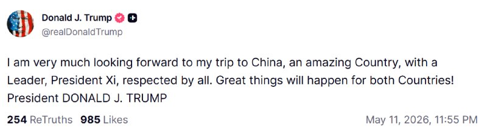
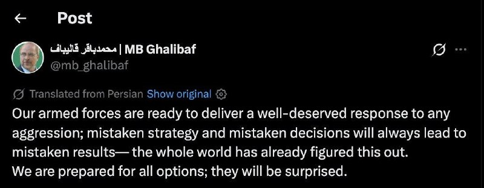
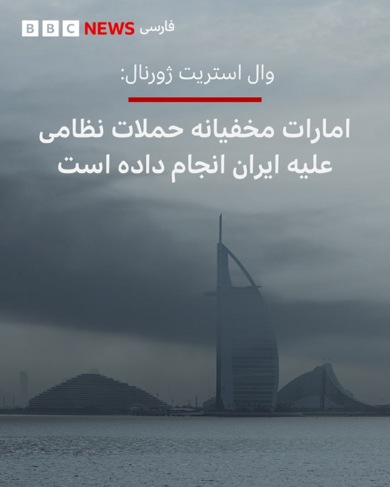

# خواننده تلگرام

<!-- MSG START -->

---
📅 بروزرسانی: 1405/02/22 01:43
---

## VahidOOnLine — post 239594

  

♦️دونالد ترامپ روز دوشنبه، ۲۱ اردیبهشت‌ماه، با انتشار پیامی در شبکه اجتماعی «تروث سوشال»، در آستانه سفر به پکن، با ابراز خرسندی نوشت: «بسیار مشتاق سفرم به چین هستم. کشوری شگفت‌انگیز با رهبری همچون رئیس‌جمهور شی که مورد احترام همگان است.» رئیس‌جمهوری ایالات متحده در ادامه پیام خود با خوش‌بینی نسبت به نتایج این دیدار تاکید کرد که «اتفاقات بزرگی برای هر دو کشور رقم خواهد خورد.» ترامپ قرار است از ۲۳ تا ۲۵ اردیبهشت‌ماه به پکن سفر کند.
‌🇸🇦 Indypersian

🤖 @VahidOOnLine

## VahidOOnLine — post 239593

  <a href="telegram/content/VahidOOnLine_239593_1778537596.mp4">🎬 Download video</a>

روزنامه وال‌استریت ژورنال به نقل از منابع آگاه گزارش داد امارات متحده عربی به‌طور مخفیانه حملاتی نظامی علیه جمهوری اسلامی انجام داده و به یکی از طرف‌های مستقیم جنگ تبدیل شده است.

بر اساس این گزارش، یکی از این حملات در ماه آوریل پالایشگاه نفتی لاوان در خلیج فارس را هدف قرار داده؛ حمله‌ای که همزمان با اعلام آتش‌بس از سوی دونالد ترامپ رخ داده و باعث آتش‌سوزی گسترده و از کار افتادن بخش بزرگی از ظرفیت پالایشگاه برای چند ماه شده است.

به نوشته وال‌استریت ژورنال، جمهوری اسلامی در آن زمان اعلام کرده بود پالایشگاه در «حمله دشمن» هدف قرار گرفته و در واکنش، موجی از حملات موشکی و پهپادی علیه امارات و کویت انجام داده است.

این گزارش می‌گوید آمریکا از حمله امارات ناراضی نبوده و به‌طور غیرعلنی از مشارکت کشورهای خلیج فارس در جنگ علیه جمهوری اسلامی استقبال کرده است.

وزارت خارجه امارات از اظهار نظر مستقیم درباره این حملات خودداری کرده، اما به بیانیه‌های پیشین خود درباره «حق پاسخ، از جمله پاسخ نظامی، به اقدامات خصمانه» اشاره کرده است.

وال‌استریت ژورنال همچنین گزارش داد جمهوری اسلامی بیش از ۲۸۰۰ موشک و پهپاد به سمت امارات شلیک کرده؛ حملاتی که به بخش‌های هوایی، گردشگری و بازار املاک این کشور آسیب زده است.

در این گزارش آمده امارات پس از آغاز جنگ، همکاری نظامی خود با آمریکا را حفظ کرده و همزمان اقداماتی علیه منافع مالی جمهوری اسلامی، از جمله محدودیت برای شهروندان ایرانی و تعطیلی مراکز مرتبط با تهران در دبی، انجام داده است.
‌🏁 🇬🇧 ManotoTV

🤖 @VahidOOnLine

## VahidOOnLine — post 239592

  

♦️به گزارش خبرگزاری فرانسه، ایالات متحده در آستانه سفر دونالد ترامپ، رئیس جمهوری آمریکا به پکن، تحریم‌های جدیدی را علیه ۱۲ فرد و نهاد مرتبط با شبکه فروش و جابجایی نفت ایران به چین اعمال کرد. وزارت خزانه‌داری آمریکا روز دوشنبه در بیانیه‌ای اعلام کرد که این افراد و شرکت‌ها نقش کلیدی در تسهیل تجارت نفتی تهران ایفا کرده‌اند. واشنگتن تاکید کرد که سپاه پاسداران برای پنهان کردن نقش خود در معاملات نفتی و هدایت درآمدهای حاصل از آن به سمت رژیم ایران، به طور گسترده از شرکت‌های صوری در حوزه‌های قضایی با نظارت اقتصادی ضعیف استفاده می‌کند.
در فهرست جدید تحریم‌ها، نام چندین فرد مستقر در ایران و شرکت‌هایی در امارات متحده عربی و هنگ‌کنگ به چشم می‌خورد که متهم به همکاری با نیروی قدس سپاه پاسداران هستند. این اقدام که درست چند روز پیش از دیدارهای دیپلماتیک سطح بالای ترامپ در چین نهایی شده، نشان‌دهنده عزم واشنگتن برای مسدود کردن مسیرهای دور زدن تحریم‌ها و خشکاندن منابع مالی تهران در بازارهای شرق آسیا است. بر اساس این تحریم‌ها، کلیه دارایی‌های این نهادها در آمریکا مسدود و هرگونه مراوده مالی با آن‌ها با جریمه‌های سنگین مواجه خواهد شد.
‌🇸🇦 Indypersian

🤖 @VahidOOnLine

## VahidOOnLine — post 239591

  

شاهزاده رضا پهلوی در شبکه اجتماعی ایکس نوشت که جمهوری اسلامی ۴۷ سال است علیه آمریکا و متحدانش جنگ به راه انداخته، و تاکید کرد: «امروز این رژیم از همیشه ضعیف‌تر است و مردم ایران آماده‌اند تا آن را سرنگون کنند.»
او نوشت که اتخاذ سیاستی درست در این لحظه، می‌تواند قرن آینده را تغییر دهد.

‌🏁 🇬🇧 IranintlTV

🤖 @VahidOOnLine

## VahidOOnLine — post 239590

  

♦️محمدباقر قالیباف، رئیس مجلس شورای اسلامی، روز دوشنبه با انتشار پیامی در اکس، بر ضرورت پذیرش شروط تهران تاکید کرد و نوشت: «هیچ جایگزینی جز پذیرش حقوق ملت ایران، آن‌گونه که در پیشنهاد ۱۴ ماده‌ای آمده است، وجود ندارد.» او با هشدار نسبت به بی‌نتیجه بودن رویکردهای جایگزین مدعی شد که هر مسیر دیگری «کاملا بی‌سرانجام خواهد بود و چیزی جز شکست‌های پی‌درپی به همراه نخواهد داشت.» قالیباف همچنین خطاب به مقامات آمریکایی خاطرنشان کرد که «هرچه بیشتر در این امر تعلل کنند، مالیات‌دهندگان آمریکایی هزینه بیشتری برای آن پرداخت خواهند کرد.»
‌🇸🇦 Indypersian

🤖 @VahidOOnLine

## VahidOOnLine — post 239589

  

♦️روزنامه اطلاعات در یادداشتی با اشاره به ادامه جنگ، تحریم‌ها و محدودیت‌های دولت، از مردم خواست در مصرف منابعی مانند آب، برق، سوخت و مواد غذایی صرفه‌جویی کنند.
این روزنامه با انتقاد از برخی رفتارهای مصرفی نوشت در شرایطی که حمل‌ونقل عمومی در دسترس است، استفاده از خودروهای تک‌سرنشین یا «دور دور»های تفریحی ضرورتی ندارد و به افزایش مصرف سوخت دامن می‌زند.
اطلاعات همچنین به موضوع مصرف مواد غذایی پرداخت و تاکید کرد مصرف بیش از اندازه اقلامی مانند برنج و گندم، در کنار الگوهای تغذیه ناسالم، می‌تواند به بروز بیماری‌ها، کاهش طول عمر و افزایش هزینه‌های درمانی منجر شود.
‌🇸🇦 Indypersian

🤖 @VahidOOnLine

## VahidOOnLine — post 239588

  <a href="telegram/content/VahidOOnLine_239588_1778537601.mp4">🎬 Download video</a>

‌
محمدباقر قالیباف، رئیس مجلس شورای اسلامی، در پیامی به زبان انگلیسی در شبکه اکس نوشت «هیچ» جایگزینی جز پذیرش «طرح ۱۴ ماده‌ای» وجود ندارد.

قالیباف افزود:
«هر رویکرد دیگری کاملاً بی‌نتیجه خواهد بود و چیزی جز شکست‌های پی‌درپی به همراه نخواهد داشت. هرچه بیشتر وقت‌کشی کنند، هزینه بیشتری بر دوش مالیات‌دهندگان آمریکایی گذاشته خواهد شد.»
‌🏁 🇬🇧 ManotoTV

🤖 @VahidOOnLine

## VahidOOnLine — post 239587

  <a href="telegram/content/VahidOOnLine_239587_1778537601.mp4">🎬 Download video</a>

تماسی از چنارشاهیجان کازرون:
از جاویدنامان علیرضا نادری، عارف براتی، فرزانه ساسانی‌پور، بهبود حسن‌زاده، جبار پناهی و آنیسا هوشنگی گفت…
‌🏁 🇬🇧 ManotoTV

🤖 @VahidOOnLine

## VahidOOnLine — post 239586

  

♦️«سی‌بی‌اس» روز دوشنبه، ۲۱ اردیبهشت‌ماه، گزارش داد که پاکستان برخلاف نقش خود به عنوان میانجی دیپلماتیک میان تهران و واشنگتن، به طور مخفیانه اجازه داده است هواپیماهای نظامی ایران در پایگاه‌های هوایی این کشور مستقر شوند تا از حملات هوایی آمریکا در امان بمانند. بر اساس گزارش منابع آگاه در دولت ایالات متحده، تنها چند روز پس از اعلام آتش‌بس موقت توسط دونالد ترامپ، رئیس جمهوری آمریکا، در اوایل آوریل، چندین فروند هواپیما از جمله یک هواپیمای شناسایی و جاسوسی مدل «آر-۱۳۰» (RC-130) نیروی هوایی ایران در پایگاه هوایی «نورخان» پاکستان، واقع در نزدیکی شهر راولپندی، دیده شده‌اند. هم‌زمان گزارش‌هایی از اعزام هواپیماهای غیرنظامی ایران به افغانستان نیز منتشر شده است که به نظر می‌رسد بخشی از تلاش گسترده تهران برای حفاظت از دارایی‌های هوانوردی و نظامی باقی‌مانده خود در میانه درگیری‌های اخیر باشد.
همزمان، مقامات ارشد پاکستان این ادعاها را به شدت رد کرده‌اند. یک مقام عالی‌رتبه پاکستانی در گفتگو با «سی‌بی‌اس نیوز» تاکید کرد که پایگاه هوایی نورخان در قلب شهر واقع شده و استقرار ناوگان بزرگی از هواپیماهای خارجی در چنین مکانی غیرممکن است که از دید عموم پنهان بماند. با این حال، تحلیلگران آمریکایی بر این باورند که این جابه‌جایی‌های استراتژیک نشان‌دهنده تلاش رژیم ایران برای بهره‌گیری از روابط منطقه‌ای جهت کاهش آسیب‌پذیری ناوگان هوایی خود در برابر فشارهای نظامی و محاصره اعمال شده توسط واشنگتن است.
‌🇸🇦 Indypersian

🤖 @VahidOOnLine

## mwarmonitor — post 8935

🔴تحلیل اختصاصی کانال: دیپلماسی در لبه پرتگاه؛ استراتژی «تأدیب» یا «تغییر رژیم»؟

📝گزارش اخیر «باراک راوید» از وضعیت کنونی روابط ایران و آمریکا، نشان‌دهنده عبور از مرحله «چانه‌زنی سخت» و ورود به فاز «رویارویی کنترل‌شده» است. در ادامه، ابعاد مختلف این بن‌بست سیاسی تحلیل می‌شود:

۱. کالبدشکافی استراتژی ترامپ: «نقشه ساده» برای معامله‌ای پیچیده
ترامپ در سخنان خود از مفهومی به نام «بهترین نقشه تاریخ» یاد می‌کند که در ظاهر ساده است (ایران نباید سلاح هسته‌ای داشته باشد)، اما در باطن بر پایه تخریب کامل اهرم‌های قدرت طرف مقابل بنا شده است.

تاکتیک گوش‌مالی (Adjustment): استفاده از عبارت «کمی آن‌ها را تنظیم خواهد کرد» نشان می‌دهد که ترامپ به دنبال جنگ کلاسیک و اشغال‌گرایانه نیست؛ بلکه به دنبال حملات جراحی‌گونه (Surgical Strikes) برای تحمیل اراده سیاسی است.

تشدید دوقطبی داخلی ایران: ادعای ترامپ مبنی بر تقسیم رهبری ایران به «میانه‎‌روها و دیوانگان»، یک جنگ روانی هدفمند برای ایجاد گسل در ساختار تصمیم‌گیری تهران در لحظات بحرانی است.

۲. بن‌بست هسته‌ای؛ خط قرمزهای متقاطع
شکاف اصلی در مذاکرات روز یکشنبه، بر سر «خروج ذخایر اورانیوم» بوده است.
موضع ایران: تهران با غیرقابل مذاکره خواندن غنی‌سازی، به دنبال حفظ «آستانه هسته‌ای» به عنوان تنها کارت بازی باقی‌مانده است.
موضع ترامپ: او معتقد است ایرانِ بدون توان نظامی (طبق ادعای او)، حق داشتنِ اهرم هسته‌ای را ندارد. تعبیر «آتش‌بس در کما»، سیگنال واضحی است که آمریکا دیگر «زمان» را به عنوان یک فاکتور دیپلماتیک به رسمیت نمی‌شناسد.

۳. گزینه‌های نظامی روی میز: از «پروژه آزادی» تا «تأسیسات زیربنایی»
در صورت شکست کامل دیپلماسی پس از سفر ترامپ به چین، سه سناریوی نظامی محتمل است:
محاصره دریایی و تنگه هرمز: ازسرگیری «پروژه آزادی» به معنای به چالش کشیدن حاکمیت دریایی ایران و قطع شریان‌های باقی‌مانده اقتصادی است.
تکمیل بانک اهداف: اشاره به ۲۵ درصد باقی‌مانده از اهداف شناسایی شده، نشان‌دهنده آمادگی پنتاگون برای هدف قرار دادن زیرساخت‌های حیاتی (انرژی و مخابرات) است.
سناریوی خطرناک اسرائیل: عملیات نیروهای ویژه برای تصرف ذخایر اورانیوم، اگرچه از نظر ترامپ «پرخطر» توصیف شده، اما وجود آن در لیست بررسی، نشان‌دهنده سطح بی‌سابقه تنش است.

۴. متغیر چین؛ میانجی‌گری یا چراغ سبز؟
سفر ترامپ به چین نقطه عطف این بحران است. ترامپ به دنبال آن است که با استفاده از نفوذ اقتصادی چین بر ایران، تهران را به پذیرش شروط خود وادار کند.

🔵 اگر شی‌جین‌پینگ نتواند ایران را به عقب‌نشینی متقاعد کند، ترامپ احتمالاً از این «شکستِ دیپلماتیک» به عنوان مجوزی برای اقدام نظامی استفاده خواهد کرد تا به افکار عمومی نشان دهد «تمامی راه‌های غیرنظامی» را طی کرده است.

📌 پارادوکس «تاج مآبانه»
لحن ترامپ (استفاده از استعاره‌های پزشکی و تجاری) نشان می‌دهد که او با بحران ایران مانند یک «دارایی ورشکسته» در تجارت املاک برخورد می‌کند. او معتقد است ایران در ضعیف‌ترین موضع تاریخی خود قرار دارد و به همین دلیل، تمایلی به دادن امتیاز کوچک هم ندارد.

🔴ما اکنون در وضعیت «انتظار فعال» هستیم. بازه زمانی بازگشت ترامپ از چین (آخر هفته میلادی)، بحرانی‌ترین زمان برای تعیین تکلیف صلح یا جنگ خواهد بود. ایران میان دو گزینه «پذیرش خلع سلاح غنی‌سازی» (که آن را تسلیم می‌نامد) و «تحمل موج جدید حملات نظامی»، با سخت‌ترین تصمیم دهه اخیر خود روبروست.

☑️ تأکید ترامپ بر کشته شدن ۴۲,۰۰۰ نفر در اعتراضات، نشان‌دهنده آن است که او قصد دارد هرگونه اقدام نظامی احتمالی را تحت پوشش «حمایت از مردم» و «مسائل حقوق بشری» مشروعیت‌بخشی کند.

@mwarmonitor

## mwarmonitor — post 8934

  

✈️📡 هواپیمای RC-135V Rivet Joint هواپیمای شناسایی و شنود الکترونیکی (جمع‌آوری اطلاعات سیگنالی و ارتباطی).(شماره 64-14848 از پایگاه سودا بی یونان) بر فراز عربستان سعودی مشاهده شد؛ در حال بازگشت از خلیج فارس. (تداخل شدید GPS در منطقه میان ریاض، امارات متحده…

## mwarmonitor — post 8933

  <a href="telegram/content/mwarmonitor_8933_1778537606.mp4">🎬 Download video</a>

📝 این انگل‌های وارداتی حشدالشعبی که معلوم نیست چطور فارسی‌نفهمیده برای خامنه‌ای زجه می‌زنند، در واقع آینه دقِ آن حرامزاده‌های ارتشی و بزدلانِ پادگان‌نشینی هستند که شرفشان را با جیره و مواجب معامله کرده‌اند. خاک بر سر آن نظامیانی که دیروز مدعی بودند یک گردان کشته دادند تا کسی به ناموس ایران نگاه چپ نکند، اما حالا مثل هرزه‌های ترسو در سوراخ‌های خود خزیده‌اند و فرشِ زیر پای وحوشِ بیگانه شده‌اند. شما نه پاسدار مرز، که نگهبان ذلت و تماشاگرِ حقارتِ ملت هستید؛ بی‌رگ‌هایی که در ازای یک لقمه نانِ آغشته به خون، عزت و خاک وطن را به این گله‌های وارداتی واگذار کردید.

@mwarmonitor

## iaghapour — post 2599

سلام خواستم یه نکته کوچولو بگم
فقط بحث کسب و کارهای کوچیک نبود
فقط بحث آنلاین شاپ ها نبود
ماهایی که ۴ سال تو دیجیتال مارکتینگ بودیم توی طراحی سایت و سئو و اتوماسیون کار میکردیم هم کاملا ورشکست شدیم
نه از ۹ اسفند
ما یه بار جنگ خرداد زمین خوردیم تا اومدیم بلند شیم از جامون و داشتیم اوکی میشدیم دلار دی ماه سر به فلک کشید و بعد یه قطعی دیگه داشتیم که خیلی ها بهانه کردن و پول ندادن آخر دی ما هیچی پروژه نداشتیم حتی بهترین کارفرماها اومدن گفتن کار شما خیلی خوبه ولی ما واقعا پول پرسنل رو هم به زور میدیم نمیرسه به سئو
بهمن اومدیم خودمون رو جمع کنیم تیر آخر رو اول اسفند بهمون زدن
دفترمون رو تحویل دادیم
نیروهامونو از بهمن تعدیل کرده بودیم
و الان چه جوون ها و چه پدرانی که بیکار شدن
منی که تمام تخصصم همیناست
یک متخصص بیکار محسوب میشم.

©️ پیام ارسالی از کاربر shafikhany

## DEJradio — post 4574

  

👑
📱 شاهزاده رضا پهلوی در نخستین دقایق بامداد سه‌شنبه،در پیامی در شبکهٔ اکس اعلام کردند جمهوری اسلامی طی ۴۷سال گذشته علیه آمریکا و متحدانش جنگ به راه انداخته است. ایشان با اشاره به تضعیف بی‌سابقهٔ رژیم،تأکید کردند مردم ایران آماده‌اند جمهوری اسلامی را سرنگون کنند. شاهزاده رضا پهلوی همچنین نوشتند اتخاذ سیاستی درست در این مقطع حساس،می‌تواند قرن آینده را تغییر دهد. ایشان افزودند که قرار است روز سه‌شنبه در «نشست امنیتی پولیتیکو» دربارهٔ این موضوع گفت‌وگو کنند.

#شاهزاده_رضا_پهلوی
@DEJradio

## kianmeli1 — post 87354

  <a href="https://t.me/kianmeli1/87354">📎 Download file</a>

https://t.me/kianmeli1

## IranIntlTV — post 336714

  <a href="https://t.me/IranintlTV/336714">📎 Download file</a>

🎧نسخه صوتی «برنامه با کامبیز حسینی»؛ دارو؛ کالایی لوکس در میانهٔ فروپاشی معیشت در ایران
@iranintlTV

## IranIntlTV — post 336713

  <a href="telegram/content/IranIntlTV_336713_1778537611.mp4">🎬 Download video</a>

میلاد محمدی، برادر شهریار محمدی، جان‌باخته اعتراضات سراسری ۱۴۰۱ ایران، با انتشار ویدیویی در اینستاگرام از هم‌پیمان شدن جمعی از مادران دادخواه کردستان خبر داد.
او در شرح این ویدیو نوشته است: «ما مادران دادخواه، مادران کردستان، مادران «ژن، ژیان، ئازادی» هنوز با جای خالی فرزندانمان نفس می‌کشیم. ما را با سکوت آشنا کردند، اما درد به ما صدا داد. مادر بودن فقط زندگی بخشیدن نیست؛ گاهی یعنی ایستادن بر زخم و ادامه دادن.»
او در پایان، روز مادر را به همه مادران دادخواه و داغدار تبریک گفت.
@iranintltv

## IranIntlTV — post 336712

  <a href="telegram/content/IranIntlTV_336712_1778537612.mp4">🎬 Download video</a>

مراد ویسی، تحلیل‌گر ارشد ایران‌اینترنشنال، گفت: «با رسیدن مذاکرات جمهوری اسلامی و آمریکا به بن‌بست، موقعیت اسرائیل که طرفدار ازسرگیری حملات نظامی است تقویت شده چون اسرائیل از ابتدا معتقد بود مذاکره و توافق با جمهوری اسلامی نتیجه‌ای ندارد. حالا که ترامپ پیشنهاد جمهوری اسلامی را غیرقابل قبول می‌داند، دست اسرائیل برای ترغیب واشینگتن به بازگشت به گزینه نظامی بازتر شده است.»
@iranintltv

## IranIntlTV — post 336711

  

شاهزاده رضا پهلوی در شبکه اجتماعی ایکس نوشت که جمهوری اسلامی ۴۷ سال است علیه آمریکا و متحدانش جنگ به راه انداخته، و تاکید کرد: «امروز این رژیم از همیشه ضعیف‌تر است و مردم ایران آماده‌اند تا آن را سرنگون کنند.»
او نوشت که اتخاذ سیاستی درست در این لحظه، می‌تواند قرن آینده را تغییر دهد.

https://iranintl.com/202605117455

## IranIntlTV — post 336710

  <a href="telegram/content/IranIntlTV_336710_1778537615.mp4">🎬 Download video</a>

مراد ویسی، تحلیل‌گر ارشد ایران‌اینترنشنال، گفت: «در حالی که عربستان با ظرفیت تولید ۱۲ میلیون بشکه نفت در روز و صادرات هفت میلیون بشکه در روز حتی در شرایط جنگی، در اوج قدرت نفتی است، در جمهوری اسلامی ایران تولید و صادرات نفت به شدت افت کرده و تامین بنزین داخلی هم به وضعیت بحرانی رسیده است. ایران و عربستان دو کشوری که روزی غول‌های نفتی منطقه بودند، حالا دو سرنوشت نفتی متفاوت یافته‌اند.»
@iranintltv

## Shin_Persian — post 5961

↩️ Quoted tweet: Shin ✓ @hey_itsmyturn Sun, 10 May 2026 21:01:49 UTC Another night with jet activity over Baghdad #Iraq 🇮🇶 ↩️ توییت نقل‌قول شده — برای پاسخ، پست زیر را ببینید. فارسی شبی دیگر با فعالیت جنگنده‌ها بر فراز بغداد #Iraq 🇮🇶 𝕏 · @shin_persian

## Shin_Persian — post 5960

↩️ Quoted tweet:
Shin ✓ @hey_itsmyturn
Sun, 10 May 2026 21:01:49 UTC

Another night with jet activity over Baghdad #Iraq 🇮🇶

↩️ توییت نقل‌قول شده — برای پاسخ، پست زیر را ببینید.

فارسی

شبی دیگر با فعالیت جنگنده‌ها بر فراز بغداد #Iraq 🇮🇶

𝕏 · @shin_persian

## ManotoTV — post 105326

  <a href="telegram/content/ManotoTV_105326_1778537617.mp4">🎬 Download video</a>

روزنامه وال‌استریت ژورنال به نقل از منابع آگاه گزارش داد امارات متحده عربی به‌طور مخفیانه حملاتی نظامی علیه جمهوری اسلامی انجام داده و به یکی از طرف‌های مستقیم جنگ تبدیل شده است.

بر اساس این گزارش، یکی از این حملات در ماه آوریل پالایشگاه نفتی لاوان در خلیج فارس را هدف قرار داده؛ حمله‌ای که همزمان با اعلام آتش‌بس از سوی دونالد ترامپ رخ داده و باعث آتش‌سوزی گسترده و از کار افتادن بخش بزرگی از ظرفیت پالایشگاه برای چند ماه شده است.

به نوشته وال‌استریت ژورنال، جمهوری اسلامی در آن زمان اعلام کرده بود پالایشگاه در «حمله دشمن» هدف قرار گرفته و در واکنش، موجی از حملات موشکی و پهپادی علیه امارات و کویت انجام داده است.

این گزارش می‌گوید آمریکا از حمله امارات ناراضی نبوده و به‌طور غیرعلنی از مشارکت کشورهای خلیج فارس در جنگ علیه جمهوری اسلامی استقبال کرده است.

وزارت خارجه امارات از اظهار نظر مستقیم درباره این حملات خودداری کرده، اما به بیانیه‌های پیشین خود درباره «حق پاسخ، از جمله پاسخ نظامی، به اقدامات خصمانه» اشاره کرده است.

وال‌استریت ژورنال همچنین گزارش داد جمهوری اسلامی بیش از ۲۸۰۰ موشک و پهپاد به سمت امارات شلیک کرده؛ حملاتی که به بخش‌های هوایی، گردشگری و بازار املاک این کشور آسیب زده است.

در این گزارش آمده امارات پس از آغاز جنگ، همکاری نظامی خود با آمریکا را حفظ کرده و همزمان اقداماتی علیه منافع مالی جمهوری اسلامی، از جمله محدودیت برای شهروندان ایرانی و تعطیلی مراکز مرتبط با تهران در دبی، انجام داده است.

## ManotoTV — post 105325

  <a href="telegram/content/ManotoTV_105325_1778537619.mp4">🎬 Download video</a>

‌
محمدباقر قالیباف، رئیس مجلس شورای اسلامی، در پیامی به زبان انگلیسی در شبکه اکس نوشت «هیچ» جایگزینی جز پذیرش «طرح ۱۴ ماده‌ای» وجود ندارد.

قالیباف افزود:
«هر رویکرد دیگری کاملاً بی‌نتیجه خواهد بود و چیزی جز شکست‌های پی‌درپی به همراه نخواهد داشت. هرچه بیشتر وقت‌کشی کنند، هزینه بیشتری بر دوش مالیات‌دهندگان آمریکایی گذاشته خواهد شد.»

## ManotoTV — post 105324

  <a href="telegram/content/ManotoTV_105324_1778537620.mp4">🎬 Download video</a>

تماسی از چنارشاهیجان کازرون:
از جاویدنامان علیرضا نادری، عارف براتی، فرزانه ساسانی‌پور، بهبود حسن‌زاده، جبار پناهی و آنیسا هوشنگی گفت…

## FarsiVOA — post 217487

  <a href="telegram/content/FarsiVOA_217487_1778537622.mp4">🎬 Download video</a>

⚡️بحران برق در ایران و نگرانی‌ها درباره آینده صادرات انرژی به افغانستان
@FarsiVOA

## FarsiVOA — post 217486

⚡️پوشش ویژه | پرزیدنت ترامپ میزبان قهرمانان ملی فوتبال آمریکایی
@FarsiVOA

## FarsiVOA — post 217485

⚡️دونالد ترامپ: پاسخ حکومت ایران به پیشنهاد صلح ایالات متحده را «پیشنهادی احمقانه» است
@FarsiVOA

## FarsiVOA — post 217484

🔺وزارت خزانه‌داری آمریکا به بانک‌ها دستور داد شبکه‌های مشکوک پول‌شویی مرتبط با رژیم ایران را شناسایی و گزارش کنند

▪️وزارت خزانه‌داری آمریکا روز دوشنبه ۲۱ اردیبهشت از بانک‌ها و دیگر مؤسسات مالی این کشور خواست شبکه‌های احتمالی پولشویی مرتبط با جمهوری اسلامی ایران را که از منابع مالی خود برای قاچاق نفت تحریم‌شده از طریق شرکت‌های پوششی و شبکه‌های رمزارزی استفاده می‌کنند، شناسایی کرده و گزارش کنند.

⬇️ بیشتر بخوانید:
https://ir.voanews.com/a/treasury-banking-monitoring-money-laundering-iran/8148885.html
@FarsiVOA

## IranianMinds — post 19979

  

🔴 ترامپ :

من خیلی منتظر سفرم به چین هستم، یک کشور فوق‌العاده، با رهبری، رئیس‌جمهور شی، که مورد احترام همه است.

کارهای بزرگی برای هر دو کشور رخ خواهد داد!

@IranianMinds

## IranianMinds — post 19978

🔴 کی‌ر استارمر، نخست وزیر بریتانیا : می‌دونم مردم و حتی کشور ازم ناراضی شدن

ولی قصد ندارم استفعا بدم و می‌خوام ثابت کنم که منتقدها اشتباه میکنن

@IranianMinds

## IranianMinds — post 19977

  

🔴 قالیباف:

نیروهای مسلح ما آماده‌اند تا پاسخ شایسته‌ای به هرگونه تجاوز بدهند؛ استراتژی اشتباه و تصمیمات نادرست همیشه به نتایج اشتباه منجر می‌شوند — کل جهان قبلاً این را فهمیده است.

ما برای همه گزینه‌ها آماده‌ایم؛ آن‌ها غافلگیر خواهند شد.

@IranianMinds

## IranianMinds — post 19976

🔴وال‌استریت‌ژورنال:

حمله ماه پیش به جزیره لاوان ایران، کار امارات بوده است.

@IranianMinds

## BBCPersian — post 280793

  

🔻به گزارش نشریه آمریکایی وال استريت ژورنال، امارات متحده عربی به‌طور مخفيانه حملات نظامی عليه ايران انجام داده است؛ موضوعی که به گفته منابع آگاه به این نشریه، می تواند امارات را به يکی از طرف‌های فعال مخاصمه با ایران مطرح کند.

منابع آگاه به وال استریت ژورنال گفته‌اند حملاتی که امارات تاکنون به‌صورت علنی تاييد نکرده، شامل حمله به يک پالايشگاه در جزيره لاوان در خليج فارس بوده است.

در اوايل آوريل گذشته و هم‌زمان با اعلام آتش‌بس از سوی دونالد ترامپ چند حمله هوایی به تاسیسات نفتی ایران در جزایر این کشور و اصطلاحا مناطق فلات قاره شرکت ملی نفت ایران صورت گرفت که باعث آتش‌سوزی گسترده و خروج بخش بزرگی از ظرفيت پالايشگاه لاوان از مدار برای چندين ماه شد.

ايران در آن زمان اعلام کرده بود اين پالايشگاه در يک «حمله دشمن» هدف قرار گرفته و در پاسخ، موجی از حملات موشکی و پهپادی عليه امارات و کويت انجام داده است.

📸AFP via Getty Images
https://bbc.in/4tyiBDX
@BBCPersian

## BBCPersian — post 280792

🔻رئیس سازمان انرژی اتمی: غنی‌سازی قابل مذاکره نیست

محمد اسلامی، رئیس سازمان انرژی اتمی ایران در نشست کمیسیون امنیت ملی مجلس با اشاره به این که «فناوری هسته‌ای در دستور کار مذاکرات قرار ندارد» گفت که برنامه غنی‌سازی ایران «قابل مذاکره نیست.»

آقای اسلامی گفت که «تمهیدات لازم» برای حفاظت از مراکز و دارایی‌های هسته‌ای ایران انجام شده است.

دونالد ترامپ عصر امروز درباره ذخیره اورانیوم غنی‌شده ایران گفته بود: «ایران به من گفت که می‌خواهد گردوغبار هسته‌ای را به ما بدهند. اما باید خودتان آن را خارج کنید.»

https://bbc.in/4nlrNud
@BBCPersian

## Dirty_Kids — post 389287

  

ظاهراً عمو «لینسی گراهام»، این رفیق گرمابه و گلستان ترامپ شیر خدا قراره دهن کشور نیوخایه‌مال پاکستان رو در این مقطع بگاد

طبق توئیت خبرنگار بلومبرگ، در دوران آتش‌بس روافض هزارپدر چند فروند از هواپیماهای نظامی‌شون رو از جمله یک فروند RC-130 که مدلی پیشرفته از هواپیمای هرکولس C-130 برای عملیات‌های شناسایی و جمع‌آوری اطلاعاته رو به پایگاه هوایی نورخان پاکستان قرمساق فرستاده و اونجا پارک کرده [ظاهراً تعدادی رو هم به افغانستان فرستاده]

عمو «لینسی گراهام» در توئیتی نظرش در خصوص این کسکلک‌بازی پاکستانی‌ها رو این‌طور بیان کرده:

«اگه این گزارش‌ها صحت داشته باشه، نقش پاکستان قرمدنگ به عنوان میانجی‌گر بین شیعه‌سانان رافضی، آمریکا و سایر طرف‌ها باید به طور کامل مورد بازنگری قرار بگیره. [این کسکشای نیوخایه‌مال هم از توبره دارن می‌خورن هم از آخور]

با توجه به مواضع تندی که برخی مقامات دفاعی قرمساق پاکستانی علیه اسرائیل اتخاذ کرده بودن، اگه این خبر واقعیت داشته باشه [دهنشون گاییده‌ست] و خیلی شوکه نمی‌شم [از این بی‌شرفای جاکش‌پدر].»

@Dirty_Kids 👻

## manototv — post 105326

  <a href="telegram/content/manototv_105326_1778537626.mp4">🎬 Download video</a>

روزنامه وال‌استریت ژورنال به نقل از منابع آگاه گزارش داد امارات متحده عربی به‌طور مخفیانه حملاتی نظامی علیه جمهوری اسلامی انجام داده و به یکی از طرف‌های مستقیم جنگ تبدیل شده است.

بر اساس این گزارش، یکی از این حملات در ماه آوریل پالایشگاه نفتی لاوان در خلیج فارس را هدف قرار داده؛ حمله‌ای که همزمان با اعلام آتش‌بس از سوی دونالد ترامپ رخ داده و باعث آتش‌سوزی گسترده و از کار افتادن بخش بزرگی از ظرفیت پالایشگاه برای چند ماه شده است.

به نوشته وال‌استریت ژورنال، جمهوری اسلامی در آن زمان اعلام کرده بود پالایشگاه در «حمله دشمن» هدف قرار گرفته و در واکنش، موجی از حملات موشکی و پهپادی علیه امارات و کویت انجام داده است.

این گزارش می‌گوید آمریکا از حمله امارات ناراضی نبوده و به‌طور غیرعلنی از مشارکت کشورهای خلیج فارس در جنگ علیه جمهوری اسلامی استقبال کرده است.

وزارت خارجه امارات از اظهار نظر مستقیم درباره این حملات خودداری کرده، اما به بیانیه‌های پیشین خود درباره «حق پاسخ، از جمله پاسخ نظامی، به اقدامات خصمانه» اشاره کرده است.

وال‌استریت ژورنال همچنین گزارش داد جمهوری اسلامی بیش از ۲۸۰۰ موشک و پهپاد به سمت امارات شلیک کرده؛ حملاتی که به بخش‌های هوایی، گردشگری و بازار املاک این کشور آسیب زده است.

در این گزارش آمده امارات پس از آغاز جنگ، همکاری نظامی خود با آمریکا را حفظ کرده و همزمان اقداماتی علیه منافع مالی جمهوری اسلامی، از جمله محدودیت برای شهروندان ایرانی و تعطیلی مراکز مرتبط با تهران در دبی، انجام داده است.

## manototv — post 105325

  <a href="telegram/content/manototv_105325_1778537628.mp4">🎬 Download video</a>

‌
محمدباقر قالیباف، رئیس مجلس شورای اسلامی، در پیامی به زبان انگلیسی در شبکه اکس نوشت «هیچ» جایگزینی جز پذیرش «طرح ۱۴ ماده‌ای» وجود ندارد.

قالیباف افزود:
«هر رویکرد دیگری کاملاً بی‌نتیجه خواهد بود و چیزی جز شکست‌های پی‌درپی به همراه نخواهد داشت. هرچه بیشتر وقت‌کشی کنند، هزینه بیشتری بر دوش مالیات‌دهندگان آمریکایی گذاشته خواهد شد.»

## manototv — post 105324

  <a href="telegram/content/manototv_105324_1778537628.mp4">🎬 Download video</a>

تماسی از چنارشاهیجان کازرون:
از جاویدنامان علیرضا نادری، عارف براتی، فرزانه ساسانی‌پور، بهبود حسن‌زاده، جبار پناهی و آنیسا هوشنگی گفت…

## alonews — post 119401

  <a href="telegram/content/alonews_119401_1778537631.mp4">🎬 Download video</a>

👈حرکت جنگنده های سنگین امشب بر فراز بغداد پایتخت عراق مشاهده شد

✅ @AloNews خبر جنگ

## alonews — post 119400

  

👈کیر استارمر: استعفا نمیدم

✅ @AloNews خبر جنگ

## alonews — post 119399

  <a href="telegram/content/alonews_119399_1778537632.jpg">🎬 Download video</a>

👈وال استریت ژورنال:
در پی حمله امارات به لاوان ایران پس از اعلام آتش بس ترامپ و تهران، ایران با حملات موشکی و پهپادی به امارات و کویت پاسخ داد.

🔴ایالات متحده از این حملات امارات ناراحت نشده و به‌طور خصوصی از مشارکت امارات و دیگر کشورهای حوزه خلیج فارس که مایل به پیوستن به نبرد هستند، استقبال کرده است.

✅ @AloNews خبر جنگ

## alonews — post 119398

  

👈شیخ منصور، معاون رئیس امارات: ایرانی ها در حد امارات متحده عربی نیستند و بهتر است اراده ما را محک نزنند زیرا ما خود آتش هستیم

🔴آنها باید جزایر ما را پس دهند

✅ @AloNews خبر جنگ

## alonews — post 119397

  <a href="telegram/content/alonews_119397_1778537633.mp4">🎬 Download video</a>

👈یک روحانی در صداوسیما:
امام علی شوهر زنی را کشت اما چون مهربان بود با زن بیوه دوست شد با او به خونه‌‌اش رفت، بعد شام هم با بچه‌های زن بیوه بازی کرد هم با خود زن بیوه

🔴پ.ن: سوال اینجاست که این روحانی چطور از تمام جزئیات هم خبر دارد؟ مشخص است فقط دروغ میگوید

✅ @AloNews خبر جنگ

## alonews — post 119396

  <a href="telegram/content/alonews_119396_1778537635.jpg">🎬 Download video</a>

👈دبیرکل سازمان ملل: جنگ باید تموم بشه

✅ @AloNews خبر جنگ

<!-- MSG END -->
<!-- NAV START -->
[صفحه قبل](telegram/content/archive_1.md)
<!-- NAV END -->
