# خواننده تلگرام

<!-- MSG START -->

---
📅 بروزرسانی: 1405/02/18 17:52
---

## VahidOOnLine — post 238912

  

خبرگزاری فارس، وابسته به سپاه پاسداران، گزارش داد که از ساعتی پیش درگیری‌های پراکنده‌ای میان نیروهای مسلح جمهوری اسلامی و شناورهای آمریکایی‌ در محدوده تنگه هرمز در جریان است.

فاکس‌نیوز نیز از حملات ارتش آمریکا به چند نفتکش خالی که قصد شکستن محاصره دریایی را داشتند، خبر داده است.
‌🏁 🇬🇧 IranintlTV

🤖 @VahidOOnLine

## VahidOOnLine — post 238911

  

♦️فرماندهی مرکزی ایالات متحده (سنتکام) روز جمعه، ۱۸ اردیبهشت، اعلام کرد که در راستای محاصره دریایی ایران، از ورود یا خروج بیش از ۷۰ شناور به بنادر این کشور جلوگیری شده است.

سنتکام در پیامی در شبکه اجتماعی ایکس نوشت: «در حال حاضر نیروهای آمریکایی مانع از تردد بیش از ۷۰ نفتکش به بنادر ایران شده‌اند. این کشتی‌های تجاری ظرفیت جابه‌جایی بیش از ۱۶۶ میلیون بشکه نفت ایران را دارند که ارزش آن افزون بر ۱۳ میلیارد دلار برآورد می‌شود.»

فرماندهی مرکزی آمریکا همچنین افزود که تاکنون بیش از ۵۰ شناور دیگر نیز تغییر مسیر داده شده‌اند.
‌🇸🇦 Indypersian

🤖 @VahidOOnLine

## VahidOOnLine — post 238910

  

عباس عراقچی، وزیر امور خارجه جمهوری اسلامی، درباره دیدار با همتای چینی خود، گفت: «با توجه به شراکت راهبردی عمیق میان دو کشور، مشورت‌های مستمر و نزدیک با چین برای جمهوری اسلامی بسیار حائز اهمیت است.»
او افزود: «مسائل کلیدی از جمله جنگ اخیر و وضعیت تنگه هرمز مورد بحث قرار گرفتند.»
‌🏁 🇬🇧 IranintlTV

🤖 @VahidOOnLine

## VahidOOnLine — post 238909

  <a href="telegram/content/VahidOOnLine_238909_1778250176.mp4">🎬 Download video</a>

سخنگوی وزارت امور خارجه جمهوری اسلامی اعلام کرد که اقدام انجام‌شده از سوی آمریکا در شب گذشته، هم «نقض آشکار حقوق بین‌الملل» بوده و هم «نقض آتش‌بس».
او در ادامه گفت «نیروهای مسلح ایران در پاسخ ضربه سنگینی به دشمن وارد کرده‌اند» و با تمام توان، «تحرکات و اقدامات طرف مقابل را دفع کرده‌اند».
بقایی همچنین تأکید کرد که ایران در وضعیت «آتش‌بس اسمی» قرار دارد.
او درباره مذاکرات نیز گفت که پیشنهاد ارائه‌شده از سوی آمریکا در حال بررسی است و در صورت رسیدن به نتیجه نهایی، به‌طور رسمی اعلام خواهد شد.
‌🏁 🇬🇧 ManotoTV

🤖 @VahidOOnLine

## VahidOOnLine — post 238908

  <a href="telegram/content/VahidOOnLine_238908_1778250177.mp4">🎬 Download video</a>

«صدای علی صفری باشید»
‌🏁 🇬🇧 ManotoTV

🤖 @VahidOOnLine

## VahidOOnLine — post 238907

  <a href="telegram/content/VahidOOnLine_238907_1778250179.mp4">🎬 Download video</a>

خبرگزاری‌های داخلی از قول فرماندار میناب گزارش داده‌اند پیکر یکی از پنج ملوان مفقود شده دیشب در پی حملات آمریکا پیدا شده‌است. فرماندار میناب پیش‌تر اعلام کرده بود در جریان حملات آمریکا در آب‌های تنگه هرمز و دریای مکران که شب گذشته صورت گرفته، یک شناور باری در نزدیکی آب‌های میناب مورد هدف قرار گرفته و دچار آتش‌سوزی شده است. بر پایه این اعلام در این لنج، ۱۵ ملوان حضور داشتند که ۱۰ تن از آن‌ها مصدوم و پنج نفر مفقود شده‌ بودند که اکنون اعلام شده یکی از آن‌ها کشته شده‌اند.
‌🏁 🇬🇧 ManotoTV

🤖 @VahidOOnLine

## VahidOOnLine — post 238906

♦️مارکو روبیو، وزیر امور خارجه ایالات متحده، در گفتگو با فاکس‌نیوز در ایتالیا تاکید کرد هرگونه حمله به نیروها یا شناورهای آمریکایی با پاسخ مستقیم مواجه خواهد شد.
او با اشاره به درگیری‌های پنجشنبه شب گفت اگر به یک کشتی نیروی دریایی آمریکا شلیک شود، واشینگتن «قطعاً پاسخ خواهد داد» و این اقدام را بدیهی دانست.
روبیو افزود: «فقط کشورهای نادان هستند که وقتی به آن‌ها شلیک می‌شود، پاسخ نمی‌دهند.»
وزیر خارجه آمریکا همچنین هشدار داد در صورت تهدید آمریکایی‌ها، عاملان هدف قرار خواهند گرفت و این موضوع را «خط قرمز» واشینگتن توصیف کرد.
او در ادامه با اشاره به توان نظامی ایران گفت این کشور دیگر نیروی دریایی مؤثری ندارد و تلاش‌ها بیشتر از طریق قایق‌های تندرو انجام می‌شود. روبیو تأکید کرد در صورت نزدیک شدن این قایق‌ها به شناورهای آمریکایی، نیروهای آمریکا آن‌ها را هدف قرار خواهند داد.
‌🇸🇦 Indypersian

🤖 @VahidOOnLine

## VahidOOnLine — post 238905

  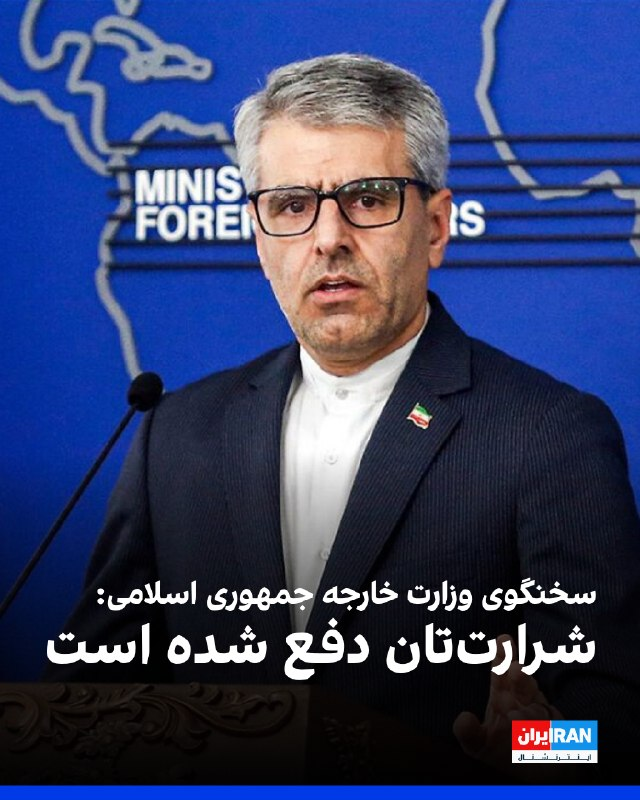

اسماعیل بقائی، سخنگوی وزارت خارجه جمهوری اسلامی، درباره حملات پنجشنبه و بامداد جمعه آمریکا، گفت: «نیروهای مسلح ما با تمام توان آمادگی دارند و هم با دقت رصد می‌کنند هرجا که لازم باشد با تمام توان به هرگونه تعرض و ماجراجویی پاسخ می‌دهند. اما بایستی گفت که شرارت‌تان دفع شده است.»

بقائی افزود: «درباره مذاکرات باید گفت که در حال بررسی است و به نتیجه نهایی رسیدیم حتما اعلام خواهیم کرد.»
‌🏁 🇬🇧 IranintlTV

🤖 @VahidOOnLine

## VahidOOnLine — post 238904

  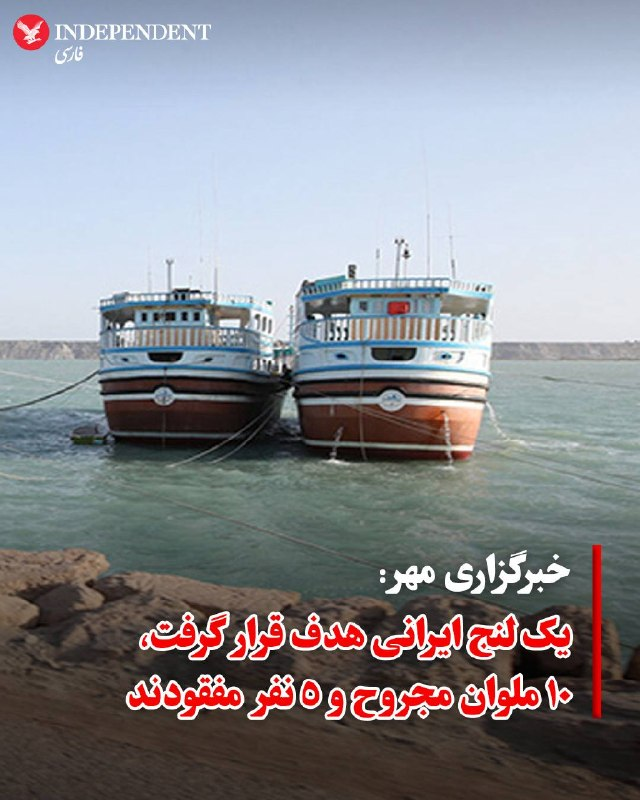

♦️خبرگزاری مهر، وابسته به سازمان تبلیغات اسلامی، روز جمعه ۱۸ اردیبهشت گزارش داد که نیروی دریایی ایالات متحده شب گذشته به یک لنج با پرچم ایران حمله کرده است که در پی آن ۱۰ ملوان مجروح شده و ۵ نفر دیگر همچنان مفقودند.

گزارش‌ها حاکی از آن است که این حمله در محدوده آب‌های تنگه هرمز و دریای مکران (دریای عمان) رخ داده و این لنج باری در نزدیکی سواحل شهرستان میناب هدف قرار گرفته و دچار آتش‌سوزی شده است. به گزارش مهر، این شناور در مجموع ۱۵ سرنشین داشته که ۱۰ تن از آنان پس از مجروح شدن به بیمارستان منتقل شده‌اند و گروه‌های بومی و تیم‌های امداد و نجات همچنان در تلاش برای یافتن وضعیت سایر ملوانان مفقودشده هستند.
‌🇸🇦 Indypersian

🤖 @VahidOOnLine

## VahidOOnLine — post 238903

  

فاکس‌نیوز در شبکه ایکس اعلام کرد که ارتش آمریکا جمعه حملات هوایی بیشتری انجام داده و چند نفتکش خالی را که قصد عبور از محاصره دریایی را داشتند، هدف قرار داده است.

پیش‌تر ارتش آمریکا اعلام کرده بود که شامگاه پنجشنبه و بامداد جمعه در محدوده تنگه هرمز «عملیات دفاعی» انجام داده است.
‌🏁 🇬🇧 IranintlTV

🤖 @VahidOOnLine

## VahidOOnLine — post 238902

  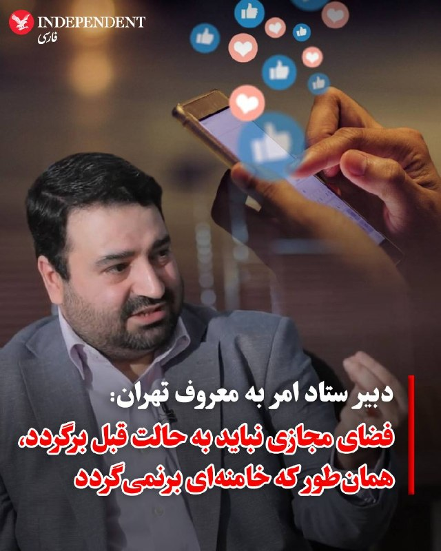

♦️روح‌الله مومن‌نسب، دبیر ستاد امر به معروف تهران، روز جمعه ۱۸ اردیبهشت با تاکید بر ضرورت تدوین و اجرای «نظام حقوقی جدید برای اینترنت» گفت که وضعیت فضای مجازی نباید به حالت قبل قبل برگردد. او این شرایط را به کشته شدن علی خامنه‌ای، دانش‌آموزان دبستان میناب و سایر کشته‌شدگان این جنگ مرتبط دانست و گفت همان‌طور که این افراد باز نمی‌گردند، فضای مجازی نیز نیازمند تغییر است.

مومن‌نسب با تکرار ادعای «پیروزی نظامی» جمهوری اسلامی در مقابله با ایالات متحده و اسرائیل، گفت: «بدون شک اگر نظام حقوقی جدید برای اینترنت تدوین و محکم اجرا نشود، با همین فضای مجازیِ ول، همه پیروزی‌های کشورمان را تبدیل به شکست می‌کنند و شکست‌های تلخ اطلاعاتی‌مان هم تثبیت و تعمیق می‌شود.»
‌🇸🇦 Indypersian

🤖 @VahidOOnLine

## VahidOOnLine — post 238901

  <a href="telegram/content/VahidOOnLine_238901_1778250184.mp4">🎬 Download video</a>

خبرگزاری مهر گزارش داده عصر جمعه در محدوده شهرستان سیریک صدای انفجار گزارش شده است. هنوز ماهیت این صداها مشخص نشده است و نهادهای رسمی در این خصوص اظهار نظر نکرده‌اند.
‌🏁 🇬🇧 ManotoTV

🤖 @VahidOOnLine

## VahidOOnLine — post 238900

  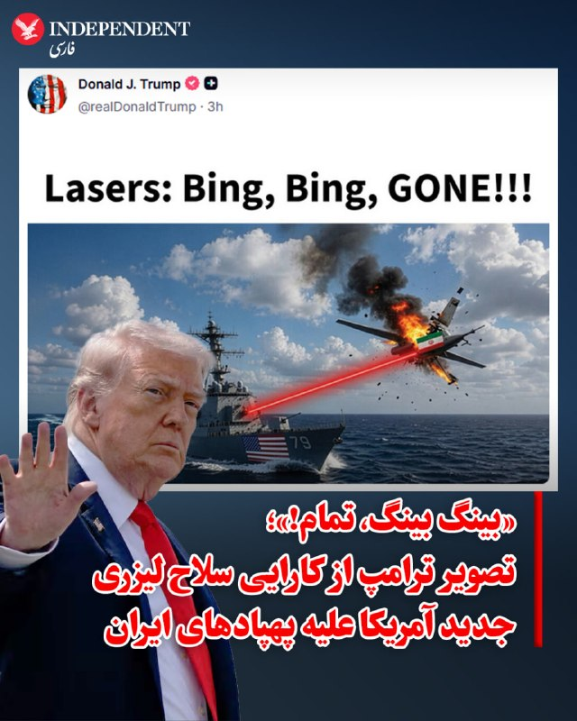

♦️دونالد ترامپ در حساب تروث سوشال خود با انتشار تصویری شبیه‌سازی‌شده از انهدام یک پهپاد ایرانی توسط سلاح لیزری نیروی دریایی آمریکا، سرنگونی پهپادهای جمهوری اسلامی را به «پروانه‌ای که به سمت قبرش سقوط می‌کند»، تشبیه کرد. او در واکنش به درگیری‌های شبانه ناوشکن‌ها در تنگه هرمز، این تبادل آتش را تنها یک «سیلی از روی محبت» (Love tap) خواند و تاکید کرد که آتش‌بس شکننده منطقه همچنان برقرار است.

سلاحی که ترامپ به آن اشاره می‌کند،سامانه لیزری ضد پهپاد «لوکاست» (LOCUST) است که پیش‌تر اعلام شد بر روی ناو هواپیمابر «یواس‌اس جورج اچ.دبلیو. بوش» نصب و آزمایش شده است. به گزارش وب‌سایت «وار زون»، این نخستین بار است که یک سلاح انرژی هدایت‌شده روی یک ناو هواپیمابر کلاس نیمیتز نصب می‌شود. مقامات عالی‌رتبه نیروی دریایی اعلام کرده‌اند که هدف نهایی آن‌ها، تبدیل این سلاح‌های پیشرفته به گزینه اصلی مقابله با تهدیدات نزدیک در آب‌های بین‌المللی است.
‌🇸🇦 Indypersian

🤖 @VahidOOnLine

## VahidOOnLine — post 238899

  <a href="telegram/content/VahidOOnLine_238899_1778250185.mp4">🎬 Download video</a>

تانکرترکرز که به رصد حرکت شناورها می‌پردازد در گزارشی به وضعیت Ocean Koi نفت‌کش توقیف شده توسط ارتش پرداخته است. در این گزارش آمده نام این شناور در واقع JIN LI 9255933 است و از تاریخ ۳۰ نوامبر ۲۰۲۵ با این نام فعالیت می‌کرده است. بر اساس داده‌های موجود، این نفتکش از سال ۲۰۲۱ تاکنون دست‌کم در ۱۶ مورد محموله‌های مختلف هیدروکربنی ایران را حمل کرده است؛ موضوعی که به گفته منابع، با آگاهی کامل ایران انجام شده، زیرا نیمی از بارگیری‌ها در بنادر ایران و نیمی دیگر از طریق انتقال کشتی به کشتی در دریا صورت گرفته است.
در اداکه گزارش آمده گفته می‌شود مالکیت این نفتکش در شانگهای چین مستقر است و همچنین یادآوری شده این کشتی در تاریخ ۲۵ فوریه ۲۰۲۶ توسط دفتر کنترل دارایی‌های خارجی آمریکا تحریم شده است.
در پایان این گزارش تانکرترکرز گفته گزارش صدا و سیما از توقیف این نفتکش چیزی جز نمایش نیست. در گزارش صدا و سیما آمده تکاوران نیروی دریایی ارتش با «عملیات ویژه» این نفتکش را به دلیل «تلاش برای اختلال در صادرات نفت ایران و آسیب به منافع ملی» توقیف کردند؛ محموله نفت روی آن متعلق به ایران بوده، به سواحل جنوبی ایران هدایت و به مقامات قضایی تحویل داده شده است.
‌🏁 🇬🇧 ManotoTV

🤖 @VahidOOnLine

## VahidOOnLine — post 238898

  

فرماندار میناب اعلام کرد که پیکر بی‌جان یکی از پنج ملوان مفقود شده یک فروند لنج باری که در حمله بامداد جمعه آمریکا هدف قرار گرفته بود، پیدا شد.
پیش‌تر فرماندار میناب اعلام کرده بود که بر اثر این حمله، ۱۰ ملوان مصدوم و ۵ ملوان نیز مفقود شده بودند.
‌🏁 🇬🇧 IranintlTV

🤖 @VahidOOnLine

## VahidOOnLine — post 238897

  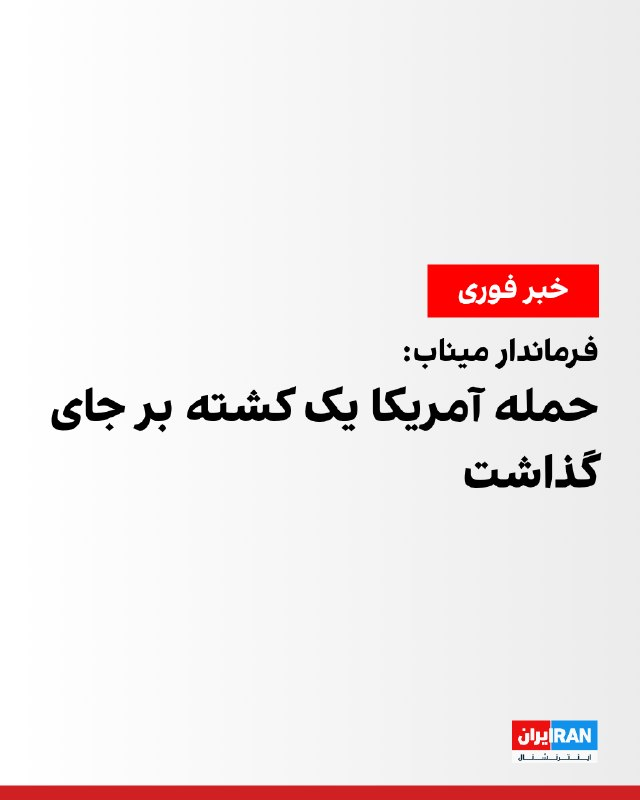

فرماندار میناب اعلام کرد که پیکر بی‌جان یکی از پنج ملوان مفقود شده یک فروند لنج باری که در حمله بامداد جمعه آمریکا هدف قرار گرفته بود، پیدا شد.
پیش‌تر فرماندار میناب اعلام کرده بود که بر اثر این حمله، ۱۰ ملوان مصدوم و ۵ ملوان نیز مفقود شده بودند.
‌🏁 🇬🇧 IranintlTV

🤖 @VahidOOnLine

## VahidOOnLine — post 238896

🗣روایت شما از رویدادهای مربوط به تنش نظامی- جمعه ۱۹ اردیبهشت

🔹ظهر شنبه صدای دو انفجار در غرب اصفهان شنیدیم
🔹بعدازظهر شنبه ساعت ۴:۱۵ صدای انفجار در غرب تهران شنیده شد
🔹جمعه صدای انفجار شدید در بندر کنارک به سمت نیروی دریایی آمد
🔹الان ساعت ۱۲:۳۰ شنبه کنارک را زدند، انفجار خیلی سنگین بود
🔹امروز جمعه ساعت ۱۶:۴۶ در خیابان جی صدای پدافند آمد
🔹دوباره صدای انفجار در سیریک شنیدیم
‌🏁 🇬🇧 IranintlTV

🤖 @VahidOOnLine

## VahidOOnLine — post 238895

  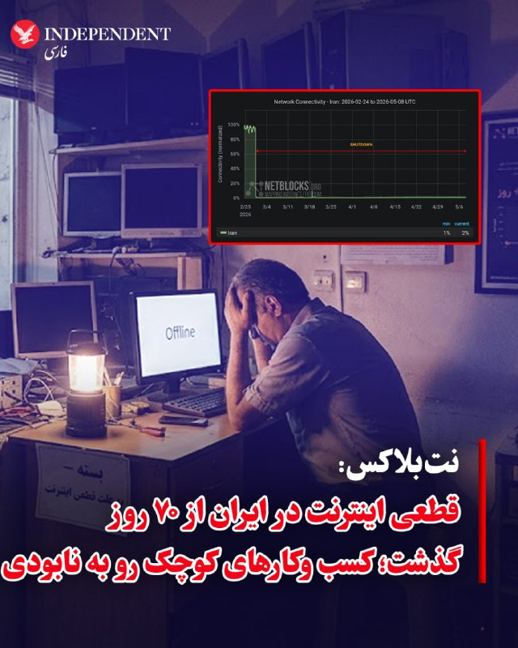

♦️نت‌بلاکس، نهاد بین‌المللی ناظر بر وضعیت اینترنت در جهان، اعلام کرد که خاموشی اینترنت در ایران وارد هفتادمین روز خود شده و از مرز ۱۶۵۶ ساعت گذشته است.
این نهاد با اشاره به تداوم محدودیت‌ها تأکید کرد که دسترسی به اینترنت، به‌ویژه در شرایط بحرانی، یک نیاز حیاتی است و اختلال در آن بیشترین آسیب را به اقشار آسیب‌پذیر از جمله افراد دارای معلولیت، دانشجویان، کسب‌وکارهای کوچک و عموم مردم وارد می‌کند.
نت‌بلاکس پیش‌تر نیز هشدار داده بود که ادامه این محدودیت‌ها می‌تواند پیامدهای گسترده‌ای بر ارتباطات، اقتصاد دیجیتال و جریان آزاد اطلاعات در کشور داشته باشد.
‌🇸🇦 Indypersian

🤖 @VahidOOnLine

## VahidOOnLine — post 238894

  <a href="telegram/content/VahidOOnLine_238894_1778250188.mp4">🎬 Download video</a>

مارکو روبیو، وزیر خارجه آمریکا، پس از پایان سخنانش در جمع خبرنگاران در ایتالیا، بار دیگر بر موضع واشنگتن تأکید کرد که نیروهای نظامی این کشور در جریان درگیری‌های شب گذشته در تنگه هرمز، در چارچوب «دفاع از خود» عمل کرده‌اند.
او گفت: «آنچه دیروز دیدید این بود که ناوشکن‌های آمریکایی در آب‌های بین‌المللی در حال حرکت بودند و از سوی ایران به آن‌ها شلیک شد و آمریکا برای حفاظت از خود پاسخ دفاعی داد.»
روبیو افزود: «ما شلیک نکردیم، آن‌ها به ما شلیک کردند.»
طبق گزارش‌ها، هم آمریکا و هم جمهوری اسلامی اعلام کرده‌اند که شب گذشته در منطقه تنگه هرمز به یکدیگر حمله کرده‌اند.
ارتش آمریکا گفته است نیروهایش «حملات بدون تحریک ایران» را که سه ناوشکن نیروی دریایی را هدف قرار داده بود رهگیری کرده و در پاسخ، مواضع پرتاب این حملات در داخل ایران را هدف قرار داده است.
در مقابل، تهران پیش‌تر اعلام کرده بود که در پاسخ به آنچه «نقض آتش‌بس توسط واشنگتن» و هدف قرار گرفتن «مناطق غیرنظامی» خوانده، به شناورهای نظامی آمریکا حمله کرده و «خسارات قابل توجهی» به آن‌ها وارد کرده است. فرماندار میناب نیز اعلام کرده در جریان حملات آمریکا در آب‌های تنگه هرمز و دریای مکران که شب گذشته صورت گرفته، یک شناور باری در نزدیکی آب‌های میناب مورد هدف قرار گرفته و دچار آتش‌سوزی شده است. بر پایه این اعلام در این لنج، ۱۵ ملوان حضور داشتند که ۱۰ تن از آن‌ها مصدوم و پنج نفر مفقود شده‌اند.
‌🏁 🇬🇧 ManotoTV

🤖 @VahidOOnLine

## VahidOOnLine — post 238893

  <a href="telegram/content/VahidOOnLine_238893_1778250189.mp4">🎬 Download video</a>

مارکو روبیو، وزیر خارجه آمریکا، در گفت‌وگو با خبرنگاران در رم اعلام کرد ایالات متحده هیچ‌گونه مذاکره‌ای با حزب‌الله انجام نخواهد داد و تمرکز خود را بر گفت‌وگو با دولت لبنان قرار داده است.
او تأکید کرد که سیاست واشنگتن در این زمینه تغییر نکرده و مسیر دیپلماتیک تنها از طریق دولت رسمی لبنان دنبال خواهد شد.
‌🏁 🇬🇧 ManotoTV

🤖 @VahidOOnLine

## mwarmonitor — post 8700

🚨ناتوان‌سازی ۲ نفت‌کش دیگر توسط ایالات متحده به دلیل نقض محاصره در دریای عمان

🇺🇸ستاد فرماندهی مرکزی ایالات متحده (CENTCOM)

📌تمپا، فلوریدا — نیروهای ایالات متحده در تاریخ ۸ مه، پیش از ورود نفت‌کش‌های M/T Sea Star III و M/T Sevda به یکی از بنادر ایران در دریای عمان، آن‌ها را به دلیل نقض محاصره جاری از سوی ایالات متحده، ناتوان (متوقف) کردند.
🔸ستاد فرماندهی مرکزی ایالات متحده (سنتکام) اقدامات مربوط به محاصره را علیه دو نفت‌کش خالی با پرچم ایران که قصد پهلوگیری در یک بندر ایرانی در دریای عمان را داشتند، به اجرا گذاشت. یک فروند جنگنده F/A-18 Super Hornet متعلق به ناو هواپیمابر یو‌اس‌اس جورج اچ.دبلیو بوش (CVN 77)، پس از شلیک مهمات دقیق به سمت دودکش‌های این دو نفت‌کش، آن‌ها را ناتوان کرد و مانع از ورود این کشتی‌های غیرمنصاع به ایران شد.
🔸نیروهای ایالات متحده همچنین در تاریخ ۶ مه، نفت‌کش M/T Hasna با پرچم ایران را که در تلاش بود به سمتی بندری در ایران در دریای عمان حرکت کند، ناتوان کردند. یک جنگنده F/A-18 Super Hornet از ناو هواپیمابر یو‌اس‌اس آبراهام لینکلن (CVN 72) با شلیک چندین گلوله از توپ ۲۰ میلی‌متری، سکان این نفت‌کش خالی را از کار انداخت.
🔸هر سه شناور مذکور دیگر به سمت ایران در حال حرکت نیستند.
دریاسالار برد کوپر، فرمانده سنتکام، در این باره گفت:
🔹«نیروهای ایالات متحده در خاورمیانه به اجرای کامل محاصره علیه شناورهایی که به ایران وارد یا از آن خارج می‌شوند، متعهد می‌مانند. مردان و زنان متخصص ما در لباس ارتش، عملکرد فوق‌العاده‌ای از خود نشان می‌دهند.»
🔸تاکنون چندین شناور تجاری ناتوان شده و بیش از ۵۰ فروند دیگر توسط نیروهای سنتکام برای اطمینان از پایبندی به قوانین، تغییر مسیر داده شده‌اند.

@mwarmonitor

## mwarmonitor — post 8699

🇺🇸🛸وزارت جنگ ایالات متحده اسناد مربوط به برخوردها با «پدیده‌های ناشناس غیرعادی» (UAP) را از حالت محرمانه خارج کرده و منتشر کرده است. این وزارتخانه اعلام کرده که فایل‌های بیشتری نیز به‌صورت تدریجی در آینده منتشر خواهد شد. @mwarmonitor

## mwarmonitor — post 8698

  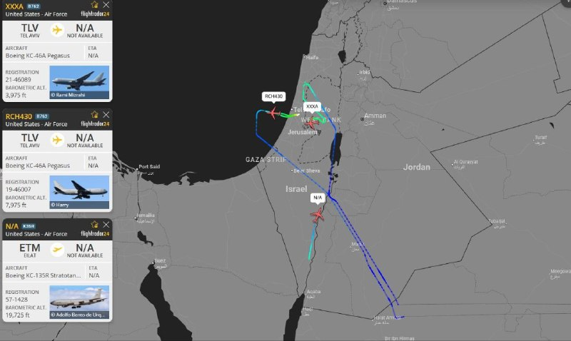

✈️حداقل سه هواپیمای سوخت‌رسان نیروی هوایی آمریکا هم‌اکنون از اسرائیل پرواز کرده‌اند؛ دو فروند KC-46A از تل‌آویو و یک فروند KC-135R از ایلات.

@mwarmonitor

## mwarmonitor — post 8689

⚠️خبر فوری: FOX NEWS 🔴 ارتش آمریکا امروز حملات هوایی بیشتری انجام داد و چندین نفتکش خالی را که تلاش می‌کردند محاصره را بشکنند، هدف قرار داد. 🔴به گفته یک مقام ارشد آمریکایی: «این‌ها نفتکش‌های بسیار بزرگ حمل نفت خام (VLCC) بودند… کشتی‌های عظیم و خالی که…

## mwarmonitor — post 8688

⚠️خبر فوری: FOX NEWS

🔴 ارتش آمریکا امروز حملات هوایی بیشتری انجام داد و چندین نفتکش خالی را که تلاش می‌کردند محاصره را بشکنند، هدف قرار داد.
🔴به گفته یک مقام ارشد آمریکایی: «این‌ها نفتکش‌های بسیار بزرگ حمل نفت خام (VLCC) بودند… کشتی‌های عظیم و خالی که تلاش داشتند به ایران بازگردند… و سعی کردند محاصره را دور بزنند…»

@mwarmonitor

## mwarmonitor — post 8686

🇦🇪امروز پس از یک حمله گزارش‌شده موشکی و پهپادی ایران در ساعات صبح، ستون‌های بزرگ دود در دبی مشاهده شد که در نتیجه آن دست‌کم سه نفر دچار جراحات با شدت متوسط شدند. @mwarmonitor

## mwarmonitor — post 8685

  <a href="telegram/content/mwarmonitor_8685_1778250191.mp4">🎬 Download video</a>

🇦🇪وزارت دفاع امارات متحده عربی ۰۸-۰۵-۲۰۲۶ 🔸دفاع هوایی امارات با ۲ موشک بالستیک و ۳ پهپاد مقابله کرد 🔹وزارت دفاع اعلام کرد که در تاریخ ۸ مه ۲۰۲۶، پدافند هوایی امارات با ۲ موشک بالستیک و ۳ پهپاد که از سمت ایران می‌آمدند، مقابله کرده است. از زمان آغاز حملات آشکار…

## mwarmonitor — post 8684

🇺🇸🛸وزارت جنگ ایالات متحده اسناد مربوط به برخوردها با «پدیده‌های ناشناس غیرعادی» (UAP) را از حالت محرمانه خارج کرده و منتشر کرده است. این وزارتخانه اعلام کرده که فایل‌های بیشتری نیز به‌صورت تدریجی در آینده منتشر خواهد شد.

@mwarmonitor

## mwarmonitor — post 8683

🔴روبیو: آمریکا انتظار دارد امروز پاسخ ایران به پیش‌نویس توافق برای پایان دادن به جنگ را دریافت کند.

@mwarmonitor

## mwarmonitor — post 8682

  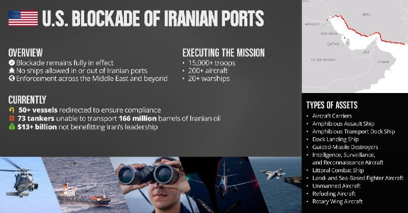

🔴در حال حاضر بیش از ۷۰ نفتکش وجود دارد که نیروهای ایالات متحده مانع ورود یا خروج آن‌ها به/از بنادر ایران شده‌اند. این کشتی‌های تجاری در مجموع توانایی انتقال بیش از ۱۶۶ میلیون بشکه نفت ایران را دارند که ارزش آن بیش از ۱۳ میلیارد دلار برآورد می‌شود.

@mwarmonitor

## mwarmonitor — post 8681

📌امروز هشتمین سالگرد خروج دونالد ترامپ از توافق هسته‌ای ایران برجام است که در زمان دولت اوباما مذاکره شده بود.

@mwarmonitor

## pm_afshaa — post 90364

🔴دستور بازگشایی پناهگاه‌های عمومی در حیفا صادر شد

💧 Rainbet.com the #1 Non-KYC Crypto Casino & Sportsbook @rainbetcom

😁 @Pm_Afshaa

## pm_afshaa — post 90363

🔴فرماندار میناب: در پی حمله دیشب آمریکا، 10 ملوان مجروح و 5 ملوان مفقود شدن

💧 Rainbet.com the #1 Non-KYC Crypto Casino & Sportsbook @rainbetcom

😁 @Pm_Afshaa

## pm_afshaa — post 90362

🔴چندین تانکر بزرگ نفت و گاز که سعی داشتند محاصره آمریکا رو بشکنن، هدف قرار گرفتن 
💧 Rainbet.com the #1 Non-KYC Crypto Casino & Sportsbook @rainbetcom 
😁 @Pm_Afshaa

## pm_afshaa — post 90361

🔴چندین تانکر بزرگ نفت و گاز که سعی داشتند محاصره آمریکا رو بشکنن، هدف قرار گرفتن

💧 Rainbet.com the #1 Non-KYC Crypto Casino & Sportsbook @rainbetcom

😁 @Pm_Afshaa

## pm_afshaa — post 90360

🔴روبیو: ما امروز باید از ایران پاسخی دریافت کنیم

💧 Rainbet.com the #1 Non-KYC Crypto Casino & Sportsbook @rainbetcom

😁 @Pm_Afshaa

## DEJradio — post 4521

  <a href="telegram/content/DEJradio_4521_1778250193.jpg">🎬 Download video</a>

🚨
🔸 وضعیت آتش‌بس و معیشت پرسنل نیروهای مسلح

کارشناس: شهرام سبزواری

#آتشبس #نیروهای_مسلح
@DEJradio

## DEJradio — post 4520

  <a href="telegram/content/DEJradio_4520_1778250194.jpg">🎬 Download video</a>

🔺📢 جمهوری اسلامی یک کشتی دیگر را در دریای عمان توقیف کرد

روابط عمومی ارتش جمهوری اسلامی اعلام کرد این نیرو یک نفتکش با نام «اوشن کوی» را به اتهام آنچه تلاش برای اخلال در صادرات نفت ایران خوانده، توقیف کرده و به سواحل جنوبی ایران منتقل کرده است.

بر همین اساس ادعا شده که این کشتی حامل محموله نفتی ایران بوده و با سوءاستفاده از شرایط تنش‌آلود منطقه، قصد آسیب زدن و ایجاد اختلال در روند صادرات نفت جمهوری اسلامی را داشته است.

#دریای_عمان #جمهوری_اسلامی
@DEJradio

## mamlekate — post 103478

📝 قابلیت حفظ حریم خصوصی اینستاگرام غیرفعال شد؛ این موضوع چه تاثیری بر پیام‌های شخصی شما دارد؟

اینستاگرام اعلام کرد که فناوری رمزگذاری سرتاسری را غیرفعال می‌کند؛ اقدامی که چرخشی ۱۸۰ درجه‌ای در سیاست‌های شرکت مادر اینستاگرام، یعنی متا، محسوب می‌شود.

@mamlekate

## kianmeli1 — post 87271

🔴روبیو: منتظر دریافت پاسخ ایران امروز هستم
https://t.me/kianmeli1

## IranIntlTV — post 336154

  

خبرگزاری فارس، وابسته به سپاه پاسداران، گزارش داد که از ساعتی پیش درگیری‌های پراکنده‌ای میان نیروهای مسلح جمهوری اسلامی و شناورهای آمریکایی‌ در محدوده تنگه هرمز در جریان است.

فاکس‌نیوز نیز از حملات ارتش آمریکا به چند نفتکش خالی که قصد شکستن محاصره دریایی را داشتند، خبر داده است.
https://iranintl.com/202605081025

## IranIntlTV — post 336153

  <a href="https://t.me/IranintlTV/336153">📎 Download file</a>

🎧نسخه صوتی دومینو: جنگ تهران و واشینگتن بر سر تنگه هرمز
@iranintlTV

## IranIntlTV — post 336152

اخراج گسترده کارگران پاکستانی‌ از امارات در پی نارضایتی ابوظبی از مواضع اسلام‌آباد

هرچند پاکستان کوشیده در مسیر پایان دادن به جنگ ایران نقش‌آفرینی کند، تحولات اخیر به روابط اسلام‌آباد با یکی از شرکای دیرینه‌اش، امارات متحده عربی، آسیب زده است.

روزنامه نیویورک‌تایمز جمعه ۱۸ اردیبهشت گزارش داد امارات، این کشور ثروتمند حاشیه خلیج فارس، دست به اخراج گسترده کارگران پاکستانی زده است؛ اقدامی که می‌تواند یکی از منابع مهم اشتغال پاکستان را با تهدید روبه‌رو کند.

بر اساس این گزارش، امارات از موضع نه‌چندان قاطع پاکستان در محکوم کردن حملات جمهوری اسلامی به این کشور ناراضی است؛ آن هم در شرایطی که اسلام‌آباد هم‌زمان می‌کوشد میان تهران و واشینگتن برای دستیابی به توافق صلح میانجی‌گری کند.

امارات در جریان جنگ اخیر هدف هزاران حمله موشکی و پهپادی حکومت ایران قرار گرفته و خساراتی را متحمل شده است.

جمهوری اسلامی از ۱۴ اردیبهشت حملات خود را به امارات از سر گرفته است.

در آخرین مورد، سامانه‌های پدافند هوایی امارات ظهر ۱۸ اردیبهشت برای دفع حملات موشکی و پهپادی حکومت ایران وارد عمل شدند.

به گفته منابع رسمی اماراتی، این حملات سه مجروح بر جای گذاشت.

شکاف میان روایت‌های مردمی و رسمی
نیویورک‌تایمز در ادامه گزارش، از گفت‌وگو با بیش از ۲۰ شهروند شیعه پاکستانی که به‌عنوان کارمند شرکت‌های اماراتی در این کشور مشغول به کار بودند، خبر داد.

آنها تایید کردند که همگی ماه گذشته به‌طور ناگهانی بازداشت، زندانی و سپس از امارات اخراج شده‌اند.

رهبران مذهبی شیعه در پاکستان برآورد می‌کنند که از اواخر فروردین‌ماه، احتمالا هزاران شیعه پاکستانی از امارات اخراج شده‌اند.

بر اساس این گزارش، شیعیان پاکستان که جمعیتی حدود ۳۵ میلیون نفر دارند و دارای «پیوندهای معنوی عمیق» با ایران هستند، بارها در این کشورِ عمدتا سنی‌مذهب هدف خشونت‌های فرقه‌ای قرار گرفته‌اند.

دلایل اخراج شهروندان پاکستانی از امارات هنوز به‌طور رسمی مشخص نشده و مقام‌های دو کشور همچنان بر استحکام روابط دوجانبه تاکید دارند.

وزارت امور خارجه پاکستان گزارش‌ها درباره اخراج گسترده شهروندان این کشور از امارات را رد کرده و به پرسش‌ها درباره اینکه آیا شیعیان به‌طور خاص هدف قرار گرفته‌اند یا نه، پاسخی نداده است.

طاهر اندرابی، سخنگوی این وزارتخانه، گفت پاکستانی‌های اخراج‌شده افرادی بوده‌اند که در امارات «مرتکب جرم» شده‌اند.

دولت امارات نیز تاکنون به درخواست‌ها برای اظهارنظر درباره این موضوع واکنشی نشان نداده است.

در روزهای اخیر، مقام‌های جمهوری اسلامی مواضع امارات در قبال جنگ ایران را مورد انتقاد قرار داده و بارها از ادبیات تهدیدآمیز علیه این کشور استفاده کرده‌اند.

علی خضریان، عضو کمیسیون امنیت ملی مجلس، پیش‌تر گفت جمهوری اسلامی «امارات متحده عربی را مانند اقلیم کردستان عراق، پایگاه دشمن می‌داند».

او افزود: «ما دیگر امارات را همسایه نمی‌بینیم، آنها در حکم پایگاه متخاصم هستند.»

آیا امارات از میانجی‌گری پاکستان خشمگین است؟
به گزارش نیویورک‌تایمز، بیش از دو میلیون شهروند پاکستانی در امارات متحده عربی ساکن هستند و سال گذشته میلادی بیش از هشت میلیارد دلار حواله مالی به پاکستان ارسال کردند.

مفتاح اسماعیل، وزیر پیشین دارایی پاکستان، گفت: «حفظ روابط خوب با امارات برای اسلام‌آباد اهمیت دارد، اما در عین حال، نمی‌دانم پاکستان در این جنگ چه مسیر دیگری می‌توانست انتخاب کند.»

در سوی دیگر، ندیم قطیش، تحلیل‌گر اماراتی-لبنانی نزدیک به دولت امارات، گفت اسلام‌آباد ابتکار میانجی‌گری میان آمریکا و جمهوری اسلامی را «بدون هماهنگی کافی» با ابوظبی آغاز کرد.

ماه گذشته، امارات وام ۳.۵ میلیارد دلاری خود به پاکستان را بازپس گرفت؛ رقمی نزدیک به یک‌پنجم ذخایر ارزی این کشور. پس از آن، عربستان سعودی با ارائه سپرده‌ای سه میلیارد دلاری برای تقویت ذخایر ارزی پاکستان وارد عمل شد.

محمدامین شهیدی، روحانی ساکن اسلام‌آباد و رهبر یک سازمان سیاسی شیعه، اعلام کرد این سازمان پنج هزار خانواده اخراج‌شده از امارات را ثبت کرده است.

او گفت: «در کشورهای خلیج فارس این تصور وجود دارد که هر شیعه‌ای از ایران حمایت می‌کند. با توجه به وخامت روابط، درخواست از دولت پاکستان برای گفت‌وگو با امارات بی‌فایده است.»

به گفته شهیدی و شماری دیگر از منابع، روند اخراج شهروندان پاکستانی از ۱۹ فروردین آغاز شد؛ زمانی که تهران و واشینگتن با میانجی‌گری اسلام‌آباد بر سر برقراری آتش‌بس موقت به توافق رسیدند.

به گزارش نیویورک‌تایمز، شمار نامشخصی از کارگران پاکستانی نیز در پی از دست دادن شغل خود به‌دلیل پیامدهای جنگ، امارات را ترک کرده‌اند.

🔗وب‌سایت ایران‌اینترنشنال
@iranintltv

## IranIntlTV — post 336151

  <a href="https://t.me/IranintlTV/336151">📎 Download file</a>

🎧نسخه صوتی اخبار نیم‌روزی | جمعه ۱۸ اردیبهشت
@iranintlTV

## IranIntlTV — post 336150

  

عباس عراقچی، وزیر امور خارجه جمهوری اسلامی، درباره دیدار با همتای چینی خود، گفت: «با توجه به شراکت راهبردی عمیق میان دو کشور، مشورت‌های مستمر و نزدیک با چین برای جمهوری اسلامی بسیار حائز اهمیت است.»
او افزود: «مسائل کلیدی از جمله جنگ اخیر و وضعیت تنگه هرمز مورد بحث قرار گرفتند.»
https://iranintl.com/202605083481

## IranIntlTV — post 336149

  <a href="telegram/content/IranIntlTV_336149_1778250198.mp4">🎬 Download video</a>

بر اساس اطلاعات رسیده به ایران‌اینترنشنال، ماموران حکومتی به مراسم تولد جاویدنام ابوالفضل پایدار در سبزوار یورش برده‌ و با اعمال خشونت مادر، دایی و خواهرزاده‌اش را به اردوگاه تربت حیدریه منتقل کرده‌اند. ابوالفضل پایدار ۱۷ ساله بود که در اعتراضات دی‌ماه کشته شد.
جزییات بیشتر با لیلا سعادتی، عضو تحریریه ایران‌اینترنشنال
@iranintltv

## IranIntlTV — post 336148

  <a href="telegram/content/IranIntlTV_336148_1778250200.mp4">🎬 Download video</a>

وزارت دفاع امارات متحده عربی اعلام کرد در حمله سپاه پاسداران به این کشور سه نفر مجروح شده‌اند. بر اساس این بیانیه جمهوری اسلامی دو موشک بالستیک و سه پهپاد به سوی امارات شلیک کرده است.
گفت‌وگو با علی صدرزاده، تحلیل‌گر مسائل خاورمیانه
@iranintltv

## IranIntlTV — post 336147

  

اسماعیل بقائی، سخنگوی وزارت خارجه جمهوری اسلامی، درباره حملات پنجشنبه و بامداد جمعه آمریکا، گفت: «نیروهای مسلح ما با تمام توان آمادگی دارند و هم با دقت رصد می‌کنند هرجا که لازم باشد با تمام توان به هرگونه تعرض و ماجراجویی پاسخ می‌دهند. اما بایستی گفت که شرارت‌تان دفع شده است.»

بقائی افزود: «درباره مذاکرات باید گفت که در حال بررسی است و به نتیجه نهایی رسیدیم حتما اعلام خواهیم کرد.»
https://iranintl.com/202605088684

## IranIntlTV — post 336146

  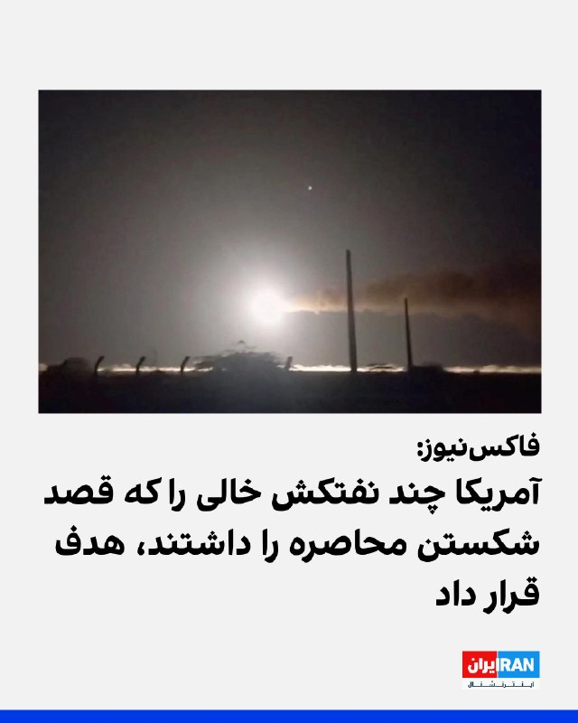

فاکس‌نیوز در شبکه ایکس اعلام کرد که ارتش آمریکا جمعه حملات هوایی بیشتری انجام داده و چند نفتکش خالی را که قصد عبور از محاصره دریایی را داشتند، هدف قرار داده است.

پیش‌تر ارتش آمریکا اعلام کرده بود که شامگاه پنجشنبه و بامداد جمعه در محدوده تنگه هرمز «عملیات دفاعی» انجام داده است.
https://iranintl.com/202605084793

## IranIntlTV — post 336145

«رویا»؛ زن، دیوار و زندان
«رویا»، ساخته مهناز محمدی، که به تازگی در سینماهای آلمان به اکران عمومی درآمده، تصویر روشنی است از احوال یک زن زندانی گرفتار در اوین.

فیلم که از نظر زمانی به زندان‌ها و شکنجه‌های پس از جنبش «زن، زندگی، آزادی» مربوط است، حالا پس از وقایع انقلاب اخیر ایران که به کشته شدن ده‌ها هزار نفر و زندانی شدن افراد بسیار بیشتری انجامید، رنگ و بوی خاصی به خود می‌گیرد و از قید و بند زمان می‌گریزد.

محمدی که خود بارها به‌وسیله نیروهای امنیتی دستگیر شده و ماه‌ها در زندان انفرادی در اوین بوده است، این فیلم را حاصل تجربه شخصی خودش می‌داند. جایی که یک زن در یک سلول سه متر در سه متر نگهداری می‌شود و با توهین و تحقیر و شکنجه از او می‌خواهند که علیه خودش اعتراف کند.

فیلمساز شخصیت اصلی داستان را به معلمی تغییر داده که متهم است از شاگردانش خواسته تا روسری‌های خود را بسوزانند.

فیلم اطلاعات بسیار اندکی درباره شخصیت اصلی‌اش به ما می‌دهد و سعی دارد در حالتی رویاگونه احوال یک زن زیرشکنجه را ترسیم کند. از این رو ۲۰ دقیقه اول فیلم - نقطه قوت آن - سکانس تکان‌دهنده‌ای است در داخل زندان که به تمامی از نقطه‌نظر این زن روایت می‌شود و دوربین جای چشم‌های او را می‌گیرد. زنی محبوس در سلول که چیز زیادی نمی‌بیند - چون چشم‌بند دارد - و تنها از طریق صداها تا حدی می‌فهمد که چه اتفاقاتی در اطراف او رخ می‌دهد و از این رو صدا به ابزاری بسیار مهم در طول فیلم بدل می‌شود که در مجموع بار بزرگی از فیلم را به دوش می‌کشد؛ حتی بیش از تصویر.

۲۰ دقیقه ابتدایی هر چند می‌تواند برای تماشاگر آزارنده باشد - چرا که تصویرها روشن و واضح نیستند و هنوز چیز زیادی درباره این شخصیت نمی‌دانیم - اما در نهایت به یک تجربه عینی از وضعیت یک زندانی تحت‌ شکنجه بدل می‌شود که در آن تماشاگر خواه‌ناخواه در رنج شخصیت اصلی شریک می‌شود.

حالا دیگر اهمیتی ندارد که این شخصیت را می‌شناسیم یا نه. فیلم از این نقطه می‌گریزد و از ما می‌خواهد که در یک تجربه تلخ شریک شویم. همان تجربه‌ای که خود فیلمساز از سر گذرانده و حالا می‌خواهد با ما به اشتراک بگذارد.

او می‌گوید که تجربه‌اش در زندان اطلاعات سپاه در داخل اوین، دقیقا به همین شکل بوده و او در واقع به دلیل داشتن چشم‌بند، چیز زیادی درباره این زندان نمی‌داند. درست به مانند شخصیت اصلی فیلم که تنها با صداهایی ترسناک روبه‌روست.

از اینجاست که فیلم از تماشاگرش می‌خواهد به تخیل پناه ببرد و ساختار و دیوارها و آدم‌های زندان را در ذهن خود بسازد. فیلمساز حتی از این طریق وضعیت شخصیت اصلی فیلمش را به همه افراد در بند در زندان‌های ایران پیوند می‌زند: ما نمی‌دانیم که او کیست، چه کرده و حتی ظاهر فیزیکی و چهره‌اش را نمی‌بینیم، گویی که هیچ‌کدام از این‌ها اهمیتی ندارد و تنها در حال همذات‌پنداری با بیشمار زندانیان مشابه در جمهوری اسلامی هستیم.

همین ترفند جسورانه در این ۲۰ دقیقه ابتدایی، می‌تواند فیلم را در ذهن تماشاگرش حک کند.

ادامه فیلم به قوت این شروع تکان‌دهنده نیست. زمانی که پس از این سکانس پر تنش، سرانجام چهره زن را می‌بینیم که برای مرخصی سه روزه، از زندان بیرون می‌آید.

اما ادامه روایت هم به یک روایت رئالیستی معمول - از جمله فیلم پیشین این فیلمساز با عنوان «پسر-مادر» - ارتباطی ندارد و این فضای پر تردید و پر رویا تا انتها ادامه پیدا می‌کند. جایی که مکان‌ها و زمان‌های مختلف در هم تنیده می‌شوند و در تمام طول فیلم این زن - با بازی ملیسا سوزن، بازیگر اهل ترکیه که در فیلم برنده نخل طلای نوری بیلگه جیلان، «خواب زمستانی»، درخشیده بود - کلمه‌ای بر زبان نمی‌آورد تا عدم قطعیت در رفتار و گفتار اطرافیان او موکد شد، از فضای قبرستان و خواهر خودکشی کرده - که باز معلوم نیست به چه دلیل - تا گفت‌و‌گو با پدر مرده.

همه این فضاها و اتفاقات به شکلی به همان سکانس دیدنی ابتدایی باز می‌گردد: این که یک زن باید به هر قیمت و هر طریقی به‌وسیله بازجویانش خرد شود و بین سال‌ها زندانی شدن یا اعتراف تلویزیونی علیه خود، یکی را انتخاب کند.

فیلم به ما نمی‌گوید که شخصیت اصلی‌اش کدام را برمی‌گزیند.

🔗وب‌سایت ایران‌اینترنشنال
@iranintltv

## IranIntlTV — post 336144

  <a href="telegram/content/IranIntlTV_336144_1778250204.mp4">🎬 Download video</a>

عباس عراقچی بر رعایت حسن همجواری با کشورهای همسایه و احترام به تمامیت ارضی آن‌ها تاکید کرده است. این در حالی است که همزمان گزارش‌هایی از ادامه حملات موشکی و پهپادی به مواضعی در امارات متحده عربی منتشر می‌شود.
گفت‌وگو با علی شیرازی، عضو تحریریه ایران‌اینترنشنال
@iranintltv

## IranIntlTV — post 336143

  

فرماندار میناب اعلام کرد که پیکر بی‌جان یکی از پنج ملوان مفقود شده یک فروند لنج باری که در حمله بامداد جمعه آمریکا هدف قرار گرفته بود، پیدا شد.
پیش‌تر فرماندار میناب اعلام کرده بود که بر اثر این حمله، ۱۰ ملوان مصدوم و ۵ ملوان نیز مفقود شده بودند.
https://iranintl.com/202605087870

## IranIntlTV — post 336141

🗣روایت شما از رویدادهای مربوط به تنش نظامی- جمعه ۱۹ اردیبهشت

🔹ظهر جمعه صدای دو انفجار در غرب اصفهان شنیدیم
🔹بعدازظهر شنبه ساعت ۴:۱۵ صدای انفجار در غرب تهران شنیده شد
🔹جمعه صدای انفجار شدید در بندر کنارک به سمت نیروی دریایی آمد
🔹الان ساعت ۱۲:۳۰ شنبه کنارک را زدند، انفجار خیلی سنگین بود
🔹امروز جمعه ساعت ۱۶:۴۶ در خیابان جی صدای پدافند آمد
🔹دوباره صدای انفجار در سیریک شنیدیم

## IranIntlTV — post 336140

  <a href="telegram/content/IranIntlTV_336140_1778250207.mp4">🎬 Download video</a>

پس از گزارش برخی شهروندان به ایران اینترنشنال درباره وقوع انفجار و شنیدن صدای آن در کنارک، یک شهروند ویدیویی ارسال کرده و آن را مربوط به این انفجار در ظهر جمعه ۱۸ اردیبهشت روایت کرده است.

## IranIntlTV — post 336139

  

خبرگزاری مهر، وابسته به سازمان تبلیغات اسلامی، از شنیده شدن صدای انفجارهایی در محدوده شهرستان سیریک خبر داد.

بر اساس این گزارش، علت این انفجارها هنوز مشخص نشده است.

شامگاه پنجشنبه نیز اخباری مبنی بر انفجار در سیریک منتشر شده بود.
https://iranintl.com/202605082665

## IranIntlTV — post 336138

  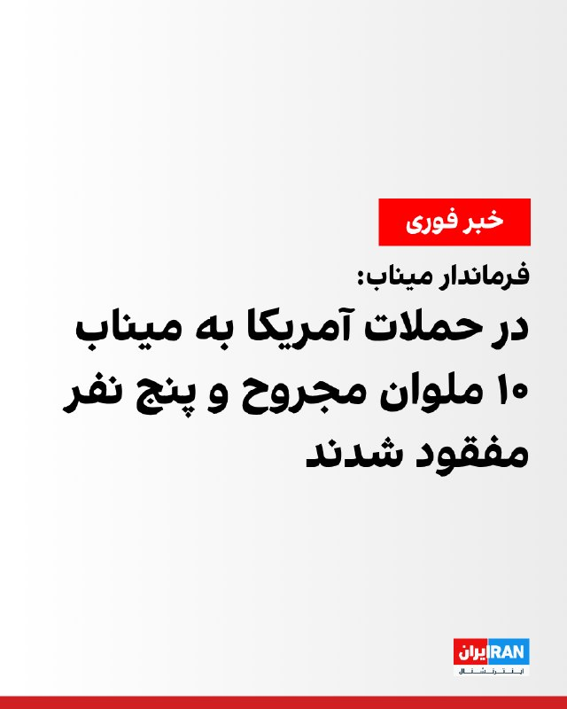

فرماندار میناب گفت در جریان حمله آمریکا به یک شناور در نزدیکی آب‌های این شهرستان، ۱۰ نفر از ۱۵ ملوان حاضر در لنج مصدوم و به بیمارستان منتقل شدند و گروه‌های تجسس در حال تلاش برای اطلاع از وضعیت دیگر ملوانان هستند.

شامگاه پنجشنبه خبرگزاری فارس، وابسته به سپاه پاسداران گزارش داد که بررسی‌ها در بندرعباس نشان می‌دهد در جریان تبادل آتش میان نیروهای مسلح جمهوری اسلامی و دشمن، بخش‌های تجاری اسکله بهمن هدف قرار گرفته است.

ستاد فرماندهی مرکزی ایالات متحده (سنتکام) نیز اعلام کرد نیروهای آمریکایی حملات موشکی، پهپادی و قایق‌های تندرو جمهوری اسلامی در تنگه هرمز را رهگیری کرده و در پاسخ، منابع این حملات در داخل ایران را هدف قرار دادند.
https://iranintl.com/202605080031

## IranIntlTV — post 336137

  <a href="telegram/content/IranIntlTV_336137_1778250211.mp4">🎬 Download video</a>

یک شهروند با ارسال پیامی به ایران‌اینترنشنال از گرانی چندبرابری محصولات بهداشتی خبر می‌دهد و می‌گوید هر کاندوم کدکس در ایران قیمتش به حدود ۲۷ هزار تومان رسیده است.

## IranIntlTV — post 336135

  <a href="telegram/content/IranIntlTV_336135_1778250213.mp4">🎬 Download video</a>

حملات سپاه پاسداران به مواضع احزاب کرد ایرانی در اقلیم کردستان ادامه دارد. یک مقام حزب دموکرات کردستان ایران در گفت‌وگو با ایران‌اینترنشنال تایید کرد نیروهای آمریکایی در سرنگون کردن شماری از موشک‌ها و پهپادهای شلیک‌شده از سوی سپاه به اقلیم کردستان عراق مشارکت داشته‌اند.
جزییات بیشتر با تروسکه صادقی، خبرنگار ایران‌اینترنشنال
@iranintltv

## IranIntlTV — post 336134

  <a href="telegram/content/IranIntlTV_336134_1778250216.mp4">🎬 Download video</a>

فدراسیون فوتبال گامبیا از برگزاری دیدار دوستانه با تیم فوتبال ایران خبر داد. این در حالی است که پیش‌تر بازی‌های تدارکاتی ایران با مقدونیه و آنگولا لغو شده بود. گامبیا در جایگاه ۱۱۶ رده‌بندی فیفا قرار دارد.
گفت‌وگو با احسان اکبری، عضو تحریریه ایران‌اینترنشنال
@iranintltv

## IranIntlTV — post 336133

  

مارکو روبیو، وزیر خارجه ایالات متحده که به ایتالیا سفر کرده، گفت که ما کنترل تنگه هرمز توسط جمهوری اسلامی را نخواهیم پذیرفت و همچنین همه موافقند که داشتن سلاح هسته‌ای از سوی جمهوری اسلامی غیرقابل قبول است.»

او در خصوص مذاکرات با دولت لبنان نیز گفت: «ما می‌خواهیم دولت مشروع لبنان قوی باشد و حزب‌الله مانعی برای این امر است.»

روبیو ادامه داد: «حزب‌الله کاملا یک نیروی نیابتی جمهوری اسلامی است و بدون آنها وجود نخواهد داشت.»
روبیو تاکید کرد که ما در تلاشیم تا تامین مالی حزب‌الله را متوقف کنیم.
https://iranintl.com/202605082560

## Shin_Persian — post 5892

Shin ✓ @hey_itsmyturn
Fri, 08 May 2026 13:15:06 UTC

Several aircraft, according to the eyewitness "unmarked", were spotted over Zanjan earlier today, the eyewitness counted 8 aircraft.

[Looks like A340 to me]
Zanjan Province, #Iran

فارسی

چندین فروند هواپیما، که طبق گفته شاهد عینی «بدون علامت» بودند، ساعاتی پیش در آسمان زنجان دیده شدند؛ این شاهد عینی ۸ فروند هواپیما را شمارش کرده است.

[به نظر من شبیه A340 هستند]
استان زنجان، #Iran_

𝕏 · @shin_persian

## Shin_Persian — post 5891

Jennifer Griffin ✓ @JenGriffinFNC
Fri, 08 May 2026 12:58:25 UTC

NEW: US military carried out more airstrikes today hitting several empty tankers trying to break the blockade.

According to a senior US official:
“these were Very Large Crude Carriers (VLCC) .... massive, empty ships trying to make it back to Iran ... attempted to run the blockde...”

فارسی

جدید: ارتش ایالات متحده امروز حملات هوایی بیشتری انجام داد و چندین نفت‌کش خالی را که قصد شکستن محاصره را داشتند، هدف قرار داد.

به گفته یک مقام ارشد آمریکایی:
«این‌ها نفت‌کش‌های غول‌پیکر (VLCC) بودند .... کشتی‌های عظیم و خالی که سعی داشتند به ایران بازگردند ... قصد داشتند از محاصره عبور کنند...»

𝕏 · @shin_persian

## Shin_Persian — post 5890

  

U.S. Central Command ✓ @CENTCOM
Fri, 08 May 2026 11:59:50 UTC

There are currently more than 70 tankers that U.S. forces are preventing from entering or leaving Iranian ports. These commercial ships have the capacity to transport over 166 million barrels of Iranian oil worth an estimated $13 billion-plus.

فارسی

در حال حاضر بیش از ۷۰ نفتکش وجود دارد که نیروهای ایالات متحده از ورود یا خروج آن‌ها از بنادر ایران جلوگیری می‌کنند. این کشتی‌های تجاری ظرفیت حمل بیش از ۱۶۶ میلیون بشکه نفت ایران به ارزش تخمینی بیش از ۱۳ میلیارد دلار را دارند.

𝕏 · @shin_persian

## Shin_Persian — post 5889

Open Source Intel ✓ @Osint613
Fri, 08 May 2026 12:12:53 UTC

Secretary of State Rubio says the U.S. expects a response from Iran today.

فارسی

روبیو، وزیر امور خارجه، می‌گوید ایالات متحده انتظار دارد ایران امروز پاسخ دهد.

𝕏 · @shin_persian

## Iliaen — post 4434

گزارش‌ها از دو انفجار در اسکله طاهرویی (هرمزگان) حکایت دارد.

@iliaen

## ManotoTV — post 105146

  <a href="telegram/content/ManotoTV_105146_1778250220.mp4">🎬 Download video</a>

سخنگوی وزارت امور خارجه جمهوری اسلامی اعلام کرد که اقدام انجام‌شده از سوی آمریکا در شب گذشته، هم «نقض آشکار حقوق بین‌الملل» بوده و هم «نقض آتش‌بس».
او در ادامه گفت «نیروهای مسلح ایران در پاسخ ضربه سنگینی به دشمن وارد کرده‌اند» و با تمام توان، «تحرکات و اقدامات طرف مقابل را دفع کرده‌اند».
بقایی همچنین تأکید کرد که ایران در وضعیت «آتش‌بس اسمی» قرار دارد.
او درباره مذاکرات نیز گفت که پیشنهاد ارائه‌شده از سوی آمریکا در حال بررسی است و در صورت رسیدن به نتیجه نهایی، به‌طور رسمی اعلام خواهد شد.

## ManotoTV — post 105145

  <a href="telegram/content/ManotoTV_105145_1778250221.mp4">🎬 Download video</a>

«صدای علی صفری باشید»

## ManotoTV — post 105144

  <a href="telegram/content/ManotoTV_105144_1778250223.mp4">🎬 Download video</a>

خبرگزاری‌های داخلی از قول فرماندار میناب گزارش داده‌اند پیکر یکی از پنج ملوان مفقود شده دیشب در پی حملات آمریکا پیدا شده‌است. فرماندار میناب پیش‌تر اعلام کرده بود در جریان حملات آمریکا در آب‌های تنگه هرمز و دریای مکران که شب گذشته صورت گرفته، یک شناور باری در نزدیکی آب‌های میناب مورد هدف قرار گرفته و دچار آتش‌سوزی شده است. بر پایه این اعلام در این لنج، ۱۵ ملوان حضور داشتند که ۱۰ تن از آن‌ها مصدوم و پنج نفر مفقود شده‌ بودند که اکنون اعلام شده یکی از آن‌ها کشته شده‌اند.

## ManotoTV — post 105143

  <a href="telegram/content/ManotoTV_105143_1778250223.mp4">🎬 Download video</a>

خبرگزاری مهر گزارش داده عصر جمعه در محدوده شهرستان سیریک صدای انفجار گزارش شده است. هنوز ماهیت این صداها مشخص نشده است و نهادهای رسمی در این خصوص اظهار نظر نکرده‌اند.

## ManotoTV — post 105142

  <a href="telegram/content/ManotoTV_105142_1778250224.mp4">🎬 Download video</a>

تانکرترکرز که به رصد حرکت شناورها می‌پردازد در گزارشی به وضعیت Ocean Koi نفت‌کش توقیف شده توسط ارتش پرداخته است. در این گزارش آمده نام این شناور در واقع JIN LI 9255933 است و از تاریخ ۳۰ نوامبر ۲۰۲۵ با این نام فعالیت می‌کرده است. بر اساس داده‌های موجود، این نفتکش از سال ۲۰۲۱ تاکنون دست‌کم در ۱۶ مورد محموله‌های مختلف هیدروکربنی ایران را حمل کرده است؛ موضوعی که به گفته منابع، با آگاهی کامل ایران انجام شده، زیرا نیمی از بارگیری‌ها در بنادر ایران و نیمی دیگر از طریق انتقال کشتی به کشتی در دریا صورت گرفته است.
در اداکه گزارش آمده گفته می‌شود مالکیت این نفتکش در شانگهای چین مستقر است و همچنین یادآوری شده این کشتی در تاریخ ۲۵ فوریه ۲۰۲۶ توسط دفتر کنترل دارایی‌های خارجی آمریکا تحریم شده است.
در پایان این گزارش تانکرترکرز گفته گزارش صدا و سیما از توقیف این نفتکش چیزی جز نمایش نیست. در گزارش صدا و سیما آمده تکاوران نیروی دریایی ارتش با «عملیات ویژه» این نفتکش را به دلیل «تلاش برای اختلال در صادرات نفت ایران و آسیب به منافع ملی» توقیف کردند؛ محموله نفت روی آن متعلق به ایران بوده، به سواحل جنوبی ایران هدایت و به مقامات قضایی تحویل داده شده است.

## ManotoTV — post 105141

  <a href="telegram/content/ManotoTV_105141_1778250226.mp4">🎬 Download video</a>

مارکو روبیو، وزیر خارجه آمریکا، پس از پایان سخنانش در جمع خبرنگاران در ایتالیا، بار دیگر بر موضع واشنگتن تأکید کرد که نیروهای نظامی این کشور در جریان درگیری‌های شب گذشته در تنگه هرمز، در چارچوب «دفاع از خود» عمل کرده‌اند.
او گفت: «آنچه دیروز دیدید این بود که ناوشکن‌های آمریکایی در آب‌های بین‌المللی در حال حرکت بودند و از سوی ایران به آن‌ها شلیک شد و آمریکا برای حفاظت از خود پاسخ دفاعی داد.»
روبیو افزود: «ما شلیک نکردیم، آن‌ها به ما شلیک کردند.»
طبق گزارش‌ها، هم آمریکا و هم جمهوری اسلامی اعلام کرده‌اند که شب گذشته در منطقه تنگه هرمز به یکدیگر حمله کرده‌اند.
ارتش آمریکا گفته است نیروهایش «حملات بدون تحریک ایران» را که سه ناوشکن نیروی دریایی را هدف قرار داده بود رهگیری کرده و در پاسخ، مواضع پرتاب این حملات در داخل ایران را هدف قرار داده است.
در مقابل، تهران پیش‌تر اعلام کرده بود که در پاسخ به آنچه «نقض آتش‌بس توسط واشنگتن» و هدف قرار گرفتن «مناطق غیرنظامی» خوانده، به شناورهای نظامی آمریکا حمله کرده و «خسارات قابل توجهی» به آن‌ها وارد کرده است. فرماندار میناب نیز اعلام کرده در جریان حملات آمریکا در آب‌های تنگه هرمز و دریای مکران که شب گذشته صورت گرفته، یک شناور باری در نزدیکی آب‌های میناب مورد هدف قرار گرفته و دچار آتش‌سوزی شده است. بر پایه این اعلام در این لنج، ۱۵ ملوان حضور داشتند که ۱۰ تن از آن‌ها مصدوم و پنج نفر مفقود شده‌اند.

## ManotoTV — post 105140

  <a href="telegram/content/ManotoTV_105140_1778250227.mp4">🎬 Download video</a>

مارکو روبیو، وزیر خارجه آمریکا، در گفت‌وگو با خبرنگاران در رم اعلام کرد ایالات متحده هیچ‌گونه مذاکره‌ای با حزب‌الله انجام نخواهد داد و تمرکز خود را بر گفت‌وگو با دولت لبنان قرار داده است.
او تأکید کرد که سیاست واشنگتن در این زمینه تغییر نکرده و مسیر دیپلماتیک تنها از طریق دولت رسمی لبنان دنبال خواهد شد.

## ManotoTV — post 105139

  <a href="telegram/content/ManotoTV_105139_1778250228.mp4">🎬 Download video</a>

فرماندار میناب اعلام کرده در جریان حملات آمریکا در آب‌های تنگه هرمز و دریای مکران که شب گذشته صورت گرفته، یک شناور باری در نزدیکی آب‌های میناب مورد هدف قرار گرفته و دچار آتش‌سوزی شده است. بر پایه این اعلام در این لنج، ۱۵ ملوان حضور داشتند که ۱۰ تن از آن‌ها مصدوم و پنج نفر مفقود شده‌اند.

## ManotoTV — post 105138

  <a href="telegram/content/ManotoTV_105138_1778250229.mp4">🎬 Download video</a>

مارکو روبیو، وزیر خارجه آمریکا، در رم اعلام کرد واشنگتن انتظار دارد امروز از جمهوری‌اسلامی درباره مذاکرات مربوط به پایان جنگ پاسخ دریافت کند. او گفت: «امیدوارم این یک پیشنهاد جدی باشد.»
روبیو همچنین افزود اگر گزارش‌ها درباره تلاش تهران برای ایجاد یک نهاد جدید جهت کنترل ترافیک کشتیرانی و دریافت عوارض در تنگه هرمز صحت داشته باشد، این موضوع برای آمریکا «غیرقابل قبول» خواهد بود.

## ManotoTV — post 105137

  <a href="telegram/content/ManotoTV_105137_1778250229.mp4">🎬 Download video</a>

بررسی‌ها نشان می‌دهد نفتکش Ocean Koi توقیف شده توسط ارتش در نزدیکی تنگه هرمز، بخشی از «ناوگان سایه» جمهوری‌اسلامی بوده و از سال ۲۰۲۰ در حمل نفت ایران فعالیت داشته. آمریکا در فوریه ۲۰۲۶ آن را تحریم کرده بود. این نفتکش با پرچم باربادوس و مالک/اپراتور آن شرکت Ocean Kudos Shipping (مستقر در جزایر مارشال، با ارتباط چینی) ثبت شده است
طبق اعلام رسمی ارتش، تکاوران نیروی دریایی ارتش با «عملیات ویژه» این نفتکش را به دلیل «تلاش برای اختلال در صادرات نفت ایران و آسیب به منافع ملی» توقیف کردند. خبرگزاری مهر نیز گزارش داده محموله نفت روی آن متعلق به ایران بوده است. در بیانیه ارتش آمده کشتی به سواحل جنوبی ایران هدایت و به مقامات قضایی تحویل داده شده است.

## ManotoTV — post 105136

  <a href="telegram/content/ManotoTV_105136_1778250230.mp4">🎬 Download video</a>

جورجیا ملونی، نخست‌وزیر ایتالیا، امروز با مارکو روبیو، وزیر خارجه آمریکا، دیدار کرد؛ در شرایطی که روابط دولت او با دولت دونالد ترامپ به‌دلیل جنگ با ایران دچار تنش کم‌سابقه‌ای شده است. ملونی که پیش‌تر از نزدیک‌ترین متحدان ترامپ در اروپا محسوب می‌شد، گفته بود جنگی که در ۲۸ فوریه آغاز شده «غیرقانونی» است. او همچنین اظهارات انتقادی ترامپ علیه پاپ لئون چهاردهم را «غیرقابل قبول» توصیف کرده بود. مارکو روبیو در سفری دو روزه به ایتالیا حضور دارد. سفری که هدف آن کاهش تنش‌ها با پاپ پس از حملات بی‌سابقه ترامپ به او و همچنین رسیدگی به نارضایتی واشنگتن از مخالفت ایتالیا با حمایت از جنگ آمریکا و اسرائیل علیه ایران عنوان شده است.

## FarsiVOA — post 217194

چگونه «امارات متحده عربی» از متحد مالی و اقتصادی جمهوری اسلامی به «دشمن» تبدیل شد؛ گفت‌وگو با یاسین اهوازی

## FarsiVOA — post 217193

دونالد ترامپ: به رغم تبادل آتش تازه بین دو کشور، ما همچنان در حال مذاکره با ایرانی‌ها هستیم

## FarsiVOA — post 217192

مدیرعامل شرکت غول نفتی «شِل» می‌گوید بازار نفت با کمبودی نزدیک به یک میلیارد بشکه روبه‌رو است؛ رقمی که معادل ۱۰ روز مصرف جهانی نفت است.

خبرگزاری بلومبرگ روز پنج‌شنبه گزارش داده بود که تولید روزانه نفت اوپک در ماه گذشته به حدود ۲۰ میلیون بشکه سقوط کرده که کمترین سطح طی ۳۶ سال گذشته است.

قیمت‌های جهانی نفت نیز از زمان انسداد تنگه هرمز توسط جمهوری اسلامی و حملات گسترده به کشورهای عرب منطقه بیش از ۳۰ درصد افزایش یافته است.

تنگه هرمز پیش از انسداد، محل عبور ۲۰ درصد از نفت، محصولات نفتی و گاز مایع مصرفی جهان بود.

گزارش کامل را در وب‌سایت صدای آمریکا بخوانید.

@FarsiVOA

## FarsiVOA — post 217191

  <a href="telegram/content/FarsiVOA_217191_1778250232.mp4">🎬 Download video</a>

یک مخاطب صدای آمریکا از ارومیه می‌گوید فشار تورم و بحران اقتصادی زندگی خانواده‌اش را به مرز فروپاشی رسانده است. او می‌گوید همسرش به دلیل رکود بازار، مغازه لوازم خانگی خود را تعطیل کرده و درآمد شغل پرستاری او نیز دیگر پاسخگوی هزینه‌های زندگی نیست.

## FarsiVOA — post 217190

  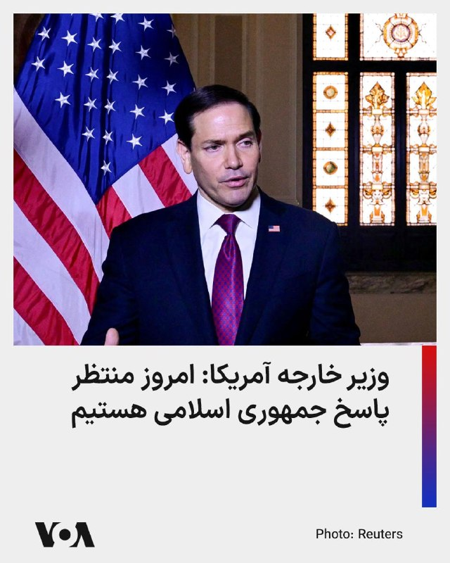

مارکو روبیو، وزیر امور خارجه ایالات متحده هرگونه تلاش جمهوری اسلامی ایران برای ایجاد نهادی جهت کنترل تردد در تنگه هرمز را «غیرقابل‌قبول» خواند.
آقای روبیو که در ایتالیا حضور دارد، به پیگیری روند دیپلماتیک برای پایان دادن به جنگ اشاره کرد و از انتظار واشینگتن برای دریافت پاسخ حکومت ایران در روز جمعه ۱۸ اردیبهشت خبر داد: «ما در مقطعی از امروز منتظر دریافت پاسخ از سوی آن‌ها هستیم. هنوز پاسخی دریافت نکرده‌ایم... من امیدوارم که این یک پیشنهاد جدی باشد؛ واقعاً امیدوارم.»

## FarsiVOA — post 217189

تحریم‌ها و محاصره دریایی نمی‌تواند جمهوری اسلامی را از پا درآورد؛ گفت‌وگو با بهزاد احمدی‌نیا

## DW_Farsi — post 124448

🔶 ترامپ برای اجرای توافق گمرکی به اتحادیه اروپا مهلت داد

دونالد ترامپ، رئیس‌جمهور آمریکا که پیش از این مدعی شده بود، اتحادیه اروپا به توافق تجاری که پیش‌تر میان دو طرف نهایی شده بود پایبند نیست در پیامی در شبکه تروث سوشال این اتحادیه را تهدید کرده است.

او در این پیام به اتحادیه اروپا تا ۲۵۰مین سالروز تأسیس ایالات متحده در چهارم ژوئیه مهلت داده تا تعهدات خود در زمینه این توافق تعرفه‌ای را انجام دهد.

ترامپ تهدید کرد که در غیر این صورت تعرفه‌ها "بلافاصله به سطح بسیار بالاتری افزایش خواهند یافت."

این تهدید پس از آن مطرح شد که ترامپ گفت‌، "گفت‌‌وگوی بسیار خوبی" با اورزولا فون در لاین، رئیس کمیسیون اروپا در این زمینه داشته است.

فون در لاین نیز در بیانیه‌ای از مکالمه تلفنی "بسیار خوب" با رئیس‌جمهور آمریکا سخن گفت و افزود، هر دو طرف کماکان بر پایبندی دوجانبه به اجرای کامل توافق‌نامه تجاری تاکید دارند.

این سیاستمدار ۶۷ ساله اروپا افزود: «پیشرفت‌های خوبی در جهت کاهش تعرفه‌ها تا اوایل ژوئیه در حال انجام است.»

هفته گذشته دونالد ترامپ اتحادیه اروپا را متهم کرده بود که به طور کامل به توافق گمرکی مذاکره‌شده پایبند نیست و به همین دلیل قصد دارد، تعرفه واردات خودرو و کامیون از اتحادیه اروپا به ایالات متحده را از ۱۵ درصد به ۲۵ درصد افزایش دهد.

چنین افزایش تعرفه‌ای بیش از همه به اقتصاد آلمان ضربه خواهد زد.

ترامپ در پست خود جزئیات بیش‌تری درباره اینکه در صورت عدم تصویب توافق‌نامه تجاری تا آن زمان، دقیقا کدام تعرفه‌ها را از تابستان افزایش خواهد داد، ارائه نکرد.

در میانه ماه اوت سال گذشته، رئیس‌جمهور آمریکا و اورزولا فون در لاین در چارچوبی بر سر تعیین سقف ۱۵ درصدی برای بیش‌تر کالاهای وارداتی از اتحادیه اروپا به آمریکا به توافق رسیده بودند. این نرخ قرار بود برای خودروها و قطعات خودرو از اروپا نیز اعمال شود.

در مقابل، اتحادیه اروپا متعهد شده بود تعرفه‌های خود بر کالاهای صنعتی آمریکا را حذف کند و دسترسی محصولات کشاورزی آمریکا مانند گوشت خوک و لبنیات را به بازار خود آسان‌تر سازد.
@dw_farsi

## DW_Farsi — post 124447

🔶 صادرات آلمان به آمریکا به‌طور چشمگیری سقوط کرد

صادرات شرکت‌های آلمانی به بازار آمریکا در ماه مارس سال ۲۰۲۶ به شدیدترین شکل از زمان بحران کرونا در شش سال پیش کاهش یافت. اداره آمار فدرال آلمان اعلام کرد صادرات به بزرگ‌ترین اقتصاد جهان نسبت به ماه مشابه سال گذشته ۲۱٫۴ درصد کاهش داشته است.

آخرین بار که کاهش شدیدتری ثبت شده بود به ژوئن ۲۰۲۰ برمی‌گردد؛ زمانی که همه‌گیری کرونا اختلالات گسترده‌ای ایجاد کرده بود و صادرات ۲۷٫۴ درصد افت کرده بود. همچنین در مقایسه با فوریه نیز صادرات به آمریکا با کاهش قابل‌توجه ۷٫۹ درصدی به ۱۱٫۲ میلیارد یورو رسید.

با وجود این، آمریکا همچنان مهم‌ترین بازار خارجی صنعت آلمان باقی مانده است. صنعت آلمان در ماه مارس برخلاف انتظار سفارش‌های زیادی دریافت کرد، اما عمدتاً از منطقه اتحادیه اروپا بوده است.

توماس گیتسل، اقتصاددان ارشد بانک VP، کاهش تقاضا از سوی آمریکا را نتیجه مستقیم سیاست‌های تعرفه‌ای دونالد ترامپ دانست و گفت این سیاست‌ها "آثار ترمزکننده آشکاری" بر جا گذاشته‌اند.

سباستین دولین، مدیر علمی مؤسسه اقتصاد کلان و پژوهش‌های چرخه اقتصادی (IMK)، نیز از "فروپاشی چشمگیر صادرات آلمان به آمریکا" سخن گفت. او افزود: «صادرات به ایالات متحده در مقایسه سالانه بیش از یک‌پنجم کاهش یافته؛ افتی که از نظر تاریخی معمولاً فقط در دوران بحران‌های شدید مانند اوج همه‌گیری کرونا دیده می‌شود.» او تأکید کرد: «پیامدهای مخرب سیاست‌های ترامپ را می‌توان به‌وضوح در اینجا مشاهده کرد.»

مؤسسه اقتصاد جهانی کیل (IfW) همچنین به کاهش شدید ارزش دلار اشاره کرد. این مسئله باعث گران‌تر شدن کالاهای وارداتی آلمان در آمریکا شده و توان رقابتی آن‌ها را کاهش داده است. در حال حاضر هر یورو حدود ۱٫۱۷۴۵ دلار ارزش دارد که نسبت به یک سال قبل حدود پنج درصد افزایش نشان می‌دهد.

کارشناسان انتظار ندارند که تجارت با آمریکا به‌زودی بهبود یابد، به‌ویژه اینکه ترامپ تهدید کردهتعرفه واردات خودرو از اتحادیه اروپا را افزایش خواهد داد.

این تعرفه‌ها ممکن است از ۱۵ درصد به ۲۵ درصد برسند و تجارت مهم خودروسازان اروپایی با آمریکا را به‌شدت تحت تأثیر قرار دهند. نیلز یانسن، کارشناس اقتصادی IfW، گفت این اقدام موقعیت رقابتی تولیدکنندگان اروپایی را در برابر شرکت‌های سایر کشورها تضعیف خواهد کرد.
@dw_farsi

## DW_Farsi — post 124437

📸 ایران هفتاد روز در خاموشی قطع اینترنت؛ امنیت یا تبعیض؟

بر اساس تازه‌ترین گزارش نت‌بلاکس، نهاد بین‌المللی پایش وضعیت اینترنت در جهان، قطعی اینترنت در ایران وارد هفتادمین روز شده است. دسترسی به اینترنت آزاد حق هرشهروندی است، اما حالا شاهد ظهور یک تبعیض جدید هستیم: "اینترنت برای ثروتمندان یا خواص نظام". اینکه عده‌ای با پرداخت مبالغ کلان صاحب اینترنت بدون محدودیت می‌شوند، نشان می‌دهد که بهانه‌های امنیتی فقط برای قشر نابرخوردار صادق است. فروختن حقی که قبلاً سلب شده، از سوی بسیاری توجیهی ندارد. از این رو، اینترنت طبقاتی تیر خلاصی بر پیکر عدالت اجتماعی شمرده می‌شود.

در این مطلب شماری از نظرهای کاربران را گرد آورده‌ایم که در میانه این محدودیت‌ها به شبکه جهانی پیوسته و اعتراض خود را بیان کرده‌اند.

گالری عکس را ببینید و نظرات را بخوانید.

@dw_farsi

## DW_Farsi — post 124436

  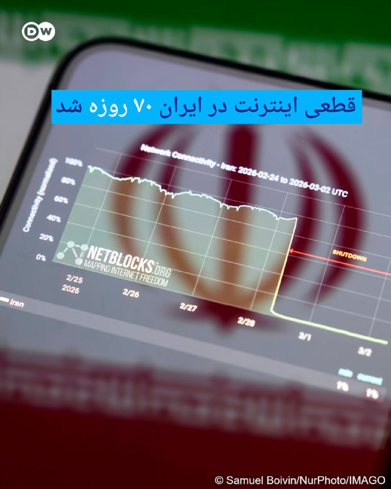

🔶 قطعی اینترنت در ایران ۷۰ روزه شد

نت‌بلاکس، یک گروه ناظر اینترنت در عرصه بین‌المللی، اعلام کرده است که قطع گسترده اینترنت در ایران وارد روز هفتادم شده و دسترسی بخش‌های بزرگی از جمعیت را در شرایط جنگی مختل کرده است.

بر اساس گزارش این گروه، این اختلال تاکنون بیش از ۱۶۵۶ ساعت ادامه داشته است. NetBlocks روز جمعه ۸ مه (۱۸ اردیبهشت) در شبکه اجتماعی "ایکس" نوشت که این قطعی از زمان حملات آمریکا و اسرائیل به تهران و بی‌ثباتی منطقه آغاز شده است.

این نهاد تأکید کرده است: «اتصال دیجیتال در زمان بحران حیاتی است» و محدود کردن اینترنت بیشترین آسیب را به افراد دارای معلولیت، دانش‌آموزان، کسب‌وکارهای کوچک و عموم مردم وارد می‌کند.

در ادامه گزارش آمده است که ایران پیش‌تر، یعنی در دیماه سال گذشته و هم‌زمان با سرکوب گسترده اعتراضات ضد دولتی که به گفته ناظران، شدیدترین سرکوب از زمان تأسیس جمهوری اسلامی بوده است، نیز قطعی اینترنت سراسری را برای حدود ۹۲ میلیون نفر اعمال کرده بود.
@dw_farsi

## DW_Farsi — post 124435

  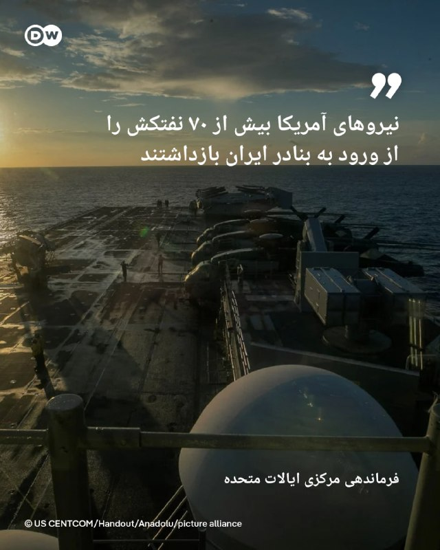

🔶 سنتکام: نیروهای آمریکا بیش از ۷۰ نفتکش را از ورود به بنادر ایران بازداشتند

فرماندهی مرکزی ایالات متحده (CENTCOM) اعلام کرد که روز جمعه ۸ مه (۱۸ اردیبهشت) بیش از ۷۰ نفتکش از ورود به بنادر ایران یا خروج از آن‌ها بازداشته شده‌اند.

سنتکام در پیامی در شبکه اجتماعی "ایکس" نوشت: «این کشتی‌های تجاری ظرفیت حمل بیش از ۱۶۶ میلیون بشکه نفت ایران را دارند که ارزش آن بیش از ۱۳ میلیارد دلار برآورد می‌شود.»
@dw_farsi

## DW_Farsi — post 124434

  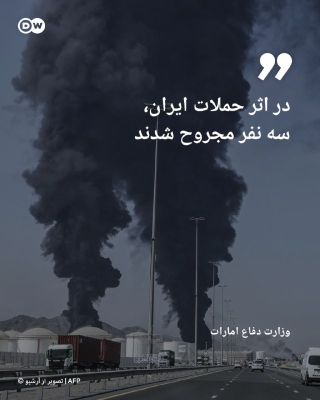

🔶 امارات از "مجروح شدن سه نفر در اثر حملات ایران" خبر داد

نیروهای پدافند هوایی امارات متحده عربی اعلام کردند که دو موشک بالستیک و سه پهپاد را که به گفته آن‌ها از سوی ایران شلیک شده بود، رهگیری و منهدم کرده‌اند.

بر اساس اطلاعیه وزارت دفاع امارات در شبکه اجتماعی "ایکس"، این پرتابه‌ها پیش از اصابت توسط سامانه‌های دفاعی این کشور ساقط شدند. با این حال، گزارش شده است که در نتیجه این حادثه سه نفر زخمی شده‌اند.

این رویداد در ادامه تنش‌های منطقه‌ای و تبادل حملات میان طرف‌های مختلف رخ داده است. جزئیات بیشتری درباره اهداف احتمالی حمله یا وضعیت دقیق مجروحان هنوز منتشر نشده است.

بنا بر بیانیه امارات، از آغاز حملات ایران علیه این کشور، سامانه‌های پدافند هوایی این کشور در مجموع ۵۵۱ موشک بالستیک، ۲۹ موشک کروز و ۲۲۶۳ پهپاد (UAV) را رهگیری و منهدم کرده‌اند.

مجموع تعداد مجروحان حملات یادشده به ۲۳۰ نفر رسیده است که از ملیت‌های مختلفی هستند.

تعداد کل کشته‌های نظامی امارات به سه نفر رسیده است که بر اساس بیانیه یادشده شامل یک غیرنظامی مراکشی بوده که در نیروهای مسلح مشغول به کار بوده است.
@dw_farsi

## DW_Farsi — post 124433

  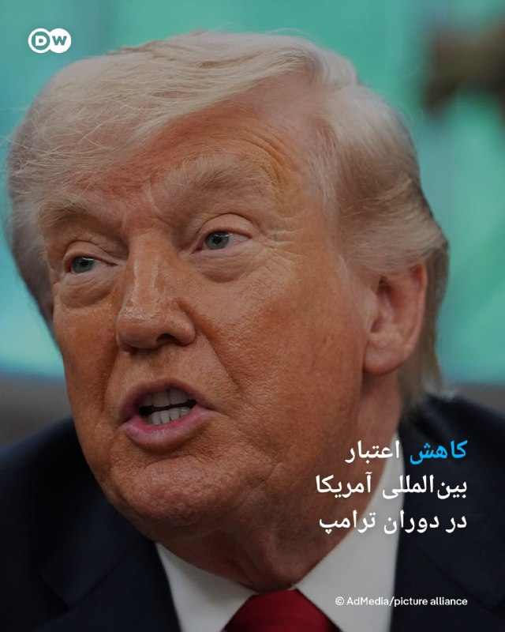

🔶 کاهش اعتبار بین‌المللی آمریکا در دوران ترامپ

بر اساس یک نظرسنجی، وجهه بین‌المللی آمریکا در دوران ریاست‌جمهوری دونالد ترامپ به‌شدت کاهش یافته است.

مطالعه سالانه «شاخص ادراک دموکراسی» (Democracy Perception Index) که روز جمعه ۸ مه (۱۸ اردیبهشت) منتشر شد، نشان می‌دهد ایالات متحده در اروپا بیش از هر منطقه دیگری با نگاه منفی مواجه است. همچنین در این گزارش آمده که چین اکنون به طور متوسط در تمام مناطق جهان تصویر مثبت‌تری نسبت به آمریکا دارد.

در این نظرسنجی که توسط سازمان "ائتلاف دموکراسی‌ها" متعلق به آندرس فوگ راسموسن، دبیرکل پیشین ناتو، در بهار امسال انجام شد، شاخص محبوبیت جهانی آمریکا از منفی ۵ درصد در سال گذشته به منفی ۱۶ درصد سقوط کرده است.

به این ترتیب، حتی روسیه با امتیاز منفی ۱۱ درصد نیز به طور متوسط محبوب‌تر از آمریکا ارزیابی شده است. تنها کشورهایی که وضعیت بدتری از آمریکا داشته‌اند عبارت‌اند از اسرائیل، کره شمالی، افغانستان و ایران.
@dw_farsi

## DW_Farsi — post 124432

🔶 جمهوری اسلامی از توقیف یک نفت‌کش در خلیج عمان خبر داد

ایران روز جمعه یک نفتکش به نام "اوشن کوئی" را در خلیج عمان به دلیل تلاش ادعایی برای مختل کردن صادرات نفت ایران توقیف کرد. رسانه‌های دولتی ایران به نقل از بیانیه ارتش این خبر را اعلام کردند.

در این بیانیه آمده است که این نفتکش با پرچم باربادوس، حامل نفت ایران بوده و «با سوءاستفاده از شرایط منطقه‌ای قصد آسیب رساندن و اخلال در صادرات نفت» را داشته است.

بر اساس گزارش رسانه‌های دولتی، این نفتکش که از ماه فوریه تحت تحریم‌های آمریکا قرار داشته، به سواحل جنوبی ایران هدایت و به مقامات قضایی تحویل داده شده است.

این توقیف پس از درگیری میان نیروهای آمریکا و ایران در تنگه هرمز رخ داد؛ گذرگاهی که خلیج فارس را به خلیج عمان متصل می‌کند.

ایران از زمان آغاز جنگ آمریکا و اسرائیل علیه ایران در ۲۸ فوریه، تا حد زیادی این آبراه باریک را که محل عبور حدود یک‌پنجم جریان نفت جهان است، مسدود کرده است.
@dw_farsi

## DW_Farsi — post 124431

🔶آیا ویروس هانتا کابوس کرونا را زنده خواهد ساخت؟

خبرهای حاکی از مرگ سه نفر از مسافران یک کشتی تفریحی متعلق به یک شرکت هلندی در آب‌های اقیانوس اطلس بر اثر ابتلا به ویروس هانتا (Hantavirus) بسیاری را دل‌نگران کرده است؛ آن هم در شرایطی که هنوز خاطرات مربوط به همه‌گیری جهانی ابتلا به ویروس کرونا از ذهن‌ها پاک نشده است.

با این حال سازمان جهانی بهداشت شیوع مرگبار ویروس هانتا در کشتی تفریحی "ام‌وی هوندیوس" (MV Hondius) را آغاز یک پاندمی جدید تلقی نمی‌کند.

ماریا فن‌ کرک‌هوفه، هماهنگ‌کننده کمک‌های اضطراری این سازمان، در جمع خبرنگاران در ژنو تصریح کرد: «این کووید نیست. این یک ویروس کاملاً متفاوت است.»

همچنین رومان ولفل، رئیس مؤسسه میکروبیولوژی ارتش آلمان، در مصاحبه با شبکه "تاگس شاو ۲۴" گفت که هانتا به اندازه "سارس-کوو-۲"، ویروس عامل بیماری کووید ـ ۱۹ یا کرونا و ویروس‌های آنفلوانزا مسری نیست و برای انتقال آن، نیاز به تماسی بسیار نزدیک‌تر است.

سازمان جهانی بهداشت به دلیل دوره نهفتگی یا کمون طولانی‌مدت شش هفته‌ای این ویروس احتمال بروز موارد بیشتری از ابتلا را رد نمی‌کند.

اما عبدی رحمان محمود، رئیس بخش هشدار و واکنش اضطراری این سازمان، تأکید کرده که به اعتقاد او، این یک شیوع محدود خواهد بود، البته "به شرطی که اقدامات حفاظتی بهداشت عمومی اجرا شود و همه کشورها همبستگی نشان دهند."

تا کنون ابتلای پنج نفر به ویروس هانتا تأیید شده است. طبق اعلام سازمان جهانی بهداشت، علاوه بر این موارد، سه مورد مشکوک نیز وجود دارد.

تا کنون سه نفر، شامل یک زوج مسن هلندی و یک زن آلمانی جان خود را از دست داده‌اند.

کشتی هلندی یادشده که با حدود ۱۵۰ سرنشین چندین روز در نزدیکی کشور جزیره‌ای کیپ‌ورد (دماغه‌سبز) لنگر انداخته بود، روز چهارشنبه ششم مه مسیر خود را به سمت جزیره تنریف، از مجمع‌الجزایر قناری اسپانیا تغییر داد و طبق اعلام دولت این کشور، انتظار می‌رود روز یکشنبه ۱۰ مه به بندر گرانادیا در این جزیره برسد.
@dw_farsi

## Persian_Trend_Official — post 13704

  <a href="telegram/content/Persian_Trend_Official_13704_1778250237.mp4">🎬 Download video</a>

🔴سنتکام از هدف قرار دادن دو نفتکش جمهوری اسلامی خبر داد 💢فرماندهی مرکزی ایالات متحده (CENTCOM) اعلام کرد که سه نفت‌کش بدون بار با پرچم ایران را در خلیج عمان غیرفعال کرده است تا اجرای محاصره دریایی بنادر ایران را حفظ کند. 💢جت‌های F/A-18 Super Hornet از…

## Persian_Trend_Official — post 13703

  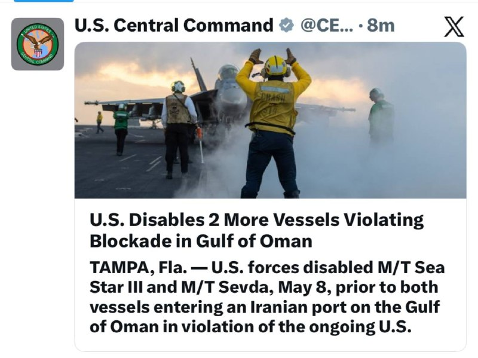

🔴سنتکام از هدف قرار دادن دو نفتکش جمهوری اسلامی خبر داد

💢فرماندهی مرکزی ایالات متحده (CENTCOM) اعلام کرد که سه نفت‌کش بدون بار با پرچم ایران را در خلیج عمان غیرفعال کرده است تا اجرای محاصره دریایی بنادر ایران را حفظ کند.

💢جت‌های F/A-18 Super Hornet از ناوهای هواپیمابر USS George H.W. Bush و USS Abraham Lincoln، پس از اینکه کشتی‌ها به هشدارها توجه نکردند، با مهمات دقیق به دودکش‌ها و با توپ ۲۰ میلی‌متری به سکان آنها حمله کردند و عبورشان را متوقف کردند. هیچ تلفاتی گزارش نشده است.

🫆:Tony

📌 @persian_trend_official
پرشین ترند | متفاوت‌ترین کانال نظامی

## Persian_Trend_Official — post 13702

🔴 وقوع درگیری‌های پراکنده در تنگهٔ هرمز

💢از ساعتی پیش درگیری‌های پراکنده‌ای میان نیروهای مسلح ایران و شناورهای آمریکایی‌ در محدودهٔ تنگهٔ هرمز در جریان است.

💢در همین رابطه فاکس‌نیوز به‌نقل از یک مسئول آمریکایی مدعی شد که ارتش آمریکا امروز به نفتکش‌های ایرانی که قصد شکستن محاصره را داشتند، حمله کرد.

💢نیروهای مسلح ایران شب گذشته تلاش نیروهای آمریکایی در حمله به یک نفتکش ایرانی را ناکام گذاشتند./خبرگزاری فارس

🫆:Tony

📌 @persian_trend_official
پرشین ترند | متفاوت‌ترین کانال نظامی

## Persian_Trend_Official — post 13701

  <a href="telegram/content/Persian_Trend_Official_13701_1778250241.jpg">🎬 Download video</a>

🔴 آمار تلفات جنگ در لبنان به بیش از ۱۱ هزار نفر رسید

منابع رسمی لبنان اعلام کردند از زمان ازسرگیری جنگ، شمار کشته‌ها به ۲۷۵۹ نفر و تعداد زخمی‌ها به ۸۵۱۲ نفر افزایش یافته است.

این آمار در حالی منتشر می‌شود که حملات هوایی و توپخانه‌ای اسرائیل به مناطق مختلف جنوب و شرق لبنان همچنان ادامه دارد و درگیری‌ها با حزب‌الله وارد مرحله‌ای شدیدتر شده است.

🫆:Tony

📌 @persian_trend_official
پرشین ترند | متفاوت‌ترین کانال نظامی

## Persian_Trend_Official — post 13700

🔴 حملات هوایی اسرائیل به جنوب لبنان؛ بیش از ۱۰ کشته

در ادامه حملات اسرائیل به جنوب لبنان، منابع لبنانی از کشته شدن دست‌کم ۱۲ نفر در چندین حمله هوایی خبر می‌دهند.

وزارت بهداشت لبنان اعلام کرد:

▪️ حمله هوایی اسرائیل به شهر «طورا» در منطقه صور، ۴ کشته از جمله دو زن و ۸ زخمی بر جای گذاشته است.

▪️ در شهر «سلطانیه» نیز ۴ نفر در حملات هوایی اسرائیل کشته شدند.

خبرگزاری ملی لبنان (NNA) همچنین گزارش داد ارتش اسرائیل مناطق «شقرا»، «براشیت» و «صفد البطیخ» در شهرستان بنت‌جبیل را هدف قرار داده است.

▪️ در حمله‌ای دیگر به جاده «عرب الجل - حومین التحتا» در منطقه الزهرانی، یک خودرو هدف قرار گرفت و ۳ نفر کشته شدند. طبق گزارش‌ها یک موتورسیکلت نیز هنگام حمله از محل عبور می‌کرده و راننده آن در میان کشته‌شدگان است/الجزیره

🫆:Tony

📌 @persian_trend_official
پرشین ترند | متفاوت‌ترین کانال نظامی

## Persian_Trend_Official — post 13699

  <a href="telegram/content/Persian_Trend_Official_13699_1778250241.mp4">🎬 Download video</a>

💢وزارت دفاع امارات متحده عربی از صبح امروز 2 موشک بالستیک و 3 پهپاد ایرانی را رهگیری کرده و در نتیجه سقوط بقایای یک پهپاد 3 نفر به صورت متوسط زخمی شدند. 🫆:Tony 📌 @persian_trend_official پرشین ترند | متفاوت‌ترین کانال نظامی

## Persian_Trend_Official — post 13698

  <a href="telegram/content/Persian_Trend_Official_13698_1778250242.jpg">🎬 Download video</a>

شنیده شدن صدای انفجار  در شهرستان سیریک

💢به گزارش خبرگزاری مهر، عصر جمعه شنیده شدن صدای انفجارهایی در محدوده شهرستان سیریک از سوی ساکنان محلی گزارش شده است.

💢بر اساس این گزارش، هنوز ماهیت این صداها مشخص نیست.

💢هنوز هیچ‌یک از نهادهای رسمی درباره علت وقوع این صداها اظهارنظر نکرده‌اند، اما پیگیری‌ها برای کسب اطلاع از ماهیت انفجارها ادامه دارد.

🫆:Tony

📌 @persian_trend_official
پرشین ترند | متفاوت‌ترین کانال نظامی

## Persian_Trend_Official — post 13697

💢فرماندار میناب

💢در جریان حمله آمریکا به یک شناور در نزدیکی آب‌های این شهرستان، ۱۰ نفر از ۱۵ ملوان حاضر در لنج مصدوم و به بیمارستان منتقل شدند و گروه‌های تجسس در حال تلاش برای اطلاع از وضعیت دیگر ملوانان هستند.

🫆:Tony

📌 @persian_trend_official
پرشین ترند | متفاوت‌ترین کانال نظامی

## Persian_Trend_Official — post 13696

  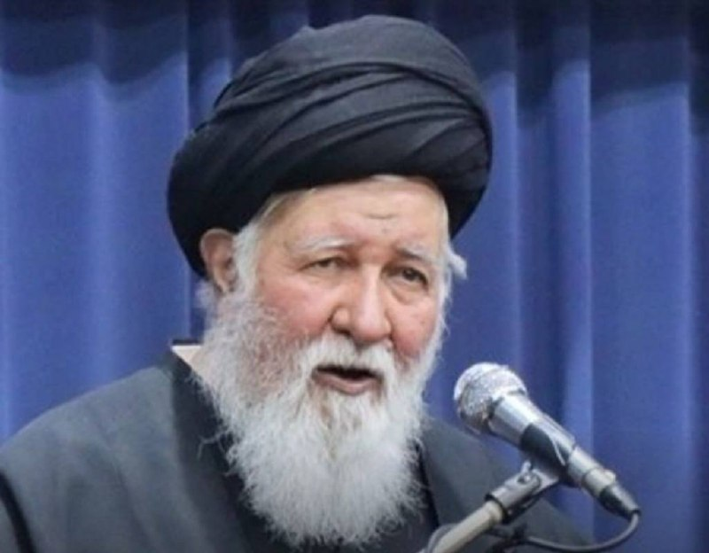

💢احمد علم‌الهدی، امام جمعه مشهد

«متاسفانه آنچه دشمن می‌خواست با بمباران ایجاد کند، یک عده با سودجویی می‌خواهند ایجاد کنند؛ این گرانی همانقدر مردم را ناراضی میکند که دشمن می‌خواست با حملات و بمباران خود به آن دست پیدا کند، این‌ها همه پیاده نظام آمریکا در داخل کشور هستند.»

▪️او افزود: «عوامل دشمن لبنیات، خودرو، پتروشیمی و فولاد را گران می‌کنند.»

🫆:Tony

📌 @persian_trend_official
پرشین ترند | متفاوت‌ترین کانال نظامی

## Persian_Trend_Official — post 13695

  <a href="telegram/content/Persian_Trend_Official_13695_1778250244.mp4">🎬 Download video</a>

روبیو: کنترل تنگه هرمز توسط ایران غیرقابل قبول است

💢هرگونه تلاش ایران برای ایجاد اقتدار برای کنترل ناوبری در تنگه هرمز غیرقابل قبول خواهد بود.

💢برخی از کشورهای اروپایی مانع از استفاده ما از پایگاه‌های ناتو در مواقع اضطراری و بحرانی شده‌اند و در ماموریت‌های ما مانع‌تراشی کرده‌اند.

▪️این یک مشکل است که باید مورد بررسی قرار گیرد

🫆:Tony

📌 @persian_trend_official
پرشین ترند | متفاوت‌ترین کانال نظامی

## Persian_Trend_Official — post 13694

  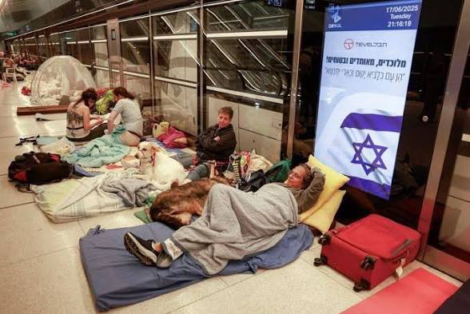

به گزارش تسنیم

💢دستور بازگشایی پناهگاه‌های عمومی در حیفا

رسانه‌های عبری: شهردار کریات‌آتا در حیفا دستور داد پناهگاه‌های عمومی در شهر باز شوند.

🫆:Tony

📌 @persian_trend_official
پرشین ترند | متفاوت‌ترین کانال نظامی

## Persian_Trend_Official — post 13693

🔴مارکو روبیو: 💢ترامپ همیشه آزادانه درباره احساساتش نسبت به سیاست‌های ایالات متحده صحبت خواهد کرد. رئیس‌جمهور همیشه در جهت منافع ایالات متحده عمل خواهد کرد. 💢فکر می‌کنم می‌توانیم این کار را انجام دهیم و همچنان رابطه‌ای سازنده با کلیسا داشته باشیم. 🫆:Tony…

## Persian_Trend_Official — post 13692

🔴مارکو روبیو: 💢ترامپ همیشه آزادانه درباره احساساتش نسبت به سیاست‌های ایالات متحده صحبت خواهد کرد. رئیس‌جمهور همیشه در جهت منافع ایالات متحده عمل خواهد کرد. 💢فکر می‌کنم می‌توانیم این کار را انجام دهیم و همچنان رابطه‌ای سازنده با کلیسا داشته باشیم. 🫆:Tony…

## Persian_Trend_Official — post 13691

  <a href="telegram/content/Persian_Trend_Official_13691_1778250247.mp4">🎬 Download video</a>

🔴مارکو روبیو:

💢ترامپ همیشه آزادانه درباره احساساتش نسبت به سیاست‌های ایالات متحده صحبت خواهد کرد. رئیس‌جمهور همیشه در جهت منافع ایالات متحده عمل خواهد کرد.

💢فکر می‌کنم می‌توانیم این کار را انجام دهیم و همچنان رابطه‌ای سازنده با کلیسا داشته باشیم.

🫆:Tony

📌 @persian_trend_official
پرشین ترند | متفاوت‌ترین کانال نظامی

## Persian_Trend_Official — post 13690

  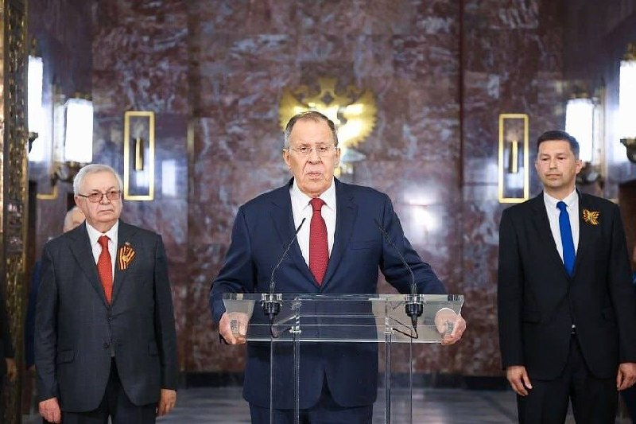

🔴لاوروف: اگر اوکراین به مسکو حمله کند، رحمی در کار نخواهد بود‼️

💢لاوروف وزیر امور خارجه روسیه در واکنش به تهدید رئیس‌جمهور اوکراین درباره حمله به مسکو در زمان برپایی مراسم روز پیروزی در جنگ جهانی دوم (فردا شنبه ۹ می- ۱۹ اردیبهشت) گفت: در این صورت، هیچ رحمی بر آنها نخواهد بود.

🫆:Tony

📌 @persian_trend_official
پرشین ترند | متفاوت‌ترین کانال نظامی

## Persian_Trend_Official — post 13689

  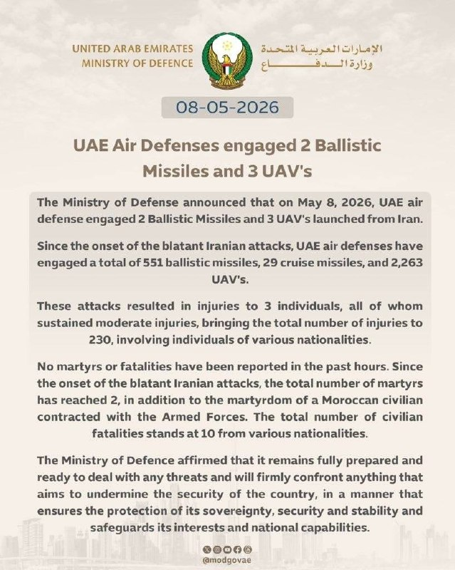

امارات: همچنان آماده‌ هستیم‼️

💢وزارت دفاع امارات پس از اعلام آمار حملات ایران شامل موشک‌های بالستیک، کروز و پهپادها و همچنین شمار کشته‌ها و زخمی‌ها اعلام کرد

«همچنان در آمادگی کامل هستیم.»

💢طبق ادعای وزارت دفاع امارات، با احتساب ۲ زخمی امروز، شمار مجروحان این کشور از آغاز جنگ به ۲۳۰ نفر و تعداد کشته‌ها به ۱۳ نفر رسیده است.

🫆:Tony

📌 @persian_trend_official
پرشین ترند | متفاوت‌ترین کانال نظامی

## RadioFarda — post 156976

  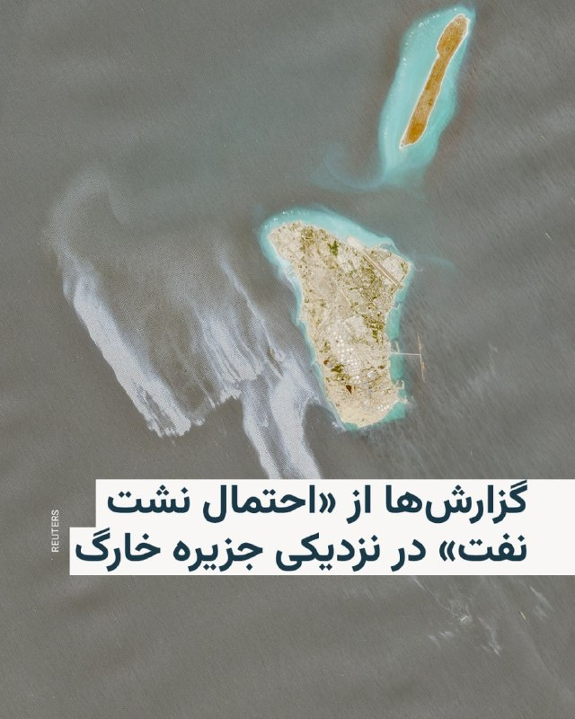

🔸خبرگزاری رویترز گزارش داد تصاویر ماهواره‌ای ثبت‌شده در روزهای ۱۶ تا ۱۸ اردیبهشت، لکه‌ای بزرگ را در آب‌های اطراف جزیره خارگ، مهم‌ترین پایانه صادرات نفت ایران، نشان می‌دهد که به گفته کارشناسان با «نشت نفت» سازگار است.

🔸بر اساس این گزارش، لکه‌ای خاکستری و سفیدرنگ در غرب جزیره خارگ دیده شده که به گفته یک پژوهشگر «رصدخانه منازعه و محیط زیست»، مساحتی حدود ۴۵ کیلومتر مربع را پوشش می‌دهد.

🔸رویترز به نقل از کارشناسان نوشته است که این نشت احتمالی می‌تواند بزرگ‌ترین مورد از زمان آغاز جنگ آمریکا و اسرائیل با ایران حدود ۷۰ روز پیش باشد. با این حال، علت نشت و منبع آن هنوز مشخص نیست.

🔸برخی منابع خبری دیگر نیز با اشاره به تصاویر ماهواره‌ای، احتمال نشت نفت در اطراف خارگ را مطرح کرده‌اند.

🔸جزیره خارگ مرکز حدود ۹۰ درصد صادرات نفت ایران است و در جریان جنگ ۳۹ روزه، ارتش آمریکا اعلام کرده بود اهدافی نظامی را در این منطقه هدف قرار داده است.

@RadioFarda

## RadioFarda — post 156975

  

🔸شبکه فاکس نیوز گزارش داد که ارتش آمریکا روز جمعه ۱۸ اردیبهشت حملات هوایی بیشتری علیه کشتی‌های مرتبط با ایران انجام داده و چند نفتکش خالی را که سعی در شکستن محاصره ایران داشتند، هدف قرار داده است.

🔸این شبکه به نقل از یک مقام ارشد آمریکایی گفت: «کشتی‌های هدف قرار گرفته نفتکش‌های بسیار بزرگ (VLCC) خالی بودند که تلاش می‌کردند با عبور از محاصره به ایران بازگردند.»

🔸پنتاگون و فرماندهی مرکزی ایالات متحده، سنتکام، درباره این گزارش هنوز اظهارنظر نکرده‌اند.

🔸ساعاتی پیش از اعلام این خبر، وب‌سایت ردیابی کشتی‌ها، تنکر ترکرز در پیامی در شبکه اجتماعی ایکس نوشته بود که «طی دو روز گذشته، سه نفتکش شرکت ملی نفتکش ایران که خالی از بار بودند، برای بازگشت به ایران از طریق منطقه انحصاری اقتصادی پاکستان، به خط محاصره نیروی دریایی ایالات متحده نفوذ کرده‌اند. این سه نفتکش روی هم رفته قادر به حمل ۵ میلیون بشکه نفت خام ایران هستند.»

🔸در همین حال خبرگزاری مهر، از شنیده شدن صدای انفجارهایی در بعدازظهر جمعه در محدوده شهرستان سیریک خبر داد.

@RadioFarda

## RadioFarda — post 156974

  <a href="https://t.me/radiofarda/156974">📎 Download file</a>

«انشقاقی» که کشورهای عربی را از مواجهه با ایران باز داشت

🔸گزارش‌هایی که در روزهای اخیر منتشر شده تصویرهای چند لایه و در برخی موارد متضاد از رویکردهای کشورهای حوزه خلیج‌فارس ارائه می‌دهد. آیا کشورهای عربی این حوزه در مواجهه با مساله ایران متحدالشکل عمل می‌کنند؟ آیا تهدید برای همه آن‌ها در یک سطح است و تهدیدی که امارات خود را درگیر آن می بیند به همان میزان در عربستان سعودی یا قطر احساس می‌شود؟ ارزیابی مهرداد فرهمند تحلیلگر امور خاورمیانه در ترکیه را بشنوید.

@RadioFarda

## RadioFarda — post 156973

🔸ایرنا، خبرگزاری جمهوری اسلامی، با انتشار ویدئویی از قول سرپرست اداره پارک ملی بوجاق از فرود ۴۰ فلامینگو در تالاب این پارک ملی خبر داد.

🔸پارک ملی بوجاق در منطقۀ حفاظت‌شدۀ شهربندر کیاشهر در استان گیلان قرار دارد و شامل حدود ۱۶۰ هکتار محوطۀ تالابی می‌شود.

@RadioFarda

## RadioFarda — post 156972

🔸مارکو روبیو، وزیر امور خارجه آمریکا، گفت اقدام نظامی آمریکا علیه ایران در بامداد جمعه «جدا و متمایز» از عملیات «خشم حماسی» بوده و ایالات متحده همچنان به‌صورت «دفاعی» واکنش نشان خواهد داد. 🔸روبیو روز جمعه در شهر رم، پایتخت ایتالیا، در جمع خبرنگاران اعلام…

## RadioFarda — post 156971

  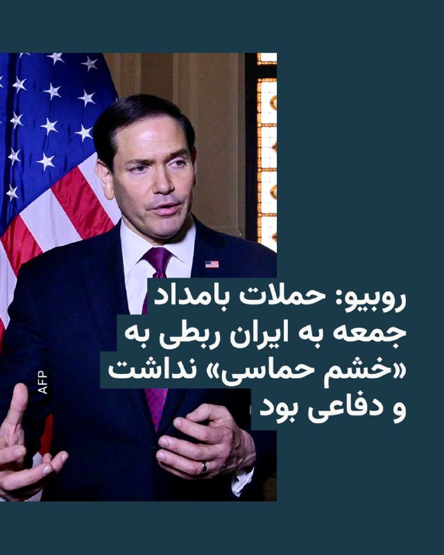

🔸مارکو روبیو، وزیر امور خارجه آمریکا، گفت اقدام نظامی آمریکا علیه ایران در بامداد جمعه «جدا و متمایز» از عملیات «خشم حماسی» بوده و ایالات متحده همچنان به‌صورت «دفاعی» واکنش نشان خواهد داد.

🔸روبیو روز جمعه در شهر رم، پایتخت ایتالیا، در جمع خبرنگاران اعلام کرد «خشم حماسی» که او اوایل این هفته گفته بود به پایان رسیده است، «یک عملیات تهاجمی بود که برای نابودی سکوهای پرتاب موشک، نیروی دریایی و نیروی هوایی آن‌ها طراحی شده بود.»

🔸او افزود آنچه ساعاتی پیش رخ داد «ناوشکن‌های آمریکایی بودند که در آب‌های بین‌المللی در حال حرکت بودند و از سوی ایرانی‌ها به آن‌ها شلیک شد، و آمریکا برای حفاظت از خود به‌صورت دفاعی پاسخ داد.»

🔸دیپلمات ارشد آمریکا گفت: «فقط کشورهای احمق وقتی به آن‌ها شلیک می‌شود، پاسخ نمی‌دهند. و ما کشور احمقی نیستیم.»

🔸وقتی از روبیو پرسیده شد که آیا آمریکا خطوط قرمزی را به ایران منتقل کرده است یا نه، پاسخ داد: «خط قرمز روشن است: اگر آمریکایی‌ها را تهدید کنند، نابود خواهند شد.»

@RadioFarda

## RadioFarda — post 156970

  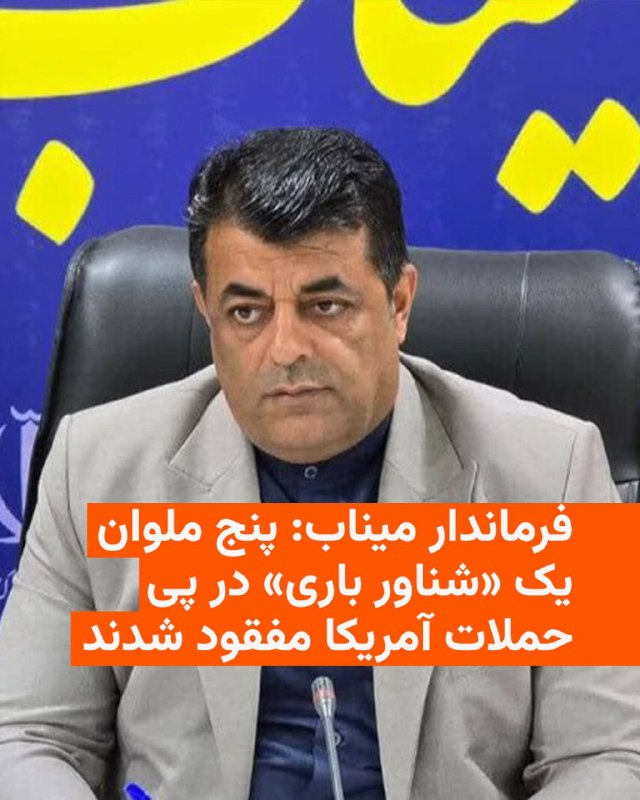

🔸فرماندار شهر میناب در جنوب ایران روز جمعه گفت که بر اثر حملات آمریکا، یک شناور باری در نزدیکی آب‌های این شهر هدف قرار گرفت و آتش گرفت و پنج تن از ملوانان آن مفقود شدند.

🔸محمد رادمهر به رسانه‌های ایران گفته است که پانزده ملوان در این شناور باری حضور داشتند که ۱۰ نفر از آنها به بیمارستان منتقل شدند و گروه‌های مردمی و تجسس در تلاش برای یافتن سایر ملوانان هستند.

🔸فرماندهی مرکزی ایالات متحده، سنتکام، اعلام کرد نیروهای آمریکایی در نخستین ساعات بامداد جمعه در پاسخ به حملات ایران علیه ناوشکن‌های آمریکایی به «تأسیسات نظامی ایران» حمله کردند.

🔸دونالد ترامپ، رئیس‌جمهور آمریکا هم در شبکه اجتماعی «تروث سوشیال» به استفادهٔ ایران از «قایق‌های کوچک و موشک و پهپاد» در این حمله اشاره کرد و نوشت تمام آن‌ها «نابود شدند».

🔸آمریکا چند روز پس هم از حمله به قایق‌های تندروی سپاه پاسداران خبر داده بود اما مقام‌های ایرانی آمریکا را به هدف قرار دادن قایق‌های غیرنظامی در آن حملات متهم کردند.

@RadioFarda

## RadioFarda — post 156969

  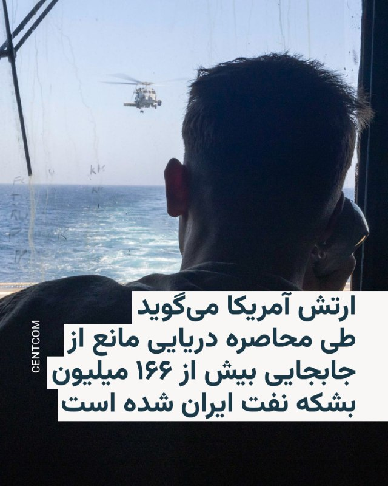

🔸سنتکام، فرماندهی مرکزی ایالات متحده، اعلام کرد از زمان آغاز محاصره دریایی تا روز جمعه، ۱۸ اردیبهشت مانع از ورود یا خروج بیش از ۷۰ نفتکش از بنادر ایران شده است.

🔸سنتکام در پیام تازه‌اش در شبکه اجتماعی ایکس نوشته که این کشتی‌های تجاری ظرفیت حمل بیش از ۱۶۶ میلیون بشکه نفت ایران به ارزش تخمینی بیش از ۱۳ میلیارد دلار را دارند.

🔸این موضوع ساعاتی پس از آن اعلام شد که ارتش آمریکا گفت نیروهایش در نخستین ساعات بامداد جمعه حملات «تحریک‌نشدهٔ» ایران علیه ناوشکن‌های آمریکایی در تنگه هرمز را رهگیری کرده و در پاسخ، «تأسیسات نظامی ایران» را هدف قرار دادند.

🔸ایالات متحده در واکنش به اقدام ایران در بستن تنگه هرمز، از ۲۴ فروردین یک محاصره دریایی بر بنادر و کشتیرانی ایران اعمال کرده و بر مبنای آن، ورود و خروج هر کشتی از مبدأ یا به مقصد بنادر ایران را ممنوع کرده است.

🔸تنگه هرمز، گذرگاهی به عرض تنها ۳۴ کیلومتر میان ایران و عمان، مسیر اتصال خلیج فارس به اقیانوس هند است و راه اصلی عبور حدود یک‌پنجم نفت جهان و کالاهای حیاتی دیگر از جمله کودهای شیمیایی به‌شمار می‌رود.

@RadioFarda

## IranianMinds — post 19800

🔴 فاکس نیوز به نقل از یک مسئول آمریکایی: ارتش آمریکا امروز به نفتکش‌های ایرانی که قصد شکستن محاصره را داشتند، حمله کرد.
نفتکش‌های هدف قرار گرفته، کشتی‌های بزرگ خالی بودند که قصد داشتند به ایران بازگردند.

@IranianMinds

## IranianMinds — post 19799

🔴خبرگزاری مهر از شنیده شدن انفجارهایی در محدوده شهرستان سیریک خبر داد.

@IranianMinds

## IranianMinds — post 19798

🔴دولت ترامپ ساعاتی پیش فروش تاریخی 26 میلیارد دلار موشک های سامانه پدافندی پاتریوت را به امارات، بحرین، قطر و کویت تصویب کرد

@IranianMinds

## IranianMinds — post 19797

  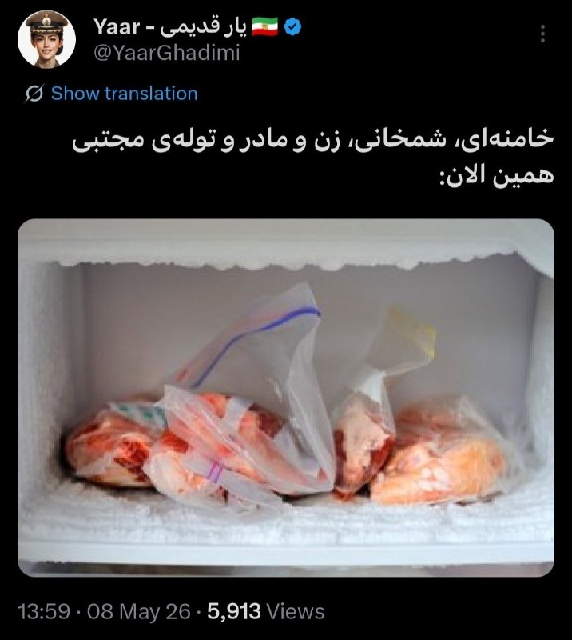

🔴خامنه‌ای، شمخانی، زن و مادر و توله‌ی مجتبی همین الان.

@IranianMinds

## IranianMinds — post 19796

🔴فرماندار میناب:

در پی حمله دیشب آمریکا، ۱۰ ملوان مجروح و ۵ ملوان مفقود شدند.

@IranianMinds

## IranianMinds — post 19795

🔴العربیه:

ارتش اسرائیل شهرک طورا در جنوب لبنان را هدف حملات هوایی قرار داد.

@IranianMinds

## IranianMinds — post 19794

  <a href="telegram/content/IranianMinds_19794_1778250257.mp4">🎬 Download video</a>

🔴 مارکو روبیو درباره ایران:

آنچه دیروز دیدید ناوشکن‌های آمریکایی بود که در آب‌های بین‌المللی در حال حرکت بودند که توسط ایرانی‌ها به سمت آنها شلیک شد.

ما برای محافظت از خود پاسخ دفاعی دادیم.

این جدا و متمایز از عملیات خشم حماسی است.

@IranianMinds

## IranianMinds — post 19793

  <a href="telegram/content/IranianMinds_19793_1778250259.mp4">🎬 Download video</a>

🔴 مارکو روبیو:

دلیل اینکه لبنان با بمباران مواجه می شود، حزب الله است.

حزب الله این را به آنها تحمیل می کند.

@IranianMinds

## IranianMinds — post 19792

  <a href="telegram/content/IranianMinds_19792_1778250262.mp4">🎬 Download video</a>

🔴 مارکو روبیو:

ما امروز در مقطعی منتظر پاسخ ایران هستیم. ما هنوز آن را دریافت نکرده ایم.

امیدوارم پیشنهاد جدی باشه , فقط امیدوارم.

@IranianMinds

## IranianMinds — post 19791

🔴 مارکو روبیو :

ما امروز یک پاسخ از ایران دریافت میکنیم و امیدوارم اونا جدی باشن!

@IranianMinds

## BBCPersian — post 280507

🔻سنتکام: محاصره دریایی ایران مانع تردد بیش از ۷۰ نفتکش شده است

سرفرماندهی مرکزی ارتش آمریکا در منطقه، سنتکام، می‌گوید که از آغاز محاصره دریایی ایران تا امروز مانع عبور بیش از ۷۰ نفتکش شده است که مبدا یا مقصد آنها بنادر ایرانی بوده است.

سنتکام در بیانیه‌ای در شبکه ایکس نوشت: «این کشتی‌های تجاری ظرفیت حمل بیش از ۱۶۶ میلیون بشکه نفت ایرانی به ارزش تخمینی بیش از ۱۳ میلیارد دلار را دارند.»

آمریکا از ۱۳ آوریل (۲۴ فروردین) در واکنش به اقدام ایران در بستن تنگه هرمز دست به محاصره دریایی بنادر ایران زده است و اجازه نمی‌دهد هیچ کشتی‌ای با مبدا یا مقصد بنادر ایرانی از تنگه هرمز عبور کند.

https://bbc.in/4cZY32k
@BBCPersian

## BBCPersian — post 280506

  <a href="telegram/content/BBCPersian_280506_1778250265.mp4">🎬 Download video</a>

🔻سرخط خبرهای جمعه ۱۸ اردیبهشت ۱۴۰۵
@BBCPersian

## BBCPersian — post 280505

🔻امارات: سه نفر در حملات پهپادی و موشکی ایران مجروح شدند

وزارت دفاع امارات می‌گوید که پدافند هوایی آن کشور دو موشک بالستیک و سه پهپاد را که از ایران شلیک شده بودند، رهگیری کرده‌ است.

در بیانیه این وزارتخانه در شبکه ایکس آمده است که سه نفر در این حمله مجروح شده‌اند.

سطح جراحت این افراد «متوسط» اعلام شده است.

وزارت دفاع امارات همچنین هشدار داد که نیروهایش برای مقابله با هرگونه تهدید «در آمادگی کامل» قرار دارند و با هر اقدامی که امنی کشور را به خطر بیندازد، «قاطعانه» برخورد خواهند کرد.

https://bbc.in/4cZY32k
@BBCPersian

## BBCPersian — post 280498

🖌جو تایدی, خبرنگار سایبری، سرویس جهانی بی‌بی‌سی:

🔻کاربران اینستاگرام دیگر نمی‌توانند پیام‌های مستقیم فوق‌خصوصی ارسال کنند، زیرا قابلیت رمزگذاری سرتاسری این شبکه اجتماعی در سراسر جهان غیرفعال شده است.

حذف رمزگذاری سرتاسری پیام‌ها، تغییر موضعی چشمگیر از سوی متا، شرکت مادر اینستاگرام، محسوب می‌شود که پیش‌تر این فناوری را «استاندارد طلایی» حفاظت از حریم خصوصی کاربران خود توصیف کرده بود.

رمزگذاری سرتاسری امن‌ترین شکل پیام‌رسانی آنلاین به شمار می‌رود، چون تنها فرستنده و گیرنده می‌توانند محتوای پیام‌ها را مشاهده کنند. با این حال، منتقدان سال‌هاست هشدار می‌دهند این فناوری می‌تواند به انتشار محتوای افراطی در فضای آنلاین، بدون امکان مداخله مقام‌ها، کمک کند.

به همین دلیل، تصمیم متا با استقبال گروه‌هایی از جمله نهادهای حمایت از کودکان روبه‌رو شده، اما فعالان حریم خصوصی آن را محکوم کرده‌اند.

📸GettyImages/ Meta/ NurPhoto via Getty Images/ Anadolu via Getty Images

https://bbc.in/4f9QAz2
@BBCPersian

## BBCPersian — post 280497

  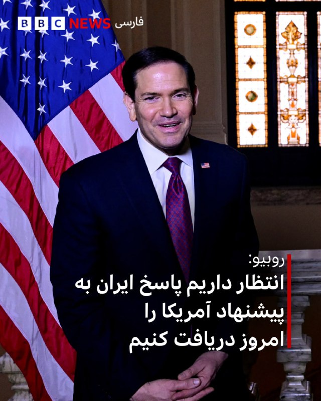

🔻روبیو: انتظار داریم پاسخ ایران به پیشنهاد آمریکا را امروز دریافت کنیم

وزیر خارجه آمریکا می‌گوید که واشنگتن انتظار دارد که پاسخ ایران به پیشنهادهای آمریکا برای پایان جنگ را امروز دریافت کند.

مارکو روبیو در جریان سفرش به رم، به خبرنگاران گفت: «ما انتظار داریم که امروز در مقطعی پاسخ آنها را دریافت کنیم... امیدوارم که آنچه ارائه می‌کنند، جدی باشد.»

اظهارات آقای روبیو در حالی است که وزیر خارجه ایران آمریکا را متهم کرده است که با «ماجراجویی نظامی بی‌خردانه» دیپلماسی را «قربانی» می‌کند.

عباس عراقچی هشدار داده است که «ایرانیان هرگز در برابر فشار سر خم نمی‌کنند.»

این اظهارات پس از آن است که تبادل آتش میان ایران و آمریکا در منطقه خلیج فارس سطح تنش را افزایش داده است هرچند دونالد ترامپ می‌گوید که آتش‌بس همچنان پابرجاست.

وزارت خارجه ایران دیروز گفت که مشغول بررسی طرح پیشنهادی آمریکا برای پایان جنگ است.

📷Getty Images
@BBCPersian

## BBCPersian — post 280496

  <a href="telegram/content/BBCPersian_280496_1778250269.mp4">🎬 Download video</a>

🔻ارتش فرانسه ویدیویی از عبور ناو هواپیمابر «شارل دوگل» از کانال سوئز به سوی تنگه هرمز منتشر کرده است.

گفته می‌شود این ناو در چارچوب ماموریتی بالقوه با هدف کمک به باز کردن تنگه هرمز در حال حرکت به سوی منطقه است.

در بیانیه ارتش فرانسه که ۱۶ اردیبهشت (۶ مه) همزمان با این ویدیو منتشر شد، این ناو به همراه کشتی‌های جنگی ایتالیا و هلند از مسیر کانال سوئز وارد دریای سرخ شده‌اند.

فرانسه همچنین با اشاره به پیامدهای اقتصادی جهانی ناشی از تنش‌ها و اقدامات متقابل ایالات متحده و ایران از واشنگتن و تهران خواسته است طرح‌هایی را برای پایان دادن به درگیری‌ها بررسی کنند.

@BBCPersian

## BBCPersian — post 280495

🔻دیدار روبیو و ملونی در سایه تنش‌ آمریکا و ایتالیا بر سر جنگ ایران

وزیرخارجه آمریکا و نخست‌وزیر ایتالیا در رم دیدار و گفت‌و‌گو کردند.

دیدار مارکو روبیو و جورجا ملونی در بحبوحه تنش بین دولت ایتالیا و دونالد ترامپ به‌دلیل اختلافاتشان درباره جنگ ایران و انتقادهای بی‌سابقه رئیس‌جمهور آمریکا از پاپ لئون صورت گرفته است.

انتظار می‌رفت که در این دیدار دو طرف در مورد وضعیت خلیج فارس، جنگ روسیه و اوکراین، تعرفه‌های آمریکا بر کالاهای اروپایی و همچنین سیاست‌های مربوط به کوبا گفت‌وگو شود.

خانم ملونی پیش‌تر یکی از حامیان اصلی آقای ترامپ در اروپا محسوب می‌شد و تلاش داشت به‌عنوان پل ارتباطی میان واشنگتن و اتحادیه اروپا عمل کند، اما جنگ ایران این توازن را تحت تاثیر قرار داده است؛ زیرا اکنون او باید میان وفاداری به آمریکا و افکار عمومی ایتالیا که با جنگ مخالف هستند، تعادل برقرار کند.

آنتونیو تایانی، وزیر خارجه ایتالیا، پیش از این دیدار گفته بود: « معتقدم اروپا به آمریکا نیاز دارد، ایتالیا به آمریکا نیاز دارد، اما آمریکا هم به اروپا و ایتالیا نیاز دارد.»

روابط دو طرف پس از انتقادهای اخیر آقای ترامپ از پاپ لئون دچار تنش شد. اظهارات دونالد ترامپ درباره پاپ با واکنش منفی گسترده‌ای روبرو شد و خانم ملونی این اظهارات را «غیرقابل قبول» توصیف کرد.

آقای ترامپ در واکنش، خانم ملونی را به «بی‌جسارتی» متهم کرد و حتی تهدید کرد نیروهای آمریکایی را از ایتالیا خارج خواهد کرد.

@BBCPersian

## Dirty_Kids — post 389107

  

کاش عباس بعد از کتاب موفق قدرت مذاکره، یه کتاب هم درباره ریاضیات پایه بنویسه.

@Dirty_Kids 👻

## Dirty_Kids — post 389103

شات‌های وایرال شده‌ی شاهدخت فرح پهلوی از مراسم فارغ‌التحصیلیش

@Dirty_Kids 👻

## Dirty_Kids — post 389102

ارتش آمریکا مدعی شد از انتقال بیش از ۱۶۶ میلیون بشکه نفت ایرانی به ارزش ۱۳ میلیارد دلار جلوگیری کرده است.

@Dirty_Kids 👻

## Hranews — post 112830

  

منزل یک زوج بهائی در شیراز تفتیش شد

❗️
❗️
❗️
❗️
❗️– صبح روز پنجشنبه ۱۷ اردیبهشت‌ماه، منزل فرامرز و پریوش ندافیان، شهروندان بهائی ساکن شیراز، توسط نیروهای امنیتی تفتیش شد. در جریان این اقدام، برخی لوازم شخصی و اموال این خانواده از جمله تلفن‌های همراه، کیس کامپیوتر، کتاب‌ها و طلا و جواهرات ضبط شد.

به گزارش خبرگزاری هرانا، ارگان خبری مجموعه فعالان حقوق بشر در ایران، منزل یک زوج بهائی در شیراز مورد تفتیش قرار گرفت.

بر اساس اطلاعات دریافتی هرانا، صبح روز پنجشنبه ۱۷ اردیبهشت ۱۴۰۵، مأموران امنیتی با ارائه حکمی دست‌ نویس وارد منزل فرامرز و پریوش ندافیان شده و اقدام به تفتیش محل سکونت آنان کردند. در جریان این بازرسی، تلفن‌های همراه، کیس کامپیوتر، تعدادی کتاب و همچنین طلا و جواهرات متعلق به این خانواده ضبط شده است.

ادامه مطلب

#پریوش_ندافیان
#فرامرز_ندافیان

↘️
@hranews_bot تماس ✉️ -  @Hranews  کانال هرانا 🆑

## configx2ray — post 38650

هرچیزی که رایگانه براتون وصله رو دایرکت چنل بفرستید تا متود برداری کنیم و از روش سرور بسازیم بزاریم چنل استفادع کنید فقط رایگان هارو بفرستید دمتون گرم دایرکت چنل : http://t.me/ConfigX2ray?direct

## configx2ray — post 38649

هرچیزی که رایگانه براتون وصله رو دایرکت چنل بفرستید تا متود برداری کنیم و از روش سرور بسازیم بزاریم چنل استفادع کنید

فقط رایگان هارو بفرستید دمتون گرم
دایرکت چنل :
http://t.me/ConfigX2ray?direct

## configx2ray — post 38647

  <a href="https://t.me/ConfigX2ray/38647">📎 Download file</a>

کانفیگ برای Npv tunnel ⭕️

به هیچ وج دانلود نزنید باهاش
❤️

رمز فایل : @ConfigX2ray

Channel : https://t.me/ConfigX2ray

## manototv — post 105146

  <a href="telegram/content/manototv_105146_1778250274.mp4">🎬 Download video</a>

سخنگوی وزارت امور خارجه جمهوری اسلامی اعلام کرد که اقدام انجام‌شده از سوی آمریکا در شب گذشته، هم «نقض آشکار حقوق بین‌الملل» بوده و هم «نقض آتش‌بس».
او در ادامه گفت «نیروهای مسلح ایران در پاسخ ضربه سنگینی به دشمن وارد کرده‌اند» و با تمام توان، «تحرکات و اقدامات طرف مقابل را دفع کرده‌اند».
بقایی همچنین تأکید کرد که ایران در وضعیت «آتش‌بس اسمی» قرار دارد.
او درباره مذاکرات نیز گفت که پیشنهاد ارائه‌شده از سوی آمریکا در حال بررسی است و در صورت رسیدن به نتیجه نهایی، به‌طور رسمی اعلام خواهد شد.

## manototv — post 105145

  <a href="telegram/content/manototv_105145_1778250274.mp4">🎬 Download video</a>

«صدای علی صفری باشید»

## manototv — post 105144

  <a href="telegram/content/manototv_105144_1778250276.mp4">🎬 Download video</a>

خبرگزاری‌های داخلی از قول فرماندار میناب گزارش داده‌اند پیکر یکی از پنج ملوان مفقود شده دیشب در پی حملات آمریکا پیدا شده‌است. فرماندار میناب پیش‌تر اعلام کرده بود در جریان حملات آمریکا در آب‌های تنگه هرمز و دریای مکران که شب گذشته صورت گرفته، یک شناور باری در نزدیکی آب‌های میناب مورد هدف قرار گرفته و دچار آتش‌سوزی شده است. بر پایه این اعلام در این لنج، ۱۵ ملوان حضور داشتند که ۱۰ تن از آن‌ها مصدوم و پنج نفر مفقود شده‌ بودند که اکنون اعلام شده یکی از آن‌ها کشته شده‌اند.

## manototv — post 105143

  <a href="telegram/content/manototv_105143_1778250277.mp4">🎬 Download video</a>

خبرگزاری مهر گزارش داده عصر جمعه در محدوده شهرستان سیریک صدای انفجار گزارش شده است. هنوز ماهیت این صداها مشخص نشده است و نهادهای رسمی در این خصوص اظهار نظر نکرده‌اند.

## manototv — post 105142

  <a href="telegram/content/manototv_105142_1778250278.mp4">🎬 Download video</a>

تانکرترکرز که به رصد حرکت شناورها می‌پردازد در گزارشی به وضعیت Ocean Koi نفت‌کش توقیف شده توسط ارتش پرداخته است. در این گزارش آمده نام این شناور در واقع JIN LI 9255933 است و از تاریخ ۳۰ نوامبر ۲۰۲۵ با این نام فعالیت می‌کرده است. بر اساس داده‌های موجود، این نفتکش از سال ۲۰۲۱ تاکنون دست‌کم در ۱۶ مورد محموله‌های مختلف هیدروکربنی ایران را حمل کرده است؛ موضوعی که به گفته منابع، با آگاهی کامل ایران انجام شده، زیرا نیمی از بارگیری‌ها در بنادر ایران و نیمی دیگر از طریق انتقال کشتی به کشتی در دریا صورت گرفته است.
در اداکه گزارش آمده گفته می‌شود مالکیت این نفتکش در شانگهای چین مستقر است و همچنین یادآوری شده این کشتی در تاریخ ۲۵ فوریه ۲۰۲۶ توسط دفتر کنترل دارایی‌های خارجی آمریکا تحریم شده است.
در پایان این گزارش تانکرترکرز گفته گزارش صدا و سیما از توقیف این نفتکش چیزی جز نمایش نیست. در گزارش صدا و سیما آمده تکاوران نیروی دریایی ارتش با «عملیات ویژه» این نفتکش را به دلیل «تلاش برای اختلال در صادرات نفت ایران و آسیب به منافع ملی» توقیف کردند؛ محموله نفت روی آن متعلق به ایران بوده، به سواحل جنوبی ایران هدایت و به مقامات قضایی تحویل داده شده است.

## manototv — post 105141

  <a href="telegram/content/manototv_105141_1778250279.mp4">🎬 Download video</a>

مارکو روبیو، وزیر خارجه آمریکا، پس از پایان سخنانش در جمع خبرنگاران در ایتالیا، بار دیگر بر موضع واشنگتن تأکید کرد که نیروهای نظامی این کشور در جریان درگیری‌های شب گذشته در تنگه هرمز، در چارچوب «دفاع از خود» عمل کرده‌اند.
او گفت: «آنچه دیروز دیدید این بود که ناوشکن‌های آمریکایی در آب‌های بین‌المللی در حال حرکت بودند و از سوی ایران به آن‌ها شلیک شد و آمریکا برای حفاظت از خود پاسخ دفاعی داد.»
روبیو افزود: «ما شلیک نکردیم، آن‌ها به ما شلیک کردند.»
طبق گزارش‌ها، هم آمریکا و هم جمهوری اسلامی اعلام کرده‌اند که شب گذشته در منطقه تنگه هرمز به یکدیگر حمله کرده‌اند.
ارتش آمریکا گفته است نیروهایش «حملات بدون تحریک ایران» را که سه ناوشکن نیروی دریایی را هدف قرار داده بود رهگیری کرده و در پاسخ، مواضع پرتاب این حملات در داخل ایران را هدف قرار داده است.
در مقابل، تهران پیش‌تر اعلام کرده بود که در پاسخ به آنچه «نقض آتش‌بس توسط واشنگتن» و هدف قرار گرفتن «مناطق غیرنظامی» خوانده، به شناورهای نظامی آمریکا حمله کرده و «خسارات قابل توجهی» به آن‌ها وارد کرده است. فرماندار میناب نیز اعلام کرده در جریان حملات آمریکا در آب‌های تنگه هرمز و دریای مکران که شب گذشته صورت گرفته، یک شناور باری در نزدیکی آب‌های میناب مورد هدف قرار گرفته و دچار آتش‌سوزی شده است. بر پایه این اعلام در این لنج، ۱۵ ملوان حضور داشتند که ۱۰ تن از آن‌ها مصدوم و پنج نفر مفقود شده‌اند.

## manototv — post 105140

  <a href="telegram/content/manototv_105140_1778250281.mp4">🎬 Download video</a>

مارکو روبیو، وزیر خارجه آمریکا، در گفت‌وگو با خبرنگاران در رم اعلام کرد ایالات متحده هیچ‌گونه مذاکره‌ای با حزب‌الله انجام نخواهد داد و تمرکز خود را بر گفت‌وگو با دولت لبنان قرار داده است.
او تأکید کرد که سیاست واشنگتن در این زمینه تغییر نکرده و مسیر دیپلماتیک تنها از طریق دولت رسمی لبنان دنبال خواهد شد.

## manototv — post 105139

  <a href="telegram/content/manototv_105139_1778250282.mp4">🎬 Download video</a>

فرماندار میناب اعلام کرده در جریان حملات آمریکا در آب‌های تنگه هرمز و دریای مکران که شب گذشته صورت گرفته، یک شناور باری در نزدیکی آب‌های میناب مورد هدف قرار گرفته و دچار آتش‌سوزی شده است. بر پایه این اعلام در این لنج، ۱۵ ملوان حضور داشتند که ۱۰ تن از آن‌ها مصدوم و پنج نفر مفقود شده‌اند.

## manototv — post 105138

  <a href="telegram/content/manototv_105138_1778250283.mp4">🎬 Download video</a>

مارکو روبیو، وزیر خارجه آمریکا، در رم اعلام کرد واشنگتن انتظار دارد امروز از جمهوری‌اسلامی درباره مذاکرات مربوط به پایان جنگ پاسخ دریافت کند. او گفت: «امیدوارم این یک پیشنهاد جدی باشد.»
روبیو همچنین افزود اگر گزارش‌ها درباره تلاش تهران برای ایجاد یک نهاد جدید جهت کنترل ترافیک کشتیرانی و دریافت عوارض در تنگه هرمز صحت داشته باشد، این موضوع برای آمریکا «غیرقابل قبول» خواهد بود.

## manototv — post 105137

  <a href="telegram/content/manototv_105137_1778250283.mp4">🎬 Download video</a>

بررسی‌ها نشان می‌دهد نفتکش Ocean Koi توقیف شده توسط ارتش در نزدیکی تنگه هرمز، بخشی از «ناوگان سایه» جمهوری‌اسلامی بوده و از سال ۲۰۲۰ در حمل نفت ایران فعالیت داشته. آمریکا در فوریه ۲۰۲۶ آن را تحریم کرده بود. این نفتکش با پرچم باربادوس و مالک/اپراتور آن شرکت Ocean Kudos Shipping (مستقر در جزایر مارشال، با ارتباط چینی) ثبت شده است
طبق اعلام رسمی ارتش، تکاوران نیروی دریایی ارتش با «عملیات ویژه» این نفتکش را به دلیل «تلاش برای اختلال در صادرات نفت ایران و آسیب به منافع ملی» توقیف کردند. خبرگزاری مهر نیز گزارش داده محموله نفت روی آن متعلق به ایران بوده است. در بیانیه ارتش آمده کشتی به سواحل جنوبی ایران هدایت و به مقامات قضایی تحویل داده شده است.

## manototv — post 105136

  <a href="telegram/content/manototv_105136_1778250284.mp4">🎬 Download video</a>

جورجیا ملونی، نخست‌وزیر ایتالیا، امروز با مارکو روبیو، وزیر خارجه آمریکا، دیدار کرد؛ در شرایطی که روابط دولت او با دولت دونالد ترامپ به‌دلیل جنگ با ایران دچار تنش کم‌سابقه‌ای شده است. ملونی که پیش‌تر از نزدیک‌ترین متحدان ترامپ در اروپا محسوب می‌شد، گفته بود جنگی که در ۲۸ فوریه آغاز شده «غیرقانونی» است. او همچنین اظهارات انتقادی ترامپ علیه پاپ لئون چهاردهم را «غیرقابل قبول» توصیف کرده بود. مارکو روبیو در سفری دو روزه به ایتالیا حضور دارد. سفری که هدف آن کاهش تنش‌ها با پاپ پس از حملات بی‌سابقه ترامپ به او و همچنین رسیدگی به نارضایتی واشنگتن از مخالفت ایتالیا با حمایت از جنگ آمریکا و اسرائیل علیه ایران عنوان شده است.

## alonews — post 118688

  <a href="telegram/content/alonews_118688_1778250286.jpg">🎬 Download video</a>

👈روبیو: رئیس‌جمهور ترامپ هنوز تصمیم نگرفته است که چگونه به برخی از متحدان که اجازه استفاده از پایگاه‌هایشان را در طول جنگ با ایران نمی‌دهند، پاسخ دهد

✅ @AloNews خبر جنگ

## alonews — post 118687

  <a href="telegram/content/alonews_118687_1778250287.jpg">🎬 Download video</a>

👈فارس: از ساعتی پیش درگیری‌های پراکنده‌ای میان نیروهای مسلح ایران و شناورهای آمریکایی‌ در محدودهٔ تنگهٔ هرمز در جریان است.

✅ @AloNews خبر جنگ

## alonews — post 118686

  

👈پرونده‌های یوفو منتشر شده توسط وزارت دفاع - تاریخ ۲۲ ژانویه ۲۰۲۶.

🔴یک خلبان آمریکایی ادعا می‌کند که در طول عملیات خود، یک جسم دایره‌ای را دیده است که با سرعت ۱۲۸ کیلومتر در ساعت بالای دریای اژه پرواز می‌کرد و چرخش‌های غیرطبیعی ۹۰ درجه انجام می‌داد، سپس از تصویر ناپدید شد.

✅ @AloNews خبر جنگ

## alonews — post 118685

  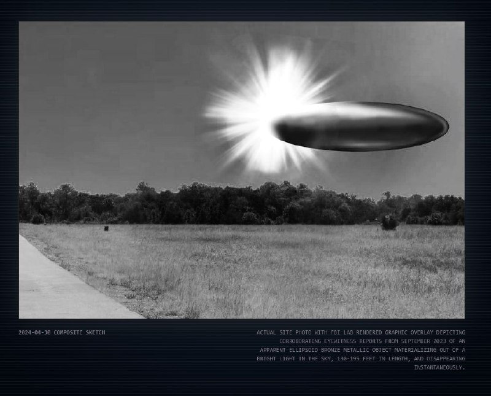

👈تصویر بازسازی شده توسط FBI به کمک شاهدان عینی از شی ناشناسی که در سال 2023 دیده شد

✅ @AloNews خبر جنگ

## alonews — post 118684

  <a href="telegram/content/alonews_118684_1778250289.jpg">🎬 Download video</a>

👈یک ویدئوی بسیار عجیب که توسط ارتش ایالات متحده گرفته شده است، یک جسم به شکل ستاره را نشان می‌دهد که با حرکتی ضربدری و سریع در آسمان حرکت می‌کند

✅ @AloNews خبر جنگ

## alonews — post 118680

  <a href="telegram/content/alonews_118680_1778250289.jpg">🎬 Download video</a>

👈برای اولین‌بار، پنتاگون اسناد بسیار محرمانه مربوط به UFOها را منتشر کرده است.

برخی تصاویر، اجسام ناشناس ستاره‌شکل و نورها و اشکال عجیب در آسمان را هنگام مأموریت Apollo 11 Moon Landing نشان می‌دهند.
همچنین ویدیوهایی منتشر شده که در آن‌ها گوی‌هایی در آسمان حرکت می‌کنند بدون اینکه سیستم پیشران شناخته‌شده‌ای داشته باشند.

✅ @AloNews خبر جنگ

## alonews — post 118679

  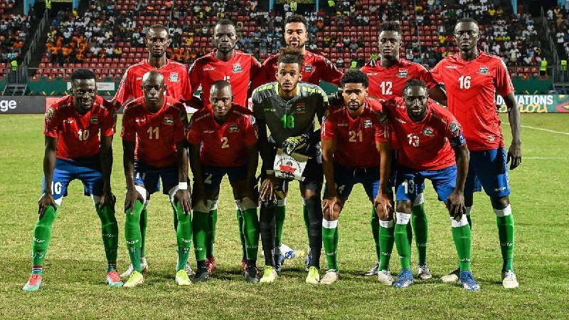

⚽️🇮🇷بالاخره یه حریف تدارکاتی واسه تیم‌ملی قبل جام جهانی پیدا شد؛

تیمِ مخوف گامبیا🇬🇲حاضر شده قبل جام جهانی با ایران بازی دوستانه برگزار کنه.
@AloSport

## alonews — post 118678

  <a href="telegram/content/alonews_118678_1778250290.jpg">🎬 Download video</a>

👈سخنگوی وزارت خارجه:
پاسخ ایران به طرح آمریکا برای پایان جنگ در دست بررسی است و به نتیجه نهایی که رسیدیم حتما اعلام خواهیم کرد.

✅ @AloNews خبر جنگ

## alonews — post 118677

  <a href="telegram/content/alonews_118677_1778250291.jpg">🎬 Download video</a>

👈رجانیوز: اینترنشنال جلیلی، جبلی، ثابتی و خضریان را تهدید به ترور کرده است و احتمالا ترامپ در دور بعد سایر مخالفان توافق با امریکا را ترور خواهد کرد تا مسیر برای امضای توافق باز شود

✅ @AloNews خبر جنگ

## alonews — post 118676

  <a href="telegram/content/alonews_118676_1778250291.jpg">🎬 Download video</a>

👈حمله هوایی اسرائیل به شهر جیبچیت در جنوب لبنان

✅ @AloNews خبر جنگ

## alonews — post 118675

  <a href="telegram/content/alonews_118675_1778250291.jpg">🎬 Download video</a>

👈ادعای فاکس نیوز به نقل از یک مسئول آمریکایی: ارتش آمریکا امروز به نفتکش‌های ایرانی که قصد شکستن محاصره را داشتند، حمله کرد.

🔴نفتکش‌های هدف قرار گرفته، کشتی‌های بزرگ خالی بودند که قصد داشتند به ایران بازگردند.(منبع تسنیم)

✅ @AloNews خبر جنگ

## alonews — post 118674

  

👈جنیفر گریفین: امروز ایالات متحده چند نفتکش خالی را که تلاش داشتند محاصره را بشکنند و به ایران بازگردند، هدف قرار داد

✅ @AloNews خبر جنگ

## alonews — post 118673

  <a href="telegram/content/alonews_118673_1778250293.jpg">🎬 Download video</a>

🔴فوری / شنیده شدن صدای انفجارهایی در محدوده شهرستان سیریک از سوی ساکنان محلی گزارش شده است

✅ @AloNews خبر جنگ

## alonews — post 118672

  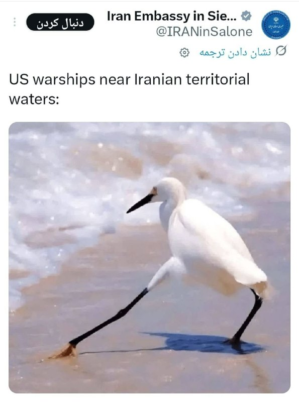

👈 توییت سفارت ایران در سیرالئون : ناوهای جنگی آمریکا در نزدیکی آب‌های سرزمینی ایران

✅ @AloNews خبر جنگ

## alonews — post 118671

  <a href="telegram/content/alonews_118671_1778250294.jpg">🎬 Download video</a>

👈دستور بازگشایی پناهگاه‌های عمومی در حیفا صادر شده است

✅ @AloNews خبر جنگ

## alonews — post 118670

  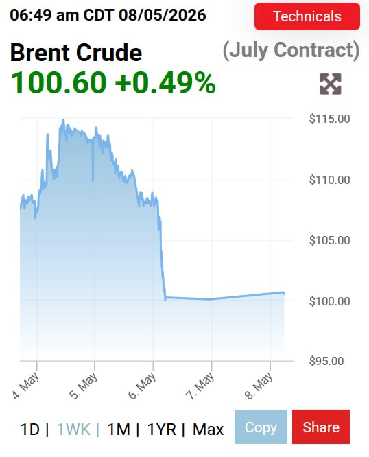

👈 قیمت نفت برنت همچنان در محدود ۱۰۰ دلار ثابت مانده است

✅ @AloNews خبر جنگ

## alonews — post 118669

  <a href="telegram/content/alonews_118669_1778250295.mp4">🎬 Download video</a>

👈روبیو درباره کوبا: دیروز تحریم‌هایی اعمال کردیم و قرار است تحریم‌های بیشتری انجام دهیم

✅ @AloNews خبر جنگ

<!-- MSG END -->
<!-- NAV START -->
[صفحه قبل](telegram/content/archive_1.md)
<!-- NAV END -->
