# خواننده تلگرام

<!-- MSG START -->

---
📅 بروزرسانی: 1405/02/19 18:24
---

## VahidOOnLine — post 239108

  

مجید دوستعلی، عضو کمیسیون برنامه و بودجه مجلس گفت: «امروز دشمن به دنبال جنگ اقتصادی است و مردم یک رسالت مهم دارند که آن هم مسئله صرفه‌جویی است. صرفه‌جویی تنها یک توصیه اقتصادی نیست، بلکه ریشه در آموزه‌های دینی و اخلاقی دارد.»

او افزود: «دشمن می‌خواهد از مسیر مشکلاتی مانند کمبود برق، آب یا سوخت، مردم را تحت فشار قرار دهد و نارضایتی ایجاد کند، اما هر میزان صرفه‌جویی مردم، در حقیقت مقابله مستقیم با این توطئه اقتصادی دشمن است.»
‌🏁 🇬🇧 IranintlTV

🤖 @VahidOOnLine

## VahidOOnLine — post 239107

  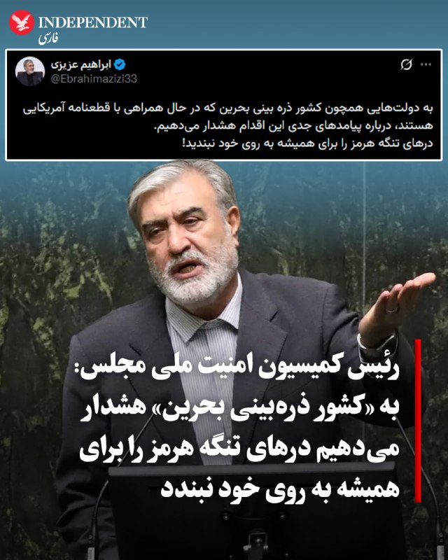

♦️ ابراهیم عزیزی، رئیس کمیسیون امنیت ملی مجلس شورای اسلامی، روز شنبه ۱۹ اردیبهشت، با انتشار پیامی در شبکه اجتماعی ایکس کشورهای منطقه از جمله بحرین را تهدید کرد که در صورت همراهی با قطعنامه پیشنهادی آمریکا در شورای امنیت سازمان ملل، با «پیامدهای جدی» مواجه خواهد شد.

عزیزی بحرین را «کشور ذره‌بینی» خواند و نوشت: «به دولت‌هایی همچون کشور ذره‌بینی بحرین که در حال همراهی با قطعنامه آمریکایی هستند، درباره پیامدهای جدی این اقدام هشدار می‌دهیم. درهای تنگه هرمز را برای همیشه به روی خود نبندید!»

قطعنامه مذکور که با حمایت آمریکا و کشورهای حوزه خلیج فارس به شورای امنیت سازمان ملل ارائه شده، از ایران می‌خواهد که ضمن توقف حملات علیه شناورهایی که قصد عبور از تنگه هرمز را دارند، محل دقیق مین‌های کارگذاری شده را اعلام کند و از دریافت هرگونه عوارض عبور از شناورهای عبوری خودداری کند.
‌🇸🇦 Indypersian

🤖 @VahidOOnLine

## VahidOOnLine — post 239106

  

وزارت خارجه عربستان سعودی در بیانیه‌ای حمایت کامل ریاض را از اقداماتی اعلام کرد که پادشاهی بحرین برای مقابله با آنچه «اقدام‌های صادرشده از سوی ایران» خوانده، اتخاذ کرده است.

در این بیانیه آمده است این اقدام‌ها به گفته مقام‌های سعودی، امنیت ملی بحرین را تحت تاثیر قرار می‌دهد و با هدف بی‌ثبات کردن امنیت و ثبات این کشور انجام می‌شود.
‌🏁 🇬🇧 ManotoTV

🤖 @VahidOOnLine

## VahidOOnLine — post 239105

  <a href="telegram/content/VahidOOnLine_239105_1778338470.mp4">🎬 Download video</a>

دانمارک؛ «پاینده ایران، جاوید شاه
‌🏁 🇬🇧 ManotoTV

🤖 @VahidOOnLine

## VahidOOnLine — post 239104

  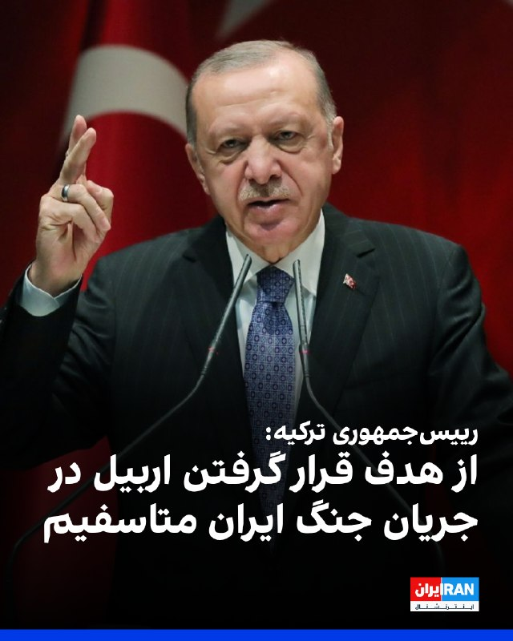

رجب طیب اردوغان، رییس‌جمهور ترکیه در دیدار با مسرور بارزانی، نخست‌وزیر اقلیم کردستان عراق گفت که ترکیه از هدف قرار گرفتن اربیل در جریان جنگ ایران متاسف شده و به هیچ وجه نمی‌خواهد درگیری به دیگر کشورهای منطقه گسترش یابد.

اربیل عراق و مقرهای احزاب کرد ایرانی در این منطقه، از زمان آغاز جنگ میان جمهوری اسلامی و آمریکا و اسرائیل، بارها از سوی حکومت ایران هدف حملات موشکی و پهپادی قرار گرفت.
‌🏁 🇬🇧 IranintlTV

🤖 @VahidOOnLine

## VahidOOnLine — post 239103

  

ویدیویی از معاون جمعیت هلال احمر منتشر شده که در آن می‌گوید در روز نخست حمله آمریکا و اسرائیل به «بیت رهبری»، علی لاریجانی، عباس عراقچی و علی‌اکبر صالحی در محل حضور داشتند. بر پایه این گفتگو آن‌ها زمان حملات در بیت بودن و به صورت «خاک و خلی» مشاهده شده‌اند.
‌🏁 🇬🇧 ManotoTV

🤖 @VahidOOnLine

## VahidOOnLine — post 239102

  

به دنبال فراخوان شاهزاده رضا پهلوی، ایرانیان روز یک‌شنبه، ۲۰ اردیبهشت در شهرهای مختلف جهان در اعتراض به خاموشی اینترنت، بازداشت‌های گسترده و احکام اعدام تجمع و راهپیمایی برگزار می‌کنند.
عنوان فراخوان «یک ملت در گروگان» اعلام شده و هدف از برگزاری، اعتراض به خاموشی اینترنت، بازداشت‌های گسترده و ادامه اعدام شهروندان عنوان شده است.

تجمع سیدنی در استرالیا ساعت ۱۵:۰۰ به وقت محلی آغاز می‌شود و شرکت‌کنندگان مسیر «نورث هاید پارک» تا «مارتین پلیس» را راهپیمایی خواهند کرد. تجمع سئول در کره جنوبی ساعت ۱۶:۰۰ به وقت محلی مقابل ساختمان وزارت خارجه برگزار می‌شود.

تجمع استکهلم در سوئد ساعت ۱۳:۰۰ به وقت محلی در میدان «نورا بانتوریه» برگزار خواهد شد. معترضان در برلین ساعت ۱۵:۰۰ به وقت محلی از «پوتسدامر پلاتس» به سمت «براندنبورگ تور» راهپیمایی می‌کنند و تجمع فرانکفورت ساعت ۱۶:۰۰ به وقت محلی در مرکز شهر برگزار می‌شود.

بر اساس این فراخوان، تجمع تورنتو در کانادا ساعت ۱۳:۰۰ به وقت محلی در مقابل کتابخانه «ریچموند هیل» برگزار خواهد شد و ایرانیان در لس‌آنجلس نیز ساعت ۱۶:۰۰ به وقت محلی در «ویلسایر بولوار» گرد هم می‌آیند.
https://ira
‌🏁 🇬🇧 IranintlTV

🤖 @VahidOOnLine

## VahidOOnLine — post 239101

  

روح‌الله متفکر آزاد، عضو هیات‌ رییسه مجلس گفت: «اگر امارات متحده عربی از عقلانیت استراتژیک برخوردار باشد، هرگز به‌خاطر منافع اسرائیل و آمریکا که در این میدان ناکام مانده‌اند، خود را در مهلکه‌ای بزرگ‌تر از توان و ظرفیت خود قرار نخواهد داد.»

او افزود: «امارات برای جمهوری اسلامی عددی محسوب نمی‌شود.»

این نماینده مجلس ادامه داد: «توصیه می‌شود اماراتی‌ها با درک قواعد این جنگ، از ورود به عرصه‌ای که فراتر از ظرفیت و اندازه آن‌هاست، خودداری کنند.»
‌🏁 🇬🇧 IranintlTV

🤖 @VahidOOnLine

## VahidOOnLine — post 239100

  

♦️ دولت ایالات متحده در حال برنامه‌ریزی برای تخلیه مسافران آمریکایی از یک کشتی تفریحی است که با شیوع مرگبار ویروس هانتا (Hantavirus) مرتبط است.
 
به گزارش فاکس‌نیوز، تیمی از مرکز کنترل و پیشگیری از بیماری‌ها (CDC) در جزایر قناری مستقر شده است تا میزان قرارگیری در معرض آلودگی و نیازهای نظارتی را ارزیابی کند.
 
مسافران با یک پرواز اختصاصیِ پزشکی به «مرکز ملی قرنطینه» در دانشگاه نبراسکا منتقل خواهند شد تا تحت مراقبت‌های پزشکی قرار بگیرند.
 
همچنین، متخصصان بیشتری از CDC جهت پشتیبانی از ارزیابی‌های سلامت در پایگاه هوایی «آف‌ات» (Offutt) در همان نزدیکی مستقر خواهند شد.
‌🇸🇦 Indypersian

🤖 @VahidOOnLine

## mwarmonitor — post 8759

🔴 ترامپ به روزنامه ایتالیایی «کوریره دلا سرا» (Corriere della Sera): در حال حاضر تمایلی ندارم درباره پاسخ ایران اظهارنظری کنم.

🔸ایتالیا زمانی که به آن نیاز داشتیم حضور نداشت، و من در حال بررسی انتقال نیروهای ما از پایگاه‌های ایتالیا هستم.

@mwarmonitor

## mwarmonitor — post 8758

  

🇺🇸محاصره دریایی نیروی دریایی آمریکا علیه ایران همچنان به‌طور کامل در حال اجراست. از ۱۳ آوریل تاکنون، نیروهای سنتکام ۵۸ کشتی تجاری را منحرف کرده و ۴ فروند را از کار انداخته‌اند تا از ورود یا خروج این کشتی‌ها به بنادر ایران جلوگیری کنند.

@mwarmonitor

## mwarmonitor — post 8757

🇺🇸ترامپ ؛ «ما مسیر متفاوتی نسبت به بقیه رفتیم تا همه‌چیز امضا و قطعی شود. این بهترین مسیر ممکن بود. از ما خواسته شد که آن کار را توسط دادستان کل ویلیام بار و بقیه انجام ندهیم؛ آن‌ها نمی‌خواستند همزمان با معامله با بار، از پروژه آزادی (Project Freedom) هم استفاده…

## mwarmonitor — post 8756

  <a href="telegram/content/mwarmonitor_8756_1778338477.mp4">🎬 Download video</a>

🇺🇸ترامپ ؛ «ما مسیر متفاوتی نسبت به بقیه رفتیم تا همه‌چیز امضا و قطعی شود. این بهترین مسیر ممکن بود. از ما خواسته شد که آن کار را توسط دادستان کل ویلیام بار و بقیه انجام ندهیم؛ آن‌ها نمی‌خواستند همزمان با معامله با بار، از پروژه آزادی (Project Freedom) هم استفاده کنند.
اما من فکر می‌کنم پروژه آزادی خوب بود، هرچند فکر می‌کنم در حال حاضر راه‌های دیگری هم برای انجام آن داریم. ممکن است دوباره به پروژه آزادی برگردیم، مگر اینکه اتفاقات دیگری بیفتد. اما آن موقع نامش «پروژه آزادی پلاس» خواهد بود، یعنی پروژه آزادی به‌علاوه موارد بیشتر.»

@mwarmonitor

## mwarmonitor — post 8755

  <a href="telegram/content/mwarmonitor_8755_1778338480.mp4">🎬 Download video</a>

📝اوضاع جوری شده که باید آرزو کرد درد و بلای مارک لوین مستقیم بخوره تو سر هرچی مثلاً ایرانیه که این روزها رگ غیرتش خشک شده و افتاده دنبال عادی‌سازی. کافیه فقط یه دور تو این اینستاگرام فارسی بزنید تا عمق فاجعه رو با چشمای خودتون ببینید؛ جوری که انگار نه انگار خون کسی به زمین ریخته.
🔸یه مشت حرامزاده‌ پرچم به دست که توی میدان‌ها نقش بازی می‌کنن و نون رو به نرخ روز می‌خورن، از یه طرف؛ و از اونا حرومی‌تر اونایی هستن که توی کافه‌ها و رستوران‌ها جوری غرق در خوش‌گذرونی و استوری گذاشتن هستن که انگار حافظه‌شون کلاً پاک شده.
🔸این جماعتِ بی‌هویت، با هر لبخند مصنوعی و هر میز چیده‌شده‌شون، دارن روی زخم‌های باز نمک می‌پاشن. برای این نون به نرخ روز خورها، نه وطن معنی داره و نه شرف؛ فقط کافیه بساط عیش و نوش‌شون به راه باشه تا روی هر جنایتی چشم ببندن. واقعاً که این حجم از وقاحت و بی‌عاری، خودش یه هنرِ کثیفه که فقط از عهده این "ایرانی‌نماها" برمی‌آید.

@mwarmonitor

## pm_afshaa — post 90417

🔴وزارت انرژی آمریکا اعلام کرد تحت رهبری دونالد ترامپ، 13.5 کیلوگرم اورانیوم غنی‌شده با درجه خلوص بالا را از یک رآکتور تحقیقاتی در ونزوئلا خارج و به ایالات متحده منتقل کرده

💧 Rainbet.com the #1 Non-KYC Crypto Casino & Sportsbook @rainbetcom

😁 @Pm_Afshaa

## pm_afshaa — post 90416

علم‌الگدا: گرانی ها ، کار پیاده‌نظام‌های دشمنه 
💧 Rainbet.com the #1 Non-KYC Crypto Casino & Sportsbook @rainbetcom 
😁 @Pm_Afshaa

## pm_afshaa — post 90415

🔴اکونومیست : روسیه می‌خواد 5000 پهپاد برای حمله به نیروهای آمریکا به ایران بده که با جنگ الکترونیک هم نمی‌شه جلوشون وایساد

💧 Rainbet.com the #1 Non-KYC Crypto Casino & Sportsbook @rainbetcom

😁 @Pm_Afshaa

## pm_afshaa — post 90414

علم‌الگدا: گرانی ها ، کار پیاده‌نظام‌های دشمنه 
💧 Rainbet.com the #1 Non-KYC Crypto Casino & Sportsbook @rainbetcom 
😁 @Pm_Afshaa

## pm_afshaa — post 90413

علم‌الگدا: گرانی ها ، کار پیاده‌نظام‌های
دشمنه

💧 Rainbet.com the #1 Non-KYC Crypto Casino & Sportsbook @rainbetcom

😁 @Pm_Afshaa

## pm_afshaa — post 90412

💰تعرفه
💰

1 گیگ    
⬆️ 295 ت

500 مگ 
⬆️ 185 ت

100 مگ 
⬆️ 55 ت

⭐️ اتصال پایدار در نت ملی

⭐️ مناسب اینستاگرام و تلگرام و یوتیوب

⭐️ دارای سایت استعلام باقی حجم

⭐️ بدون محدودیت کاربر و بدون انقضا

⭐️ ضمانت بازگشت وجه درصورت عدم رضایت

🌟 تست هم موجود میباشد 
🌟

جهت خرید به آیدی زیر پیام دهید 
⬆️

Admin : @Four_Support 
👨‍💻

Channel : @Four_Vpn_4 
🩵

🎇داخل گروه زیر هر شب قرعه کشی ۱۰ اشتراک رایگان انجام میشود 
⬆️
https://t.me/+v8GFmLXjHa5jNDZk

## pm_afshaa — post 90411

  <a href="telegram/content/pm_afshaa_90411_1778338482.jpg">🎬 Download video</a>

🔴رئیس کمیسیون آموزش مجلس: به آسیب‌دیدگان جنگ سهمیهٔ کنکور تعلق میگیره.

💧 Rainbet.com the #1 Non-KYC Crypto Casino & Sportsbook @rainbetcom

😁 @Pm_Afshaa

## VahidOnline — post 75346

تازه‌ترین داده‌های مرکز آمار ایران نشان می‌دهد قیمت برخی کالاهای اساسی خوراکی در فروردین ۱۴۰۵ نسبت به مدت مشابه سال قبل جهش کم‌سابقه‌ای داشته است.

بنابر این گزارش، روغن جامد با تورم نقطه‌ای ۳۷۵ درصدی، بیشترین افزایش قیمت را در میان اقلام خوراکی ثبت کرده و قیمت آن از حدود ۸۱ هزار تومان در فروردین ۱۴۰۴ به بیش از ۳۸۵ هزار تومان رسیده است. روغن مایع نیز با افزایش ۳۰۸ درصدی، از حدود ۷۴ هزار تومان به بیش از ۳۰۰ هزار تومان رسیده است.
برنج خارجی درجه یک با رشد ۲۰۹ درصدی، مرغ ماشینی با ۱۹۱ درصد، سس مایونز با ۱۹۰ درصد و تخم‌مرغ با ۱۷۰ درصد افزایش قیمت، از دیگر اقلام پرتورم بوده‌اند.

این جهش قیمت‌ها در حالی رخ داده که فعالان کارگری سبد معیشت خانوار کارگری را بیش از ۷۱ میلیون تومان برآورد کرده‌اند، اما حداقل مزد پایه ماهانه کارگران در سال ۱۴۰۵ حدود ۱۶ میلیون و ۶۰۰ هزار تومان است؛ شکافی که نشان می‌دهد حتی درآمد رسمی کارگران فاصله‌ای چندبرابری با هزینه حداقلی زندگی دارد.
@VahidHeadline
خبرآنلاین در گزارشی نوشته اثر افزایش ۶۰ درصدی حداقل مزد سال ۱۴۰۵ تنها در ۴۵ روز از بین رفته و قدرت خرید کارگران دوباره به سطح پیش از افزایش مزد بازگشته است.
بر اساس این گزارش، حداقل مزد پایه ماهانه امسال ۱۶ میلیون و ۶۲۵ هزار تومان تعیین شد؛ رقمی که در روز تصویب، با دلار ۱۴۳ هزار و ۷۰۰ تومانی حدود ۱۱۶ دلار ارزش داشت. اما با رسیدن دلار به حدود ۱۹۰ هزار تومان در نیمه اردیبهشت، ارزش دلاری مزد به حدود ۸۷.۵ دلار سقوط کرده است.
خبرآنلاین نوشته قدرت خرید مزد بر اساس طلا هم افت کرده؛ حداقل حقوق که در اسفند معادل حدود یک گرم طلای ۱۸ عیار بود، حالا به ۰.۸۱ گرم رسیده است.
این یعنی افزایش اسمی دستمزد، زیر فشار سقوط ریال، تورم و سیاست‌های اقتصادی جمهوری اسلامی عملاً خنثی شده و کارگران دوباره با شکافی عمیق میان درآمد و هزینه زندگی روبه‌رو شده‌اند.
@VahidHeadline

📡 @VahidOnline

## VahidOnline — post 75345

  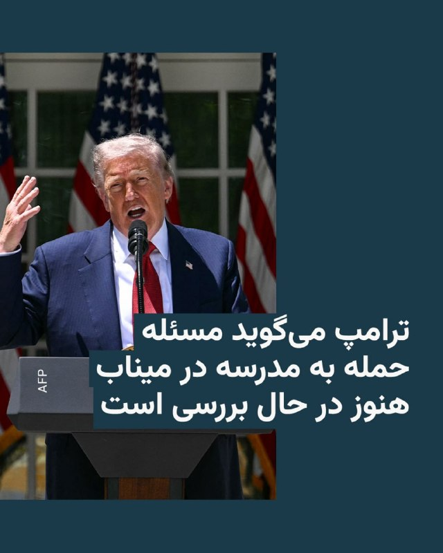

روز جمعه،‌ ۱۸ اردیبهشت، یک خبرنگار در کاخ سفید از دونالد ترامپ درباره نتیجه تحقیقات دولت آمریکا درباره حمله به مدرسه میناب پرسید.

او در پاسخ گفت که این مسئله هم‌چنان در حال بررسی است و نتیجه تحقیقات «به محض آماده شدن» در اختیار خبرنگاران و رسانه‌ها قرار خواهد گرفت.

در جریان حمله به مدرسه‌ای دخترانه و پسرانه در شهر میناب در جنوب کشور که در روز آغازین جنگ مشترک آمریکا و اسرائیل با ایران رخ داد دست‌کم ۱۲۰ دانش‌آموز و ۲۶ معلم کشته شدند.

چند روز پس از حمله، تحقیقات رسانه‌ها نشان داد که این مدرسه که در نزدیکی یک پایگاه دریایی سپاه قرار داشت با موشک‌های آمریکایی هدف قرار گرفته است.
از آن زمان تاکنون هفته‌هاست که پنتاگون اعلام کرده است در حال تحقیق درباره چگونگی رخ دادن این حمله است.
@VahidHeadline

📡 @VahidOnline

## kianmeli1 — post 87293

  

🔴اقلام رکورددار در تورم/ روغن جامد با ۳۸۵درصد افزایش در صدر
https://t.me/kianmeli1

## IranIntlTV — post 336314

  <a href="telegram/content/IranIntlTV_336314_1778338484.mp4">🎬 Download video</a>

دونالد ترامپ با بازنشر یک نظرسنجی، جلوگیری از دستیابی تهران به سلاح هسته‌ای را مهم‌تر از پایان‌دادن به جنگ دانست.

گفت‌وگو با شهرام خلدی، پژوهشگر تاریخ خاورمیانه و روابط بین‌الملل
@iranintltv

## IranIntlTV — post 336313

  

مجید دوستعلی، عضو کمیسیون برنامه و بودجه مجلس گفت: «امروز دشمن به دنبال جنگ اقتصادی است و مردم یک رسالت مهم دارند که آن هم مسئله صرفه‌جویی است. صرفه‌جویی تنها یک توصیه اقتصادی نیست، بلکه ریشه در آموزه‌های دینی و اخلاقی دارد.»

او افزود: «دشمن می‌خواهد از مسیر مشکلاتی مانند کمبود برق، آب یا سوخت، مردم را تحت فشار قرار دهد و نارضایتی ایجاد کند، اما هر میزان صرفه‌جویی مردم، در حقیقت مقابله مستقیم با این توطئه اقتصادی دشمن است.»
https://iranintl.com/202605097748

## IranIntlTV — post 336312

  <a href="telegram/content/IranIntlTV_336312_1778338488.mp4">🎬 Download video</a>

سرخط خبرهای شنبه ۱۹ اردیبهشت
@iranintltv

## IranIntlTV — post 336311

  <a href="telegram/content/IranIntlTV_336311_1778338490.mp4">🎬 Download video</a>

ایرانیان مقیم لندن در حمایت از انقلاب ملی و در پاسخ به فراخوان شاهزاده رضا پهلوی در این شهر تجمع کردند.

گفت‌وگوی تاج‌الدین سروش، خبرنگار ایران‌اینترنشنال، با شرکت‌کنندگان در این تجمع
@iranintltv

## IranIntlTV — post 336310

  

رجب طیب اردوغان، رییس‌جمهور ترکیه در دیدار با مسرور بارزانی، نخست‌وزیر اقلیم کردستان عراق گفت که ترکیه از هدف قرار گرفتن اربیل در جریان جنگ ایران متاسف شده و به هیچ وجه نمی‌خواهد درگیری به دیگر کشورهای منطقه گسترش یابد.

اربیل عراق و مقرهای احزاب کرد ایرانی در این منطقه، از زمان آغاز جنگ میان جمهوری اسلامی و آمریکا و اسرائیل، بارها از سوی حکومت ایران هدف حملات موشکی و پهپادی قرار گرفت.
https://iranintl.com/202605098953

## IranIntlTV — post 336309

  <a href="telegram/content/IranIntlTV_336309_1778338493.mp4">🎬 Download video</a>

رییس انجمن اهدای عضو ایران از کاهش شدید اهدای عضو در شرایط جنگی خبر داد. کتایون نجف‌زاده با اشاره به کاهش ۵۰ تا ۷۰ درصدی اهدای عضو گفت روزانه ۷ تا ۱۰ نفر در کشور به همین دلیل جان خود را از دست می دهند.

گفت‌وگو با مازیار صدری، فوق تخصص مراقبت‌های ویژه
@iranintltv

## IranIntlTV — post 336308

  <a href="telegram/content/IranIntlTV_336308_1778338495.mp4">🎬 Download video</a>

بنا بر اطلاعات رسیده به ایران‌اینترنشنال، به بازیکنان شاغل در لیگ‌های داخلی فوتبال ایران وعده داده شده در صورت حضور در تجمعات شبانه، چهار درصد کسر شده از قراردادشان به آن‌ها بازگردانده خواهد شد.

جزییات بیشتر در گفت‌وگو با رها پوربخش، عضو تحریریه ایران‌اینترنشنال
@iranintltv

## IranIntlTV — post 336307

  

به دنبال فراخوان شاهزاده رضا پهلوی، ایرانیان روز یک‌شنبه، ۲۰ اردیبهشت در شهرهای مختلف جهان در اعتراض به خاموشی اینترنت، بازداشت‌های گسترده و احکام اعدام تجمع و راهپیمایی برگزار می‌کنند.
عنوان فراخوان «یک ملت در گروگان» اعلام شده و هدف از برگزاری، اعتراض به خاموشی اینترنت، بازداشت‌های گسترده و ادامه اعدام شهروندان عنوان شده است.

تجمع سیدنی در استرالیا ساعت ۱۵:۰۰ به وقت محلی آغاز می‌شود و شرکت‌کنندگان مسیر «نورث هاید پارک» تا «مارتین پلیس» را راهپیمایی خواهند کرد. تجمع سئول در کره جنوبی ساعت ۱۶:۰۰ به وقت محلی مقابل ساختمان وزارت خارجه برگزار می‌شود.

تجمع استکهلم در سوئد ساعت ۱۳:۰۰ به وقت محلی در میدان «نورا بانتوریه» برگزار خواهد شد. معترضان در برلین ساعت ۱۵:۰۰ به وقت محلی از «پوتسدامر پلاتس» به سمت «براندنبورگ تور» راهپیمایی می‌کنند و تجمع فرانکفورت ساعت ۱۶:۰۰ به وقت محلی در مرکز شهر برگزار می‌شود.

بر اساس این فراخوان، تجمع تورنتو در کانادا ساعت ۱۳:۰۰ به وقت محلی در مقابل کتابخانه «ریچموند هیل» برگزار خواهد شد و ایرانیان در لس‌آنجلس نیز ساعت ۱۶:۰۰ به وقت محلی در «ویلسایر بولوار» گرد هم می‌آیند.

## IranIntlTV — post 336306

  <a href="telegram/content/IranIntlTV_336306_1778338499.mp4">🎬 Download video</a>

روزنامه دنیای اقتصاد گزارش داد حذف امارات از شرکای تجاری ایران می‌تواند زنجیره تامین کالا در ایران را به‌سرعت تحت تاثیر قرار دهد؛ چرا که بیش از ۳۰ درصد واردات و بخش عمده تامین ارز کالاها از طریق بازار امارات انجام می‌شود.
گفت‌وگو با اشکان نظام‌آبادی، روزنامه‌نگار اقتصادی
@iranintltv

## IranIntlTV — post 336305

  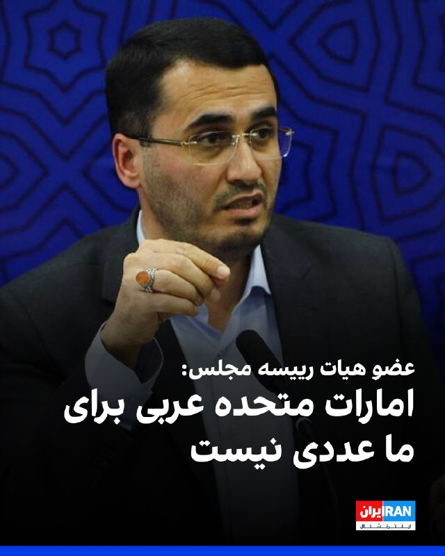

روح‌الله متفکر آزاد، عضو هیات‌ رییسه مجلس گفت: «اگر امارات متحده عربی از عقلانیت استراتژیک برخوردار باشد، هرگز به‌خاطر منافع اسرائیل و آمریکا که در این میدان ناکام مانده‌اند، خود را در مهلکه‌ای بزرگ‌تر از توان و ظرفیت خود قرار نخواهد داد.»

او افزود: «امارات برای جمهوری اسلامی عددی محسوب نمی‌شود.»

این نماینده مجلس ادامه داد: «توصیه می‌شود اماراتی‌ها با درک قواعد این جنگ، از ورود به عرصه‌ای که فراتر از ظرفیت و اندازه آن‌هاست، خودداری کنند.»
https://iranintl.com/202605097571

## IranIntlTV — post 336304

  <a href="telegram/content/IranIntlTV_336304_1778338502.mp4">🎬 Download video</a>

ایرانیان آلمان روز شنبه در دوسلدورف تجمع کرده و ضمن حمایت از انقلاب ملی فریاد پشتیبانی از شاهزاده رضا پهلوی سر دادند.

@iranintltv

## ManotoTV — post 105196

  

وزارت خارجه عربستان سعودی در بیانیه‌ای حمایت کامل ریاض را از اقداماتی اعلام کرد که پادشاهی بحرین برای مقابله با آنچه «اقدام‌های صادرشده از سوی ایران» خوانده، اتخاذ کرده است.

در این بیانیه آمده است این اقدام‌ها به گفته مقام‌های سعودی، امنیت ملی بحرین را تحت تاثیر قرار می‌دهد و با هدف بی‌ثبات کردن امنیت و ثبات این کشور انجام می‌شود.

## ManotoTV — post 105195

  <a href="telegram/content/ManotoTV_105195_1778338506.mp4">🎬 Download video</a>

دانمارک؛ «پاینده ایران، جاوید شاه

## ManotoTV — post 105194

  

ویدیویی از معاون جمعیت هلال احمر منتشر شده که در آن می‌گوید در روز نخست حمله آمریکا و اسرائیل به «بیت رهبری»، علی لاریجانی، عباس عراقچی و علی‌اکبر صالحی در محل حضور داشتند. بر پایه این گفتگو آن‌ها زمان حملات در بیت بودن و به صورت «خاک و خلی» مشاهده شده‌اند.

## FarsiVOA — post 217269

🔺ارتش اسرائیل: بیش از ۸۵ زیرساخت حزب‌الله را هدف قرار دادیم

▪️ارتش اسرائیل روز شنبه ۱۹ اردیبهشت با انتشار بیانیه‌ای اعلام کرد که «در ۲۴ ساعت گذشته» با اجرای حملات هوایی و زمینی، بیش از ۸۵ زیرساخت متعلق به سازمان تروریستی حزب‌الله در جنوب لبنان را هدف قرار داده است.

⬇️ بیشتر بخوانید:

https://ir.voanews.com/a/israel-hezbollah-lebanon-attack-terrorist-army/8148291.html/?nocach=1

## FarsiVOA — post 217268

  

⚡️وزارت ‌ امور خارجه عربستان سعودی روز شنبه ۱۹ اردبیهشت با صدور بیانیه‌ای اعلام کرد که از اقدامات امنیتی دولت بحرین در بازداشت یک گروه مرتبط با سپاه پاسداران به طور کامل حمایت می‌کند.

در این بیانیه، وزارت‌ امور خارجه سعودی از عملکرد دستگاه‌های امنیتی بحرین و اقدامات آنها در شناسایی و کشف زودهنگام فعالیت ضد امنیتی این شبکه ستایش کرده است.

وزارت کشور بحرین صبح شنبه اعلام کرد که ۴۱ تن اعضای یک شبکه مرتبط با سپاه پاسداران جمهوری اسلامی را بازداشت کرده است.

## FarsiVOA — post 217267

🔺طرح اتهام علیه دو مظنون به تهیه «محتوای یهودستیزانه» در بریتانیا

▪️بریتانیا می‌گوید دو مرد پس از ضبط ویدیوهایی یهودستیزانه برای انتشار شبکه اجتماعی تیک‌تاک، به «آزار شهروندان با انگیزه مذهبی» متهم شدند.

⬇️ بیشتر بخوانید:

https://ir.voanews.com/a/britain-antisemitic-london-police-/8148287.html/?nocach=1

## DW_Farsi — post 124480

  <a href="telegram/content/DW_Farsi_124480_1778338509.mp4">🎬 Download video</a>

🎥 احتمال قطع پخش جام جهانی در چین

چین با حدود ۲۰۰ میلیون هوادار فوتبال، یکی از بزرگ‌ترین بازارهای فوتبالی جهان به حساب می‌آید.
اما اختلاف میان فیفا و شبکه دولتی چین بر سر حق پخش، حالا این احتمال را ایجاد کرده که میلیون‌ها نفر در چین نتوانند جام جهانی را تماشا کنند.
@dw_farsi

## Persian_Trend_Official — post 13757

  

🔴 عراق یک بالن حامل محموله بزرگ کپتاگون را ضبط کرد

نیروهای مرزبانی عراق اعلام کردند یک بالن هوایی که از سمت سوریه وارد خاک عراق شده بود را رهگیری و ضبط کرده‌اند.

طبق بیانیه منتشرشده:

▪️ این بالن حامل بیش از ۳۴ کیلوگرم قرص مخدر بوده

▪️ تعداد قرص‌های کشف‌شده بیش از ۱۹۸ هزار عدد کپتاگون اعلام شده است

قاچاق کپتاگون در سال‌های اخیر به یکی از مهم‌ترین چالش‌های امنیتی منطقه، به‌ویژه در مرزهای سوریه، عراق و کشورهای عربی تبدیل شده است/نایا

🫆:Tony

📌 @persian_trend_official
پرشین ترند | متفاوت‌ترین کانال نظامی

## Persian_Trend_Official — post 13756

  <a href="telegram/content/Persian_Trend_Official_13756_1778338512.mp4">🎬 Download video</a>

🔴یکی از دلایل قطع بودن اینترنت تلاش برای القا روایت مورد پسند حاکمیت به فضای درونی جامعه است

▪️در این ویدیو اعلام هدف قرار دادن ناو هواپیمابر امریکا از رسانه داخلی رو مشاهده میکنید

🫆:Tony

📌 @persian_trend_official
پرشین ترند | متفاوت‌ترین کانال نظامی

## Persian_Trend_Official — post 13755

  <a href="telegram/content/Persian_Trend_Official_13755_1778338514.mp4">🎬 Download video</a>

🔴ویدیویی منتشر شده سنتکام از هدف قرار دادن لانچرهای موشکی جمهوری اسلامی در زمان قبل از آتش بس

🫆:Tony

📌 @persian_trend_official
پرشین ترند | متفاوت‌ترین کانال نظامی

## RadioFarda — post 157008

  <a href="https://t.me/radiofarda/157008">📎 Download file</a>

پاراگراف اول؛ وقتی اجرای موسیقی در روزهای بحرانی و جنگ مسئله می‌شود

🔸در تاریخ کمتر ثبت شده که هنرمندان به‌واسطه فشار، ترس یا هزینه‌های اجتماعی، سازهای خود را زمین گذاشته باشند. آن‌چه بر سر موسیقی آمده، یا در سایهٔ حکومت‌های خودکامه شکل گرفته یا در دل تغییرات سیاسی رادیکال و گاه در نتیجهٔ اعتراض‌های صنفی.

🔸اما در ایران از دی‌ماه ۱۴۰۴ به این سو گویی «جدالی بی‌صدا با ساز و آواز» در جریان است.

🔸در برنامهٔ رادیویی پاراگراف اول به میزبانی محمد ضرغامی، شهیار قنبری ترانه‌سرا به همراه صادق نوجوکی آهنگساز، هر دو ساکن لس‌آنجلس، از فشارهای اجتماعی برای جلوگیری از اجرای صحنه‌ای برنامه‌های هنری در بحران‌های سیاسی گفته‌اند.

🔸متن این گفت‌وگو را در وب‌سایت رادیوفردا بخوانید یا به فایل صوتی آن گوش دهید.

@RadioFarda

## IranianMinds — post 19838

🔴دونالد ترامپ:

اگر همه چیز امضاء و نهایی نشود، مسیر متفاوتی را پیش خواهیم گرفت.
اگر اتفاقی حاصل نشود، ممکن است به پروژه آزادسازی تنگه هرمز بازگردیم، اما آن پروژه آزادی پلاس خواهد بود.
پروژه آزادی به اضافه موارد دیگر.

@IranianMinds

## IranianMinds — post 19837

🔴علم‌الهدی هم گفته که گرانی، کار پیاده‌نظام‌های دشمن است.

@IranianMinds

## IranianMinds — post 19836

  

🔴ترامپ مقاله‌ی یک ماهه را منتشر کرد که ادعا می‌کند بیشتر آمریکایی‌ها معتقدند جلوگیری از دستیابی ایران به سلاح هسته‌ای مهم‌تر از پایان دادن به جنگ است، با عنوان بسیار مهم. این موضع کشور ما است.

@IranianMinds

## BBCPersian — post 280582

🔻لبنان: یک نفر بر اثر حملات امروز اسرائیل کشته شد

لبنان اعلام کرد که با وجود آتش‌بس با حزب‌الله، در حملات امروز اسرائیل به جنوب این کشور دست‌کم یک نفر کشته شده است.

این حملات پس از صدور هشدار تخلیه برای چندین روستا از سوی ارتش اسرائیل انجام شد.

نیروهای اسرائیلی و حزب‌الله مورد حمایت ایران، از زمان اجرایی شدن توافق آتش‌بس در لبنان در ۱۷ آوریل، تقریباً هر روز و عمدتاً در جنوب لبنان با یکدیگر تبادل آتش داشته‌اند.

ارتش اسرائیل از ساکنان ۹ روستا خواسته بود منطقه را تخلیه کنند و هشدار داده بود که در واکنش به «نقض توافق آتش‌بس» از سوی حزب‌الله، «با قدرت» اقدام خواهد کرد.

خبرگزاری رسمی لبنان گزارش داد که جنگنده‌های اسرائیلی یک شهرک در جنوب و چند منطقه دیگر را که در هشدار تخلیه ذکر شده بودند، هدف قرار دادند.

https://bbc.in/3Pf13yO
@BBCPersian

## BBCPersian — post 280581

  <a href="https://t.me/bbcpersian/280581">📎 Download file</a>

📻این هفته در پرگار: شکل نظام سیاسی، موضوعی فرعی؟

🔻آیا شکل یک نظام سیاسی مهم نیست و آنچه اهمیت دارد مضمون آن است؟ آیا مفهوم مشروطه جواب این سوال را می‌دهد؟

میهمان‌ها:
فرزانه بذرپور، تحلیل‌گر سیاسی
دامون گلریز، تحلیل‌گر سیاسی
 
@BBCPersian

## BBCPersian — post 280580

  <a href="telegram/content/BBCPersian_280580_1778338518.mp4">🎬 Download video</a>

⭕️سرخط خبرها، شنبه ۱۹ اردیبهشت ۱۴۰۵
@BBCPersian

## BBCPersian — post 280579

🔻پوتین در رژه روز پیروزی ناتو را تقبیح کرد

ولادیمیر پوتین، رئیس‌جمهور روسیه، از سخنرانی سالانه خود به مناسبت «روز پیروزی» در میدان سرخ مسکو برای توجیه جنگ در اوکراین و محکوم کردن ناتو استفاده کرد.

رئیس‌جمهور روسیه در حضور صدها پرسنل نظامی و در کنار چند نفر از رهبران جهان، گفت که در حال جنگی «موجه» است؛ او اوکراین را «نیرویی متجاوز» خواند که «از سوی ناتو مسلح و حمایت می‌شود».

«روز پیروزی» یادبود پیروزی اتحاد جماهیر شوروی بر آلمان نازی و بزرگترین تعطیلی سراسری در روسیه است؛ اما امسال جشن‌های این مراسم کم‌سر‌وصداتر از معمول برگزار می‌شود.

https://bbc.in/4d9CJ9q
@BBCPersian

## Dirty_Kids — post 389167

  <a href="telegram/content/Dirty_Kids_389167_1778338521.mp4">🎬 Download video</a>

ویدئویی که تو این روزهای بی‌نِتی وایرال شده؛

دختره پشت فرمون داره مشروب میخوره و با افتخار فیلم هم می‌گیره! کاش اگه تصادف کردی حداقل فقط خودت آسیب ببینب و به بقیه آسیب نزنی...

اینا همینایی هستن که بی‌حجاب میرن تجمعات عرزشیا

@Dirty_Kids 👻

## Dirty_Kids — post 389166

  <a href="telegram/content/Dirty_Kids_389166_1778338524.mp4">🎬 Download video</a>

ویدیو وایرال شده از پیرسگی ولایی در هنگام فرار از دست مردم

قیافه‌هارو ببینید!! همه عرب فلسطینی لبنانی عراقی افغانین.. پول ما صرف چه چیزایی میشه

@Dirty_Kids 👻

## Dirty_Kids — post 389165

‏یعنی من شک نداشتم اینا مخازن پر بشه سر شیلنگ رو میگیرن سمت خلیج فارس. اونی که ۴۰ هزار معترض رو میکشه مگه از نابود کردن اکولوژی ابایی داره؟

@Dirty_Kids 👻

## configx2ray — post 38694

  <a href="https://t.me/ConfigX2ray/38694">📎 Download file</a>

کانفیگ برای Npv tunnel ⭕️

به هیچ وج دانلود نزنید باهاش
❤️

رمز فایل : @ConfigX2ray

Channel : https://t.me/ConfigX2ray

## manototv — post 105196

  

وزارت خارجه عربستان سعودی در بیانیه‌ای حمایت کامل ریاض را از اقداماتی اعلام کرد که پادشاهی بحرین برای مقابله با آنچه «اقدام‌های صادرشده از سوی ایران» خوانده، اتخاذ کرده است.

در این بیانیه آمده است این اقدام‌ها به گفته مقام‌های سعودی، امنیت ملی بحرین را تحت تاثیر قرار می‌دهد و با هدف بی‌ثبات کردن امنیت و ثبات این کشور انجام می‌شود.

## manototv — post 105195

  <a href="telegram/content/manototv_105195_1778338528.mp4">🎬 Download video</a>

دانمارک؛ «پاینده ایران، جاوید شاه

## manototv — post 105194

  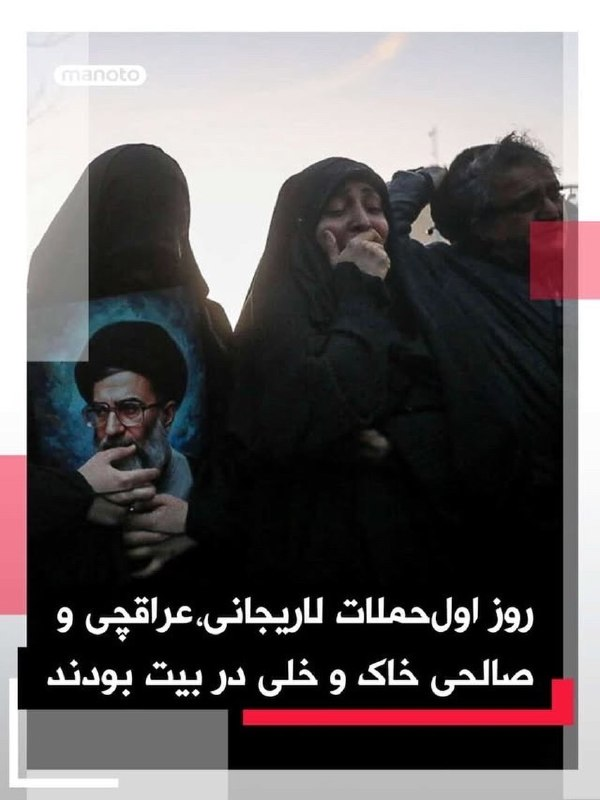

ویدیویی از معاون جمعیت هلال احمر منتشر شده که در آن می‌گوید در روز نخست حمله آمریکا و اسرائیل به «بیت رهبری»، علی لاریجانی، عباس عراقچی و علی‌اکبر صالحی در محل حضور داشتند. بر پایه این گفتگو آن‌ها زمان حملات در بیت بودن و به صورت «خاک و خلی» مشاهده شده‌اند.

## alonews — post 118899

  <a href="telegram/content/alonews_118899_1778338531.jpg">🎬 Download video</a>

👈ترامپ به روزنامه ایتالیایی کوریره دلا سرا گفت: ایتالیا زمانی که ما به آن نیاز داشتیم، آنجا نبود و من در حال بررسی انتقال نیروهایمان از پایگاه‌های ایتالیا هستم.

🔴در حال حاضر تمایلی به اظهار نظر در مورد پاسخ ایران ندارم

✅ @AloNews خبر جنگ

## alonews — post 118898

  <a href="telegram/content/alonews_118898_1778338531.jpg">🎬 Download video</a>

👈نشریه آتلانتیک: پنج تن از دستیاران ترامپ و مشاوران بیرون از کاخ سفید گفتند که رئیس‌جمهور متقاعد شده است که می‌تواند هر نوع توافقی را به عنوان یک پیروزی بفروشد. اما حداقل در حال حاضر، مردی که کتاب «هنر معامله» را نوشته است، حتی نمی‌تواند ایران را پای میز مذاکره بیاورد.

🔴امروز، واشنگتن هنوز منتظر پاسخ ایران به آخرین پیشنهاد است، یک یادداشت تفاهم یک صفحه‌ای که بسیار بیشتر تمدید آتش‌بس است تا معاهده‌ای برای پایان درگیری

✅ @AloNews خبر جنگ

## alonews — post 118897

  <a href="telegram/content/alonews_118897_1778338531.jpg">🎬 Download video</a>

👈نورالدین الدغیر خبرنگار الجزیره در تهران: بازتعریف قواعد درگیری حتی در مذاکرات دارد رخ می دهد

🔴احتمال دارد تهران ارسال پاسخ خود را به جای پیروی از زمان‌بندی واشنگتن، تا پایان هفته به تأخیر بیندازد، زیرا تهران بر اساس فضای عمومی، نه خواهان تسلیم شدن در برابر زمان‌بندی‌های آمریکایی است و نه می‌خواهد بازار انرژی اسیر مواضع آمریکا باشد.

✅ @AloNews خبر جنگ

## alonews — post 118896

  <a href="telegram/content/alonews_118896_1778338532.jpg">🎬 Download video</a>

👈گلدمن ساکس تخمین می‌زند که ذخایر جهانی نفت به پایین‌ترین سطح خود از سال ۲۰۱۸ نزدیک شده‌اند، بلومبرگ گزارش می‌دهد.

✅ @AloNews خبر جنگ

## alonews — post 118895

  <a href="telegram/content/alonews_118895_1778338532.jpg">🎬 Download video</a>

👈وزارت دفاع هند از آزمایش موفق موشک پیشرفته «آگنی» مجهز به سامانه‌های مستقل هدف‌گیری‌شده چندگانه از جزیره خبر داد.
 

🔴بنابر اعلام وزارت دفاع هند، این موشک به اهداف از پیش تعیین شده در منطقه اقیانوس هند با موفقیت برخورد کرد.

✅ @AloNews خبر جنگ

## alonews — post 118894

  <a href="telegram/content/alonews_118894_1778338532.mp4">🎬 Download video</a>

یک روحانی:اگه تو بهشت زمین بخواهید باید هرمتر ۱۷۰۰دلار بدید بیاد

[@AloTweet]

## alonews — post 118893

  <a href="telegram/content/alonews_118893_1778338534.jpg">🎬 Download video</a>

👈نشریه نشنال امارات: انتظار می‌رود روز دوشنبه (به صورت احتمالی)، شورای امنیت سازمان ملل به پیش‌نویس قطعنامه تغییر یافته آمریکا و شورای همکاری خلیج فارس درباره تنگه هرمز رأی دهد

🔴در پیش‌نویس جدید: فصل هفتم (اقدام نظامی) حذف شده است.

🔴 سطح اجرا به امکان بررسی تحریم‌ها در آینده کاهش یافته است.

🔴عبارت‌هایی درباره گفتگو، کاهش تنش و «صلح پایدار» اضافه شده است.

🔴خواسته‌های اصلی از ایران از جمله پایان حملات، پاک‌سازی مین و توقف اخذ عوارض، تا حد زیادی بدون تغییر باقی مانده است

✅ @AloNews خبر جنگ

## alonews — post 118892

  <a href="telegram/content/alonews_118892_1778338534.jpg">🎬 Download video</a>

👈اکونومیست : روسیه می‌خواد 5000 پهپاد برای حمله به نیروهای آمریکا به ایران بده که با جنگ الکترونیک هم نمی‌شه جلوشون وایساد

✅ @AloNews خبر جنگ

## alonews — post 118891

  <a href="telegram/content/alonews_118891_1778338535.jpg">🎬 Download video</a>

👈یک منبع دیپلماتیک ایرانی به الجزیره عربی گفت که تصاویر مربوط به بازدید رئیس جمهور مصر و رئیس امارات از نیروهای نظامی در امارات، اطلاعات جدیدی برای تهران محسوب نمی‌شود و اشاره کرد که ایران از حمایت مصر از کشورهای حاشیه خلیج فارس آگاه است و ماهیت روابط قاهره با شرکای عرب خود را درک می‌کند.

🔴این منبع ایرانی گفت که نگرانی ایران معطوف به حمایت از آمریکا و اسرائیل در جنگ علیه تهران است و تأکید کرد که ایران، مصر را به دنبال رویارویی یا ارائه هرگونه حمایت برای حمله به ایران نمی‌بیند و بنابراین مصر را طرفدار چنین اقداماتی محسوب نمی‌کند.

🔴لازم به ذکر است که اخیرا یک اسکادران از جنگنده‌های رافال نیروی هوایی مصر در امارات متحده عربی مستقر شد.

✅ @AloNews خبر جنگ

## alonews — post 118890

  <a href="telegram/content/alonews_118890_1778338535.jpg">🎬 Download video</a>

👈خسارت قطع اینترنت تاکنون

511,200,000,000,000تومان

🔴اما این حجم خسارت برای مسئولان جزو بیت المال نیست ولی شکستن شیشه خودرو بیت المال است

✅ @AloNews خبر جنگ

## alonews — post 118889

  <a href="telegram/content/alonews_118889_1778338535.jpg">🎬 Download video</a>

👈نیویورک‌تایمز: پهپادهای ایران، حضور‌گستردهٔ آمریکا در غرب آسیا را به نقطه‌ضعف تبدیل کرده‌اند

✅ @AloNews خبر جنگ

## alonews — post 118888

  <a href="telegram/content/alonews_118888_1778338535.jpg">🎬 Download video</a>

👈احتمال شنیدن صدای انفجارهای کنترل‌شده مهمات در بندرعباس

✅ @AloNews خبر جنگ

---
📅 بروزرسانی: 1405/02/19 17:25
---

## VahidOOnLine — post 239099

  

ابراهیم عزیزی، رییس کمیسیون امنیت ملی مجلس، با اشاره به پیش‌نویس قطعنامه بحرین علیه جمهوری اسلامی در شورای امنیت، در شبکه ایکس نوشت: «به دولت‌هایی همچون کشور ذره‌بینی بحرین که در حال همراهی با قطعنامه آمریکایی هستند، درباره پیامدهای جدی این اقدام هشدار می‌دهیم.»

او افزود: «درهای تنگه هرمز را برای همیشه به روی خود نبندید.»
‌🏁 🇬🇧 IranintlTV

🤖 @VahidOOnLine

## VahidOOnLine — post 239098

ایرانیان دانمارک در کپنهاگ روز شنبه با تشکیل تجمعی در حمایت از انقلاب ملی علیه جمهوری اسلامی شعار «پاینده ایران» سر دادند.
‌🏁 🇬🇧 IranintlTV

🤖 @VahidOOnLine

## VahidOOnLine — post 239097

  

دونالد ترامپ، رییس‌جمهوری آمریکا، گزارشی درباره نتایج یک نظرسنجی را که نشان می‌دهد اکثریت رای‌دهندگان آمریکایی جلوگیری از دستیابی جمهوری اسلامی به سلاح هسته‌ای را مهم‌تر از پایان سریع جنگ می‌دانند، در شبکه تروت سوشال بازنشر کرد و نوشت: «این بسیار مهم است، این جایگاه ملت ماست.»

این نظرسنجی که یک ماه پیش از سوی ناپولیتان نیوز منتشر شده، نشان می‌دهد ۵۳ درصد از رای‌دهندگان گفته‌اند جلوگیری از دستیابی جمهوری اسلامی به سلاح هسته‌ای مهم‌تر از پایان دادن به درگیری است.
‌🏁 🇬🇧 IranintlTV

🤖 @VahidOOnLine

## VahidOOnLine — post 239096

  

بر اساس اطلاعات رسیده به ایران‌اینترنشنال، پیام افخمی، شهروند ساکن تهران، ۲۵ اسفند ۱۴۰۴ در منزل خود از سوی ماموران وزارت اطلاعات بازداشت شده و تاکنون خبری از وضعیت، محل نگهداری و اتهام‌های او در دست نیست.

افخمی از زمان بازداشت تنها یک تماس کوتاه با خانواده داشته است.
‌🏁 🇬🇧 IranintlTV

🤖 @VahidOOnLine

## VahidOOnLine — post 239095

  

معاون وزیر ارتباطات اعلام کرد برآوردهای اولیه نشان می‌دهد کسب‌وکارهای دیجیتال و تجارت الکترونیک در جریان جنگ و محدودیت‌های اینترنتی اخیر، حدود ۲.۴ همت خسارت دیده‌اند.به گفته چیت‌ساز، در ۴۰ روز گذشته با نهادها و تشکل‌های مختلف برای جمع‌آوری مستندات مربوط به خسارت‌های فیزیکی، کاهش درآمد و تعدیل نیرو مکاتبه شده است. او گفت هنوز آمار دقیقی از میزان خسارت واردشده به فریلنسرها وجود ندارد، چون نهاد مشخصی برای ثبت و جمع‌آوری اطلاعات این بخش تعریف نشده است.معاون وزیر ارتباطات همچنین گفت تماس‌های تلفنی بین‌المللی از ابتدای دوره محدودیت‌ها برقرار بوده و اختلالی در این زمینه گزارش نشده است.
‌🏁 🇬🇧 ManotoTV

🤖 @VahidOOnLine

## VahidOOnLine — post 239094

  <a href="telegram/content/VahidOOnLine_239094_1778334950.mp4">🎬 Download video</a>

«تجمع ایرانیان در دانمارک»
‌🏁 🇬🇧 ManotoTV

🤖 @VahidOOnLine

## VahidOOnLine — post 239093

  <a href="telegram/content/VahidOOnLine_239093_1778334953.mp4">🎬 Download video</a>

♦️رژه روز پیروزی روسیه در میدان سرخ مسکو امسال با مدت‌زمان کوتاه‌تر و تغییراتی در ساختار برگزاری همراه بود.
بر اساس گزارش‌ها، این مراسم حدود ۴۵ دقیقه به طول انجامید و برخلاف برخی سال‌های گذشته، نمایش گسترده‌ای از تجهیزات نظامی در آن دیده نشد. همچنین تعداد یگان‌های شرکت‌کننده کاهش یافته و تنها ۱۲ واحد رژه در میدان سرخ حضور داشتند که نسبت به سال ۲۰۲۴ کمتر بوده است.
در بخشی از این مراسم، ویدیویی چند دقیقه‌ای درباره تجهیزات نظامی جدید روسیه پخش شد. همچنین حضور نیروهایی از کره شمالی در رژه توجه‌ها را به خود جلب کرد.
در این رویداد، رهبرانی از کشورهایی مانند بلاروس، قزاقستان، ازبکستان، مالزی و لائوس حضور داشتند، در حالی که کیم جونگ اون، رهبر کره شمالی، در این مراسم شرکت نکرد و تنها پیام تبریکی ارسال کرد.
این مراسم در شرایطی برگزار شد که تحلیلگران به تغییرات در نحوه برگزاری رژه امسال و پیام‌های سیاسی آن توجه ویژه‌ای نشان داده‌اند.
‌🇸🇦 Indypersian

🤖 @VahidOOnLine

## VahidOOnLine — post 239092

  

احسان چیت‌ساز، معاون وزیر ارتباطات گفت که در طول جنگ اخیر، بیش از ۵۰۰ سایت ارتباطی مورد حمله دشمنان قرار گرفت و به‌طور مرتب «ارتباط جزایر ما با سرزمین اصلی قطع می‌شد و در مواردی شهید هم دادیم و خسارت‌های زیادی متحمل شدیم.»

او افزود: «بخشی از این خسارت‌ها ناشی از حملات موشکی مستقیم بود که منجر به تخریب دارایی‌ها و سرمایه‌های ثابت در حوزه اقتصاد دیجیتال شد و چالش اساسی ایجاد کرد.»
‌🏁 🇬🇧 IranintlTV

🤖 @VahidOOnLine

## VahidOOnLine — post 239091

  

وزارت دفاع بریتانیا اعلام کرد ناو جنگی اچ‌ام‌اس دراگون برای پیوستن به ماموریت احتمالی حفاظت از کشتیرانی در تنگه هرمز به خاورمیانه اعزام می‌شود.

بر اساس این اعلام، این ناو نیروی دریایی سلطنتی به منطقه اعزام شده است تا آماده پیوستن به ابتکار مشترک بریتانیا و فرانسه باشد.

در حالی که آتش‌بس شکننده‌ای برقرار است، حملات روز جمعه ادامه یافت و نیروهای آمریکا دو نفتکش جمهوری اسلامی را که به گفته آن‌ها در تلاش برای نقض محاصره اعمال‌شده از سوی دونالد ترامپ، رییس‌جمهوری آمریکا، بودند، هدف قرار دادند.
‌🏁 🇬🇧 IranintlTV

🤖 @VahidOOnLine

## VahidOOnLine — post 239090

  

علیرضا منادی سفیدان، رئیس کمیسیون آموزش مجلس شورای اسلامی اعلام کرده به «آسیب‌دیدگان جدی جنگ» سهمیه کنکور تعلق می‌گیرد.
‌🏁 🇬🇧 ManotoTV

🤖 @VahidOOnLine

## VahidOOnLine — post 239089

  

♦️ سخنگوی وزارت دفاع بریتانیا روز شنبه اعلام کرد که ناو «اچ‌ام‌اس دراگون» (HMS Dragon)، متعلق به ناوگان سلطنتی این کشور، جهت «استقرار پیش‌دستانه برای هرگونه ماموریت چندملیتی آتی جهت حفاظت از کشتیرانی بین‌المللی در تنگه هرمز» به منطقه خاورمیانه اعزام می‌شود.

این سخنگو افزود: «استقرار ناو دراگون بخشی از یک برنامه‌ریزی هوشمندانه است تا اطمینان حاصل شود که بریتانیا، به عنوان بخشی از یک ائتلاف چندملیتی به رهبری مشترک لندن و پاریس، آمادگی کامل را برای تامین امنیت تنگه هرمز در زمان مقتضی داراست.»

به گفته این وزارتخانه، اعزام مذکور در راستای تعهد بریتانیا به یک ماموریت دفاعی و چندملیتی با هدف تقویت اعتماد کشتیرانی تجاری در این آبراه حیاتی صورت می‌گیرد. بریتانیا و فرانسه تاکنون نشست‌های برنامه‌ریزی متعددی را با حضور ده‌ها کشور برای تشکیل ائتلافی جهت بازگرداندن «آزادی ناوبری» در تنگه هرمز رهبری کرده‌اند. با این حال، آن‌ها تاکید دارند که این ماموریت تنها زمانی آغاز خواهد شد که یک آتش‌بس پایدار برقرار شده و صنعت دریانوردی از امنیت کامل تردد کشتی‌ها اطمینان حاصل کند.
‌🇸🇦 Indypersian

🤖 @VahidOOnLine

## VahidOOnLine — post 239088

  

وام، خبرگزاری رسمی امارات متحده عربی گزارش داد محمد بن زاید آل نهیان، رئیس امارات متحده عربی، در تماس تلفنی با ژوزف عون، رئیس‌جمهوری لبنان، گفت‌وگو کرد.در این تماس، عون بار دیگر حملات «تروریستی» جمهوری‌اسلامی علیه غیرنظامیان و تأسیسات غیرنظامی در امارات را محکوم کرد و بر همبستگی لبنان با امارات و حمایت از تمامی اقدام‌های این کشور برای حفظ امنیت، حاکمیت و سلامت سرزمین و شهروندانش تأکید کرد.
‌🏁 🇬🇧 ManotoTV

🤖 @VahidOOnLine

## VahidOOnLine — post 239087

  

فریدریش مرتس، صدراعظم آلمان، با اشاره به اختلاف‌ها میان اروپا و آمریکا تاکید کرد هدف نهایی دو طرف پایان دادن به درگیری و جلوگیری از دستیابی جمهوری اسلامی به سلاح هسته‌ای است. او گفت: «هدف نهایی ما پایان دادن به این درگیری و تضمین این است که ایران نتواند سلاح هسته‌ای تولید کند.» مرتس افزود: «این هدف، هدفی مشترک میان آمریکا و اروپا است.»
‌🏁 🇬🇧 IranintlTV

🤖 @VahidOOnLine

## VahidOOnLine — post 239086

  

ناوشکن «اچ‌ام‌اس دراگون» پیش از احتمال مشارکت در مأموریتی برای حفاظت از کشتیرانی در تنگه هرمز، از شرق مدیترانه به سمت خاورمیانه اعزام می‌شود.وزارت دفاع بریتانیا اعلام کرد این تصمیم باعث می‌شود کشتی در صورت نیاز فوراً در یک مأموریت دفاعی چندملیتی برای تضمین آزادی ناوبری در تنگه هرمز مشارکت کند.به گفته این وزارتخانه، هرگونه مأموریت احتمالی ماهیتی کاملاً دفاعی خواهد داشت و هدف آن بازگرداندن اعتماد به کشتیرانی تجاری است.ناوشکن تایپ ۴۵ «اچ‌ام‌اس دراگون» در ماه مارس برای حفاظت از پایگاه‌های هوایی بریتانیا در قبرس اعزام شده بود، اما کمتر از یک ماه پس از ترک پورتسموث برای تعمیرات پهلو گرفت.
‌🏁 🇬🇧 ManotoTV

🤖 @VahidOOnLine

## VahidOOnLine — post 239085

  <a href="telegram/content/VahidOOnLine_239085_1778334961.mp4">🎬 Download video</a>

گزارشگرمنوتو: «امروز شنبه ۹ می، ما ایرانیان و حامیان آزادی در بریزبن استرالیا بار دیگر به خیابان آمدیم تا نگذاریم صدای مردم ایران و محکومان به اعدام خاموش شود.

نام و تصاویر زندانیان محکوم به اعدام را در دست گرفتیم؛ جوانانی که تنها به جرم خواستن آزادی، با خطر مرگ روبه‌رو هستند.

امروز فریاد زدیم که اجازه نمی‌دهیم درد مردم ایران در سکوت جهان فراموش شود.»
‌🏁 🇬🇧 ManotoTV

🤖 @VahidOOnLine

## VahidOOnLine — post 239084

  

برای نخستین بار، نیروهای کره شمالی در رژه «روز پیروزی» روسیه در میدان سرخ مسکو شرکت کردند؛ حضوری که نشانه گسترش همکاری نظامی میان مسکو و پیونگ‌یانگ توصیف شده است.حضور نظامیان کره شمالی در رژه امسال، همزمان با کاهش نمایش تجهیزات سنگین روسیه، توجه زیادی را جلب کرد. رژه «روز پیروزی» روسیه امسال برخلاف سال‌های گذشته با حضور محدود تانک‌ها و تجهیزات سنگین برگزار شد؛ موضوعی که به گفته تحلیلگران، هم به‌دلیل درگیر بودن بخش بزرگی از تجهیزات روسیه در جنگ اوکراین و هم نگرانی از حملات پهپادی کی‌یف بوده است.با این حال، برای نخستین بار نیروهای کره شمالی در میدان سرخ رژه رفتند؛ حضوری که نشانه نزدیکی بیشتر نظامی میان مسکو و پیونگ‌یانگ تلقی می‌شود. مقام‌های اوکراین و کره جنوبی می‌گویند کره شمالی هزاران نیرو برای حمایت از روسیه به جنگ اوکراین فرستاده است.
‌🏁 🇬🇧 ManotoTV

🤖 @VahidOOnLine

## VahidOOnLine — post 239083

  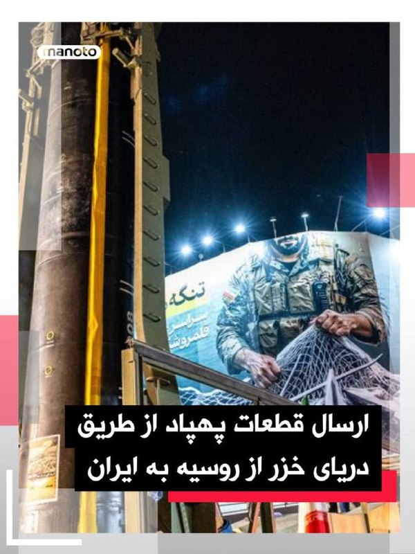

نیویورک تایمز در گزارشی به این موضوع پرداخته که دریای خزر به مسیر حیاتی همکاری جمهوری‌اسلامی و روسیه تبدیل شده؛ مسیری که هم برای دور زدن تحریم‌ها و هم انتقال تجهیزات نظامی استفاده می‌شود.
مقامات آمریکایی می‌گویند روسیه از طریق خزر قطعات پهپاد به جمهوری‌اسلامی ارسال می‌کند تا تهران پس از آسیب‌های جنگ اخیر، توان پهپادی خود را بازسازی کند. به گفته منابع نیویورک تایمز، جمهوری‌اسلامی در درگیری‌های اخیر حدود ۶۰ درصد از زرادخانه پهپادی خود را از دست داده است. این همکاری نظامی دوطرفه است؛ تهران پیش‌تر پهپادهای «شاهد» را برای استفاده در جنگ اوکراین در اختیار روسیه قرار داده بود و مسکو هم اکنون قطعات و تجهیزات موردنیاز تولید یا بازسازی این پهپادها را به ایران می‌فرستد. گزارش‌ها حاکی‌ست بخش زیادی از این انتقال‌ها از طریق دریای خزر انجام می‌شود؛ مسیری که به‌دلیل محدود بودن دسترسی کشورهای خارجی و خاموش شدن سیستم ردیابی برخی کشتی‌ها، نظارت بر آن دشوار است. مقام‌های غربی می‌گویند این مسیر به یکی از مهم‌ترین کانال‌های انتقال مخفیانه تجهیزات نظامی میان تهران و مسکو تبدیل شده است.

همزمان، جمهوری‌اسلامی بخشی از واردات کالاهای اساسی مثل گندم و خوراک دام را به‌دلیل بحران تنگه هرمز از مسیر خزر انجام می‌دهد.
‌🏁 🇬🇧 ManotoTV

🤖 @VahidOOnLine

## VahidOOnLine — post 239082

  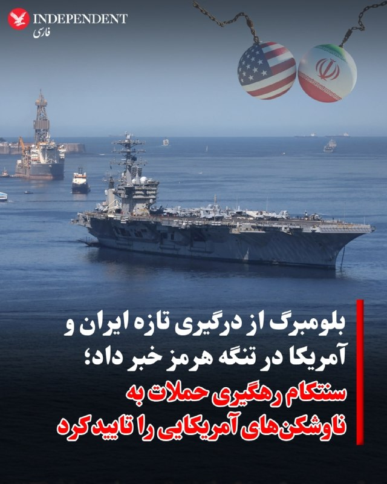

♦️بلومبرگ به نقل از مقام‌های آمریکایی اعلام کرد ارتش ایالات متحده حملات ایران به سه ناوشکن نیروی دریایی آمریکا در تنگه هرمز را رهگیری کرده و در پاسخ، برخی تاسیسات نظامی ایران را هدف قرار داده است، رخدادی که به‌عنوان جدی‌ترین آزمون آتش‌بس شکننده میان تهران و واشنگتن توصیف می‌شود.
فرماندهی مرکزی آمریکا (سنتکام) اعلام کرده این درگیری زمانی رخ داد که ناوشکن‌های آمریکایی در حال عبور از تنگه هرمز بودند. به گفته ارتش آمریکا، ایران با استفاده از موشک، پهپاد و قایق‌های تندرو اقدام به حمله کرده اما هیچ‌یک از شناورهای آمریکایی آسیب ندیده‌اند. واشنگتن تاکید کرده که «به‌دنبال تشدید تنش نیست» اما آماده دفاع از نیروهای خود باقی خواهد ماند.
دونالد ترامپ نیز در اظهاراتی از نابودی پهپادها و تجهیزات ایرانی خبر داد و هشدار داد اگر تهران توافق مدنظر آمریکا را نپذیرد، حملات «بسیار شدیدتری» در راه خواهد بود.
در مقابل، رسانه‌های دولتی ایران اعلام کردند نیروهای ایرانی پس از حمله یک ناو آمریکایی به یک نفتکش ایرانی در نزدیکی جزیره قشم، با «دشمن» وارد تبادل آتش شده‌اند.
‌🇸🇦 Indypersian

🤖 @VahidOOnLine

## VahidOOnLine — post 239081

♦️فدراسیون فوتبال جمهوری اسلامی اعلام کرد تیم ملی فوتبال مردان ایران «قطعا» در مسابقات جام جهانی ۲۰۲۶ شرکت خواهد کرد.
مهدی تاج، رئیس فدراسیون فوتبال با حضور در یک برنامه تلویزیونی اعلام کرد این سازمان با «۱۰ شرط» حاضر به شرکت در جام جهانی فوتبال است. به گفته این مقام حکومتی، «خودداری از مصاحبه‌های تنش‌زا»، «بازجویی نشدن بازیکنان و کادر فنی توسط پلیس مهاجرت آمریکا برای بازیکنانی چون مهدی طارمی و احسان حاج‌صفی که سربازی خود را در سپاه گذرانده‌اند »، «رعایت پروتکل‌های امنیتی فیفا در فرودگاه، هتل و ورزشگاه»، «تضمین امنیت در مسیرهای تردد»، «ممنوعیت ورود هر پرچمی جز پرچم رسمی جمهوری اسلامی به ورزشگاه‌ها»، و «تعیین تکلیف ویزای خبرنگاران و هواداران» از جمله این شروط است.
این تصمیم در حالی اتخاذ می‌شود که تنش‌های نظامی در منطقه ادامه دارد و چندی پیش نیز کانادا از ورود مهدی تاج به دلیل ارتباط با سپاه پاسداران ممانعت کرده بود.
 با وجود هشدار مارکو روبیو درباره احتمال صادر نشدن ویزا برای افراد مرتبط با سپاه پاسداران، جانی اینفانتینو تاکید کرد که بازی‌های ایران طبق برنامه در خاک آمریکا برگزار می‌شود.
‌🇸🇦 Indypersian

🤖 @VahidOOnLine

## VahidOOnLine — post 239080

  

موسی احمدی، رییس کمیسیون انرژی مجلس، در واکنش به گزارش‌ها درباره نشت نفت در دریا در اطراف جزیره خارک، گفت تاکنون هیچ گزارش رسمی این موضوع را تایید نکرده است.
آسوشیتدپرس جمعه ۱۸ اردیبهشت گزارش داد لکه‌ای نفتی از بخش غربی جزیره خارک، در حال نشت است. آمی دنیل، مدیرعامل شرکت اطلاعات دریایی «ویندوارد ای‌آی»، به ای‌پی گفت از روز سه‌شنبه، معادل حدود ۸۰ هزار بشکه نفت از جزیره خارک نشت کرده است.
‌🏁 🇬🇧 IranintlTV

🤖 @VahidOOnLine

## mwarmonitor — post 8754

🇮🇷🇺🇸«ایران هنوز هیچ نشانه‌ای نداده است که آیا طرح رئیس‌جمهور دونالد ترامپ را که روز چهارشنبه ارسال شده و پیشنهاد می‌کند جمهوری اسلامی طی یک ماه آینده آبراه را دوباره بازگشایی کند و در مقابل، آمریکا محاصره بنادر ایران را پایان دهد، خواهد پذیرفت یا نه.» Bloomberg

@mwarmonitor

## mwarmonitor — post 8753

  

🇺🇸رئیس‌جمهور ترامپ مقاله‌ای مربوط به حدود یک ماه پیش را بازنشر کرد که در آن ادعا شده اکثر آمریکایی‌ها معتقدند جلوگیری از دستیابی ایران به سلاح هسته‌ای، مهم‌تر از پایان دادن به جنگ است.

او در توضیح این مطلب نوشت:
«بسیار مهم. این موضع کشور ماست.»

@mwarmonitor

## mwarmonitor — post 8748

🚢سه نفتکش بزرگ حامل نفت خام ایران که هدف حمله آمریکا 🇺🇸 قرار گرفته‌اند، امروز در خلیج جاسک شرقی در مختصات زیر در حال سوختن مشاهده شدند:

25.6139, 57.9483

🚢یک نفتکش از نوع Suezmax به‌شدت در حال آتش‌سوزی است.
یک شناور آتش‌نشانی در نزدیکی یک VLCC که دود می‌کند حضور دارد و از یک VLCC دیگر که هنوز در حال سوختن است، نشت سوخت مشاهده می‌شود.

🚨این حادثه دقیقاً مقابل پایگاه دریایی سپاه پاسداران انقلاب اسلامی رخ داده است.

@mwarmonitor

## pm_afshaa — post 90410

🔴وال استریت ژورنال: بیش از 20 هزار ملوان در صدها کشتی در تنگه هرمز گیر افتاده‌اند و بسیاری از کشتی‌ها با کمبود شدید غذا، آب، سوخت و دارو روبه‌رو شده‌اند

💧 Rainbet.com the #1 Non-KYC Crypto Casino & Sportsbook @rainbetcom

😁 @Pm_Afshaa

## pm_afshaa — post 90409

🔴نت‌بلاکس:قطعی اینترنت در ایران، وارد یازدهمین هفته شد

💧 Rainbet.com the #1 Non-KYC Crypto Casino & Sportsbook @rainbetcom

😁 @Pm_Afshaa

## pm_afshaa — post 90408

  

🔥 ربات فروشگاه مردمی وینستون در خدمت شماست 
🔥

فروش کانفیگ ویتوری 
🏳

گیگی 195.000 تومان
☄️
گیگی 250.000 تومان 
☄️
گیگی 280.000 تومان 
☄️

🔥 سرعت موشکی

💎 ( پنل مشاهده حجم در ربات )
لوکیشن بلغارستان و آلمان و ترکیه 
🇧🇬
🇩🇪
🇹🇷

‼️ برای خرید ربات رو استارت کنید 
‼️

BOT 
📎 @WinstonLite_bot

PV 
✉️ @mosadeveloper

CH 
📣 https://t.me/winstonservice

## pm_afshaa — post 90407

  

🔴ترامپ مقاله‌ای رو منتشر کرد که ادعا میکنه بیشتر آمریکایی‌ها معتقدن جلوگیری از دستیابی ایران به سلاح هسته‌ای مهم‌تر از پایان دادن به جنگه؛ با عنوان «بسیار مهم. این موضع کشور ما است.

💧 Rainbet.com the #1 Non-KYC Crypto Casino & Sportsbook @rainbetcom

😁 @Pm_Afshaa

## pm_afshaa — post 90406

  <a href="telegram/content/pm_afshaa_90406_1778334970.jpg">🎬 Download video</a>

🔴وزارت دفاع بریتانیا اعلام کرد ناوشکن دراگون به خاورمیانه اعزام میشه.

💧 Rainbet.com the #1 Non-KYC Crypto Casino & Sportsbook @rainbetcom

😁 @Pm_Afshaa

## pm_afshaa — post 90405

  <a href="telegram/content/pm_afshaa_90405_1778334970.jpg">🎬 Download video</a>

🔴سنتکام: نیروهای آمریکا در سراسر منطقه همچنان برای انجام ماموریت آماده هستن.

💧 Rainbet.com the #1 Non-KYC Crypto Casino & Sportsbook @rainbetcom

😁 @Pm_Afshaa

## pm_afshaa — post 90404

  <a href="telegram/content/pm_afshaa_90404_1778334971.jpg">🎬 Download video</a>

🔴العربیه: نتانیاهو به دولت آمریکا گفته روند مذاکره با جمهوری اسلامی نباید طولانی بشه.

💧 Rainbet.com the #1 Non-KYC Crypto Casino & Sportsbook @rainbetcom

😁 @Pm_Afshaa

## DEJradio — post 4536

  <a href="telegram/content/DEJradio_4536_1778334972.mp4">🎬 Download video</a>

🚨🎥 حال‌‌وش گزارش داد شامگاه جمعه ۱۸ اردیبهشت‌ماه ۱۴۰۵، چندین فروند پهپاد در آسمان و خیابان‌های خیام و خرمشهر در نزدیکی مسجد مکی زاهدان مشاهده شده که باعث نگرانی شماری از شهروندان ساکن این مناطق شده است.

بر اساس ویدئوی ارسالی به حال‌‌وش، چراغ و پرواز یکی از این پهپادها در آسمان منطقه به‌وضوح قابل مشاهده بوده و از آن فیلم‌برداری شده است.
به گفته منابع محلی، علاوه بر این پهپاد، چراغ چند پهپاد دیگر نیز در فاصله‌ای دورتر دیده شده و صدای پرواز آن‌ها در آسمان منطقه شنیده می‌شده است.

به گفته منابع حال‌‌وش: «پهپادها برای مدتی بر فراز مناطق مسکونی اطراف مسجد مکی و خیابان‌های مجاور در حال پرواز و گشت‌زنی بودند و صدای ممتد آن‌ها در سطح منطقه شنیده می‌شد.»

#پهباد #زاهدان
@DEJradio

## IranIntlTV — post 336303

  

ابراهیم عزیزی، رییس کمیسیون امنیت ملی مجلس، با اشاره به پیش‌نویس قطعنامه بحرین علیه جمهوری اسلامی در شورای امنیت، در شبکه ایکس نوشت: «به دولت‌هایی همچون کشور ذره‌بینی بحرین که در حال همراهی با قطعنامه آمریکایی هستند، درباره پیامدهای جدی این اقدام هشدار می‌دهیم.»

او افزود: «درهای تنگه هرمز را برای همیشه به روی خود نبندید.»
https://iranintl.com/202605099666

## IranIntlTV — post 336302

ایرانیان دانمارک در کپنهاگ روز شنبه با تشکیل تجمعی در حمایت از انقلاب ملی علیه جمهوری اسلامی شعار «پاینده ایران» سر دادند.

## IranIntlTV — post 336301

  

دونالد ترامپ، رییس‌جمهوری آمریکا، گزارشی درباره نتایج یک نظرسنجی را که نشان می‌دهد اکثریت رای‌دهندگان آمریکایی جلوگیری از دستیابی جمهوری اسلامی به سلاح هسته‌ای را مهم‌تر از پایان سریع جنگ می‌دانند، در شبکه تروت سوشال بازنشر کرد و نوشت: «این بسیار مهم است، این جایگاه ملت ماست.»

این نظرسنجی که یک ماه پیش از سوی ناپولیتان نیوز منتشر شده، نشان می‌دهد ۵۳ درصد از رای‌دهندگان گفته‌اند جلوگیری از دستیابی جمهوری اسلامی به سلاح هسته‌ای مهم‌تر از پایان دادن به درگیری است.
https://iranintl.com/202605091217

## IranIntlTV — post 336300

  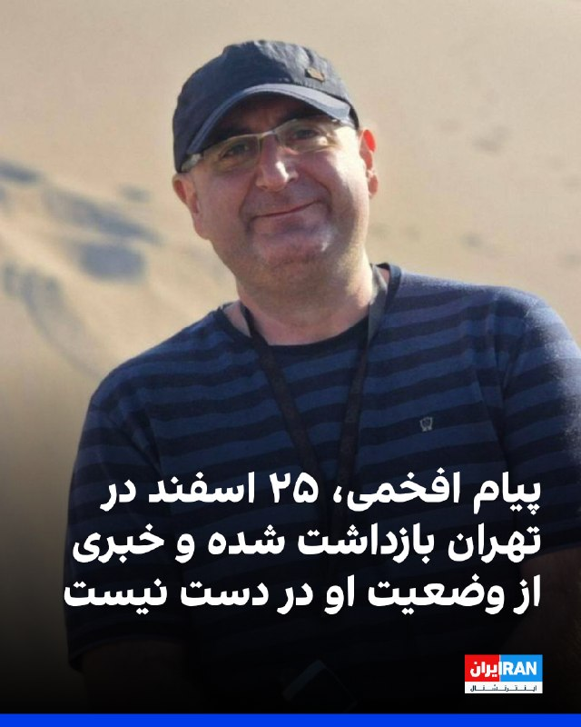

بر اساس اطلاعات رسیده به ایران‌اینترنشنال، پیام افخمی، شهروند ساکن تهران، ۲۵ اسفند ۱۴۰۴ در منزل خود از سوی ماموران وزارت اطلاعات بازداشت شده و تاکنون خبری از وضعیت، محل نگهداری و اتهام‌های او در دست نیست.

افخمی از زمان بازداشت تنها یک تماس کوتاه با خانواده داشته است.
https://iranintl.com/202605094577

## IranIntlTV — post 336299

  <a href="telegram/content/IranIntlTV_336299_1778334977.mp4">🎬 Download video</a>

یکی از شرکت‌کنندگان در تجمع کپنهاگن، به مهران عباسیان، خبرنگار ایران‌اینترنشنال، گفت: «امروز جمع شده‌ایم تا صدای مردمی باشیم که صدایشان قطع شده تا بگوییم می‌خواهیم ایران را از غاصبان پس بگیریم.»
@iranintltv

## IranIntlTV — post 336298

  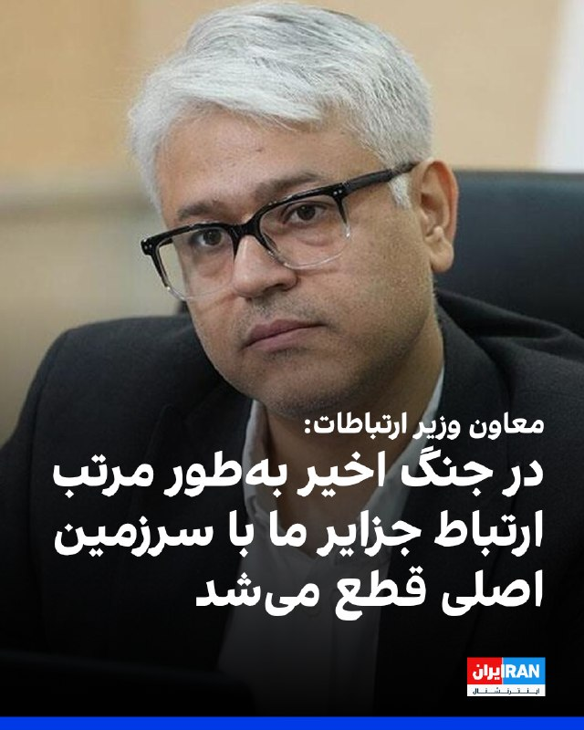

احسان چیت‌ساز، معاون وزیر ارتباطات گفت که در طول جنگ اخیر، بیش از ۵۰۰ سایت ارتباطی مورد حمله دشمنان قرار گرفت و به‌طور مرتب «ارتباط جزایر ما با سرزمین اصلی قطع می‌شد و در مواردی شهید هم دادیم و خسارت‌های زیادی متحمل شدیم.»

او افزود: «بخشی از این خسارت‌ها ناشی از حملات موشکی مستقیم بود که منجر به تخریب دارایی‌ها و سرمایه‌های ثابت در حوزه اقتصاد دیجیتال شد و چالش اساسی ایجاد کرد.»
https://iranintl.com/202605099835

## IranIntlTV — post 336297

  

وزارت دفاع بریتانیا اعلام کرد ناو جنگی اچ‌ام‌اس دراگون برای پیوستن به ماموریت احتمالی حفاظت از کشتیرانی در تنگه هرمز به خاورمیانه اعزام می‌شود.

بر اساس این اعلام، این ناو نیروی دریایی سلطنتی به منطقه اعزام شده است تا آماده پیوستن به ابتکار مشترک بریتانیا و فرانسه باشد.

در حالی که آتش‌بس شکننده‌ای برقرار است، حملات روز جمعه ادامه یافت و نیروهای آمریکا دو نفتکش جمهوری اسلامی را که به گفته آن‌ها در تلاش برای نقض محاصره اعمال‌شده از سوی دونالد ترامپ، رییس‌جمهوری آمریکا، بودند، هدف قرار دادند.
https://iranintl.com/202605091928

## IranIntlTV — post 336296

🔻دریای خزر، مسیر پنهان تجارت و همکاری نظامی تهران و مسکو در سایه جنگ

نیویورک‌تایمز گزارش داد روسیه از طریق دریای خزر کالاهای نظامی و تجاری به ایران ارسال می‌کند تا توان جمهوری اسلامی را برای مقاومت در برابر حملات آمریکا تقویت کند. این رسانه به نقل از مقام‌های آمریکایی نوشت روسیه از مسیر دریای خزر قطعات پهپاد به ایران منتقل می‌کند.

بر اساس این گزارش، روسیه همچنین کالاهایی را تامین می‌کند که پیش‌تر معمولا از تنگه هرمز عبور می‌کردند.

آمارهای تجاری روسیه نشان می‌دهند حمل‌ونقل از طریق دریای خزر در ماه‌های اخیر افزایش یافته است.

ویتالی چرنوف، مدیر بخش تحلیل در گروه رسانه‌ای پورت‌نیوز، گفت سالانه دو میلیون تن گندم روسیه که پیش‌تر از دریای سیاه به ایران ارسال می‌شد، اکنون از مسیر خزر منتقل می‌شود.

او افزود: «در سایه بی‌ثباتی در خاورمیانه، مسیرهای خزر به ایران بسیار جذاب‌تر به نظر می‌رسند.»

الکساندر شاروف، رییس موسسه روس‌ایران‌اکسپو که به صادرکنندگان روسیه برای یافتن خریداران ایرانی کمک می‌کند، نیز برآورد کرد حجم بار عبوری از خزر ممکن است امسال دو برابر شود.

نیویورک‌تایمز نوشت که حمله جنگنده‌های اسرائیلی به مرکز فرماندهی نیروی دریایی جمهوری اسلامی در بندر انزلی در اسفند ۱۴۰۴، بار دیگر نگاه‌ها را به دریای خزر جلب کرد. جایی که در ماه‌های اخیر به یکی از مهم‌ترین مسیرهای تجاری و لجستیکی میان ایران و روسیه تبدیل شده است و نقشی فزاینده در تجارت آشکار و پنهان میان تهران و مسکو پیدا کرده است.
مسیر جایگزین

به نوشته نیویورک‌تایمز، برای ایران و روسیه - دو کشوری که هم‌زمان درگیر جنگ و تحت تحریم‌های گسترده غرب هستند - دریای خزر به مسیر مهمی برای انتقال کالا و همکاری‌های اقتصادی و نظامی تبدیل شده است.

مقام‌های آمریکایی گفتند روسیه از طریق دریای خزر قطعات پهپاد برای حکومت ایران ارسال می‌کند تا تهران بتواند توان پهپادی خود را که در جنگ اخیر حدود ۶۰ درصد آن از دست رفته است، بازسازی کند.

این مقام‌ها که نخواستند نامشان فاش شود، گفتند مسکو همچنین بخشی از کالاهایی را که پیش‌تر از مسیر تنگه هرمز وارد ایران می‌شد، اکنون از طریق دریای خزر منتقل می‌کند. به‌ویژه پس از آن که تنگه هرمز با محاصره نیروی دریایی آمریکا روبه‌رو شد.

مقام‌های حکومت ایران نیز اعلام کرده‌اند توسعه مسیرهای جایگزین تجاری با سرعت در حال انجام است و چهار بندر ایران در ساحل خزر به‌صورت شبانه‌روزی در حال دریافت گندم، ذرت، خوراک دام، روغن آفتابگردان و دیگر کالاهای اساسی هستند.

محمدرضا مرتضوی، رییس انجمن صنایع غذایی ایران، به صداوسیمای جمهوری اسلامی گفت ایران در حال انتقال مسیر واردات کالاهای اساسی به دریای خزر است.
مسیر دشوار برای رصد غرب

آمارهای بنادر روسیه نیز نشان‌دهنده رشد سریع حمل‌ونقل در دریای خزر است.

چرنوف گفت دو میلیون تن گندم روسیه اکنون از مسیر خزر منتقل می‌شود، زیرا مسیر دریای سیاه در معرض حملات اوکراین قرار دارد.

دریای خزر که بزرگ‌تر از ژاپن و بزرگ‌ترین دریاچه جهان محسوب می‌شود، به نوشته نیویورک‌تایمز به مسیر دشواری برای رصد غرب تبدیل شده است.

گروه‌های ردیابی دریایی می‌گویند کشتی‌هایی که میان بنادر ایران و روسیه رفت‌وآمد می‌کنند، اغلب سامانه‌های ردیابی خود را خاموش می‌کنند.

بر خلاف خلیج فارس، آمریکا نیز امکان توقیف یا بازرسی کشتی‌ها در خزر را ندارد، زیرا تنها پنج کشور ساحلی به این آبراه دسترسی دارند.

نیکول گراجفسکی، پژوهشگر حوزه ایران و روسیه در موسسه مطالعات سیاسی پاریس، گفت: «اگر به‌دنبال مسیر ایده‌آل برای دور زدن تحریم‌ها و انتقال تجهیزات نظامی باشید، دریای خزر همان‌جاست.»
همکاری پهپادی تهران و مسکو

این گزارش تاکید کرد همکاری نظامی جمهوری اسلامی و روسیه در زمینه پهپادها، نمونه‌ای از نزدیکی دفاعی دو کشور است.

به گفته مقام‌های آمریکایی، در حالی که روسیه در سال‌های گذشته برای جنگ اوکراین از ایران پهپاد دریافت می‌کرد، هم‌زمان قطعات و فناوری به ایران می‌فرستاد.

اما پس از آن که این کشور از تیر ۱۴۰۲ تولید نسخه بومی پهپاد شاهد را در کارخانه‌ای در تاتارستان آغاز کرد، نیازش به واردات مستقیم از ایران کاهش یافت.

اوکراین در مرداد ۱۴۰۴ اعلام کرد یک کشتی روسی را در بندر اولیا در شمال غرب خزر هدف قرار داده که به گفته کی‌یف در حال انتقال قطعات پهپاد شاهد از ایران بوده است.

وزارت خزانه‌داری آمریکا نیز پیش‌تر این کشتی و مالک روس آن را تحریم کرده و گفته بود در انتقال موشک‌های بالستیک کوتاه‌برد از ایران به روسیه نقش داشته‌اند.
خزر، نقطه کور برای آمریکا

به نوشته نیویورک‌تایمز، اهمیت راهبردی دریای خزر برای ایران و روسیه سال‌هاست روشن بوده است.
🔗ادامه این گزارش را اینجا بخوانید
@iranintltv

## IranIntlTV — post 336295

  

فریدریش مرتس، صدراعظم آلمان، با اشاره به اختلاف‌ها میان اروپا و آمریکا تاکید کرد هدف نهایی دو طرف پایان دادن به درگیری و جلوگیری از دستیابی جمهوری اسلامی به سلاح هسته‌ای است. او گفت: «هدف نهایی ما پایان دادن به این درگیری و تضمین این است که ایران نتواند سلاح هسته‌ای تولید کند.» مرتس افزود: «این هدف، هدفی مشترک میان آمریکا و اروپا است.»
https://iranintl.com/202605094061

## IranIntlTV — post 336294

🔻تشدید بحران میان جمهوری اسلامی و امارات، ایرانیان مقیم این کشور را بلاتکلیف کرده است

🖋گزارش مریم سینایی

جنگ، روابط حکومت ایران و امارات متحده عربی را تا آستانه گسست کامل پیش برده است. بحرانی که یکی از مهم‌ترین روابط تجاری منطقه را مختل کرده و آینده ایرانیانی را که سال‌ها در امارات زندگی و کسب‌وکار ساخته بودند، در وضعیتی نامعلوم قرار داده است.

صدها هزار ایرانی که در امارات زندگی و تجارت می‌کردند، اکنون با لغو ویزا، محدودیت‌های مالی و آینده‌ای نامطمئن روبه‌رو هستند، آن هم در شرایطی که روابط تهران و ابوظبی به‌سرعت رو به وخامت رفته است.

به گفته چند تن از ساکنان زیان‌دیده، شهروندان ایرانی که در جریان درگیری‌های اخیر امارات را ترک کرده‌اند - چه به مقصد ایران و چه دیگر کشورها - دیگر اجازه بازگشت ندارند؛ حتی برای جمع‌آوری وسایل شخصی خود.

در برخی موارد، به خانواده‌هایی که هنوز در امارات هستند نیز تنها چند هفته فرصت داده شده تا این کشور را ترک کنند.

بسیاری از ایرانیان مقیم امارات گفته‌اند از آن‌ها خواسته شده دارایی‌های خود را به خارج منتقل کنند و استفاده از حساب‌های بانکی اماراتی روزبه‌روز برایشان دشوارتر می‌شود.

اگرچه اموال و شرکت‌ها رسما مصادره نشده‌اند، برخی مالکان دیگر امکان مدیریت مستقیم دارایی‌های خود را ندارند و ناچارند برای فروش اموال از وکالت‌نامه یا واسطه استفاده کنند.

شرکت‌های خارجی فعال در امارات نیز به تدریج از همکاری با افراد و شرکت‌های ایرانی، به‌ویژه فعالان تجاری مرتبط با ایران، خودداری می‌کنند.

گزارش‌ها حاکی است بسیاری از سفارش‌های صادراتی مرتبط با ایران لغو شده‌اند.
هیچ‌کس نمی‌داند فردا چه خواهد شد

رضا، شهروند ۴۰ ساله ایرانی که بیش از هشت سال است همراه همسرش در دبی زندگی می‌کند، گفت ایرانیانی که هنوز در امارات هستند فعلا اخراج نشده‌اند، اما «تحت فشار دائمی» قرار دارند.

او گفت: «فعلا وضعیت اقامت ما در دبی تغییر نکرده، اما دوستانم می‌گویند در شارجه، ابوظبی و دیگر امارت‌ها، حتی ویزای ایرانی‌هایی را که هنوز داخل کشور هستند لغو می‌کنند.»

رضا گفت او و همسرش که پزشک است، عملا منبع درآمد خود را از دست داده‌اند؛ با وجود آن که هنوز مجوز اقامت دارند.

به گفته او، بیمارستان محل کار همسرش از تمدید قرارداد او خودداری کرده و تجارت، واردات و صادرات خودش نیز عملا متوقف شده است.

او گفت: «وضعیت من کاملا نامشخص است. هیچ‌ کسی نمی‌داند فردا چه خواهد شد.»

رضا افزود اگرچه مجوز شرکتش رسما لغو نشده، اما دیگر امکان فعالیت ندارد، زیرا تجارت مرتبط با ایران عملا متوقف شده است.

او گفت: «وقتی مجوز کار لغو می‌شود، افراد دیگر نمی‌توانند از دارایی‌های خودشان استفاده کنند. مغازه عمده‌فروشی مواد غذایی یکی از آشنایان را بسته‌اند و چون مجوز تجاری ندارد، حتی نمی‌تواند کالاهایی را که در انبارش مانده، بفروشد.»

به گفته رضا، فشار بر افرادی که متهم به کمک به دور زدن تحریم‌ها از سوی حکومت ایران هستند - از جمله در فروش نفت یا انتقال پول - بیشتر است.

او گفت بسیاری از این افراد پیش‌تر از امارات اخراج شده‌اند و حساب‌های بانکی‌شان نیز مسدود شده است.
اختلال در یکی از مهم‌ترین مسیرهای تجاری ایران

دبی، به‌ویژه بندر جبل علی، سال‌ها یکی از مهم‌ترین دروازه‌های تجاری ایران بود و بخش بزرگی از واردات و تجارت ترانزیتی ایران از این مسیر انجام می‌شد.

امارات اغلب پس از چین، بزرگ‌ترین یا دومین شریک تجاری ایران به شمار می‌رفت، اما اکنون، هم‌زمان با افزایش تنش‌های منطقه‌ای و آنچه «تشدید محاصره دریایی» توصیف می‌شود، این مسیر تجاری به‌شدت مختل شده است.

امارات ۱۸ اردیبهشت اعلام کرد حملات تازه موشکی و پهپادی منتسب به ایران را رهگیری کرده و در این حملات سه نفر زخمی شده‌اند.

در مقابل، قرارگاه مرکزی خاتم‌الانبیا در ایران، حمله به امارات را رد کرد، اما هشدار داد هرگونه عملیات از خاک امارات علیه جزایر، بنادر یا سواحل ایران با «پاسخی کوبنده و پشیمان‌کننده» روبه‌رو خواهد شد.

🔗ادامه این گزارش را اینجا بخوانید

@iranintltv

## IranIntlTV — post 336293

  <a href="telegram/content/IranIntlTV_336293_1778334983.mp4">🎬 Download video</a>

احسان چیت‌ساز، معاون وزیر ارتباطات، گفت نهادهای امنیتی به‌دنبال اجرای راهکاری مشابه چین برای محدودیت اینترنت در ایران هستند. او هشدار داد تفاوت در دسترسی مردم می‌تواند به نارضایتی اجتماعی و چالش امنیتی منجر شود.
گفت‌وگو با علی شیرازی، عضو تحریریه ایران‌اینترنشنال
@iranintltv

## IranIntlTV — post 336292

  <a href="telegram/content/IranIntlTV_336292_1778334986.mp4">🎬 Download video</a>

مخاطبان ایران‌اینترنشنال با فرستادن پیام با گلایه از مشکلات معیشتی می‌گویند نه توان پرداخت اقساط وام‌‌ها را دارند و نه تحمل فشار بانک‌ها را.

محسن مهیمنی، عضو تحریریه ایران‌اینترنشنال، از پیام‌های شهروندان می‌گوید

@iranintltv

## IranIntlTV — post 336291

  <a href="https://t.me/IranintlTV/336291">📎 Download file</a>

🎧نسخه صوتی اخبار نیمروزی | شنبه ۱۹ اردیبهشت
@iranintlTV

## IranIntlTV — post 336290

  <a href="telegram/content/IranIntlTV_336290_1778334989.mp4">🎬 Download video</a>

یکی از شرکت‌کنندگان در تجمع کپنهاگ در گفت‌وگو با مهران عباسیان، خبرنگار ایران‌اینترنشنال، با تاکید بر حمایت از مردم داخل ایران گفت: « تاریخ نشان می‌دهد هیچ حکومتی برای همیشه باقی نمانده و جمهوری اسلامی نیز سرنگون می‌شود و ملت بزرگ ایران پیروز می‌شود.»
@iranintltv

## IranIntlTV — post 336289

  <a href="telegram/content/IranIntlTV_336289_1778334991.mp4">🎬 Download video</a>

یکی از شرکت‌کنندگان در تجمع ایرانیان در لندن به ایران‌اینترنشنال گفت: «مذاکره آمریکا با حکومت ایران بی‌فایده است.» او افزود: «جمهوری اسلامی حقوق بشر را نقض کرده و میان مردم ایران و این حکومت دریایی از خون فاصله است.»

گزارش تاج‌الدین سروش، خبرنگار ایران‌اینترنشنال
@iranintltv

## IranIntlTV — post 336288

  

موسی احمدی، رییس کمیسیون انرژی مجلس، در واکنش به گزارش‌ها درباره نشت نفت در دریا در اطراف جزیره خارک، گفت تاکنون هیچ گزارش رسمی این موضوع را تایید نکرده است.
آسوشیتدپرس جمعه ۱۸ اردیبهشت گزارش داد لکه‌ای نفتی از بخش غربی جزیره خارک، در حال نشت است. آمی دنیل، مدیرعامل شرکت اطلاعات دریایی «ویندوارد ای‌آی»، به ای‌پی گفت از روز سه‌شنبه، معادل حدود ۸۰ هزار بشکه نفت از جزیره خارک نشت کرده است.
https://iranintl.com/202605091766

## IranIntlTV — post 336287

  <a href="telegram/content/IranIntlTV_336287_1778334995.mp4">🎬 Download video</a>

ایرانیان مقیم کپنهاگ و لندن در اعتراض به موج اعدام‌ها، سرکوب و قطع اینترنت در ایران، تجمع اعتراضی برگزار کردند.

مهران عباسیان و تاج‌الدین سروش، خبرنگاران ایران‌اینترنشنال، گزارش می‌دهند
@iranintltv

## ManotoTV — post 105193

  

معاون وزیر ارتباطات اعلام کرد برآوردهای اولیه نشان می‌دهد کسب‌وکارهای دیجیتال و تجارت الکترونیک در جریان جنگ و محدودیت‌های اینترنتی اخیر، حدود ۲.۴ همت خسارت دیده‌اند.به گفته چیت‌ساز، در ۴۰ روز گذشته با نهادها و تشکل‌های مختلف برای جمع‌آوری مستندات مربوط به خسارت‌های فیزیکی، کاهش درآمد و تعدیل نیرو مکاتبه شده است. او گفت هنوز آمار دقیقی از میزان خسارت واردشده به فریلنسرها وجود ندارد، چون نهاد مشخصی برای ثبت و جمع‌آوری اطلاعات این بخش تعریف نشده است.معاون وزیر ارتباطات همچنین گفت تماس‌های تلفنی بین‌المللی از ابتدای دوره محدودیت‌ها برقرار بوده و اختلالی در این زمینه گزارش نشده است.

## ManotoTV — post 105192

  <a href="telegram/content/ManotoTV_105192_1778334999.mp4">🎬 Download video</a>

«تجمع ایرانیان در دانمارک»

## ManotoTV — post 105191

  

علیرضا منادی سفیدان، رئیس کمیسیون آموزش مجلس شورای اسلامی اعلام کرده به «آسیب‌دیدگان جدی جنگ» سهمیه کنکور تعلق می‌گیرد.

## ManotoTV — post 105190

  

وام، خبرگزاری رسمی امارات متحده عربی گزارش داد محمد بن زاید آل نهیان، رئیس امارات متحده عربی، در تماس تلفنی با ژوزف عون، رئیس‌جمهوری لبنان، گفت‌وگو کرد.در این تماس، عون بار دیگر حملات «تروریستی» جمهوری‌اسلامی علیه غیرنظامیان و تأسیسات غیرنظامی در امارات را محکوم کرد و بر همبستگی لبنان با امارات و حمایت از تمامی اقدام‌های این کشور برای حفظ امنیت، حاکمیت و سلامت سرزمین و شهروندانش تأکید کرد.

## ManotoTV — post 105189

  

ناوشکن «اچ‌ام‌اس دراگون» پیش از احتمال مشارکت در مأموریتی برای حفاظت از کشتیرانی در تنگه هرمز، از شرق مدیترانه به سمت خاورمیانه اعزام می‌شود.وزارت دفاع بریتانیا اعلام کرد این تصمیم باعث می‌شود کشتی در صورت نیاز فوراً در یک مأموریت دفاعی چندملیتی برای تضمین آزادی ناوبری در تنگه هرمز مشارکت کند.به گفته این وزارتخانه، هرگونه مأموریت احتمالی ماهیتی کاملاً دفاعی خواهد داشت و هدف آن بازگرداندن اعتماد به کشتیرانی تجاری است.ناوشکن تایپ ۴۵ «اچ‌ام‌اس دراگون» در ماه مارس برای حفاظت از پایگاه‌های هوایی بریتانیا در قبرس اعزام شده بود، اما کمتر از یک ماه پس از ترک پورتسموث برای تعمیرات پهلو گرفت.

## ManotoTV — post 105188

  <a href="telegram/content/ManotoTV_105188_1778335004.mp4">🎬 Download video</a>

گزارشگرمنوتو: «امروز شنبه ۹ می، ما ایرانیان و حامیان آزادی در بریزبن استرالیا بار دیگر به خیابان آمدیم تا نگذاریم صدای مردم ایران و محکومان به اعدام خاموش شود.

نام و تصاویر زندانیان محکوم به اعدام را در دست گرفتیم؛ جوانانی که تنها به جرم خواستن آزادی، با خطر مرگ روبه‌رو هستند.

امروز فریاد زدیم که اجازه نمی‌دهیم درد مردم ایران در سکوت جهان فراموش شود.»

## ManotoTV — post 105187

  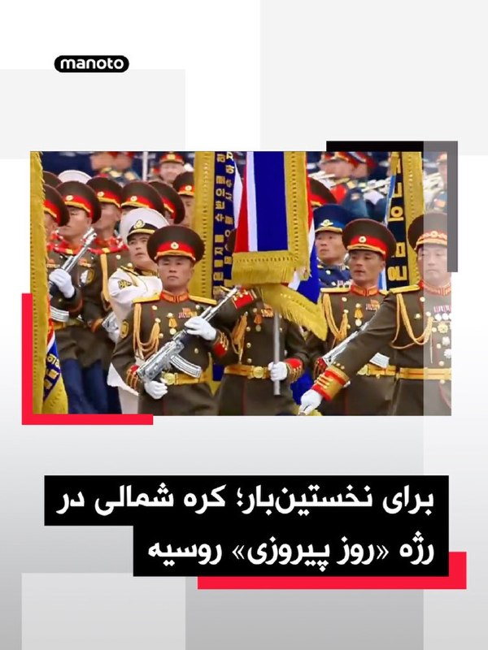

برای نخستین بار، نیروهای کره شمالی در رژه «روز پیروزی» روسیه در میدان سرخ مسکو شرکت کردند؛ حضوری که نشانه گسترش همکاری نظامی میان مسکو و پیونگ‌یانگ توصیف شده است.حضور نظامیان کره شمالی در رژه امسال، همزمان با کاهش نمایش تجهیزات سنگین روسیه، توجه زیادی را جلب کرد. رژه «روز پیروزی» روسیه امسال برخلاف سال‌های گذشته با حضور محدود تانک‌ها و تجهیزات سنگین برگزار شد؛ موضوعی که به گفته تحلیلگران، هم به‌دلیل درگیر بودن بخش بزرگی از تجهیزات روسیه در جنگ اوکراین و هم نگرانی از حملات پهپادی کی‌یف بوده است.با این حال، برای نخستین بار نیروهای کره شمالی در میدان سرخ رژه رفتند؛ حضوری که نشانه نزدیکی بیشتر نظامی میان مسکو و پیونگ‌یانگ تلقی می‌شود. مقام‌های اوکراین و کره جنوبی می‌گویند کره شمالی هزاران نیرو برای حمایت از روسیه به جنگ اوکراین فرستاده است.

## ManotoTV — post 105186

  

نیویورک تایمز در گزارشی به این موضوع پرداخته که دریای خزر به مسیر حیاتی همکاری جمهوری‌اسلامی و روسیه تبدیل شده؛ مسیری که هم برای دور زدن تحریم‌ها و هم انتقال تجهیزات نظامی استفاده می‌شود.
مقامات آمریکایی می‌گویند روسیه از طریق خزر قطعات پهپاد به جمهوری‌اسلامی ارسال می‌کند تا تهران پس از آسیب‌های جنگ اخیر، توان پهپادی خود را بازسازی کند. به گفته منابع نیویورک تایمز، جمهوری‌اسلامی در درگیری‌های اخیر حدود ۶۰ درصد از زرادخانه پهپادی خود را از دست داده است. این همکاری نظامی دوطرفه است؛ تهران پیش‌تر پهپادهای «شاهد» را برای استفاده در جنگ اوکراین در اختیار روسیه قرار داده بود و مسکو هم اکنون قطعات و تجهیزات موردنیاز تولید یا بازسازی این پهپادها را به ایران می‌فرستد. گزارش‌ها حاکی‌ست بخش زیادی از این انتقال‌ها از طریق دریای خزر انجام می‌شود؛ مسیری که به‌دلیل محدود بودن دسترسی کشورهای خارجی و خاموش شدن سیستم ردیابی برخی کشتی‌ها، نظارت بر آن دشوار است. مقام‌های غربی می‌گویند این مسیر به یکی از مهم‌ترین کانال‌های انتقال مخفیانه تجهیزات نظامی میان تهران و مسکو تبدیل شده است.

همزمان، جمهوری‌اسلامی بخشی از واردات کالاهای اساسی مثل گندم و خوراک دام را به‌دلیل بحران تنگه هرمز از مسیر خزر انجام می‌دهد.

## FarsiVOA — post 217266

وزارت دفاع آمریکا برای نخستین بار بخشی از اسناد مربوط به پدیده‌های ناشناس پرنده را منتشر کرد.

این اسناد شامل عکس‌ها، ویدیوها، و گزارش‌هایی است که پیش‌تر در دسترس عموم قرار نداشتند و انتشار آن‌ها در راستای افزایش شفافیت انجام شده است.

@FarsiVOA

## FarsiVOA — post 217265

لکه‌های نفتی خارک؛ شواهد ماهواره‌ای چه می‌گویند و چرا سکوت ادامه دارد

## FarsiVOA — post 217264

  <a href="telegram/content/FarsiVOA_217264_1778335008.mp4">🎬 Download video</a>

ارتش اسرائیل با انتشار این ویدیو اعلام کرد در ۲۴ ساعت گذشته بیش از ۸۵ زیرساخت متعلق به حزب‌الله را در چند منطقه در لبنان هدف قرار داد. این زیرساخت‌ها شامل انبارهای تسلیحاتی، سکوی پرتاب و ساختمان‌های مورد استفاده نظامی حزب‌الله است.

ارتش اسرائیل همچنین اعلام کرد یک سایت زیرزمینی برای تولید سلاح متعلق به حزب‌الله را در منطقه بقاع هدف قرار داده است.

این ویدیو بی‌صدا است.

## FarsiVOA — post 217263

نت‌بلاکس، نهاد مستقل پایش دسترسی به اینترنت، از ورود خاموشی اینترنت در ایران به هفتادویکمین روز و عبور مدت این اختلال از ۱۶۸۰ ساعت خبر داد.

همزمان، آلپ توکر، بنیانگذار این نهاد مستقل پایش اینترنت، نیز در گفت‌وگو با بلومبرگ گفته پیام‌رسان‌های ایرانی رمزگذاری دوسویه ندارند و مقام‌ها می‌توانند به پیام‌ها، موقعیت مکانی و سوابق کاربران دسترسی داشته باشند.

خاموشی بی‌سابقه اینترنت در ایران، در عین حال از یک محدودیت ارتباطی به بحرانی اقتصادی و اجتماعی برای کسب‌وکارهای کوچک تبدیل شده است.

گزارش کامل را در وب‌سایت صدای آمریکا بخوانید.

@FarsiVOA

## DW_Farsi — post 124479

🔶 سفر روبیو به ایتالیا؛ آدم ترامپ برای "مهار خسارت"

برای مارکو روبیو، وزیر خارجه آمریکا سفر به ایتالیا نوعی بازگشت به ریشه‌های خانوادگی‌اش نیز بود؛ بخشی از خانواده او از منطقه پیمونت ایتالیا می‌آیند. در وزارت خارجه ایتالیا در رم، حتی بخش ایتالیایی شجره‌نامه خانوادگی‌اش به‌طور رسمی به او اهدا شد.

روبیو که فرزند مهاجران تبعیدی کوبایی است و به اسپانیایی روان صحبت می‌کند، از شباهت زیاد زبان اسپانیایی و ایتالیایی ابراز شگفتی کرد. او همچنین گفت که مدتی با یک اپلیکیشن آموزش زبان در حال یادگیری ایتالیایی بوده است.

او گفت: «اشتراک بابِل (Babbel) [اپ آموزش زبان] من تمام شده و هنوز تمدیدش نکرده‌ام؛ باید دوباره تمدیدش کنم تا دفعه بعد که به اینجا آمدم ادامه بدهم. اما واقعاً جالب است. من تقریباً همه چیز را می‌فهمم. در جلسات حتی هدفون ترجمه هم نگذاشتم، چون همه حرف‌های او را مستقیم متوجه می‌شدم.»

اما هدف اصلی گفت‌وگوهای روبیو در ایتالیا، مسائل خانوادگی نبود، بلکه سیاست جهانی بود. هرچند روابط شخصی نیز در این سفر نقش داشت؛ زیرا رابطه میان جورجیا ملونی، نخست‌وزیر ایتالیا، و دونالد ترامپ زمانی بسیار خوب بود، اما حالا دچار تنش شده است.

ملونی انتقادهای تند ترامپ از پاپ لئو چهاردهم را غیرقابل قبول دانسته بود. علاوه بر آن، ایتالیا حاضر نشده در جنگ علیه ایران مشارکت کند.
پس از دیدار روبیو و ملونی، وزارت خارجه آمریکا اعلام کرد که روبیو برای «تقویت شراکت راهبردی پایدار میان آمریکا و ایتالیا» با ملونی دیدار کرده است.

طبق اعلام رسمی، موضوعات دیدار شامل چالش‌های امنیتی، همکاری فراآتلانتیکی و هماهنگی نزدیک درباره اولویت‌های مشترک بوده است؛ یعنی تلاشی برای یافتن زمینه مشترک بیشتر در میان بحران‌های جهانی.

جنگ با ایران نیز از جمله این مسائل بود. امیدها برای پایان سریع جنگ فعلاً کاهش یافته، هرچند ایران در حال بررسی پیشنهاد مذاکره آمریکا است.
روبیو پس از دیدار با ملونی در روز جمعه ۸ مه (۱۸ اردیبهشت) در رم گفت: «ما هنوز امروز منتظر پاسخ ایران هستیم. خواهیم دید این پاسخ چیست و امیدواریم بتواند مذاکرات را به‌طور جدی پیش ببرد.»

روبیو همچنین با همتای ایتالیایی خود، آنتونیو تایانی، دیدار مفصلی داشت. موضوع گفت‌وگوها شامل همکاری‌های دوجانبه در حوزه اقتصاد و امنیت بود.

تایانی پس از این دیدار موضع ایتالیا را چنین بیان کرد: «اروپا به آمریکا نیاز دارد، ایتالیا به آمریکا نیاز دارد، اما ایالات متحده نیز به اروپا و ایتالیا نیازمند است. وحدت غرب بسیار اساسی است. به همین دلیل، من مثبت می‌بینم که دیدار با پدر مقدس خوب پیش رفت.»
@dw_farsi

## DW_Farsi — post 124478

  

🔶 روبیو: چند نهاد چین که تصاویر ماهواره‌ای به ایران می‌دادند تحریم شدند

مارکو روبیو، وزیر امور خارجه آمریکا اعلام کرد، هدف تحریم‌های تازه کشورش چندین نهاد مستقر در چین است که تصاویر ماهواره‌ای به ایران می‌دادند تا این کشور را در حملات نظامی علیه نیروهای ایالات متحده در خاورمیانه توانمند سازند.

طبق بیانیه مندرج در وب‌سایت وزارت امور خارجه ایالات متحده، دولت دونالد ترامپ روز جمعه ۸ مه (۱۸ اردیبهشت) همچنین اعلام کرد که در حال اعمال تحریم‌هایی علیه ۱۱ نهاد و سه فرد مستقر در ایران، چین، بلاروس و امارات متحده عربی است که در تلاش‌های ایران برای دستیابی یا استفاده از تسلیحات و تجهیزات مرتبط با آن مشارکت داشته‌اند.

ایالات متحده می‌گوید که از تمام اقدامات لازم و ابزارهایی که در اختیار دارد برای هدف قرار دادن نهادها و افراد در کشورهای ثالث که به ارتش و صنایع دفاعی جمهوری اسلامی ایران کمک می‌کنند، استفاده خواهد کرد.
@dw_farsi

## Persian_Trend_Official — post 13754

  <a href="telegram/content/Persian_Trend_Official_13754_1778335012.mp4">🎬 Download video</a>

🔴 ارسال محموله جدید تانک‌های روسی به خطوط مقدم جنگ

💢منابع روسی گزارش می‌دهند محموله جدیدی از تانک‌های اصلی میدان نبرد T-90M، T-72B3M و T-80BVM از کارخانه‌های تولیدی به خطوط مقدم جنگ اعزام شده‌اند.

💢این اقدام در حالی انجام می‌شود که روسیه همچنان در حال افزایش تولید و نوسازی تجهیزات زرهی خود برای ادامه جنگ با اوکراین است.

🫆:Tony

📌 @persian_trend_official
پرشین ترند | متفاوت‌ترین کانال نظامی

## Persian_Trend_Official — post 13753

  <a href="telegram/content/Persian_Trend_Official_13753_1778335015.mp4">🎬 Download video</a>

وضعیت اصلا به نفع حزب دموکرات نیست!

پس از اجرای طرح باز توزیع حوزه‌های انتخابی ایالت ها که موجب شده هردو حزب به تکاپو برای گرفتن حداکثر ظرفیت برای خود باشند و تبلیغات خود را گسترش دهند بر اساس نظرسنجی های برگزار شده و پیشبینی از افزایش میزان رای‌های هر حزب در برخی از ایالت های آمریکا نسبت به انتخاب پیشین! (قرمز جمهوری خواهان و آبی دموکرات‌ها)

🔴در تگزاس 5 کرسی بیشتر
🔴در فلوریدا 4 کرسی بیشتر
🔴در تنسی یک کرسی بیشتر و حذف آخرین کرسی دموکرات‌های این ایالت
🔴در اوهایو دو کرسی بیشتر
🔴در میزوری 1 کرسی بیشتر
🔴در کارولینای شمالی یک کرسی بیشتر
🔴در آلاباما کسب یک کرسی بیشتر
🔵در کالیفرنیا کسب پنج کرسی بیشتر
🔵در ویرجینیا کسب چهار کرسی جدید
🔵در یوتا کسب اولین کرسی دموکرات‌ها

نتیجه تغییرات تاکنون: 15 نفر جمهوری خواهان و 10 نفر و دستکم پنج نفر بیشتر نسبت به انتخابات سابق

📝 Nick

📌 @persian_trend_official
پرشین ترند | متفاوت‌ترین کانال نظامی

## Persian_Trend_Official — post 13752

  

🔴 پرواز مداوم هواپیمای ارتباطی ارتش آمریکا بر فراز عراق

💢هواپیمای E-11A متعلق به ارتش آمریکا از روز قبل به‌طور مداوم بر فراز مناطق جنوب‌غربی Iraq در حال پرواز است.

💢این هواپیما که برای ایجاد و حفظ ارتباطات رادیویی میان واحدهای عملیاتی ارتش آمریکا استفاده می‌شود، طبق داده‌های فلایت‌رادار از ریاض عربستان به پرواز درآمده است.

💢حضور مداوم E-11A معمولاً در شرایطی دیده می‌شود که نیروهای آمریکایی نیاز به پوشش ارتباطی گسترده برای عملیات‌های هوایی و زمینی داشته باشند.

🫆:Tony

📌 @persian_trend_official
پرشین ترند | متفاوت‌ترین کانال نظامی

## Persian_Trend_Official — post 13751

  <a href="telegram/content/Persian_Trend_Official_13751_1778335016.mp4">🎬 Download video</a>

🔴 بالگردهای تهاجمی آپاچی آمریکا بر فراز بغداد به پرواز درآمدند

💢منابع عراقی گزارش می‌دهند بالگردهای تهاجمی AH-64 آپاچی ارتش ایالات متحده امریکا در آسمان بغداد در حال گشت‌زنی و پرواز مشاهده شده‌اند.

▪️تا این لحظه مقام‌های آمریکایی یا عراقی درباره علت این پروازها توضیح رسمی منتشر نکرده‌اند.

🫆:Tony

📌 @persian_trend_official
پرشین ترند | متفاوت‌ترین کانال نظامی

## Persian_Trend_Official — post 13749

  <a href="telegram/content/Persian_Trend_Official_13749_1778335019.mp4">🎬 Download video</a>

🔴 حمله و ترور هدفمند جدید اسرائیل در لبنان

💢منابع محلی از وقوع یک حمله هدفمند دیگر در منطقه Saadiyat خبر می‌دهند.

💢جزئیات بیشتری درباره هدف حمله، تلفات احتمالی یا ماهیت عملیات تاکنون منتشر نشده است.

🫆:Tony

📌 @persian_trend_official
پرشین ترند | متفاوت‌ترین کانال نظامی

## Persian_Trend_Official — post 13747

🔴 حمله پهپادی اسرائیل به ورودی منطقه الشوف لبنان؛ گزارش اولیه از ۳ کشته

💢منابع لبنانی گزارش می‌دهند یک پهپاد اسرائیلی جاده «ملتقی النهرین» در ورودی منطقه Chouf District را هدف قرار داده است.

💢بر اساس گزارش‌های اولیه، در این حمله دست‌کم ۳ نفر کشته شده‌اند، اما جزئیات بیشتری درباره هویت قربانیان یا وضعیت مجروحان منتشر نشده است/نایا

🫆:Tony

📌 @persian_trend_official
پرشین ترند | متفاوت‌ترین کانال نظامی

## Persian_Trend_Official — post 13746

  <a href="telegram/content/Persian_Trend_Official_13746_1778335021.mp4">🎬 Download video</a>

🔴 حضور نیروهای کره شمالی برای نخستین بار در رژه روز پیروزی روسیه

▪️رسانه‌های روسی گزارش دادند نیروهای نظامی کره شمالی برای نخستین بار در رژه «روز پیروزی» مسکو شرکت کرده‌اند.

🫆:Tony

📌 @persian_trend_official
پرشین ترند | متفاوت‌ترین کانال نظامی

## RadioFarda — post 157007

🔸وزارت دفاع بریتانیا روز شنبه اعلام کرد که پیش از هرگونه مأموریت بین‌المللی برای کمک به حفاظت از کشتیرانی در تنگه هرمز، یک ناوشکن به خاورمیانه اعزام خواهد کرد. 🔸سخنگوی این وزارتخانه به خبرگزاری فرانسه گفت: «استقرار پیشاپیش ناوشکن «اچ‌ام‌اس دراگون» بخشی از…

## RadioFarda — post 157006

  

🔸وزارت دفاع بریتانیا روز شنبه اعلام کرد که پیش از هرگونه مأموریت بین‌المللی برای کمک به حفاظت از کشتیرانی در تنگه هرمز، یک ناوشکن به خاورمیانه اعزام خواهد کرد.

🔸سخنگوی این وزارتخانه به خبرگزاری فرانسه گفت: «استقرار پیشاپیش ناوشکن «اچ‌ام‌اس دراگون» بخشی از برنامه‌ریزی محتاطانه‌ای است که تضمین می‌کند بریتانیا به‌عنوان بخشی از یک ائتلاف چندملیتی به رهبری مشترک بریتانیا و فرانسه، در زمان مناسب آماده تأمین امنیت تنگه باشد.»

🔸لندن و پاریس چند هفته پیش اعلام کردند که طرح‌های نظامی برای تأمین امنیت تنگه هرمز در حال شکل‌گیری است و در بازگرداندن جریان تجارت از طریق این گذرگاه حیاتی موفق خواهد بود.

@RadioFarda

## RadioFarda — post 157005

  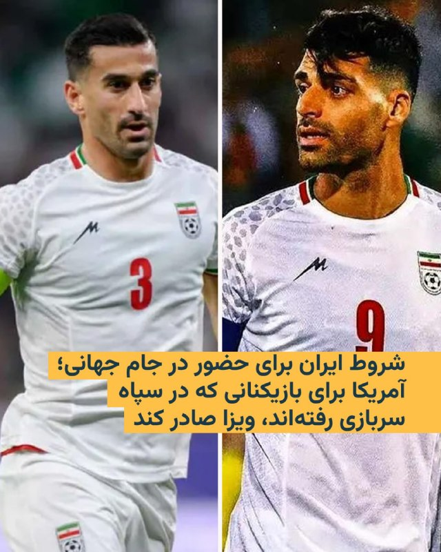

🔸فدراسیون فوتبال ایران روز شنبه با اعلام این که تیم ملی کشور قطعا در جام جهانی فوتبال شرکت خواهد کرد، شرط‌هایی برای این حضور اعلام کرد.

🔸در میان شرط‌هایی که این فدراسیون به آنها اشاره کرده است، لزوم صدور ویزای آمریکا برای «تمامی بازیکنان و کادر فنی، به ویژه کسانی که در سپاه خدمت کرده‌اند» آمده است.

🔸فدراسیون نام مهدی طارمی و احسان حاج‌صفی، دو بازیکن باسابقه تیم ملی، را قید کرده که دوران سربازی را در سپاه پاسداران گذرانده‌اند.

🔸فدراسیون فوتبال ایران همچنین خواستار «بالاترین سطح پروتکل‌های حفاظتی و امنیتی» توسط پلیس آمریکا شد تا به گفته آن، از «حواشی و مشکلات احتمالی (مانند آنچه در استرالیا رخ داد) جلوگیری شود».

🔸اشاره فدراسیون به اتفاقاتی است که در جریان حضور تیم ملی فوتبال زنان ایران در جام ملت‌های آسیا در استرالیا در روزهای ابتدایی جنگ اخیر رخ داد و در نهایت به پناهندگی تعدادی از اعضای این تیم به کشور میزبان ختم شد.

🔸ایران همچنین خواستار ممنوع شدن ورود هرگونه پرچم به جز «پرچم رسمی جمهوری اسلامی» به ورزشگاه‌های محل بازی تیم ایران شده است.

@RadioFarda

## RadioFarda — post 157004

آیا کشاورزی ایران زیر فشار محاصره خارجی و با «آمارسازی داخلی» دوام می‌آورد؟

🔸دولت جمهوری اسلامی ایران می‌گوید اغلب نیازهای کشاورزی کشور در داخل تولید می‌شود و ایران پس از بسته شدن عملی تنگه هرمز و همچنین محاصره دریایی بنادر جنوبی‌ توسط آمریکا، مشکلی در وضعیت کشاورزی، به‌ویژه دسترسی کشاورزان به کودهای شیمیایی، ندارد.

🔸اما گزارش‌های رسانه‌ای و ارزیابی کارشناسان حاکی است که وضعیت تولید کشاورزی ایران در سال‌های اخیر روند نزولی داشته و کمبود و گرانی کودهای شیمیایی می‌تواند این وضعیت را وخیم‌تر کند.

🔸شرایط به‌گونه‌ای است که یکی از رسانه‌های ایران این پرسش را مطرح کرده که آیا وضعیت کنونی منجر به «فلج شدن کشاورزی ایران خواهد شد؟»

🔸وضعیت واقعی تولید کشاورزی در ایران چیست، افزایش قیمت کود به چه میزان بوده و تأثیراتش چیست، و محاصرهٔ بنادر ایران چه نتایجی در حوزهٔ کشاورزی دارد؟

🔸گزارش کامل را در وب‌سایت رادیوفردا بخوانید.

@RadioFarda

## RadioFarda — post 157003

🔸با آغاز تهاجم تمام‌عیار روسیه به اوکراین، لئونید و والنتینا استویانوف، دو دامپزشک در شهر اودسا، زندگی خود را وقف نجات حیوانات آسیب‌دیده و رهاشده جنگ کردند.

🔸این زوج ابتدا حیوانات خانگی زخمی و جامانده را به کلینیک خود منتقل می‌کردند، اما خیلی زود سفر به خطوط مقدم جنگ را برای نجات حیوانات آغاز کردند.

🔸آن‌ها در سال‌های اخیر حیوانات مختلفی، از جمله میمون‌ها و شیرهایی را که از باغ‌وحش‌ها نجات یافته بودند درمان کرده‌اند، پرندگان دریایی گرفتار در آلودگی نفتی را احیا کرده‌اند و برای صدها حیوان نیز در خارج از اوکراین خانه‌های جدید پیدا کرده‌اند.

@RadioFarda

## IranianMinds — post 19835

  <a href="telegram/content/IranianMinds_19835_1778335024.mp4">🎬 Download video</a>

🔴نوحه برای بی‌حجاب‌ها هم خوانده شد.
کم حجابی‌هم که اومده نور چشممونه.

قذافی هم یه گردان فاحشه داشت و بهشون پول می‌داد در مراسم‌ها شرکت کنن.
چی شدن؟

@IranianMinds

## IranianMinds — post 19834

🔴وزارت دفاع بریتانیا اعلام کرد که ناوشکن دراگون در چار‌چوب اجرای مأموریتی تنگه هرمز، راهی خاورمیانه شده است.

@IranianMinds

## BBCPersian — post 280578

🔻فرماندار بندرلنگه در گفتگو با تسنیم آمار نقل شده در رسانه‌ها درباره مفقودشدگان حمله به قایق صیادی را رد کرد

فواد مرادزاده، فرماندار بندرلنگه در گفتگویی با خبرگزاری تسنیم آمار نقل شده در رسانه‌ها درباره مفقودشدگان حمله به قایق صیادی را رد کرده است.

او گفته است: «آنچه به نقل از بنده در برخی رسانه‌ها منتشر شده، کذب است و هیچ‌گونه آمار و اطلاعات رسمی و تأییدشده‌ای در خصوص وقوع چنین حمله‌ای از سوی مراجع ذی‌ربط اعلام نشده است.»

فرماندار بندرلنگه گفته است: «آمار و وضعیت شناورها و ملوانان، صرفاً پس از تأیید نهایی و از طریق منابع رسمی استانداری هرمزگان و فرمانداری شهرستان بندرلنگه منتشر خواهد شد.»

ساعاتی پیش، بعضی از رسانه‌ها و منابع خبری در ایران به نقل از او گزارش داده بودند که در جریان حمله آمریکا به شناورهای ایرانی در نزدیکی بندر خصب عمان، «۶ نفر مفقود شده‌اند.»

این حمله پنجشنبه (۱۷ اردیبهشت) رخ داد.

در این گزارش‌ها، تعداد مجروحان ۶ نفر اعلام شده بود.

https://bbc.in/4tsgZfg
@BBCPersian

## BBCPersian — post 280577

🔻بیمه مرکزی ایران: حدود ۳۰ هزار خودرو در حملات آمریکا و اسرائیل آسیب دیده است

بیمه مرکزی ایران می‌گوید که بر اساس آخرین ارزیابی‌اش، حدود ۳۰ هزار خودرو در جنگ اخیر با آمریکا و اسرائیل آسیب دیده است.

موسی رضایی، رئیس کل بیمه مرکزی، روز شنبه با اعلام این آمار گفت که «خسارت‌های زیر ۳۰ میلیون تومان درهفته‌های گذشته پرداخت شده» و ارزیابی خسارت‌های بالاتر نیز «از پیش نهایی شده است.»

به گفته آقای رضایی «منابع مورد نیاز برای پرداخت خسارت خودروهای آسیب‌دیده در جنگ رمضان تأمین شده و حداکثر تا امروز و فردا پرداخت می‌شود تا بیمه ایران بتواند روند پرداخت‌ها را آغاز کند.»

به گزارش رسانه‌های ایران، طبق دستور بیمه مرکزی، خودروهای آسیب دیده فاقد بیمه بدنه هم «با پرداخت اعتبار مورد نیاز به حساب بیمه ایران، به زودی» پرداخت خسارتشان آغاز می‌شود.

https://bbc.in/4djRvdV
@BBCPersian

## Dirty_Kids — post 389164

نت بلاکس فقط میشمره ما چند روزه قطعیم؟
خب یه گوهییی بخور شمردن رو منم بلدم.

@Dirty_Kids 👻

## Dirty_Kids — post 389163

  <a href="telegram/content/Dirty_Kids_389163_1778335028.mp4">🎬 Download video</a>

برای حکومتی‌های بی‌حجاب نوحه ساختن!

«هرکسی که چادریه تاج‌سرمونه و مث خواهرمونه، کم‌حجابیم که اومده میون میدون، نور چشممون و دختر کشورمونه. آخه کی میگه ظاهر آدما ملاکه؟ در اصل ملاک آدمیت دلِ پاکه.»

تو تجمعات شبانه‌شون فعک کنم کافور میدن، چون همینا معتقد بود موی زن تحریک کنندس باعث راست کردن میشود و گناه است

@Dirty_Kids 👻

## Dirty_Kids — post 389162

  <a href="telegram/content/Dirty_Kids_389162_1778335030.mp4">🎬 Download video</a>

توی محور بهبهان-رامهرمز یه پژو پارس با یه پژو ۴۰۵ به این شکل شاخ به شاخ شد و باعث شد ۶ نفر کشته بشن! 🔞

+ رانندگی تو جاده‌های غیراستاندارد ایران تا این حد خطرناکه که حتی ممکنه توی یه جاده خلوت وقتی داری مسیرتو میری یهو یکی باهات شاخ به شاخ شه!

@Dirty_Kids 👻

## Hranews — post 112847

  

در یازدهمین هفته از قطع اینترنت در ایران، رئیس دانشگاه صنعتی امیرکبیر از «آغاز دسترسی دانشجویان تحصیلات تکمیلی به اینترنت همراه در ساعات مشخص از روز» خبر داده است. عباس سروش همچنین ادعا کرد که در حال حاضر ۹۵٪ اساتید این دانشگاه به اینترنت دسترسی دارند.

↘️
@hranews_bot تماس ✉️ -  @Hranews  کانال هرانا 🆑

## Hranews — post 112846

  

پس از گذشت ۱۶ سال انتظار؛ کماکان مدفن اعدام شدگان ۱۹ اردیبهشت مشخص نیست
 

❗️
❗️
❗️
❗️
❗️ – در تاریخ نوزدهم اردیبهشت ۱۳۸۹، فرزاد کمانگر، معلم و فعال حقوق بشر به همراه چهار زندانی سیاسی دیگر به نام‌های علی حیدریان، شیرین علم هولی، فرهاد وکیلی و مهدی اسلامیان، اعدام شدند. اعدام این شهروندان پس از طی روند پر نقص قضایی، مخفیانه و بدون اطلاع وکیل و خانواده‌ در محوطه‌ی پارکینگ زندان اوین صورت گرفت. پس از گذشت شانزده سال از #اعدام این زندانیان، همچنان از محل دفن آنان اطلاعی به دست نیامده است.
 
به گزارش خبرگزاری هرانا، ارگان خبری مجموعه فعالان حقوق بشر در ایران، شانزده سال پیش در چنین روزی فرزاد کمانگر، علی حیدریان، شیرین علم هولی، فرهاد وکیلی و مهدی اسلامیان، اعدام شدند.
 
صدور و اجرای حکم اعدام فرزاد کمانگر و چهار زندانی دیگر در میان موج بی سابقه اعتراضات داخلی و بین المللی در حالی صورت گرفت که به گواه اسناد موجود، روند حقوقی آنان مملو از موارد مشخص نقض حقوق بود از جمله بازداشت مغایر قانون، نگهداری بلند مدت در سلولهای انفرادی، عدم اجازه دسترسی به وکیل در ایام بازداشت، اعمال شکنجه های جسمی و روحی بر آنان به خصوص در مورد سه تن از آنها در بازداشتگاه های اطلاعات سنندج و کرمانشاه و همینطور موارد متعدد نقض آیین دادرسی، به طوری که حداقل سه متهم (فرزاد کمانگر، فرهاد وکیلی و علی حیدریان) بدون امکان دفاع در یک دادگاه هفت دقیقه‌ای “محارب” شناخته شدند و حکم مرگ برای آنان صادر شد.
 
ادامه مطلب
 
#فرزاد_کمانگر #علی_حیدریان #شیرین_علم_هویی #فرهاد_وکیلی #مهدی_اسلامیان

↘️
@hranews_bot تماس ✉️ -  @Hranews  کانال هرانا 🆑

## Hranews — post 112845

  

اعتماد آنلاین با انتشار گزارشی اعلام کرد، #بحران_دارو در پی #جنگ و تشدید تحریم‌ها ابعاد گسترده‌تری یافته و بازار دارویی کشور با کمبود و افزایش شدید قیمت‌ها روبه‌رو شده است. گزارش‌ها از رشد ۳۰ تا ۳۰۰ درصدی بهای برخی اقلام حکایت دارد؛ در حالی‌که حداقل دستمزد همچنان کمتر از ۱۰۰ دلار برآورد می‌شود و توان خرید شهروندان به‌شدت کاهش یافته است.

در هفته‌های اخیر، کمبود شیرخشک، به‌ویژه انواع تخصصی برای نوزادان دارای شرایط پزشکی خاص، گزارش شده است. همچنین قیمت برخی داروهای حیاتی جهش کم‌سابقه‌ای داشته؛ از جمله دارویی که پیش‌تر با حمایت بیمه کمتر از یک میلیون تومان عرضه می‌شد و اکنون تا ۳۰ میلیون تومان قیمت‌گذاری شده است. داروهای بیماران مبتلا به سرطان، اختلالات تیروئید، بیماری‌های روانی و روماتیسم نیز با افزایش چندبرابری قیمت یا محدودیت عرضه مواجه‌اند. در چنین شرایطی، بیماران و خانواده‌های آنان با فشار فزاینده اقتصادی و دشواری در تامین نیازهای درمانی خود روبه‌رو هستند.

↘️
@hranews_bot تماس ✉️ -  @Hranews  کانال هرانا 🆑

## configx2ray — post 38691

  <a href="https://t.me/ConfigX2ray/38691">📎 Download file</a>

کانفیگ برای Npv tunnel ⭕️

به هیچ وج دانلود نزنید باهاش
❤️

رمز فایل : @ConfigX2ray

Channel : https://t.me/ConfigX2ray

## configx2ray — post 38690

VIP @ConfigX2ray 🔥🇩🇪.npvt

## configx2ray — post 38689

  <a href="https://t.me/ConfigX2ray/38689">📎 Download file</a>

کانفیگ برای Npv tunnel ⭕️

به هیچ وج دانلود نزنید باهاش
❤️

رمز فایل : @ConfigX2ray

Channel : https://t.me/ConfigX2ray

## configx2ray — post 38688

  <a href="telegram/content/configx2ray_38688_1778335037.jpg">🎬 Download video</a>

socks://Og@62.220.126.56:30170#https://t.me/ConfigX2ray

socks://Og@62.220.126.92:30376#https://t.me/ConfigX2ray

ترکیبی با سایفون وصله 
✅

آموزش استفادع : 
👇
https://t.me/ConfigX2ray0/1665

Channel : https://t.me/ConfigX2ray

## configx2ray — post 38685

  <a href="https://t.me/ConfigX2ray/38685">📎 Download file</a>

کانفیگ برای Npv tunnel ⭕️

به هیچ وج دانلود نزنید باهاش
❤️

رمز فایل : @ConfigX2ray

Channel : https://t.me/ConfigX2ray

## configx2ray — post 38683

  <a href="https://t.me/ConfigX2ray/38683">📎 Download file</a>

کانفیگ برای Npv tunnel ⭕️

به هیچ وج دانلود نزنید باهاش
❤️

رمز فایل : @ConfigX2ray

Channel : https://t.me/ConfigX2ray

## manototv — post 105193

  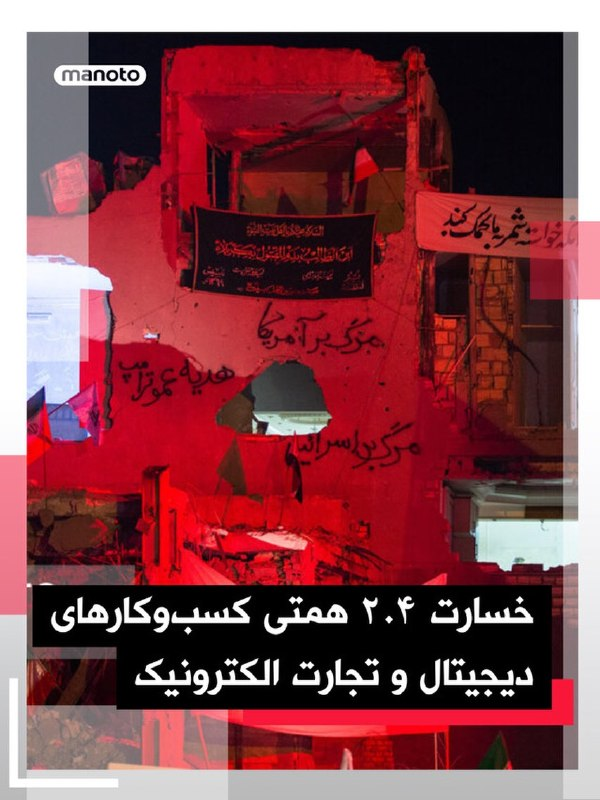

معاون وزیر ارتباطات اعلام کرد برآوردهای اولیه نشان می‌دهد کسب‌وکارهای دیجیتال و تجارت الکترونیک در جریان جنگ و محدودیت‌های اینترنتی اخیر، حدود ۲.۴ همت خسارت دیده‌اند.به گفته چیت‌ساز، در ۴۰ روز گذشته با نهادها و تشکل‌های مختلف برای جمع‌آوری مستندات مربوط به خسارت‌های فیزیکی، کاهش درآمد و تعدیل نیرو مکاتبه شده است. او گفت هنوز آمار دقیقی از میزان خسارت واردشده به فریلنسرها وجود ندارد، چون نهاد مشخصی برای ثبت و جمع‌آوری اطلاعات این بخش تعریف نشده است.معاون وزیر ارتباطات همچنین گفت تماس‌های تلفنی بین‌المللی از ابتدای دوره محدودیت‌ها برقرار بوده و اختلالی در این زمینه گزارش نشده است.

## manototv — post 105192

  <a href="telegram/content/manototv_105192_1778335039.mp4">🎬 Download video</a>

«تجمع ایرانیان در دانمارک»

## manototv — post 105191

  

علیرضا منادی سفیدان، رئیس کمیسیون آموزش مجلس شورای اسلامی اعلام کرده به «آسیب‌دیدگان جدی جنگ» سهمیه کنکور تعلق می‌گیرد.

## manototv — post 105190

  

وام، خبرگزاری رسمی امارات متحده عربی گزارش داد محمد بن زاید آل نهیان، رئیس امارات متحده عربی، در تماس تلفنی با ژوزف عون، رئیس‌جمهوری لبنان، گفت‌وگو کرد.در این تماس، عون بار دیگر حملات «تروریستی» جمهوری‌اسلامی علیه غیرنظامیان و تأسیسات غیرنظامی در امارات را محکوم کرد و بر همبستگی لبنان با امارات و حمایت از تمامی اقدام‌های این کشور برای حفظ امنیت، حاکمیت و سلامت سرزمین و شهروندانش تأکید کرد.

## manototv — post 105189

  

ناوشکن «اچ‌ام‌اس دراگون» پیش از احتمال مشارکت در مأموریتی برای حفاظت از کشتیرانی در تنگه هرمز، از شرق مدیترانه به سمت خاورمیانه اعزام می‌شود.وزارت دفاع بریتانیا اعلام کرد این تصمیم باعث می‌شود کشتی در صورت نیاز فوراً در یک مأموریت دفاعی چندملیتی برای تضمین آزادی ناوبری در تنگه هرمز مشارکت کند.به گفته این وزارتخانه، هرگونه مأموریت احتمالی ماهیتی کاملاً دفاعی خواهد داشت و هدف آن بازگرداندن اعتماد به کشتیرانی تجاری است.ناوشکن تایپ ۴۵ «اچ‌ام‌اس دراگون» در ماه مارس برای حفاظت از پایگاه‌های هوایی بریتانیا در قبرس اعزام شده بود، اما کمتر از یک ماه پس از ترک پورتسموث برای تعمیرات پهلو گرفت.

## manototv — post 105188

  <a href="telegram/content/manototv_105188_1778335044.mp4">🎬 Download video</a>

گزارشگرمنوتو: «امروز شنبه ۹ می، ما ایرانیان و حامیان آزادی در بریزبن استرالیا بار دیگر به خیابان آمدیم تا نگذاریم صدای مردم ایران و محکومان به اعدام خاموش شود.

نام و تصاویر زندانیان محکوم به اعدام را در دست گرفتیم؛ جوانانی که تنها به جرم خواستن آزادی، با خطر مرگ روبه‌رو هستند.

امروز فریاد زدیم که اجازه نمی‌دهیم درد مردم ایران در سکوت جهان فراموش شود.»

## manototv — post 105187

  

برای نخستین بار، نیروهای کره شمالی در رژه «روز پیروزی» روسیه در میدان سرخ مسکو شرکت کردند؛ حضوری که نشانه گسترش همکاری نظامی میان مسکو و پیونگ‌یانگ توصیف شده است.حضور نظامیان کره شمالی در رژه امسال، همزمان با کاهش نمایش تجهیزات سنگین روسیه، توجه زیادی را جلب کرد. رژه «روز پیروزی» روسیه امسال برخلاف سال‌های گذشته با حضور محدود تانک‌ها و تجهیزات سنگین برگزار شد؛ موضوعی که به گفته تحلیلگران، هم به‌دلیل درگیر بودن بخش بزرگی از تجهیزات روسیه در جنگ اوکراین و هم نگرانی از حملات پهپادی کی‌یف بوده است.با این حال، برای نخستین بار نیروهای کره شمالی در میدان سرخ رژه رفتند؛ حضوری که نشانه نزدیکی بیشتر نظامی میان مسکو و پیونگ‌یانگ تلقی می‌شود. مقام‌های اوکراین و کره جنوبی می‌گویند کره شمالی هزاران نیرو برای حمایت از روسیه به جنگ اوکراین فرستاده است.

## manototv — post 105186

  

نیویورک تایمز در گزارشی به این موضوع پرداخته که دریای خزر به مسیر حیاتی همکاری جمهوری‌اسلامی و روسیه تبدیل شده؛ مسیری که هم برای دور زدن تحریم‌ها و هم انتقال تجهیزات نظامی استفاده می‌شود.
مقامات آمریکایی می‌گویند روسیه از طریق خزر قطعات پهپاد به جمهوری‌اسلامی ارسال می‌کند تا تهران پس از آسیب‌های جنگ اخیر، توان پهپادی خود را بازسازی کند. به گفته منابع نیویورک تایمز، جمهوری‌اسلامی در درگیری‌های اخیر حدود ۶۰ درصد از زرادخانه پهپادی خود را از دست داده است. این همکاری نظامی دوطرفه است؛ تهران پیش‌تر پهپادهای «شاهد» را برای استفاده در جنگ اوکراین در اختیار روسیه قرار داده بود و مسکو هم اکنون قطعات و تجهیزات موردنیاز تولید یا بازسازی این پهپادها را به ایران می‌فرستد. گزارش‌ها حاکی‌ست بخش زیادی از این انتقال‌ها از طریق دریای خزر انجام می‌شود؛ مسیری که به‌دلیل محدود بودن دسترسی کشورهای خارجی و خاموش شدن سیستم ردیابی برخی کشتی‌ها، نظارت بر آن دشوار است. مقام‌های غربی می‌گویند این مسیر به یکی از مهم‌ترین کانال‌های انتقال مخفیانه تجهیزات نظامی میان تهران و مسکو تبدیل شده است.

همزمان، جمهوری‌اسلامی بخشی از واردات کالاهای اساسی مثل گندم و خوراک دام را به‌دلیل بحران تنگه هرمز از مسیر خزر انجام می‌دهد.

## alonews — post 118887

  <a href="telegram/content/alonews_118887_1778335048.jpg">🎬 Download video</a>

👈سخنگوی وزارت دفاع بریتانیا: ما یک ناو جنگی بریتانیا به خاورمیانه اعزام می‌شود تا برای پیوستن به مأموریتی بین‌المللی برای رفع انسداد تنگه هرمز آماده باشد.

🔴این سخنگو افزود: «ما میتوانیم تأیید کنیم که اچاماس دراگون به خاورمیانه اعزام خواهد شد تا پیش از هر مأموریت چندملیتی آینده، در موقعیتی مستقر شود که از کشتیرانی بین‌المللی محافظت کند، زمانی که شرایط به کشتیها اجازه عبور از تنگه هرمز را بدهد.»

🔴 «استقرار پیشگیرانه اچاماس دراگون بخشی از برنامه‌ریزی محتاطانه‌ای است که تضمین میکند بریتانیا، به عنوان بخشی از ائتلاف چندملیتی تحت رهبری مشترک بریتانیا و فرانسه، آماده تأمین امنیت تنگه باشد، آن‌گاه که شرایط اجازه دهد.»

✅ @AloNews خبر جنگ

## alonews — post 118886

  <a href="telegram/content/alonews_118886_1778335048.jpg">🎬 Download video</a>

👈گفتگوی مقامات ارشد قطر و مصر درباره آتش‌بس ایران

✅ @AloNews خبر جنگ

## alonews — post 118885

  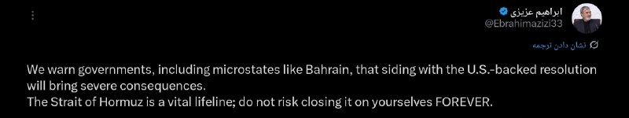

👈رئیس کمیسیون امنیت ملی مجلس، ابراهیم عزیزی : به دولت‌هایی مثل بحرین هشدار میدیم که طرف قطعنامه‌ای که آمریکا هلش میده نرن

🔴وگرنه تاوان سنگینی داره،تنگه هرمز شاهرگ دنیاست، کاری نکنین خودتون باعث بسته شدنش بشین

✅ @AloNews خبر جنگ

## alonews — post 118884

  <a href="telegram/content/alonews_118884_1778335049.jpg">🎬 Download video</a>

👈مینو محرز متخصص بیماری‌های عفونی:
ویروس «هانتا» که شایع شده مرگباره ولی در ایران هنوز موردی گزارش نشده.
ویروس هانتا مثل کووید نیست که فوری جهانگیر بشه و مردم نگران باشن چرا که سرایت انسان به انسان در این ویروس خیلی نادره.
معمولا بخاطر تماس با جوندگان مثل فضله جوندگان بهش مبتلا میشن.
این بیماری میتونه سخت و کشنده باشه و درصورت ابتلا درصد مرگ بسیار زیاده.
علایم این بیماری مثل آنفولانزاست و شامل تب؛ سرفه و بدن درده.

✅ @AloNews خبر جنگ

## alonews — post 118883

  

👈آغاز تست خدمات اینترنت 5G در کابل افغانستان...

✅ @AloNews خبر جنگ

## alonews — post 118881

  

👈وال استریت ژورنال: بیش از ۲۰ هزار ملوان در صدها کشتی در تنگه هرمز گیر افتاده‌اند و بسیاری از کشتی‌ها با کمبود شدید غذا، آب، سوخت و دارو روبه‌رو شده‌اند.

🔴گفته می‌شود بیش از ۸۰۰ کشتی منتظر خروج هستند.

🔴از زمان آغاز بحران، دست‌کم ۱۰ ملوان کشته شده‌اند و بیش از ۳۰ کشتی هدف پهپادها یا موشک‌های ایرانی قرار گرفته‌اند.

🔴خدمه کشتی‌ها گفته‌اند دائماً در ترس از حملات موشکی، پهپادی، مین‌های دریایی و گشت‌های دریایی ایران زندگی می‌کنند؛ در حالی که هزینه بیمه هم به‌شدت افزایش یافته و کمبود تجهیزات بدتر شده است.

🔴برخی کشتی‌ها برای جلوگیری از درگیری:

ردیاب‌های خود را خاموش کرده‌اند
پرچم کشورشان را تغییر داده‌اند
یا خود را «چینی» معرفی کرده‌اند
تا شاید بتوانند از تنش‌ها دور بمانند و منتظر بازگشایی مسیر بمانند.

✅ @AloNews خبر جنگ

## alonews — post 118880

  <a href="telegram/content/alonews_118880_1778335051.jpg">🎬 Download video</a>

👈طبقاتی شدن اینترنت با سرعت ادامه دارد

🔴اطلاعیه دانشگاه امیرکبیر: دسترسی دانشجویان تحصیلات تکمیلی به اینترنت همراه را از هفته گذشته آغاز کردیم تا این افراد بتوانند در ساعات مشخصی از روز به آن دسترسی داشته باشند.

✅ @AloNews خبر جنگ

## alonews — post 118879

  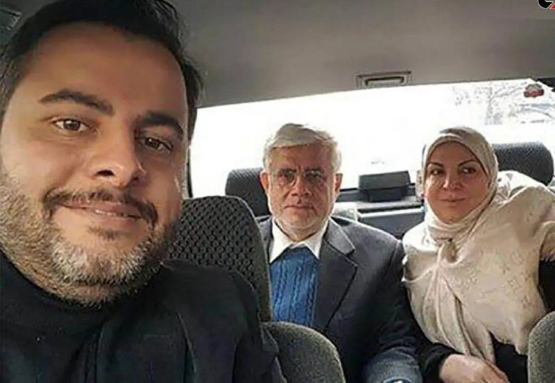

👈عارف،معاون اول دولت: درست میشه

✅ @AloNews خبر جنگ

## alonews — post 118878

  <a href="telegram/content/alonews_118878_1778335052.mp4">🎬 Download video</a>

👈رئیس کمیسیون آموزش مجلس: به آسیب‌دیدگان جنگ سهمیهٔ کنکور تعلق می‌گیرد تا مثل ما دکتر شوند

✅ @AloNews خبر جنگ

## alonews — post 118877

  

👈ترامپ مقاله‌ای یک ماهه را منتشر کرد که ادعا می‌کند بیشتر آمریکایی‌ها معتقدند جلوگیری از دستیابی ایران به سلاح هسته‌ای مهم‌تر از پایان دادن به جنگ است، با عنوان «بسیار مهم. این موضع کشور ما است.»

✅ @AloNews خبر جنگ

## alonews — post 118876

  

👈تاج: برای حضور در جام جهانی ۱۰ شرط برای فیفا گذاشتیم اگه قبول کنن میریم

✅ @AloNews خبر جنگ

## alonews — post 118875

  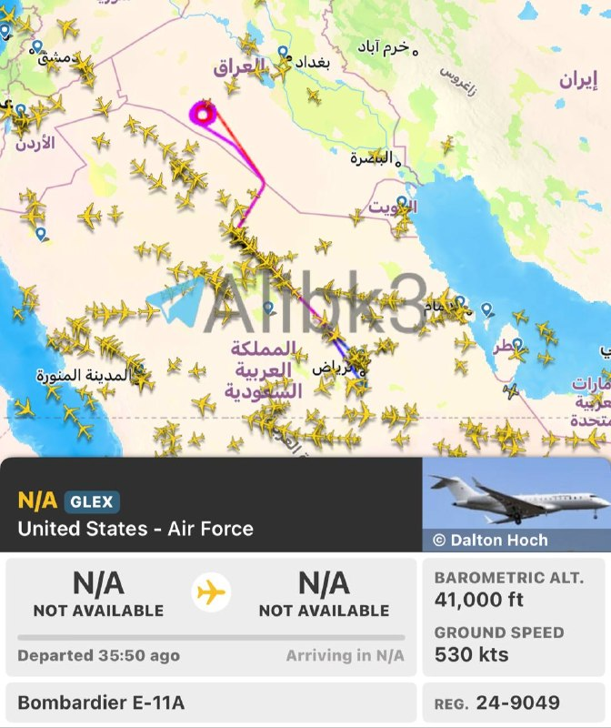

👈یک هواپیمای آمریکایی E-11 با قابلیت اتصال الکترونیکی از عربستان سعودی به سمت عراق پرواز کرد

✅ @AloNews خبر جنگ

## alonews — post 118874

  <a href="telegram/content/alonews_118874_1778335057.mp4">🎬 Download video</a>

👈یه زن حاضر در تجمعات حکومتی: خواب آقا رو دیدم، باحجاب شدم

✅ @AloNews خبر جنگ

## alonews — post 118873

تعرفه سرویس های Vip 
⭕️ 
✅ 1 گیگابایت 
⬅️ 2500/000 تومان 
✅ 3 گیگابایت 
⬅️ 750/000 تومان استارلینک Vip 
💫 
🌟 
⭐️ 5 گیگابایت 
⬅️ 1/200/000 تومان 
⭐️ 10 گیگابایت 
⬅️ 2/400/000 تومان ویژگی های سرویس های Vip : 
❤️‍🔥 
✅ متصل در تمامی دستگاه و اپراتور ها 
✅ مناسب استفاده…

## alonews — post 118872

تعرفه سرویس های Vip 
⭕️

✅ 1 گیگابایت 
⬅️ 2500/000 تومان

✅ 3 گیگابایت 
⬅️ 750/000 تومان

استارلینک Vip 
💫 
🌟

⭐️ 5 گیگابایت 
⬅️ 1/200/000 تومان

⭐️ 10 گیگابایت 
⬅️ 2/400/000 تومان

ویژگی های سرویس های Vip : 
❤️‍🔥

✅ متصل در تمامی دستگاه و اپراتور ها

✅ مناسب استفاده روزمره در تمامی برنامه ها

✅ دارای ساب برای اطلاع لحظه ای باقیمانده

✅ تک لینک بدون نیاز به بروزرسانی های متعدد
 برای خرید از پشتیبانی به ایدی زیر پیام بدید.
👇

🔤 @expressuport

خرید فوری از ربات.
👇

🔤 @vpn_express_sup_bot

## alonews — post 118871

  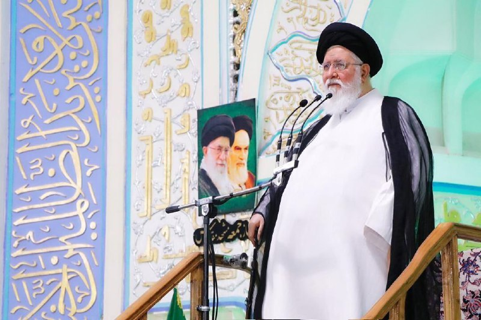

👈علم الهدی: گرونیا کار دشمنه

✅ @AloNews

## alonews — post 118870

  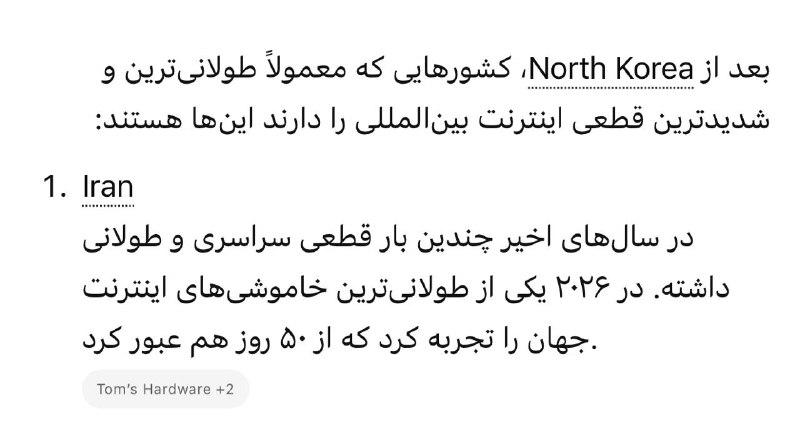

👈بعد از کره شمالی اولین کشوری هستیم که اینترنت نداریم

🔴تمام کشور ها ازجمله مردم فوق مظلوم فلسطین هم اینترنت واقعی دارن

✅ @AloNews خبر جنگ

## alonews — post 118869

  <a href="telegram/content/alonews_118869_1778335062.jpg">🎬 Download video</a>

👈تمام مادران ایرانی که از تاریخ یک فروردین ۱۴۰۵ به بعد صاحب فرزند می‌‌شوند، به مدت ۲ سال (تا ۲۴ ماهگی فرزند)، ماهانه مشمول دریافت ۲ میلیون تومان به ازای هر فرزند از طریق کارت امید خواهند بود.

🔴پ.ن: ماهانه یه پوشک

✅ @AloNews خبر جنگ

## alonews — post 118868

  <a href="telegram/content/alonews_118868_1778335063.jpg">🎬 Download video</a>

👈در اقدامی عجیب نوحه برای تمجید از بی حجاب‌ها هم خوانده شد 
✅ @AloNews خبر جنگ

---
📅 بروزرسانی: 1405/02/19 15:34
---

## VahidOOnLine — post 239079

  

♦️نهاد بین‌المللی ناظر بر وضعیت اینترنت، نت‌بلاکس اعلام کرد قطعی و محدودیت گسترده اینترنت در ایران پس از ۱۶۸۰ ساعت، وارد یازدهمین هفته متوالی شده است، وضعیتی که به گفته این نهاد، بخش عمده آن با قطع ارتباط گسترده کاربران ایرانی با اینترنت جهانی همراه بوده است.
نت‌بلاکس در گزارش خود تاکید کرده این سطح از سانسور و محدودسازی اینترنت، مانعی کم‌سابقه در برابر دسترسی شهروندان به دانش، اطلاعات و ارتباطات ایجاد کرده و زندگی روزمره میلیون‌ها نفر را با اختلال جدی مواجه ساخته است.
بر اساس این گزارش، بسیاری از شهروندان ایرانی در هفته‌های اخیر برای انجام امور عادی، ارتباطات روزمره، دسترسی به خدمات آنلاین، آموزش، کسب‌وکار و حتی ارتباط با خانواده و دوستان با مشکلات گسترده روبه‌رو بوده‌اند.
نت‌بلاکس همچنین هشدار داده که قطع یا محدودسازی اینترنت در زمان بحران، بیشترین آسیب را به گروه‌های آسیب‌پذیر وارد می‌کند، از جمله افراد دارای معلولیت، دانشجویان، دارندگان شغل‌های آزاد، کسب‌وکارهای کوچک و افرادی که معیشت آن‌ها به اینترنت وابسته است.
‌🇸🇦 Indypersian

🤖 @VahidOOnLine

## VahidOOnLine — post 239078

  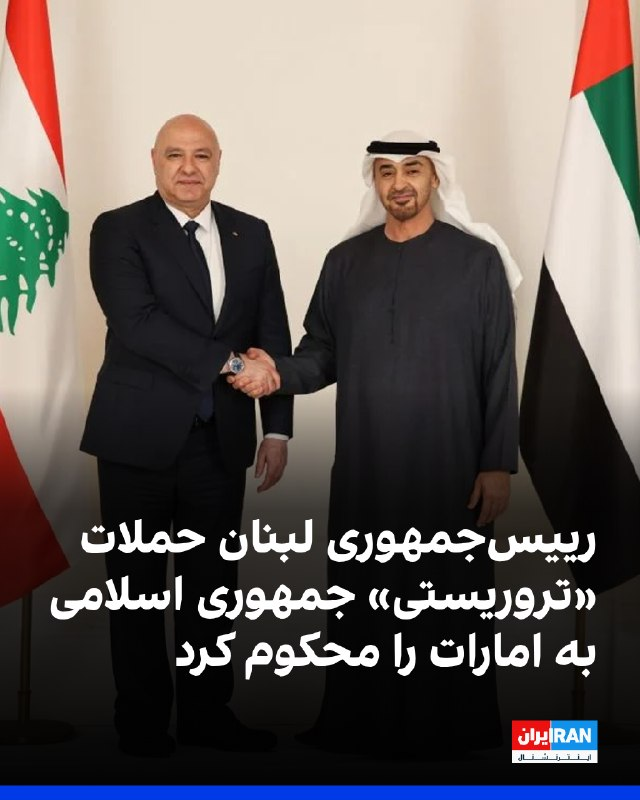

خبرگزاری رسمی امارات متحده عربی گزارش داد ژوزف عون، رییس‌جمهوری لبنان، در تماس تلفنی با محمد بن زاید آل نهیان، رییس امارات متحده عربی، حملات «تروریستی» جمهوری اسلامی علیه غیرنظامیان و تاسیسات غیرنظامی در امارات را محکوم کرد.

ژوزف عون در این تماس بر همبستگی لبنان با امارات و حمایت از همه اقدام‌های این کشور برای حفظ امنیت، حاکمیت و سلامت سرزمین و شهروندانش تاکید کرد.

در این گفت‌وگو همچنین تحولات لبنان و تلاش‌های جاری برای تقویت امنیت و ثبات در این کشور بررسی شد. رییس‌جمهوری لبنان از حمایت دیرینه امارات از حاکمیت و تمامیت ارضی لبنان و خواسته‌های مردم این کشور برای امنیت و ثبات قدردانی کرد.

دو طرف همچنین تحولات خاورمیانه را بررسی کردند و بر اهمیت حمایت از تلاش‌ها برای پیشبرد صلح و تقویت پایه‌های امنیت و ثبات منطقه‌ای در جهت منافع و رفاه ملت‌های منطقه تاکید کردند.
‌🏁 🇬🇧 IranintlTV

🤖 @VahidOOnLine

## VahidOOnLine — post 239077

  

♦️وزارت خارجه قطر اعلام کرد محمد بن عبدالرحمن آل ثانی، وزیر خارجه این کشور، در تماس تلفنی با بدر عبدالعاطی، وزیر خارجه مصر، درباره تحولات منطقه و تلاش‌ها برای کاهش تنش‌ها گفتگو کرده است.
بر اساس بیانیه وزارت خارجه قطر، دو طرف در این تماس تلفنی درباره آخرین تحولات منطقه، به‌ویژه وضعیت آتش‌بس میان آمریکا و ایران و تلاش‌های جاری «برای کاهش تنش‌ها با هدف تقویت امنیت و ثبات منطقه» رایزنی کردند.
نخست‌وزیر قطر در این گفتگو بر ضرورت همکاری و واکنش مثبت همه طرف‌ها به تلاش‌های میانجیگرانه برای حل بحران منطقه تاکید کرد.
او همچنین گفت این تلاش‌ها می‌تواند زمینه را برای رسیدگی به ریشه‌های بحران از طریق گفتگو و راه‌حل‌های مسالمت‌آمیز فراهم کرده و به توافقی پایدار منجر شود که مانع از تشدید دوباره تنش‌ها شود.
‌🇸🇦 Indypersian

🤖 @VahidOOnLine

## VahidOOnLine — post 239076

  <a href="telegram/content/VahidOOnLine_239076_1778328275.mp4">🎬 Download video</a>

تجمع اعتراضی ایرانیان مقابل دانشگاه اراسموس روتردام در هلند همزمان با سخنرانی رابرت مالی در ارتباط با مسائل خاورمیانه و ایران.
‌🏁 🇬🇧 ManotoTV

🤖 @VahidOOnLine

## VahidOOnLine — post 239075

  

وزیر راه جمهوری اسلامی در افتتاح قطعه‌ای از «آزادراه حرم تا حرم» در سمنان اعلام کرده « آزادراه حرم‌ تا حرم، به‌عنوان بخشی از کریدور سرخس تا مهران» به نام رهبر کشته‌شده جمهوری اسلامی علی خامنه‌ای نامگذاری خواهد شد.
‌🏁 🇬🇧 ManotoTV

🤖 @VahidOOnLine

## VahidOOnLine — post 239074

  

♦️روزنامه نیویورک پست به نقل از منابع آگاه گزارش داد، واشنگتن به تهران پیشنهاد داده است در صورت توقف غنی‌سازی اورانیوم از سوی ایران و بازگشایی مسیرهای کشتیرانی تجاری در تنگه هرمز، بخشی از تحریم‌ها علیه تهران را کاهش دهد.
به نوشته نیویورک پست، از اختلاف‌های اصلی در مذاکرات ایران و آمریکا، سرنوشت ذخایر اورانیوم غنی‌شده ایران است. دونالد ترامپ اصرار دارد مواد هسته‌ای تهران باید به جای کشور ثالث، به آمریکا تحویل داده شود.
این گزارش همچنین می‌گوید یکی دیگر از مسائل مورد اختلاف، موضوع اجازه یا زمان احتمالی ازسرگیری فعالیت‌های غنی‌سازی اورانیوم توسط ایران در آینده است.
‌🇸🇦 Indypersian

🤖 @VahidOOnLine

## VahidOOnLine — post 239073

  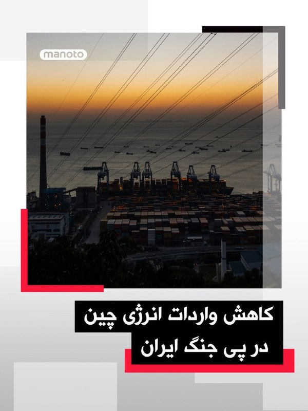

داده‌های گمرک چین نشان می‌دهد واردات نفت خام این کشور در آوریل ۲۰ درصد کاهش یافته و به پایین‌ترین سطح از ژوئیه ۲۰۲۲ رسیده است.چین حدود نیمی از نفت خود را از خاورمیانه تأمین می‌کند و بسته شدن تنگه باعث کاهش شدید نفتکش‌ها شده است. واردات دریایی نفت خام نیز طبق داده‌های شرکت «کپلر» به کمترین میزان از ژوئیه ۲۰۲۲ رسیده است.واردات گاز طبیعی چین هم ۱۳ درصد کاهش یافت، هرچند آمار رسمی تفاوتی میان واردات دریایی و خط لوله‌ای قائل نشده است. با این حال، مجموع واردات نفت خام چین در چهار ماه نخست سال هنوز ۱.۳ درصد بیشتر از سال گذشته است.
‌🏁 🇬🇧 ManotoTV

🤖 @VahidOOnLine

## mwarmonitor — post 8747

🇦🇪🇧🇭عبدالله بن زاید تشکیلات مرتبط با سپاه پاسداران ایران در بحرین را محکوم و بر همبستگی کامل امارات با این پادشاهی تأکید کرد
🔸شیخ عبدالله بن زاید آل نهیان، معاون رئیس شورای وزیران و وزیر امور خارجه، همبستگی کامل دولت امارات متحده عربی با پادشاهی برادر، بحرین، را ابراز داشت. وی حمایت خود را از اقداماتی که دستگاه‌های امنیتی بحرین برای کشف تشکیلات تروریستی مرتبط با سپاه پاسداران ایران و تفکر «ولایت فقیه» انجام داده‌اند، اعلام کرد. این پرونده مربوط به جاسوسی با طرف‌های خارجی و همدستی در تجاوزات غادرانه‌ی ایران است.
🔸ایشان بر حمایت کامل دولت امارات از تمامی اقداماتی که پادشاهی بحرین برای حفاظت از امنیت، حاکمیت و حفظ ثبات و سلامت جامعه خود اتخاذ می‌کند، تأکید کرد. وی همچنین از کارایی و هوشیاری دستگاه‌های امنیتی بحرین در شناسایی این تشکیلات و اتخاذ اقدامات قانونی علیه عناصر آن تمجید نمود.
🔸وی بر مخالفت قاطع دولت امارات با تمامی اشکال تروریسم و گروه‌های مرتبط با برنامه‌های خارجی تأکید کرد و اهمیت تقویت همکاری‌های منطقه‌ای و بین‌المللی برای مقابله با این تهدیدات را خاطرنشان ساخت.
🔸در پایان، ایشان با تأکید بر اینکه امنیت پادشاهی بحرین جزئی جدایی‌ناپذیر از امنیت دولت امارات و کشورهای حوزه خلیج عربی است، مجدداً حمایت کامل خود را از تمامی اقدامات بحرین برای حفظ امنیت، ثبات و صیانت از دستاوردهای ملی‌اش اعلام کرد.

وزارت امور خارجه امارات متحده عربی

@mwarmonitor

## pm_afshaa — post 90403

  <a href="telegram/content/pm_afshaa_90403_1778328279.mp4">🎬 Download video</a>

در اقدامی عجیب نوحه برای تمجید از بی حجاب‌ها هم خوانده شد

💧 Rainbet.com the #1 Non-KYC Crypto Casino & Sportsbook @rainbetcom

😁 @Pm_Afshaa

## pm_afshaa — post 90402

🔴وزارت کشور بحرین:دستگاه‌های امنیتی بحرین، یک تشکیلات مرتبط با سپاه تروریستی پاسداران و تفکر ولایت فقیه را شناسایی کرده‌اند و 41 نفر از اعضای آن‌را بازداشت کردن

💧 Rainbet.com the #1 Non-KYC Crypto Casino & Sportsbook @rainbetcom

😁 @Pm_Afshaa

## DEJradio — post 4535

  <a href="telegram/content/DEJradio_4535_1778328280.jpg">🎬 Download video</a>

🔺🎤 عذاب وجدان و ترومای اجتماعی پس از دی‌ماه

گفت‌وگو با دکتر مصطفی میررمضانی، روان‌پزشک و روان‌درمانگر

#عذاب_وجدان #تروما
@DEJradio

## DEJradio — post 4534

  <a href="telegram/content/DEJradio_4534_1778328281.mp4">🎬 Download video</a>

🔺🎥 خیابان‌ها شده پادگان؛ انگار حکومت نظامیست...

#حکومت_نظامی
@DEJradio

## kianmeli1 — post 87292

🔴شیخ نشین های خلیج فارس ۱۷ میلیارد دلار دیگر برای خرید ۴۲۰۰ پاتریوت هزینه کردند.

و این نشان دهنده این است که آنها خود را برای جنگ آماده میکنند.
https://t.me/kianmeli1

## IranIntlTV — post 336286

  <a href="telegram/content/IranIntlTV_336286_1778328282.mp4">🎬 Download video</a>

یک شهروند با ارسال پیامی به ایران اینترنشنال درباره کاهش توان معیشتی مردم می‌گوید که حتی دیگر از پس خرید بستنی نیز بر نمی‌آید. پیام این مخاطب با هوش مصنوعی خوانده شده است.

## IranIntlTV — post 336285

  

خبرگزاری رسمی امارات متحده عربی گزارش داد ژوزف عون، رییس‌جمهوری لبنان، در تماس تلفنی با محمد بن زاید آل نهیان، رییس امارات متحده عربی، حملات «تروریستی» جمهوری اسلامی علیه غیرنظامیان و تاسیسات غیرنظامی در امارات را محکوم کرد.

ژوزف عون در این تماس بر همبستگی لبنان با امارات و حمایت از همه اقدام‌های این کشور برای حفظ امنیت، حاکمیت و سلامت سرزمین و شهروندانش تاکید کرد.

در این گفت‌وگو همچنین تحولات لبنان و تلاش‌های جاری برای تقویت امنیت و ثبات در این کشور بررسی شد. رییس‌جمهوری لبنان از حمایت دیرینه امارات از حاکمیت و تمامیت ارضی لبنان و خواسته‌های مردم این کشور برای امنیت و ثبات قدردانی کرد.

دو طرف همچنین تحولات خاورمیانه را بررسی کردند و بر اهمیت حمایت از تلاش‌ها برای پیشبرد صلح و تقویت پایه‌های امنیت و ثبات منطقه‌ای در جهت منافع و رفاه ملت‌های منطقه تاکید کردند.
https://iranintl.com/202605095256

## IranIntlTV — post 336284

  <a href="telegram/content/IranIntlTV_336284_1778328285.mp4">🎬 Download video</a>

وزارت خزانه‌داری آمریکا اعلام کرد در چارچوب عملیات «خشم اقتصادی»، تعدادی از افراد و شرکت‌های مرتبط با برنامه موشکی و پهپادی جمهوری اسلامی را در فهرست تحریم‌ها قرار داده است

گفت‌وگو با آرش آزرمی، دبیر بخش اقتصادی ایران‌اینترنشنال
@iranintltv

## IranIntlTV — post 336283

  <a href="telegram/content/IranIntlTV_336283_1778328286.mp4">🎬 Download video</a>

مروری بر روزنامه‌های ایران، شنبه ۱۹ اردیبهشت، با مجتبی هاشمی، روزنامه‌نگار
@iranintltv

## IranIntlTV — post 336282

  <a href="telegram/content/IranIntlTV_336282_1778328288.mp4">🎬 Download video</a>

🔻بنابر اطلاعات رسیده به ایران اینترنشنال، به بازیکنان شاغل در لیگ‌های داخلی فوتبال ایران وعده داده شده است در صورت حضور در تجمعات شبانه، چهار درصد کسرشده از قراردادشان به آنها بازگردانده شود.

🔹فدراسیون فوتبال ایران هنگام ثبت قرارداد بازیکنان در سازمان لیگ، چهار درصد از مبلغ قرارداد را تحت عنوان «حق سازمان لیگ» کسر می‌کند؛ مبلغی که ارتباطی با اتحادیه بازیکنان ندارد و در ساختار فوتبال ایران دریافت می‌شود.

🔹اطلاعات دریافتی ایران اینترنشنال نشان می‌دهد مدیران جمهوری اسلامی در تلاش‌اند با وعده بازپرداخت این مبلغ، بازیکنان لیگ برتر و سایر لیگ‌های داخلی را به حضور در تجمعات شبانه ترغیب کنند.

🔹توضیحات رها پوربخش، ایران اینترنشنال در برنامه هت‌تریک

🔹تماشای نسخه کامل برنامه هت‌تریک؛👇
https://youtu.be/QrjUtfLUy90

@iranintltvsport

## IranIntlTV — post 336281

🔻بحرین از شناسایی تشکیلات مرتبط با سپاه پاسداران و بازداشت ۴۱ نفر خبر داد

وزارت کشور بحرین اعلام کرد دستگاه‌های امنیتی این کشور یک تشکیلات مرتبط با سپاه پاسداران انقلاب اسلامی و اندیشه «ولایت فقیه» را شناسایی و ۴۱ نفر از اعضای آن را بازداشت کرده‌اند.

بر پایه اعلام وزارت کشور بحرین در روز شنبه ۱۹ اردیبهشت، این اقدام بر اساس نتایج گزارش‌‌های امنیتی در پرونده‌های «جاسوسی برای نهادهای خارجی» و «همدلی با حملات جمهوری اسلامی» انجام شده است.

عملیات جست‌وجو و تحقیق به منظور «شناسایی و برخورد قانونی» با دیگر افراد مرتبط با این تشکیلات ادامه دارد.

پیش از این، دادستانی بحرین نیز اعلام کرده بود در دو پرونده جداگانه مربوط به جاسوسی، برای دو تبعه افغانستانی و سه شهروند بحرینی حکم حبس ابد صادر شده است.

این افراد به‌دلیل «همکاری با سپاه پاسداران» به‌منظور انجام «اقدامات خصمانه و تروریستی» علیه بحرین و آسیب رساندن به منافع این کشور محکوم شدند.

بحرین در سال ۲۰۱۸ سپاه پاسداران را در فهرست سازمان‌های تروریستی قرار داد.

پس از آغاز جنگ میان آمریکا و اسرائیل با جمهوری اسلامی به دنبال حملات هوایی به مواضع حکومت ایران از ۹ اسفند ۱۴۰۴، کشورهای عربی همسایه ایران آماج حملات نیروهای مسلح جمهوری اسلامی و سپاه پاسداران قرار گرفتند.

حکومت ایران ابتدا تاکید داشت که هدفش پایگاه‌های نظامی آمریکا در این کشورهاست اما بارها مراکز غیرنظامی، صنعتی و نفتی را هدف قرار داد و آرام آرام، آشکارا به تهدید همسایگان پرداخت.

برخی دولت‌های عربی نیز از تحرکاتی در داخل کشورهایشان خبر دادند که از سوی تهران هدایت می‌شوند.

در یک نمونه، اداره امنیت دولتی امارات متحده عربی اعلام کرد یک «گروه تروریستی» مرتبط با جمهوری اسلامی را شناسایی و اعضای آن را بازداشت کرده است.

دولت امارات ۳۱ فروردین ماه افزود که اعضای این گروه در زمینه جذب نیرو و سازماندهی فعالیت‌ها اقدام می‌کردند و «هدفشان دسترسی به مراکز و اماکن حساس کشور بوده» است.
پیش از این و در سال ۱۳۹۹ نیز امارات متحده عربی خبر داد نهادهای اطلاعاتی این کشور تعدادی از شهروندان ایرانی را در دبی و ابوظبی دستگیر کرده‌اند.

این افراد متهم بودند که در سالگرد کشته شدن قاسم سلیمانی، فرمانده نیروی قدس سپاه پاسداران، برای «حملات تروریستی در امارات متحده عربی» برنامه‌ریزی کرده‌اند.

کامیار بهرنگ، عضو تحریریه ایران‌اینترنشنال، در یادداشتی تحلیلی به تنش میان تهران و ابوظبی پرداخت و نوشت: «دشمنی جمهوری اسلامی با امارات متحده عربی بیش از آن که بر سر مرزها باشد، ریشه در یک تضاد عمیق وجودی دارد. دقیق‌ترین توصیف از این شکاف را ریم الهاشمی، وزیر مشاور امارات ارائه داد. او تاکید کرد که امارات بیش از هر کشور دیگری هدف حملات تهران بوده است، زیرا این کشور هر آن چیزی است که جمهوری اسلامی نیست.»

بر پایه این اظهارات، امارات با ارائه الگویی از شکوفایی اقتصادی، تنوع ادیان و همزیستی فرهنگ‌های جهانی، عملا به ضدِ الگوی حکومتی تبدیل شده که بقای خود را در انزوای ایدئولوژیک و ترویج فقر تحت نام مقاومت می‌بیند.
علاوه بر امارات، وزارت کشور کویت هم به تازگی اعلام کرد در یک عملیات امنیتی، ۲۴ نفر را به اتهام «مشارکت در تامین مالی سازمان‌های تروریستی» بازداشت و هشت نفر دیگر را که متواری و خارج از کشور هستند، شناسایی کرده است.

بر اساس ویدیوی منتشرشده، این افراد با جمهوری اسلامی مرتبط بوده‌اند.

کویت ۲۷ اسفند نیز اعلام کرده بود ۱۰ نفر وابسته به گروه حزب‌الله لبنان را بازداشت کرده است.

🔗وب‌سایت ایران‌اینترنشنال

@iranintltv

## IranIntlTV — post 336280

🔻رویترز: واشینگتن و تهران همچنان از پایان جنگ دورند و تنش‌ها در خلیج فارس شدت گرفته است

در حالی که آتش‌بس شکننده میان حکومت ایران و ایالات متحده با درگیری‌های تازه در خلیج فارس بار دیگر زیر فشار قرار گرفته، دو طرف نشانه‌ای از نزدیک شدن به پایان جنگ نشان نمی‌دهند. هم‌زمان، یک ارزیابی اطلاعاتی آمریکا نتیجه گرفت تهران می‌تواند ماه‌ها در برابر محاصره دریایی مقاومت کند.

خبرگزاری رویترز شنبه ۱۹ اردیبهشت نوشت که در روزهای اخیر، تنگه هرمز شاهد شدیدترین تنش‌ها از زمان آغاز آتش‌بس یک ماه پیش بوده و امارات متحده عربی نیز ۱۸ اردیبهشت بار دیگر هدف حملات قرار گرفت.

واشینگتن همچنان در انتظار پاسخ تهران به پیشنهاد آمریکا برای پایان رسمی جنگ است. پیشنهادی که قرار است پیش از ورود به مذاکرات درباره مسائل اختلاف‌برانگیزتر، از جمله برنامه هسته‌ای جمهوری اسلامی، اجرایی شود.

مارکو روبیو، وزیر خارجه آمریکا، ۱۸ اردیبهشت در رم گفت که واشینگتن انتظار داشته پاسخ تهران را به سرعت دریافت کند، اما سخنگوی وزارت امور خارجه جمهوری اسلامی اعلام کرد تهران هنوز در حال بررسی این پیشنهاد است.
درگیری‌ها آتش‌بس را به چالش می‌کشند

خبرگزاری فارس، نزدیک به سپاه پاسداران انقلاب اسلامی، گزارش داد درگیری‌های پراکنده میان نیروهای ایرانی و شناورهای آمریکایی در تنگه هرمز، ۱۸ اردیبهشت ادامه یافت.

خبرگزاری تسنیم، وابسته به سپاه پاسداران، بعدتر به نقل از یک منبع نظامی ایرانی نوشت وضعیت آرام‌تر شده، اما احتمال درگیری‌های بیشتر همچنان وجود دارد.

ارتش آمریکا اعلام کرد دو شناور مرتبط با حکومت ایران را که قصد ورود به یک بندر ایرانی داشتند، هدف قرار داده است. به گفته ارتش، یک جنگنده آمریکایی دودکش این شناورها را هدف قرار داد و آن‌ها را وادار به بازگشت کرد.

حکومت ایران از زمان آغاز جنگ با حملات هوایی آمریکا و اسرائیل به مواضع جمهوری اسلامی در ۹ اسفند ۱۴۰۴، عملا عبور کشتی‌های غیرایرانی از تنگه هرمز را متوقف کرده است.

پیش از آغاز جنگ، حدود یک‌پنجم نفت جهان از این گذرگاه باریک عبور می‌کرد.

آمریکا نیز ماه گذشته محاصره بنادر و کشتی‌های ایرانی را آغاز کرد.

با این حال، یک مقام آمریکایی آگاه از موضوع گفت ارزیابی سازمان اطلاعات مرکزی آمریکا (سیا) نشان می‌دهد محاصره بنادر ایران تا حدود چهار ماه دیگر فشار اقتصادی شدیدی بر تهران وارد نخواهد کرد.

این موضوع پرسش‌هایی را درباره میزان قدرت اهرم فشار دونالد ترامپ بر حکومت ایران ایجاد کرده است.

هم‌زمان، یک مقام ارشد اطلاعاتی آمریکا گزارش‌ها درباره این ارزیابی سیا را که نخستین‌ بار در واشینگتن‌پست منتشر شد، «نادرست» توصیف کرد.

🔗ادامه این گزارش را اینجا بخوانید

@iranintltv

## Shin_Persian — post 5906

Shin ✓ @hey_itsmyturn
Sat, 09 May 2026 11:42:21 UTC

NOW @ 1142Z -
Jet activity over Baghdad, #Iraq 🇮🇶

فارسی

هم‌اکنون در ۱۱۴۲Z (۱۵:۱۲ به وقت تهران) -
فعالیت جنگنده‌ها برفراز بغداد، #Iraq 🇮🇶

𝕏 · @shin_persian

## Shin_Persian — post 5905

  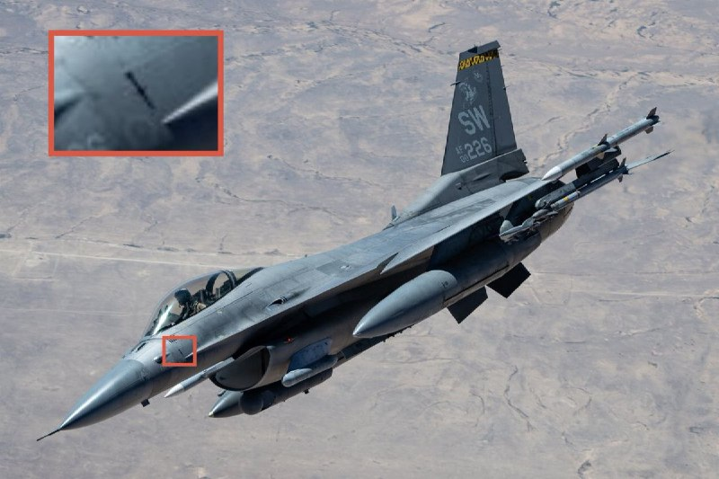

OSINTtechnical ✓ @Osinttechnical
Sat, 09 May 2026 04:41:22 UTC

USAF F-16C from the 79th Fighter Squadron “Tigers” over the Middle East, sporting at least one mark for an AGM-88 HARM kill on an Iranian radar system.

فارسی

یک فروند اف-۱۶سی نیروی هوایی ایالات متحده (USAF) متعلق به اسکادران ۷۹ شکاری «ببرها» بر فراز خاورمیانه، که حداقل یک علامت پیروزی برای انهدام یک سامانه راداری ایرانی توسط موشک ای‌جی‌ام-۸۸ هارم (AGM-88 HARM) بر روی بدنه خود دارد.

𝕏 · @shin_persian

## ManotoTV — post 105185

  <a href="telegram/content/ManotoTV_105185_1778328290.mp4">🎬 Download video</a>

تجمع اعتراضی ایرانیان مقابل دانشگاه اراسموس روتردام در هلند همزمان با سخنرانی رابرت مالی در ارتباط با مسائل خاورمیانه و ایران.

## ManotoTV — post 105184

  

وزیر راه جمهوری اسلامی در افتتاح قطعه‌ای از «آزادراه حرم تا حرم» در سمنان اعلام کرده « آزادراه حرم‌ تا حرم، به‌عنوان بخشی از کریدور سرخس تا مهران» به نام رهبر کشته‌شده جمهوری اسلامی علی خامنه‌ای نامگذاری خواهد شد.

## ManotoTV — post 105183

  

داده‌های گمرک چین نشان می‌دهد واردات نفت خام این کشور در آوریل ۲۰ درصد کاهش یافته و به پایین‌ترین سطح از ژوئیه ۲۰۲۲ رسیده است.چین حدود نیمی از نفت خود را از خاورمیانه تأمین می‌کند و بسته شدن تنگه باعث کاهش شدید نفتکش‌ها شده است. واردات دریایی نفت خام نیز طبق داده‌های شرکت «کپلر» به کمترین میزان از ژوئیه ۲۰۲۲ رسیده است.واردات گاز طبیعی چین هم ۱۳ درصد کاهش یافت، هرچند آمار رسمی تفاوتی میان واردات دریایی و خط لوله‌ای قائل نشده است. با این حال، مجموع واردات نفت خام چین در چهار ماه نخست سال هنوز ۱.۳ درصد بیشتر از سال گذشته است.

## FarsiVOA — post 217262

  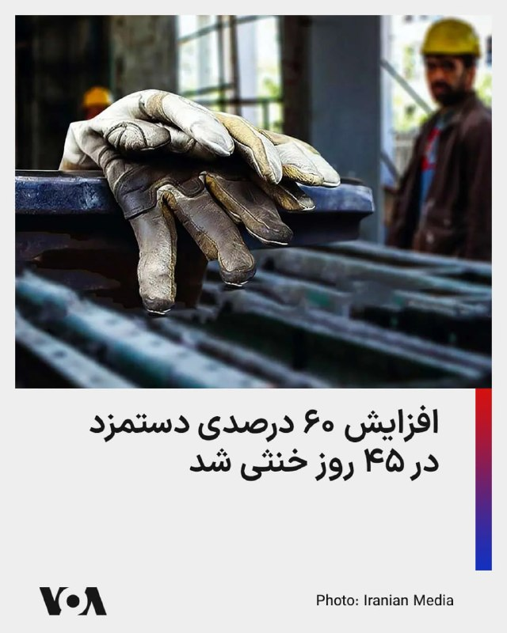

خبرآنلاین در گزارشی نوشته اثر افزایش ۶۰ درصدی حداقل مزد سال ۱۴۰۵ تنها در ۴۵ روز از بین رفته و قدرت خرید کارگران دوباره به سطح پیش از افزایش مزد بازگشته است.

بر اساس این گزارش، حداقل مزد پایه ماهانه امسال ۱۶ میلیون و ۶۲۵ هزار تومان تعیین شد؛ رقمی که در روز تصویب، با دلار ۱۴۳ هزار و ۷۰۰ تومانی حدود ۱۱۶ دلار ارزش داشت. اما با رسیدن دلار به حدود ۱۹۰ هزار تومان در نیمه اردیبهشت، ارزش دلاری مزد به حدود ۸۷.۵ دلار سقوط کرده است.

خبرآنلاین نوشته قدرت خرید مزد بر اساس طلا هم افت کرده؛ حداقل حقوق که در اسفند معادل حدود یک گرم طلای ۱۸ عیار بود، حالا به ۰.۸۱ گرم رسیده است.

این یعنی افزایش اسمی دستمزد، زیر فشار سقوط ریال، تورم و سیاست‌های اقتصادی جمهوری اسلامی عملاً خنثی شده و کارگران دوباره با شکافی عمیق میان درآمد و هزینه زندگی روبه‌رو شده‌اند.
@FarsiVOA

## FarsiVOA — post 217261

  <a href="telegram/content/FarsiVOA_217261_1778328294.mp4">🎬 Download video</a>

نیروی دریایی ایالات متحده ۱۱۵ سالگی بازوی هوایی خود را جشن می‌گیرد؛ یگانی که بیش از یک قرن پیشینه در ادغام توانمندی‌های دریایی و هوایی دارد و نقشی کلیدی در تاریخ هوانوردی نظامی ایفا کرده است.

از اولین پروازهای آزمایشی تا جت‌های فوق‌پیشرفته امروزی، هوانوردی دریایی همواره نماد پیشرفت فناوری در ارتش آمریکا بوده است.

این نیرو با تکیه بر ناوهای هواپیمابر، توانایی حضور و اجرای عملیات در دوردست‌ترین نقاط جهان را داراست.

این سالگرد، فرصتی برای قدردانی از مهارت خلبانان و تیم‌های پشتیبانی است که تحت شعار «پیشتازان آسمان و دریا» فعالیت می‌کنند.

🔺نسخه اصلی این ویدیو با موسیقی منتشر شده است.
@FarsiVOA

## FarsiVOA — post 217260

  

دبیر شورای عالی انقلاب فرهنگی اعلام کرد که جمهوری اسلامی باید در هر صورت در جام جهانی فوتبال شرکت کند.

بر اساس ویدیویی که رسانه‌های ایران روز شنبه منتشر کردند، عبدالحسین خسروپناه در یک سخنرانی گفت: «بعضی از مسئولین مباشر ورزش مخالف حضور در جام‌جهانی بودند، من گفتم اگر آمریکا در را ببندد باید از پنجره رفت!»

او تأکید کرد که در جام جهانی فوتبال «ما حتما باید حضور داشته باشیم» و پرچم جمهوری اسلامی «بالا برود».

پیشتر دونالد ترامپ، رئیس جمهوری آمریکا با تأکید بر بلامانع بودن حضور تیم ملی ایران در جام جهانی، درباره مناسب بودن این کار ابراز تردید کرده بود.

روز سه‌شنبه ۱۹ اسفند مهدی تاج، رئیس فدراسیون فوتبال جمهوری اسلامی، گفته بود که با حمایت پرزیدنت ترامپ، از تیم ملی فوتبال زنان ایران، نمی‌توان به حضور فوتبالیست‌های ایرانی در جام‌جهانی فوتبال خوش‌بین بود.

پیشتر شماری از بازیکنان تیم فوتبال زنان ایران پس از حضور در استرالیا، در آنجا پناهنده شدند اما در پی تهدیدهای قوه قضائیه جمهوری اسلامی، برخی از آنها درخواست پناهندگی خود را پس گرفتند.
@FarsiVOA

## FarsiVOA — post 217259

🔺اذعان وزارت ارتباطات به «شوک اقتصادی» قطع سراسری اینترنت

◾️وزارت ارتباطات می‌گوید بخش فناوری اطلاعات در جریان جنگ ۳۳۵ میلیون دلار خسارت مستقیم دیده است؛ عددی که خسارت زیرساختی جنگ است و زیان ناشی از تصمیم به قطع اینترنت را شامل نمی‌شود.

◾️معاون وزیر ارتباطات، گفته بیش از ۵۰۰ سایت ارتباطی در جریان جنگ آسیب دیده است.
او همچنین از ۶.۴ همت عدم‌النفع در مخابرات، ۲.۳ همت زیان در تجارت الکترونیک، حدود ۷۸۶ میلیارد تومان عدم‌النفع در پست و لجستیک، و ۱.۹ همت زیان در کسب‌وکارها خبر داده است.

◾️منتقدان می‌گویند دولت در حالی از خسارت جنگ به شبکه ارتباطی می‌گوید، که درباره خسارتی که تصمیم خودش برای قطع اینترنت به اقتصاد دیجیتال و کسب‌وکارهای مردم زده، شفاف حرف نمی‌زند.

⬇️ بیشتر بخوانید:
https://ir.voanews.com/a/8148263.html

## DW_Farsi — post 124477

  

🔶بحرین: یک شبکه مرتبط با سپاه پاسداران شناسایی شد

بحرین اعلام کرد، ۴۱ نفر از اعضای یک شبکه مرتبط با "سپاه پاسداران" را بازداشت کرده است.

وزارت کشور بحرین روز شنبه ۱۹ اردیبهشت (۹ مه) با اعلام این خبر افزود که این افراد با سپاه پاسداران انقلاب اسلامی ارتباط داشته‌اند.

بحرین سال‌هاست که با چالش نفوذ جمهوری اسلامی ایران و "تحریک شیعیان" این کشور مواجه است. وزارت خارجه بحرین بارها به "دخالت ایران در امور داخلی این کشور" اعتراض کرده است.

بحرین از متحدان آمریکا در منطقه محسوب می‌شود و تحت حمایت پادشاهی عربستان سعودی قرار دارد. این کشور کوچک حوزه خلیج فارس بارها از طرف ایران در جنگ ائتلاف آمریکا و اسرائیل علیه جمهوری اسلامی هدف حملات ایران قرار گرفته است.

@dw_farsi

## DW_Farsi — post 124476

  

🔶اسرائیل و لبنان در هفته جاری مذاکره خواهند کرد

بنا بر اعلام وزارت امور خارجه آمریکا، این کشور در هفته جاری میانجی گفت‌وگوهای دو روزه میان دولت‌های اسرائیل و لبنان خواهد بود.

بنا بر اعلام ایالات متحده، این گفت‌وگوها در روزهای پنجشنبه و جمعه ۱۴ و ۱۵ مه (۲۴ و ۲۵ اردیبهشت) برگزار خواهد شد اما مشخص نیست، این دو کشور همسایه در چه سطحی درباره دستیابی به صلح، مذاکره خواهند کرد.

این جلسه در حالی قرار است برگزار شود که نواف سلام، نخست‌وزیر لبنان، اخیرا برگزاری هرگونه نشستی در سطح سران کشورها را رد کرده بود.

سلام تاکید کرده بود: «پیش از هر چیز، آتش‌بس توافق‌شده با اسرائیل باید به‌طور کامل رعایت شود.»

@dw_farsi

## DW_Farsi — post 124475

🔶تأثیر جنگ ایران بر شکاف در اتحاد دیرینه آمریکا و عربستان

با آغاز جنگ آمریکا و اسرائیل علیه ایران در نهم اسفندماه گذشته، اتحادهای سنتی در منطقه خلیج فارس نیز با آزمونی سنگین روبه‌رو شدند. به‌ویژه روابط میان واشنگتن و ریاض تحت‌الشعاع قرار گرفته است.

در جریان جنگ ایران، کشورهای حوزه خلیج فارس، به عنوان محل استقرار شمار زیادی از نیروهای آمریکایی، بارها هدف حملات ایران قرار گرفتند.

دونالد ترامپ، رئیس جمهور آمریکا، که زمانی محمد بن سلمان، ولیعهد و حاکم بالفعل عربستان سعودی، را "آدم فوق‌العاده‌ای" توصیف می‌کرد، امروز لحنش تغییر کرده و او را علناً تحت فشار قرار می‌دهد. ترامپ در آغاز جنگ گفت، بن‌سلمان هرگز تصورش را هم نمی‌کرده که روزی تا این اندازه در پی جلب رضایت او باشد.

@dw_farsi

## DW_Farsi — post 124474

  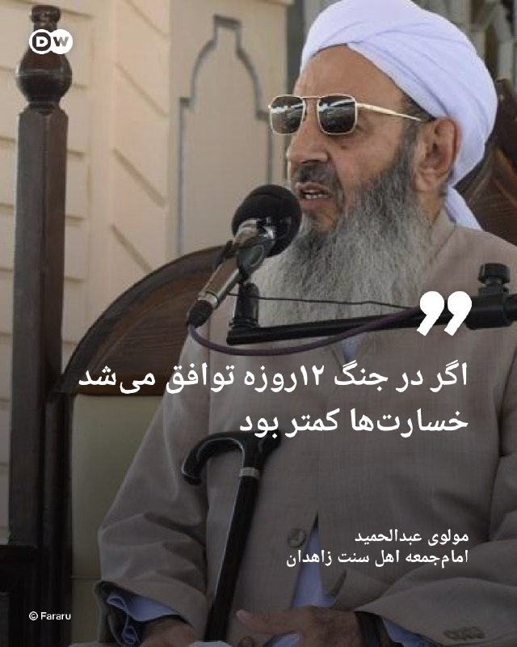

🔶عبدالحمید: اگر در جنگ ۱۲روزه توافق می‌شد خسارت‌ها کمتر بود

مولوی عبدالحمید، امام‌جمعه اهل سنت زاهدان در خطبه‌های نماز جمعه ۱۸ اردیبهشت (۸ مه) با تاکید بر ضرورت کاهش تنش‌های خارجی و حرکت به سمت "توافق عادلانه با طرف مقابل" و "پرهیز از تحریک احساسات ملت‌های دنیا علیه کشور و مردم ایران" خواستار اتخاذ رویکردی مبتنی بر مذاکره، تدبیر سیاسی و حفظ منافع ملی شد.

او با اشاره به شرایط اقتصادی و فشارهای ناشی از تحریم‌ها، ادامه وضعیت فعلی را برای معیشت مردم ایران دشوار توصیف کرد.

عبدالحمید در ادامه تاکید کرد که جلوگیری از جنگ و خونریزی، حتی با پذیرش شرایط دشوار، می‌تواند در بلندمدت به تقویت موقعیت سیاسی و اجتماعی یک کشور منجر شود.

او همچنین یادآور شد که در گذشته وقتی در پیامی در شبکه ایکس خواستار "توافق عادلانه" شده بود، برخی از این موضوع ناراحت شده بودند، اما اکنون بعضی از مسئولان رده‌بالای کشور نیز از "توافق عادلانه" سخن می‌گویند و موضوع توافق مطرح است.

@dw_farsi

## Persian_Trend_Official — post 13745

  

🚀 اینترنت پرسرعت و پایدار،
💰 قیمت هر گیگ ۲۵۰ تومن!
🎁 تخفیف ویژه: ۱۰٪ تخفیف اختصاصی برای اعضای پرشین ترند
⚡ پایداری بالا: کمترین قطعی ممکن در بدترین شرایط
🛡️ تضمین کیفیت: پشتیبانی ۲۴ ساعته + گارانتی بازگشت وجه

🛒 جهت خرید و مشاوره پیام دهید:

🆔 @shayan1057

🆔 @shayan1057

🆔 @shayan1057

## Persian_Trend_Official — post 13744

  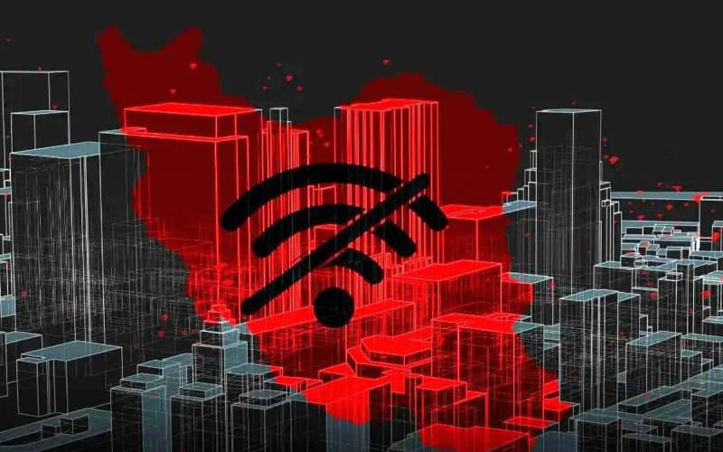

🔴 خاموشی گسترده اینترنت در ایران وارد یازدهمین هفته شد

گروه ناظر اینترنتی NetBlocks اعلام کرد قطعی و محدودیت شدید اینترنت در ایران وارد یازدهمین هفته خود شده است.

این سازمان در بیانیه‌ای نوشت:

«این اقدام سانسور، مانعی فوق‌العاده در برابر دسترسی ایرانیان به دانش، اطلاعات و ارتباطات ایجاد کرده و زندگی روزمره مردم را مختل کرده است.»

🫆:Tony

📌 @persian_trend_official
پرشین ترند | متفاوت‌ترین کانال نظامی

## RadioFarda — post 157002

  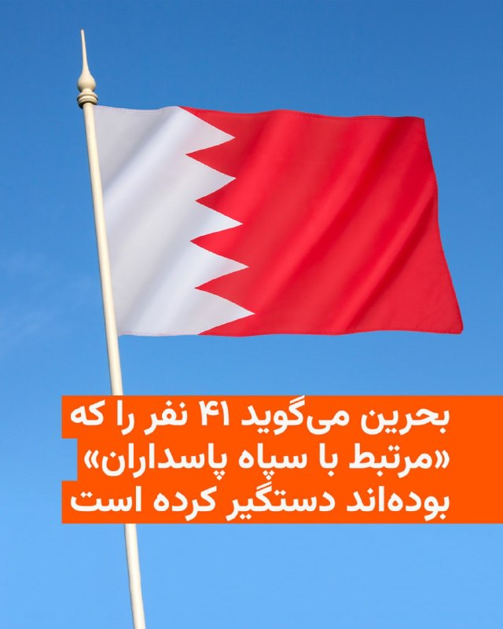

🔸وزارت کشور بحرین روز شنبه ۱۹ اردیبهشت اعلام کرد که ۴۱ نفر را که به گفته این وزارتخانه با سپاه پاسداران ایران مرتبط بوده‌اند، دستگیر کرده است.

🔸خبرگزاری دولتی بحرین به نقل از این وزارتخانه گزارش داد که مقامات امنیتی گروهی مرتبط با سپاه پاسداران ایران را شناسایی کرده است و افزود که تحقیقات برای شناساییو برخورد با هر فردی که در این تشکیلات فعالیت داشته ادامه دارد.

🔸 بحرین پیشتر تابعیت ۶۹ نفر و خانواده‌های آنها را به دلیل «حمایت از حملات ایران» و تهدید امنیت ملی لغو کرده بود.

🔸به گزارش رویترز، این افراد به «ابراز همدردی با اقدامات خصمانه ایران» و همچنین «جاسوسی برای طرف‌های خارجی» متهم شده‌اند. مقام‌های بحرینی این اقدامات را تهدیدی برای ثبات کشور دانسته‌اند.

🔸ایران پس از آغاز جنگ آمریکا و اسرائیل علیه ایران در اسفند سال گذشته، به اهدافی در بحرین و سایر کشورهای عربی خلیج فارس که ایالات متحده در آنها پایگاه نظامی دارد، شلیک کرد.

@RadioFarda

## RadioFarda — post 157001

  <a href="https://t.me/radiofarda/157001">📎 Download file</a>

📻بشنوید: ساعت ۱۴ با رادیوفردا، ۱۹ اردیبهشت ۱۴۰۵‌

@Radiofarda

## RadioFarda — post 157000

  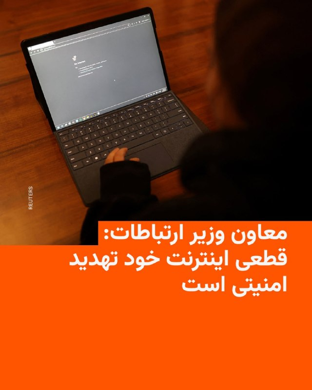

🔸در آغاز یازدهمین هفته از قطعی سراسری اینترنت بین‌المللی در ایران، یک مقام دولتی هشدار داد که این اقدام حکومت در درازمدت خود به «تهدید امنیتی» برای جمهوری اسلامی بدل خواهد شد.

🔸احسان چیت‌ساز، معاون وزیر ارتباطات در دولت مسعود پزشکیان، گفت: «قطع اینترنت فقط در بازه‌های زمانی کوتاه می‌تواند کمک کند و در بلندمدت تهدید امنیتی است.»

🔸قطعی اینترنت در ایران روز شنبه، ۱۹ اردیبهشت، یازدهمین هفته خود را آغاز کرد، در حالی که مردم عادی در کشور تنها با صرف هزینه‌های گزاف می‌توانند به اینترنت بین‌المللی دسترسی داشته باشند و مقام‌های حکومتی و عده‌ای از حامیان جمهوری اسلامی با مانعی در دسترسی مواجه نیستند.

🔸همزمان انتقادهای برخی از مقام‌های دولتی در ایران از این تصمیم «امنیتی» در کشور در حالی منتشر می‌شود که به گفته مخالفان حکومتی دولت، مسعود پزشکیان خود در این تصمیم‌گیری نقش داشته است.

🔸مشخص نیست که اینترنت چه زمانی به خانه‌های مردم بازخواهد گشت. دست‌کم یک نماینده مجلس گفته است که فعلا نباید منتظر بازگشت اینترنت بود.

@RadioFarda

## IranianMinds — post 19833

🔴آویخای ادرعی، سخنگوی ارتش اسرائیل روز شنبه ۱۹ اردیبهشت اعلام کرد نیروهای اسرائیلی در ۲۴ ساعت گذشته بیش از ۸۵ زیرساخت حزب‌الله را از جمله انبارهای سلاح، سکوهای پرتاب و ساختمانهای مورد استفاده برای اهداف نظامی و تونل‌ها در چندین منطقه را هدف حملات قرار داده است.

@IranianMinds

## IranianMinds — post 19832

🔴وزارت کشور بحرین:

دستگاه‌های امنیتی بحرین، یک تشکیلات مرتبط با سپاه تروریستی پاسداران و تفکر ولایت فقیه را شناسایی کرده‌اند و ۴۱ نفر از اعضای آن‌را بازداشت کردند.

@IranianMinds

## BBCPersian — post 280576

🔺نت‌بلاکس: قطع اینترنت ایران وارد یازدهمین هفته شد

نت‌بلاکس که بر وضعیت اینترنت جهان نظارت می کند، می گوید که قطع اینترنت ایران امروز وارد یازدهمین هفته شد.

نت‌بلاکس می گوید خاموشی دیجیتال درایران بیش از ۱۶۸۰ ساعت است که آغاز شده و ایران تا حد زیادی از ارتباط با جهان خارج محروم بوده است.

نت‌بلاکس این اقدام را «سانسور» خوانده و آن را «مانعی بی‌سابقه در برابر دسترسی ایرانیان به دانش، اطلاعات و ارتباطات» توصیف کرده است.

به گفته نت‌بلاکس، دولت جمهوری اسلامی ایران با قطع اینترنت، زندگی روزمره ایرانیان را «با دشواری جدی مواجه ساخته است.»

دولت کنونی ایران به ریاست مسعود پزشکیان که از جمله با شعار بهبود دسترسی به اینترنت و رفع فیلترینگ به قدرت رسید، گفته است که اتصال مجدد اینترنت با مصوبه شورای عالی امنیت خواهد بود.

ایران استفاده از اینترنت ماهواره‌ای از جمله استارلینک را ممنوع و آن را در قوانین خود جرم‌انگاری کرده است.

https://bbc.in/3Pcjsw0
@BBCPersian

## BBCPersian — post 280575

  <a href="telegram/content/BBCPersian_280575_1778328301.mp4">🎬 Download video</a>

🔻‌رژه سالانه «روز پیروزی» صبح شنبه ۹ مه در میدان سرخ مسکو برگزار شد. در این مراسم که به مناسبت هشتاد و یکمین سالگرد پیروزی اتحاد جماهیر شوروی بر آلمان نازی در جنگ جهانی دوم برگزار شد، ولادیمیر پوتین، رئیس‌جمهور روسیه، همراه با شماری از رهبران خارجی حضور داشتند.
   
روسیه همزمان با برگزاری مراسم روز پیروزی خواستار آتش‌بس موقت در جنگ اوکراین شده بود. ولودیمیر زلنسکی، رئیس‌جمهور اوکراین هم به نیروهای مسلح کشورش دستور داده است که حمله‌ای به میدان سرخ مسکو، محل اصلی برگزاری این مراسم، انجام ندهند.
 
دونالد ترامپ، رئیس‌جمهور آمریکا، پیش‌تر گفته بود این آتش‌بس به درخواست او حاصل شده است.
 
حضور سربازان کره شمالی در این مراسم نیز توجه‌ها را جلب کرد. در ماه‌های گذشته گزارش‌هایی درباره مشارکت نظامی کره شمالی در جنگ اوکراین در حمایت از روسیه منتشر شده بود. بر اساس ارزیابی سرویس اطلاعاتی کره جنوبی، بیش از ۱۰ هزار سرباز کره شمالی در مناطق خط مقدم روسیه، از جمله منطقه کورسک، مستقر شده‌اند. مقام‌های آمریکایی هم گزارش‌های مشابهی ارائه کرده‌اند.

https://bbc.in/4nn65pB
@BBCPersian

## BBCPersian — post 280574

🔻اولین جلسه مجلس ایران بعد از دو ماه و سه هفته، اینترنتی برگزار خواهد شد

مجلس ایران برای اولین بار از زمان حمله آمریکا و اسرائیل به ایران، یکشنبه ۲۰ اردیبهشت تشکیل جلسه خواهد داد.

عباس گودرزی، سخنگوی هیئت رئیسه مجلس، اعلام کرد که این جلسه از طریق وبینار (ویدئو کنفرانس) برگزار خواهد شد.

آخرین جلسه علنی مجلس ایران روز ۲۸ بهمن ۱۴۰۴ برگزار شده بود.

جلسه جدید مجلس، پس از ۸۲ روز برگزار خواهد شد.

بنابر اعلام مجلس، موضوع این جلسه «التهابات بازار، نگرانی‌های مردم و گرانی‌های اخیر» خواهد بود.

مجلس شورای اسلامی در آخرین جلسه‌اش به موضوع اصلاح لایحه بودجه سال ۱۴۰۵ پرداخته بود.

علت تاخیر در برگزاری جلسات مجلس «مسائل امنیتی» عنوان شده است.

بنابر گزارش‌ها، با آغاز آتش‌بس در جنگ آمریکا و اسرائیل با ایران، رئیس جمهور ایران و اعضای دولت بعضا جلساتی را به طور حضوری برگزار کردند از جمله نشست مسعود پزشکیان با وزیر صنعت و معدن.

مجلس خبرگان رهبری هم پس از کشته شدن آیت‌الله خامنه‌ای در روز نخست جنگ، جلسه رای‌گیری برای انتخاب رهبر جدید جمهوری اسلامی ایران را به شکل غیابی و از راه دور برگزار کرد.

https://bbc.in/4ngjob8
@BBCPersian

## BBCPersian — post 280573

  

🔺وزارت کشور بحرین می‌گوید که ۴۱ فرد «مرتبط با سپاه پاسداران» را بازداشت کرده است.

خبرگزاری رسمی بحرین از وزارت کشور نقل کرده است که این بازداشت‌ها پس از آن صورت گرفت که مقامات امنیتی از یک گروه مرتبط با سپاه پاسداران پرده برداشتند.

وزارت کشور بحرین گفت که تحقیقات دادستانی همچنین شامل مواردی است که به «همدلی» با حملات ایران مربوط می‌شود.

وزارت کشور بحرین حدود دو هفته پیش هم اعلام کرده بود که تابعیت ۶۹ نفر را به‌دلیل «ستایش یا همدردی با اقدامات خصمانه ایران یا ارتباط با طرف‌های خارجی» لغو کرده است.

ایران بعد از حملات آمریکا و اسرائیل در نهم اسفند سال گذشته، بحرین و شماری دیگر از کشورهای منطقه خلیج فارس را که آمریکا در آنجا پایگاه دارد، هدف حملات پهپادی و موشکی قرار داد.

📸AFP via Getty Images

https://bbc.in/4d0mUTF
@BBCPersian

## Dirty_Kids — post 389161

نفت اگر در دریا ریخته بشه، تمیزکاریش حداقل چند سال طول میکشه و تا ده‌ها سال اثرات زیست محیطیش میمونه

جمهوری اسلامی خطرناکترین ، وحشی‌ترین، و بی‌وجدانترین موجود زنده تاریخه

@Dirty_Kids 👻

## Dirty_Kids — post 389160

  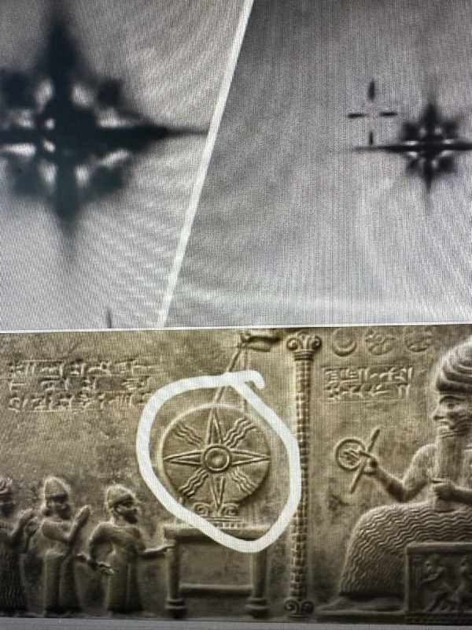

لیترالی مهمترین سوال بشریت جواب داده شده:

«ما در این دنیا تنها نیستیم»

موجودات غیرزمینی هوشمند در این جهان وجود دارند.
و بارها دیده شدند.

ولی واقعا چرا دنیا باهاش مثل یک خبر عادی برخورد میکنه؟

@Dirty_Kids 👻

## Dirty_Kids — post 389159

مجموعه کامل: تمام ویدئوهای UFO که توسط وزارت جنگ ایالات متحده منتشر شده، در یک ویدئو.

@Dirty_Kids 👻

## Hranews — post 112844

  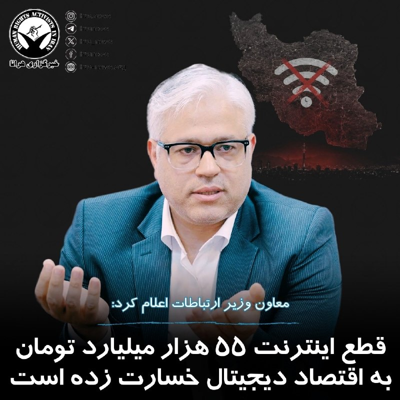

معاون وزیر ارتباطات از خسارت گسترده ناشی از قطع #اینترنت بر اقتصاد دیجیتال ایران خبر داد. احسان چیت‌ساز اعلام کرد که تنها در پلتفرم‌های بزرگ، زیان ناشی از اختلال و قطع اینترنت به حدود ۵۵ هزار میلیارد تومان رسیده است. به گفته وی، این محدودیت‌ها علاوه بر کاهش درآمد کسب‌وکارهای آنلاین، موجب ایجاد «شوک اقتصادی» در حوزه اقتصاد دیجیتال شده است.

صبح امروز، نت‌بلاکس که محدودیت دسترسی به اینترنت در جهان را رصد می‌کند، اعلام کرد که قطعی و اختلال گسترده اینترنت در ایران وارد یازدهمین هفته خود شده است.

↘️
@hranews_bot تماس ✉️ -  @Hranews  کانال هرانا 🆑

## Hranews — post 112843

گزارشی از بازداشت ۷ شهروند در ساوه
 

❗️
❗️
❗️
❗️
❗️ – فرمانده انتظامی ساوه از بازداشت هفت شهروند در این شهرستان به دلایل آنچه “ارسال اطلاعات و همکاری با رسانه‌های خارج از کشور” عنوان کرده، خبر داد.
 
ادامه مطلب
 
#حمله_نظامی
 
↘️
@hranews_bot تماس ✉️ -  @Hranews  کانال هرانا 🆑

## manototv — post 105185

  <a href="telegram/content/manototv_105185_1778328305.mp4">🎬 Download video</a>

تجمع اعتراضی ایرانیان مقابل دانشگاه اراسموس روتردام در هلند همزمان با سخنرانی رابرت مالی در ارتباط با مسائل خاورمیانه و ایران.

## manototv — post 105184

  

وزیر راه جمهوری اسلامی در افتتاح قطعه‌ای از «آزادراه حرم تا حرم» در سمنان اعلام کرده « آزادراه حرم‌ تا حرم، به‌عنوان بخشی از کریدور سرخس تا مهران» به نام رهبر کشته‌شده جمهوری اسلامی علی خامنه‌ای نامگذاری خواهد شد.

## manototv — post 105183

  

داده‌های گمرک چین نشان می‌دهد واردات نفت خام این کشور در آوریل ۲۰ درصد کاهش یافته و به پایین‌ترین سطح از ژوئیه ۲۰۲۲ رسیده است.چین حدود نیمی از نفت خود را از خاورمیانه تأمین می‌کند و بسته شدن تنگه باعث کاهش شدید نفتکش‌ها شده است. واردات دریایی نفت خام نیز طبق داده‌های شرکت «کپلر» به کمترین میزان از ژوئیه ۲۰۲۲ رسیده است.واردات گاز طبیعی چین هم ۱۳ درصد کاهش یافت، هرچند آمار رسمی تفاوتی میان واردات دریایی و خط لوله‌ای قائل نشده است. با این حال، مجموع واردات نفت خام چین در چهار ماه نخست سال هنوز ۱.۳ درصد بیشتر از سال گذشته است.

## alonews — post 118867

  <a href="telegram/content/alonews_118867_1778328308.mp4">🎬 Download video</a>

👈در اقدامی عجیب نوحه برای تمجید از بی حجاب‌ها هم خوانده شد

✅ @AloNews خبر جنگ

## alonews — post 118866

  

👈وزارت صمت: قیمت خودرو حباب و کاذبه

✅ @AloNews خبر جنگ

## alonews — post 118865

  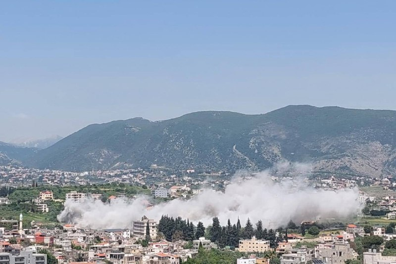

👈حملات هوایی اسرائیل به جنوب لبنان

✅ @AloNews خبر جنگ

## alonews — post 118863

  <a href="telegram/content/alonews_118863_1778328311.jpg">🎬 Download video</a>

👈این وسط هم عده‌ای به حسین طاهری به دلیل مداحی‌های اخیرش لقب عزیزِ ایران دادن

✅ @AloNews خبر جنگ

## alonews — post 118862

  

👈اقلام رکورددار در تورم: روغن جامد با ۳۸۵ درصد افزایش در صدر

✅ @AloNews خبر جنگ

## alonews — post 118861

  

👈یک سرباز اسرائیلی درحال فرار کردن از دست پهپاد انتحاری Fpv حزب‌الله

✅ @AloNews خبر جنگ

## alonews — post 118858

  <a href="telegram/content/alonews_118858_1778328312.mp4">🎬 Download video</a>

👈یک حمله هوایی اسرائیل به یک خودرو در منطقه سعدیات، کوه لبنان هدف گرفت

✅ @AloNews خبر جنگ

## alonews — post 118857

  <a href="telegram/content/alonews_118857_1778328313.jpg">🎬 Download video</a>

👈نیروهای کره شمالی برای اولین بار در رژه روز پیروزی روسیه رژه رفتند

✅ @AloNews خبر جنگ

## alonews — post 118856

  <a href="telegram/content/alonews_118856_1778328313.jpg">🎬 Download video</a>

👈 نیویورک تایمز: روسیه مسیر جایگزینی برای تنگه هرمز در اختیار ایران قرار می‌دهد

✅ @AloNews خبر جنگ

---
📅 بروزرسانی: 1405/02/19 14:44
---

## VahidOOnLine — post 239072

  

همزمان با شرایط پرتنش منطقه، رویداد «در امارات بسازید» در ابوظبی برگزار شد و شرکت‌های تجاری نزدیک به ۴۶ میلیارد دلار در امارات سرمایه‌گذاری کردند.

بر اساس اعلام اوپک، این رقم بیش از مجموع درآمد نفتی جمهوری اسلامی، ۴۵.۳ میلیارد دلار، در سال ۲۰۲۵ میلادی است.

النهار گزارش کرد این سرمایه‌گذاری شامل صنایع دفاعی و تکنولوژیک، دارویی، شیمیایی و انرژی است. این رویداد چهارروزه حتی در شرایط جنگی تعطیل نشد و توانست جایگاه امارات را به عنوان یک قطب صنعتی در منطقه تقویت کند.
‌🏁 🇬🇧 IranintlTV

🤖 @VahidOOnLine

## VahidOOnLine — post 239071

  <a href="telegram/content/VahidOOnLine_239071_1778325252.mp4">🎬 Download video</a>

⭕️ آتش‌بس شکننده لبنان؛
اسرائیل بار دیگر جنوب لبنان را هدف قرار داد

♦️رسانه‌های لبنان از وقوع حملات تازه در جنوب این کشور خبر دادند، حملاتی که همزمان با مشاهده ستون‌های دود و شنیده شدن صدای انفجار در مناطق مرزی، نگرانی‌ها درباره فروپاشی آتش‌بس شکننده میان اسرائیل و حزب‌الله را افزایش داده است.
ویدئوهای منتشرشده از منطقه مرجعیون در جنوب لبنان، برخاستن دود غلیظ از مناطق هدف قرارگرفته را نشان می‌دهد. خبرگزاری رسمی لبنان نیز اعلام کرده چند نقطه در جنوب کشور هدف حملات قرار گرفته‌اند، هرچند جزئیات بیشتری درباره تلفات یا خسارات احتمالی منتشر نشده است.
این حملات در حالی رخ می‌دهد که بنیامین نتانیاهو، نخست‌وزیر اسرائیل، دو روز پیش تاکید کرده بود «هیچ مصونیتی» برای دشمنان اسرائیل وجود ندارد. اظهارات او پس از آن مطرح شد که ارتش اسرائیل برای نخستین بار از زمان آتش‌بس ماه گذشته، یکی از فرماندهان حزب‌الله را در ضاحیه جنوبی بیروت هدف قرار داد.
‌🇸🇦 Indypersian

🤖 @VahidOOnLine

## VahidOOnLine — post 239070

  <a href="telegram/content/VahidOOnLine_239070_1778325255.mp4">🎬 Download video</a>

♦️دست‌کم پنج نفر در پی آتش‌سوزی گسترده در یک نمایشگاه و شهربازی شلوغ در ایالت تاباسکوی مکزیک جان باختند.
به گزارش خبرگزاری فرانسه، این آتش‌سوزی در جریان برگزاری «نمایشگاه تاباسکو ۲۰۲۶» در شهر ویافرموسا رخ داد و شعله‌های آتش به‌سرعت بخش‌هایی از محل برگزاری نمایشگاه و شهربازی را فرا گرفت.
مقام‌های محلی اعلام کرده‌اند چندین نفر نیز در این حادثه زخمی شده‌اند و تحقیقات درباره علت وقوع آتش‌سوزی ادامه دارد.
‌🇸🇦 Indypersian

🤖 @VahidOOnLine

## VahidOOnLine — post 239069

  

بر پایه گزارش‌های منتشر شده امیرحسین رضایی، روزنامه‌نگار و دانشجوی علوم سیاسی دانشگاه تهران، ۱۶ اردیبهشت ماه با یورش ماموران امنیتی با یورش به منزل پدری او در اراک بازداشت و به مکان نامعلومی منتقل شده است. ماموران اقدام به ضبط وسائل الکترونیکی و کتاب‌های این روزنامه نگار روزنامه دنیای اقتصاد، که به تازگی و در موج تعدیل جدید بر پایه تسویه‌ سیاسی درون روزنامه، اخراج شده بود، کرده‌اند. آقای رضایی، مرشد زورخانه و نوازنده سه‌تار و خواننده آواز سنتی ایرانی نیز هست.
‌🏁 🇬🇧 ManotoTV

🤖 @VahidOOnLine

## VahidOOnLine — post 239068

  

وزارت کشور بحرین روز شنبه اعلام کرد که ۴۱ نفر را بازداشت کرده که به گفته این وزارتخانه با سپاه پاسداران انقلاب اسلامی در ارتباط بوده‌اند؛ خبرگزاری رسمی این کشور این خبر را منتشر کرده است.این وزارتخانه همچنین اعلام کرد که تحقیقات دادستانی عمومی شامل پرونده‌هایی درباره ابراز همدلی با حملات جمهوری‌اسلامی نیز بوده است. پیش‌تر نیز گزارش شده بود مجلس نمایندگان بحرین عضویت سه نماینده را لغو کرده است. این اقدام پس از آن انجام شده که این نمایندگان با اقدامات انجام‌شده علیه افرادی که به داشتن «گرایش یا همدلی با ایران» متهم شده بودند، مخالفت کرده بودند. جمهوری‌اسلامی از زمان آغاز درگیری‌ها در ماه فوریه، بارها حملاتی را علیه بحرین و دیگر کشورهای عربی حاشیه خلیج فارس انجام داده است.
‌🏁 🇬🇧 ManotoTV

🤖 @VahidOOnLine

## VahidOOnLine — post 239067

  

♦️عیسی امیدوار، جهانگرد، مستندساز و پژوهشگر پیشکسوت ایرانی که همراه برادرش از چهره‌های ماندگار تاریخ جهانگردی معاصر ایران به شمار می‌رفت، روز شنبه ۱۹ اردیبهشت ماه در ۹۷ سالگی درگذشت.
به گزارش ایرنا او به‌دلیل بیماری و کهولت سن چند روزی در بیمارستان بستری بود.
عیسی امیدوار، متولد دوم دی ۱۳۰۸، به همراه برادرش عبدالله از نخستین جهانگردان ایرانی معاصر بودند که در دهه‌های میانی قرن بیستم سفرهای طولانی و پژوهشی خود را به نقاط دورافتاده جهان آغاز کردند. این دو برادر که اصالتشان به روستای فشندک طالقان در استان البرز بازمی‌گردد، به سفر در میان قبایل، فرهنگ‌ها و جوامع کمتر شناخته‌شده پرداختند.
برادران امیدوار با موتورسیکلت، خودرو و ابزارهای ساده سفر، سال‌ها در قاره‌های مختلف جهان گردش کردند و مجموعه‌ای کم‌نظیر از فیلم‌ها، عکس‌ها و اسناد مردم‌شناسی از مناطقی ثبت کردند که بسیاری از آن‌ها امروز دگرگون شده یا دیگر وجود ندارند.
موزه برادران امیدوار در مجموعه کاخ سعدآباد همچنان یادآور این سفرها و تلاش‌های پژوهشی است. قرار بود در روز جهانی موزه، ۲۸ اردیبهشت ۱۴۰۵، از عیسی امیدوار نیز تجلیل شود، اما او پیش از این مراسم درگذشت.
عبدالله امیدوار، برادر کوچک‌تر او، نیز در ۲۳ تیر ۱۴۰۱ در ۹۰ سالگی در شیلی درگذشته بود.
‌🇸🇦 Indypersian

🤖 @VahidOOnLine

## mwarmonitor — post 8746

  

✈️یک فروند هواپیمای آمریکایی Bombardier E-11A Battlefield Airborne Communications Node در نقش «گره ارتباطات هوابرد میدان نبرد» به‌کار گرفته شده.
این هواپیما برای تقویت و پشتیبانی ارتباطات فرماندهی و کنترل در مناطق عملیاتی استفاده می‌شود.

@mwarmonitor

## mwarmonitor — post 8745

  

🚢کشتی حامل LNG متعلق به قطر به نام «Al Kharaitiyat» در حال نزدیک شدن به تنگه هرمز است؛ اگر متوقف نشود، ممکن است اولین نفتکش غیرمرتبط با ایران باشد که در چند روز اخیر اجازه عبور پیدا می‌کند.

مقصد: پاکستان.

@mwarmonitor

## pm_afshaa — post 90401

🔴ایرنا: بخاطر قطع اینترنت بین‌الملل و تعدیل نیرو و بیکاری، تعداد دست فروش‌ها روز به روز داره بیشتر می‌شه

💧 Rainbet.com the #1 Non-KYC Crypto Casino & Sportsbook @rainbetcom

😁 @Pm_Afshaa

## pm_afshaa — post 90400

🔴کارشناس صداوسیما: آرایش نیروهای آمریکایی خبر از یک جنگ بزرگ می‌دهد

💧 Rainbet.com the #1 Non-KYC Crypto Casino & Sportsbook @rainbetcom

😁 @Pm_Afshaa

## pm_afshaa — post 90399

🔴نیویورک تایمز به نقل از مقامات آمریکایی: روسیه از طریق دریای خزر قطعات پهپاد را به ایران صادر می‌کند و به این کشور در بازسازی قابلیت‌هایش کمک می‌کند

💧 Rainbet.com the #1 Non-KYC Crypto Casino & Sportsbook @rainbetcom

😁 @Pm_Afshaa

## pm_afshaa — post 90398

المیادین:نیروهای مسلح جمهوری اسلامی ورود یک ناوشکن آمریکایی به آب‌های امارات را رصد کرده و تحرکات آن را دنبال می‌کند

💧 Rainbet.com the #1 Non-KYC Crypto Casino & Sportsbook @rainbetcom

😁 @Pm_Afshaa

## pm_afshaa — post 90397

💰تعرفه
💰

1 گیگ    
⬆️ 295 ت

500 مگ 
⬆️ 185 ت

100 مگ 
⬆️ 55 ت

⭐️ اتصال پایدار در نت ملی

⭐️ مناسب اینستاگرام و تلگرام و یوتیوب

⭐️ دارای سایت استعلام باقی حجم

⭐️ بدون محدودیت کاربر و بدون انقضا

⭐️ ضمانت بازگشت وجه درصورت عدم رضایت

🌟 تست هم موجود میباشد 
🌟

جهت خرید به آیدی زیر پیام دهید 
⬆️

Admin : @Four_Support 
👨‍💻

Channel : @Four_Vpn_4 
🩵

🎇داخل گروه زیر هر شب قرعه کشی ۱۰ اشتراک رایگان انجام میشود 
⬆️
https://t.me/+v8GFmLXjHa5jNDZk

## DEJradio — post 4533

  

🚨📢 شناسایی تشکیلات مرتبط با سـپاه پاسداران در بحرین؛ ۴۱ نفر بازداشت شدند

وزارت کشور بحرین اعلام کرد دستگاه‌های امنیتی این کشور یک تشکیلات مرتبط با سپاه پاسداران انقلاب اسلامی و اندیشه «ولایت فقیه» را شناسایی و ۴۱ نفر از اعضای آن را بازداشت کرده‌اند.
بر پایه اعلام وزارت کشور بحرین در روز شنبه ۱۹ اردیبهشت، این اقدام بر اساس نتایج گزارش‌‌های امنیتی در پرونده‌های «جاسوسی برای نهادهای خارجی» و «همدلی با حملات جمهوری اسلامی» انجام شده است.
عملیات جستجو و تحقیق به منظور «شناسایی و برخورد قانونی» با دیگر افراد مرتبط با این تشکیلات ادامه دارد.
پیش از این، دادستانی بحرین نیز اعلام کرده بود در دو پرونده جداگانه مربوط به جاسوسی، برای دو تبعه افغانستانی و سه شهروند بحرینی حکم حبس ابد صادر شده است.

#بحرین #IRGCterrorists

## DEJradio — post 4532

  <a href="telegram/content/DEJradio_4532_1778325263.mp4">🎬 Download video</a>

🤡
🔺 فقط کشکک مجتبی مجروح شده است!

در حالی که بیش از دو ماه از حذف هدفمند خامنه‌ای و خانواده او می‌گذرد و پسرش، مجتبی خامنه‌ای با وجود منسوب شدن به رهبری، هنوز تصویر یا صدایی از او منتشر نشده، مظاهر حسینی، مسئول دیدارهای دفتر خامنه‌ای، در تجمع شبانه حکومتیريال مدعی شده که مجتبی در جریان بمباران کاخ مرمر، تنها از ناحیه کشکک زانو، کمر و کمی پشت گوش آسیب دیده است.

#موشتبا #حذف_هدفمند
@DEJradio

## IranIntlTV — post 336279

  

همزمان با شرایط پرتنش منطقه، رویداد «در امارات بسازید» در ابوظبی برگزار شد و شرکت‌های تجاری نزدیک به ۴۶ میلیارد دلار در امارات سرمایه‌گذاری کردند.

بر اساس اعلام اوپک، این رقم بیش از مجموع درآمد نفتی جمهوری اسلامی، ۴۵.۳ میلیارد دلار، در سال ۲۰۲۵ میلادی است.

النهار گزارش کرد این سرمایه‌گذاری شامل صنایع دفاعی و تکنولوژیک، دارویی، شیمیایی و انرژی است. این رویداد چهارروزه حتی در شرایط جنگی تعطیل نشد و توانست جایگاه امارات را به عنوان یک قطب صنعتی در منطقه تقویت کند.
https://iranintl.com/202605091828

## IranIntlTV — post 336278

  <a href="telegram/content/IranIntlTV_336278_1778325267.mp4">🎬 Download video</a>

هم‌زمان با ادامه تلاش‌ها برای دستیابی به توافق میان جمهوری اسلامی و آمریکا، دونالد ترامپ گفت احتمالا تهران تا شنبه پاسخ خود را به طرح توافق ارائه خواهد کرد. او افزود اگر این توافق نهایی نشود، دولتش ممکن است رویکرد متفاوتی در پیش گیرد.

ارزیابی لیلا مروتی، تحلیل‌گر سیاسی
@iranintltv

## IranIntlTV — post 336277

  <a href="telegram/content/IranIntlTV_336277_1778325269.mp4">🎬 Download video</a>

وزارت جنگ آمریکا با دستور دونالد ترامپ مجموعه تازه‌ای از اسناد طبقه‌بندی‌شده درباره بشقاب‌پرنده‌ها یا «یوفوها» را منتشر کرد. در این گزارش‌ها به مشاهده برخی بشقاب‌پرنده‌ها در آسمان خلیج فارس و مناطق نزدیک به ایران نیز اشاره شده است.

جزییات بیشتر در گفت‌وگو با پیام دریابی، عضو تحریریه ایران‌اینترنشنال
@iranintltv

## IranIntlTV — post 336276

  <a href="telegram/content/IranIntlTV_336276_1778325272.mp4">🎬 Download video</a>

سرخط خبرهای شنبه ۱۹ اردیبهشت
@iranintltv

## IranIntlTV — post 336275

یک شهروند با ارسال پیامی به ایران اینترنشنال می‌گوید قدرت خرید و وضع معیشت به قدری بد شده که نوشیدن یک قهوه روزانه برای او تبدیل به حسرت شده است. پیام مخاطب برای حفظ امنیتش با هوش مصنوعی خوانده شده است.

## IranIntlTV — post 336274

یک شهروند با ارسال پیامی به ایران اینترنشنال می‌گوید بانک اموال و کارخانه او را به دلیل ضمانتش برای وام شرکتی دیگر توقیف کرده است. پیام او برای حفظ امنیتش با هوش مصنوعی خوانده شده است.

## ManotoTV — post 105182

  

بر پایه گزارش‌های منتشر شده امیرحسین رضایی، روزنامه‌نگار و دانشجوی علوم سیاسی دانشگاه تهران، ۱۶ اردیبهشت ماه با یورش ماموران امنیتی با یورش به منزل پدری او در اراک بازداشت و به مکان نامعلومی منتقل شده است. ماموران اقدام به ضبط وسائل الکترونیکی و کتاب‌های این روزنامه نگار روزنامه دنیای اقتصاد، که به تازگی و در موج تعدیل جدید بر پایه تسویه‌ سیاسی درون روزنامه، اخراج شده بود، کرده‌اند. آقای رضایی، مرشد زورخانه و نوازنده سه‌تار و خواننده آواز سنتی ایرانی نیز هست.

## ManotoTV — post 105181

  

وزارت کشور بحرین روز شنبه اعلام کرد که ۴۱ نفر را بازداشت کرده که به گفته این وزارتخانه با سپاه پاسداران انقلاب اسلامی در ارتباط بوده‌اند؛ خبرگزاری رسمی این کشور این خبر را منتشر کرده است.این وزارتخانه همچنین اعلام کرد که تحقیقات دادستانی عمومی شامل پرونده‌هایی درباره ابراز همدلی با حملات جمهوری‌اسلامی نیز بوده است. پیش‌تر نیز گزارش شده بود مجلس نمایندگان بحرین عضویت سه نماینده را لغو کرده است. این اقدام پس از آن انجام شده که این نمایندگان با اقدامات انجام‌شده علیه افرادی که به داشتن «گرایش یا همدلی با ایران» متهم شده بودند، مخالفت کرده بودند. جمهوری‌اسلامی از زمان آغاز درگیری‌ها در ماه فوریه، بارها حملاتی را علیه بحرین و دیگر کشورهای عربی حاشیه خلیج فارس انجام داده است.

## FarsiVOA — post 217258

  

مقامات بریتانیایی اعلام کردند که دو مرد را پس از ضبط ویدئوهایی یهودستیزانه برای شبکه‌های اجتماعی تیک‌تاک متهم کرده‌اند.

پلیس بریتانیا روز شنبه گزارش داد که این دو مرد به یک منطقه یهودی‌نشین در شمال لندن سفر کرده و این ویدیوها را آنجا ضبط کرده‌اند. بر اساس این گزارش، این دو نفر به «آزار و اذیت با انگیزه دینی» متهم شده‌اند.

دادستانی کل بریتانیا اعلام کرد که این دو مرد، آدام بدویی ۲۰ ساله و عبدالقادر امیر بوسلوب ۲۱ ساله، قرار است در دادگاه حاضر شوند.

پیشتر کی‌یر استارمر، نخست‌وزیر بریتانیا، در هشداری مستقیم به جمهوی اسلامی گفت هرگونه تلاش برای دامن زدن به خشونت، نفرت یا تفرقه در جامعه بریتانیا «تحمل نخواهد شد.»

استارمر روز سه‌شنبه گذشته در نشستی در دفتر نخست‌وزیری با رهبران جامعه یهودیان، مقام‌های دولتی و مسئولان پلیس گفت یکی از محورهای تحقیقات این است که آیا یک کشور خارجی پشت برخی از حملات اخیر به جامعه یهودیان بریتانیا بوده است یا نه.
@FarsiVOA

## FarsiVOA — post 217257

  

خبرگزاری دولتی ایرنا در گزارشی میدانی از تهران، عملاً تأیید کرده است که قطع اینترنت بخشی از فروشگاه‌های مجازی را از فضای آنلاین بیرون رانده و به خیابان و پیاده‌رو کشانده است.

ایرنا نوشته پررنگ شدن دستفروشی فقط محدود به نقاط مرکزی تهران نیست و از بازار امامزاده حسن در جنوب غرب تهران تا شهرک اندیشه شهریار نیز دیده می‌شود.

به گزارش این خبرگزاری، مدارای شهرداری و «دستور آگاهانه» برای برخورد نکردن با دستفروشان، این روند را آشکارتر کرده و بخش‌هایی از شهر را به ویترین بساط‌گرانی تبدیل کرده است که به‌اجبار از اینستاگرام به خیابان کوچ کرده‌اند.

به این ترتیب، خاموشی اینترنت فقط فروش آنلاین را متوقف نکرده، بلکه بخشی از اقتصاد خرد دیجیتال را از صفحه موبایل به پیاده‌رو عقب رانده است.

ایرنا نوشته فروشندگانی که تا چند ماه پیش با صفحه اینستاگرامی، پرداخت آنلاین و ارسال سفارش فعالیت می‌کردند، حالا در نبود اینترنت آزاد و پایدار، ناچار شده‌اند در خیابان بساط کنند.

در روزهای اخیر، گزارش‌های متعددی درباره افزایش بیکاری، به‌ویژه در میان زنان و صاحبان کسب‌وکارهای خرد، در پی قطع اینترنت منتشر شده است.
@FarsiVOA

## FarsiVOA — post 217256

🔺گزارش‌ها از سهمیه‌بندی سرم و آنتی‌بیوتیک؛ بحران دارو از بازار به بیمارستان رسید

◾️گزارش‌های رسیده به صدای آمریکا از سهمیه‌بندی سرم در بیمارستان‌ها و ابلاغ دستورالعمل تازه برای کاهش مصرف سرم و آنتی‌بیوتیک حکایت دارد.

◾️یک مدیر بیمارستان خصوصی در تهران به صدای آمریکا گفت بر اساس دستورالعمل جدید، مصرف سرم در بخش اورژانس بیمارستان‌ها باید دست‌کم ۵۰ درصد کاهش پیدا کند.

◾️یک دکتر داروساز نیز به صدای آمریکا گفته بحران سرم و آنتی‌بیوتیک در داروخانه‌ها جدی شده و توزیع این دو قلم با تأخیر و بسیار کمتر از تقاضای واقعی انجام می‌شود.

⬇️ بیشتر بخوانید:
https://ir.voanews.com/a/8148262.html

## FarsiVOA — post 217255

🔺بحرین: ۴۱ عضو یک گروه مرتبط با سپاه پاسداران بازداشت شدند

◾️وزارت کشور بحرین اعلام کرد که ۴۱ نفر را که با سپاه پاسداران مرتبط بوده‌اند، بازداشت کرده است.

◾️گزارش شده این افراد اعضای هسته اصلی «یک سازمان مرتبط با سپاه پاسداران» و مدافع تئوری «ولایت فقیه» بوده‌اند.

◾️پیشتر رسانه‌های بحرینی روز پنجشنبه ۱۷ اردیبهشت، گزارش دادند که پارلمان بحرین سه نفر از نمایندگان خود را به اتهام «حمایت از [رژیم] ایران و ستایش حملات آن» برکنار کرده است.

◾️همچنین در ۷ اردیبهشت ماه دولت بحرین اعلام کرد، که تابعیت ۶۹ نفر را لغو کرده و در این‌باره توضیح داد که آنها «با [رژیم] ایران ابراز همدردی کرده و از اقدامات خصمانه و مجرمانه آن در حمله به بحرین تمجید کرده‌ بودند.»

⬇️ بیشتر بخوانید:
https://ir.voanews.com/a/8148261.html

## DW_Farsi — post 124473

  

🔶ترامپ: اگر توافق نشود به اجرای پروژه آزادی تنگه هرمز برمی‌گردیم

دونالد ترامپ، رئیس جمهور آمریکا روز شنبه ۱۹ اردیبهشت (۹ مه) در گفتگو با خبرنگاران درباره اجرای دوباره "پروژه آزادی" در تنگه هرمز هشدار داد و گفت، اگر همه توافق‌ها نهایی و کامل نشود، واشنگتن ممکن است به این طرح بازگردد؛ اما این بار با نسخه‌ای گسترده‌تر تحت عنوان "پروژه آزادی پلاس".

رئیس جمهور آمریکا صبح روز چهارشنبه ۱۶ اردیبهشت نیز در پلتفرم "تروث سوشال" خبر داده بود که به دلیل درخواست پاکستان و برخی کشورهای دیگر "پروژه آزادی" را بطور موقت متوقف می‌کند.

به گفته رئیس جمهور آمریکا، توافق شده بود که با وجود تداوم کامل محاصره دریایی، "پروژه آزادی" (اسکورت و هدایت کشتی‌ها برای خروج از تنگه هرمز) برای مدت کوتاهی متوقف شود.

ترامپ همچنین توضیح داد که این توقف برای بررسی احتمال نهایی‌شدن توافق و امضای آن انجام می‌شود.

@dw_farsi

## DW_Farsi — post 124472

  <a href="telegram/content/DW_Farsi_124472_1778325278.mp4">🎬 Download video</a>

🎥ویدئوی پنتاگون از حمله به دو نفتکش ایران

ارتش آمریکا می‌گوید نیروهایش روز جمعه ۸ ماه مه (۱۸ اردیبهشت) پس از تبادل آتش در تنگه هرمز، به دو نفتکش جمهوری اسلامی شلیک کرده و آنها را از کار انداخته‌اند.

سنتکام می‌گوید نفتکش‌های ام‌تی‌سودا و ام‌تی‌سی استار۳ در حال حرکت به سمت بنادر ایران در خلیج عمان بودند و جنگنده‌های آمریکایی با حمله به دودکش و سکان آنها، مانع ادامه حرکتشان شدند.

در بیانیه ارتش آمریکا آمده است که یک جنگنده اف/ای-۱۸ سوپر هورنت متعلق به ناو هواپیمابر جورج دبلیو بوش، با شلیک مهمات هدایت‌شونده به دودکش‌های دو نفتکش، آنها را از ادامه حرکت بازداشته ‌است.

سنتکام همچنین اعلام کرد که نیروهای آمریکایی ششم ماه مه نفتکش "ام/تی حسنا" را نیز هنگام حرکت به سمت یکی از بنادر ایران در خلیج عمان از کار انداختند.

@dw_farsi

## Persian_Trend_Official — post 13743

جنگنده F-16C نیروی هوایی ایالات متحده از اسکادران 79 جنگنده "تایگرز" بر فراز خاورمیانه، که حداقل یک نشان برای انهدام یک هدف با موشک AGM-88 HARM بر روی سیستم راداری ایران دارد. 📌 @persian_trend_official پرشین ترند | متفاوت‌ترین کانال نظامی

## Persian_Trend_Official — post 13742

🔴خانعلی‌زاده» کارشناس صداوسیما با اشاره به تحرکات نظامی آمریکا در منطقه گفت آرایش فعلی نیروهای آمریکایی «خبر از یک جنگ بزرگ می‌دهد».

🫆:Tony

📌 @persian_trend_official
پرشین ترند | متفاوت‌ترین کانال نظامی

## Persian_Trend_Official — post 13741

🔴 ارتش اسرائیل: یک پهپاد انفجاری حزب‌الله در شمال اسرائیل شناسایی شد

ارتش اسرائیل اعلام کرد امروز شنبه یک پهپاد انفجاری که توسط حزب‌الله شلیک شده بود، در شمال اسرائیل و در نزدیکی مرز لبنان شناسایی شده است.

طبق بیانیه ارتش:

▪️ این پهپاد پیش از رسیدن به هدف کشف شده
▪️ هیچ خسارت یا زخمی گزارش نشده است
▪️ نیروهای امنیتی در محل در حال خنثی‌سازی پهپاد هستند
▪️ ادامه رسیدگی به حادثه به پلیس اسرائیل واگذار شده است

🫆:Tony

📌 @persian_trend_official
پرشین ترند | متفاوت‌ترین کانال نظامی

## Persian_Trend_Official — post 13740

  

⭕️ توییت جدید ولید گادبان مشاور سیاسی هیئت اسرائیل در سازمان ملل در ژنو:

📝 Nick

📌 @persian_trend_official
پرشین ترند | متفاوت‌ترین کانال نظامی

## RadioFarda — post 156999

  

🔸رسانه‌های داخل ایران روز شنبه از گفت‌وگوی تلفنی عباس عراقچی، وزیر خارجه جمهوری اسلامی، با همتای ترکیه‌ای‌اش خبر دادند، تماسی که او در آن از «رویکرد مخرب آمریکا در روند دیپلماسی» انتقاد کرده است.

🔸او گفت: «رویکرد مخرب آمریکا روند دیپلماسی را تضعیف می‌کند.»

🔸به گزارش خبرگزاری ایسنا، عراقچی در گفت‌وگو با هاکان فیدان،‌ وزیر امور خارجه ترکیه، چنین شکایت کرده است:‌ «تنش‌آفرینی اخیر نیروهای آمریکایی در خلیج فارس و اقدامات متعدد آنان در نقض آتش‌بس، بر سوء ظن‌ها نسبت به انگیزه و جدیت طرف آمریکایی در مسیر دیپلماسی افزوده است.»

🔸به نظر می‌رسد اشاره این مقام جمهوری اسلامی به ادامه محاصره دریایی بنادر ایران و حمله تازه ارتش آمریکا به دو نفتکش ایرانی باشد که روز جمعه گذشته رخ داد.

🔸ارتش آمریکا روز جمعه تأیید کرد که با حمله به دو نفتکش ایرانی دیگر، مانع از عبور آنها از محاصره دریایی اعمال شده بر بنادر و کشتیرانی ایران شده است.

🔸انتقاد عراقچی از دولت آمریکا در زمانی در رسانه‌های ایران بازتاب یافته که دونالد ترامپ در انتظار دریافت پاسخ حکومت ایران به پیشنهاد تازه برای پایان جنگ است.

@RadioFarda

## IranianMinds — post 19831

  

😂😂😂😂😂😂

@IranianMinds

## IranianMinds — post 19830

🔴خانعلی‌زاده کارشناس صداوسیما:

آرایش نیروهای آمریکایی، خبر از یک جنگ بزرگ می‌دهد.

@IranianMinds

## IranianMinds — post 19829

🔴اپلیکیشن تلگرام در عراق رفع فیلتر شد.

@IranianMinds

## IranianMinds — post 19828

🔴نیویورک‌تایمز به نقل از مقامات آمریکایی:

روسیه برای کمک به بازسازی توان موشکی ایران، از طریق دریای خزر ، قطعات موشکی به ایران ارسال می‌کند.

همچنین کالاهایی که پیش‌تر از تنگه هرمز عبور می‌کردند، اکنون از این مسیر تأمین می‌شوند و حجم حمل‌و‌نقل بار به ایران از طریق دریای خزر در ماه‌های اخیر افزایش یافته است.

@IranianMinds

## IranianMinds — post 19827

🔴العربیه:

اسرائیل از آمریکا خواست که از طولانی کردن مذاکرات با ایران خودداری کند.

@IranianMinds

## BBCPersian — post 280572

🔻معاون وزیر ارتباطات خسارت قطع اینترنت برای اقتصاد دیجیتال در پلتفرم‌های بزرگ را «۵۵ همت» اعلام کرد

احسان چیت‌ساز، معاون وزیر ارتباطات ایران امروز در یک نشست خبری خسارت‌های ناشی از قطع اینترنت برای اقتصاد دیجیتال ایران، در پلتفرم‌های بزرگ را ۵۵ هزار میلیارد تومان اعلام کرد.

او گفته است: «مجموع عدم‌النفع (کاهش درآمد) این حوزه نزدیک به ۱۶/۳۲ هزار میلیارد تومان برآورد می‌شود.»

معاون وزیر ارتباطات ایران همچنین گفته است قطعی اینترنت در حوزه مخابرات و ارتباطات حدود ۶/۴ هزار میلیارد تومان کاهش درآمد مستقیم کسب‌وکارها را در بر داشته است.

آقای چیت‌ساز گفته است: «قطع اینترنت برای کسب‌وکار اقتصاد دیجیتال ممکن است برای چند ساعت قابل تحمل باشد، اما قطع گسترده و سراسری آن عملا یک شوک اقتصادی ایجاد می‌کند.»

یازده هفته از قطع سراسری اینترنت در ایران می‌گذرد.

افشین کلاهی، ازاعضای اتاق بازرگانی ایران، پیش از این گفته بود که خسارت مستقیم قطع اینترنت در ایران ۳۰ تا ۴۰ میلیون دلار در روز است و خسارت مستقیم و غیرمستقیم این محدودیت تا۸۰ میلیون دلار در روز می‌رسد.

https://bbc.in/4dfzXzs
@BBCPersian

## BBCPersian — post 280571

🔻رئیس جمهور لبنان بر «همبستگی» کشورش با امارات در «شرایط حساس» منطقه تاکید کرد

جوزف عون، رئیس جمهور لبنان در تماسی تلفنی با شیخ محمد بن زاید آل نهیان، رئیس امارات متحده عربی، درباره وضعیت منطقه و رویدادهای اخیر صحبت کرد.

جوزف عون در این تماس بر «همبستگی مردم لبنان با امارات در شرایط حساس فعلی» تاکید کرد.

امارات متحده عربی، ایران را به حمله به تاسیسات نفتی فجیره متهم کرده است. ایران اما می‌گوید هیچ دخالتی در این حمله نداشته است.

آقای عون همچنین همتای اماراتی خود را در جریان آخرین تحولات مرتبط با مذاکرات بین مقام‌های دولت لبنان با آمریکا و اسرائیل قرار داد.

این مذاکرات که در واشنگتن برگزار شده بود، با مخالفت و انتقاد حزب‌الله لبنان، گروه‌ همسو با ایران، مواجه شد.

در یک سال گذشته، روابط ایران با دولت لبنان و امارات به شدت متشنج شده است.

https://bbc.in/48L2Cew
@BBCPersian

## Dirty_Kids — post 389158

«تلگرام» در عراق رفع فیلتر شد

سازمان رسانه و ارتباطات عراق از لغو ممنوعیت فعالیت اپلیکیشن تلگرام در سراسر این کشور خبر داد.

@Dirty_Kids 👻

## Dirty_Kids — post 389156

جمهوری اسلامی ورداشته عكس آیسان اسلامی‌رو گذاشته تو شهرهای آمل و بابل...

آیسانم ویدیو گرفته جوابشونو داده: 🤣🤣🤣

@Dirty_Kids 👻

## Dirty_Kids — post 389154

  <a href="telegram/content/Dirty_Kids_389154_1778325282.mp4">🎬 Download video</a>

⚽️رسمی؛ شکیرا و بورنابوی خواننده‌های آهنگ رسمی جام‌جهانی ۲۰۲۶ ان و در تاریخ ۲۴ اردیبهشت کارو میدن بیرون.

@Dirty_Kids 👻

## Dirty_Kids — post 389153

  <a href="https://t.me/Dirty_Kids/389153">📎 Download file</a>

✅ اپلیکیشن اندروید سایت جهانی دربی بت

💰اولین سایت جهانی با امکان شارژ و برداشت ریالی(کارت به کارت)

🔗 برای ورود فیلترشکن روی کشور مناسب قرار دهید مانند فنلاند و المان و....

😀Telegram Channel
👇
https://t.me/+bcynkEgSW2dlYTc0

## Dirty_Kids — post 389152

  

😤دنبال یه سایت شرط بندی بین المللی بودی که به ایرانیا خدمات بده؟!
⛔

👍دربی بت همون انتخاب  100%

💎ویژگی های سایت جهانی Derby Bet:

⬅️امکان شارژ امن با کارت بانکی

⬅️واریز اول دوبل شارژ می شوید(بونوس۱۰۰٪)

⬅️پر اپشن ترین سایت فعال در ایران

⬅️تسویه حساب کمتر از 5 دقیقه

⬅️برگشت بخشی از باخت به صورت هفتگی

🚨کد هدیه ثبت نام:GG007

⚠️برای دانلود اپلکیشن کلیک کنید
👉

🔔کانال دربی بت :

🪙https://t.me/+bcynkEgSW2dlYTc0

## Hranews — post 112842

  

اعتراضات دی‌‌ماه ۱۴۰۴؛ گزارشی از آخرین وضعیت آبان و حسن موسوی در زندان وکیل آباد
 

❗️
❗️
❗️
❗️
❗️ – آبان (زینب) موسوی و حسن موسوی که در اسفند سال گذشته در رابطه با اعتراضات دی‌‌ماه ۱۴۰۴ بازداشت شدند، اکنون در زندان وکیل آباد مشهد به سر می‌برند. چندی پیش جلسه دادگاه رسیدگی به پرونده این خواهر و برادر، از بابت اتهاماتی از جمله “محاربه”، در دادگاه انقلاب مشهد برگزار شده است.
 
به گزارش خبرگزاری هرانا، ارگان خبری مجموعه فعالان حقوق بشر در ایران، سیده زینب موسوی و برادرش سید حسن موسوی در زندان وکیل آباد مشهد هستند.
 
براساس اطلاعات دریافتی هرانا، جلسه دادگاه رسیدگی به پرونده این شهروندان در تاریخ ۶ اردیبهشت‌ماه امسال برگزار شده است. این خواهر و برادر با اتهاماتی از جمله محاربه مواجه هستند؛ موضوعی که نگرانی خانواده و نزدیکان آنها را نسبت به احتمال صدور احکام سنگین افزایش داده است.
 
ادامه مطلب
 
#آبان_موسوی #زینب_موسوی #حسن_موسوی
 
↘️
@hranews_bot تماس ✉️ -  @Hranews  کانال هرانا 🆑

## manototv — post 105182

  

بر پایه گزارش‌های منتشر شده امیرحسین رضایی، روزنامه‌نگار و دانشجوی علوم سیاسی دانشگاه تهران، ۱۶ اردیبهشت ماه با یورش ماموران امنیتی با یورش به منزل پدری او در اراک بازداشت و به مکان نامعلومی منتقل شده است. ماموران اقدام به ضبط وسائل الکترونیکی و کتاب‌های این روزنامه نگار روزنامه دنیای اقتصاد، که به تازگی و در موج تعدیل جدید بر پایه تسویه‌ سیاسی درون روزنامه، اخراج شده بود، کرده‌اند. آقای رضایی، مرشد زورخانه و نوازنده سه‌تار و خواننده آواز سنتی ایرانی نیز هست.

## manototv — post 105181

  

وزارت کشور بحرین روز شنبه اعلام کرد که ۴۱ نفر را بازداشت کرده که به گفته این وزارتخانه با سپاه پاسداران انقلاب اسلامی در ارتباط بوده‌اند؛ خبرگزاری رسمی این کشور این خبر را منتشر کرده است.این وزارتخانه همچنین اعلام کرد که تحقیقات دادستانی عمومی شامل پرونده‌هایی درباره ابراز همدلی با حملات جمهوری‌اسلامی نیز بوده است. پیش‌تر نیز گزارش شده بود مجلس نمایندگان بحرین عضویت سه نماینده را لغو کرده است. این اقدام پس از آن انجام شده که این نمایندگان با اقدامات انجام‌شده علیه افرادی که به داشتن «گرایش یا همدلی با ایران» متهم شده بودند، مخالفت کرده بودند. جمهوری‌اسلامی از زمان آغاز درگیری‌ها در ماه فوریه، بارها حملاتی را علیه بحرین و دیگر کشورهای عربی حاشیه خلیج فارس انجام داده است.

## alonews — post 118855

  <a href="telegram/content/alonews_118855_1778325288.jpg">🎬 Download video</a>

👈 کمیسیونر اروپایی کمک‌های بشردوستانه و مدیریت بحران: اتحادیه اروپا به حمایت‌های لازم از مردم لبنان ادامه خواهد داد، با اشاره به اینکه بیش از ۲۰٪ جمعیت به دلیل جنگ مجبور به ترک خانه‌های خود شده‌اند و زیرساخت‌های اساسی در جنوب لبنان هدف قرار گرفته است که وضعیت را در آنجا وخیم‌تر کرده است

✅ @AloNews خبر جنگ

## alonews — post 118854

  <a href="telegram/content/alonews_118854_1778325288.jpg">🎬 Download video</a>

👈 کرملین: آتش‌بس با اوکراین تنها سه روز دوام خواهد داشت و تمدید نخواهد شد.

🔴در مذاکرات سه‌جانبه بین روسیه، ایالات متحده و اوکراین وقفه‌ای ایجاد شده است.
طرف اوکراینی می‌داند چه باید کرد تا دور بعدی مذاکرات موفقیت‌آمیز باشد.

🔴رسیدن به توافق صلح درباره اوکراین زمان زیادی خواهد برد.

✅ @AloNews خبر جنگ

## alonews — post 118853

  <a href="telegram/content/alonews_118853_1778325288.jpg">🎬 Download video</a>

👈رئیس مرکز تحقیقات صداوسیما: مرجع اصلی خبر مردم، اول صداوسیما و بعدا شبکه‌های اجتماعی داخلی است!!

✅ @AloNews خبر جنگ

## alonews — post 118852

  <a href="telegram/content/alonews_118852_1778325289.jpg">🎬 Download video</a>

👈مجلس ایران : فردا اولین نشست خودمون رو به صورت مجازی و آنلاین برگزار میکنیم

✅ @AloNews خبر جنگ

## alonews — post 118851

  <a href="telegram/content/alonews_118851_1778325289.jpg">🎬 Download video</a>

👈حمله‌ی ارتش اسرائیل به لبنان

✅ @AloNews خبر جنگ

## alonews — post 118850

  <a href="telegram/content/alonews_118850_1778325289.jpg">🎬 Download video</a>

👈کارشناس صداوسیما: آرایش نیروهای آمریکایی خبر از یک جنگ بزرگ می‌دهد

✅ @AloNews خبر جنگ

---
📅 بروزرسانی: 1405/02/19 13:37
---

## VahidOOnLine — post 239066

ویدیوی رسیده به ایران اینترنشنال نشان می‌دهد ایرانیان استرالیا در شهر بریزبن روز شنبه تجمع برگزار کرده و در حمایت از انقلاب ملی شعار داده و تصاویری از جاویدنامان و زندانیان سیاسی را به دست گرفتند.
‌🏁 🇬🇧 IranintlTV

🤖 @VahidOOnLine

## VahidOOnLine — post 239065

♦️دریاچه مهارلو شیراز که با نام‌های «دریاچه صورتی»، «تالاب مهارلو» و «دریاچه نمک» نیز شناخته می‌شود، پس از بارندگی‌های اخیر بار دیگر آبگیری شده و جلوه‌ای تازه از طبیعت جنوب ایران را به نمایش گذاشته است. تصاویری که امیر صدقیان در تسنیم منتشر کرده، بازگشت آب و حضور دوباره شهروندان در اطراف این تالاب را نشان می‌دهد، جایی که در ماه‌ها و سال‌های گذشته بارها با خشکی و بحران زیست‌محیطی دست‌وپنجه نرم کرده بود.

دریاچه مهارلو در حدود ۲۵ کیلومتری جنوب‌شرقی شیراز قرار دارد و یکی از شناخته‌شده‌ترین تالاب‌های فصلی ایران به شمار می‌رود. شهرت اصلی این دریاچه به رنگ صورتی خاص آن بازمی‌گردد، پدیده‌ای که به دلیل وجود نوعی جلبک و باکتری شورپسند در آب‌های بسیار شور دریاچه ایجاد می‌شود و در برخی فصل‌ها منظره‌ای کم‌نظیر و چشم‌نواز خلق می‌کند. این تالاب همچنین زیستگاه گونه‌های مختلف پرندگان مهاجر از جمله فلامینگوها بوده و نقش مهمی در اکوسیستم منطقه فارس دارد.

مهارلو در سال‌های اخیر بارها به‌طور کامل یا گسترده خشک شده بود.
‌🇸🇦 Indypersian

🤖 @VahidOOnLine

## VahidOOnLine — post 239064

  

♦️روزنامه نیویورک‌تایمز، روز یکشنبه ۱۹ اردیبهشت ماه در گزارشی نوشت روسیه پس از بسته شدن تنگه هرمز، بخشی از انتقال کالا و تجهیزات به جمهوری اسلامی را از طریق دریای خزر انجام می‌دهد و این دریاچه اکنون به یکی از شریان‌های اصلی همکاری تهران و مسکو در دوران جنگ تبدیل شده است.
نیویورک‌تایمز به نقل از مقام‌های آمریکایی می‌نویسد، روسیه از طریق دریای خزر قطعات پهپاد به ایران ارسال می‌کند تا تهران بتواند پس از از دست دادن حدود ۶۰ درصد زرادخانه پهپادی خود در جنگ اخیر، توان تهاجمی‌اش را بازسازی کند.
بر اساس این گزارش روسیه اکنون بخشی از کالاهایی را که پیش‌تر از مسیر تنگه هرمز عبور می‌کردند، از طریق مسیرهای جایگزین و دریای خزر به ایران منتقل می‌کند.
مقام‌های ایرانی نیز گفته‌اند تلاش‌ها برای گسترش مسیرهای تجاری جایگزین با سرعت در حال انجام است و چهار بندر ایران در حاشیه دریای خزر به‌صورت شبانه‌روزی در حال دریافت گندم، ذرت، خوراک دام، روغن آفتابگردان و دیگر کالاهای اساسی هستند.
پیشتر محمدرضا مرتضوی، رئیس انجمن صنایع غذایی ایران، به صداوسیمای جمهوری اسلامی گفته بود تهران در حال انتقال واردات کالاهای اساسی و مواد غذایی از طریق دریای خزر است.
‌🇸🇦 Indypersian

🤖 @VahidOOnLine

## VahidOOnLine — post 239063

  

روزنامه نیویورک‌تایمز گزارش داد روسیه از طریق دریای خزر کالاهای نظامی و تجاری به ایران ارسال می‌کند تا توان جمهوری اسلامی را برای مقاومت در برابر حملات آمریکا تقویت کند.

این رسانه به نقل از مقام‌های آمریکایی نوشت روسیه از مسیر دریای خزر قطعات پهپاد به ایران منتقل می‌کند تا جمهوری اسلامی بتواند توان تهاجمی خود را بازسازی کند.

بر اساس این گزارش، روسیه همچنین کالاهایی را تامین می‌کند که پیش‌تر معمولا از تنگه هرمز عبور می‌کردند.

آمارهای تجاری روسیه نشان می‌دهد حمل‌ونقل از طریق دریای خزر در ماه‌های اخیر افزایش یافته است. ویتالی چرنوف، مدیر بخش تحلیل در گروه رسانه‌ای پورت‌نیوز، گفت سالانه دو میلیون تن گندم روسیه که پیش‌تر از دریای سیاه به ایران ارسال می‌شد، اکنون از مسیر خزر منتقل می‌شود. او افزود: «در سایه بی‌ثباتی در خاورمیانه، مسیرهای خزر به ایران بسیار جذاب‌تر به نظر می‌رسند.»

الکساندر شاروف، رییس موسسه روس‌ایران‌اکسپو که به صادرکنندگان روس برای یافتن خریداران ایرانی کمک می‌کند، برآورد کرد حجم بار عبوری از خزر ممکن است امسال دو برابر شود.
‌🏁 🇬🇧 IranintlTV

🤖 @VahidOOnLine

## VahidOOnLine — post 239062

  

وزارت کشور بحرین اعلام کرد دستگاه‌های امنیتی این کشور یک تشکیلات مرتبط با سپاه پاسداران و تفکر «ولایت فقیه» را شناسایی کرده‌اند و ۴۱ نفر از اعضای آن را بازداشت کرده‌اند.

در بیانیه وزارت کشور بحرین آمده است این اقدام بر اساس نتایج بررسی‌ها و گزارش‌های امنیتی و همچنین تحقیقات پیشین دادستانی کل در پرونده‌های جاسوسی برای نهادهای خارجی و همدلی با آنچه «تجاوز آشکار ایران» توصیف شده، انجام شده است.

بر اساس این بیانیه، عملیات جست‌وجو و بررسی برای شناسایی و برخورد با هر فردی که نقش او در فعالیت‌های این تشکیلات و ارتکاب اقدامات خلاف قانون اثبات شود، ادامه دارد.
‌🏁 🇬🇧 IranintlTV

🤖 @VahidOOnLine

## VahidOOnLine — post 239061

  <a href="telegram/content/VahidOOnLine_239061_1778321274.mp4">🎬 Download video</a>

وزارت کشور بحرین اعلام کرد پنج نفر را به اتهام همکاری با سپاه پاسداران بازداشت کرده و هویت نفر ششمی را که خارج از کشور است، شناسایی کرده است.
در بیانیه وزارت کشور بحرین آمده این افراد اطلاعات حساس و دقیق را از طریق «عناصر تروریستی» در ایران در اختیار سپاه پاسداران قرار می‌دادند. به گفته مقام‌های بحرینی، متهمان از مراکز حیاتی، اماکن مهم و چند هتل در این کشور عکس و مختصات جغرافیایی تهیه کرده و برای سپاه پاسداران ارسال کرده‌اند.
بحرین می‌گوید این اطلاعات در حملات ایران علیه این کشور مورد استفاده قرار گرفته است. وزارت کشور بحرین جزئیات بیشتری درباره هویت بازداشت‌شدگان منتشر نکرده است.
هفته گذشته نیز مقام‌های بحرینی چهار نفر دیگر را به اتهام جاسوسی برای سپاه پاسداران بازداشت کرده بودند.
‌🏁 🇬🇧 ManotoTV

🤖 @VahidOOnLine

## VahidOOnLine — post 239060

  

♦️وزارت کشور بحرین اعلام کرد ۴۱ نفر را در ارتباط با شبکه‌ای وابسته به سپاه پاسداران جمهوری اسلامی بازداشت کرده است.
این وزارتخانه در بیانیه‌ای اعلام کرد یک «سازمان مرتبط با سپاه پاسداران» را شناسایی کرده که با «طرف‌های خارجی» همکاری داشته است.
بحرین پیشتر اعلام کرده بود، تابعیت ۶۹ نفر از شهروندانش را به دلیل حمایت از حملات جمهوری اسلامی به این کشور سلب کرده است. منامه این افراد را به همدلی با تهران و «تبانی با نهادهای خارجی» متهم کرده است.
‌🇸🇦 Indypersian

🤖 @VahidOOnLine

## VahidOOnLine — post 239059

  

اصغر جهانگیر، سخنگوی قوه قضاییه در نشست خبری ۱۹ اردیبهشت اعلام کرد تاکنون ۲۶۲ فقره ملک متعلق به ایرانیان، با اتهامات مربوط به جنگ، توقیف شده است.
او اضافه کرد بر اساس گزارشی که از سازمان ثبت اسناد و املاک کشور دریافت شده، تاکنون در پی نامه‌های دادستانی کل کشور درباره بازداشت و توقیف اموال شهروندان، ۷۲۲ استعلام از سوی سازمان ثبت اسناد و املاک کشور انجام شده است.
‌🏁 🇬🇧 IranintlTV

🤖 @VahidOOnLine

## VahidOOnLine — post 239058

  

♦️اصغر جهانگیر، سخنگوی قوه قضائیه، روز یکشنبه ۱۹ اردیبهشت ماه، اعلام کرد ۲۶۲ ملک در کشور با اتهاماتی مرتبط به جنگ و همکاری با دشمن توقیف شده است.

جهانگیر گفت، قوه قضائیه در هفته‌های اخیر درباره «بازداشت و توقیف اموال وطن‌فروشان» ۷۲۲ استعلام از سوی سازمان ثبت اسناد و املاک کشور انجام داده است است.

به گفته سخنگوی قوه قضائیه بیشتر این املاک در استان‌های تهران، گیلان، البرز، مازندران و اصفهان قرار دارند.
قوه قضائیه جمهوری اسلامی از اسفند ماه سال گذشته اعلام کرده بود اموال ایرانیان مخالف حکومت را توقیف خواهد کرد.
‌🇸🇦 Indypersian

🤖 @VahidOOnLine

## VahidOOnLine — post 239057

  

شبکه العربیه به نقل از منابع آگاه گزارش داد که بنیامین نتانیاهو، نخست‌وزیر اسرائیل، به دولت آمریکا اعلام کرده است که روند مذاکره با جمهوری اسلامی نباید طولانی شود. این منابع گفتند که نتانیاهو همچنین گفته است که هر توافقی که برنامه هسته‌ای جمهوری اسلامی را برچیند، کافی نخواهد بود.

بر اساس این گزارش، اسرائیل با آمریکا درباره گزینه‌های احتمالی تشدید تنش، از جمله هدف قرار دادن تاسیسات انرژی در ایران، گفت‌وگو کرده است.
‌🏁 🇬🇧 IranintlTV

🤖 @VahidOOnLine

## mwarmonitor — post 8744

🏥سازمان جهانی بهداشت (WHO) تأیید کرد که از میان ۸ مورد مشکوک گزارش‌شده مرتبط با شیوع بیماری در کشتی کروز MV Hondius، تاکنون ۶ مورد ابتلای آزمایشگاهیِ قطعی به هانتاویروس شناسایی شده است.
🔸بر اساس این گزارش، ۳ نفر جان باخته‌اند که معادل نرخ مرگ‌ومیر ۳۸ درصدی است.

@mwarmonitor

## mwarmonitor — post 8743

🔴نیویورک تایمز به نقل از مقام‌های آمریکایی:

🇷🇺🇮🇷روسیه از طریق دریای خزر قطعات و اجزای پهپادها را به ایران صادر می‌کند؛ اقدامی که به بازسازی و تقویت توانمندی‌های پهپادی ایران کمک می‌کند.

🇷🇺روسیه کالاهایی را در اختیار ایران قرار می‌دهد که پیش‌تر معمولاً از تنگه هرمز عبور می‌کردند.

🇷🇺در ماه‌های اخیر، افزایش چشمگیری در تردد و حمل‌ونقل دریایی به ایران از طریق دریای خزر مشاهده شده است.

@mwarmonitor

## pm_afshaa — post 90396

🔴پوتین در رژه روز پیروزی:پیروزی همیشه از آنِ ما بوده و خواهد بود

+نیروهای روسیه در اوکراین با جبهه‌ای تهاجمی که از سوی تمام ناتو حمایت می‌شود مقابله می‌کنند و با وجود این، همچنان در حال پیشروی هستن

💧 Rainbet.com the #1 Non-KYC Crypto Casino & Sportsbook @rainbetcom

😁 @Pm_Afshaa

## pm_afshaa — post 90395

🔴العربیه:تل‌آویو گزینه‌های احتمالی تشدید تنش از جمله هدف قرار دادن تأسیسات انرژی را با واشنگتن بررسی کرده

💧 Rainbet.com the #1 Non-KYC Crypto Casino & Sportsbook @rainbetcom

😁 @Pm_Afshaa

## pm_afshaa — post 90394

🔴قوه قضاییه خبر از توقیف اموال 264 نفر از مخالفان حکومت را داد

💧 Rainbet.com the #1 Non-KYC Crypto Casino & Sportsbook @rainbetcom

😁 @Pm_Afshaa

## DEJradio — post 4531

  <a href="telegram/content/DEJradio_4531_1778321277.jpg">🎬 Download video</a>

🚨
🔸 خبر ۲۱
آدینه ۱۸ اردیبهشت ۱۴۰۵

#خبر۲۱
@DEJradio

## mamlekate — post 103486

📝 واشنگتن بیش از ۱۳ کیلوگرم اورانیوم غنی‌شده را از ونزوئلا خارج و به آمریکا منتقل کرد

وزارت انرژی آمریکا روز جمعه ۱۸ اردیبهشت اعلام کرد تحت رهبری دونالد ترامپ، ۱۳.۵ کیلوگرم اورانیوم غنی‌شده با درجه خلوص بالا را از یک رآکتور تحقیقاتی در ونزوئلا خارج و به ایالات متحده منتقل کرده است.

📝 چرا خروج اورانیوم غنی‌شده ونزوئلا پیروزی بزرگ برای آمریکاست؟

@mamlekate

## mamlekate — post 103485

📝 ترامپ: اگر مذاکرات با تهران شکست بخورد، «پروژه آزادی پلاس» را آغاز می‌کنیم

دونالد ترامپ، رئیس‌جمهوری آمریکا، اعلام کرد که ایالات متحده در انتظار پاسخ جمهوری اسلامی درباره توافق احتمالی است، اما در صورت به نتیجه نرسیدن مذاکرات طرح‌های دیگری در نظر گرفته شده است.

📝 بلومبرگ: ترامپ برای بازگشایی تنگه هرمز، پرونده هسته‌ای و موشکی ایران را موقتا کنار گذاشته است

@mamlekate

## mamlekate — post 103484

📝 در حمله مسلحانه ماموران به روستای پیان در ایذه، ۷ نفر بازداشت و ۳ نفر مجروح شدند

@mamlekate

## IranIntlTV — post 336273

  <a href="telegram/content/IranIntlTV_336273_1778321277.mp4">🎬 Download video</a>

در فرانسه، مدل هوش مصنوعی «میسترال» با بازسازی سبک و جهان نمایشی مولیر، نویسنده‌ای که حدود چهار قرن پیش زندگی می‌کرد، نمایشنامه‌ای تازه خلق کرده است. این نمایش که در کاخ ورسای و در اپرای سلطنتی به روی صحنه رفت، حالا بحث تازه‌ای درباره مرز میان خلاقیت انسانی و هوش مصنوعی به راه انداخته است.

گزارش فرزیا ثابتی، خبرنگار ایران‌اینترنشنال
@iranintltv

## IranIntlTV — post 336272

ویدیوی رسیده به ایران اینترنشنال نشان می‌دهد ایرانیان استرالیا در شهر بریزبن روز شنبه تجمع برگزار کرده و در حمایت از انقلاب ملی شعار داده و تصاویری از جاویدنامان و زندانیان سیاسی را به دست گرفتند.

## IranIntlTV — post 336271

  <a href="telegram/content/IranIntlTV_336271_1778321278.mp4">🎬 Download video</a>

ارتش اسرائیل اسنادی از مکاتبات داخلی حماس منتشر کرد. بر اساس این اسناد این گروه برنامه‌ریزی طولانی مدت برای حمله هفتم اکتبر را با هماهنگی حزب‌الله لبنان و جمهوری اسلامی انجام داده است.

اشکان صفایی، خبرنگار ایران‌اینترنشنال، گزارش می‌دهد
@iranintltv

## IranIntlTV — post 336270

🔻نتیجه یک پژوهش درباره حمله هفت اکتبر: با برنامه‌ریزی طولانی‌مدت و در هماهنگی با تهران بود

🖋تحلیل - اشکان صفایی
خبرنگار ایران‌اینترنشنال در اسرائیل

روزنامه معاریو در گزارشی نوشت اسناد محرمانه و نامه‌های تازه منتشرشده از یحیی سنوار و رهبران حماس، از برنامه‌ریزی‌های طولانی‌مدت این گروه برای حمله هفتم اکتبر خبر می‌دهد و هماهنگی دقیق با «محور مقاومت»، از جمله حزب‌الله لبنان و جمهوری اسلامی.

بر اساس این گزارش، این افشاگری‌ها که حاصل یک پژوهش بر روی مکاتبات داخلی حماس است، نشان می‌دهد برخلاف تصور نهادهای امنیتی اسرائیل مبنی بر مرعوب بودن حماس، این گروه از سال ۲۰۲۱ در حال تدارک عملیاتی برای نابودی اسرائیل بوده است.

در این میان، نقش رایزنی‌های سطح بالا با مقامات ارشد ایرانی از جمله اسماعیل قاآنی و توافق کلیدی رهبران «جبهه مقاومت» برای اطلاع‌رسانی مستقیم به علی خامنه‌ای درباره سناریوی حمله هم‌زمان چندجبهه‌ای، از اهمیت ویژه‌ای در طراحی این عملیات برخوردار بوده است.
حمله چگونه آغاز شد؟

شمارش معکوس برای این حمله گسترده از ماه می سال ۲۰۲۱ و پس از نبرد موسوم به «نگهبان دیوارها» آغاز شد. نبردی که حماس آن را لحظه‌ای تعیین‌کننده برای نابودی اسرائیل در نظر گرفت.

بر اساس اسناد به‌دست آمده از سوی ارتش اسرائیل و تحلیل شده به‌وسیله دکتر دانیال سوبلمن، رهبران حماس از آن زمان اسرائیل را «کشوری ضعیف» می‌پنداشتند و نیروهای خود را برای یک اقدام دراماتیک که آن را «پروژه بزرگ» می‌نامیدند، آموزش می‌دادند.

در این مدت، حماس با استفاده از خطای محاسباتی اسرائیل که آن‌ها را تنها «یک گروه تبهکار» و نه یک ارتش ده‌ها هزار نفری می‌دید، در زیر سایه غفلت نهادهای امنیتی، تدارکات نظامی خود را برای نبردی استراتژیک تکمیل کرد.
بخش مهمی از این اسناد به تلاش‌های یحیی سنوار برای متقاعد کردن متحدان منطقه‌ای خود، به ویژه حزب‌الله لبنان و جمهوری اسلامی، اختصاص دارد.

اگرچه در ابتدا حسن نصرالله، دبیرکل وقت حزب الله، به دلیل اولویت داشتن مسائل مرتبط با ایران نسبت به موضوع فلسطین دچار تردید بود و سنوار نیز در مقطعی از ابای نسبی ایران و حزب‌الله برای پیوستن به حمله خبر داده بود، اما رایزنی‌ها برای جلب مشارکت آن‌ها به شدت جریان داشت.

دو سال پیش از حمله هفتم اکتبر، دیداری تعیین‌کننده در بیروت با حضور نصرالله، اسماعیل هنیه و قاآنی، فرمانده نیروی قدس سپاه پاسداران انقلاب اسلامی، برگزار شد که در آن، حاضران بر امکان‌پذیر بودن متلاشی کردن اسرائیل تاکید کردند.

نقطه اوج این هماهنگی‌ها در ماه ژوییه سال ۲۰۲۲ رقم خورد؛ زمانی که هنیه به سنوار اطلاع داد نصرالله به طور قاطع از سناریوی اول و مطلوب حماس، یعنی حمله هم‌زمان و غافلگیر‌کننده از چند جبهه، حمایت کرده است.

🔗ادامه این تحلیل را اینجا بخوانید
@iranintltv

## IranIntlTV — post 336269

  

روزنامه نیویورک‌تایمز گزارش داد روسیه از طریق دریای خزر کالاهای نظامی و تجاری به ایران ارسال می‌کند تا توان جمهوری اسلامی را برای مقاومت در برابر حملات آمریکا تقویت کند.

این رسانه به نقل از مقام‌های آمریکایی نوشت روسیه از مسیر دریای خزر قطعات پهپاد به ایران منتقل می‌کند تا جمهوری اسلامی بتواند توان تهاجمی خود را بازسازی کند.

بر اساس این گزارش، روسیه همچنین کالاهایی را تامین می‌کند که پیش‌تر معمولا از تنگه هرمز عبور می‌کردند.

آمارهای تجاری روسیه نشان می‌دهد حمل‌ونقل از طریق دریای خزر در ماه‌های اخیر افزایش یافته است. ویتالی چرنوف، مدیر بخش تحلیل در گروه رسانه‌ای پورت‌نیوز، گفت سالانه دو میلیون تن گندم روسیه که پیش‌تر از دریای سیاه به ایران ارسال می‌شد، اکنون از مسیر خزر منتقل می‌شود. او افزود: «در سایه بی‌ثباتی در خاورمیانه، مسیرهای خزر به ایران بسیار جذاب‌تر به نظر می‌رسند.»

الکساندر شاروف، رییس موسسه روس‌ایران‌اکسپو که به صادرکنندگان روس برای یافتن خریداران ایرانی کمک می‌کند، برآورد کرد حجم بار عبوری از خزر ممکن است امسال دو برابر شود.
https://iranintl.com/202605097553

## IranIntlTV — post 336268

  <a href="telegram/content/IranIntlTV_336268_1778321282.mp4">🎬 Download video</a>

مراسم هشتاد و یکمین سالگرد پیروزی متفقین در جنگ جهانی دوم در میدان سرخ مسکو برگزار شد. روسیه پیش‌تر اعلام کرده بود به‌ دلیل افزایش تهدیدهای اوکراین، رژه امسال را در ابعادی کوچک‌تر برگزار خواهد کرد.

گفت‌وگو با شهناز کامل‌زاده، خبرنگار ایران‌اینترنشنال
@iranintltv

## IranIntlTV — post 336267

🔻سنتکام: نیروهای آمریکا در سراسر منطقه همچنان برای انجام ماموریت آماده‌اند

ستاد فرماندهی مرکزی ارتش آمریکا، سنتکام، تصویری از یک جنگنده اف-۱۶ نیروی هوایی این کشور منتشر کرد و اعلام کرد این هواپیما در حریم هوایی خاورمیانه پرواز می‌کند.

سنتکام شنبه ۱۹ اردیبهشت در توضیح این تصویر نوشت: «نیروهای آمریکا در سراسر منطقه همچنان برای انجام ماموریت آماده هستند.»

ستاد فرماندهی مرکزی ایالات متحده پیش‌تر اعلام کرد نیروهای آمریکا دو نفتکش با پرچم جمهوری اسلامی را در دریای عمان، پیش از رسیدن به بنادر ایران، متوقف کردند.

بنا بر اعلام سنتکام، دو نفتکش خالی «سودا» و «سی‌استار۳» پس از نقض محاصره دریایی، با حمله جنگنده اف-۱۸ و شلیک مهمات هدایت‌شونده به دودکش آن‌ها از کار افتادند.
هم‌زمان، فواد مرادزاده، فرماندار بندر لنگه، اعلام کرد: «در حمله اخیر جنگنده‌های آمریکایی به شناورهای باری و صیادی ایرانی در نزدیکی بندر خصب در عمان، شش نفر مفقود شدند.»

مرادزاده درباره حمله‌ای که به گفته او پنج‌شنبه ۱۷ اردیبهشت رخ داد، گفت: «در این حادثه شش فروند قایق متعلق به اهالی بندر معلم از توابع بخش مرکزی شهرستان بندر لنگه هدف قرار گرفت که در مجموع ۲۰ نفر سرنشین داشتند.»

از سوی دیگر، دونالد ترامپ، رییس‌جمهوری آمریکا، درباره چشم‌انداز توافق با جمهوری اسلامی به خبرنگاران گفت: «اگر همه چیز امضا و نهایی نشود، مسیر متفاوتی را در پیش خواهیم گرفت. اگر اتفاقی نیافتد، ممکن است به پروژه آزادی تنگه هرمز بازگردیم، اما آن پروژه آزادی پلاس خواهد بود؛ یعنی پروژه آزادی به اضافه موارد دیگر.»

او در پاسخ به پرسش یک خبرنگار مبنی بر اینکه آیا جمهوری اسلامی عمدا روند مذاکرات را به کندی پیش می‌برد نیز گفت: «به‌زودی خواهیم فهمید.»

ترامپ پیش‌تر اعلام کرد با توجه به درخواست پاکستان و برخی کشورهای دیگر، و همچنین «پیشرفت بزرگ» در مسیر دستیابی به توافقی کامل و نهایی با نمایندگان تهران، موافقت کرده است «پروژه آزادی» برای مدت کوتاهی متوقف شود.

به دنبال اعلام توقف اجرای این پروژه، حسین نوش‌آبادی، مدیرکل پارلمانی وزارت امور خارجه جمهوری اسلامی، گفت «پروژه آزادی» آمریکا به علت «پاسخ کوبنده نیروهای مسلح و هشدارهای جدی سپاه پاسداران و ناتوانی ایالات متحده در عبور از تنگه هرمز» به شکست انجامید.

نوش‌آبادی افزود: «هرگونه ماجراجویی نظامی آمریکا و متحدانش در تنگه هرمز و خلیج فارس، هزینه‌های غیرقابل تحمل را برای آنان به همراه داشته و به پیچیده‌تر شدن ماجرا منجر خواهد شد.»
رسانه‌های بین‌المللی به نقل از داده‌های کشتی‌رانی گزارش دادند که جمهوری اسلامی نهاد جدیدی را برای کنترل کشتی‌رانی در تنگه هرمز ایجاد کرده است؛ هر چند مقامات تهران گفته‌اند در حال بررسی توافق صلح با آمریکا هستند.

آسوشیتدپرس ۱۷ اردیبهشت به نقل از شرکت داده‌های کشتی‌رانی «لوییدز لیست اینتلیجنس» گزارش داد که جمهوری اسلامی یک نهاد دولتی جدید برای تایید عبور و دریافت عوارض از کشتی‌ها در تنگه ایجاد کرده است و این اقدام بر نگرانی‌ها درباره تضعیف آزادی کشتی‌رانی که تجارت جهانی به آن وابسته است، افزوده است.
🔗وب‌سایت ایران‌اینترنشنال
@iranintltv

## IranIntlTV — post 336266

🔻روزنامه ژاپنی یومیوری شیمبون: ایرانیان میان جنگ و بحران، هنوز به تغییر امید دارند

روزنامه ژاپنی یومیوری شیمبون در گزارشی تحلیلی به قلم کنجی ناکانیشی، خبرنگار پیشین خود در تهران، نوشت با وجود جنگ، بحران اقتصادی و فشارهای سیاسی، بسیاری از شهروندان ایرانی همچنان در کشور مانده‌اند و آینده ایران را نه قدرت‌های خارجی، بلکه خود مردم ایران تعیین خواهند کرد.

نویسنده گزارش با بازگشت به مراسم تشییع عباس کیارستمی در سال ۲۰۱۶، آن مراسم را نمادی از احساسات پنهان جامعه ایران توصیف می‌کند؛ جامعه‌ای که به نوشته او به دلیل ترس از نظارت حکومتی، کمتر احساسات واقعی خود را آشکار می‌کند.

ناکانیـشی می‌نویسد هزاران نفر در مراسم خاکسپاری کیارستمی در تهران شرکت کرده بودند و زمانی که اصغر فرهادی در سوگنامه خود از ماندن کیارستمی در ایران «با وجود طرد شدن و سنگ‌اندازی‌ها» سخن گفت، جمعیت با تشویقی طولانی واکنش نشان دادند.

به نوشته این گزارش، کیارستمی پس از انقلاب ۱۳۵۷ قصد ترک ایران را داشته، اما در نهایت به دلیل خانواده‌اش در کشور مانده بود. او در سال‌های بعد نیز با وجود سانسور شدید، محدودیت‌های حکومتی و ممنوعیت نمایش صحنه‌هایی مانند نوشیدن الکل یا بوسه، به فعالیت سینمایی ادامه داد و حتی گفته بود: «محدودیت است که تخیل را شکوفا می‌کند.»

ناکانیشی سپس به جنگ کنونی حکومت ایران و آمریکا و پیامدهای آن می‌پردازد و می‌نویسد بیش از دو ماه پس از آغاز حملات آمریکا و اسرائیل، جمهوری اسلامی همچنان با بستن تنگه هرمز و فشار بر اقتصاد جهانی به مقابله ادامه می‌دهد، هرچند آتش‌بس شکننده‌ای برقرار شده است.
در این گزارش آمده بحران اقتصادی در ایران به‌شدت تشدید شده است. یکی از شهروندان ایرانی به نویسنده گفته قیمت تخم‌مرغ طی یک ماه سه تا چهار برابر شده، شیر هر روز گران‌تر می‌شود و قیمت نان بربری افزایش یافته، در حالی که اندازه آن کوچک‌تر شده است.

با این حال، برخلاف تصور اولیه، نشانه‌ای از موج گسترده خروج مردم از ایران دیده نمی‌شود. بر اساس داده‌های کمیساریای عالی پناهندگان سازمان ملل، شمار افرادی که از ایران وارد ترکیه می‌شوند کاهش یافته و در مقابل، تعداد سفرها از ترکیه به ایران افزایش یافته است. این نهاد اعلام کرده بیشتر سفرها با اهداف گردشگری، تجاری یا خانوادگی انجام می‌شود و هنوز نشانه‌ای از آوارگی گسترده مشاهده نشده است.

خبرنگار پیشین یومیوری شیمبون در تهران، به پیام‌های منتشرشده در شبکه‌های اجتماعی از سوی شهروندان تهرانی نیز اشاره می‌کند؛ پیام‌هایی که نگرانی، خستگی و هم‌زمان امید به آینده را بازتاب می‌دهند.

یکی از این روایت‌ها متعلق به زنی است که دوران جنگ ایران و عراق را در کودکی تجربه کرده و اکنون نگران تکرار همان تجربه برای دختر هشت‌ساله‌اش است. او نوشته بود: «این فقط یک خاطره نیست؛ تاریخ در حال تکرار شدن است.»

این زن در پاسخ به پرسشی درباره دلیل ماندن مردم در ایران گفته است سقوط ارزش پول ملی و دشوار شدن مهاجرت، یکی از دلایل اصلی است. او همچنین گفته مردم ایران در برابر جنگ و خبرهای بد «مقاوم‌تر» شده‌اند و بسیاری امیدوارند این جنگ در نهایت به «نتیجه‌ای مثبت» یعنی تغییرات سیاسی و اقتصادی منجر شود.
نویسنده در ادامه به مقاله چندی پیش جواد ظریف، وزیر امور خارجه پیشین حکومت ایران، در مجله فارن افرز اشاره می‌کند؛ مقاله‌ای که در آن ظریف هشدار داده ادامه جنگ با آمریکا و اسرائیل تنها به نابودی بیشتر زیرساخت‌ها و جان غیرنظامیان منجر خواهد شد.

ناکانیشی در بخشی از مقاله خود به پیشنهاد ظریف اشاره می‌کند که نوشته بود ایران در ازای لغو تحریم‌ها، محدودیت‌هایی بر برنامه هسته‌ای خود بپذیرد، تنگه هرمز را بازگشایی کند و حتی برای کاهش تنش‌ها با آمریکا، پیمان عدم تعرض متقابل را بررسی کند.

ناکانیـشی با این حال می‌نویسد حتی در صورت دستیابی به توافق، تضمینی وجود ندارد که خواسته‌های مردم ایران برای آزادی، رفاه اقتصادی و زندگی عادی تحقق یابد. او تاکید می‌کند پاسخ ندادن ایرانیان به فراخوان دونالد ترامپ برای «قیام» به معنای رضایت آن‌ها از حکومت نیست.

در بخش پایانی گزارش، یک شهروند ایرانی که نخواست نامش فاش شود، می‌گوید: «ما ایرانی می‌خواهیم که بتوانیم در آن با آرامش زندگی کنیم، اینترنت عادی داشته باشیم و بدون ترس از زندان آزادانه حرف بزنیم. مردم واقعا خسته شده‌اند.»

نویسنده یومیوری شیمبون در پایان نتیجه می‌گیرد که آینده ایران را نه جنگ و نه قدرت‌های خارجی، بلکه خود مردم ایران تعیین خواهند کرد؛ مردمی که مانند عباس کیارستمی سال‌ها سختی و محدودیت را تحمل کرده‌اند.
🔗وب‌سایت ایران‌اینترنشنال
@iranintltv

## IranIntlTV — post 336265

  

وزارت کشور بحرین اعلام کرد دستگاه‌های امنیتی این کشور یک تشکیلات مرتبط با سپاه پاسداران و تفکر «ولایت فقیه» را شناسایی کرده‌اند و ۴۱ نفر از اعضای آن را بازداشت کرده‌اند.

در بیانیه وزارت کشور بحرین آمده است این اقدام بر اساس نتایج بررسی‌ها و گزارش‌های امنیتی و همچنین تحقیقات پیشین دادستانی کل در پرونده‌های جاسوسی برای نهادهای خارجی و همدلی با آنچه «تجاوز آشکار ایران» توصیف شده، انجام شده است.

بر اساس این بیانیه، عملیات جست‌وجو و بررسی برای شناسایی و برخورد با هر فردی که نقش او در فعالیت‌های این تشکیلات و ارتکاب اقدامات خلاف قانون اثبات شود، ادامه دارد.
https://iranintl.com/202605096184

## IranIntlTV — post 336264

  

اصغر جهانگیر، سخنگوی قوه قضاییه در نشست خبری ۱۹ اردیبهشت اعلام کرد تاکنون ۲۶۲ فقره ملک متعلق به ایرانیان، با اتهامات مربوط به جنگ، توقیف شده است.
او اضافه کرد بر اساس گزارشی که از سازمان ثبت اسناد و املاک کشور دریافت شده، تاکنون در پی نامه‌های دادستانی کل کشور درباره بازداشت و توقیف اموال شهروندان، ۷۲۲ استعلام از سوی سازمان ثبت اسناد و املاک کشور انجام شده است.
https://iranintl.com/202605097737

## IranIntlTV — post 336263

  <a href="telegram/content/IranIntlTV_336263_1778321285.mp4">🎬 Download video</a>

مهدی تاج گفت برای حضور تیم ملی فوتبال در جام جهانی در آمریکا، برای فدراسیون جهانی فوتبال، ۱۰ شرط تعیین کرده است. او افزود صدور ویزا برای تمامی بازیکنان و اعضای تیم ملی که در سپاه خدمت کرده‌اند از جمله این شروط است.

گفت‌وگو با علیرضا مدیری، عضو تحریریه ایران‌اینترنشنال
@iranintltv

## IranIntlTV — post 336262

🔻سی‌ان‌ان: رهبر مجروح جمهوری اسلامی پنهان شده اما همچنان در راهبری جنگ نقش دارد

شبکه سی‌ان‌ان به نقل از منابع آگاه از ارزیابی‌های اطلاعاتی آمریکا گزارش داد مجتبی خامنه‌ای، رهبر جدید جمهوری اسلامی، با وجود پنهان بودن از انظار عمومی و ادامه درمان جراحات شدید ناشی از حملات آغاز جنگ، همچنان در شکل‌دهی به راهبرد حکومت و مذاکرات با آمریکا نقش دارد.

هرچند به نوشته سی‌ان‌ان، میزان دقیق اختیارات او در ساختار قدرتِ «چندپاره» جمهوری اسلامی روشن نیست. بر اساس این گزارش، مجتبی خامنه‌ای پس از حمله‌ای که به کشته شدن پدرش و چند فرمانده ارشد نظامی حکومت ایران انجامید، به‌عنوان رهبر جدید جمهوری اسلامی معرفی شد، اما جامعه اطلاعاتی آمریکا تاکنون نتوانسته حضور یا محل اقامت او را به‌طور مستقیم تایید کند.

منابع آگاه به سی‌ان‌ان گفته‌اند خامنه‌ای برای ارتباطات خود از هیچ وسیله الکترونیکی استفاده نمی‌کند و تنها از طریق ملاقات حضوری یا پیام‌رسان‌های فیزیکی با اطرافیان در تماس است. این منابع افزودند او همچنان در انزوا به سر می‌برد و تحت درمان جراحاتی از جمله سوختگی شدید در صورت، بازو، تنه و پا قرار دارد.

سی‌ان‌ان گزارش داد دولت دونالد ترامپ همچنان به دنبال پایان دیپلماتیک جنگ است؛ آن هم در شرایطی که آتش‌بس بیش از یک ماه ادامه یافته و ارزیابی‌های اطلاعاتی آمریکا نشان می‌دهد [حکومت] ایران، با وجود خسارات گسترده، همچنان بخش مهمی از توان نظامی خود را حفظ کرده و قادر است ماه‌ها دیگر نیز محاصره آمریکا را تحمل کند.

بر اساس ارزیابی‌های تازه اطلاعاتی، حدود دو سوم پرتابگرهای موشکی حکومت ایران همچنان سالم مانده‌اند؛ رقمی که از برآوردهای قبلی بالاتر است. مقام‌های آمریکایی معتقدند آتش‌بس به حکومت ایران فرصت داده بخشی از تجهیزات مدفون‌شده در حملات را بازیابی کند.
گزارش دیگری از سازمان سیا نیز نتیجه گرفته [حکومت] ایران احتمالا می‌تواند تا چهار ماه دیگر بدون فروپاشی کامل اقتصادی در برابر محاصره آمریکا دوام بیاورد.

سی‌ان‌ان نوشت با وجود آتش‌بس، در روزهای اخیر نیروهای آمریکایی و ایرانی همچنان درگیر تبادل آتش بوده‌اند و عبور و مرور در تنگه هرمز تقریبا متوقف شده است؛ در حالی که هر دو طرف مدعی کنترل این آبراه هستند.

یک مقام ارشد اطلاعاتی آمریکا به سی‌ان‌ان گفت محاصره اعمال‌شده از سوی دولت ترامپ «تجارت ایران را قطع، درآمدها را نابود و روند فروپاشی ساختاری اقتصاد را تسریع کرده است.» این مقام همچنین گفت نیروی دریایی [حکومت] ایران «نابود شده» و رهبران جمهوری اسلامی در مخفیگاه به سر می‌برند.

کاخ سفید نیز اعلام کرد عملیات نظامی و محاصره اقتصادی، همراه با شکاف‌های داخلی در ساختار قدرت ایران، توان تهران را برای ارائه مواضع واحد در مذاکرات کاهش داده است.

با این حال، منابع اطلاعاتی آمریکا به سی‌ان‌ان گفته‌اند مجتبی خامنه‌ای احتمالا از تصمیم‌گیری‌های روزمره فاصله دارد و دسترسی به او محدود است. به گفته این منابع، فرماندهان ارشد سپاه پاسداران انقلاب اسلامی به همراه محمد باقر قالیباف، رییس مجلس شورای اسلامی، عملا اداره روزمره کشور و جنگ را در دست گرفته‌اند.

این گزارش می‌افزاید پرسش‌ها درباره وضعیت جسمی و میزان قدرت رهبر جدید جمهوری اسلامی، کار دولت ترامپ را برای مذاکره دشوار کرده است؛ زیرا هنوز روشن نیست چه کسی در ایران اختیار واقعی برای توافق نهایی را دارد.

مارکو روبیو، وزیر خارجه آمریکا، جمعه ۱۸ اردیبهشت گفت: «ساختار آن‌ها همچنان به‌شدت دچار شکاف و ناکارآمدی است و همین موضوع ممکن است مانعی برای مذاکرات باشد.»
سی‌ان‌ان همچنین گزارش داد ارزیابی‌های اطلاعاتی آمریکا پیش از آغاز جنگ نیز پیش‌بینی کرده بودند که حذف رهبر پیشین جمهوری اسلامی لزوما به سقوط حکومت منجر نخواهد شد، زیرا جانشینان او نیز عمدتا از چهره‌های تندرو و نزدیک به سپاه هستند.

بر اساس این گزارش، دولت ترامپ در هفته‌های اخیر تلاش کرده از طریق مذاکرات به توافقی برای پایان جنگ برسد، اما اختلافات داخلی در ساختار قدرت ایران روند مذاکرات را پیچیده کرده است.

سی‌ان‌ان نوشت پیش از مذاکرات اسلام‌آباد، جی‌دی ونس، معاون رییس‌جمهوری آمریکا، از برخی کشورهای خلیج فارس درباره اینکه چه کسی در ایران اختیار واقعی مذاکره دارد، مشورت خواسته بود و برخی مقام‌های منطقه‌ای، قالیباف را موثرترین چهره جمهوری اسلامی در این زمینه معرفی کرده بودند.

قالیباف دور نخست مذاکرات با آمریکا در اسلام‌آباد را رهبری کرد، اما این مذاکرات بدون توافق پایان یافت و دور دوم گفت‌وگوها در پاکستان نیز برگزار نشد. ترامپ دلیل این شکست را «شکاف شدید در حکومت ایران» عنوان کرده بود.

سی‌ان‌ان در پایان نوشت دولت ترامپ همچنان می‌گوید آتش‌بس برقرار است و تهران در حال بررسی تازه‌ترین پیشنهاد آمریکا برای پایان جنگ است.
🔗وب‌سایت ایران‌اینترنشنال
@iranintltv

## IranIntlTV — post 336261

🔻وای‌نت: جنگ شاید پایان یابد، اما بحران داخلی جمهوری اسلامی تازه آغاز شده است

وب‌سایت وای‌نت در تحلیلی نوشت حتی اگر جنگ [حکومت] ایران و آمریکا با آتش‌بس دائمی پایان یابد، جمهوری اسلامی با بحران‌های عمیق داخلی، اقتصادی و سیاسی درگیر خواهد ماند؛ بحران‌هایی که به گفته این تحلیل ممکن است روند تغییرات سیاسی در ایران را تسریع کند.

در این تحلیل آمده است جنگ در شرایطی آغاز شد که جمهوری اسلامی پیشاپیش با یکی از شدیدترین بحران‌های داخلی خود پس از انقلاب ۱۳۵۷ مواجه بود؛ بحرانی که پس از گسترده‌ترین موج اعتراضات ضدحکومتی در سال‌های اخیر تشدید شد.

به نوشته وای‌نت، حکومت ایران اکنون با بحران مشروعیتی عمیق روبه‌رو است؛ بحرانی که از شکاف فزاینده میان حکومت و جامعه، به‌ویژه نسل جوان، ناشی می‌شود و هم‌زمان با مشکلات شدید اقتصادی، کمبود آب و بحران برق همراه شده است.

این تحلیل با اشاره به اعتراض‌های پراکنده در بازار تهران می‌گوید چنین تجمع‌هایی به‌تنهایی نشانه آغاز موج جدید اعتراضات نیست، زیرا اعتراض به بخشی دائمی از فضای اجتماعی ایران تبدیل شده است. بر اساس پژوهشی از دانشگاه استنفورد که در این گزارش به آن اشاره شده، تهران بین سال‌های ۲۰۰۹ تا ۲۰۲۴ به‌طور متوسط هر سه روز یک‌بار شاهد نوعی اعتراض بوده است.
با این حال، وای‌نت می‌نویسد جنگ اخیر هم‌زمان باعث تقویت احساسات ملی‌گرایانه در بخشی از جامعه ایران شده است. در این تحلیل آمده ادامه حملات به زیرساخت‌های ملی و دانشگاه‌ها، تهدیدهای دونالد ترامپ درباره «بازگرداندن ایران به عصر حجر» و گزارش‌هایی درباره تلاش برای تحریک اقلیت‌های قومی، حتی در میان برخی مخالفان جمهوری اسلامی نیز نگرانی‌هایی درباره حفظ تمامیت و استقلال ایران ایجاد کرده است.

این تحلیل به نقل از بیژن عبدالکریمی، استاد دانشگاه وابسته به حکومت، می‌نویسد بسیاری از شهروندان، در کنار خواست زندگی بهتر، اکنون حفظ استقلال سیاسی ایران را نیز ضروری می‌دانند و نگران‌اند تلاش برای فروپاشی حکومت به تهدیدی علیه موجودیت کشور تبدیل شود.

وای‌نت در ادامه تاکید می‌کند رهبران جمهوری اسلامی به‌خوبی از خطر بازگشت اعتراضات اجتماعی پس از پایان جنگ آگاه‌اند. در این گزارش به هشدار یک جامعه‌شناس ایرانی اشاره شده که گفته فشار اقتصادی، طبقه متوسط ایران را فرسوده کرده و جامعه را به سمت شکاف شدید میان اقلیتی ثروتمند و اکثریتی فقیر سوق داده است.

بر اساس این تحلیل، حتی اگر توافق احتمالی میان تهران و واشینگتن به کاهش تحریم‌ها منجر شود، مشکلات ساختاری اقتصاد ایران - از جمله فساد، سوءمدیریت و سلطه نهادهای دولتی و شبه‌دولتی - همچنان پابرجا خواهد ماند و لغو تحریم‌ها به‌تنهایی قادر به حل بحران اقتصادی نخواهد بود.

وای‌نت همچنین از شکل‌گیری آنچه «جمهوری اسلامی سوم» توصیف شده سخن می‌گوید؛ مرحله‌ای که به نوشته این تحلیل، پس از مرگ علی خامنه‌ای و با افزایش نقش سپاه پاسداران انقلاب اسلامی، ساختار قدرت از حکومت دینی به نوعی اقتدارگرایی نظامی تغییر یافته است.

به نوشته این تحلیل، رهبران جدید حکومت ایران در کوتاه‌مدت بر بقا و جلوگیری از ازسرگیری جنگ متمرکزند، اما پس از پایان درگیری‌ها ناچار خواهند شد با پیامدهای گسترده اقتصادی و اجتماعی جنگ روبه‌رو شوند.
در این تحلیل آمده است بر اساس گزارش‌های رسمی، تنها در استان تهران حدود ۶۰ هزار واحد مسکونی آسیب دیده و مقام‌های حوزه انرژی هشدار داده‌اند بازسازی زیرساخت‌ها ممکن است حدود دو سال زمان ببرد. همچنین پیش‌بینی شده زمستان آینده از نظر تامین انرژی برای صنعت، کشاورزی و خدمات بسیار دشوار باشد و مصرف بخش خصوصی احتمالا باید تا ۴۰ درصد کاهش یابد.

وای‌نت همچنین هشدار می‌دهد پایان جنگ ممکن است شکاف‌های داخلی در ساختار قدرت جمهوری اسلامی را تشدید کند؛ به‌ویژه در شرایطی که حکومت تاکنون عمدتا به دلیل وضعیت جنگی انسجام خود را حفظ کرده است.

این تحلیل به وضعیت مجتبی خامنه‌ای نیز اشاره می‌کند و می‌نویسد رهبر جدید جمهوری اسلامی ممکن است زودتر از انتظار با انتقادها درباره جانشینی موروثی و توانایی خود برای تثبیت قدرت روبه‌رو شود؛ موضوعی که از نگاه بسیاری با اصول اولیه جمهوری اسلامی در تضاد است.

وای‌نت در پایان نتیجه می‌گیرد که حتی اگر تغییر حکومت در کوتاه‌مدت محتمل نباشد، پایان جنگ می‌تواند جمهوری اسلامی را ناچار کند با بحران‌های انباشته اقتصادی، اجتماعی و سیاسی مواجه شود؛ بحران‌هایی که به نوشته این تحلیل ممکن است روند فرسایش و افول نظام را تسریع کنند.
🔗وب‌سایت ایران‌اینترنشنال
@iranintltv

## IranIntlTV — post 336260

🔻اف‌بی‌آی: عامل تیراندازی مرگبار آستین به جمهوری اسلامی و خامنه‌ای علاقه داشت

اف‌بی‌آی اعلام کرد عامل تیراندازی مرگبار آستین در تگزاس که سه کشته و بیش از ۱۲ زخمی برجا گذاشت، به جمهوری اسلامی و علی خامنه‌ای علاقه داشت، اما هیچ ارتباطی با سازمان‌های تروریستی خارجی نداشت و به‌تنهایی عمل کرده است.

اداره تحقیقات فدرال آمریکا، اف‌بی‌آی، در جمع‌بندی نهایی خود درباره تیراندازی مرگبار ماه مارس اعلام کرد عامل حمله به‌تنهایی عمل کرده و هیچ ارتباطی با سازمان‌های تروریستی خارجی نداشته است؛ هرچند تحقیقات نشان می‌دهد او تحت تاثیر «جنگ ایران» و اقدامات نظامی آمریکا و اسرائیل علیه جمهوری اسلامی قرار داشته و به رهبر کشته شده جمهوری اسلامی علاقه نشان می‌داده است.

به گزارش ای‌بی‌سی نیوز
، فرد مهاجم «اندیاگا دیاگنه» ۵۳ ساله، شهروند آمریکاییِ سنگالی‌تبار، صبح اول مارس در خیابان معروف «سیکس استریت» آستین به سوی مردم تیراندازی کرد که در نتیجه آن سه نفر کشته و بیش از ۱۲ نفر زخمی شدند. او در نهایت در درگیری با نیروهای پلیس کشته شد.

اف‌بی‌آی در آغاز تحقیقات احتمال ارتباط این حمله با تروریسم سازمان‌یافته را بررسی کرده بود، اما در گزارش نهایی اعلام کرد «هیچ مدرکی» دال بر هدایت خارجی یا ارتباط او با گروه‌های تروریستی وجود ندارد.
در بیانیه رسمی اف‌بی‌آی آمده است: «تحقیقات نشان می‌دهد تشدید رفتار خشونت‌آمیز او تا حدی با محرک‌ها و نارضایتی‌های شخصی مرتبط با اقدامات نظامی آمریکا و اسرائیل علیه [حکومت] ایران ارتباط داشته و در نهایت به حمله‌ای خشونت‌آمیز و ناگهانی منجر شده است.»

بر اساس این گزارش، زمان وقوع تیراندازی هم‌زمان با آغاز جنگ کنونی ایران و آمریکا بوده؛ جنگی که طی آن حملات آمریکا و اسرائیل به کشته شدن علی خامنه‌ای، رهبر جمهوری اسلامی، منجر شد.

اف‌بی‌آی همچنین اعلام کرد تحقیقات نشان داده دیاگنه «احترام و علاقه عمیقی» به خامنه‌ای داشته است. او هنگام حمله تی‌شرتی با طرح پرچم ایران و سوییشرتی با عبارت «Property of Allah» («متعلق به الله») بر تن داشته است.

این نهاد امنیتی تاکید کرد: «اگرچه علاقه او به ایران و آیت‌الله خامنه‌ای بدون تردید در گرایش او به خشونت نقش داشته، اما اف‌بی‌آی هنوز به شواهد قطعی درباره انگیزه دقیق او یا دلیل انتخاب محل حمله دست نیافته است.»

اف‌بی‌آی اعلام کرد تحقیقات برای روشن شدن همه ابعاد پرونده ادامه خواهد یافت و مقام‌های فدرال همچنان تمامی سرنخ‌های مرتبط با این حمله را بررسی می‌کنند.
🔗وب‌سایت ایران‌اینترنشنال
@iranintltv

## IranIntlTV — post 336258

  <a href="telegram/content/IranIntlTV_336258_1778321287.mp4">🎬 Download video</a>

روزنامه نیویورک‌ پست به نقل از منابع آگاه گزارش داد جنگ، موقعیت سپاه پاسداران را در ایران تقویت کرده و به جناح‌های تندرو انگیزه طولانی کردن درگیری را داده است.

گفت‌وگو با محمدجواد اکبرین، عضو تحریریه ایران‌اینترنشنال
@iranintltv

## IranIntlTV — post 336257

  <a href="telegram/content/IranIntlTV_336257_1778321288.mp4">🎬 Download video</a>

🔻عبدالحسین خسروپناه، دبیر شورای عالی انقلاب فرهنگی در یک سخنرانی درباره مخالفت برخی مقامات جمهوری اسلامی برای حضور تیم ملی در جام جهانی گفت: «بعضی از مسئولین ورزشی مخالف حضور در جام‌جهانی بودند، من گفتم اگر آمریکا در را ببندد باید از پنجره رفت. ما حتما باید حضور داشته باشیم.»

🔹هفته گذشته عبدالحسین خسروپناه، دبیر شورای عالی انقلاب فرهنگی و محمدحسین حسنخانی، معاون فرهنگی و توسعه ورزش همگانی وزیر ورزش، در تمرین تیم ملی فوتبال حاضر شدند و با امیر قلعه‌نویی، سرمربی، و بازیکنان تیم ملی دیدار کردند.

@iranintltvsport

## ManotoTV — post 105180

  <a href="telegram/content/ManotoTV_105180_1778321290.mp4">🎬 Download video</a>

وزارت کشور بحرین اعلام کرد پنج نفر را به اتهام همکاری با سپاه پاسداران بازداشت کرده و هویت نفر ششمی را که خارج از کشور است، شناسایی کرده است.
در بیانیه وزارت کشور بحرین آمده این افراد اطلاعات حساس و دقیق را از طریق «عناصر تروریستی» در ایران در اختیار سپاه پاسداران قرار می‌دادند. به گفته مقام‌های بحرینی، متهمان از مراکز حیاتی، اماکن مهم و چند هتل در این کشور عکس و مختصات جغرافیایی تهیه کرده و برای سپاه پاسداران ارسال کرده‌اند.
بحرین می‌گوید این اطلاعات در حملات ایران علیه این کشور مورد استفاده قرار گرفته است. وزارت کشور بحرین جزئیات بیشتری درباره هویت بازداشت‌شدگان منتشر نکرده است.
هفته گذشته نیز مقام‌های بحرینی چهار نفر دیگر را به اتهام جاسوسی برای سپاه پاسداران بازداشت کرده بودند.

## FarsiVOA — post 217254

  

تازه‌ترین داده‌های مرکز آمار ایران نشان می‌دهد قیمت برخی کالاهای اساسی خوراکی در فروردین ۱۴۰۵ نسبت به مدت مشابه سال قبل جهش کم‌سابقه‌ای داشته است.

بنابر این گزارش، روغن جامد با تورم نقطه‌ای ۳۷۵ درصدی، بیشترین افزایش قیمت را در میان اقلام خوراکی ثبت کرده و قیمت آن از حدود ۸۱ هزار تومان در فروردین ۱۴۰۴ به بیش از ۳۸۵ هزار تومان رسیده است. روغن مایع نیز با افزایش ۳۰۸ درصدی، از حدود ۷۴ هزار تومان به بیش از ۳۰۰ هزار تومان رسیده است.

برنج خارجی درجه یک با رشد ۲۰۹ درصدی، مرغ ماشینی با ۱۹۱ درصد، سس مایونز با ۱۹۰ درصد و تخم‌مرغ با ۱۷۰ درصد افزایش قیمت، از دیگر اقلام پرتورم بوده‌اند.

این جهش قیمت‌ها در حالی رخ داده که فعالان کارگری سبد معیشت خانوار کارگری را بیش از ۷۱ میلیون تومان برآورد کرده‌اند، اما حداقل مزد پایه ماهانه کارگران در سال ۱۴۰۵ حدود ۱۶ میلیون و ۶۰۰ هزار تومان است؛ شکافی که نشان می‌دهد حتی درآمد رسمی کارگران فاصله‌ای چندبرابری با هزینه حداقلی زندگی دارد.
@FarsiVOA

## FarsiVOA — post 217253

🔺اموال بیش از ۲۶۰ شهروندان ایرانی با اتهام‌های سیاسی توقیف شد

◾️قوه قضائیه جمهوری اسلامی، دستگاهی که نقش مهمی در سرکوب‌ها در ایران دارد، اعلام کرد تاکنون ۲۶۲ فقره ملک در کشور توقیف شده است.

◾️این املاک متعلق به شهروندان ایرانی است که از سوی حکومت با اتهام‌های سیاسی مواجه شده‌اند.

◾️او کسانی را که حکومت املاک آنان را توقیف کرده، «وطن‌فروش، خائن و مزدور دشمن» توصیف کرد، و گفت که بیشترین فراوانی این املاک توقیف شده، «مربوط به استان‌های تهران، گیلان، البرز، مازندران و اصفهان» است.

◾️سیاست مصادره اموال شهروندان ساکن داخل و خارج از کشور، به منظور ارعاب و ساکت کردن شهروندان اجرا می‌شود.

⬇️ بیشتر بخوانید:
https://ir.voanews.com/a/8148260.html

## FarsiVOA — post 217252

  

رئیس‌ قوه قضائیه جمهوری اسلامی کسانی را که به گفته او «تصویری» به خارج از کشور فرستاده‌اند یا «مطلبی را بازنشر کرده‌اند» به برخورد شدید قضایی تهدید کرد.

در اظهاراتی که روز شنبه از سوی خبرگزاری میزان وابسته به قوه قضائیه منتشر شده، غلامحسین محسنی اژه‌ای، این افراد را «پیاده‌نظام» دشمن خواند و گفت: «پیاده‌نظام دشمنان تابلودار نظام را تعقیب و محاکمه و مجازات می‌کنیم.» او ادعا کرد: «افعال و اقدامات پیاده نظام دشمن را نباید کوچک بشماریم؛ با دیده اغماض نگوییم فلان فرد، صرفاً فلان مطلبِ کذبِ تولیدشده توسط دشمن را بازنشر کرده است، اینها اقدامات کوچکی نیست.»

جمهوری اسلامی پیش از جنگ اخیر نیز شدیدترین سانسورها را در زمینه آزادی بیان و آزادی اینترنت به اجرا می‌گذاشت، اما از زمان آغاز عملیات آمریکا و اسرائیل علیه حکومت ایران، جمهوری اسلامی سرکوب‌ها را شدت بخشید و اینترنت را به طور سراسری قطع کرد.

اژه‌ای دلیل چنین سرکوبی را «شرایط جنگی» اعلام کرد و گفت: «ما در قوه قضائیه به صورت فوق‌العاده به پرونده این عناصر رسیدگی می‌کنیم.»
@FarsiVOA

## FarsiVOA — post 217251

🔺قطع اینترنت در ایران وارد هفته یازدهم شد؛ هشدار بنیانگذار نت‌بلاکس در مورد ناامنی پیام‌رسان‌های ایرانی

◾️نت‌بلاکس، نهاد مستقل پایش دسترسی به اینترنت، از ورود خاموشی اینترنت در ایران به هفتادویکمین روز و عبور مدت این اختلال از ۱۶۸۰ ساعت خبر داد.

◾️همزمان، آلپ توکر، بنیانگذار این نهاد مستقل پایش اینترنت، نیز در گفت‌وگو با بلومبرگ گفته پیام‌رسان‌های ایرانی رمزگذاری دوسویه ندارند و مقام‌ها می‌توانند به پیام‌ها، موقعیت مکانی و سوابق کاربران دسترسی داشته باشند.

◾️خاموشی بی‌سابقه اینترنت در ایران، در عین حال از یک محدودیت ارتباطی به بحرانی اقتصادی و اجتماعی برای کسب‌وکارهای کوچک تبدیل شده است.

⬇️ بیشتر بخوانید:
https://ir.voanews.com/a/8148259.html

## DW_Farsi — post 124471

  

🔶قطر از آمریکا و ایران خواست اختلافات را از طریق دیپلماسی حل کنند

محمد بن عبدالرحمن آل‌ثانی، نخست‌وزیر قطر در دیدار با جی‌دی ونس، معاون رئیس‌جمهور آمریکا در واشنگتن خواستار احیای تلاش‌های دیپلماتیک برای پایان دادن به جنگ ایران شده است.

بر اساس بیانیه وزارت خارجه قطر که روز جمعه ۱۸ اردیبهشت (۸ مه) در شبکه اجتماعی ایکس منتشر شد، آل‌ثانی در این دیدار تاکید کرده است که "همه طرف‌ها باید در تلاش‌های میانجی‌گرانه جاری مشارکت کنند تا راه برای مقابله با ریشه‌های بحران از طریق روش‌های مسالمت‌آمیز و گفت‌وگو هموار شود."

او همچنین گفته است که هدف، دستیابی به "توافقی جامع است که صلح پایدار در منطقه را تضمین کند."

طبق این گزارش، در این گفت‌وگوها همچنین به تلاش‌های میانجی‌گرانه پاکستان در این درگیری اشاره شده است.

@dw_farsi

## DW_Farsi — post 124470

🔶اعتراض هزاران جوان آلمانی علیه خدمت اجباری

روز جمعه هشتم ماه مه (۱۸ اردیبهشت) جوانان در ده‌ها شهر آلمان با شعار "اعتصاب مدرسه علیه خدمت اجباری" در مخالفت با احتمال بازگشت خدمت سربازی اجباری در این کشور و نیز معاینه اجباری مشمولان تظاهرات کردند.

پلیس هامبورگ شمار شرکت‌کنندگان در تظاهرات در این شهر را دو هزار و ۳۰۰ نفر اعلام کرد، در حالی که برگزارکنندگان از حضور شش هزار نفر خبر دادند.

در برلین نیز پلیس از هزار و ۲۰۰ شرکت‌کننده و برگزارکنندگان از پنج هزار نفر خبر دادند. در پایتخت آلمان، راهپیمایی از دروازه براندنبورگ تا مقر حزب دموکرات مسیحی آلمان ادامه داشت. بر روی برخی پلاکاردها نوشته شده بود: "آموزش به جای بمب".

@dw_farsi

## DW_Farsi — post 124469

  

🔶شورای تشکل‌های صنفی فرهنگیان: اعدام‌ها را متوقف و زندانیان سیاسی را آزاد کنید

شورای هماهنگی تشکل‌های صنفی فرهنگیان ایران با گرامی‌داشت یاد فرزاد کمانگر، معلم و فعال مدنی و دیگر جان‌باختگان، تداوم اعدام و سرکوب در جمهوری اسلامی را به‌ویژه در فضای امنیتی پس از جنگ با اسرائيل و آمریکا محکوم کرده و خواستار توقف فوری اعدام‌ها و آزادی زندانیان سیاسی، عقیدتی و صنفی، از جمله معلمان زندانی شده است.

این شورا در کانال تلگرامی خود متن نامه‌ فرزاد کمانگر از زندان را نیز منتشر کرده که در آن با لحنی عاطفی و خطاب به دانش‌آموزانش، از دلتنگی، فقر، آرزوهای کودکان و نابرابری‌های اجتماعی سخن گفته بود و بر اهمیت رویا، زبان مادری و امید به تغییر تأکید کرده است.

فرزاد کمانگر یکی از زندانیان سیاسی بوده است که به همراه شیرین علم‌هولی، فرهاد وکیلی و علی حیدریان، سه زندانی سیاسی کرد در ۱۹ اردیبهشت ۸۹ اعدام شدند.

@dw_farsi

## DW_Farsi — post 124468

  

🔶ایران: در حمله آمریکا به شناورهای ایرانی ۶ نفر مجروح شدند

فواد مراد‌زاده، فرماندار شهرستان بندرلنگه صبح روز شنبه ۱۹ اردیبهشت (۹ مه) اعلام کرد، در حمله شب گذشته جنگنده‌های آمریکایی به چند فروند شناور صیادی و باری در نزدیکی بندر خصب عمان، ۶ نفر مفقود و ۶ نفر دیگر مجروح شده‌اند.

به گفته این مقام محلی، شناورها متعلق به صیادان بندر معلم در بخش مرکزی بندرلنگه بوده و در مجموع ۲۰ سرنشین داشته‌اند.

مجروحان این حادثه برای درمان به بیمارستانی در عمان منتقل شده‌اند و حال عمومی آنان مساعد گزارش شده است.

بر اساس این گزارش، سایر سرنشینان این شناورها به سلامت بازگشته‌اند.

@dw_farsi

## DW_Farsi — post 124467

  

📸عکس روز: عکس گروهی با نخستین راهب انسان‌نما

راهبان بودایی کره جنوبی در سئول با "گابی" در مراسمی مذهبی در معبد جوگیه (Jogye) عکسی گروهی می‌اندازند. این نخستین بار است که یک ربات در نقش راهبی بودایی ظاهر می‌شود. رسانه‌ها هدف این پروژه را همزیستی سنت و فناوری و جذب هرچه بیش‌تر نسل جوان نامیده‌اند. گابی که تسبیح ۱۰۸ دانه‌ای مالا بر گردنش بود سوگند خود که به تعهدات اخلاقی آیین بودیسم پایبند باشد.

@dw_farsi

## Persian_Trend_Official — post 13739

  

🔻 امارات ‌دست به اخراج گروهی از شیعیان پاکستانی مقیم امارات زده که برای جمهوری اسلامی تبلیغ می‌کردند.

🔻 امارات چند سال پیش یک وام ۳.۵ میلیارد دلاری هم به پاکستان داده بود، که چون پاکستان آه در بساط نداشت، هی تمدید می‌کرد، که بعد از خودشیرینی‌های پاکستان برای جوش دادن معامله بین جمهوری اسلامی و ترامپ، امارات بهش گفت سریعا این بدهی‌ات رو پرداخت کن!
که یک شوک عظیم روی اقتصاد پاکستان ایجاد کرد.

📝 Nick

📌 @persian_trend_official
پرشین ترند | متفاوت‌ترین کانال نظامی

## Persian_Trend_Official — post 13738

  

💢عکس منتشر شده در کانال فارسی زبان اسرائیل...

🫆:Tony

📌 @persian_trend_official
پرشین ترند | متفاوت‌ترین کانال نظامی

## Persian_Trend_Official — post 13737

🔴 گزارش‌ها از بازداشت چند روحانی شیعه در بحرین 💢منابع محلی و فعالان بحرینی گزارش می‌دهند چند روحانی شیعه از جمله «جمیل العالی»، «محمود العالی»، «رضی القفاص» و «جاسم المؤمن» توسط نیروهای امنیتی بحرین بازداشت شده‌اند. 💢بر اساس این گزارش‌ها، این افراد به مکانی…

## Persian_Trend_Official — post 13736

  

🔴 گزارش‌ها از بازداشت چند روحانی شیعه در بحرین

💢منابع محلی و فعالان بحرینی گزارش می‌دهند چند روحانی شیعه از جمله «جمیل العالی»، «محمود العالی»، «رضی القفاص» و «جاسم المؤمن» توسط نیروهای امنیتی بحرین بازداشت شده‌اند.

💢بر اساس این گزارش‌ها، این افراد به مکانی نامعلوم منتقل شده‌اند و تاکنون اطلاعاتی درباره وضعیت یا محل نگهداری آنان منتشر نشده است.

💢برخی منابع مخالف دولت بحرین مدعی‌اند این بازداشت‌ها با انگیزه‌های فرقه‌ای و امنیتی انجام شده، اما مقام‌های رسمی بحرین هنوز جزئیات یا اتهامات احتمالی را اعلام نکرده‌اند.

🫆:Tony

📌 @persian_trend_official
پرشین ترند | متفاوت‌ترین کانال نظامی

## RadioFarda — post 156998

🔸تصاویری که خبرگزاری رویترز منتشر کرده است برخاستن ستون دود در جنوب لبنان را نشان می‌دهد.

🔸همزمان روز شنبه ۱۹ اردیبهشت خبرگزاری ملی لبنان از حملاتی به این کشور خبر داد.

🔸بنیامین نتانیاهو، نخست‌وزیر اسرائیل روز پنجشنبه گفت که هیچ «مصونیتی» برای دشمنان اسرائیل وجود ندارد.

🔸ارتش اسرائیل روز چهارشنبه در اولین حمله خود به حومه جنوبی بیروت از زمان اعلام آتش بس در ماه گذشته، یک فرمانده حزب‌الله را هدف قرار داد.

🔸حمله روز چهارشنبه فشار بر آتش‌بس لبنان را که به موازات آتش‌بس در جنگ خاورمیانه پدید آمده است، افزایش می‌دهد. توقف حملات اسرائیل به لبنان یکی از خواسته‌های اصلی ایران در مذاکرات تهران با واشنگتن بود.

🔸آتش بس لبنان که توسط دونالد ترامپ، رئیس‌جمهور ایالات متحده ماه گذشته اعلام شد، منجر به کاهش خصومت‌ها شد و بیروت هفته‌ها قبل از حمله روز چهارشنبه مورد حمله اسرائیل قرار نگرفته بود.

@RadioFarda

## RadioFarda — post 156997

  

🔸دونالد ترامپ، رئیس جمهور آمریکا، روز جمعه خبر داد که احتمالا تا شب پاسخ ایران به پیشنهادات خود را خواهد گرفت.

🔸پیشتر وزیر خارجه آمریکا هم خبر داده بود که واشینگتن انتظار دارد روز جمعه پاسخ ایران به پیشنهاد واشینگتن برای پایان دادن به جنگ را دریافت کند.

🔸مارکو روبیو در این زمینه توضیح داد: «خواهیم دید که این پاسخ شامل چه چیزهایی است. امید ما این است که چیزی باشد که بتواند ما را وارد یک روند جدی مذاکره کند.»

🔸با این حال تا ظهر شنبه هنوز خبری از پاسخ ایران به پیشنهاد آمریکا برای رسیدن به توافق و پایان دادن به جنگ منتشر نشده است.

🔸ترامپ روز جمعه گفته بود: «ظاهرا قرار است امشب نامه‌ای دریافت کنم، خواهیم دید چه خواهد شد.»

🔸رئیس جمهور آمریکا که در محوطه کاخ سفید با خبرنگاران حرف می‌زد همچنین تهدید کرد که اگر از طرف ایران اتفاق مثبتی نیفتد، احتمال دارد آمریکا بار دیگر «پروژه آزادی» را اجرا کند.

🔸هفته گذشته دولت آمریکا از طرحی به عنوان «پروژه آزادی» رونمایی کرد، شامل اسکورت و هدایت کشتی‌ها برای خروج از تنگه هرمز.

@RadioFarda

## IranianMinds — post 19826

  

🔴نت‌بلاکس:

قطعی اینترنت در ایران، وارد یازدهمین هفته شد.

@IranianMinds

## BBCPersian — post 280570

  <a href="telegram/content/BBCPersian_280570_1778321297.mp4">🎬 Download video</a>

🔻در پی فوران آتشفشان کوه دوکونو در اندونزی سه کوهنورد جان باختند.

امدادگران باقی بازماندگان یک گروه ۲۰ نفره‌ از کوهنوردان را که در پی شروع فوران مفقود شده بودند، پیدا کرده و نجات دادند.

مقامات اندونزی می‌گویند، با وجود ممنوعیت صعود، اعضای این گروه در حال بالا رفتن از کوه به سمت آتشفشان بودند.

طبق اعلام سازمان آتشفشان‌شناسی اندونزی، فوران آتشفشان دوکونو، ستونی از خاکستر را به ارتفاع ده کیلومتر به آسمان فرستاده است.
@BBCPersian

## BBCPersian — post 280569

  

🔻اصغر جهانگیر، سخنگوی قوه قضائیه ایران تعداد املاک توقیف شده پس از آغاز جنگ را ۲۶۲ مورد اعلام کرده است.

او گفته است: «طبق اعلام سازمان ثبت اسناد تا کنون ۷۲۲ استعلام از سازمان ثبت اسناد صورت‌ گرفته که ۲۶۲ فقره ملک در کشور توقیف شد.»

او همچنین گفته است: «این موارد علاوه بر حساب‌هایی است که از مزدوران و متهمین شناسایی و توقیف شده است. این موارد بعد از نهایی‌شدن در دادگاه به نفع ملت ایران مصادره خواهد شد.»

قوه قضائیه پیشتر اتهام این افراد را «همراهی با دشمن» اعلام کرده بود.

جزئیات روند دادرسی منجر به توقیف اموال این افراد هنوز مشخص نیست.

با شدت گرفتن ضبط اموال افرادی که در میان آنها طیف وسیعی از اقشار جامعه از خبرنگار تا بازیگران سابق و فعالان سیاسی و هنرمندان، دیده می‌شود، قوه قضائیه جمهوری اسلامی اقداماتی را هم برای جلوگیری از انتقال اموال آغاز کرده است.

فعالان حامی جمهوری اسلامی در جریان جنگ اخیر اسرائیل و آمریکا با ایران، در فضای مجازی فراخوان‌هایی برای معرفی مخالفان جمهوری اسلامی که آنها را «حامی جنگ» خواندند، داده بودند.

@BBCPersian
📷 Defapress

## Hranews — post 112841

قوه قضاییه از توقیف ۲۶۲ ملک در پرونده‌های امنیتی خبر داد
 

❗️
❗️
❗️
❗️
❗️ – سخنگوی قوه قضاییه از توقیف ۲۶۲ ملک در نقاط مختلف ایران خبر داد و اعلام کرد این املاک متعلق به افرادی است که نهادهای قضایی و امنیتی آنها را تحت عنوان «وطن‌فروش» و «همکار دشمن» معرفی کرده‌اند.
 
ادامه مطلب
 
#توقیف_اموال

↘️
@hranews_bot تماس ✉️ -  @Hranews  کانال هرانا 🆑

## Hranews — post 112840

  

شیراز؛ منزل افسانه جذابی، شهروند بهائی تفتیش شد
 

❗️
❗️
❗️
❗️
❗️ – صبح روز سه‌شنبه ۱۵ اردیبهشت‌ماه، منزل افسانه جذابی (راسخی)، شهروند ۶۶ ساله #بهائی ساکن شیراز، توسط نیروهای امنیتی تفتیش شد. در جریان این بازرسی، ماموران شماری از لوازم شخصی و کتب دینی این شهروند را ضبط کردند.
 
به گزارش خبرگزاری هرانا، ارگان خبری مجموعه فعالان حقوق بشر در ایران، منزل افسانه جذابی، شهروند بهائی در شیراز مورد تفتیش قرار گرفت.
 
بر اساس اطلاعات دریافتی هرانا، صبح روز سه‌شنبه ۱۵ اردیبهشت ۱۴۰۵، مأموران امنیتی با ارائه حکم قضایی وارد منزل خانم جذابی شده و اقدام به تفتیش محل سکونت وی کردند. در جریان این بازرسی، وسایل متعددی از جمله کتاب‌ها، قاب‌ها، گوشی موبایل و یک پلاک و زنجیر طلا توسط مأموران ضبط شده است.
 
ادامه مطلب
 
#افسانه_جذابی #افسانه_راسخی #تفتیش_منزل

↘️
@hranews_bot تماس ✉️ -  @Hranews  کانال هرانا 🆑

## configx2ray — post 38680

  <a href="telegram/content/configx2ray_38680_1778321299.jpg">🎬 Download video</a>

socks://Og@62.220.126.56:30170#https://t.me/ConfigX2ray

ترکیبی با سایفون وصله 
✅

آموزش استفادع : 
👇
https://t.me/ConfigX2ray0/1665

Channel : https://t.me/ConfigX2ray

## configx2ray — post 38679

https://t.me/proxy?server=94.101.191.94&port=4580&secret=6d087d0e01b54d2a50a78047a4a21d80

https://t.me/proxy?server=213.233.184.133&port=6777&secret=dd3b54584a0135f19594825070bb1450d0

https://t.me/proxy?server=213.233.184.133&port=6777&secret=dd3b54584a0135f19594825070bb1450d0

یک دقیقه زمان بدید وصل میشه❤️

بدونه vpn باید وصل بشید 
⚡️
Channel : https://t.me/ConfigX2ray

## manototv — post 105180

  <a href="telegram/content/manototv_105180_1778321300.mp4">🎬 Download video</a>

وزارت کشور بحرین اعلام کرد پنج نفر را به اتهام همکاری با سپاه پاسداران بازداشت کرده و هویت نفر ششمی را که خارج از کشور است، شناسایی کرده است.
در بیانیه وزارت کشور بحرین آمده این افراد اطلاعات حساس و دقیق را از طریق «عناصر تروریستی» در ایران در اختیار سپاه پاسداران قرار می‌دادند. به گفته مقام‌های بحرینی، متهمان از مراکز حیاتی، اماکن مهم و چند هتل در این کشور عکس و مختصات جغرافیایی تهیه کرده و برای سپاه پاسداران ارسال کرده‌اند.
بحرین می‌گوید این اطلاعات در حملات ایران علیه این کشور مورد استفاده قرار گرفته است. وزارت کشور بحرین جزئیات بیشتری درباره هویت بازداشت‌شدگان منتشر نکرده است.
هفته گذشته نیز مقام‌های بحرینی چهار نفر دیگر را به اتهام جاسوسی برای سپاه پاسداران بازداشت کرده بودند.

## alonews — post 118849

  

👈نت‌بلاکس: قطعی اینترنت در ایران، وارد یازدهمین هفته شد.

✅ @AloNews خبر جنگ

## alonews — post 118848

  

👈سایت جماران در اقدامی قابل تامل از لقب آیت الله برای سید حسن خمینی استفاده کرد

#دیسبک

✅ @AloNews خبر جنگ

## alonews — post 118847

  <a href="telegram/content/alonews_118847_1778321301.jpg">🎬 Download video</a>

👈منابع العربیه: تل‌آویو گزینه‌های احتمالی تشدید تنش از جمله هدف قرار دادن تأسیسات انرژی را با واشنگتن بررسی کرد

🔴نتانیاهو به واشنگتن اطلاع داد که هر توافقی که برنامه هسته‌ای را متوقف نکند کافی نخواهد بود

✅ @AloNews خبر جنگ

## alonews — post 118846

  <a href="telegram/content/alonews_118846_1778321302.mp4">🎬 Download video</a>

👈پوتین در رژه پیروزی: مهم نیست تکنیک‌ها و روش‌های جنگ چگونه تغییر کنند، یک چیز قطعی است: سرنوشت کشور توسط مردم تعیین می‌شود.

✅ @AloNews خبر جنگ

## alonews — post 118845

  <a href="telegram/content/alonews_118845_1778321303.jpg">🎬 Download video</a>

👈آسوشیتد پرس: گزینهٔ حمله نظامی قریب الوقوع آمریکا به کوبا در دستور کار کاخ سفید نیست

✅ @AloNews خبر جنگ

## alonews — post 118844

  <a href="telegram/content/alonews_118844_1778321303.jpg">🎬 Download video</a>

👈نیویورک پست، به نقل از منابع: واشنگتن پیشنهاد داد در ازای توقف غنی‌سازی اورانیوم توسط ایران و بازگشایی تنگه هرمز برای کشتیرانی، تحریم‌ها را کاهش دهد

✅ @AloNews خبر جنگ

## alonews — post 118843

  <a href="telegram/content/alonews_118843_1778321304.jpg">🎬 Download video</a>

👈پولیتیکو: ارتش چین عملیات آمریکا علیه ایران را با دقتی فوق‌العاده مطالعه می‌کند تا نقاط ضعفی را که می‌توان در یک درگیری با ایالات متحده از آنها بهره‌برداری کرد، را شناسایی کند.

🔴چین از نزدیک زیر نظر دارد که فرماندهان نظامی آمریکایی چگونه عملیات را برنامه‌ریزی می‌کنند، طرح‌های خود را اجرا می‌نمایند، و این شامل سرعت حملات موشکی و جمع‌آوری اطلاعات شناسایی نیز هست.

🔴پنتاگون همچنان عملکرد تاکتیکی قدرتمندی نشان می‌دهد، اما در نبود یک سیاست و استراتژی روشن، آمریکا در سطح عملیاتی جنگ دچار مشکل است

🔴چینی‌ها می‌دانند که هر موشکی که در ایران استفاده شود، موشکی است که نمیتوان از آن برای بازداشتن دشمن در منطقه اقیانوس هند و آرام استفاده کرد.

🔴منحرف کردن مسیر کشتی‌ها، سامانه‌های دفاع هوایی و نیروها از اقیانوس آرام به خاورمیانه، نشانهای است از اینکه زرادخانه آمریکا نامحدود نیست.

✅ @AloNews خبر جنگ

## alonews — post 118842

  <a href="telegram/content/alonews_118842_1778321304.jpg">🎬 Download video</a>

👈نیویورک تایمز به نقل از مقامات آمریکایی: روسیه از طریق دریای خزر قطعات پهپاد را به ایران صادر می‌کند و به این کشور در بازسازی قابلیت‌هایش کمک می‌کند.

🔴روزنامه نیویورک تایمز با استناد به داده‌های تجاری روسیه، از افزایش قابل توجه ترافیک کشتیرانی به ایران از طریق دریای خزر در ماه‌های اخیر خبر می‌دهد

🔴این روزنامه گزارش می دهد که روسیه کالاهایی را که معمولاً از تنگه هرمز عبور می‌کنند، به ایران عرضه می‌کند.

✅ @AloNews خبر جنگ

## alonews — post 118838

  <a href="telegram/content/alonews_118838_1778321304.jpg">🎬 Download video</a>

👈جنگنده‌های اسرائیل چندین شهر در جنوب لبنان را بمباران کردند.

✅ @AloNews خبر جنگ

## alonews — post 118837

  <a href="telegram/content/alonews_118837_1778321304.mp4">🎬 Download video</a>

👈نیروهای امنیتی بحرین صبح امروز با یورش به خانه دهها عالم شیعه، بسیاری از آن‌ها را بازداشت کردند

✅ @AloNews خبر جنگ

## alonews — post 118836

  <a href="telegram/content/alonews_118836_1778321305.mp4">🎬 Download video</a>

👈 سربازهای کره شمالی تو میدان سرخ برای رژه پیروزی

✅ @AloNews خبر جنگ

## alonews — post 118835

  <a href="telegram/content/alonews_118835_1778321307.jpg">🎬 Download video</a>

👈رئیس دانشگاه آزاد: امتحانات دانشگاه آزاد در شرایط فعلی به‌صورت مجازی برگزار می‌شود/تعیین وضعیت حضوری یا مجازی بودن امتحانات بر عهده شورای امنیت کشور است

✅ @AloNews خبر جنگ

## alonews — post 118834

  <a href="telegram/content/alonews_118834_1778321307.jpg">🎬 Download video</a>

👈ان‌بی‌سی به نقل از مقامات آمریکایی: سعودی‌ها می‌ترسیدند «پروژه آزادی» ترامپ، ایران را به حمله تحریک کند

🔴 عملیات آزادی تنگه هرمز به زودی از سر گرفته نخواهد شد، زیرا نگرانی‌های متحدان خلیج فارس همچنان پابرجا است

🔴 کویت [در مورد عملیات آمریکا در تنگه] گفت تا زمانی که ترامپ این رویه را تغییر ندهد، استفاده نظامی آمریکا از پایگاه‌ها و حریم هوایی خود را نمی‌دهد.

✅ @AloNews خبر جنگ

## alonews — post 118833

  <a href="telegram/content/alonews_118833_1778321307.jpg">🎬 Download video</a>

👈خبرگزاری ایرنا : به خاطر قطع اینترنت بین الملل و تعدیل نیرو و بیکاری تعداد دست فروش ها روزبه روز داره بیشتر میشه...

✅ @AloNews خبر جنگ

## alonews — post 118832

  <a href="telegram/content/alonews_118832_1778321307.jpg">🎬 Download video</a>

👈خبرنگار المیادین: ایران ورود یک ناوشکن آمریکایی به سواحل امارات را رصد کرده و تحرکات آن را زیر نظر دارد

✅ @AloNews خبر جنگ

## alonews — post 118831

  <a href="telegram/content/alonews_118831_1778321307.jpg">🎬 Download video</a>

👈سازمان رسانه و ارتباطات عراق : تلگرام رفع فیلتر کردیم

✅ @AloNews خبر جنگ

## alonews — post 118830

  <a href="telegram/content/alonews_118830_1778321307.jpg">🎬 Download video</a>

👈معاون وزیر ارتباطات: کسب و کارهای بزرگ حوزه دیجیتال حدود ۵۵ همت خسارت مستقیم دید

✅ @AloNews خبر جنگ

<!-- MSG END -->
<!-- NAV START -->
[صفحه قبل](telegram/content/archive_1.md)
<!-- NAV END -->
