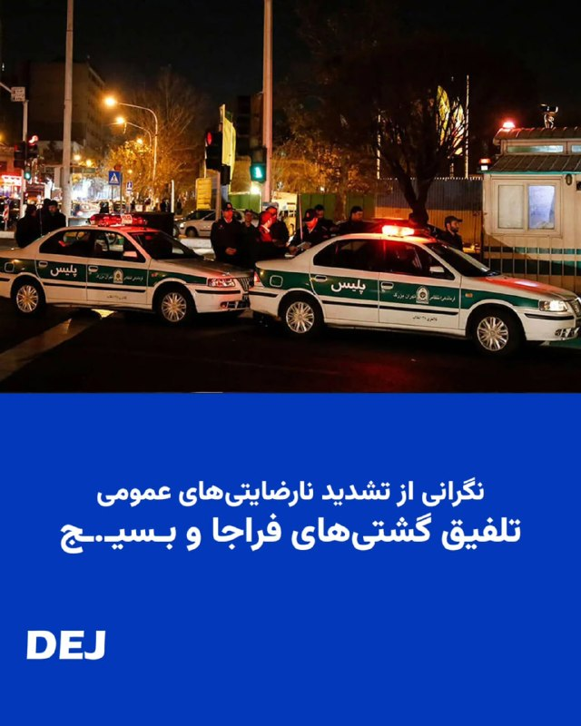
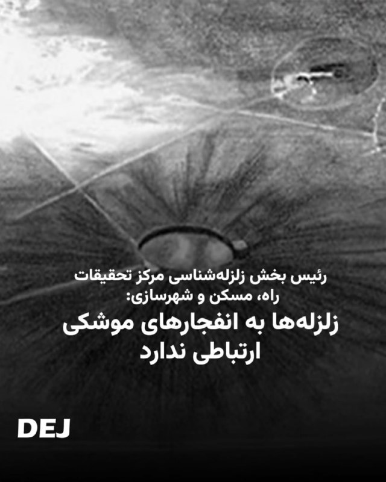
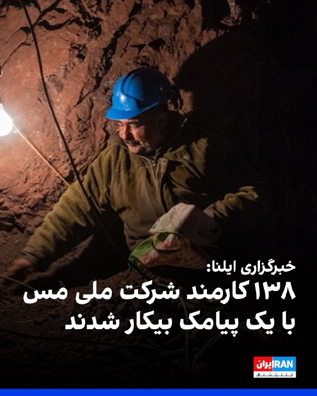
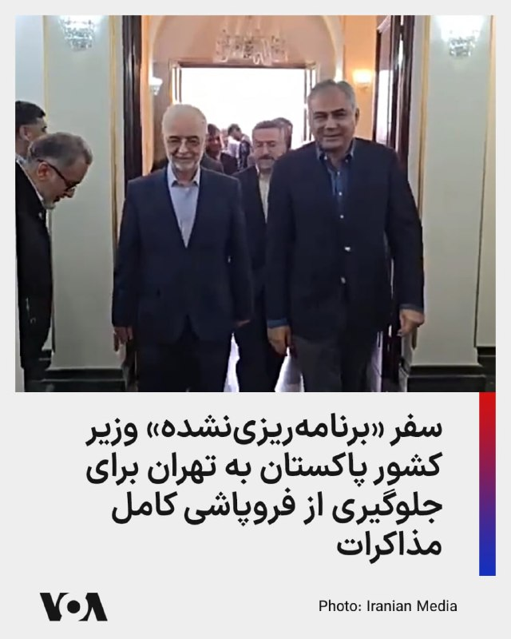
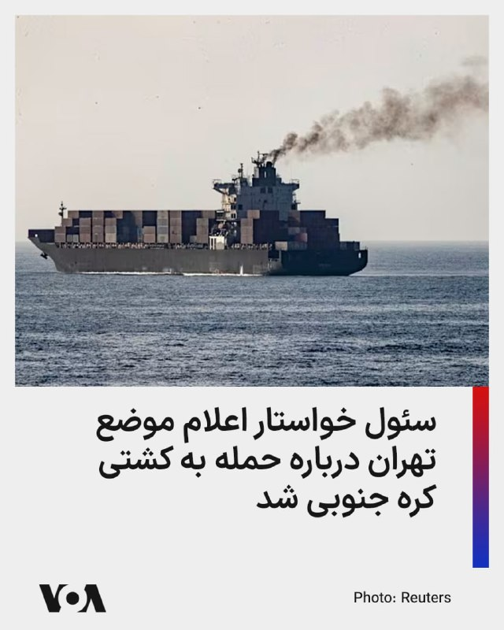
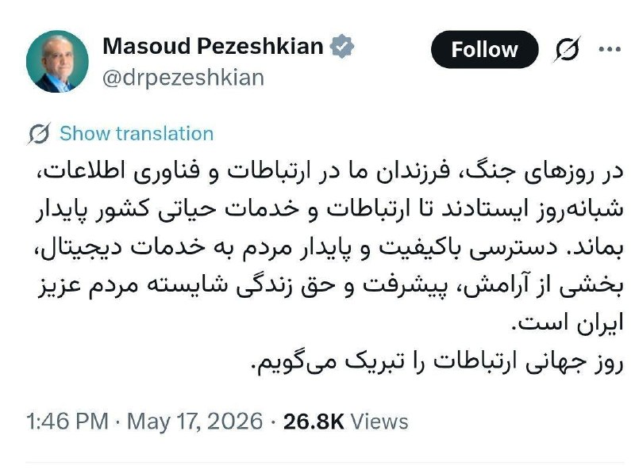

# خواننده تلگرام

<!-- MSG START -->

---
📅 بروزرسانی: 1405/02/27 15:34
---

## VahidOOnLine — post 240616

ویدیوهای رسیده به ایران‌اینترنشنال نشان می‌دهد مراسم تولد ایلیا قدسی، جاویدنام ۱۷ ساله کشته‌شده در شامگاه ۱۸ دی، بر سر مزارش برگزار شده است. مادر این نوجوان جان‌باخته با سخنرانی در این مراسم خطاب به پسرش گفت: «تو قدم بزرگی برای ما برداشتی. راهت را ادامه خواهیم داد.»
‌🏁 🇬🇧 IranintlTV

🤖 @VahidOOnLine

## VahidOOnLine — post 240615

  <a href="telegram/content/VahidOOnLine_240615_1779019495.mp4">🎬 Download video</a>

تجمع ایرانیان لیسبون پرتغال مقابل کاخ ریاست‌جمهوری، یکشنبه ۲۷ اردیبهشت
‌🏁 🇬🇧 ManotoTV

🤖 @VahidOOnLine

## VahidOOnLine — post 240614

  

آژانس بین‌المللی انرژی اتمی اعلام کرد امارات متحده عربی به این نهاد اطلاع داده سطح پرتو در نیروگاه هسته‌ای براکه پس از حمله پهپادی به نزدیکی آن، در سطح عادی باقی مانده و هیچ مصدومی گزارش نشده است. دفتر رسانه‌ای ابوظبی روز یکشنبه از حمله پهپادی به این نیروگاه خبر داده بود.
‌🏁 🇬🇧 IranintlTV

🤖 @VahidOOnLine

## VahidOOnLine — post 240613

  

سازمان حقوق بشر ایران اعلام کرد دستگاه قضایی جمهوری اسلامی «فعالانه» از وکلای تسخیری برای تسهیل و تسریع سیستماتیک اعدام معترضان بازداشت‌شده بهره می‌گیرد. این سازمان افزود این وکلا با خودداری از برقراری ارتباط با خانواده متهمان آنان را از روند دادرسی بی‌اطلاع نگه می‌دارند.
به نوشته این سازمان، مستندات نشان می‌دهد وکلای تسخیری بلافاصله پس از صدور حکم، با ثبت درخواست تجدیدنظر، موکلان خود را از مهلت قانونی محروم می‌کنند و با ایجاد موانع عامدانه در مسیر دسترسی به وکلای مستقل، زمینه اجرای سریع احکام اعدام را فراهم می‌سازند.
این سازمان نوشت بازداشت‌شدگان اعتراضات بدون دفاع موثر می‌مانند؛ وکلای تسخیری اعترافات اجباری و ادعاهای شکنجه را به چالش نمی‌کشند و مدارک تبرئه‌کننده ارائه نمی‌دهند. در نتیجه دادگاه‌ها بر اساس شواهد بدون اعتراض حکم اعدام صادر و دیوان عالی کشور نیز احکام را بدون بررسی حقوقی واقعی تایید می‌کند.
این سازمان هشدار داد این اقدامات نقض سیستماتیک دادرسی عادلانه است و اعدام‌ها را براساس حقوق بین‌الملل در زمره اعدام‌های خودسرانه قرار می‌دهد.
‌🏁 🇬🇧 IranintlTV

🤖 @VahidOOnLine

## VahidOOnLine — post 240612

🗣روایت شما از زندگی در آتش‌بس- یکشنبه ۲۷ اردیبهشت‌ماه

🔹باورم نمیشه در قرن ۲۱، یک کشور نزدیک به ۳ ماهه بدون اینترنت مونده و برای هیچ سازمان بین‌المللی هم اهمیت نداره.

🔹دانش‌آموز هستم. نمی‌دانم باید امتحان‌ها رو چیکار کنم. یک اینترنت ملی داریم که اون هم کار نمی‌کند تا بتونیم درس بخونیم. یک دل‌خوشی داشتم، اون هم اینترنت بود که از ما گرفتن.

🔹دانشگاه آزاد بندرعباس برای خدماتی که ارائه نشده و کلاس‌هایی که نصفه‌ و نیمه تشکیل شده، شهریه کامل می‌گیرد.

🔹شورای‌عالی انقلاب فرهنگی هر روز یه حرفی می‌زنه. الان ما کلاس یازدهمی‌ها و کنکوری‌ها بلاتکلیف موندیم که امتحان نهایی چی می‌شه. جمهوری اسلامی علاوه بر اقتصاد و امنیت، فضای آموزش رو هم به نابودی کشونده.

🔹من یازدهم ریاضی‌ام، میگن از حواشی آموزشی فاصله بگیرید و تمرکزتون رو بگذارید روی درس. چطوری آخه وقتی کل کشور شده حاشیه؟ ما مثل بچه‌ شما در مدرسه‌ای با شهریه ۵۰۰ میلیون تومانی درس نمی‌خونیم.
‌🏁 🇬🇧 IranintlTV

🤖 @VahidOOnLine

## VahidOOnLine — post 240611

  

بنیامین نتانیاهو، نخست‌وزیر اسرائیل، گفت: «امروز با دوستمان، رییس‌جمهور ترامپ گفت‌وگو خواهم کرد. مطمئنا برداشت‌های او از سفرش به چین و شاید مسائل دیگر را خواهم شنید. قطعا احتمالات زیادی وجود دارد و ما برای هر سناریویی آماده‌ایم.» نتانیاهو افزود: «چشمان ما به ایران دوخته شده است.»
‌🏁 🇬🇧 IranintlTV

🤖 @VahidOOnLine

## VahidOOnLine — post 240610

  <a href="telegram/content/VahidOOnLine_240610_1779019497.mp4">🎬 Download video</a>

مقام‌های ابوظبی اعلام کردند در پی حمله پهپادی، یک ژنراتور برق خارج از محدوده داخلی نیروگاه هسته‌ای براکه در منطقه الظفره دچار آتش‌سوزی شد.

بر اساس این اعلام، حادثه آسیب جانی نداشت و هیچ اثری بر سطح ایمنی پرتوی نیروگاه برجای نگذاشت. مقام‌ها گفته‌اند همه اقدامات احتیاطی لازم انجام شده و جزئیات بیشتر در صورت دریافت اطلاعات تازه اعلام خواهد شد.

سازمان فدرال مقررات هسته‌ای امارات نیز تاکید کرد آتش‌سوزی بر ایمنی نیروگاه یا آمادگی سامانه‌های حیاتی آن اثری نداشته و همه واحدهای نیروگاه به‌طور عادی در حال فعالیت‌اند.
‌🏁 🇬🇧 ManotoTV

🤖 @VahidOOnLine

## VahidOOnLine — post 240609

  <a href="telegram/content/VahidOOnLine_240609_1779019498.mp4">🎬 Download video</a>

روزنامه بریتانیایی تلگراف گفته است برخی افراد نزدیک به دونالد ترامپ، رئیس‌جمهوری آمریکا، پیشنهاد کرده‌اند امارات متحده عربی جزیره لاوان در خلیج فارس را تصرف کند.

بر اساس این ادعا، یک مقام ارشد امنیتی پیشین در دولت ترامپ به تلگراف گفت هدف از چنین پیشنهادی، افزایش نقش امارات در رویارویی با ایران بدون اعزام نیروهای زمینی آمریکا است.

این گزارش پس از آن منتشر می‌شود که وال‌استریت ژورنال از حملات پنهانی امارات به اهدافی در ایران خبر داد. به گزارش رویترز به نقل از این روزنامه، یکی از این حملات در اوایل آوریل پالایشگاهی در جزیره لاوان را هدف قرار داده بود، ادعایی که امارات آن را علنا تایید نکرده است.
‌🏁 🇬🇧 ManotoTV

🤖 @VahidOOnLine

## VahidOOnLine — post 240608

  

♦️امارات متحده عربی می‌گوید ژنراتور نیروگاه هسته‌ای براکه هدف یک پهپاد قرار گرفته است اما هیچ آسیبی ندیده و سطح تشعشعات رادیواکتیو تغییری نکرده است.

دفتر رسانه‌ای ابوظبی روز یکشنبه اعلام کرد که مقامات اماراتی به آتش‌سوزی ناشی از حمله پهپادی به یک ژنراتور برق در خارج از محیط داخلی نیروگاه هسته‌ای براکه در منطقه الظفره واکنش نشان دادند.

بنابر اعلام مقام‌های اماراتی هیچ آسیبی گزارش نشده، سطح ایمنی رادیولوژیکی تحت تأثیر قرار نگرفته و سازمان فدرال تنظیم مقررات هسته‌ای تأیید می‌کند که سیستم‌های ضروری نیروگاه به طور عادی کار می‌کنند.

جزئیاتی در خصوص اینکه این پهپاد از کجا به سمت نیروگاه هسته‌ای امارات پرتاب شده منتشر نشده است.
‌🇸🇦 Indypersian

🤖 @VahidOOnLine

## VahidOOnLine — post 240607

  

خبرگزاری ایلنا گزارش داد که تعداد ۱۳۸ نفر از کارمندان و کارگران شرکت ملی مس از زیر مجموعه‌های هلدینگ ایمیدرو، سازمان توسعه و نوسازی معادن و صنایع معدنی ایران، تعدیل شده‌اند.

یکی از کارمندان اخراجی این شرکت به ایلنا گفت: «در ۲۴ اسفندماه ۱۴۰۴، تنها ۵ روز مانده به پایان سال، ۱۳۸ پرسنل متخصص با یک نامه و پیامک تحت عنوان «عدم تمدید قرارداد به دلیل نداشتن پروژه جدید» از کار بیکار شدند.»

کارمند دیگری گفته است: «تعدیل‌ها بدون استعلام از مسئولان فنی برای نگهداری یا عدم نگهداری نیروها صادر شده است. در واقع تقریبا تمام نیروهای با سابقه مجموعه اخراج شدند.»
‌🏁 🇬🇧 IranintlTV

🤖 @VahidOOnLine

## mwarmonitor — post 9199

⭕️ طبق گزارش نیویورک تایمز، اسرائیل حداقل دو پایگاه نظامی مخفی در صحرای غربی عراق را برای مدت بیش از یک سال اداره کرده است. گفته می‌شود برنامه‌ریزی این پایگاه‌ها از اواخر ۲۰۲۴ برای پشتیبانی از عملیات لجستیکی علیه ایران انجام شده است.

🔸واشنگتن از دست‌کم یکی از این پایگاه‌های اسرائیلی از ژوئن ۲۰۲۵ مطلع بوده اما این اطلاعات را از بغداد مخفی کرده است. علاوه بر این، آمریکا ظاهراً دولت عراق را مجبور کرده است سامانه‌های راداری خود را تحت عنوان «حفاظت از هواپیماهای آمریکایی» خاموش کند؛ اقدامی که عملاً دید راداری بغداد را کور کرده و مانع شناسایی حضور اسرائیل در خاک خود شده است.

🔸با وجود این خاموشی رادارها، فرماندهی نظامی عراق در منطقه همچنان به وجود حضور اسرائیل مشکوک بوده است. گفته می‌شود فرماندهان عملیات‌های مراقبت دوربرد از این سایت‌ها انجام می‌دادند، اما زمانی که از طرف‌های آمریکایی درخواست اطلاعات کردند، با سکوت مواجه شدند.

@mwarmonitor

## mwarmonitor — post 9197

🔴 مشاوران ترامپ بیم آن دارند که چین در ۵ سال آینده تایوان را هدف قرار دهد

📝نویسندگان: جیم وندهای، مایک الن AXIOS

🔰برخی از مشاوران نزدیک پرزیدنت ترامپ نگرانند که بزرگ‌ترین دستاورد ملموس نشست سران با چین، افزایش خطر حمله شی جین‌پینگ، رئیس‌جمهور چین، به تایوان در پنج سال آینده باشد؛ اقدامی که می‌تواند دسترسی شرکت‌های آمریکایی را به تراشه‌های مورد نیاز برای تأمین انرژی هوش مصنوعی (AI) قطع کند.

🔸آنچه آن‌ها می‌گویند:
ترامپ شیفته تشریفات باشکوه و دسترسی ویژه‌ای شد که شی با هوشمندی در طول سفر پکن برای او تدارک دیده بود. اما کلمات با این صمیمیت ظاهری همخوانی نداشتند.
یکی از مشاوران ترامپ به ما گفت که شی «تلاش می‌کند چین را به جایگاه جدیدی برساند که در آن بگوید: "ما یک قدرت در حال ظهور نیستیم، بلکه همتای شما هستیم؛ و تایوان متعلق به من است."»

🔸این مشاور افزود:
«این سفر نشان‌دهنده احتمال بسیار بالاتری است که موضوع تایوان ظرف پنج سال آینده روی میز قرار گیرد. هیچ راهی وجود ندارد که ما از نظر اقتصادی برای این موضوع آماده باشیم؛ زنجیره تأمین تراشه‌ها به این زودی‌ها حتی نزدیک به خودکفایی هم نخواهد شد. برای مدیران عامل، و در واقع کل اقتصاد، هیچ مسئله‌ای حیاتی‌تر از زنجیره تأمین تراشه‌ها وجود ندارد.»

🔸تصویر کلی:
ترامپ از سوی چندین مدیرعامل به خاطر فشارهای شدید بر ایران و ونزوئلا و همچنین باز کردن بازارها مورد تحسین قرار گرفت. برخی از مدیران عامل با این امید به کشور بازگشتند که شرکت‌هایشان مجوز فعالیت در چین را دریافت خواهند کرد و این موفقیت را مدیون رئیس‌جمهور می‌دانستند.

@mwarmonitor

## mwarmonitor — post 9196

🔴 بلومبرگ: صبح امروز یکشنبه هیچ عبور و ترددی در تنگه هرمز ثبت نشده است.

@mwarmonitor

## mwarmonitor — post 9195

🇮🇱نتانیاهو گفت اسرائیل تلاش‌های خود را برای مقابله با تهدیدهای در حال تحول پهپادی، از جمله پهپادهای هدایت‌شونده با فیبر نوری، افزایش داده و برای توسعه راه‌حل‌های جدید از شرکت‌های دفاعی و همچنین متخصصان فناوری غیرنظامی کمک گرفته است.

🇮🇱او گفت: «به آن‌ها گفتم هیچ محدودیت بودجه‌ای وجود ندارد. هرچقدر هم هزینه داشته باشد، مهم نیست.» وی افزود این تیم مأمور شده است نه‌تنها با تهدیدهای فعلی پهپادی مقابله کند، بلکه برای تهدیدهای آینده نیز آماده شود.

@mwarmonitor

## pm_afshaa — post 90898

  <a href="telegram/content/pm_afshaa_90898_1779019499.jpg">🎬 Download video</a>

🔴نیویورک تایمز به نقل از مقامات امنیتی عراق: آمریکا به عراق دستور داده بود که توی دو تا عملیات در ایران، سیستم‌های راداری خودش رو خاموش کنه.

💧 Rainbet.com the #1 Non-KYC Crypto Casino & Sportsbook @rainbetcom

😁 @Pm_Afshaa

## pm_afshaa — post 90897

  <a href="telegram/content/pm_afshaa_90897_1779019500.jpg">🎬 Download video</a>

🔴نیویورک‌تایمز: اسرائیل حداقل دو پایگاه مخفی در صحرای عراق رو به‌طور متناوب و برای بیش از یک سال اداره می‌کرده.

💧 Rainbet.com the #1 Non-KYC Crypto Casino & Sportsbook @rainbetcom

😁 @Pm_Afshaa

## pm_afshaa — post 90896

  

خیلی باید کونده پرو باشی که نزدیک 3 ماه قطعی کامل اینترنت، با سیم کارت سفید، تو اپ فیلتر شده این توییت رو بزنی :

💧 Rainbet.com the #1 Non-KYC Crypto Casino & Sportsbook @rainbetcom

😁 @Pm_Afshaa

## pm_afshaa — post 90895

🔴نیویورک‌تایمز: اسرائیل حداقل دو پایگاه مخفی در صحرای عراق را به‌طور متناوب و برای بیش از یک سال اداره می‌کرده

💧 Rainbet.com the #1 Non-KYC Crypto Casino & Sportsbook @rainbetcom

😁 @Pm_Afshaa

## pm_afshaa — post 90894

  <a href="telegram/content/pm_afshaa_90894_1779019501.jpg">🎬 Download video</a>

🔴نتانیاهو: امروز با رئیس‌جمهور ترامپ حرف میزنم؛ چشممون روی ایران بازه و برای هر موقعیتی آماده‌ایم.

💧 Rainbet.com the #1 Non-KYC Crypto Casino & Sportsbook @rainbetcom

😁 @Pm_Afshaa

## DEJradio — post 4675

⭕️🎥 حکومت نگران از تشدید نارضایتی‌های عمومی، آموزش نظامی به کودکان در مساجد را سازماندهی‌شده پیش می‌برد.
شستشوی مغزی و تبلیغات عمدتا با نوای مذهبی و نوحه بخشی از مقدمات این آموزش‌هاست. قبلا آموزش‌ها شامل کلاشنیکف بود حالا آرپی‌جی هم به آن اضافه شده است.

#کودک_سرباز #سپر_انسانی
@DEJradio

## DEJradio — post 4674

  

🔸
🔺 براساس گزارش‌های دریافتی گشتی‌های نیروی انتظامی و بـ.ـسیج و برای مأموریت‌های شهری تلفیق شده‌اند. همچنین ماموران انتظامی و نیروهای بسیج در برقراری ایست‌های بازرسی در شهرهای مختلف و گشت‌های محله‌محور همکاری خود را افزایش داده‌اند.
یک کارشناس امنیتی به دژ می‌گوید چنین اقدامی می‌تواند ناشی از دو دلیل عمده باشد: ۱) جبران کمبود نیرو و ۲)هماهنگی در شرایط اضطراری بعد از جنگ ۴۰ روزه بحق ادغام نیروهای مسلح مطرح شد که موضوع «تلفیق بخشی از ماموریت‌ها» ارتباطی به آن ندارد.
از سوی دیگر سازمان بـ.ـسیج در ارتش، نیروی انتظامی، سـ.ـپاه و حتی سایر ارگان‌ها «سهمیه استخدام» دارد. از این رو با توجه به تلفات سنگین نیروی انتظامی در جنگ ۴۰ روزه و احتمال شکل‌گیری مجدد اعتراضات از یک سو حکومت ممکن است سهمیه استخدام بـ.ـسیج در فراجا را افزایش دهد و از سوی دیگر برای افزایش همکاری و هماهنگی «قرارگاه‌های امنیتی» تقویت شود.
طی سال‌های اخیر بارها فرماندهان ارشد نیروی انتظامی و پاسداران در مورد تشکیل قرارگاه‌های مشترک امنیتی و روانی و تقویت گشت‌های محلی اظهار نظر کردند و در مواقعی مدتی کوتاه آن را به اجرا گذاشتند.

#سرکوبگران
@DEJradio

## DEJradio — post 4673

  <a href="telegram/content/DEJradio_4673_1779019502.mp4">🎬 Download video</a>

⭕️🎥 شعار تجمعات شبانه حکومت این است که با "هر سلیقه‌ای" برای ایران آمده‌اند؛ اما این کارزار پر از تضاد و تناقض است. آنچه ۴۷ سال با شدیدترین مجازات روبرو می‌شد حالا که پای مصلحت و بقای نظام در میان است یگر ایراد ندارد، از جمله بدمستی ولایی‌های عرق‌خور در خیابان.

#الکل #جمهوری_اسلامی
@DEJradio

## DEJradio — post 4670

😎 
⭕️ یک منبع اختصاصی به دژ می‌گوید همزمان با محاصره دریایی بنادر ایران، شرکت لوبک لاین «Lubeck Line» تحت مدیریت حسن (ابوالفضل) شمخانی، تمامی «ترانشیپمنت پورت»‌ها (بنادر ترانزیتیِ واسط انتقال بار) را از امارات (بندر جبل‌علی) به قطر و عمان (بندر دوحه و بندر سوهار) منتقل کرده است.
سرویس‌های اصلی کانتینری از این بنادر واسط توسط کشتی‌های خط Sea Lead Shipping و‌Volta Container Line که مربوط به حسن شمخانی است به مقاصد چین، هندوستان، مالزی، روسیه، مصر، آفریقا ، آمریکای جنوبی، ویتنام و کره جنوبی و بالعکس کار حمل کانتینری صادرات و واردات را به بنادر ایران انجام می‌دهند .
همین منبع می‌گوید «تمام کرایه حمل و نقل دریافتی از بازرگانان که بصورت دلاری است و با توجه به شرایط جنگی ۱۰ برابر شده، جزو درآمدهای اصلی حکومت است و باعث پایداری رژیم آدمکش اسلامی است.»
برهمین اساس:
۱) عملا قطر و عمان در حال کمک به دور زدن تحریم‌ها هستند و در جهت خنثی کردن اقدامات ایالات متحده و امارات اقدام کرده‌اند، در حال حاضر واردات و صادرات کالاها از طریق بنادر واسط سوهار و حمد در حال انجام است قبلا از طریق جبل‌علی و ابوظبی انجام می‌شد.

۲) قطر و عمان در حال خیانت به امارات وعربستان سعودی و‌ ایالات متحده هستند و بدین طریق پول هنگفتی به جیب می‌زنند.

۳) کشتی‌های تحریمی که به بندرعباس رفته باشند حق پهلوگیری در بنادر را ندارند در اینصورت تحریم‌های ایالات متحده را نقض کرده‌اند و کشورهای مربوطه مشمول پرداخت جریمه هستند.
چون کشتی‌های مادر اجازه پهلوگیری در بنادر ایران را ندارند، صادرات و واردات ایران همیشه از طریق یک پورت واسط توسط کشتی‌هایی که معمولا تحریمی هستند انجام می‌شود. با بسته شدن بنادر امارات بر روی حکومت ایران و بسته شدن هرمز، عمان و قطر بنادرخود را در اختیار حکومت ایران گذاشته‌اند البته در این لیست هندوستان و مالزی هم مدت‌ها است این همکاری را با حکومت ایران دارند.
براساس اطلاعات همین منبع «مدت‌ها پیش حسن شمخانی دو نفر کاپیتان‌های کشتیرانی جمهوری اسلامی، را استخدام کردند که کار تغییر پرچم و خرید سوخت قاچاق برای کشتی‌ها و سفید کردن کشتی‌ها را انجام بدهد اما مطمئنا قطر، عمان، هندوستان و مالزی از تحریمی بودن کشتی‌ها آگاه هستند.»

#اختصاصی #تنگه_هرمز
@DEJradio

## DEJradio — post 4669

  

🔺
⭕️ علی بیت‌‌الهی رئیس بخش زلزله‌شناسی و خطرپذیری مرکز تحقیقات راه، مسکن و شهرسازی درباره صحبت‌هایی که میان مردم شنیده می‌شود مبنی بر اینکه انفجار موشک‌ها منجر به فعال شدن گسل‌ها شده، گفت: «مردم توجه داشته باشند عمق کانونی این زلزله‌ها در حدود ۱۰ تا ۲۰ کیلومتری زمین است در حالیکه قوی‌ترین شدیدترین انفجارات هم نمی‌تواند در عمق تا چند صد متری زمین نفوذ کند درحالیکه ما در وقوع زلزله از عمق ١٠ هزار الی ١٠متر صحبت می‌کنیم آن هم در امتداد یک گسل طویل نه یک نقطه اما انفجارات نقطه‌ای هستند و شکل موج انفجارات با شکل موج زلزله کاملا به طور کاملا روشنی قابل تشخیص است. »
او افزود؛ «اینکه بگوییم این انفجارات موجب تحریک یک گسل می‌شود مانند این است که یک پشه بر روی گوش یک فیل بنشیند و این گمان شود که با نیش پشه، فیل از پا بیفتد بنابراین این موضوع اصلا مبنایی ندارد.»
برخی از مردم براین باورند آزمایش‌های موشکی و اتمی در عمق زمین از عوامل برخی از زمین‌لرزه‌هاست اما متخصصان داخلی که در رسانه‌های رسمی اظهار نظر می‌کنند این باور را رد می‌کنند، با این همه در موارد مشابه متخصصان ژاپنی چند بار طی سال‌های اخیر [از جمله شهریور ۱۳۹۶] گفتند علت زلزله در آن نواحی آزمایش‌های اتمی یا هیدروژنی کره شمالی است.

#زلزله #برنامه_اتمی
@DEJradio

## DEJradio — post 4668

  

👑
⭕️ شاهزاده رضا پهلوی در نشست «آینده تکنولوژی در ایران» که ۱۶ ماه مه (۲۶ اردیبهشت) برگزارش د گفت که مردم ایران به چیزی جز تغییر کامل نظام رضایت نخواهند داد: «آن‌ها ۴۰ هزار کشته نداده‌اند که در نهایت به توافق اتمی برسند.»
او افزود: «اتکای مخالفان نظام نباید به نیروی خارجی باشد و باید فرض را بر این گذاشت که کمکی دریافت نمی‌شود اما در صورت دریافت حمایت خارجی روند دستیابی به اهداف آسان‌تر خواهد شد.»
شاهزاده رضا پهلوی در نشست «آینده تکنولوژی در ایران» با رد مشروعیت ساختار سیاسی جمهوری اسلامی و چهره‌هایی چون محمدباقر قالیباف گفت مردم ایران این همه کشته و هزینه نداده‌اند که بار دیگر تن به «ماموریت‌های مهره‌های این حکومت» بدهند.
او تاکید کرد: «ما باید به دنیا ثابت کنیم که ملت ایران، شریک بهتری برای جامعه جهانی است تا بقایای این حکومت.»

#شاهزاده_رضا_پهلوی #ایران_را_پس_میگیریم
@DEJradio

## IranIntlTV — post 337617

ویدیوهای رسیده به ایران‌اینترنشنال نشان می‌دهد مراسم تولد ایلیا قدسی، جاویدنام ۱۷ ساله کشته‌شده در شامگاه ۱۸ دی، بر سر مزارش برگزار شده است. مادر این نوجوان جان‌باخته با سخنرانی در این مراسم خطاب به پسرش گفت: «تو قدم بزرگی برای ما برداشتی. راهت را ادامه خواهیم داد.»

## IranIntlTV — post 337616

  

🔻تیم فوتبال زنان «نائه‌گو‌هیَنگ» کره شمالی روز یکشنبه وارد کره جنوبی شد؛ برای نخستین بار در هفت سال و نیم گذشته ورزشکارانی از کره شمالی پا به خاک کره جنوبی می‌گذارند. این تیم روز چهارشنبه در مرحله نیمه‌نهایی لیگ قهرمانان زنان آسیا، با «سوون اف‌سی وومن» از کره جنوبی بازی می‌کند.

🔹سفر یک تیم فوتبال زنان از کره شمالی به کره جنوبی، اتفاقی نادر در شرایطی است که تنش‌های سیاسی میان دو کشور به سطحی رسیده که دولت‌هایشان عملاً هیچ ارتباط مستقیمی با یکدیگر ندارند.

🔹برخی رویدادهای ورزشی در گذشته میان دو کره نقش کانال دیپلماتیک را ایفا کرده‌اند؛ هرچند این بار انتظار نمی‌رود این سفر به کاهش تنش‌ها منجر شود.

🔹دیدار ورزشکاران دو کره، که از نظر فنی همچنان در وضعیت جنگی قرار دارند، معمولاً فراتر از یک مسابقه ورزشی تلقی می‌شود.

🔹تمام شهروندان کره شمالی که به خارج از کشور سفر می‌کنند، تحت همراهی مأموران پلیس مخفی قرار دارند؛ مأمورانی که هرگونه نشانه بی‌وفایی را زیر نظر می‌گیرند.

🔹درباره این اتفاق کم‌سابقه در وبسایت ایران اینترنشنال بیشتر بخوانید.

@iranintltvsport

## IranIntlTV — post 337615

  <a href="telegram/content/IranIntlTV_337615_1779019504.mp4">🎬 Download video</a>

دفتر رسانه‌ای ابوظبی در امارات از حمله پهپادی به یک ژنراتور برق در محدوده نیروگاه هسته‌ای براکه در منطقه الظفر خبر داد. بر اساس این گزارش، این حمله باعث آتش‌سوزی در بخشی از نیروگاه شده و ژنراتور برق هدف قرار گرفته است.
جزییات بیشتر با علی شیرازی، عضو تحریریه ایران‌اینترنشنال
@iranintltv

## IranIntlTV — post 337614

  

آژانس بین‌المللی انرژی اتمی اعلام کرد امارات متحده عربی به این نهاد اطلاع داده سطح پرتو در نیروگاه هسته‌ای براکه پس از حمله پهپادی به نزدیکی آن، در سطح عادی باقی مانده و هیچ مصدومی گزارش نشده است. دفتر رسانه‌ای ابوظبی روز یکشنبه از حمله پهپادی به این نیروگاه خبر داده بود.
https://iranintl.com/202605177167

## IranIntlTV — post 337613

  <a href="telegram/content/IranIntlTV_337613_1779019506.mp4">🎬 Download video</a>

گروهی از ایرانیان و فعالان مدنی در مرکز شهر فرانکفورت در اعتراض به سرکوب، اعدام زندانیان سیاسی و محدودیت‌های اینترنتی در ایران تجمع کردند.

مهدی تهرانی گزارش می‌دهد
@iranintltv

## IranIntlTV — post 337612

  

سازمان حقوق بشر ایران اعلام کرد دستگاه قضایی جمهوری اسلامی «فعالانه» از وکلای تسخیری برای تسهیل و تسریع سیستماتیک اعدام معترضان بازداشت‌شده بهره می‌گیرد. این سازمان افزود این وکلا با خودداری از برقراری ارتباط با خانواده متهمان آنان را از روند دادرسی بی‌اطلاع نگه می‌دارند.
به نوشته این سازمان، مستندات نشان می‌دهد وکلای تسخیری بلافاصله پس از صدور حکم، با ثبت درخواست تجدیدنظر، موکلان خود را از مهلت قانونی محروم می‌کنند و با ایجاد موانع عامدانه در مسیر دسترسی به وکلای مستقل، زمینه اجرای سریع احکام اعدام را فراهم می‌سازند.
این سازمان نوشت بازداشت‌شدگان اعتراضات بدون دفاع موثر می‌مانند؛ وکلای تسخیری اعترافات اجباری و ادعاهای شکنجه را به چالش نمی‌کشند و مدارک تبرئه‌کننده ارائه نمی‌دهند. در نتیجه دادگاه‌ها بر اساس شواهد بدون اعتراض حکم اعدام صادر و دیوان عالی کشور نیز احکام را بدون بررسی حقوقی واقعی تایید می‌کند.
این سازمان هشدار داد این اقدامات نقض سیستماتیک دادرسی عادلانه است و اعدام‌ها را براساس حقوق بین‌الملل در زمره اعدام‌های خودسرانه قرار می‌دهد.
https://iranintl.com/202605171885

## IranIntlTV — post 337611

🗣روایت شما از زندگی در آتش‌بس- یکشنبه ۲۷ اردیبهشت‌ماه

🔹باورم نمیشه در قرن ۲۱، یک کشور نزدیک به ۳ ماهه بدون اینترنت مونده و برای هیچ سازمان بین‌المللی هم اهمیت نداره.

🔹دانش‌آموز هستم. نمی‌دانم باید امتحان‌ها رو چیکار کنم. یک اینترنت ملی داریم که اون هم کار نمی‌کند تا بتونیم درس بخونیم. یک دل‌خوشی داشتم، اون هم اینترنت بود که از ما گرفتن.

🔹دانشگاه آزاد بندرعباس برای خدماتی که ارائه نشده و کلاس‌هایی که نصفه‌ و نیمه تشکیل شده، شهریه کامل می‌گیرد.

🔹شورای‌عالی انقلاب فرهنگی هر روز یه حرفی می‌زنه. الان ما کلاس یازدهمی‌ها و کنکوری‌ها بلاتکلیف موندیم که امتحان نهایی چی می‌شه. جمهوری اسلامی علاوه بر اقتصاد و امنیت، فضای آموزش رو هم به نابودی کشونده.

🔹من یازدهم ریاضی‌ام، میگن از حواشی آموزشی فاصله بگیرید و تمرکزتون رو بگذارید روی درس. چطوری آخه وقتی کل کشور شده حاشیه؟ ما مثل بچه‌ شما در مدرسه‌ای با شهریه ۵۰۰ میلیون تومانی درس نمی‌خونیم.

## IranIntlTV — post 337610

  

بنیامین نتانیاهو، نخست‌وزیر اسرائیل، گفت: «امروز با دوستمان، رییس‌جمهور ترامپ گفت‌وگو خواهم کرد. مطمئنا برداشت‌های او از سفرش به چین و شاید مسائل دیگر را خواهم شنید. قطعا احتمالات زیادی وجود دارد و ما برای هر سناریویی آماده‌ایم.» نتانیاهو افزود: «چشمان ما به ایران دوخته شده است.»
https://iranintl.com/202605173431

## IranIntlTV — post 337609

  <a href="telegram/content/IranIntlTV_337609_1779019508.mp4">🎬 Download video</a>

مروری بر روزنامه‌های ایران، شنبه ۲۶ اردیبهشت، با مجتبی هاشمی، روزنامه‌نگار
@iranintltv

## IranIntlTV — post 337608

  <a href="telegram/content/IranIntlTV_337608_1779019510.mp4">🎬 Download video</a>

نشست «آینده تکنولوژی در ایران» با هدف بررسی فرصت‌های بخش فناوری در دوران پس از جمهوری اسلامی و نقش متخصصان ایرانی خارج از کشور، در سان‌فرانسیسکو برگزار شد.
شاهزاده رضا پهلوی در این نشست گفت ایران می‌تواند به الگویی مانند کره جنوبی تبدیل شود، اما حکمرانی جمهوری اسلامی کشور را به سمت وضعیتی شبیه کره شمالی برده است.
گفت‌وگو با آرش آزرمی، دبیر بخش اقتصادی ایران‌اینترنشنال
@iranintltv

## IranIntlTV — post 337607

🔻سومین مربی در یک سال؛ ژابی آلونسو سرمربی چلسی شد

باشگاه چلسی، ژابی آلونسو، سرمربی پیشین رئال مادرید و بایر لورکوزن را با قراردادی چهار ساله، به‌عنوان سرمربی جدید خود منصوب کرد. این مربی ۴۴ ساله اسپانیایی پس از جدایی توافقی از رئال مادرید در زمستان گذشته، و کمتر از هشت ماه پس از آغاز قرارداد سه‌ساله‌اش در اسپانیا، در دسترس بود.

او قراردادی چهار ساله از تابستان امسال با چلسی دارد که به نوشته بی‌بی‌سی، برخلاف قراردادهای شش‌ساله‌ای که چلسی در سال‌های اخیر ارائه می‌کرد، نسبتاً عادی توصیف شده است.

چلسی به تغییرات عمده‌ای نیاز دارد و بسیاری می‌گویند آلونسو می‌تواند فردی باشد که روند این تیم را تغییر دهد.

او پیش از دوره‌ای ناکامی در رئال مادرید، سه سال هدایت بایر لورکوزن را برعهده داشت و این تیم آلمانی را دو سال پیش به نخستین قهرمانی بوندس‌لیگا در تاریخ باشگاه رساند و همچنین جام حذفی آلمان را نیز فتح کرد.

تأیید حضور آلونسو یک روز پس از شکست چلسی مقابل منچسترسیتی در فینال جام حذفی انگلیس منتشر شد.

آبی‌های لندن امیدوارند او پس از فصلی که در آن دو سرمربی دائمی، انزو مارسکا و لیام روزنیور، روی نیمکت تیم نشستند، ثبات را به باشگاه بازگرداند. در حال حاضر کالوم مک‌فارلین دومین دوره حضورش به‌عنوان سرمربی موقت را سپری می‌کند و این نقش را در دو بازی پایانی لیگ برتر نیز ادامه خواهد داد.

آلونسو گفت: «چلسی یکی از بزرگ‌ترین باشگاه‌های فوتبال جهان است و این‌که سرمربی این باشگاه بزرگ می‌شوم، باعث افتخار فراوان من است.

او گفت: «از گفت‌وگوهایی که با مالکان و مدیران ورزشی باشگاه داشتم، مشخص است که بلندپروازی مشترکی داریم. ما می‌خواهیم تیمی بسازیم که بتواند به‌طور مداوم در بالاترین سطح رقابت کند و برای کسب جام بجنگد.»

سرمربی جدید چلسی گفت: «استعداد زیادی در این تیم وجود دارد و این باشگاه ظرفیت بسیار بالایی دارد و هدایت آن افتخار بزرگی برای من خواهد بود. حالا تمرکز روی کار سخت، ایجاد فرهنگ درست و کسب جام است.»

آلونسو پنج سال در لیگ برتر انگلیس برای لیورپول بازی کرد و در سال ۲۰۰۵ همراه این تیم قهرمان لیگ قهرمانان اروپا شد. او همچنین سابقه بازی در رئال سوسیداد، رئال مادرید و بایرن مونیخ را دارد.

او ۱۱۴ بازی ملی برای اسپانیا انجام داد و همراه این تیم قهرمان جام جهانی ۲۰۱۰ و دو دوره جام ملت‌های اروپا شد.

در هفته‌های اخیر نام آلونسو به بازگشت احتمالی به لیورپول، جایی که پنج فصل در آن بازی کرده بود، نیز مطرح شده بود؛ آن هم در شرایطی که فشارها بر آرنه اشلوت پس از فصلی ناامیدکننده افزایش یافته بود.

چلسی در فصل آینده احتمالا در هیچ رقابت اروپایی حضور نخواهد داشت؛ این تیم فعلا در رده نهم جدول لیگ برتر فوتبال انگلستان قرار دارد و برای رسیدن به لیگ کنفرانس اروپا باید حداقل هشتم شود؛ آن هم پس از آن‌که فرصت صعود به لیگ اروپا از طریق قهرمانی در جام حذفی را از دست داد.
🔗وب‌سایت ایران‌اینترنشنال
@iranintltv

## IranIntlTV — post 337606

  <a href="telegram/content/IranIntlTV_337606_1779019511.mp4">🎬 Download video</a>

یک شهروند با ارسال پیام به ایران‌اینترنشنال می‌گوید: «در حال ساخت خانه هستم و هر لحظه قیمت‌ها بیشتر می‌شود. کل هزینه ساختن تا قبل از عید یک میلیارد و نیم بود اما الان کابینتی با جنس معمولی شده یک میلیارد تومان.»

## IranIntlTV — post 337605

  

خبرگزاری ایلنا گزارش داد که تعداد ۱۳۸ نفر از کارمندان و کارگران شرکت ملی مس از زیر مجموعه‌های هلدینگ ایمیدرو، سازمان توسعه و نوسازی معادن و صنایع معدنی ایران، تعدیل شده‌اند.

یکی از کارمندان اخراجی این شرکت به ایلنا گفت: «در ۲۴ اسفندماه ۱۴۰۴، تنها ۵ روز مانده به پایان سال، ۱۳۸ پرسنل متخصص با یک نامه و پیامک تحت عنوان «عدم تمدید قرارداد به دلیل نداشتن پروژه جدید» از کار بیکار شدند.»

کارمند دیگری گفته است: «تعدیل‌ها بدون استعلام از مسئولان فنی برای نگهداری یا عدم نگهداری نیروها صادر شده است. در واقع تقریبا تمام نیروهای با سابقه مجموعه اخراج شدند.»
https://iranintl.com/202605177809

## Shin_Persian — post 6046

Shin ✓ @hey_itsmyturn
Sun, 17 May 2026 11:57:18 UTC

Jet activity over Western Tehran,
Presumably IRIAF ones.
#Iran

فارسی

فعالیت جت‌ها بر فراز غرب تهران،
احتمالاً متعلق به نهاجا (نیروی هوایی ارتش جمهوری اسلامی ایران).
#Iran

𝕏 · @shin_persian

## ManotoTV — post 105554

  <a href="telegram/content/ManotoTV_105554_1779019513.mp4">🎬 Download video</a>

تجمع ایرانیان لیسبون پرتغال مقابل کاخ ریاست‌جمهوری، یکشنبه ۲۷ اردیبهشت

## ManotoTV — post 105553

  <a href="telegram/content/ManotoTV_105553_1779019514.mp4">🎬 Download video</a>

مقام‌های ابوظبی اعلام کردند در پی حمله پهپادی، یک ژنراتور برق خارج از محدوده داخلی نیروگاه هسته‌ای براکه در منطقه الظفره دچار آتش‌سوزی شد.

بر اساس این اعلام، حادثه آسیب جانی نداشت و هیچ اثری بر سطح ایمنی پرتوی نیروگاه برجای نگذاشت. مقام‌ها گفته‌اند همه اقدامات احتیاطی لازم انجام شده و جزئیات بیشتر در صورت دریافت اطلاعات تازه اعلام خواهد شد.

سازمان فدرال مقررات هسته‌ای امارات نیز تاکید کرد آتش‌سوزی بر ایمنی نیروگاه یا آمادگی سامانه‌های حیاتی آن اثری نداشته و همه واحدهای نیروگاه به‌طور عادی در حال فعالیت‌اند.

## ManotoTV — post 105552

  <a href="telegram/content/ManotoTV_105552_1779019514.mp4">🎬 Download video</a>

روزنامه بریتانیایی تلگراف گفته است برخی افراد نزدیک به دونالد ترامپ، رئیس‌جمهوری آمریکا، پیشنهاد کرده‌اند امارات متحده عربی جزیره لاوان در خلیج فارس را تصرف کند.

بر اساس این ادعا، یک مقام ارشد امنیتی پیشین در دولت ترامپ به تلگراف گفت هدف از چنین پیشنهادی، افزایش نقش امارات در رویارویی با ایران بدون اعزام نیروهای زمینی آمریکا است.

این گزارش پس از آن منتشر می‌شود که وال‌استریت ژورنال از حملات پنهانی امارات به اهدافی در ایران خبر داد. به گزارش رویترز به نقل از این روزنامه، یکی از این حملات در اوایل آوریل پالایشگاهی در جزیره لاوان را هدف قرار داده بود، ادعایی که امارات آن را علنا تایید نکرده است.

## FarsiVOA — post 217963

🔺معمای لکه نفتی اطراف جزیره خارک

▪️با گذشت دو هفته از مشاهده لکه نفتی بزرگ در غرب خارک، بزرگترین پایانه نفتی ایران، مقامات جمهوری اسلامی هنوز از شفاف‌سازی پیرامون آن طفره می‌روند.

▪️پیشتر یک نماینده مجلس مدعی «تخلیه آب توازن و روغن» یک کشتی اروپایی در این منطقه شده بود، اما داده‌های کشتی‌رانی نشان می‌دهد هیچ کشتی اروپایی در غرب خارک، محلی که نشت ۴۵ کیلومتر مربعی گزارش شده، وجود نداشته و تخلیه آب توازن نمی‌تواند منجر به چنان آلودگی گسترده‌ای شود.

▪️این لکه نفتی در مسیر خط لوله میدان دریایی ابوذر به خارک است؛ این خط لوله فرسوده که قدمت آن به پنج دهه می‌رسد، مهرماه ۱۴۰۳ و شهریور ۱۴۰۴ نیز دچار شکستگی و نشتی شده بود.

⬇️ بیشتر بخوانید:
https://ir.voanews.com/a/8150876.html

## FarsiVOA — post 217962

  

بنیامین نتانیاهو، نخست‌وزیر اسرائیل، اعلام کرد که قرار است روز یکشنبه گفت‌وگویی تلفنی با دونالد ترامپ رئیس‌جمهور آمریکا انجام دهد. نتانیاهو گفت که انتظار دارد درباره سفر ترامپ به چین و موضوع ایران با رئیس‌جمهور آمریکا گفت‌وگو کند.

همزمان تایمز اسرائیل گزارش داد که نتانیاهو شامگاه یکشنبه در دفتر خود در اورشلیم، جلسه‌ای با دستیاران و وزرای ارشد برای یک مشورت امنیتی تشکیل می‌دهد.

یکی از وزرایی که قرار است در این نشست حاضر باشد، به این رسانه اسرائیلی گفت چنین گفت‌وگوهایی که اغلب «کابینه کوچک امنیتی» نامیده می‌شوند، معمولاً شامل گیدون سعار وزیر خارجه، یسرائیل کاتس وزیر دفاع، بزالل اسموتریچ وزیر دارایی، ایتامار بن‌گویر وزیر امنیت ملی و آریه درعی رئیس حزب شاس می‌شود.
@FarsiVOA

## FarsiVOA — post 217961

  

اقتصاد اسرائیل در سه‌ماهه نخست سال ۲۰۲۶، زیر فشار جنگ با جمهوری اسلامی، با نرخ سالانه ۳.۳ درصد کوچک شد؛ افتی که از پیش‌بینی ۴ درصدی اقتصاددانان در نظرسنجی رویترز کمتر بود.

اداره آمار اسرائیل گزارش داد مصرف خصوصی در این دوره ۴.۷ درصد، صادرات ۳.۷ درصد و هزینه‌های دولتی ۴.۸ درصد کاهش یافت. در مقابل، سرمایه‌گذاری در دارایی‌های ثابت ۱۲.۶ درصد افزایش داشت.

اقتصاد اسرائیل در سال ۲۰۲۵ رشد ۲.۹ درصدی ثبت کرده بود و انتظار می‌رفت پس از آتش‌بس جنگ غزه در اکتبر، در سال ۲۰۲۶ به رشد بیش از ۵ درصد بازگردد. اما آغاز درگیری آمریکا و اسرائیل با جمهوری اسلامی در ۲۸ فوریه، نهم اسفند، و هفته‌ها حملات موشکی جمهوری اسلامی، فعالیت مدارس و کسب‌وکارها را مختل کرد.

بانک مرکزی اسرائیل رشد امسال را در صورت دوام آتش‌بس با ایران ۳.۸ درصد پیش‌بینی کرده است.
@FarsiVOA

## FarsiVOA — post 217960

  <a href="telegram/content/FarsiVOA_217960_1779019516.mp4">🎬 Download video</a>

استقبال وزیر جنگ ایالات متحده از نیروهای ناوگروه یواس‌اس جرالد آر. فورد در بازگشت به کشور؛

نزدیک به ۴ هزار و پانصد ملوان ناوگروه ضربت یواس‌اس جرالد آر. فورد، صبح روز شنبه ۲۶ اردیبهشت، پس از یک دوره ۱۱ ماهه استقرار در ناوگان‌های چهارم، پنجم و ششم ایالات متحده، به پایگاه دریایی نورفولک بازگشتند.

این ناو هواپیمابر به همراه ناوشکن‌های همراهش، بِینبریج و ماهان بازگشت. ناو هواپیمابر وینستون چرچیل نیز به بندرگاه اصلی خود در پایگاه دریایی میپورت بازگشت.

طی مراسمی وزیر جنگ ایالات متحده، پیت هگست، شخصا به استقبال آنها رفت و به گروه ضربت شماره ۱۲ ناو هواپیمابر، «لوح تقدیر ریاست‌جمهوری» را اعطا کرد. این لوح، بالاترین نشانی است که یک واحد نظامی می‌تواند دریافت کند و به پاس «شجاعت فوق‌العاده در نبرد علیه دشمن مسلح» اعطا می‌شود.
@FarsiVOA

## FarsiVOA — post 217959

  

روزنامه پاکستانی «داون» به نقل از منابع دیپلماتیک در اسلام‌آباد گزارش داد «سفر برنامه‌ریزی‌نشده» محسن نقوی، وزیر کشور پاکستان، به تهران در چارچوب تلاش‌های این کشور برای احیای روند متوقف‌شده صلح میان آمریکا و جمهوری اسلامی انجام شده است.

بر اساس این گزارش، نقوی در سفری دو روزه و از پیش اعلام‌نشده وارد تهران شده؛ سفری که منابع دیپلماتیک آن را بخشی از دیپلماسی مستمر اسلام‌آباد برای جلوگیری از «فروپاشی کامل» مذاکرات میان واشنگتن و تهران توصیف کرده‌اند.

داون نوشته است این تلاش‌ها پس از آن شدت گرفته که دونالد ترامپ، رئیس جمهوری آمریکا، تازه‌ترین پاسخ تهران به پیشنهادهای واشنگتن را رد کرد و شتاب حاصل از دورهای پیشین گفت‌وگو در اسلام‌آباد به‌شدت کاهش یافت.

انتظار می‌رود وزیر کشور پاکستان در جریان این سفر با مقام‌های ارشد جمهوری اسلامی، از جمله اسکندر مؤمنی، وزیر کشور، دیدار کند. به نوشته داون، گفت‌وگوها علاوه بر مسائل امنیتی و مرزی دوجانبه، تحولات گسترده‌تر منطقه و تلاش‌ها برای زنده نگه داشتن کانال‌های میانجی‌گرانه میان آمریکا و ایران را نیز دربر می‌گیرد.
@FarsiVOA

## FarsiVOA — post 217958

  

🔺حمله پهپادی به نزدیکی نیروگاه هسته‌ای امارات باعث آتش‌سوزی شد

▪️مقام‌های ابوظبی از آتش‌سوزی ناشی از حمله پهپادی به یک ژنراتور برق در خارج از محوطه نیروگاه هسته‌ای براکه در منطقه الظفره امارات متحده عربی خبر دادند.

▪️این آتش‌سوزی روز یکشنبه ۲۷ اردیبهشت رخ داد و هیچ موردی از جراحت گزارش نشد. همچنین گزارش شده سطح ایمنی پرتویی تحت تأثیر قرار نگرفته و سازمان فدرال تنظیم مقررات هسته‌ای امارات تأیید کرده که سیستم‌های حیاتی نیروگاه به‌طور عادی در حال کار هستند.

▪️امارات متحده عربی در طول جنگ آمریکا و اسرائیل علیه جمهوری اسلامی، هدف حملات مکرر موشکی و پهپادی قرار گرفت و مقام‌های ابوظبی گفته‌اند منشأ این حملات ایران بوده و زیرساخت‌های انرژی و دریایی را هدف قرار داده‌اند.

⬇️ بیشتر بخوانید:
https://ir.voanews.com/a/8150873.html

## FarsiVOA — post 217957

  

وزارت خارجه کره جنوبی اعلام کرد که این کشور از تهران خواسته درباره حمله به یک کشتی کره‌ای در نزدیکی تنگه هرمز اعلام موضع کند.

بر اساس بیانیه وزارت خارجه کره جنوبی، این درخواست در تماس تلفنی چو هیون، وزیر خارجه این کشور، با عباس عراقچی وزیر خارجه جمهوری اسلامی، در روز یکشنبه مطرح شده است.

پیشتر یک مقام کره جنوبی گفته بود که احتمال اینکه نهادی غیر از ایران مسئول این حمله بوده باشد، پایین است. این حمله روز ۴ مه علیه کشتی «نامو» متعلق به شرکت کشتی‌رانی کره‌جنوبی اچ‌ام‌ام صورت گرفت.

پیشتر دونالد ترامپ، رئیس‌جمهور آمریکا، اندکی پس از این حادثه گفت که جمهوری اسلامی به سوی کشتی کره‌جنوبی شلیک کرده است و از سئول خواست به تلاش‌های تحت رهبری آمریکا برای تأمین امنیت کشتی‌رانی در این تنگه بپیوندد.
@FarsiVOA

## DW_Farsi — post 124794

  

🔶 "انتصاب قالیباف به عنوان نماینده ویژه ایران در امور چین"

رسانه‌های داخلی ایران روز یکشنبه ۲۷ اردیبهشت گزارش دادند که محمدباقر قالیباف به عنوان "نماینده ویژه جمهوری اسلامی ایران در امور چین" منصوب شده است.

خبرگزاری تسنیم، وابسته به سپاه پاسداران نیز در گزارشی نوشت این انتصاب "با پیشنهاد رئیس‌جمهور و تایید رهبر جمهوری اسلامی" انجام شده است. به نوشته این خبرگزاری، عبدالرضا رحمانی‌فضلی پیش‌تر به عنوان "نماینده رئیس‌جمهور در امور چین" فعالیت می‌کرد و علی لاریجانی نیز پیشتر "نماینده ویژه رهبر جمهوری اسلامی در امور چین" بود.

با این حال، جزئیات روشنی درباره حدود اختیارات، ساختار حقوقی یا ضرورت ادامه فعالیت چنین سمتی منتشر نشده است. مشخص نیست جمهوری اسلامی در شرایطی که وزارت خارجه و سفارت ایران در پکن مسئول رسمی روابط دوجانبه با چین هستند، چه نیازی به تعیین یک "نماینده ویژه" جداگانه در امور چین دارد.
@dw_farsi

## DW_Farsi — post 124793

🔶 حمله پهپادی منجر به آتش‌سوزی در نزدیکی نیروگاه هسته‌ای ابوظبی شد

مقام‌های امارات متحده عربی روز یکشنبه ۱۷ ماه مه (۲۷ اردیبهشت) اعلام کردند یک حمله پهپادی به آتش‌سوزی در نزدیکی نیروگاه هسته‌ای براکه در منطقه الظفره ابوظبی منجر شده است. این حادثه به گفته مقام‌های این کشور، تلفات جانی یا نشت پرتویی در پی نداشته است.

دفتر رسانه‌ای ابوظبی در بیانیه‌ای اعلام کرد آتش‌سوزی در یک مولد برق، خارج از محدوده داخلی نیروگاه هسته‌ای براکه رخ داده و نیروهای امدادی و آتش‌نشانی بلافاصله به محل اعزام شده‌اند.

سازمان فدرال مقررات هسته‌ای امارات نیز اعلام کرد این حادثه تاثیری بر ایمنی نیروگاه یا عملکرد سامانه‌های اصلی آن نداشته و تمام واحدها به‌طور عادی در حال فعالیت هستند.

این نخستین بار از زمان آغاز جنگ اخیر میان ایران، آمریکا و اسرائیل است که نیروگاه هسته‌ای چهار راکتوری براکه هدف حمله قرار می‌گیرد. این نیروگاه در غرب ابوظبی و در نزدیکی مرز عربستان سعودی واقع شده است.

نیروگاه هسته‌ای براکه با هزینه‌ای حدود ۲۰ میلیارد دلار و با همکاری کره جنوبی ساخته شد و در سال ۲۰۲۰ به شبکه برق امارات پیوست. این مرکز، نخستین و تنها نیروگاه هسته‌ای فعال در شبه‌جزیره عربستان به شمار می‌رود.

هنوز هیچ گروه یا کشوری مسئولیت این حمله پهپادی را برعهده نگرفته و مقام‌های اماراتی نیز در بیانیه‌های رسمی خود، هیچ طرفی را عامل این حمله معرفی نکرده‌اند. آژانس بین‌المللی انرژی اتمی، نهاد ناظر هسته‌ای سازمان ملل مستقر در وین، نیز تاکنون به درخواست‌ها برای اظهارنظر درباره این حادثه پاسخی نداده است.

مقام‌های امارات از شهروندان خواسته‌اند اخبار مربوط به این حادثه را تنها از منابع رسمی دنبال کرده و از انتشار شایعات و اطلاعات تاییدنشده خودداری کنند.

@dw_farsi

## DW_Farsi — post 124792

  

🔶 ابراز خوش‌بینی پاکستان نسبت به برگزاری دور دوم مذاکرات تهران و واشنگتن

نخست‌وزیر پاکستان، نسبت به برگزاری دور دوم مذاکرات مستقیم میان تهران و واشنگتن و دستیابی به "صلحی پایدار" ابراز خوش‌بینی کرد.

شهباز شریف در گفت‌وگو با روزنامه "تایمز" بریتانیا گفت کشورش مورد اعتماد همه طرف‌ها، از جمله ایران، ایالات متحده و کشورهای حاشیه خلیج فارس است.

او همچنین تاکید کرد که تلاش‌های میانجی‌گرانه اسلام‌آباد، با وجود تبادل تهدیدها میان تهران و واشنگتن، همچنان ادامه دارد.

شهباز شریف در ادامه گفت، صلح به‌آسانی به دست نمی‌آید، بلکه نیازمند صبر، خرد و توانایی پیش بردن امور در دشوارترین شرایط است.

اظهارات نخست‌وزیر پاکستان در حالی مطرح می‌شود که دور پیشین مذاکرات با میانجی‌گری این کشور بی‌نتیجه به پایان رسید.

@dw_farsi

## DW_Farsi — post 124791

  

🔶 ادعای کیهان: جنگ جدید در آینده‌ای نه‌چندان دور محتمل است

روزنامه تندروی کیهان با اشاره به احتمال ازسرگیری درگیری‌ها میان ایران، اسرائیل و آمریکا، نوشت که وقوع دوباره جنگ "در فضایی از ابهام" قرار دارد، اما احتمال آن "در آینده‌ای نه‌چندان دور" بیشتر شده است.

کیهان در تحلیلی تازه، سه عامل را در ارزیابی احتمال آغاز دوباره جنگ مطرح کرد. این روزنامه نوشت شرایطی که به وقوع دو جنگ قبلی منجر شد، همچنان پابرجاست و از این رو، امکان شکل‌گیری جنگی تازه وجود دارد.

این روزنامه در عین حال با توصیف اقدامات اسرائیل و آمریکا به‌عنوان "اقدامات انتحاری بی‌نتیجه"، مدعی شد که باقی ماندن این بازیگران، احتمال تکرار "تصمیم و اقدام احمقانه" از سوی آن‌ها را منتفی نمی‌کند.

کیهان در ادامه پیش‌بینی کرد که در صورت آغاز دوباره جنگ، درگیری‌ها مشابه "جنگ چهل‌روزه" به یک نبرد فرسایشی تبدیل خواهد شد. به نوشته این روزنامه، در چنین شرایطی "دست برتر" با طرفی خواهد بود که "استقرار کامل‌تری در زمین جنگ" داشته باشد.

اظهارات و تحلیل‌های منتشرشده در کیهان، اغلب به‌عنوان دیدگاه جریان‌های نزدیک به حاکمیت مورد توجه قرار می‌گیرد.

@dw_farsi

## Persian_Trend_Official — post 14323

  

💢ارتش اسرائیل دستور تخلیه 4 روستا در جنوب لبنان را صادر کرد.

🫆:Tony

📌 @persian_trend_official
پرشین ترند | متفاوت‌ترین کانال نظامی

## Persian_Trend_Official — post 14322

💢نیویورک تایمز به نقل از مقام‌های عراقی

💢در هر دو مورد، هم در جنگ کوتاه سال گذشته و هم در درگیری فعلی، واشنگتن عراق را مجبور کرده رادارهایش را خاموش کند تا از هواپیماهای آمریکایی محافظت شود

💢اقدامی که باعث شده بغداد برای شناسایی فعالیت‌های خصمانه بیشتر به نیروهای آمریکایی وابسته شود

🫆:Tony

📌 @persian_trend_official
پرشین ترند | متفاوت‌ترین کانال نظامی

## RadioFarda — post 157288

  

🔸در پی شیوع دوباره بیماری اِبولا در جمهوری دموکراتیک کنگو در آفریقا و مرگ ده‌ها تن، سازمان بهداشت جهانی روز یک‌شنبه، ۲۷ اردیبهشت، «وضعیت اضطراری بین‌المللی» اعلام کرد.

🔸به نوشته خبرگزاری فرانسه، از نظر سطح هشدار در چارچوب مقررات این سازمان، این وضعیت پس از «وضعیت اضطراری پاندِمی» در مرتبه دوم جدیت قرار دارد.

🔸بیماری ابولا که هفدهمین بار است در کشور کنگو در آفریقای مرکزی شیوع پیدا کرده، بر اساس آماری که مرکز کنترل و پیشگیری از بیماری‌ها، شاخه آفریقا، در روز شنبه اعلام کرد، تاکنون جان ۸۸ نفر را در این کشور گرفته است.

🔸علاوه بر این، ۳۳۶ نفر نیز مشکوک به ابتلا به این تب ویروسیِ بسیار مسری هستند.

🔸از جمله نشانه‌های این بیماری ویروسی خطرناک تب و استفراغ و خون‌ریزی است. این بیماری که به اعتقاد پزشکان و پژوهشگران از خفاش سرچشمه گرفته است می‌تواند به از کار افتادن اندام‌های داخلی بدن نیز بینجامد.

@RadioFarda

## RadioFarda — post 157287

  <a href="https://t.me/radiofarda/157287">📎 Download file</a>

📻بشنوید: ساعت ۱۴ با رادیوفردا، ۲۷ اردیبهشت ۱۴۰۵‌

@Radiofarda

## RadioFarda — post 157286

  

🔸 اداره رسانه‌ای ابوظبی روز یک‌شنبه ۲۷ اردیبهشت در شبکه‌های اجتماعی از وقوع آتش‌سوزی در نیروگاه اتمی براکه در امارات متحده عربی خبر داد.

🔸 این آتش‌سوزی پس از حمله پهپادی به نیروگاه اتمی برکه در منطقه الظَفرَه آغاز شده، اما کشته و مجروح بر جا نگذاشته است.

🔸 بر اساس توضیح اداره رسانه‌ای ابوظبی، این حریق در ژنراتور برق خارج از محدوده پیرامون نیروگاه به راه افتاده و بر ایمنی سایت اثر منفی نداشته است.

🔸 در پی آغاز حمله مشترک آمریکا و اسرائیل به خاک ایران، امارات متحده عربی به بزرگ‌ترین هدف حملات تلافی‌جویانه سپاه پاسداران تبدیل شد.

@RadioFarda

## BBCPersian — post 281296

🔻نتانیاهو می‌گوید امروز با ترامپ تلفنی گفت‌وگو می‌کند

🔻نخست‌وزیر اسرائیل گفت امروز با دونالد ترامپ درباره ایران تلفنی گفت‌وگو می‌کند.

بنیامین نتانیاهو امروز در نشست ویژه دولت اسرائیل به مناسبت بزرگداشت روز بیت‌المقدس گفت:

«چشمان ما درباره ایران کاملا باز است. من امروز هم با دوستمان رئیس‌جمهور ترامپ صحبت می‌کنم همانطور که هر چند روز یک بار این کار را می‌کنم. حتما از تاثیر سفر او به چین خواهم شنید و شاید موضوعات دیگر. احتمالات زیادی وجود دارد و ما برای هر سناریویی آماده هستیم.»

https://bbc.in/3RduMJ8
@BBCPersian

## BBCPersian — post 281295

🔻رئیس‌جمهور برزیل: مخالف جنگ با ایران هستم اما اختلاف با ترامپ مانع رابطه با آمریکا نیست

🔻رئیس‌جمهور برزیل گفت که رابطه شخصی‌اش با دونالد ترامپ، رئیس‌جمهور آمریکا، می‌تواند به جذب سرمایه‌گذاری آمریکا در برزیل، جلوگیری از اعمال تعرفه‌ و تحریم‌های بیشتر و احترام به دموکراسی برزیل کمک کند.

لوئیز ایناسیو لولا دا سیلوا به روزنامه واشنگتن پست گفت: «آقای ترامپ می‌داند که من با جنگ با ایران مخالفم، با مداخله او در ونزوئلا موافق نیستم و نسل‌کشی‌ای را که در فلسطین در حال وقوع است محکوم می‌کنم.»

«اما اختلافات سیاسی من با ترامپ در رابطه‌ام با او به‌عنوان رئیس یک کشور تأثیری ندارد. آنچه می‌خواهم این است که او با برزیل با احترام رفتار کند و درک کند که من رئیس‌جمهور منتخب هستم.»

https://bbc.in/4dtG3wl
@BBCPersian

## BBCPersian — post 281294

🔻کره جنوبی خواستار اعلام موضع ایران درباره حمله به کشتی باریش در تنگه هرمز شد

🔻کره‌جنوبی از ایران خواست درباره حمله اخیر به یک کشتی باریش در نزدیکی تنگه هرمز اعلام موضع کند.

به گفته وزارت خارجه کره‌ جنوبی، چو هیون، وزیر خارجه، با همتای ایرانیش تلفنی صحبت کرده و سئول و تهران برای تضمین امنیت در تنگه هرمز به ارتباطات و رایزنی‌های خود ادامه خواهند داد.

پیش‌تر یک مقام کره‌جنوبی گفته بود احتمال این که عامل این حمله کشوری غیر از ایران باشد، پایین است.

به گفته مقام‌های سئول، کشتی باری «اچ‌ام‌ام نامو» در چهارم مه (۱۴ اردیبهشت) هدف «دو هواپیمای ناشناس» قرار گرفت. این حمله باعث آسیب رسیدن به کشتی و آتش‌سوزی در موتورخانه شد.

این کشتی با پرچم پاناما و تحت مدیریت شرکت کشتیرانی کره‌ای «اچ‌ام‌ام» در حال حرکت بود.

وزارت خارجه کره جنوبی روز جمعه (۲۵ اردیبهشت/۱۵ مه) اعلام کرد بقایای این کشتی باری آسیب‌دیده را به کشور منتقل کرده است.

سئول گفته است که هواپیماهای دخیل در این حمله در تصاویر دوربین‌های مداربسته ثبت شده‌اند، اما شناسایی دقیق نوع و مبدا پروازشان امکان‌پذیر نیست.

https://bbc.in/4dfpaGT
@BBCPersian

## Dirty_Kids — post 389609

  

بش از ۸۰ روز‌ از قطع اینترنت بین‌الملل تو ایران می‌گذره؛

پزشکیان اومد با سیم‌کارت سفید تو نرم افزاری که خودشون فیلترش کردن، یه توییت‌ زد و مدعی شد که؛ مسئولین وزارت ارتباطات تمام تلاششونو کردن تا مردم به اینترنت با کیفیت دسترسی داشته باشن و در‌آخر هم روز جهانی ارتباطات‌رو‌ تبریک گفت.

@Dirty_Kids 👻

## Dirty_Kids — post 389608

  <a href="telegram/content/Dirty_Kids_389608_1779019523.mp4">🎬 Download video</a>

بعد طرف میاد نطق می‌کنه که برید کتاب بخونید، مردم آگاه نیستند! ببین اینو ابله، مردم ایران اینجوری هستن، پتکی که این مهندس جوان ایرانی به سر رژیم زد، هیچکی نزد. آینده ایران رو اینا می‌سازن، با سواد و اهل کار.

@Dirty_Kids 👻

## Dirty_Kids — post 389607

  

کتاب دینیه یا داستان‌های پورنهاب؟

کتاب وسائل الشیعه، جلد ۱۴؛ امام رضا: هر وقت خواستی با زنت رابطه داشته باشی، فورا دخول نکن، اول با حرفای جنسی تحریکش کن و بعدش سینه هاشو فشار بده!
با اینکار اون کاملا آماده میشه و شهوت از چشماش فوران میکنه، بعدش ازت میخواد و خواهش میکنه که باهاش رابطه برقرار کنی!

@Dirty_Kids 👻

## Dirty_Kids — post 389606

  <a href="https://t.me/Dirty_Kids/389606">📎 Download file</a>

✅ اپلیکیشن اندروید سایت جهانی دربی بت

💰اولین سایت جهانی با امکان شارژ و برداشت ریالی(کارت به کارت)

🔗 برای ورود فیلترشکن روی کشور مناسب قرار دهید مانند فنلاند و المان و....

😀Telegram Channel
👇
https://t.me/+bcynkEgSW2dlYTc0

## Dirty_Kids — post 389605

  

😤دنبال یه سایت شرط بندی بین المللی بودی که به ایرانیا خدمات بده؟!
⛔

👍دربی بت همون انتخاب  100%

💎ویژگی های سایت جهانی Derby Bet:

⬅️امکان شارژ امن با کارت بانکی

⬅️واریز اول دوبل شارژ می شوید(بونوس۱۰۰٪)

⬅️پر اپشن ترین سایت فعال در ایران

⬅️تسویه حساب کمتر از 5 دقیقه

⬅️برگشت بخشی از باخت به صورت هفتگی

🚨کد هدیه ثبت نام:GG007

⚠️برای دانلود اپلکیشن کلیک کنید
👉

🔔کانال دربی بت :

🪙https://t.me/+bcynkEgSW2dlYTc0

## Dirty_Kids — post 389604

‏احساس میکنم یه عده هنوز نفهمیدن چه اتفاقی افتاده:
یه حکومتی هست که در عرض ۴ ساعت حداقل ۴۰ هزار نفر رو قتل عام کرده، به مجروحین توی بیمارستان تیر خلاص زده، به پرستارها تجاوز کرده، سر از تن معترضین جدا کرده، جسدها رو انبار کرده و خونواده‌ها رو وادار کرده بگردن لا به لای هزاران جسد ببینن جگرگوشه‌شون پیدا میشه یا نه، ازشون برای تحویل جنازه پول گرفته، هر روز هم یه عده رو بعد از کلی شکنجه داره اعدام میکنه.
بزرگترین قتل عام دوران معاصر ایران جلوی چشم ما اتفاق افتاده و تنها غلطی که میتونیم بکنیم اینه که نذاریم فراموش بشه، به حاشیه بره و در نهایت ج‌ا قسر در بره.

خیلی باید کودن یا پلشت باشید که جز ریشه کن شدن این حکومت چیزی بخواید و با کسی جز حامیان این حکومت دعوا کنید و اگر مخاطبین زیادی دارید از تریبونتون استفاده دیگه‌ای بکنید.

@Dirty_Kids 👻

## Hranews — post 112988

گزارشی از بازداشت واحد سلطانی در پیرانشهر

❗️
❗️
❗️
❗️
❗️ – واحد سلطانی، شهروند اهل پیرانشهر، ۱۰ روز پیش توسط نیروهای امنیتی در این شهر #بازداشت و تاکنون از سرنوشت او اطلاعی حاصل نشده است.

ادامه مطلب

#واحد_سلطانی

↘️
@hranews_bot تماس ✉️ -  @Hranews  کانال هرانا 🆑

## Hranews — post 112987

  

ایلام؛ طرح اتهامات «محاربه» و «افساد فی‌الارض» علیه آرشیا قیصربیگی

❗️
❗️
❗️
❗️
❗️ – آرشیا قیصربیگی، شهروند اهل سرابله از توابع استان ایلام، در تاریخ ۱۵ اردیبهشت ماه، توسط نیروهای امنیتی #بازداشت شده است. وی اکنون با اتهامات «محاربه و افساد فی‌الارض» مواجه شده است.

به گزارش خبرگزاری هرانا، ارگان خبری مجموعه فعالان حقوق بشر در ایران، آرشیا قیصربیگی با اتهاماتی همچون «محاربه و افساد فی‌الارض» مواجه است.

براساس اطلاعات دریافتی هرانا، در تاریخ ۱۶ اردیبهشت ۱۴۰۵، دادسرای عمومی و انقلاب شهرستان چرداول، وی را به اتهامات «محاربه و افساد فی‌الارض» متهم کرده و قرار بازداشت او را برای مدت دو ماه تمدید کرده است.

ادامه مطلب

#آرشیا_قیصربیگی

↘️
@hranews_bot تماس ✉️ -  @Hranews  کانال هرانا 🆑

## Hranews — post 112986

یک زن در فریدونکنار توسط یکی از بستگان خود به قتل رسید

❗️
❗️
❗️
❗️
❗️ – یک #زن ۲۶ ساله در شهرستان فریدونکنار توسط یکی از بستگان خود به قتل رسید. متهم توسط ماموران پلیس بازداشت شده است.

ادامه مطلب

↘️
@hranews_bot تماس ✉️ -  @Hranews  کانال هرانا 🆑

## configx2ray — post 38962

فروش مجدد سرور اختصاصی 3 گیگابایتی قیمت با بیشترین تخفیف تقدیم میشه 490 هزار تومان
❤️

سرور کاملا تضمینی میباشد بدونه ضریب همراه با ساب جهت استعلام حجم مصرفیتون
🌟

سرور ها بدونه هیچ گونه ضریب می‌باشند 
❤️

مدت زمان سرور ها نامحدود میباشد محدودیت زمانی ندارند 
👍

نیاز داشتید میتونید به ایدی زیر پیام بدید
⭐️ :

ID : https://t.me/servrfast2 
💠

## manototv — post 105554

  <a href="telegram/content/manototv_105554_1779019525.mp4">🎬 Download video</a>

تجمع ایرانیان لیسبون پرتغال مقابل کاخ ریاست‌جمهوری، یکشنبه ۲۷ اردیبهشت

## manototv — post 105553

  <a href="telegram/content/manototv_105553_1779019526.mp4">🎬 Download video</a>

مقام‌های ابوظبی اعلام کردند در پی حمله پهپادی، یک ژنراتور برق خارج از محدوده داخلی نیروگاه هسته‌ای براکه در منطقه الظفره دچار آتش‌سوزی شد.

بر اساس این اعلام، حادثه آسیب جانی نداشت و هیچ اثری بر سطح ایمنی پرتوی نیروگاه برجای نگذاشت. مقام‌ها گفته‌اند همه اقدامات احتیاطی لازم انجام شده و جزئیات بیشتر در صورت دریافت اطلاعات تازه اعلام خواهد شد.

سازمان فدرال مقررات هسته‌ای امارات نیز تاکید کرد آتش‌سوزی بر ایمنی نیروگاه یا آمادگی سامانه‌های حیاتی آن اثری نداشته و همه واحدهای نیروگاه به‌طور عادی در حال فعالیت‌اند.

## manototv — post 105552

  <a href="telegram/content/manototv_105552_1779019527.mp4">🎬 Download video</a>

روزنامه بریتانیایی تلگراف گفته است برخی افراد نزدیک به دونالد ترامپ، رئیس‌جمهوری آمریکا، پیشنهاد کرده‌اند امارات متحده عربی جزیره لاوان در خلیج فارس را تصرف کند.

بر اساس این ادعا، یک مقام ارشد امنیتی پیشین در دولت ترامپ به تلگراف گفت هدف از چنین پیشنهادی، افزایش نقش امارات در رویارویی با ایران بدون اعزام نیروهای زمینی آمریکا است.

این گزارش پس از آن منتشر می‌شود که وال‌استریت ژورنال از حملات پنهانی امارات به اهدافی در ایران خبر داد. به گزارش رویترز به نقل از این روزنامه، یکی از این حملات در اوایل آوریل پالایشگاهی در جزیره لاوان را هدف قرار داده بود، ادعایی که امارات آن را علنا تایید نکرده است.

## alonews — post 120585

  <a href="telegram/content/alonews_120585_1779019527.jpg">🎬 Download video</a>

👈ادعای نیویورک‌تایمز: اسرائیل حداقل دو پایگاه مخفی در صحرای عراق را به‌طور متناوب و برای بیش از یک سال اداره می‌کرده است

🔴آمریکا به عراق دستور داده بود که توی دو تا عملیات توی ایران، سیستم‌های راداری خودش رو خاموش کنه

✅ @AloNews خبر جنگ

## alonews — post 120584

  <a href="telegram/content/alonews_120584_1779019527.jpg">🎬 Download video</a>

👈کانادا اولین مورد ابتلا به ویروس هانتا را تأیید کرده است

✅ @AloNews خبر جنگ

## alonews — post 120583

  <a href="telegram/content/alonews_120583_1779019527.jpg">🎬 Download video</a>

👈رسانه‌های عبری: نتانیاهو امروز با توجه به تحولات و تنش‌های منطقه با ترامپ صحبت خواهد کرد

✅ @AloNews خبر جنگ

## alonews — post 120582

  <a href="telegram/content/alonews_120582_1779019527.jpg">🎬 Download video</a>

👈اسرائیل بیشتر از یه سال دوتا پایگاه نظامی مخفی تو بیابون‌های عراق داشته برای عملیات‌هاش علیه ایران

✅ @AloNews خبر جنگ

## alonews — post 120581

  

قیمت استثنایی گیگی
9️⃣
8️⃣
1️⃣

تحویل زیر یک دقیقه
✅
دارای لینک سابسکریشن جهت دیدن حجم و کنترل مصرف
✅
بدون قطعی 
✅
بدون محدودیت کاربر و زمان
✅
جمینایو چت جی بی تی و... کامل اوکیه با سرورامون
✅

🏪پشتیبانی کامل
✅
شروع فعالیت از سال 2022 
✅
پرداخت ریالی
✅

ضریب و این چیزا ندارن و تا آخرین مگابایت برای پشتیبانیش درختمتیم
🥂

💤این تخفیف فقط تا ۱۲ شب فعاله
💤

⭐️ @Napsternetiran_bot
〰️〰️〰️〰️〰️〰️〰️

🔶 @Napsternetvirani

## alonews — post 120580

  <a href="telegram/content/alonews_120580_1779019528.jpg">🎬 Download video</a>

👈ادعای نیویورک‌تایمز: اسرائیل حداقل دو پایگاه مخفی در صحرای عراق را به‌طور متناوب و برای بیش از یک سال اداره می‌کرده است

✅ @AloNews خبر جنگ

## alonews — post 120579

  <a href="telegram/content/alonews_120579_1779019528.jpg">🎬 Download video</a>

👈نتانیاهو: ۶۰ درصد غزه در کنترل ماست، برای هر سناریویی با ایران آماده‌ایم

✅ @AloNews خبر جنگ

## alonews — post 120578

👈دبیر ستاد ملی جمعیت: اگر با همین شرایط پیش برویم، در ۷۵ سال آینده جمعیت ما به ۳۱ میلیون نفر میرسد

✅ @AloNews خبر جنگ

## alonews — post 120577

  <a href="telegram/content/alonews_120577_1779019528.jpg">🎬 Download video</a>

👈هاآرتص: دادگاه کیفری بین‌المللی حکم‌های بازداشت مخفیانه‌ای برای پنج مقام اسرائیلی، از جمله سه سیاستمدار و دو افسر نظامی صادر کرد

✅ @AloNews خبر جنگ

<!-- MSG END -->
<!-- NAV START -->
[صفحه قبل](telegram/content/archive_1.md)
<!-- NAV END -->
