# خواننده تلگرام

<!-- MSG START -->

---
📅 بروزرسانی: 1405/02/21 11:50
---

## VahidOOnLine — post 239476

  

علی خزایی، نماینده ورامین در مجلس گفت: «شرایط مدیریت تنگه هرمز هیچ‌گاه مانند گذشته نخواهد شد و این تنگه به وضع سابق بازنمی‌گردد و هیچ شناوری بدون اجازه جمهوری اسلامی حق عبور ندارد.»

او افزود: «شناورهای آمریکا و کشورهای همکار با این کشور، اجازه عبور از تنگه هرمز را نخواهند داشت.»
iranintl
‌🏁 🇬🇧 IranintlTV

🤖 @VahidOOnLine

## VahidOOnLine — post 239475

  <a href="telegram/content/VahidOOnLine_239475_1778487631.mp4">🎬 Download video</a>

سن‌فرانسیسکو| گردهمایی ایرانیان، ۲۰ اردیبهشت
‌🏁 🇬🇧 ManotoTV

🤖 @VahidOOnLine

## VahidOOnLine — post 239474

  

اسماعیل بقائی، سخنگوی وزارت خارجه جمهوری اسلامی گفت: «ما به کشورهای اروپایی صریحا اعلام کردیم که اجازه ندهند وسوسه‌های آمریکا یا اسرائیل در موضوعات منطقه‌ای، آن‌ها را ناخواسته به بحرانی بکشاند که سودی برایشان نخواهد داشت.»

او اضافه کرد: «این آگاهی نسبی در بسیاری از کشورهای اروپایی وجود دارد. آنها مطمئن هستند که این جنگ، جنگی غیرقانونی، غیراخلاقی و تجاوزکارانه بوده است. به همین دلیل، اجازه ندادند فشارهای آمریکا آنان را به‌طور علنی بخشی از این اقدام غیرقانونی و مخرب صلح و امنیت بین‌المللی کند.»
‌🏁 🇬🇧 IranintlTV

🤖 @VahidOOnLine

## VahidOOnLine — post 239473

  

عباس مقتدایی، نایب‌رییس کمیسیون امنیت ملی مجلس، گفت که اگر آمریکا بخواهد بر «تخیلات» خود علیه منافع جمهوری اسلامی اصرار بورزد، «تاوان سختی» برای این لجاجت در شهرهای آمریکا خواهد پرداخت.

او افزود نیروهای مسلح جمهوری اسلامی «مدیریت هوشمند» تنگه هرمز را برای مقابله با «زیاده‌خواهی دشمنان» در دست گرفتند و اگر لازم باشد، برای عبور و مرور کشتی‌ها عوارض دریافت خواهند کرد.

نایب‌رییس کمیسیون امنیت ملی مجلس گفت برخی کشورهای منطقه با در اختیار قرار دادن خاک خود، با آمریکا و اسرائیل در حمله به ما همکاری کردند و جمهوری اسلامی در دفاع از خود «هر اقدامی» در برابر دشمنی آنها انجام می‌دهد.
iranintl
‌🏁 🇬🇧 IranintlTV

🤖 @VahidOOnLine

## VahidOOnLine — post 239472

  

اسماعیل بقائی، سخنگوی وزارت خارجه جمهوری اسلامی، در خصوص پاسخ تهران به پیشنهاد واشینگتن برای خاتمه جنگ گفت: «هرچه در متن پیشنهاد کردیم معقول و سخاوتمندانه بود. نه‌تنها برای منافع ملی ایران بلکه برای خیر و صلاح منطقه و جهان اما طرف‌های آمریکایی همچنان بر خواسته‌های نامعقول خود پافشاری می‌کنند.»

او افزود: «جمهوری اسلامی ثابت کرده قدرت مسئولیت‌پذیر در منطقه است. ما قلدر نیستیم؛ قلدرستیز هستیم.» او ادامه داد: «پیشنهاد ما برای تردد ایمن در تنگه هرمز آیا زیاده خواهانه است؟ موضوع مهمی همچون برقراری صلح و امنیت در تمام منطقه غیرمسئولانه است؟»

پیش‌تر دونالد ترامپ پیشنهاد جمهوری اسلامی را «غیرقابل قبول» خوانده بود.
iranintl
‌🏁 🇬🇧 IranintlTV

🤖 @VahidOOnLine

## VahidOOnLine — post 239471

  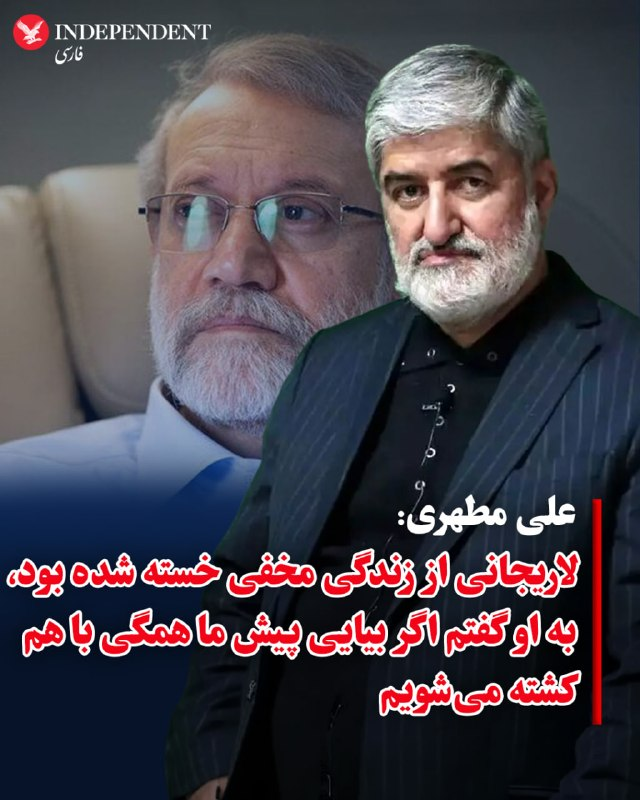

♦️ علی مطهری، عضو پیشین مجلس شورای اسلامی و همسر خواهر برادران لاریجانی شامگاه یکشنبه ۲۰ اردیبهشت در گفتگو با ایرنا درباره آخرین دیدار با علی لاریجانی، دبیر پیشین شورای عالی امنیت ملی حکومت ایران صحبت کرد.

مطهری گفت  حدود یک ماه قبل  از کشته شدن علی لاریجانی او به همراه مرتضی فرزندش به طور سرزده به منزل ما آمدند و حدود دو ساعت نشستیم و صحبت کردیم... احساس کردم ایشان از سبک زندگی که با استتار، تغییر مداوم مکان و رفت و آمد همراه بود، کمی خسته شده بودند و برای استراحت، گپ زدن و شاید تبادل نظر آمده بودند.

علی مطهری گفت: «جالب اینکه وقتی می‌خواستند خداحافظی کنند، همسرم به آقای لاریجانی گفت که طبقه بالای ما تقریبا خالی است و می‌توانند آنجا بیایند. من با شوخی گفتم: نه، تو رو خدا نیایید اینجا، همه ما با هم کشته می‌شویم. ایشان خنده‌ عمیقی کردند.»
‌🇸🇦 Indypersian

🤖 @VahidOOnLine

## VahidOOnLine — post 239470

  <a href="telegram/content/VahidOOnLine_239470_1778487636.mp4">🎬 Download video</a>

ویدیوهای رسیده به ایران‌اینترنشنال نشان می‌دهند ایرانیان مقیم اسپانیا و یونان، یکشنبه ۲۰ اردیبهشت در تجمع‌های اعتراضی برگزارشده در شهرهای مادرید و آتن، علیه جمهوری اسلامی پرفورمنس اعتراضی برگزار کردند.
‌🏁 🇬🇧 IranintlTV

🤖 @VahidOOnLine

## VahidOOnLine — post 239469

  <a href="telegram/content/VahidOOnLine_239469_1778487638.mp4">🎬 Download video</a>

ونکوور| راهمپیمایی ایرانیان در حمایت از مردم ایران، ۲۰ اردیبهشت
‌🏁 🇬🇧 ManotoTV

🤖 @VahidOOnLine

## VahidOOnLine — post 239468

  <a href="telegram/content/VahidOOnLine_239468_1778487641.mp4">🎬 Download video</a>

بر اساس ویدیوهای رسیده به ایران‌اینترنشنال، ایرانیان مقیم کانادا روز یکشنبه در پی فراخوان شاهزاده رضا پهلوی و علیه اعدام‌های جمهوری اسلامی، در اتاوا و ونکوور تجمع کردند.
‌🏁 🇬🇧 IranintlTV

🤖 @VahidOOnLine

## VahidOOnLine — post 239467

  <a href="telegram/content/VahidOOnLine_239467_1778487644.mp4">🎬 Download video</a>

پایگاه تحلیل تصاویر ماهواره‌ای «سور اطلس» اعلام کرد تصاویر ماهواره‌ای ظاهرا یک نفتکش بزرگ را در تنگه هرمز نشان می‌دهد که پس از یک حمله، ردی از نفت در آب برجای گذاشته است. در این تصاویر همچنین رفت‌وآمد گسترده قایق‌های تندرو کوچک در نزدیکی نفتکش دیده می‌شود.

وب‌سایت «تنکر ترکرز» این نفتکش را ابرنفتکش «باراکا» (برکت) معرفی کرده و نوشته است که این شناور متعلق به شرکت ملی نفت ابوظبی، ادنوک، است. به گفته این نهاد ردیابی نفتکش‌ها، باراکا روز ۱۴ اردیبهشت هدف پهپادهای جمهوری اسلامی قرار گرفت و در زمان حمله، پس از یک انتقال محرمانه محموله به نفتکشی دیگر در شرق امارات، خالی از نفت بوده است.
‌🏁 🇬🇧 ManotoTV

🤖 @VahidOOnLine

## VahidOOnLine — post 239466

  

♦️ کاخ آبی، دفتر ریاست جمهوری کره جنوبی روز دوشنبه ۲۱ اردیبهشت ماه با تائید خبر حمله به یکی ازکشتی‌‌ها باری این کشور در تنگه هرمز اعلام کرد به «برنامه دارد تا به عامل این تهاجم» پاسخ دهد.

به گزارش خبرگزاری رویترز در بیانیه ریاست جمهوری کره جنوبی آمده است برخورد یک «پرتابه به کشتی باری اچ‌ام‌ام نامو/ HMM NAMU را به شدت محکوم می‌کند اما در این مرحله از تحقیقات هنوز معلوم نیست این پرتابه از کجا شلیک شده و آیا ایران در آن نقشی داشته است یا نه.»

ساعاتی پیش وزارت خارجه کره‌جنوبی روز یکشنبه اعلام کرده بود که کشتی باری متعلق به این کشور که پیشتر در تنگه هرمز دچار حادثه شده بود،  هدف حمله «هواگردهای ناشناس» قرار گرفته است.
پارک ایل، سخنگوی وزارت خارجه کره‌جنوبی، در یک نشست خبری گفت دو هواگرد ناشناس بخش بیرونی مخزن تعادل سمت چپ در قسمت عقب کشتی «اچ‌ام‌ام نامو» را با فاصله حدود یک دقیقه هدف قرار دادند که در پی آن آتش و دود ایجاد شد.
او بدون اشاره به نوع این هواگردها گفت تصاویر آن‌ها در دوربین‌های مداربسته ثبت شده، اما «محدودیت‌هایی برای شناسایی دقیق نوع، مبدا پرتاب و اندازه فیزیکی این اشیا وجود دارد.»
به گفته مقام‌های کره‌جنوبی، بررسی‌های بیشتری روی بقایای موتور و دیگر قطعات به‌جا مانده انجام خواهد شد.
سخنگوی وزارت خارجه کره‌جنوبی افزود آسیب وارد شده به این کشتی باری که ۲۴ خدمه در آن حضور داشتند، حدود پنج متر عرض داشته و تا حدود هفت متر در بدنه کشتی در بخش عقب سمت چپ امتداد یافته است.
او همچنین گفت آتش‌سوزی در اتاق موتور احتمالا در اثر نخستین حمله آغاز شده و حمله دوم باعث گسترش سریع آتش شده است.
دولت کره‌جنوبی روز دوشنبه ۱۴ اردیبهشت اعلام کرد در حال بررسی اطلاعاتی است که نشان می‌دهد یک کشتی با پرچم این کشور در تنگه هرمز هدف حمله قرار گرفته است.
دونالد ترامپ، رئیس‌جمهوری آمریکا، پس از این حادثه گفت ایران به این کشتی با پرچم پاناما «شلیک‌هایی» انجام داده و از کره‌جنوبی خواست به عملیات آمریکا برای بازگرداندن امنیت کشتیرانی در تنگه هرمز بپیوندد.
جمهوری اسلامی دخالت در این حمله را رد کرده است. سفارت ایران در سئول در بیانیه‌ای اعلام کرد تهران «هرگونه ادعا درباره دخالت نیروهایش» را قاطعانه تکذیب می‌کند.
‌🇸🇦 Indypersian

🤖 @VahidOOnLine

## VahidOOnLine — post 239465

  

♦️خبرگزاری تسنیم، وابسته به سپاه پاسداران روز دوشنبه ۲۱ اردیبهشت‌ماه از عبور یک نفت‌کش حامل نفت خام عراق از تنگه هرمز خبر داد.

براساس این گزارش، «یک فروند نفتکش وی‌ال‌سی‌سی (VLCC) به نام  «آگوس  فانوریوس ۱/AGOIS FANOURIOS I» روز یکشنبه  ۲۰ اردیبهشت از مسیر تعیین‌شده ایران در تنگه هرمز عبور کرد.»

تسنیم گزارش کرده است این نفتکش حامل نفت خام عراق، به سمت ویتنام حرکت می‌کند.

هفته گذشته و همزمان با تشدید درگیری‌ها میان نیروهای دریایی آمریکا و جمهوری اسلامی در تنگه هرمز، گزارش‌ها از توقف کامل تردد میان خلیج فارس و دریای عمان حکایت داشت.
‌🇸🇦 Indypersian

🤖 @VahidOOnLine

## VahidOOnLine — post 239464

  <a href="telegram/content/VahidOOnLine_239464_1778487647.mp4">🎬 Download video</a>

قوه قضاییه جمهوری اسلامی اعلام کرد حکم اعدام عرفان شکورزاده به اتهام همکاری با سرویس اطلاعاتی آمریکا و موساد اجرا شده است. خبرگزاری قوه قضاییه، او را به ارتباط با دو نهاد اطلاعاتی خارجی و انتقال اطلاعات طبقه‌بندی‌شده متهم کرده است.

رسانه‌های حقوق بشری و منتقد جمهوری اسلامی پیش‌تر درباره خطر اجرای حکم اعدام او هشدار داده و نوشته بودند که شکورزاده دانشجوی کارشناسی ارشد مهندسی هوافضا و فناوری ماهواره در دانشگاه علم و صنعت بوده است.
‌🏁 🇬🇧 ManotoTV

🤖 @VahidOOnLine

## VahidOOnLine — post 239463

  <a href="telegram/content/VahidOOnLine_239463_1778487648.mp4">🎬 Download video</a>

بریتانیا و فرانسه امروز دوشنبه میزبان نشستی با حضور بیش از ۴۰ کشور خواهند بود تا درباره میزان مشارکت نظامی آنها در ماموریت اروپایی اسکورت کشتی‌ها در تنگه هرمز گفت‌وگو شود.

این ماموریت قرار است پس از برقراری یک آتش‌بس پایدار آغاز شود و هدف آن همراهی کشتی‌های تجاری در عبور از تنگه هرمز است. بلومبرگ نوشت کشورهای شرکت‌کننده قرار است درباره توانایی‌هایی مانند مین‌روبی، اسکورت دریایی و گشت هوایی گفت‌وگو کنند.

بریتانیا پیش‌تر ناوشکن «اچ‌ام‌اس دراگون» را برای آمادگی در یک ماموریت احتمالی در خاورمیانه اعزام کرده و فرانسه نیز ناوگروه «شارل دوگل» را به دریای سرخ فرستاده است.
‌🏁 🇬🇧 ManotoTV

🤖 @VahidOOnLine

## VahidOOnLine — post 239462

  <a href="telegram/content/VahidOOnLine_239462_1778487648.mp4">🎬 Download video</a>

فرماندهی مرکزی ارتش آمریکا اعلام کرد تفنگداران دریایی ایالات متحده روز ۱۸ اردیبهشت، در جریان تمرینی روی عرشه ناو آبی‌خاکی «یواس‌اس تریپولی»، از یک بالگرد «سی‌هاوک» فرود آمدند.

سنتکام گفت این تمرین برای حفظ آمادگی تفنگداران دریایی انجام شده است تا در صورت لزوم، برای ورود به کشتی‌هایی که در جریان انسداد دریایی آمریکا علیه ایران از دستورها تبعیت نمی‌کنند، به کار گرفته شوند.
‌🏁 🇬🇧 ManotoTV

🤖 @VahidOOnLine

## VahidOOnLine — post 239461

  <a href="telegram/content/VahidOOnLine_239461_1778487649.mp4">🎬 Download video</a>

روزنامه گاردین استرالیا در گزارشی نوشت اسحاق قالیباف، پسر محمدباقر قالیباف برای چند سال در ملبورن زندگی و تحصیل کرده و در همین مدت با بازار ملک و دانشگاه ملبورن ارتباط داشته است. بر اساس این گزارش، اسحاق قالیباف با وجود رد شدن درخواست ویزای او در کانادا، توانسته بود اقامت موقت بلندمدت در استرالیا بگیرد.

گاردین نوشته اسحاق قالیباف از اوایل سال ۲۰۱۴ وارد ملبورن شد، ابتدا دوره زبان و دوره مقدماتی گذراند و سپس از سال ۲۰۱۵ تا ۲۰۱۸ در رشته مهندسی در دانشگاه ملبورن تحصیل کرد. بر اساس مدارکی که او در پرونده مهاجرتی خود در دادگاه فدرال کانادا ارائه کرده بود، او در سال‌های ۲۰۱۶ تا ۲۰۱۸ به‌عنوان دستیار پژوهشی در مرکز زیرساخت‌های داده‌های مکانی و مدیریت زمین دانشگاه ملبورن کار کرده است.

به نوشته گاردین، اسحاق قالیباف در سال ۲۰۲۲ در یک استشهادیه گفته بود تا پایان سپتامبر همان سال اقامت موقت استرالیا داشته، اما به‌دلیل انتظار برای دریافت اقامت دائم کانادا، برای تبدیل آن به اقامت دائم استرالیا اقدام نکرده است. کانادا در نهایت در فوریه ۲۰۲۴ درخواست اقامت دائم او را رد کرد.
‌🏁 🇬🇧 ManotoTV

🤖 @VahidOOnLine

## VahidOOnLine — post 239460

  <a href="telegram/content/VahidOOnLine_239460_1778487650.mp4">🎬 Download video</a>

بر اساس تصاویر و گزارش‌های منتشرشده، یک مرد در پایان تجمع ایرانیان در ریچموندهیل، در شمال تورنتو، با خودروی خود به چند خودرو برخورد کرد و به گفته شاهدان، پس از آن پرچم جمهوری اسلامی را از خودرو بیرون آورد و تکان داد. این تجمع روز یکشنبه ۲۰ اردیبهشت برگزار شده بود.

در گزارش‌های منتشرشده آمده است که این مرد پس از برخورد با چند خودرو و دست‌کم یک نفر، توسط ماموران پلیس بازداشت شد.
‌🏁 🇬🇧 ManotoTV

🤖 @VahidOOnLine

## VahidOOnLine — post 239459

  

خبرگزاری تسنیم، وابسته به سپاه پاسداران، گزارش داد یک نفتکش وی‌ال‌سی‌سی به نام «آگویس فانوریوس ۱» که حامل نفت خام عراق است، یکشنبه با هماهنگی تهران و از مسیر تعیین‌شده از سوی جمهوری اسلامی در تنگه هرمز عبور کرد.
‌🏁 🇬🇧 IranintlTV

🤖 @VahidOOnLine

## VahidOOnLine — post 239458

  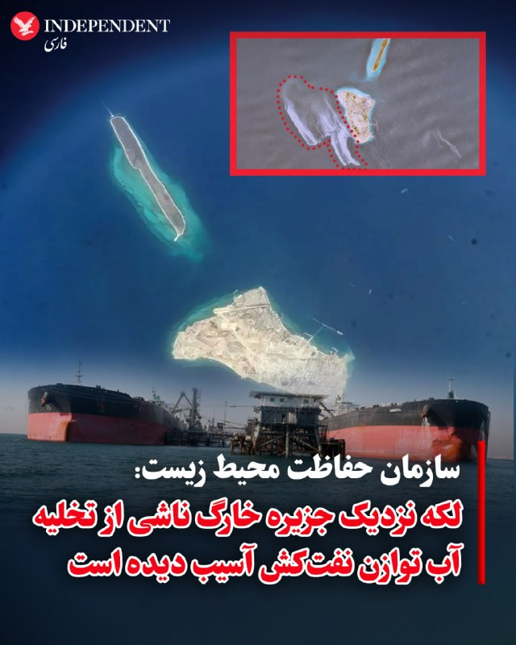

♦️ سازمان حفاظت محیط زیست ایران روز دوشنبه ۲۱ اردیبهشت ماه اعلام کرد لکه بزرگ مشاهده شده در آب‌های خلیج فارس در نزدیکی جزیره خارگ ناشی از تخلیه آب آلوده توازن یک نفت‌کش آسیب دیده بوده است.

پیش از این رسانه‌های بین‌المللی با استناد به تصاویر ماهواره‌ای گزارش کرده بودند که احتمال دارد یک لکه نفتی ناشی از آسیب دیدن نفت‌کش‌ها در نزدیکی جزیره خارگ به‌وجود آمده باشد. مقام‌های جمهوری اسلامی این گزارش را رد کردند.

رسانه‌های ایران به نقل از سازمان حفاظت محیط زیست گزارش کردند:
«هیچگونه نشت نفت از خطوط لوله، تاسیسات پایانه‌های نفتی و یا سکوهای متعلق به شرکت نفت فلات قاره ایران در جزیره خارگ مشاهده یا گزارش نشده است.»
‌🇸🇦 Indypersian

🤖 @VahidOOnLine

## VahidOOnLine — post 239457

  

⭕️گزارش سی‌ان‌ان از اینترنت طبقاتی؛ «فکر کن با بدبختی وارد اینترنت می‌شوی و می‌بینی کسانی که دسترسی بدون محدودیت دارند طوری رفتار می‌کنند که انگار همه‌چیز عادی است»

♦️سی‌ان‌ان در گزارشی میدانی با اشاره قطع اینترنت و رواج اینترنت طبقاتی در ایران می‌نویسد، قطع اینترنت در ایران اکنون بیش از دو ماه ادامه داشته و طولانی‌ترین اختلال ثبت‌شده تاکنون به‌شمار می‌رود.

برای میلیون‌ها نفری که زندگی و درآمدشان به اینترنت وابسته است، این وضعیت ویرانگر بوده است. فراز، ساکن ۳۸ ساله تهران، به سی‌ان‌ان گفت: «تصور کنید با بیکاری و تورم دیوانه‌کننده دست‌وپنجه نرم می‌کنید و به ترتیبی موفق می‌شوید ۵۰۰ هزار تا یک میلیون تومان جور کنید، فقط برای خرید چند گیگابایت وی‌پی‌ان تا بتوانید وارد اکس یا پلتفرم‌های دیگر شوید، خبرها را ببینید و صدایی داشته باشید.»

او افزود: «بعد وسط همه این استرس و خشم، وقتی بالاخره موفق می‌شوی اکس یا تلگرام را باز کنی، می‌بینی کسانی که دسترسی بدون محدودیت دارند طوری رفتار می‌کنند که انگار همه‌چیز عادی است؛ واقعا مثل مشت به سینه آدم می‌ماند.»

متوسط حقوق ماهانه در ایران بین ۲۰ تا ۳۵ میلیون تومان برآورد می‌شود. سی‌ان‌ان می‌نویسد، اینترنت پرو، شکاف عظیم میان فقیر و غنی را عمیق‌تر کرده است.

وب‌سایت «خبرآنلاین» نوشت این طرح «جامعه ایران را به دو طبقه متمایز تقسیم کرده است: نخبگان دیجیتال که از اینترنت سریع و بدون فیلتر برای تجارت، آموزش و ارتباطات بهره‌مندند، و رعایای دیجیتال که در محدودیت شدید، سرعت پایین و هزینه‌های سنگین بازار سیاه وی‌پی‌ان گرفتار شده‌اند.»

قیمت وی‌پی‌ان‌های بازار سیاه به‌شدت افزایش یافته و بر اساس اعلام سازمان «فعالان حقوق بشر در ایران» مستقر در خارج از کشور، قطع اینترنت طی دو ماه گذشته حدود ۱.۸ میلیارد دلار به ایرانیان خسارت زده است؛ رقمی که با برآورد اتاق بازرگانی ایران نیز همخوانی دارد.

روزنامه اطلاعات نوشت: «قطع اینترنت ــ که خود منبع درآمد شمار بسیار زیادی از کسب‌وکارهای مجازی بود ــ وضعیت بحرانی و پیچیده‌ای ایجاد کرده است.»گزارش‌های داخل ایران نشان می‌دهد «اینترنت پرو» از طریق «فهرست سفید» در سطح اپراتورهای مخابراتی و بر پایه «سیم‌کارت‌های سفید» عمل می‌کند؛ یعنی برخی سیم‌کارت‌ها، حساب‌های موبایل یا نهادها از سیستم فیلترینگ کشور مستثنا می‌شوند.

برخلاف وی‌پی‌ان که با رمزگذاری ترافیک اینترنت سانسور را دور می‌زند، «اینترنت پرو» ظاهرا کاربران تاییدشده را از مسیرهایی با محدودیت کمتر عبور می‌دهد. گفته می‌شود دارندگان سیم‌کارت سفید همچنان به اینترنت جهانی کامل دسترسی دارند.

بر اساس گزارش‌ها، هزینه اینترنت پرو برای بسته سالانه ۵۰ گیگابایتی حدود دو میلیون تومان است، علاوه بر هزینه فعال‌سازی ۲.۸ میلیون تومانی و حدود ۴۰ هزار تومان برای هر گیگابایت اضافی. در مقابل، اینترنت عادی ــ که اکنون به‌شدت محدود شده ــ هر گیگابایت حدود ۸ هزار تومان هزینه دارد و همین باعث شده بسیاری ناچار به استفاده از وی‌پی‌ان شوند.
‌🇸🇦 Indypersian

🤖 @VahidOOnLine

## mwarmonitor — post 8871

🇺🇸مسافران آمریکایی کشتی تفریحی که به هانتاویروس دچار شده بود — از جمله یک نفر که احتمالاً آزمایش مثبت دارد — برای انجام ارزیابی‌های پزشکی وارد ایالت نبراسکا شدند. CNN

@mwarmonitor

## mwarmonitor — post 8870

  

🔴 کرانه باختری: یک تروریست مسلح پس از تلاش برای تیراندازی به نیروهای پلیس مرزی اسرائیل، از پا درآمد.

@mwarmonitor

## mwarmonitor — post 8869

🇨🇳🇺🇸چین اعلام کرد که در یک عملیات مشترک با ایالات متحده، یک شبکه فرامرزی قاچاق مواد مخدر را منهدم کرده است. Bloomberg

@mwarmonitor

## pm_afshaa — post 90534

🔴به گفته GB News، نخست‌وزیر بریتانیا کیر استارمر «به نظر می‌رسد این هفته استعفا دهد

💧 Rainbet.com the #1 Non-KYC Crypto Casino & Sportsbook @rainbetcom

😁 @Pm_Afshaa

## pm_afshaa — post 90533

10 گیگ 2560 5 گیگ 1440 فقط تا ساعت 24 امروز با سرعت موشک بدون قطعی

## pm_afshaa — post 90532

10 گیگ 2560 5 گیگ 1440 فقط تا ساعت 24 امروز با سرعت موشک بدون قطعی

## pm_afshaa — post 90531

فقط تا ساعت 24 امشب رو این قیمتا 20% تخفیف گذاشتم هر کی خواست میتونه از طریق دایرکت خرید کنه

## pm_afshaa — post 90530

🔴بلومبرگ: ترامپ قصد دارد در سفر به چین، شی جین‌پینگ را در ارتباط با فروش تسلیحات و خرید نفت از ایران تحت فشار قرار دهد

💧 Rainbet.com the #1 Non-KYC Crypto Casino & Sportsbook @rainbetcom

😁 @Pm_Afshaa

## pm_afshaa — post 90529

  

کانفینگ با سرعت موشک شارژ کردم هر کی خواست بیاد دایرکت چنل هم پرداخت ریالی داریم هم ارزی 5 گیگ 1800 10 گیگ 3200

## pm_afshaa — post 90528

  

با اذان صبح امروز عرفان شکورزاده 29 ساله و نخبه ی دانشگاه علم و صنعت توسط جمهوری اسلامی امروز اعدام شد

💧 Rainbet.com the #1 Non-KYC Crypto Casino & Sportsbook @rainbetcom

😁 @Pm_Afshaa

## pm_afshaa — post 90527

🔴زیردریایی آلاسکا از کلاس اوهایو معروف به سلاح روز قیامت برای بازدارندگی آمریکا وارد منطقه شد

💧 Rainbet.com the #1 Non-KYC Crypto Casino & Sportsbook @rainbetcom

😁 @Pm_Afshaa

## mamlekate — post 103501

  <a href="telegram/content/mamlekate_103501_1778487657.mp4">🎬 Download video</a>

تصاویر ماهواره‌ای یک نفتکش بزرگ را در تنگه هرمز نشان می‌دهند که بنظر می‌رسد پس از یک حمله احتمالی، ردی از نفت را نشت می‌دهد. فعالیت قایق‌های تندرو کوچک نیز در نزدیکی آن دیده می‌شود. [شنبه ۱۹ اردیبهشت]
SoarAtlas

📝 بریتانیا و فرانسه نشستی چندملیتی برای بازگرداندن جریان تجارت در تنگه هرمز برگزار می‌کنند

📝 سازمان حفاظت محیط‌زیست وجود آلودگی آب در اطراف خارک را تأیید کرد

در حالی که پیشتر مقامات جمهوری اسلامی آلودگی آب‌های اطراف جزیره خارک را تکذیب کرده بودند، سازمان حفاظت محیط‌زیست ایران، وجود این آلودگی را تأیید و اعلام کرد که ناشی از «نشت آب توازن یک نفتکش» بوده است.

@mamlekate

## mamlekate — post 103500

📝 گاردین از سرمایه‌گذاری پسر قالیباف در بازار املاک استرالیا خبر داد

روزنامه گاردین در گزارشی از ارتباط اسحاق قالیباف، پسر رییس مجلس جمهوری اسلامی، با یک مرکز پژوهشی در دانشگاه ملبورن و سرمایه‌گذاری او در حوزه املاک در استرالیا خبر داد. به نوشته این روزنامه، او از طریق اجاره دادن دست‌کم یک ملک در این کشور کسب درآمد می‌کرده است.

@mamlekate

## VahidOnline — post 75393

  

خبرگزاری میزان، رسانه قوه قضاییه جمهوری اسلامی، صبح دوشنبه، ۲۱ اردیبهشت از اجرای حکم اعدام عرفان شکورزاده، زندانی سیاسی، با اتهام «همکاری با سرویس‌های اطلاعاتی آمریکا و اسرائیل» خبر داد.
شکورزاده بهمن‌ماه ۱۴۰۳ از سوی اطلاعات سپاه با اتهام «جاسوسی و همکاری با کشورهای متخاصم» بازداشت و به اعدام محکوم شد و حکم صادر شده علیه او به‌تازگی در دیوان عالی کشور تایید شده بود.
@VahidOOnLine

📡 @VahidOnline

## IranIntlTV — post 336611

یک شهروند با ارسال پیام صوتی به ایران‌اینترنشنال می‌گوید مدرس کاشت ناخن است و کسب‌وکار او به مشکل خورده: «شغل ما را غیرضروری دانسته‌اند و دستگاه کارتخوان‌مان را قطع کردند.»

## IranIntlTV — post 336610

  

علی خزایی، نماینده ورامین در مجلس گفت: «شرایط مدیریت تنگه هرمز هیچ‌گاه مانند گذشته نخواهد شد و این تنگه به وضع سابق بازنمی‌گردد و هیچ شناوری بدون اجازه جمهوری اسلامی حق عبور ندارد.»

او افزود: «شناورهای آمریکا و کشورهای همکار با این کشور، اجازه عبور از تنگه هرمز را نخواهند داشت.»
iranintl.com/202605117967

## IranIntlTV — post 336609

  <a href="telegram/content/IranIntlTV_336609_1778487661.mp4">🎬 Download video</a>

دونالد ترامپ پاسخ جمهوری اسلامی به آمریکا را «کاملا غیر قابل قبول» ارزیابی کرد. همزمان تسنیم، خبرگزاری وابسته به سپاه به نقل از یک منبع مطلع نوشت تهران برای خوشایند ترامپ، طرح نمی‌نویسد.

مرتضی کاظمیان، عضو تحریریه ایران‌اینترنشنال، از دو راهی تسلیم یا تغییر رژیم برای جمهوری اسلامی می‌گوید

@iranintltv

## IranIntlTV — post 336608

  <a href="telegram/content/IranIntlTV_336608_1778487663.mp4">🎬 Download video</a>

بنیامین نتانیاهو، نخست‌وزیر اسرائیل، تغییر حکومت در ایران را ممکن دانست ولی گفت این موضوع تضمین‌ شده‌ نیست. او به ضرورت مهار برنامه هسته‌ای، نیروهای نیابتی و برنامه موشکی جمهوری اسلامی اشاره کرد و گفت این جنگ هنوز تمام نشده‌ است.

گفت‌وگو با مئیر جاودانفر، تحلیل‌گر مسائل اسرائیل

@iranintltv

## IranIntlTV — post 336607

  

اسماعیل بقائی، سخنگوی وزارت خارجه جمهوری اسلامی گفت: «ما به کشورهای اروپایی صریحا اعلام کردیم که اجازه ندهند وسوسه‌های آمریکا یا اسرائیل در موضوعات منطقه‌ای، آن‌ها را ناخواسته به بحرانی بکشاند که سودی برایشان نخواهد داشت.»

او اضافه کرد: «این آگاهی نسبی در بسیاری از کشورهای اروپایی وجود دارد. آنها مطمئن هستند که این جنگ، جنگی غیرقانونی، غیراخلاقی و تجاوزکارانه بوده است. به همین دلیل، اجازه ندادند فشارهای آمریکا آنان را به‌طور علنی بخشی از این اقدام غیرقانونی و مخرب صلح و امنیت بین‌المللی کند.»
https://iranintl.com/202605110407

## IranIntlTV — post 336606

  

عباس مقتدایی، نایب‌رییس کمیسیون امنیت ملی مجلس، گفت که اگر آمریکا بخواهد بر «تخیلات» خود علیه منافع جمهوری اسلامی اصرار بورزد، «تاوان سختی» برای این لجاجت در شهرهای آمریکا خواهد پرداخت.

او افزود نیروهای مسلح جمهوری اسلامی «مدیریت هوشمند» تنگه هرمز را برای مقابله با «زیاده‌خواهی دشمنان» در دست گرفتند و اگر لازم باشد، برای عبور و مرور کشتی‌ها عوارض دریافت خواهند کرد.

نایب‌رییس کمیسیون امنیت ملی مجلس گفت برخی کشورهای منطقه با در اختیار قرار دادن خاک خود، با آمریکا و اسرائیل در حمله به ما همکاری کردند و جمهوری اسلامی در دفاع از خود «هر اقدامی» در برابر دشمنی آنها انجام می‌دهد.
iranintl.com/202605116225

## IranIntlTV — post 336605

  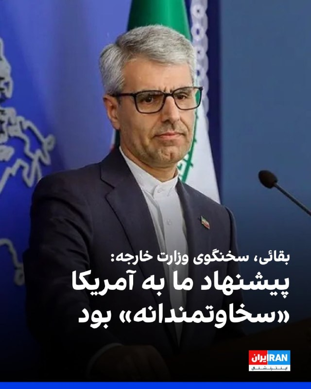

اسماعیل بقائی، سخنگوی وزارت خارجه جمهوری اسلامی، در خصوص پاسخ تهران به پیشنهاد واشینگتن برای خاتمه جنگ گفت: «هرچه در متن پیشنهاد کردیم معقول و سخاوتمندانه بود. نه‌تنها برای منافع ملی ایران بلکه برای خیر و صلاح منطقه و جهان اما طرف‌های آمریکایی همچنان بر خواسته‌های نامعقول خود پافشاری می‌کنند.»

او افزود: «جمهوری اسلامی ثابت کرده قدرت مسئولیت‌پذیر در منطقه است. ما قلدر نیستیم؛ قلدرستیز هستیم.» او ادامه داد: «پیشنهاد ما برای تردد ایمن در تنگه هرمز آیا زیاده خواهانه است؟ موضوع مهمی همچون برقراری صلح و امنیت در تمام منطقه غیرمسئولانه است؟»

پیش‌تر دونالد ترامپ پیشنهاد جمهوری اسلامی را «غیرقابل قبول» خوانده بود.
iranintl.com/202605116908

## IranIntlTV — post 336604

  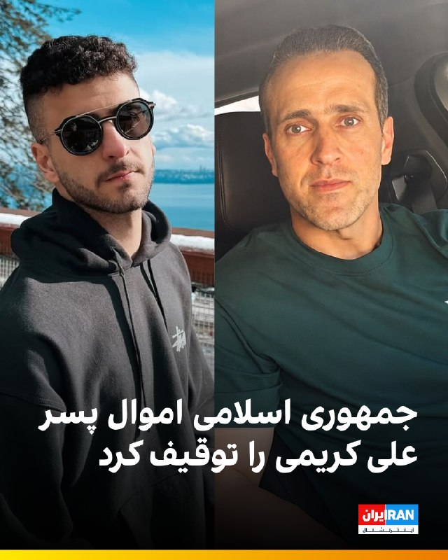

🔻خبرگزاری میزان، رسانه قوه قضاییه جمهوری اسلامی، از توقیف بخشی از املاک منتسب به علی کریمی، بازیکن پیشین تیم ملی فوتبال و از چهره‌های مخالف جمهوری اسلامی خبر داد و نوشت یکی از املاک شناسایی‌شده، یک پلاک ثبتی به نام هاوش، فرزند او، شامل دو واحد تجاری و چهار واحد مسکونی، است.

🔹براساس اطلاعیه منتشرشده از سوی قوه قضاییه جمهوری اسلامی، با استعلام از سازمان ثبت اسناد و املاک کشور، برخی املاک علی کریمی که به گفته قوه قضاییه جمهوری اسلامی «سعی در اختفای آن‌ها شده بود» شناسایی و توقیف شد.

🔹پیش‌تر نیز قوه قضاییه جمهوری اسلامی از توقیف اموال علی دایی، علی کریمی، مسعود شجاعی، زهرا قنبری و علیرضا فغانی به‌دلیل مخالفت با جمهوری اسلامی خبر داده بود.

@iranintltvsport

## IranIntlTV — post 336603

  

🔻اتحادیه جهانی کشتی اعلام کرد که مسابقات قهرمانی بزرگسالان جهان از ۱۱ تا ۱۹ سپتامبر ۲۰۲۷ در لاس‌وگاس برگزار خواهد شد. این رقابت‌ها نخستین مرحله انتخابی بازی‌های المپیک ۲۰۲۸ لس‌آنجلس نیز خواهد بود.

🔹اعطای میزبانی مهم‌ترین رویداد کشتی سال ۲۰۲۷ به آمریکا در حالی انجام شد که علیرضا دبیر، رییس فدراسیون کشتی، تهدید کرده بود اگر آمریکا با تیم ملی کشتی زیر ۲۳ سال ایران رفتاری مشابه تیم ملی فوتبال داشته باشد، تلاش می‌کند با همکاری «کشورهای صاحب کشتی» میزبانی مسابقات جهانی ۲۰۲۷ را از آمریکا بگیرد.

🔹آمریکا در سال‌های اخیر برای برخی ورزشکاران، اعضا و همراهان تیم‌های ملی کشتی ایران، از جمله علیرضا دبیر، ویزا صادر نکرده است. از سوی دیگر، ابهام‌هایی درباره صدور ویزا برای اعضای تیم ملی فوتبال ایران مطرح شده است.

🔹مارکو روبیو، وزیر خارجه آمریکا، گفته است ایالات متحده با حضور تیم ملی فوتبال ایران در مسابقات جام جهانی در این کشور مخالفتی ندارد، اما درباره همراهان تیم گفته است: «آن‌ها نمی‌توانند یک مشت «تروریست» عضو سپاه را به‌عنوان روزنامه‌نگار یا مربی ورزشی وارد کشور ما کنند.»

@iranintltvsport

## IranIntlTV — post 336602

  <a href="telegram/content/IranIntlTV_336602_1778487670.mp4">🎬 Download video</a>

ویدیوهای رسیده به ایران‌اینترنشنال نشان می‌دهند ایرانیان مقیم اسپانیا و یونان، یکشنبه ۲۰ اردیبهشت در تجمع‌های اعتراضی برگزارشده در شهرهای مادرید و آتن، علیه جمهوری اسلامی پرفورمنس اعتراضی برگزار کردند.

## IranIntlTV — post 336601

  <a href="telegram/content/IranIntlTV_336601_1778487673.mp4">🎬 Download video</a>

بر اساس ویدیوهای رسیده به ایران‌اینترنشنال، ایرانیان مقیم کانادا روز یکشنبه در پی فراخوان شاهزاده رضا پهلوی و علیه اعدام‌های جمهوری اسلامی، در اتاوا و ونکوور تجمع کردند.

## IranIntlTV — post 336600

  <a href="telegram/content/IranIntlTV_336600_1778487676.mp4">🎬 Download video</a>

روزنامه گاردین در گزارشی از ارتباط اسحاق قالیباف، پسر رییس مجلس جمهوری اسلامی، با یک مرکز پژوهشی در دانشگاه ملبورن و سرمایه‌گذاری او در حوزه املاک در استرالیا خبر داد.

علیرضا محبی، خبرنگار ایران‌اینترنشنال،‌ گزارش می‌دهد
@iranintltv

## IranIntlTV — post 336599

  <a href="telegram/content/IranIntlTV_336599_1778487678.mp4">🎬 Download video</a>

خبرگزاری میزان، وابسته به قوه قضاییه جمهوری اسلامی، از اعدام عرفان شکورزاده، زندانی سیاسی، به اتهام «همکاری با سرویس اطلاعاتی آمریکا و سرویس جاسوسی موساد» خبر داد.

گفت‌وگو با رضا حاجی‌حسینی، روزنامه‌نگار

@iranintltv

## IranIntlTV — post 336598

  <a href="telegram/content/IranIntlTV_336598_1778487681.mp4">🎬 Download video</a>

ایرانیان مقیم تورنتو کانادا در پاسخ به فراخوان شاهزاده رضا پهلوی برای اعتراض به خاموشی سراسری اینترنت در ایران، بازداشت‌های گسترده و اعدام بی‌وقفه معترضان تجمع کردند.

مهسا مرتضوی، خبرنگار ایران‌اینترنشنال، گزارش می‌دهد

@iranintltv

## IranIntlTV — post 336597

  <a href="telegram/content/IranIntlTV_336597_1778487683.mp4">🎬 Download video</a>

ایرانیان ساکن ونکوور کانادا در اعتراض به خاموشی سراسری اینترنت در ایران، بازداشت‌های گسترده و اعدام بی‌وقفه معترضان بار دیگر گرد هم آمدند.

@iranintltv

## IranIntlTV — post 336596

  <a href="telegram/content/IranIntlTV_336596_1778487685.mp4">🎬 Download video</a>

ایرانیان مقیم فرانکفورت آلمان هم‌زمان با معترضان در ده‌ها شهر جهان، در حمایت از فراخوان شاهزاده رضا پهلوی و انقلاب ملی تجمع اعتراضی برگزار کردند.

مهدی تهرانی، خبرنگار ایران‌اینترنشنال، گزارش می‌دهد
@iranintltv

## IranIntlTV — post 336595

  <a href="telegram/content/IranIntlTV_336595_1778487688.mp4">🎬 Download video</a>

نرگس محمدی، برنده جایزه نوبل صلح، پس از صدور دستور توقف اجرای حکم برای انجام روند درمان، در بیمارستان پارس تهران بستری شد. بنیاد نرگس اعلام کرد این انتقال با «تودیع وثیقه سنگین» انجام شده است.

گفت‌وگو با ایمان آقایاری، فعال سیاسی
@iranintltv

## IranIntlTV — post 336594

  <a href="telegram/content/IranIntlTV_336594_1778487691.mp4">🎬 Download video</a>

بنیامین نتانیاهو، نخست‌وزیر اسرائیل، در مصاحبه با شبکه سی‌بی‌اس با اشاره به توانمندی‌های هسته‌ای تهران گفت اسرائیل بخش زیادی از آن‌ها را تضعیف کرده، اما همچنان بخشی از این تهدیدها باقی مانده و باید اقدامات بیشتری انجام شود.

گفت‌وگو با کامیار بهرنگ، عضو تحریریه ایران‌اینترنشنال
@iranintltv

## IranIntlTV — post 336593

  

خبرگزاری تسنیم، وابسته به سپاه پاسداران، گزارش داد یک نفتکش وی‌ال‌سی‌سی به نام «آگویس فانوریوس ۱» که حامل نفت خام عراق است، یکشنبه با هماهنگی تهران و از مسیر تعیین‌شده از سوی جمهوری اسلامی در تنگه هرمز عبور کرد.
https://iranintl.com/202605119586

## IranIntlTV — post 336592

  <a href="telegram/content/IranIntlTV_336592_1778487695.mp4">🎬 Download video</a>

ایرانیان مخالف جمهوری اسلامی در واشینگتن دی‌سی، در اعتراض به اعدام، سرکوب معترضان و قطع اینترنت در ایران تظاهرات کردند.

اردوان روزبه، خبرنگار ایران‌اینترنشنال، گزارش می‌دهد

@iranintltv

## ManotoTV — post 105294

  <a href="telegram/content/ManotoTV_105294_1778487697.mp4">🎬 Download video</a>

سن‌فرانسیسکو| گردهمایی ایرانیان، ۲۰ اردیبهشت

## ManotoTV — post 105293

  <a href="telegram/content/ManotoTV_105293_1778487699.mp4">🎬 Download video</a>

ونکوور| راهمپیمایی ایرانیان در حمایت از مردم ایران، ۲۰ اردیبهشت

## ManotoTV — post 105292

  <a href="telegram/content/ManotoTV_105292_1778487701.mp4">🎬 Download video</a>

پایگاه تحلیل تصاویر ماهواره‌ای «سور اطلس» اعلام کرد تصاویر ماهواره‌ای ظاهرا یک نفتکش بزرگ را در تنگه هرمز نشان می‌دهد که پس از یک حمله، ردی از نفت در آب برجای گذاشته است. در این تصاویر همچنین رفت‌وآمد گسترده قایق‌های تندرو کوچک در نزدیکی نفتکش دیده می‌شود.

وب‌سایت «تنکر ترکرز» این نفتکش را ابرنفتکش «باراکا» (برکت) معرفی کرده و نوشته است که این شناور متعلق به شرکت ملی نفت ابوظبی، ادنوک، است. به گفته این نهاد ردیابی نفتکش‌ها، باراکا روز ۱۴ اردیبهشت هدف پهپادهای جمهوری اسلامی قرار گرفت و در زمان حمله، پس از یک انتقال محرمانه محموله به نفتکشی دیگر در شرق امارات، خالی از نفت بوده است.

## ManotoTV — post 105291

  <a href="telegram/content/ManotoTV_105291_1778487703.mp4">🎬 Download video</a>

قوه قضاییه جمهوری اسلامی اعلام کرد حکم اعدام عرفان شکورزاده به اتهام همکاری با سرویس اطلاعاتی آمریکا و موساد اجرا شده است. خبرگزاری قوه قضاییه، او را به ارتباط با دو نهاد اطلاعاتی خارجی و انتقال اطلاعات طبقه‌بندی‌شده متهم کرده است.

رسانه‌های حقوق بشری و منتقد جمهوری اسلامی پیش‌تر درباره خطر اجرای حکم اعدام او هشدار داده و نوشته بودند که شکورزاده دانشجوی کارشناسی ارشد مهندسی هوافضا و فناوری ماهواره در دانشگاه علم و صنعت بوده است.

## ManotoTV — post 105290

  <a href="telegram/content/ManotoTV_105290_1778487703.mp4">🎬 Download video</a>

بریتانیا و فرانسه امروز دوشنبه میزبان نشستی با حضور بیش از ۴۰ کشور خواهند بود تا درباره میزان مشارکت نظامی آنها در ماموریت اروپایی اسکورت کشتی‌ها در تنگه هرمز گفت‌وگو شود.

این ماموریت قرار است پس از برقراری یک آتش‌بس پایدار آغاز شود و هدف آن همراهی کشتی‌های تجاری در عبور از تنگه هرمز است. بلومبرگ نوشت کشورهای شرکت‌کننده قرار است درباره توانایی‌هایی مانند مین‌روبی، اسکورت دریایی و گشت هوایی گفت‌وگو کنند.

بریتانیا پیش‌تر ناوشکن «اچ‌ام‌اس دراگون» را برای آمادگی در یک ماموریت احتمالی در خاورمیانه اعزام کرده و فرانسه نیز ناوگروه «شارل دوگل» را به دریای سرخ فرستاده است.

## ManotoTV — post 105289

  <a href="telegram/content/ManotoTV_105289_1778487704.mp4">🎬 Download video</a>

فرماندهی مرکزی ارتش آمریکا اعلام کرد تفنگداران دریایی ایالات متحده روز ۱۸ اردیبهشت، در جریان تمرینی روی عرشه ناو آبی‌خاکی «یواس‌اس تریپولی»، از یک بالگرد «سی‌هاوک» فرود آمدند.

سنتکام گفت این تمرین برای حفظ آمادگی تفنگداران دریایی انجام شده است تا در صورت لزوم، برای ورود به کشتی‌هایی که در جریان انسداد دریایی آمریکا علیه ایران از دستورها تبعیت نمی‌کنند، به کار گرفته شوند.

## ManotoTV — post 105288

  <a href="telegram/content/ManotoTV_105288_1778487705.mp4">🎬 Download video</a>

روزنامه گاردین استرالیا در گزارشی نوشت اسحاق قالیباف، پسر محمدباقر قالیباف برای چند سال در ملبورن زندگی و تحصیل کرده و در همین مدت با بازار ملک و دانشگاه ملبورن ارتباط داشته است. بر اساس این گزارش، اسحاق قالیباف با وجود رد شدن درخواست ویزای او در کانادا، توانسته بود اقامت موقت بلندمدت در استرالیا بگیرد.

گاردین نوشته اسحاق قالیباف از اوایل سال ۲۰۱۴ وارد ملبورن شد، ابتدا دوره زبان و دوره مقدماتی گذراند و سپس از سال ۲۰۱۵ تا ۲۰۱۸ در رشته مهندسی در دانشگاه ملبورن تحصیل کرد. بر اساس مدارکی که او در پرونده مهاجرتی خود در دادگاه فدرال کانادا ارائه کرده بود، او در سال‌های ۲۰۱۶ تا ۲۰۱۸ به‌عنوان دستیار پژوهشی در مرکز زیرساخت‌های داده‌های مکانی و مدیریت زمین دانشگاه ملبورن کار کرده است.

به نوشته گاردین، اسحاق قالیباف در سال ۲۰۲۲ در یک استشهادیه گفته بود تا پایان سپتامبر همان سال اقامت موقت استرالیا داشته، اما به‌دلیل انتظار برای دریافت اقامت دائم کانادا، برای تبدیل آن به اقامت دائم استرالیا اقدام نکرده است. کانادا در نهایت در فوریه ۲۰۲۴ درخواست اقامت دائم او را رد کرد.

## ManotoTV — post 105287

  <a href="telegram/content/ManotoTV_105287_1778487706.mp4">🎬 Download video</a>

بر اساس تصاویر و گزارش‌های منتشرشده، یک مرد در پایان تجمع ایرانیان در ریچموندهیل، در شمال تورنتو، با خودروی خود به چند خودرو برخورد کرد و به گفته شاهدان، پس از آن پرچم جمهوری اسلامی را از خودرو بیرون آورد و تکان داد. این تجمع روز یکشنبه ۲۰ اردیبهشت برگزار شده بود.

در گزارش‌های منتشرشده آمده است که این مرد پس از برخورد با چند خودرو و دست‌کم یک نفر، توسط ماموران پلیس بازداشت شد.

## FarsiVOA — post 217409

  <a href="telegram/content/FarsiVOA_217409_1778487708.mp4">🎬 Download video</a>

برای نخستین بار در بیش از ۱۵ سال گذشته، اولین تراکنش آزمایشی موفق کارت‌های اعتباری «ویزا» و «مسترکارت» توسط شرکت «بیمرا» در سوریه انجام شد.

این شرکت تایید کرد که تمامی مراحل فنی برای پردازش، مسیریابی و تسویه تراکنش‌های ویزا و مسترکارت در داخل شبکه بانکی سوریه با موفقیت تست شده است.

به دلیل تحریم‌ها و شرایط سیاسی، استفاده از شبکه‌های پرداخت بین‌المللی در سوریه برای بیش از یک دهه متوقف شده بود.

این اقدام نتیجه یک تفاهم‌نامه است که در سپتامبر ۲۰۲۵ بین بانک مرکزی سوریه و شرکت مسترکارت امضا شده بود. همچنین بانک مرکزی سوریه در تاریخ ۴ مه ۲۰۲۶ رسماً به بانک‌های داخلی و شرکت‌های پرداخت الکترونیک اجازه داد تا با شبکه‌های جهانی وارد همکاری شوند.

دولت سوریه این اقدام را بخشی از استراتژی چهار ساله خود تا سال ۲۰۳۰ برای گذار از اقتصاد نقدی به اقتصاد دیجیتال می‌داند. هدف اصلی، کاهش وابستگی شدید به نقدینگی، که ۸۰٪ معاملات را شامل می‌شود، و جذب سرمایه‌گذاران خارجی است.

این گشایش، راه را برای استارتاپ‌ها و کسب‌ و کارهای آنلاین در سوریه باز می‌کند تا بتوانند در سطح بین‌المللی فعالیت کنند.
@FarsiVOA

## FarsiVOA — post 217408

🔺رد پای پسر قالیباف در استرالیا؛ از اقامت و ملک تا ارتباط با داماد قاسم سلیمانی

◾️گاردین در گزارشی تحقیقی نوشته اسحاق قالیباف، پسر محمدباقر قالیباف، رئیس مجلس جمهوری اسلامی، طی بیش از یک دهه گذشته ارتباط‌های گسترده‌ای با استرالیا داشته است؛ از تحصیل و کار در دانشگاه ملبورن تا دریافت درآمد اجاره از دو آپارتمان در این کشور.

◾️اهمیت این گزارش در زمان انتشار آن است. محمدباقر قالیباف اکنون یکی از چهره‌های اصلی جمهوری اسلامی در مدیریت جنگ و مذاکرات با آمریکا معرفی می‌شود.

◾️همزمان، اما اسناد دادگاه فدرال کانادا نشان می‌دهد پسر قالیباف در سال‌های گذشته در استرالیا زندگی و کار کرده، اقامت بلندمدت داشته و با وجود رد شدن دو تلاشش برای ورود یا اقامت در کانادا، توانسته در استرالیا بماند.

⬇️ بیشتر بخوانید:
https://ir.voanews.com/a/8148761.html

## FarsiVOA — post 217407

  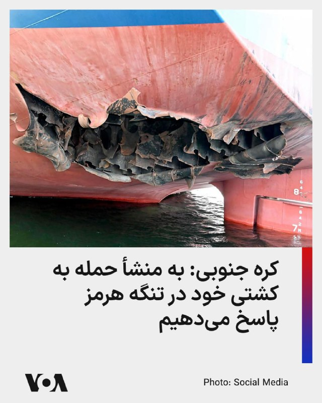

کره جنوبی حمله به یک کشتی باری متعلق به یک شرکت کشتیرانی این کشور در ماه جاری میلادی در تنگه هرمز را شدیدا محکوم کرد.

دفتر ریاست‌جمهوری کره جنوبی، معروف به «کاخ آبی»، روز دوشنبه اعلام کرد که قصد دارد پس از شناسایی منبع حمله، به آن پاسخ دهد. یک مقام ارشد کاخ آبی به خبرنگاران گفت که کارشناسان کره جنوبی بررسی اولیه جرم‌شناسی از آسیب واردشده به بخش عقبی کشتی انجام داده‌اند.

این حمله باعث آتش‌سوزی در اتاق موتور کشتی شده بود.

پیشتر پرزیدنت ترامپ از حمله جمهوری اسلامی به «کشورهای غیرمرتبط» در تنگه هرمز خبر داده و در تروت سوشال نوشته بود که رژیم ایران در رابطه با عبور و مرور کشتی‌ها، به کشورهای غیرمرتبط - از جمله یک کشتی باری کره جنوبی - حمله کرده است.

در ادامه این پیام آمده بود:‌ «شاید وقت آن رسیده است که کره جنوبی هم به این مأموریت بپیوندد!»
@FarsiVOA

## FarsiVOA — post 217406

🔺افزایش قیمت نان؛ فشار هزینه‌ها در سفره مردم بیشتر شد

◾️گزارش‌های رسیده به صدای آمریکا نشان می‌دهد پس از افزایش رسمی قیمت نان در همدان، نان در برخی شهرها با نرخ‌های تازه عرضه می‌شود.

◾️بر اساس این گزارش‌ها، در استان‌ها و شهرهایی از جمله اصفهان، یزد، مشهد و قم، نانوایی‌ها در روزهای اخیر نان را با قیمت‌های جدید عرضه کرده‌اند.

◾️در تهران نیز گزارش‌های میدانی حاکی است که قیمت‌های مصوب رعایت نمی‌شود و در برخی مناطق، نانوایی‌های سنگک و بربری عملاً آزادپز شده‌اند و دیگر نان را با نرخ دولتی عرضه نمی‌کنند.

◾️عصر ایران در گزارشی درباره گران‌فروشی نان نوشته یک نانوایی سنگک، نانی را که باید با آرد دولتی ۷ هزار و ۶۰۰ تومان عرضه کند، ۲۰ هزار تومان فروخته است.

⬇️ بیشتر بخوانید:
https://ir.voanews.com/a/8148760.html

## FarsiVOA — post 217405

  

ارتش اسرائیل با انتشار بیانیه‌ای از ساکنان تعدادی از مناطق جنوب لبنان خواست که خانه‌های خود را ترک کنند. در بیانیه ارتش اسرائیل که دوشنبه منتشر شد به شهرها و روستاهای الریحان (جزین)، جرجوع، کفر رمان، النمیریه، عرب‌صالیم، جمیجمه، مشغره، قلیا (البقاع الغربی) و حاروف اشاره شده است.

این نوع هشدارها معمولا پیش از حملات هوایی صادر می‌شود.

در بیانیه ارتش اسرائیل آمده است: «در پی نقض توافق آتش‌بس از سوی حزب‌اللهِ تروریستی، ارتش دفاعی ناچار است با قدرت علیه آن اقدام کند، اما قصد آسیب رساندن به شما را ندارد.»

ارتش اسرائیل از ساکنان این مناطق خواسته «فوراً خانه‌های خود را تخلیه کرده و دست‌کم تا فاصله ۱۰۰۰ متری از روستاها و شهرها، به مناطق باز دور» شوند. این ارتش هشدار داده که «هر کسی که در نزدیکی عناصر حزب‌الله، تأسیسات و تجهیزات رزمی آن حضور داشته باشد، جان خود را در معرض خطر قرار می‌دهد.»
@FarsiVOA

## FarsiVOA — post 217404

  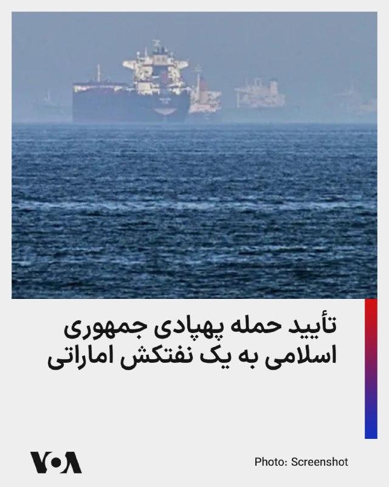

بر اساس ویدیوی منتشرشده از سوی تانکرترکرز، نفتکش بسیار بزرگ «برکه» متعلق به شرکت دولتی نفت ابوظبی، در حمله پهپادی چهاردهم اردیبهشت‌ماه هدف قرار گرفته است.

رویترز پیش‌تر گزارش داده بود امارات، جمهوری اسلامی را به حمله با دو پهپاد به این نفتکش خالی در زمان عبور از تنگه هرمز متهم کرده و شرکت ادنوک اعلام کرده بود در این حادثه کسی آسیب ندیده است.

تانکرترکرز می‌گوید این نفتکش پیش از حمله، محموله خود را در انتقالی پنهانی در شرق امارات به نفتکش دیگری منتقل کرده بود و هنگام بازگشت برای بارگیری دوباره هدف قرار گرفت.

رویترز نیز گزارش داده ادنوک و خریدارانش برای خروج نفت گرفتارمانده در خلیج فارس، از روش‌هایی مانند خاموش کردن ردیاب‌ها و انتقال کشتی‌به‌کشتی استفاده کرده‌اند.
@FarsiVOA

## FarsiVOA — post 217403

🔺دیدار ترامپ و شی؛ از ایران و پرونده هسته‌ای تا تجارت و هوش مصنوعی

◾️دونالد ترامپ، رئیس‌جمهور آمریکا، این هفته به چین می‌رود تا با شی جین‌پینگ، رئیس‌جمهور این کشور، دیدار کند.

◾️این دیدار قرار است طیف گسترده‌ای از پرونده‌های امنیتی، اقتصادی و فناورانه را دربر بگیرد؛ از جنگ ایران و برنامه هسته‌ای جمهوری اسلامی تا تایوان، تجارت، تسلیحات هسته‌ای، هوش مصنوعی و مواد معدنی کمیاب.

◾️در پرونده ایران، انتظار واشنگتن روشن است و ترامپ می‌خواهد چین از نفوذ خود بر تهران استفاده کند.

◾️چین بزرگ‌ترین خریدار نفت از جمهوری اسلامی است و در ماه‌های اخیر، آمریکا چند شرکت چینی را به اتهام کمک به بخش نظامی و زنجیره تأمین جمهوری اسلامی تحریم کرده است.

⬇️ بیشتر بخوانید:
https://ir.voanews.com/a/8148757.html

## FarsiVOA — post 217402

🔺سازمان حفاظت محیط‌زیست وجود آلودگی آب در اطراف خارک را تأیید کرد

◾️در حالی که پیشتر مقامات جمهوری اسلامی آلودگی آب‌های اطراف جزیره خارک را تکذیب کرده بودند، سازمان حفاظت محیط‌زیست ایران، وجود این آلودگی را تأیید و اعلام کرد که ناشی از «نشت آب توازن یک نفتکش» بوده است.

◾️بر اساس این اعلام، انتشار این آب توازن آلوده، منجر به بروز آلودگی در مجاورت جزیره خارک شد.

◾️«آب توازن» آبی است که کشتی‌ها و نفتکش‌ها برای حفظ تعادل، پایداری و ایمنی خود در مخازن مخصوص ذخیره می‌کنند.

◾️پیشتر مدیرعامل شرکت پایانه‌های نفتی ایران، از اساس هرگونه آلودگی در این منطقه را رد کرده بود.

⬇️ بیشتر بخوانید:
https://ir.voanews.com/a/8148758.html

## FarsiVOA — post 217401

🔺پاریس و لندن ریاست نشستی درباره تنگه هرمز را بر عهده خواهند داشت

◾️پاریس و لندن ریاست نشستی مجازی با حضور وزیران دفاع کشورهای مختلف درباره تنگه هرمز را بر عهده خواهند داشت. این کشورها آماده مشارکت در مأموریتی برای تأمین امنیت تنگه هرمز هستند.

◾️بر اساس اعلام وزارت دفاع بریتانیا، حدود چهل کشور در نشست روز سه‌شنبه که به صورت ویدئو-کنفرانس برگزار می‌شود، حضور خواهد داشت.

◾️برگزاری این نشست در شرایطی است که جمهوری اسلامی یکشنبه هشدار داد که در صورت استقرار نیروهای فرانسوی و بریتانیایی در تنگه هرمز، به آن «پاسخی قاطع و فوری» خواهد داد.

◾️انسداد تنگه هرمز به دست جمهوری اسلامی اقتصاد جهانی را متزلزل کرده و حدود ۱۵۰۰ کشتی و ۲۰ هزار نفر از خدمه کشتی‌ها در آن گرفتار شده‌اند.

⬇️ بیشتر بخوانید:
https://ir.voanews.com/a/8148756.html

## FarsiVOA — post 217400

  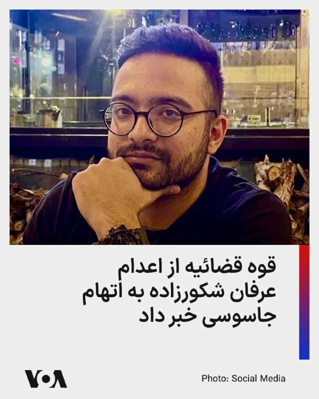

🔺اعدام یک دانشجوی نخبه توسط دستگاه قضایی به اتهام ادعایی «جاسوسی»

◾️قوه قضائیه اعلام کرد عرفان شکورزاده، به اتهام همکاری با سازمان اطلاعات مرکزی آمریکا و موساد اعدام شده است.

ادعا شده او در یکی از سازمان‌های علمی فعال در حوزه ماهواره جذب شده بود و اطلاعات طبقه‌بندی‌شده را در اختیار سرویس‌های خارجی قرار داده است.

◾️صدای آمریکا پیش‌تر گزارش داده بود منابع حقوق بشری شکورزاده را دانشجوی نخبه ۲۹ ساله دانشگاه علم و صنعت معرفی کرده و گفته بودند او پس از ماه‌ها سلول انفرادی و اعترافات اجباری، به اعدام محکوم شده بود.

◾️جمهوری اسلامی از آغاز جنگ با آمریکا و اسرائیل در ۹ اسفند ۱۴۰۴، دستکم ۳۱ تن را به بهانه حضور در اعتراضات یا عضویت در گروه‌های مخالف یا «جاسوسی» اعدام کرده است.

⬇️ بیشتر بخوانید:
https://ir.voanews.com/a/8148759.html

## FarsiVOA — post 217399

  

وزارت امور خارجه عربستان سعودی، تداوم حملات به اراضی و آب‌های سرزمینی امارات متحده عربی، قطر و کویت را «خائنانه» توصیف و حمایت خود از امنیت و ثبات کشورهای عربی خلیج فارس را اعلام کرد.

در بیانیه وزارت امور خارجه عربستان سعودی، این حملات به شدت محکوم شده، اما به منشأ آن اشاره‌ای نشده است. در این بیانیه، عربستان همچنین خواستار توقف فوری هرگونه تلاش برای «بستن تنگه هرمز» یا اختلال در مسیرهای آبی بین‌المللی شد و بر اهمیت پایبندی به حفاظت از مسیرهای دریایی تأکید کرده است.

در تداوم حملات موشکی و پهپادی جمهوری اسلامی به کشورهای منطقه، روز یکشنبه ۲۰ اردیبهشت نیز امارات اعلام کرد که پدافند هوایی این کشور با دو پهپاد منتسب به جمهوری اسلامی مقابله کرده است.

همزمان، کویت از شناسایی چند پهپاد «متخاصم» در حریم هوایی خود و مقابله با آن‌ها خبر داد، و رسانه‌ها از اصابت یک پرتابه ناشناس به یک کشتی در شمال شرق دوحه، پایتخت قطر خبر دادند.
@FarsiVOA

## FarsiVOA — post 217398

  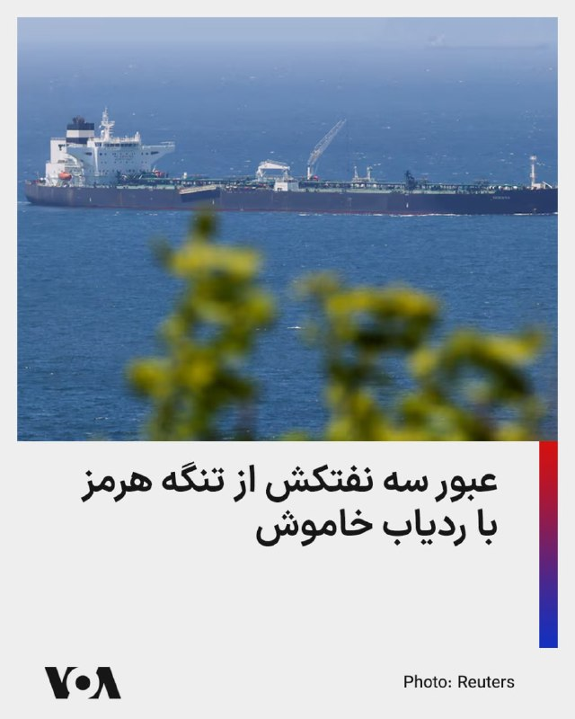

رویترز به نقل از داده‌های شرکت کپلر و ال‌اس‌ای‌جی گزارش داد سه نفتکش حامل نفت خام، هفته گذشته با خاموش کردن سامانه‌های ردیابی خود از تنگه هرمز خارج شده‌اند؛ اقدامی که به نوشته رویترز برای کاهش خطر حملات جمهوری اسلامی انجام شده است.

بر اساس این گزارش، دو نفتکش بزرگ «آگیوس فانوریوس ۱» و «کیارا ام» روز یکشنبه از تنگه عبور کردند و هرکدام دو میلیون بشکه نفت خام عراق حمل می‌کردند. آگیوس فانوریوس ۱ به سمت ویتنام در حرکت است و قرار است محموله خود را ۲۶ مه در پالایشگاه نگی سون تخلیه کند.

نفتکش سوم، «بصره انرژی»، پیش‌تر دو میلیون بشکه نفت خام آپر زاکوم را از پایانه زرکوی ادنوک بارگیری کرده بود، ششم مه از تنگه خارج شد و دو روز بعد محموله را در فجیره تخلیه کرد.

به نوشته رویترز شرکت ادنوک و خریداران آن در روزهای اخیر چند نفتکش حامل نفت خام را از تنگه هرمز عبور داده‌اند تا نفتی را که به دلیل درگیری‌های خاورمیانه در خلیج فارس گرفتار مانده بود، جابه‌جا کنند.
@FarsiVOA

## FarsiVOA — post 217397

  

بنیامین نتانیاهو نخست‌وزیر اسرائیل اعلام کرد معتقد است که مجتبی خامنه‌ای، رهبر جمهوری اسلامی، زنده است؛ اما به‌عنوان جانشین پدرش که نهم اسفند در حمله مشترک آمریکا و اسرائیل کشته شد، اقتدار کمتری دارد.

نتانیاهو به شبکه سی‌بی‌اس آمریکا در پاسخ به پرسشی درباره نظرش پیرامون وضعیت جسمانی و میزان نفوذ عملیاتی مجتبی خامنه‌ای گفت: «فکر می‌کنم او زنده است. این‌که وضعیتش چگونه است، گفتنش سخت است، می‌دانید؟ او در یک پناهگاه یا مکانی مخفی پنهان شده است.»

نخست‌وزیر اسرائیل افزود که مجتبی «در تلاش است اقتدار خود را اعمال کند»، اما به عقیده نتانیاهو، این اقتدار در مقایسه با اقتداری که علی خامنه‌ای داشت، کمتر است.

پیشتر وال‌استریت ژورنال در گزارشی نوشت مجتبی خامنه‌ای که در انظار عمومی دیده نمی‌شود، درباره مذاکرات سکوت کرده و مشخص نیست تا چه اندازه در تصمیم‌گیری واقعی حضور دارد.

مقام‌های جمهوری اسلامی می‌گویند دلیل این غیبت، مسائل امنیتی است. به نوشته وال‌استریت ژورنال، آن‌ها می‌گویند اسرائیل پیش از آتش‌بس، مقام‌های ارشد جمهوری اسلامی را هدف قرار می‌داد و مجتبی خامنه‌ای همچنان در فهرست اهداف اسرائیل قرار دارد.
@FarsiVOA

## DW_Farsi — post 124546

  

🔶 نتانیاهو: مجتبی خامنه‌ای زنده است ولی قدرت و نفوذ پدرش را ندارد

بنیامین نتانیاهو، نخست‌وزیر اسرائیل، می‌گوید که باور دارد مجتبی خامنه‌ای، رهبر جمهوری اسلامی ایران، هنوز زنده است، با وجود آن‌که از زمان معرفی او به‌ عنوان جانشین پدرش، علی خامنه‌ای در اواخر اسفند سال گذشته، در انظار عمومی دیده نشده و پیامی صوتی یا تصویری از او نیز منتشر نشده است.

نتانیاهو در گفت‌وگو با برنامه "۶۰ دقیقه" شبکه سی‌بی‌اس، در پاسخ به پرسشی درباره وضعیت جسمانی و میزان نفوذ عملیاتی مجتبی خامنه‌ای گفت: «فکر می‌کنم او زنده است. اما این‌که حالش چگونه است، سخت می‌شود گفت. او در یک پناهگاه یا مکان مخفی پنهان شده است.»

نتانیاهو همچنین گفت که مجتبی خامنه‌ای تلاش می‌کند "اقتدار خود را تثبیت کند"، اما میزان نفوذ و قدرت او را کمتر از پدرش، علی خامنه‌ای، ارزیابی کرد.

مقام‌های جمهوری اسلامی در باره وضعیت مجتبی‌ خامنه‌ای اطلاعات دقیقی ارائه نمی‌کنند.

@dw_farsi

## DW_Farsi — post 124545

  

🔶 برگزاری نشست چندملیتی وزیران دفاع درباره تنگه هرمز با میزبانی فرانسه و بریتانیا

به گفته دولت بریتانیا، این کشور در همراهی با فرانسه روز سه‌شنبه، ۱۲ مه، میزبان نشست چندملیتی وزیران دفاع درباره برنامه‌های نظامی برای بازگرداندن جریان تجارت از طریق تنگه هرمز خواهد بود.

این اعلام از سوی بریتانیا چند ساعت پس از آن صورت گرفت که ایران به لندن و پاریس درباره اعزام ناوهای جنگی به منطقه هشدار داد.

وزارت دفاع بریتانیا روز یکشنبه اعلام کرد که جان هیلی، وزیر دفاع، همراه با همتای فرانسوی خود، کاترین ووترن، ریاست نخستین نشست وزیران دفاع مأموریت چندملیتی را با حضور بیش از ۴۰ کشور برعهده خواهد داشت.

این نشست مجازی در ادامه گردهمایی دو روزه برنامه‌ریزان نظامی در لندن در ماه آوریل برگزار می‌شود؛ نشستی که در آن جزئیات عملیاتی مأموریتی چندملیتی به رهبری بریتانیا و فرانسه برای حفاظت از کشتیرانی در این آبراه راهبردی پس از برقراری یک آتش‌بس پایدار بررسی شد.

جان هیلی گفت: «ما در حال تبدیل توافق‌های دیپلماتیک به برنامه‌های عملی نظامی برای بازگرداندن اعتماد به کشتیرانی از طریق تنگه هرمز هستیم.»

@dw_farsi

## DW_Farsi — post 124544

  

🔶 نرگس محمدی با تودیع "وثیقه سنگین" برای مداوا به تهران منتقل شد

بنیاد نرگس محمدی روز یکشنبه، ۲۰ اردیبهشت، اعلام کرد که این فعال حقوق بشر و برنده جایزه نوبل صلح، "پس از ۱۰ روز بستری در بیمارستانی در زنجان، با تودیع وثیقه سنگین و تعویق در اجرای حکم، با آمبولانس به بیمارستان پارس تهران منتقل و جهت درمان فوری توسط تیم پزشکی خود بستری شد".

انتقال محمدی پس از روزها درخواست و هشدار خانواده و نزدیکانش درباره وضعیت بحرانی سلامتی‌اش انجام شد.

بنا بر داده‌های بنیاد نرگس محمدی حکم زندان او با قرار وثیقه به حالت تعلیق درآمده، اما مدت این تعلیق مشخص نیست.

محمدی که از آذرماه در زندان زنجان محبوس بود، اواسط اردیبهشت دو بار بیهوش شده و به بیمارستان محلی منتقل شده بود.

بیانیه بنیاد محمدی می‌گوید که تعلیق حکم کافی نیست و نرگس محمدی به "مراقبت دائمی و تخصصی" نیاز دارد.

این بیانیه تأکید می‌کند: ««باید اطمینان حاصل کنیم که او هرگز برای گذراندن ۱۸ سال باقی‌مانده محکومیتش به زندان بازگردانده نشود. اکنون زمان آن است که آزادی بی‌قید و شرط او و لغو تمام اتهام‌ها مطالبه شود.»

@dw_farsi

## DW_Farsi — post 124543

  

🔶عرفان شکورزاده به اتهام "جاسوسی برای موساد و سیا" اعدام شد

میزان، خبرگزاری قوه قضائیه جمهوری اسلامی، از اعدام عرفان شکورزاده به اتهام "همکاری اطلاعاتی با موساد و سیا" خبر داد.

طبق این گزارش، شکورزاده که در یک مجموعه علمی مرتبط با پروژه‌های ماهواره‌ای فعالیت می‌کرد، متهم شده بود که "به‌صورت آگاهانه با سرویس‌های اطلاعاتی اسرائیل و آمریکا ارتباط برقرار کرده و اطلاعات طبقه‌بندی‌شده را در اختیار آن‌ها قرار داده است".

در گزارش میزان ادعا می‌شود که ارتباط شکورزاده ابتدا از طریق "ایمیل و فرم همکاری موساد" آغاز شد و بعداً از طریق "لینکدین، واتساپ و گوگل‌میت" ادامه یافت. طبق ادعای این گزارش، "فردی که خود را ایرانی مقیم کانادا معرفی کرده بود، در واقع افسر موساد" معرفی شده است.

به ادعای مقام‌های قضایی، شکورزاده "اطلاعاتی درباره محل کار، پروژه‌های ماهواره‌ای، کارکنان، شماره تماس‌ها، ساختار پروژه‌ها و جزئیات فنی را منتقل می‌کرده و در مقابل، ارز دیجیتال دریافت می‌کرده است".

@dw_farsi

## DW_Farsi — post 124542

  

🔶در پی رد پاسخ ایران از سوی آمریکا قیمت نفت افزایش یافت

پس از مردودشمرده شدن پاسخ جمهوری اسلامی ایران به پیشنهاد صلح آمریکا از سوی دونالد ترامپ، قیمت نفت روز دوشنبه ۱۱ مه (۲۱ اردیبهشت) به‌طور قابل‌توجهی افزایش پیدا کرد.

نفت برنت دریای شمال ۳٫۱۴ درصد رشد قیمت پیدا کرد و به ۱۰۴٫۴۷ دلار در هر بشکه رسید، در حالی که نفت سبک آمریکا (WTI) نیز با افزایش ۳٫۲۴ درصدی به ۹۸٫۵۱ دلار رسید.

پس از آن‌که رئیس‌جمهور آمریکا روز یکشنبه پاسخ ایران به پیشنهاد صلح واشنگتن را "کاملاً غیرقابل قبول" توصیف کرد، امیدها به پایان سریع درگیری‌هایی که ده هفته پیش شروع شد و همچنین بازگشایی تنگه هرمز، مسیر حیاتی انتقال نفت، کاهش یافت،

اکنون توجه‌ها به سفر ترامپ به پکن در روز چهارشنبه معطوف شده است؛ جایی که طبق گفته منابع دولتی آمریکا، او قرار است با شی جین‌پینگ، رهبر چین، درباره ایران نیز گفت‌وگو کند.

@dw_farsi

## DW_Farsi — post 124541

  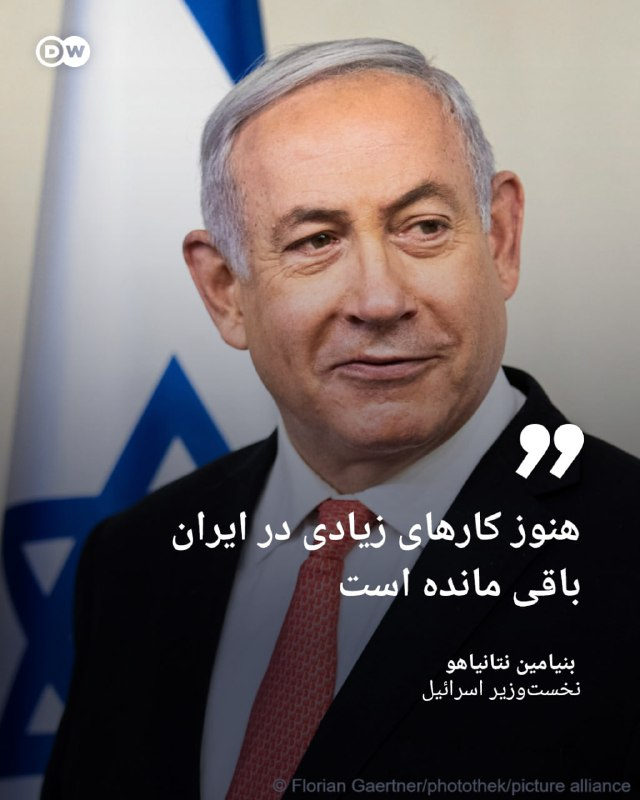

🔶نتانیاهو: هنوز کارهای زیادی در ایران باقی مانده است

بنیامین نتانیاهو، نخست‌وزیر اسرائیل، روز یکشنبه، ۱۰ مه (۲۰ اردیبهشت) در گفت‌وگو با برنامه "۶۰ دقیقه" شبکه آمریکایی سی‌بی‌اس گفت که "هنوز کارهای زیادی" در ایران باقی مانده و رئیس‌جمهور آمریکا، با او درباره اهمیت نابودی ذخایر اورانیوم با غنای بالا در ایران هم‌نظر است.

نخست‌وزیر اسرائیل با بیان این که جنگ اخیر با ایران "دستاوردهای بزرگی" داشته، افزود: «این جنگ اما هنوز پایان نیافته، زیرا هنوز تأسیسات غنی‌سازی اورانیومی هست که باید برچیده شوند. هنوز نیروهای نیابتی وجود دارند که ایران از آنها حمایت می‌کند و موشک‌های بالستیکی که آنها می‌خواهند تولید کنند. ما بخش زیادی از آن را تضعیف کردیم، اما کارهایی باقی مانده است که باید انجام شود.»

@dw_farsi

## DW_Farsi — post 124540

  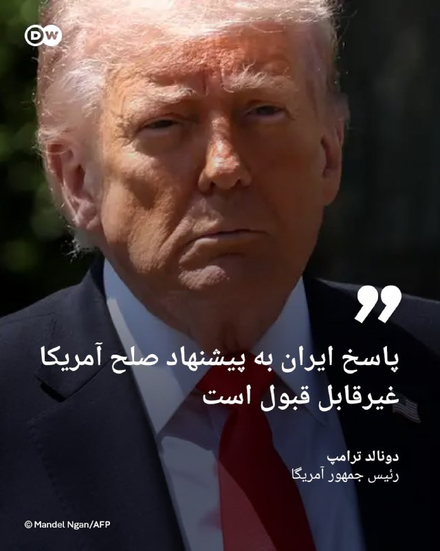

🔶 ترامپ: پاسخ ایران به پیشنهاد صلح آمریکا غیرقابل قبول است

دونالد ترامپ، رئیس جمهور روز یکشنبه، ۱۰ مه (۲۰ اردیبهشت) پاسخ ایران به طرح پیشنهادی واشنگتن را غیرقابل خواند. او گفت: «این پاسخ نظر من را جلب نکرد و کاملاَ مردود است.»

ترامپ اشاره‌ای به جزئیات پاسخ تهران نکرد و نگفت که با کدام بخش آن مخالف است.

شبکه المیادین که نزدیک به جمهوری اسلامی است، نوشته پاسخ ایران شامل درخواست برای پایان دادن به محاصره دریایی و آزادی صادرات نفت است.

پایان فوری جنگ و تضمین‌هایی در باره آتش‌بس در لبنان به علاوه لغو تحریم‌های آمریکا و آزادسازی دارایی‌های بلوکه‌شده ایران نیز در پاسخ جمهوری اسلامی به طرح ۱۴ ماده‌ای دولت ترامپ موضوعات محوری هستند. پذیرش "مدیریت جدیدی" بر تنگه هرمز از سوی ایران نیز از دیگر خواسته‌های تهران است.

صدا و سیمای جمهوری اسلامی نیز به نقل از یک مقام مسئول گزارش داده است که تهران در پاسخ خود "بر ضرورت پرداخت خسارت‌های جنگ توسط آمریکا و پذیرش حاکمیت ایران بر تنگه هرمز تأکید داشته است".

@dw_farsi

## Persian_Trend_Official — post 13882

  

⭕️ تصویری از عرشه ناوشکن یو‌اس‌اس جان فین (DDG 113) که پشت سر ناوشکن یو‌اس‌اس میلیوس (DDG 69) و یو‌اس‌ان‌اس کارل براشیر (T-AKE-7) و ناو هواپیمابر جورج اچ.دبلیو. بوش (CVN 77) در دریای عرب در حال حرکت است.

طبق گفته سنتکام، بیش از 20 ناو جنگی ارتش این کشور در حال اجرای محاصره علیه ایران هستند. نیروهای سنتکام 61 کشتی تجاری را تغییر مسیر داده و 4 کشتی را از کار انداختند تا اطمینان حاصل شود که قوانین محاصره رعایت می‌شوند.

📝 Nick

📌 @persian_trend_official
پرشین ترند | متفاوت‌ترین کانال نظامی

## Persian_Trend_Official — post 13881

  

⭕️ اظهارات جنجالی ظهره‌وند درباره سلاح سری ایران: من جاها و ظرفیت هایی رو دیدم که اتفاقی میوفته که بمب اتم جلوش ترقه است/ شما میتونید زمان رو پشت سر بزارید، چیزی که در چند ثانیه از تهران تا واشنگتن برود/میشه یه کارهایی کرد که بمب اتم جلوش بچه بازیه! پ.ن:…

## Persian_Trend_Official — post 13880

  <a href="telegram/content/Persian_Trend_Official_13880_1778487725.mp4">🎬 Download video</a>

⭕️ تصاویر ماهواره‌ای یک نفتکش بزرگ را در تنگه هرمز نشان می‌دهند که بنظر می‌رسد پس از یک حمله احتمالی، ردی از نفت را نشت می‌دهد. فعالیت قایق‌های تندرو کوچک نیز در نزدیکی آن دیده می‌شود.

📝 Nick

📌 @persian_trend_official
پرشین ترند | متفاوت‌ترین کانال نظامی

## Persian_Trend_Official — post 13879

  <a href="telegram/content/Persian_Trend_Official_13879_1778487726.mp4">🎬 Download video</a>

هیچکس مثل جبهه پایداری به اهداف اسرائیل کمک نمیکنه !
فکر میکنم در حق این نماینده های خدوم جفا شده 😄

📌 @persian_trend_official
پرشین ترند | متفاوت‌ترین کانال نظامی

## Persian_Trend_Official — post 13878

  <a href="telegram/content/Persian_Trend_Official_13878_1778487729.mp4">🎬 Download video</a>

⭕️ اظهارات جنجالی ظهره‌وند درباره سلاح سری ایران:

من جاها و ظرفیت هایی رو دیدم که اتفاقی میوفته که بمب اتم جلوش ترقه است/ شما میتونید زمان رو پشت سر بزارید، چیزی که در چند ثانیه از تهران تا واشنگتن برود/میشه یه کارهایی کرد که بمب اتم جلوش بچه بازیه!

پ.ن: شعر گوی اعظم

📝 Nick

📌 @persian_trend_official
پرشین ترند | متفاوت‌ترین کانال نظامی

## Persian_Trend_Official — post 13877

  <a href="telegram/content/Persian_Trend_Official_13877_1778487731.mp4">🎬 Download video</a>

⭕️ به گفته GB News، نخست‌وزیر بریتانیا کیر استارمر «به نظر می‌رسد این هفته استعفا دهد.»

📝 Nick

📌 @persian_trend_official
پرشین ترند | متفاوت‌ترین کانال نظامی

## Persian_Trend_Official — post 13876

  

⭕️ علی مطهری، نایب‌رئیس پیشین مجلس شورای اسلامی:

«ما داریم کار بزرگی انجام می‌دهیم که در تاریخ ثبت خواهد شد و آن این است که داریم دنیا را از شر دو آدم روانی، ترامپ و نتانیاهو نجات می‌دهیم و انشاالله به نتیجه برسیم.»

📝 Nick

📌 @persian_trend_official
پرشین ترند | متفاوت‌ترین کانال نظامی

## Persian_Trend_Official — post 13875

  

اعدام عرفان شکورزاده؛ جمهوری اسلامی دانشجوی نخبه دانشگاه علم و صنعت را به «همکاری با موساد و سیا» متهم کرد

قوه قضائیه جمهوری اسلامی اعلام کرد عرفان شکورزاده، فرزند جعفر، به اتهام «همکاری با سرویس اطلاعاتی آمریکا و اسرائیل» اعدام شده است.

به ادعای قوه قضائیه، او از طریق یک سازمان علمی فعال در حوزه ماهواره جذب شده و اطلاعات طبقه‌بندی‌شده را در اختیار سرویس‌های خارجی قرار داده بود. جمهوری اسلامی همچنین مدعی شده است که عرفان شکورزاده در سه مرحله با موساد و سیا ارتباط برقرار کرده و از او تجهیزات و اطلاعات مرتبط با فعالیتش در یک مرکز علمی به دست آمده است.

آموزشکده توانا پیش‌تر گزارش داده بود که عرفان شکورزاده، دانشجوی ۲۹ ساله و نخبه دانشگاه علم و صنعت، پس از ماه‌ها نگهداری در سلول انفرادی و تحت فشار برای اخذ اعترافات اجباری، به اعدام محکوم شده بود.

چند روز پیش نیز گزارش شده بود که عرفان شکورزاده، دانشجوی کارشناسی ارشد مهندسی هوافضا ـ فناوری ماهواره دانشگاه علم و صنعت ایران، از زندان اوین به قزل‌حصار منتقل شده است؛ انتقالی که نگرانی‌ها درباره اجرای قریب‌الوقوع حکم اعدام او را افزایش داده بود.

بر اساس اطلاعات رسیده به آموزشکده توانا، او را به بهانه «ملاقات با ضابط» از بند خارج کرده و سپس به زندان قزل‌حصار منتقل کرده بودند. منابع مطلع گفته بودند که او پیش‌تر در وضعیت «توقف حکم اعدام» قرار داشته، اما انتقال ناگهانی‌اش به قزل‌حصار، نگرانی‌ها از اجرای حکم را تشدید کرده بود.

عرفان شکورزاده، متولد ۱۳۷۶، دانش‌آموخته مهندسی برق دانشگاه تبریز و دانشجوی کارشناسی ارشد دانشگاه علم و صنعت تهران بود. بر اساس سوابق علمی منتشرشده، او در حوزه نرم‌افزارهای تست ماهواره، کنترل و موقعیت‌یابی ماهواره فعالیت پژوهشی داشت و رتبه نخست مقطع کارشناسی ارشد را نیز کسب کرده بود.

طبق اطلاعات منتشرشده، او در بهمن‌ماه ۱۴۰۳ توسط اطلاعات سپاه با اتهام «جاسوسی و همکاری با کشورهای متخاصم» بازداشت شد. منابع نزدیک به پرونده گفته بودند که عرفان شکورزاده حدود ۹ ماه را در سلول انفرادی سپری کرده و تحت فشار و شکنجه برای اخذ اعترافات اجباری قرار داشته است.

در یادداشتی که به گفته منابع نزدیک به پرونده توسط او نوشته شده بود، آمده است:

«من عرفان شکورزاده ۲۹ ساله، یکی از معدود به اصطلاح نخبگانی که حاضر به مهاجرت نشدم.
چند ماه پیش از جنگ ۱۲ روزه، به اتهام واهی جاسوسی و همکاری با کشورهای متخاصم توسط اطلاعات سپاه بازداشت شدم و در مدت ۸ ماه و نیم شکنجه و زندان انفرادی مجبور به اعتراف اجباری شدم.
نگذارید یک جان بی‌گناه دیگر در سکوت و بی‌خبری از دست برود.»

#عرفان_شکورزاده #نه_به‌_اعدام #نه_به_جمهوری_اسلامی

@Tavaana_TavaanaTech

## Persian_Trend_Official — post 13874

  <a href="telegram/content/Persian_Trend_Official_13874_1778487735.mp4">🎬 Download video</a>

کانال تلگرامی صدا و سیما اولین تصاویر از عرفان شکورزاده که بعنوان جاسوس دو جانبه سیا و موساد متهم کرده بودنش و صبح امروز اورا اعدام کردن منتشرکرد.

☆Phantom☆

📌 @persian_trend_official
پرشین ترند | متفاوت‌ترین کانال نظامی

## Persian_Trend_Official — post 13873

عرفان شکورزاده به اتهام جاسوس مشترک سیا و موساد در ایران صبح امروز اعدام شد.

میزان خبرگزاری رسمی قوه قضائیه /از ارتباطات گسترده عرفان شکورزاده با سازمان های موساد و سیا در فروش اطلاعات علمی کشور

براساس محتویات پرونده، نامبرده به عنوان پروژه و با توجه به تخصصی که داشته، جذب یکی از سازمان‌های علمی کشور که در حوزه ماهواره فعالیت داشته، شده بود.

محکوم‌علیه در حین همکاری با مجموعه مهم علمی کشور، اقدام به ارتباط‌گیری با سرویس‌های جاسوسی دشمن از جمله CIA و به طور ویژه سرویس اطلاعاتی تروریستی موساد کرد.

نام‌برده با سرویس‌های اطلاعاتی دشمن در سه مرحله اقدام به ارتباط‌گیری کرده که مرحله اول و سوم مربوط به موساد و مرحله دوم مربوط به سیا بوده است.

براساس مفاد پرونده، محکوم‌علیه بصورت آگاهانه با میل خود اقدام به ارتباط با سرویس‌ جاسوسی آمریکا CIA و موساد کرده و اطلاعات در اختیارش را نزد عوامل دشمن بازگو کرده است.

🔹اطلاعاتی که محکوم‌علیه تلاش داشته به سرویس‌های دشمن ارائه کند؛ دارای طبقه‌بندی بوده است.

متن از خبرگزاری میزان می‌باشند....

☆Phantom☆

📌 @persian_trend_official
پرشین ترند | متفاوت‌ترین کانال نظامی

## Persian_Trend_Official — post 13872

  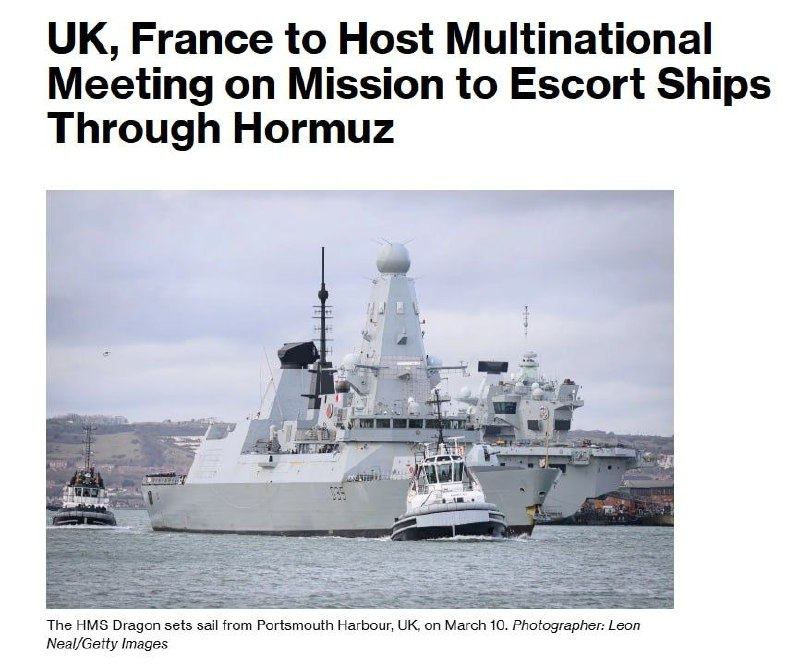

📰بلومبرگ:

بیش از ۴۰ کشور قرار است روز دوشنبه برای بحث در مورد مشارکت‌های نظامی در یک ماموریت به رهبری اروپا جهت اسکورت کشتی‌های تجاری از تنگه هرمز پس از برقراری آتش‌بس پایدار، دیدار کنند.

عملیات دفاعی دریایی پیشنهادی که به رهبری بریتانیا و فرانسه است.

انتظار می‌رود شامل عملیات پاک‌سازی مین، اسکورت‌های دریایی و پلیس هوایی باشد که هدف آن حفاظت و اطمینان‌بخشی به کشتی‌رانی تجاری در منطقه است.

☆Phantom☆

📌 @persian_trend_official
پرشین ترند | متفاوت‌ترین کانال نظامی

## Persian_Trend_Official — post 13871

  

ایران به فرانسه و بریتانیا هشدار داد هرگونه حضور نظامی در تنگه هرمز با پاسخ مستقیم مواجه خواهد شد.

کاظم غریب‌آبادی، معاون وزیر امور خارجه ایران، اعلام کرد، استقرار ناوشکن‌ها و شناورهای جنگی فرانسه یا بریتانیا تحت عنوان «حفاظت از کشتیرانی» اقدامی تحریک‌آمیز و دخالت در امنیت منطقه تلقی می‌شود.

وی در پیامی در شبکه اجتماعی ایکس نوشت:
«تنگه هرمز قلمرو نفوذ قدرت‌های فرامنطقه‌ای نیست و جمهوری اسلامی ایران اجازه نخواهد داد هیچ طرف خارجی امنیت این آبراه راهبردی را به چالش بکشد.»

غریب‌آبادی تأکید کرد هرگونه حضور نظامی هماهنگ با «اقدامات غیرقانونی» آمریکا، با واکنش «فوری، قاطع و پشیمان‌کننده» نیروهای مسلح ایران روبه‌رو خواهد شد.

این مقام ایرانی همچنین هشدار داد تهران هر تحرک نظامی خارجی در اطراف تنگه هرمز را به‌دقت رصد می‌کند و مسئولیت هرگونه تشدید تنش بر عهده کشورهای مداخله‌گر خواهد بود.
☆Phantom☆

📌 @persian_trend_official
پرشین ترند | متفاوت‌ترین کانال نظامی

## Persian_Trend_Official — post 13869

در پی اظهارات مقام‌های نظامی فرانسه درباره اعزام ناو هواپیمابر «شارل دوگل» به دریای سرخ و خلیج عدن، حسین شریعتمداری، مدیرمسئول روزنامه کیهان، خواستار واکنش «پیشدستانه» ایران علیه ناوهای فرانسه و بریتانیا شد...

شریعتمداری در سرمقاله روزنامه کیهان نوشت اعزام این ناو در چارچوب همکاری‌های نظامی پاریس و لندن و با هدف «تقویت آزادی کشتیرانی در منطقه تنگه هرمز» انجام شده است. او این اقدام را «دخالت آشکار در امور حاکمیتی ایران» توصیف کرد و آن را معادل «اعلام جنگ» دانست.

وی همچنین از مقام‌های جمهوری اسلامی خواست دو اقدام فوری را در دستور کار قرار دهند؛
1️⃣صدور بیانیه‌ای خطاب به شهروندان
کشورهای اروپایی درباره هزینه‌های نظامی دولت‌هایشان در حمایت از آمریکا و اسرائیل،

2️⃣ «مقابله پیشدستانه» با ناوهای جنگی فرانسه و بریتانیا.

شریعتمداری مدعی شد که این ناوها در برد موشک‌های دوربرد ایران قرار دارند و همچنین به توانایی نیروهای انصارالله یمن در دریای سرخ و باب‌المندب اشاره کرد.

☆Phantom☆

📌 @persian_trend_official
پرشین ترند | متفاوت‌ترین کانال نظامی

## RadioFarda — post 157050

  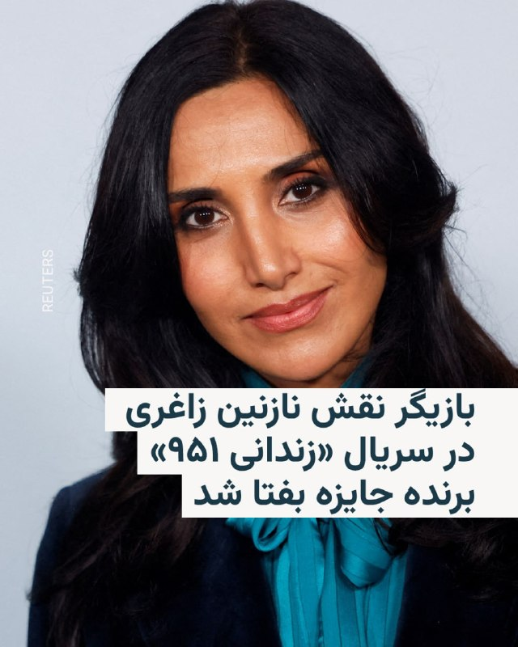

🔸نرگس رشیدی، بازیگر ایرانی-آلمانی، به‌خاطر بازی در نقش نازنین زاغری-رتکلیف در سریال «زندانی ۹۵۱»، برنده جایزه بهترین بازیگر زن نقش اول بفتا (جوایز آکادمی فیلم بریتانیا) شد.

🔸این سریال که نوامبر پارسال از نت‌فلیکس هم پخش شد، بر اساس داستان واقعی زندگی نازنین زاغری و از روی کتابی که او از خاطرات زندانی‌شدنش برای شش سال در ایران نوشته، ساخته شده است.

🔸خانم زاغری، کارمند بنیاد تامسون رویترز، فروردین ۱۳۹۵ در پایان سفرش به ایران که برای دیدار با خانواده خود رفته بود، در فرودگاه تهران به اتهام «جاسوسی» بازداشت و به پنج سال زندان محکوم شد.

🔸نرگس رشیدی برای آماده شدن برای این نقش، پیش از ساخت این سریال، خاطرات در شُرف انتشار زاغری-رتکلیف را که با همکاری ریچارد همسرش نوشته شده است، مطالعه کرد.

🔸او که در ایران متولد شده و تا هفت سالگی آن‌جا زندگی کرده است، این جایزه را به نازنین زاغری-رتکلیف و خانواده‌اش تقدیم کرد.

@RadioFarda

## RadioFarda — post 157049

  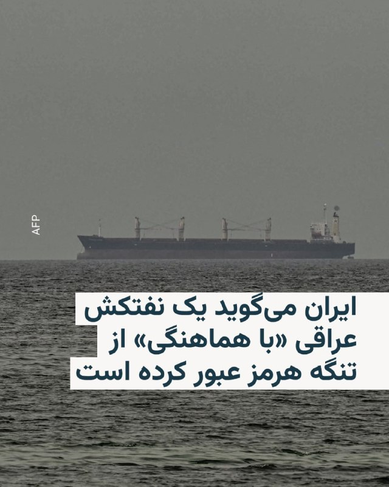

🔸ایران می‌گوید به یک نفتکش عراقی که حامل نفت خام عراق است، اجازه داده تا از تنگه هرمز عبور کند.

🔸خبرگزاری تسنیم، وابسته به سپاه پاسداران روز دوشنبه ۲۱ اردیبهشت‌ماه اعلام کرد که یک فروند نفتکش وی‌ال‌سی‌سی (VLCC) به نام «آگوس فانوریوس ۱/AGOIS FANOURIOS I» روز یکشنبه از مسیر تعیین‌شده ایران در تنگه هرمز عبور کرد.»

🔸بنا بر این گزارش این نفتکش که حامل نفت خام عراق است و به سمت ویتنام حرکت می‌کند، هم‌اکنون در دریای عمان قرار دارد.

🔸روز شنبه نیز همزمان با دیدار وزیر خارجه آمریکا با نخست وزیر قطر در میامی یک نفتکش قطری حامل گاز مایع در راه پاکستان از تنگه هرمز گذشت.

🔸خبرگزاری رویترز به نقل از منابعی نوشت که گذر این نفتکش «با تأیید» جمهوری اسلامی صورت می‌گیرد و اقدامی برای اعتمادسازی با دو کشور قطر و پاکستان که هر دو در جنگ آمریکا و اسرائیل با ایران نقش میانجی را ایفا کرده‌اند.

@RadioFarda

## RadioFarda — post 157048

ترامپ پاسخ ایران درباره توافق پایان جنگ را «کاملاً غیر قابل قبول» خواند

🔸رئیس‌جمهور آمریکا شامگاه یکشنبه ۲۰ اردیبهشت، پاسخ ایران به طرح پیشنهادی واشینگتن برای پایان جنگ را «کاملاً غیر قابل‌ قبول» توصیف کرد.

🔸دونالد ترامپ در پیام کوتاهی در شبکه اجتماعی خود، تروث سوشال، نوشت: «من همین حالا پاسخ به‌اصطلاح "نمایندگان" ایران را خواندم. از آن خوشم نمی‌آید. کاملاً غیرقابل‌قبول است!»

🔸ایران پیش‌تر در همان روز به تازه‌ترین پیشنهاد صلح واشینگتن پاسخ داده و هم‌زمان هشدار داده بود که هرگونه حملهٔ جدید آمریکا را تلافی خواهد کرد و اجازه حضور بیشتر ناوهای جنگی خارجی در تنگهٔ هرمز را نخواهد داد.

🔸ترامپ جزئیاتی از پیشنهاد متقابل تهران به طرح آمریکا ارائه نکرده، اما پیام کوتاه او در تروث‌سوشال نشان می‌دهد که پیشنهادهای جمهوری اسلامی ایران را به‌طور کامل رد می‌کند.

🔸رئیس‌جمهور آمریکا پیش‌تر نیز پیشنهادات ارائه‌شده توسط حکومت ایران را غیر قابل قبول و ناکافی خوانده بود.

🔸آمریکا و ایران بعد از یک دور مذاکره حضوری در پاکستان که چند روز بعد از برقراری آتش‌بس در اسلام‌آباد برگزار شد، با ارسال طرح‌های پیشنهادی متقابل مشغول مذاکره بودند. آمریکا بعد از بی‌نتیجه ماندن مذاکره حضوری، محاصره دریایی بنادر ایران را آغاز کرد، در حالی که ایران از ابتدای جنگ تنگهٔ هرمز را مسدود کرده است.

🔸این مذاکرات برای پایان دادن به جنگی است که از ۹ اسفند پارسال با حملات آمریکا و اسرائیل به ایران آغاز و خیلی زود به یک درگیری منطقه‌ای تبدیل شد.

🔸بر اساس گزارش خبرگزاری رسمی دولت ایران، ایرنا، پاسخ تهران به طرح آمریکا، بر پایان جنگ «در همه جبهه‌ها، به‌ویژه لبنان»، جایی که اسرائیل همچنان با این گروه مورد حمایت ایران درگیر است، و نیز بر «تضمین امنیت کشتیرانی» تمرکز دارد.

🔸نسخه کامل این گزارش را در وب‌سایت رادیوفردا بخوانید.

@RadioFarda

## RadioFarda — post 157047

عرفان شکورزاده، دانشجوی ۲۹ ساله، به اتهام «جاسوسی» برای آمریکا و اسرائیل اعدام شد

🔸خبرگزاری رسمی قوه قضائیه، میزان، روز دوشنبه ۲۱ اردیبهشت گزارش داد که ایران یک متهم دیگر با ادعای «جاسوسی مشترک» برای آمریکا و اسرائیل را اعدام شد.

🔸این خبرگزاری هویت فرد اعدام‌شده را «عرفان شکورزاده» اعلام و ادعا کرده که او «با دشمن در فروش اطلاعات علمی کشور» همکاری داشته است.

🔸میزان بدون اشاره به شغل این متهم، افزوده که او در چارچوب یک «پروژه» و «با توجه به تخصصی که داشته، جذب یکی از سازمان‌های علمی کشور شده بود که در حوزهٔ ماهواره فعالیت داشته است».

🔸بر اساس این ادعا، فرد اعدام‌شده «آگاهانه» و «با میل خود» در «سه مرحله اقدام به ارتباط‌گیری کرده که مرحله اول و سوم مربوط به موساد و مرحله دوم مربوط به سی‌آی‌ای بوده است».

🔸میزان می‌افزاید: «اطلاعاتی که محکوم‌علیه تلاش داشته به سرویس‌های دشمن ارائه کند، دارای طبقه‌بندی بوده است».

🔸سازمان حقوق بشر ایران در این زمینه گزارش داده که عرفان شکورزاده ۲۹ ساله، دانشجوی کارشناسی ارشد مهندسی هوافضا در دانشگاه علم و صنعت ایران بود.

🔸گزارش‌ها حاکی است که او بهمن سال ۱۴۰۳ به اتهام «جاسوسی و همکاری با کشورهای متخاصم» توسط اطلاعات سپاه پاسداران بازداشت شد و حدود ۹ ماه در سلول انفرادی نگهداری می‌شد و تحت فشار مجبور به «اعتراف اجباری» شد.

🔸نسخه کامل این گزارش را در وب‌سایت رادیوفردا بخوانید.

@RadioFarda

## RadioFarda — post 157046

  

🔸خبرگزاری رسمی قوه قضائیه، میزان، روز دوشنبه ۲۱ اردیبهشت گزارش داد که یک متهم دیگر با ادعای «جاسوسی مشترک» برای آمریکا و اسرائیل اعدام شد.

🔸این خبرگزاری هویت فرد اعدام‌شده را «عرفان شکورزاده» اعلام کرده و گفته که او «با دشمن در فروش اطلاعات علمی کشور» همکاری داشته است.

🔸میزان بدون اشاره به شغل این متهم، گفته که او در چارچوب یک «پروژه» و «با توجه به تخصصی که داشته، جذب یکی از سازمان‌های علمی کشور شده بود که در حوزه ماهواره فعالیت داشته است».

🔸بر اساس این ادعا، فرد اعدام‌شده «آگاهانه» و «با میل خود» در «سه مرحله اقدام به ارتباط‌گیری کرده که مرحله اول و سوم مربوط به موساد و مرحله دوم مربوط به سی‌آی‌ای بوده است».

🔸میزان می‌افزاید: «اطلاعاتی که محکوم‌علیه تلاش داشته به سرویس‌های دشمن ارائه کند، دارای طبقه‌بندی بوده است».

🔸ایران در ماه‌های اخیر با موج تازه‌ای از اعدام‌ها، بازداشت‌ها و صدور احکام سنگین روبه‌رو بوده است؛ موجی که به گفتهٔ نهادها و سازمان‌های حقوق بشری، در فضای جنگ، بحران امنیتی و اعتراضات، به‌عنوان ابزاری برای ایجاد ترس و کنترل جامعه عمل می‌کند.

@RadioFarda

## RadioFarda — post 157045

  

🔸گزارش رسانه‌ها حاکی است که قیمت نفت در بازارهای آسیایی در روز دوشنبه ۲۱ اردیبهشت پس از رد پیشنهادهای ایران از سوی آمریکا برای توافق بر سر پایان جنگ، افزایش یافت.

🔸قیمت نفت برنت با ۴.۵ درصد افزایش به حدود ۱۰۶ دلار به ازای هر بشکه نفت رسید. نفت وست تگزاس اینترمدیت نیز به ۱۰۵ دلار برای هر بشکه رسید.

🔸دونالد ترامپ، رئیس‌جمهور آمریکا، شامگاه یکشنبه بدون ارائه توضیحی، پاسخ ایران به پیشنهادهای واشینگتن برای پایان جنگ بین دو کشور را «کاملاً غیرقابل قبول» خواند و آن را رد کرد.

🔸دلار نیز برای دومین روز متوالی در معاملات آسیایی در برابر ارزهای اصلی تقویت شد.

🔸به گزارش خبرگزاری فرانسه، این روند تحت تأثیر داده‌های قوی اشتغال در آمریکا و تقاضا برای دارایی‌های امن در پی آتش‌بس متزلزل میان آمریکا و ایران بود.

🔸بازارهای سهام آسیایی در روز دوشنبه نیز شاهد کاهش ارزش بودند.

@RadioFarda

## RadioFarda — post 157043

  

🔸روزنامه وال‌استریت جورنال روز دوشنبه ۲۱ اردیبهشت گزارش داد که رئیس‌جمهور آمریکا قصد دارد در سفر هفتهٔ جاری خود به پکن، همتای چینی‌اش را برای میانجی‌گری و پایان جنگ در خاورمیانه تحت فشار بگذارد.

🔸به نوشتهٔ این روزنامه، در حالی که رهبران دو ابرقدرت جهان این هفته با هم دیدار می‌کنند، دونالد ترامپ و شی جین‌پینگ، با حضور سایه‌وار کشوری دیگر بر نشست خود روبه‌رو خواهند بود: ایران.

🔸این دیدار که مدت‌ها انتظارش می‌رفت، پیش‌تر یک‌بار به‌دلیل جنگ آمریکا و اسرائیل با ایران که به بسته شدن تنگهٔ هرمز انجامیده، به تعویق افتاده بود.

🔸وال‌استریت جورنال می‌نویسد که ترامپ مشتاق است از جنگ خاورمیانه عبور کند، جنگی که قدرت داخلی او را تحلیل می‌برد و اقتصاد جهانی را تحت فشار قرار داده است.

🔸به گفتهٔ مقام‌های آمریکایی، او در حالی وارد پکن می‌شود که آماده است چین را تحت فشار بگذارد تا برای میانجی‌گری و دستیابی به توافقی که به این درگیری پایان دهد، کمک کند.

@RadioFarda

## IranianMinds — post 19930

  

🔴 صبح امروز همزمان با اذان صبح جمهوری اسلامی یکی دیگه از جوونای وطنمونو ازمون گرفت

عرفان شکورزاده ۲۹ ساله و نخبه ی دانشگاه علم و صنعت توسط جمهوری اسلامی امروز اعدام شد …

@IranianMinds

## IranianMinds — post 19929

🔴 صدا و سیما:

آخرین پیشنهاد آمریکا رو رد کردیم و پیشنهاد متقابل خودمونو ارائه دادیم.

ما فقط خواستار رفع تحریم‌ها، آزادسازی دارایی‌های مسدود شده ایران، جبران خسارات ناشی از جنگ٬ به رسمیت شناختن نقش ایران در تنگه هرمز و به عقد درآوردن دائمی ملانیا زن‌ ترامپ برای مسعود پزشکیان شدیم ولی آمریکا این پیشنهادات رو هم قبول نکرده و خیلی زیاده خواهه.

@IranianMinds

## IranianMinds — post 19928

  <a href="telegram/content/IranianMinds_19928_1778487743.mp4">🎬 Download video</a>

🔴 نتانیاهو:

در ایران، خیابان‌ها را به اسم من نامگذاری می‌کنند. می‌دانستید؟ خب، البته به اسم رئیس‌جمهور ترامپ هم هست، چون او رهبری مبارزه را برعهده دارد.

من فارسی بلد نیستم ولی میدونم ایرانیا منو «بی بی جون» صدا می‌کنند، بیبی عزیز

@IranianMinds

## IranianMinds — post 19927

  <a href="https://t.me/IranianMinds/19927">📎 Download file</a>

📲#اپلیکیشن اندروید سایت جهانی دربی بت

👍اسپانسر لیگ انگلیس
👍
🔥امکان شارژ امن از طریق کارت بانکی
➖➖➖➖➖➖➖➖➖

🪙همین حالا عضو شوید 👇
https://t.me/+aCbq7yy8QY80NzQ0

## IranianMinds — post 19926

  

😤دنبال یه سایت شرط بندی بین المللی بودی که به ایرانیا خدمات بده؟!
⛔

👍دربی بت همون انتخاب  100%

💎ویژگی های سایت جهانی Derby Bet:

⬅️امکان شارژ امن با کارت بانکی

⬅️واریز اول دوبل شارژ می شوید(بونوس۱۰۰٪)

⬅️پر اپشن ترین سایت فعال در ایران

⬅️تسویه حساب کمتر از 5 دقیقه

⬅️برگشت بخشی از باخت به صورت هفتگی

🚨کد هدیه ثبت نام:GG007

⚠️برای دانلود اپلکیشن کلیک کنید
👉
re21

🔔کانال دربی بت :

🪙https://t.me/+aCbq7yy8QY80NzQ0

## IranianMinds — post 19925

  <a href="telegram/content/IranianMinds_19925_1778487747.mp4">🎬 Download video</a>

🔴 نتانیاهو:

حتی هیتلر هم نمیگفت «مرگ بر آمریکا، مرگ بر بریتانیا.»

@IranianMinds

## IranianMinds — post 19924

  <a href="telegram/content/IranianMinds_19924_1778487749.mp4">🎬 Download video</a>

🔴 نتانیاهو:

فکر می‌کنم مجتبی خامنه‌ای هنوز زنده است. وضعیتش را نمی‌توان دقیق گفت. احتمالا در یک پناهگاه یا جای مخفی قایم شده.

@IranianMinds

## BBCPersian — post 280738

در پی انتشار تصاویر ماهواره‌ای که نشان‌دهنده نشت احتمالی نفت در محدوده‌ای در نزدیکی جزیره خارگ است، سازمان حفاظت محیط زیست ایران می‌گوید: «منشا آلودگی مشاهده‌ شده در اطراف جزیره خارگ ناشی از تخلیه آب توازن آلوده یک نفتکش آسیب‌دیده بوده است.» این نهاد گفت:…

## BBCPersian — post 280737

  

در پی انتشار تصاویر ماهواره‌ای که نشان‌دهنده نشت احتمالی نفت در محدوده‌ای در نزدیکی جزیره خارگ است، سازمان حفاظت محیط زیست ایران می‌گوید: «منشا آلودگی مشاهده‌ شده در اطراف جزیره خارگ ناشی از تخلیه آب توازن آلوده یک نفتکش آسیب‌دیده بوده است.»

این نهاد گفت: «هیچ‌گونه نشت نفت از خطوط لوله، تاسیسات پایانه‌های نفتی و یا سکوهای متعلق به شرکت نفت فلات قاره ایران در جزیره خارگ مشاهده یا گزارش نشده است.»

سه روز پیش یک عکس ماهواره‌ سنتینل پروژه کوپرنیکوس اتحادیه اروپا منتشر شد که به نظر می‌رسید یک لکه بزرگ نفتی در اطراف خارگ را نشان می‌دهد.

روز گذشته هم مدیرعامل شرکت پایانه‌های نفتی ایران ایجاد یک لکه نفتی در سواحل جزیره خارگ را «ادعای کذب و به دور از واقعیت» خواند و گفت: «به محض انتشار این اخبار، گروه‌های متخصص اچ‌اس‌ئی [سلامت و ایمنی]، اداره شیمیایی و آزمایشگاه، همه منطقه را پایش کردند اما حتی کوچک‌ترین موردی یافت نشد.»
تحولات ایران و منطقه را از لینک ⬇️‌ در سایت بی‌بی‌سی فارسی بخوانید:

https://bbc.in/4u5EtI8
📷COPERNICUS SENTINEL-2/Reuters
@BBCPersian

## BBCPersian — post 280736

سخنگوی ارتش اسرائیل، هشدار جدیدی برای جنوب لبنان صادر کرده و به ساکنان ۹ منطقه گفت که پیش از حملات اسرائیل، از این مناطق خارج شوند.

صبح دوشنبه ۲۱ اردیبهشت، اسرائیل کشته شدن یکی از سربازانش را در جنوب لبنان تایید کرد و گزارش‌ها از حملات متقابل حزب‌الله و اسرائیل به مواضع یکدیگر حکایت دارد.

شبکه تلویزیونی الجزیره گزارش کرده که اسرائیل در یک سلسله حملات هوایی چندین شهر در جنوب لبنان را بمباران کرده است.

براساس این گزارش شهرهای کفرتبنیت و شوكين هدف حملات اسرائیل قرار گرفته است.

تازه‌ترین تحولات ایران و منطقه را در صفحه زنده در سایت بی‌بی‌سی فارسی بخوانید:

https://bbc.in/4uJoBeo
@BBCPersian

## BBCPersian — post 280726

در طول دهه‌ها، چتر امنیتی آمریکا در خلیج فارس امری بدیهی و تضمین‌شده تلقی می‌شد، اما جنگ آمریکا و اسرائیل با ایران ممکن است این معادله را تغییر دهد.

در جریان این جنگ و در اوج چالش‌های دفاعی ناشی از حملات موشکی و پهپادی ایران و هدف قرار گرفتن تاسیسات حیاتی کشورهای عضو شورای همکاری خلیج فارس، این کشورها تنها مسیر موشک‌ها را زیر نظر نداشتند، بلکه واکنش‌ واشنگتن را نیز با دقت رصد می‌کردند؛ زیرا خود را در صحنه جنگی یافتند که به گفته مقام‌های منطقه، درباره آن با آن‌ها مشورت نشده بود.

آیا این بحران محدودیت توافق‌های امنیتی میان واشنگتن و کشورهای عرب خلیج فارس را آشکار کرده است؟ آیا این جنگ باعث کاهش وابستگی این کشورها به قدرت نظامی آمریکا خواهد شد یا برعکس، این وابستگی را تقویت خواهد کرد؟

از لینک ⬇️ این مطلب را در سایت بی‌بی‌سی فارسی بخوانید.

https://bbc.in/4wnt5Zu

📸GettyImages/ Universal Images Group via Getty Images/GettyImages/
Reuters/ Anadolu via Getty Images/ AFP via Getty Image
@BBCPersian

## BBCPersian — post 280725

  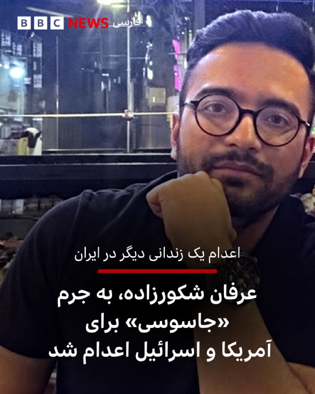

‌دستگاه قضایی ایران می‌گوید که امروز عرفان شکورزاده را به جرم «همکاری با سرویس اطلاعاتی آمریکا و سرویس جاسوسی موساد» اعدام کرده است.

میزان، خبرگزاری قوه قضائیه ایران گفته آقای شکورزاده اقدام به ارائه اطلاعات به «سرویس‌های دشمن» کرده و این اطلاعات «دارای طبقه‌بندی» بوده است.

در روزهای گذشته فعالان حقوق بشر در خصوص احتمال اعدام این زندانی ابراز نگرانی کرده بودند.

به نوشته رسانه‌ها، آقای شکورزاده، ۲۹ ساله و دانشجوی نخبه دانشگاه علم‌وصنعت بوده که حکم اعدام برای او پس از «ماه‌ها نگهداری در سلول انفرادی و اخذ اعترافات اجباری» صادر شده بود.

عرفان شکورزاده در بهمن‌ماه ۱۴۰۳، توسط اطلاعات سپاه بازداشت شد.

پس از جنگ اخیر که نهم اسفند با حملات اسرائیل و آمریکا به ایران آغاز شد، شتاب بیشتری گرفته است.

نهادهای حقوق بشر از افزایش اعدام اظهار نگرانی کرده‌اند و روند دادرسی و شرایط صدور این احکام را ناقض حقوق انسانی می‌دانند.

به گفته گزارشگر حقوق بشر سازمان ملل در امور ایران «مجازات اعدام به‌عنوان ابزارى براى سركوب مخالفت‌هاى سياسی در شرايط جنگى استفاده می‌کند.»

https://bbc.in/3PvLcMo
📷UGC
@BBCPersian

## BBCPersian — post 280724

  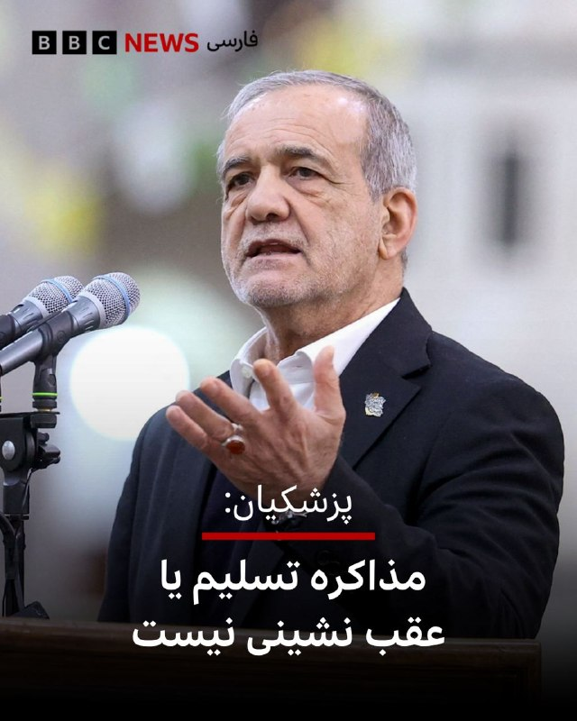

🔻مسعود پزشکیان، رئیس جمهور ایران، همزمان با ارسال پاسخ ایران از طریق پاکستان به پیشنهادهای آمریکا، گفته کشورش «هرگز در برابر دشمن سر خم نخواهیم کرد و اگر سخنی از گفت‌وگو یا مذاکره مطرح می‌شود، معنای آن تسلیم یا عقب‌نشینی نیست. بلکه هدف، احقاق حقوق ملت ایران و دفاع مقتدرانه از منافع ملی است.»

روز یکشنبه پاسخ رسمی ایران به طرحی که دولت دونالد ترامپ در آن خواست‌ها و پیشنهادهای خود را برای ایران تشریح کرده بود، از طریق دولت پاکستان به واشنگتن ارسال کرد.

پاسخی که از محتوای دقیق آن هنوز گزارش رسمی منتشر نشده اما رسانه‌های نیمه رسمی در داخل ایران به نقل از منابعی که نام آنها فاش نشده، نوشته‌اند ایران خواستار پایان تضمینی جنگ، رفع محاصره دریایی و لغو تحریم‌ها و آزادسازی دارایی‌های بلوکه شده این کشور شده و در برابر باز کردن تدریجی تنگه هرمز، رقیق کردن بخشی از اورانیوم غنی‌شده و توقف زمان‌بندی شده برنامه هسته‌ای این کشور را پیشنهاد کرده است.

دونالد ترامپ، رئیس جمهور آمریکا هم روز یکشنبه بدون اشاره به جزییات پاسخ ایران، آن را «کاملا غیرقابل قبول» خواند.

📸 Reuters

https://bbc.in/4u8t8He
@BBCPersian

## BBCPersian — post 280723

🔻اسرائیل می‌گوید یک سربازش در نزدیکی مرز لبنان کشته شده است

ارتش اسرائیل از کشته شدن یک سرباز این کشور خبر داده است.

به گفته اسرائیل این سرباز در نبردی در نزدیکی مرز لبنان کشته شده است.

در بیانیه ارتش اسرائیل آمده است که الکساندر گلووانیوف، ۴۷ ساله، راننده خودرو ارتش بود و روز یکشنبه کشته شد.

https://bbc.in/4nifNJK
@BBCPersian

## Dirty_Kids — post 389252

  <a href="telegram/content/Dirty_Kids_389252_1778487754.mp4">🎬 Download video</a>

نتانیاهو:

"در ایران، خیابان‌ها را به نام من نامگذاری می‌کنند. می‌دانید؟ خب، البته بعد از رئیس‌جمهور ترامپ هم، چون او رهبری مبارزه را بر عهده دارد.
اما آن‌ها این را دارند؛ من فارسی صحبت نمی‌کنم، اما مرا «بی بی جون» صدا می‌کنند: بی بی عزیز."

@Dirty_Kids 👻

## Hranews — post 112876

  

آخرین داده‌های نت‌بلاکس نشان می‌دهد که قطع سراسری #اینترنت در ایران پس از ۱۷۲۸ ساعت اختلال و محدودیت گسترده، وارد هفتادوسومین روز خود شده است. این نهاد ناظر بر وضعیت اینترنت در جهان اعلام کرد که دسترسی آزاد به اینترنت حق مردم است و محرومیت از آن توانایی عموم را برای مستندسازی و اصلاح نقض‌های اساسی حقوق بشر به شدت محدود می‌کند.

↘️
@hranews_bot تماس ✉️ -  @Hranews  کانال هرانا 🆑

## Hranews — post 112875

بخشی از اموال علی کریمی، بازیکن سابق فوتبال توقیف شد
 

❗️
❗️
❗️
❗️
❗️ – مرکز رسانه قوه قضاییه از توقیف بخشی از اموال علی کریمی بازیکن سابق فوتبال ساکن خارج از کشور و فرزند وی خبر داد. این اقدام به دلیل آنچه قوه قضاییه «حمایت از دشمن و همکاری با دولت‌های متخاصم» عنوان کرده، صورت گرفته است.
 
ادامه مطلب
 
#علی_کریمی #توقیف_اموال

↘️
@hranews_bot تماس ✉️ -  @Hranews  کانال هرانا 🆑

## Hranews — post 112874

  

عرفان شکورزاده، دانشجوی مهندسی هوافضا به اتهام «جاسوسی» اعدام شد
 

❗️
❗️
❗️
❗️
❗️ – مرکز رسانه قوه قضاییه از اجرای حکم #اعدام عرفان شکورزاده، دانشجوی کارشناسی ارشد مهندسی هوافضا، خبر داد. آقای شکورزاده پیشتر به اتهام «همکاری اطلاعاتی با موساد و سیا» به مجازات مرگ محکوم شده بود.
 
ادامه مطلب
 
#عرفان_شکورزاده

↘️
@hranews_bot تماس ✉️ -  @Hranews  کانال هرانا 🆑

## configx2ray — post 38729

  <a href="telegram/content/configx2ray_38729_1778487759.jpg">🎬 Download video</a>

socks://Og@45.149.76.86:81#https://t.me/ConfigX2ray

ترکیبی با سایفون وصله 
✅

آموزش استفادع : 
👇
https://t.me/ConfigX2ray0/1665

Channel : https://t.me/ConfigX2ray

## manototv — post 105294

  <a href="telegram/content/manototv_105294_1778487760.mp4">🎬 Download video</a>

سن‌فرانسیسکو| گردهمایی ایرانیان، ۲۰ اردیبهشت

## manototv — post 105293

  <a href="telegram/content/manototv_105293_1778487761.mp4">🎬 Download video</a>

ونکوور| راهمپیمایی ایرانیان در حمایت از مردم ایران، ۲۰ اردیبهشت

## manototv — post 105292

  <a href="telegram/content/manototv_105292_1778487764.mp4">🎬 Download video</a>

پایگاه تحلیل تصاویر ماهواره‌ای «سور اطلس» اعلام کرد تصاویر ماهواره‌ای ظاهرا یک نفتکش بزرگ را در تنگه هرمز نشان می‌دهد که پس از یک حمله، ردی از نفت در آب برجای گذاشته است. در این تصاویر همچنین رفت‌وآمد گسترده قایق‌های تندرو کوچک در نزدیکی نفتکش دیده می‌شود.

وب‌سایت «تنکر ترکرز» این نفتکش را ابرنفتکش «باراکا» (برکت) معرفی کرده و نوشته است که این شناور متعلق به شرکت ملی نفت ابوظبی، ادنوک، است. به گفته این نهاد ردیابی نفتکش‌ها، باراکا روز ۱۴ اردیبهشت هدف پهپادهای جمهوری اسلامی قرار گرفت و در زمان حمله، پس از یک انتقال محرمانه محموله به نفتکشی دیگر در شرق امارات، خالی از نفت بوده است.

## manototv — post 105291

  <a href="telegram/content/manototv_105291_1778487766.mp4">🎬 Download video</a>

قوه قضاییه جمهوری اسلامی اعلام کرد حکم اعدام عرفان شکورزاده به اتهام همکاری با سرویس اطلاعاتی آمریکا و موساد اجرا شده است. خبرگزاری قوه قضاییه، او را به ارتباط با دو نهاد اطلاعاتی خارجی و انتقال اطلاعات طبقه‌بندی‌شده متهم کرده است.

رسانه‌های حقوق بشری و منتقد جمهوری اسلامی پیش‌تر درباره خطر اجرای حکم اعدام او هشدار داده و نوشته بودند که شکورزاده دانشجوی کارشناسی ارشد مهندسی هوافضا و فناوری ماهواره در دانشگاه علم و صنعت بوده است.

## manototv — post 105290

  <a href="telegram/content/manototv_105290_1778487766.mp4">🎬 Download video</a>

بریتانیا و فرانسه امروز دوشنبه میزبان نشستی با حضور بیش از ۴۰ کشور خواهند بود تا درباره میزان مشارکت نظامی آنها در ماموریت اروپایی اسکورت کشتی‌ها در تنگه هرمز گفت‌وگو شود.

این ماموریت قرار است پس از برقراری یک آتش‌بس پایدار آغاز شود و هدف آن همراهی کشتی‌های تجاری در عبور از تنگه هرمز است. بلومبرگ نوشت کشورهای شرکت‌کننده قرار است درباره توانایی‌هایی مانند مین‌روبی، اسکورت دریایی و گشت هوایی گفت‌وگو کنند.

بریتانیا پیش‌تر ناوشکن «اچ‌ام‌اس دراگون» را برای آمادگی در یک ماموریت احتمالی در خاورمیانه اعزام کرده و فرانسه نیز ناوگروه «شارل دوگل» را به دریای سرخ فرستاده است.

## manototv — post 105289

  <a href="telegram/content/manototv_105289_1778487767.mp4">🎬 Download video</a>

فرماندهی مرکزی ارتش آمریکا اعلام کرد تفنگداران دریایی ایالات متحده روز ۱۸ اردیبهشت، در جریان تمرینی روی عرشه ناو آبی‌خاکی «یواس‌اس تریپولی»، از یک بالگرد «سی‌هاوک» فرود آمدند.

سنتکام گفت این تمرین برای حفظ آمادگی تفنگداران دریایی انجام شده است تا در صورت لزوم، برای ورود به کشتی‌هایی که در جریان انسداد دریایی آمریکا علیه ایران از دستورها تبعیت نمی‌کنند، به کار گرفته شوند.

## manototv — post 105288

  <a href="telegram/content/manototv_105288_1778487768.mp4">🎬 Download video</a>

روزنامه گاردین استرالیا در گزارشی نوشت اسحاق قالیباف، پسر محمدباقر قالیباف برای چند سال در ملبورن زندگی و تحصیل کرده و در همین مدت با بازار ملک و دانشگاه ملبورن ارتباط داشته است. بر اساس این گزارش، اسحاق قالیباف با وجود رد شدن درخواست ویزای او در کانادا، توانسته بود اقامت موقت بلندمدت در استرالیا بگیرد.

گاردین نوشته اسحاق قالیباف از اوایل سال ۲۰۱۴ وارد ملبورن شد، ابتدا دوره زبان و دوره مقدماتی گذراند و سپس از سال ۲۰۱۵ تا ۲۰۱۸ در رشته مهندسی در دانشگاه ملبورن تحصیل کرد. بر اساس مدارکی که او در پرونده مهاجرتی خود در دادگاه فدرال کانادا ارائه کرده بود، او در سال‌های ۲۰۱۶ تا ۲۰۱۸ به‌عنوان دستیار پژوهشی در مرکز زیرساخت‌های داده‌های مکانی و مدیریت زمین دانشگاه ملبورن کار کرده است.

به نوشته گاردین، اسحاق قالیباف در سال ۲۰۲۲ در یک استشهادیه گفته بود تا پایان سپتامبر همان سال اقامت موقت استرالیا داشته، اما به‌دلیل انتظار برای دریافت اقامت دائم کانادا، برای تبدیل آن به اقامت دائم استرالیا اقدام نکرده است. کانادا در نهایت در فوریه ۲۰۲۴ درخواست اقامت دائم او را رد کرد.

## manototv — post 105287

  <a href="telegram/content/manototv_105287_1778487769.mp4">🎬 Download video</a>

بر اساس تصاویر و گزارش‌های منتشرشده، یک مرد در پایان تجمع ایرانیان در ریچموندهیل، در شمال تورنتو، با خودروی خود به چند خودرو برخورد کرد و به گفته شاهدان، پس از آن پرچم جمهوری اسلامی را از خودرو بیرون آورد و تکان داد. این تجمع روز یکشنبه ۲۰ اردیبهشت برگزار شده بود.

در گزارش‌های منتشرشده آمده است که این مرد پس از برخورد با چند خودرو و دست‌کم یک نفر، توسط ماموران پلیس بازداشت شد.

## alonews — post 119212

  <a href="telegram/content/alonews_119212_1778487772.jpg">🎬 Download video</a>

👈سخنگوی وزارت خارجه درباره اظهارات نتانیاهو در خصوص اینکه جنگ با ایران تمام نشده، گفت: ما با کسانی که علیه ملت ایران اقدام کردند، تسویه حساب نکردیم، حتما فرصتی به نیروهای مسلح ما داده شود به بهترین وجه از آن استفاده می‌شود.

✅ @AloNews خبر جنگ

## alonews — post 119211

  <a href="telegram/content/alonews_119211_1778487772.jpg">🎬 Download video</a>

👈احتمال شنیده شدن صدای انفجارهای کنترل‌شده در جنوب تهران

✅ @AloNews خبر جنگ

## alonews — post 119210

  <a href="telegram/content/alonews_119210_1778487772.jpg">🎬 Download video</a>

👈بقایی : آمریکا سابقه خوبی نداره

✅ @AloNews خبر جنگ

## alonews — post 119209

  <a href="telegram/content/alonews_119209_1778487772.jpg">🎬 Download video</a>

👈بقایی: ایران قلدر نیست، قلدرستیز است

✅ @AloNews خبر جنگ

## alonews — post 119208

  <a href="telegram/content/alonews_119208_1778487773.mp4">🎬 Download video</a>

👈بقایی در واکنش به انتقال اورانیوم غنی‌شده ونزوئلا به آمریکا : ما خسیس نیستیم؛ اینکه آمریکا بخواد برای خودش از این ماجرا دستاورد بسازه، به خودش مربوطه

✅ @AloNews خبر جنگ

## alonews — post 119207

  <a href="telegram/content/alonews_119207_1778487775.jpg">🎬 Download video</a>

👈سخنگوی وزارت خارجه: هرگونه مداخله در امور تنگه هرمز باعث پیچیده‌تر شدن موضوع می‌شود

✅ @AloNews خبر جنگ

## alonews — post 119206

  <a href="telegram/content/alonews_119206_1778487775.jpg">🎬 Download video</a>

👈سخنگوی وزارت امورخارجه: طرف رسمی میانجی کماکان پاکستان است. طرف قطری هم ایده‌هایی دارد که هرموقع ضرورت داشته باشد در میان می‌گذارد.

✅ @AloNews خبر جنگ

## alonews — post 119205

  <a href="telegram/content/alonews_119205_1778487775.jpg">🎬 Download video</a>

👈سخنگوی وزارت خارجه: سفر ترامپ به چین یک سفر دوجانبه است و به خودشان مربوط است. با چین به عنوان شریک راهبردی و کشور اثرگذار در شورای امنیت در ارتباط مستمر هستیم.

🔴 عراقچی اخیرا سفری به چین داشت و نقطه نظرات و ملاحظات خود را بیان کردیم و چین از مواضع ما آگاه است.

🔴چین می‌داند جنگ تحمیلی علیه ایران بخشی از یک روند جهانی در راستای تشدید یکجانبه گرایی از سوی آمریکاست که هنجارهای بین‌المللی را مورد آسیب قرار داده است

✅ @AloNews خبر جنگ

## alonews — post 119204

  <a href="telegram/content/alonews_119204_1778487776.jpg">🎬 Download video</a>

👈سخنگوی وزارت خارجه: ایران ثابت کرده و قدرت مسئولیت پذیر در منطقه است. ما قلدر نیستیم، قلدر ستیز هستیم. کافی است به عملکرد ما نگاه شود. آیا ما بودیم که به آمریکا لشکرکشی کردیم.

🔴آیا ما هستیم که در نیمکره غربی علیه کوبا و ونزوئلا و ... قلدری می‌کنیم. آیا ما بودیم که در روند دیپلماتیک دو نوبت مرتکب این جنایت شدیم.

✅ @AloNews خبر جنگ

## alonews — post 119203

  <a href="telegram/content/alonews_119203_1778487776.jpg">🎬 Download video</a>

👈سخنگوی وزارت خارجه: ما هیچ امتیازی مطالبه نکردیم. تنها چیزی که مطالبه کردیم حقوق مشروع ایران است

🔴قضاوت را به شما و مردم واگذار می‌کنم که آیا مطالبه ایران برای خاتمه جنگ در منطقه، توقف راهزنی دریایی علیه کشتی‌های ایران (محاصره دریایی)، آزاد شدن دارایی‌های متعلق به مردم ایران که سال‌هاست به ناحق در بانک‌های خارجی مسدود شده، آیا این‌ها مطالبه زیاده خواهانه است.

🔴هر آنچه در متن پیشنهاد کردیم معقول و سخاوتمندانه بود. نه تنها برای منافع ملی ایران بلکه برای خیر و صلاح منطقه و جهان.

🔴طرف‌های آمریکایی همچنان بر خواسته‌های نامعقول خود پافشاری می‌کنند

✅ @AloNews خبر جنگ

## alonews — post 119202

  <a href="telegram/content/alonews_119202_1778487776.jpg">🎬 Download video</a>

👈وزارت خارجه ایران: پاسخ ما به آمریکا شامل مطالبات منطقی است و در واکنش به پیشنهاد واشینگتن نیز همین رویکرد را دنبال می‌کنیم

✅ @AloNews خبر جنگ

## alonews — post 119201

  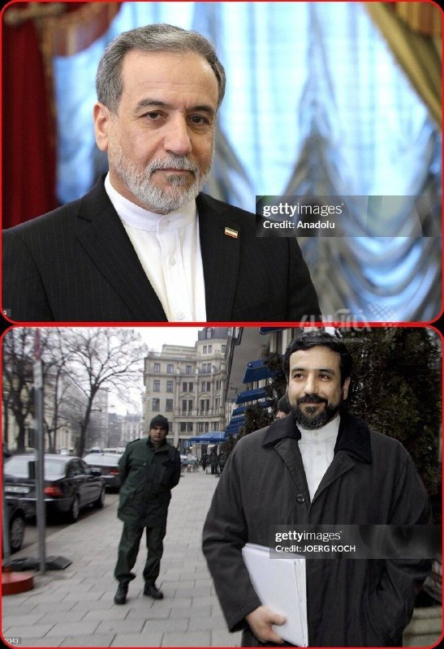

👈۲۰ سال حضور عباس عراقچی در مذاکرات؛ از مونیخ ۲۰۰۶ تا تهران ۲۰۲۶

✅ @AloNews خبر جنگ

## alonews — post 119200

  

👈جنگنده‌های اسرائیلی شهر کفر رومانی در جنوب لبنان را بمباران کردند.

✅ @AloNews خبر جنگ

## alonews — post 119199

  <a href="telegram/content/alonews_119199_1778487778.mp4">🎬 Download video</a>

👈اظهارات جنجالی ظهره‌وند درباره سلاح سری ایران: من جاها و ظرفیت هایی رو دیدم که اتفاقی میوفته که بمب اتم جلوش ترقه است

🔴شما میتونید زمان رو پشت سر بزارید، چیزی که در چند ثانیه از تهران تا واشنگتن برود

🔴میشه یه کارهایی کرد که بمب اتم جلوش بچه بازیه!

✅ @AloNews خبر جنگ

## alonews — post 119198

  <a href="telegram/content/alonews_119198_1778487782.mp4">🎬 Download video</a>

👈به گفته GB News، نخست‌وزیر بریتانیا کیر استارمر «به نظر می‌رسد این هفته استعفا دهد»

✅ @AloNews خبر جنگ

## alonews — post 119197

  <a href="telegram/content/alonews_119197_1778487785.jpg">🎬 Download video</a>

👈اولین مورد آلوده به ویروس هانتا در فرانسه ثبت شد

✅ @AloNews خبر جنگ

## alonews — post 119196

  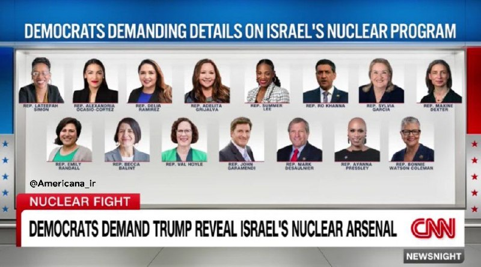

👈لیست دموکرات‌هایی که خواستار آشکار شدن جزئیات برنامه هسته‌ای اسرائیل شده‌اند!

✅ @AloNews خبر جنگ

## alonews — post 119195

  <a href="telegram/content/alonews_119195_1778487786.mp4">🎬 Download video</a>

👈 لحظه تصادف عجیب و پرواز موتور سیکلت بر فراز چراغ راهنمایی!

✅ @AloNews خبر جنگ

## alonews — post 119194

  <a href="telegram/content/alonews_119194_1778487788.jpg">🎬 Download video</a>

👈ریاست جمهوری کره جنوبی: ما حمله به کشتی باری کره‌ای را به شدت محکوم می‌کنیم |پس از شناسایی عامل این حمله، به آن واکنش نشان خواهیم داد

🔴تا کنون درباره نقش ایران در این حمله نمی دانیم

✅ @AloNews خبر جنگ

## alonews — post 119193

👈جهت رزرو تبلیغات برای VPN در کانال #الونیوز به کانال زیر مراجعه کنید👇

📃https://t.me/ads_alonews

📃https://t.me/ads_alonews

---
📅 بروزرسانی: 1405/02/21 08:09
---

## VahidOOnLine — post 239451

  

برایان مست، رییس کمیته امور خارجی مجلس نمایندگان آمریکا، گفت: «هرگز نمی‌توان به رژیم ایران اعتماد کرد.»

این نماینده جمهوریخواه همچنین گفت حکومت ایران چاره‌ای جز بازگشت به میز مذاکره ندارد و دونالد ترامپ، رییس‌جمهوری آمریکا، فشار بر تهران را ادامه خواهد داد تا زمانی که جمهوری اسلامی ناچار به توافقی جدی شود.
‌🏁 🇬🇧 IranintlTV

🤖 @VahidOOnLine

## VahidOOnLine — post 239450

  

آژانس خبری کردپا بر اساس «گزارش‌ها و شواهد از شهر سقز در استان کردستان» از افزایش فزاینده قیمت کالاهای اساسی، کمبود شدید نقدینگی و اختلال در خدمات بانکی خبر داد.

کردپا نوشت: «روایت‌های مردمی نشان می‌دهد که تنها طی دو هفته، قیمت بسیاری از کالاهای مصرفی و مواد اولیه چند برابر شده و همزمان توان خرید و معیشت بخش بزرگی از جامعه به‌شدت کاهش یافته است.»

این گزارش حاکی است در شهر سقز، خانه‌ای برای اجاره با کمتر از ۵۰۰ میلیون تومان رهن و ۱۵ میلیون تومان اجاره ماهانه یافت نمی‌شود؛ آن هم برای واحدی کوچک با یک اتاق و آشپزخانه.

در این میان، بسیاری از مراکز تولیدی به دلایلی مانند نبود مواد اولیه، هزینه بالای تولید، افزایش نرخ انرژی و کرایه‌ها تعطیل شده‌اند.

در شهرک صنعتی سقز نیز تا ابتدای اردیبهشت‌ماه بیش از ۳۰۰ کارگر، یعنی حدود نیمی از نیروی کار، اخراج شده‌اند و حدود ۱۵۰ کارگر دیگر با نصف حقوق مشغول به کار هستند.

بر اساس این گزارش، هم‌زمان با بحران اقتصادی، آسیب‌های اجتماعی از جمله «سرقت، راه‌زنی و کسب درآمد از راه‌های نابه‌هنجار» افزایش یافته است.
‌🏁 🇬🇧 IranintlTV

🤖 @VahidOOnLine

## VahidOOnLine — post 239449

  

به گزارش خبرگزاری فرانسه، نرگس محمدی، برنده جایزه نوبل صلح، در پی نگرانی‌های جدی درباره وضعیت جسمانی‌اش با قرار وثیقه از زندان آزاد شد.

بر اساس این گزارش، تصمیم برای آزادی او پس از تشدید مشکلات پزشکی و افزایش فشار خانواده و نهادهای حقوق بشری برای رسیدگی فوری به وضعیت سلامتی‌اش اتخاذ شده است.

نرگس محمدی که به‌دلیل فعالیت‌های حقوق بشری بازداشت شده بود، طی ماه‌های اخیر با مشکلات جدی سلامتی روبه‌رو بوده و فعالان حقوق بشر بارها نسبت به شرایط جسمانی او هشدار داده بودند.

‌🏁 🇬🇧 IranintlTV

🤖 @VahidOOnLine

## VahidOOnLine — post 239448

  

به گزارش خبرگزاری فرانسه، نرگس محمدی، برنده جایزه نوبل صلح، در پی نگرانی‌های جدی درباره وضعیت جسمانی‌اش با قرار وثیقه از زندان آزاد شد.

بر اساس این گزارش، تصمیم برای آزادی او پس از تشدید مشکلات پزشکی و افزایش فشار خانواده و نهادهای حقوق بشری برای رسیدگی فوری به وضعیت سلامتی‌اش اتخاذ شده است.

نرگس محمدی که به‌دلیل فعالیت‌های حقوق بشری بازداشت شده بود، طی ماه‌های اخیر با مشکلات جدی سلامتی روبه‌رو بوده و فعالان حقوق بشر بارها نسبت به شرایط جسمانی او هشدار داده بودند.

‌🏁 🇬🇧 IranintlTV

🤖 @VahidOOnLine

## VahidOOnLine — post 239447

  

بر اساس داده‌های شرکت کپلر، دو نفتکش پس از خاموش کردن سیستم‌های ردیابی خود با عبور از تنگه هرمز، این منطقه را ترک کردند.

بر اساس این گزارش، خاموش شدن دستگاه‌های موقعیت‌یاب باعث شد مسیر حرکت این نفتکش‌ها به طور دقیق قابل رصد نباشد.
‌🏁 🇬🇧 IranintlTV

🤖 @VahidOOnLine

## VahidOOnLine — post 239446

  

بر اساس داده‌های شرکت کپلر، دو نفتکش پس از خاموش کردن سیستم‌های ردیابی خود با عبور از تنگه هرمز، این منطقه را ترک کردند.

بر اساس این گزارش، خاموش شدن دستگاه‌های موقعیت‌یاب باعث شد مسیر حرکت این نفتکش‌ها به طور دقیق قابل رصد نباشد.
‌🏁 🇬🇧 IranintlTV

🤖 @VahidOOnLine

## VahidOOnLine — post 239445

  

♦️بنیامین نتانیاهو، نخست‌وزیر اسرائیل در پاسخ به مجری برنامه «۶۰ دقیقه» سی‌بی‌اس که از او پرسید نظرش درباره وضعیت مجتبی خامنه‌ای چیست؟ گفت: اگر می‌پرسید، زنده است یا خیر؛ بله به نظرم زنده است. اما گفتن اینکه وضعیتش چیست دشوار است، او در مخفیگاه است و می‌کوشد قدرت و اختیار به دست آورد اما هرگز قدرت و نفوذ پدرش را ندارد. نتانیاهو گفت که همین مساله، شکاف و آشفتگی بیشتری در ساختار رژیم ایران ایجاد کرده که «چیز بدی نیست.»
‌🇸🇦 Indypersian

🤖 @VahidOOnLine

## VahidOOnLine — post 239444

  

♦️بلومبرگ گزارش داد بریتانیا و فرانسه روز دوشنبه میزبان نشستی با حضور بیش از ۴۰ کشور خواهند بود تا درباره مشارکت نظامی در ماموریت اروپایی اسکورت کشتی‌ها در تنگه هرمز پس از برقراری آتش‌بس گفتگو کنند.

بر اساس این گزارش، کشورهای شرکت‌کننده قرار است توانایی‌هایی مانند مین‌روبی، اسکورت دریایی و گشت هوایی ارائه دهند. این ماموریت دفاعی به رهبری بریتانیا و فرانسه با هدف اطمینان‌بخشی به کشتی‌های تجاری برای عبور از تنگه هرمز طراحی شده است.
جان هیلی، وزیر دفاع بریتانیا، گفت لندن و پاریس در حال تبدیل توافق دیپلماتیک به برنامه عملی نظامی برای بازگرداندن اعتماد به کشتیرانی در تنگه هرمز هستند.
‌🇸🇦 Indypersian

🤖 @VahidOOnLine

## VahidOOnLine — post 239443

  

یک مقام ارشد امنیتی عراق گزارش‌های منتشرشده درباره ایجاد پایگاه نظامی مخفی اسرائیل در صحرای غربی این کشور برای پشتیبانی از حملات علیه ایران را رد کرد و آن‌ها را «نادرست» خواند.

به گزارش آناتولی، این مقام که نامش فاش نشده، گفت ادعاها درباره فعالیت کنونی یک سایت نظامی اسرائیل در خاک عراق صحت ندارد.

این واکنش پس از گزارش وال‌استریت ژورنال مطرح شد که مدعی بود اسرائیل پیش از حملات ۹ اسفند، با اطلاع آمریکا پایگاهی مخفی در صحرای عراق ایجاد کرده است.

بر اساس آن گزارش، این پایگاه محل استقرار نیروهای ویژه و مرکز پشتیبانی لجستیکی بوده و نزدیک بود در ماه مارس پس از گزارش یک چوپان درباره فعالیت‌های مشکوک فاش شود.

مقام‌های عراقی پیش‌تر از درگیری با یک «عملیات هوایی مرموز» در منطقه النخیب خبر داده بودند که به کشته و زخمی شدن چند نظامی انجامید.

ارتش اسرائیل درباره این ادعاها اظهار نظر نکرده و تنش‌های منطقه‌ای همچنان ادامه دارد.
بیشتر بخوانید

‌🏁 🇬🇧 IranintlTV

🤖 @VahidOOnLine

## VahidOOnLine — post 239442

  

♦️انجمن جهانی ناشران خبر (WAN-IFRA) برندگان جوایز رسانه‌های دیجیتال خاورمیانه در سال ۲۰۲۶ را معرفی کرد که در میان آنها، شبکه «ایران اینترنشنال» موفق به کسب سه جایزه معتبر شد. پروژه «ربات تلگرامی ایران اینترنشنال» توانست دو جایزه «تعامل با مخاطب» و «نوآورانه‌ترین محصول دیجیتال» را از آن خود کند. داوران با تمجید از عملکرد این ابزار در زمان قطع اینترنت در ایران، خاطرنشان کردند که این بات فراتر از یک ابزار جمع‌آوری خبر، به یک پل ارتباطی میان ایرانیان خارج از کشور و خانواده‌هایشان در داخل تبدیل شد؛ به طوری که پیام‌های ارسالی از طریق ماهواره برای کسانی که به اینترنت دسترسی نداشتند، پخش می‌شد. همچنین، نقشه تعاملی اهداف اسرائیل در جنگ ۱۲ روزه که با ترکیب داده‌های شهروند-خبرنگاران و راستی‌آزمایی‌های تحریریه طراحی شده بود، جایزه «بهترین بصری‌سازی داده‌ها» را دریافت کرد. در بخش بازاریابی نیز، کارزار «زن، زندگی، آزادی» که به مناسبت سومین سالگرد جان‌باختن مهسا امینی و با نماد مرغ‌های آمین (اوریگامی) اجرا شد، به عنوان بهترین کارزار تبلیغاتی شناخته شد. جوایز رسانه‌های دیجیتال خاورمیانه که توسط اتحادیه جهانی روزنامه‌ها و ناشران خبر برگزار می‌شود، معتبرترین رقابت در صنعت رسانه‌های دیجیتال منطقه است. این جایزه به رسانه‌هایی اهدا می‌شود که توانسته‌اند با استفاده از فناوری‌های نوین، استراتژی‌های خلاقانه و روزنامه‌نگاری داده‌محور، با مخاطبان خود ارتباط موثر برقرار کنند.
‌🇸🇦 Indypersian

🤖 @VahidOOnLine

## VahidOOnLine — post 239441

  

نیویورک‌تایمز در گزارشی از موج اخراج‌ها پس از جنگ نهم اسفند خبر داد و نوشت حملات آمریکا و اسرائیل به صنایع فولاد و پتروشیمی، اختلال در واردات به‌دلیل محاصره بنادر و نیز سیاست‌هایی مانند قطع اینترنت، فشار سنگینی بر اقتصاد ایران وارد کرده است.

به نوشته این روزنامه، برخی آمارهای داخلی از بیکاری مستقیم و غیرمستقیم تا دو میلیون نفر و ثبت رکورد ۳۱۸ هزار رزومه در یک روز حکایت دارد؛ موضوعی که می‌تواند به کاهش قابل توجه درآمدهای مالیاتی دولت منجر شود.

در بخش صنعت، کمبود مواد اولیه و آسیب به کارخانه‌های بزرگ باعث کاهش تولید و اخراج‌های گسترده شده است.

مهدی بستانچی، رییس شورای هماهنگی شهرک‌های صنعتی سراسر کشور، به نیویورک تایمز گفت تا ۳.۵ میلیون کارگر ممکن است تحت تاثیر این روند انقباضی قرار گیرند.

همچنین قطعی اینترنت، صنعت فناوری را دچار بحران کرده و روزانه ده‌ها میلیون دلار خسارت به اقتصاد دیجیتال وارد می‌کند. این گزارش می‌افزاید نارضایتی اقتصادی که در سال‌های اخیر به اعتراضات انجامیده، همچنان برطرف نشده است.
‌🏁 🇬🇧 IranintlTV

🤖 @VahidOOnLine

## VahidOOnLine — post 239440

  

♦️همزمان با هفتادودومین روز قطع سراسری اینترنت در ایران، محمدرضا ظفرقندی، وزیر بهداشت دولت پزشکیان در نامه‌ای به رئیس مرکز ملی فضای مجازی، خواستار رفع محدودیت پایگاه علمی «پابمد» شد و تاکید کرد که محدودیت‌های اینترنت بین‌الملل، حتی با وجود دسترسی به «اینترنت پرو»، فعالیت‌های آموزشی و پژوهشی اساتید و محققان علوم پزشکی را با چالش جدی مواجه کرده است. به گزارش ایسنا، این درخواست در حالی مطرح می‌شود که کارشناسان نسبت به پیامدهای تداوم اختلال در دسترسی به این موتور جستجوی حیاتی و تاثیر مستقیم آن بر افت رتبه علمی کشور هشدار داده‌اند؛ چرا که پاب‌مد اصلی‌ترین مرجع جستجوی مقالات معتبر در حوزه‌های زیست‌شناسی و داروسازی محسوب می‌شود که در یک ماه اخیر به‌جز چند روز، به‌طور کامل از دسترس خارج بوده است.
‌🇸🇦 Indypersian

🤖 @VahidOOnLine

## VahidOOnLine — post 239439

  

روزنامه گاردین استرالیا گزارش داد اسحاق قالیباف، فرزند محمدباقر قالیباف، در دوران اقامت خود در استرالیا با یک مرکز پژوهشی در دانشگاه ملبورن همکاری داشته و همزمان از محل اجاره حداقل یک ملک در این کشور درآمد کسب می‌کرده است.

بر اساس اسناد ارائه‌شده در پرونده حقوقی او برای دریافت اقامت دائم کانادا، قالیباف بین سال‌های ۲۰۱۵ تا ۲۰۱۸ در ملبورن زندگی و در مقطع کارشناسی ارشد مهندسی تحصیل کرده و به‌عنوان دستیار پژوهشی در یک مرکز دانشگاهی مشغول به کار بوده است.

اسناد بانکی نشان می‌دهد او در سال ۲۰۱۸ مبالغی به‌عنوان «اجاره دریافتی» از یک آژانس املاک در ملبورن دریافت کرده، هرچند مالکیت دقیق املاک مشخص نیست. این گزارش همچنین به ارتباط نام کارفرمای او در ایران با چهره‌های نزدیک به سپاه اشاره کرده است. درخواست اقامت دائم قالیباف در کانادا در بهمن ۱۴۰۴ رد شد.

گاردین در ادامه به نگرانی بخشی از جامعه ایرانیان استرالیا درباره حضور بستگان مقام‌های جمهوری اسلامی در این کشور پرداخته است. برخی سیاستمداران استرالیایی نیز این موضوع را نشانه ضعف در چارچوب تحریم‌های این کشور دانسته‌اند.
بیشتر بخوانید

‌🏁 🇬🇧 IranintlTV

🤖 @VahidOOnLine

## VahidOOnLine — post 239438

  

♦️لین جیان، سخنگوی وزارت خارجه چین، روز دوشنبه اعلام کرد دونالد ترامپ، رئیس‌جمهوری آمریکا، به دعوت شی جین‌پینگ، رئیس‌جمهوری چین، در بازه زمانی ۲۳ تا ۲۵ اردیبهشت در سفری رسمی به چین خواهد رفت.

خبرگزاری شین‌هوا گزارش داد این سفر در چارچوب دیدار رسمی میان رهبران دو کشور انجام می‌شود.
‌🇸🇦 Indypersian

🤖 @VahidOOnLine

## VahidOOnLine — post 239437

  

♦️خبرگزاری فرانسه گزارش داد نرگس محمدی، فعال حقوق بشر و برنده جایزه صلح نوبل، روز یکشنبه پس از افزایش نگرانی‌ها درباره وضعیت جسمانی‌اش، با قرار وثیقه از زندان آزاد و برای درمان پزشکی به تهران منتقل شد.

بنیاد نرگس محمدی اعلام کرد او پس از ۱۰ روز بستری بودن در بیمارستانی در زنجان، با «تعلیق حکم و وثیقه سنگین» آزاد شده و با آمبولانس به بیمارستانی در تهران انتقال یافته است تا تحت درمان تیم پزشکی خود قرار گیرد.

حامیان نرگس محمدی پیش‌تر هشدار داده بودند او پس از دو حمله قلبی مشکوک در دوران حبس، در خطر مرگ قرار دارد. تقی رحمانی، همسر او، گفته بود: «جان نرگس محمدی در خطر است.»

مصطفی نیلی، وکیل نرگس محمدی، نیز در اکس تایید کرد که انتقال او به تهران در پی دستور توقف اجرای حکم برای درمان پزشکی انجام شده است.
‌🇸🇦 Indypersian

🤖 @VahidOOnLine

## VahidOOnLine — post 239436

  

وب‌سایت «اسرائیل نشنال‌نیوز» به نقل از المیادین گزارش داد جمهوری اسلامی در مذاکرات با آمریکا فهرستی از مطالبات گسترده مطرح کرده که با واکنش تند دونالد ترامپ روبه‌رو شده است.

تهران خواستار پایان فوری جنگ، تضمین آتش‌بس در لبنان، لغو کامل تحریم‌ها، آزادسازی دارایی‌های بلوکه‌شده و ازسرگیری بدون محدودیت صادرات نفت شده و کنترل تنگه هرمز را «خط قرمز» خود دانسته است. همچنین ترامپ هشدار داده «ایران دیگر نخواهد خندید.»

در عین حال، منابعی به نیویورک‌تایمز گفته‌اند دو طرف در حال بررسی توافقی موقت برای تمدید ۳۰ روزه آتش‌بس و توقف محاصره هرمز هستند تا مذاکرات ادامه یابد.

به نوشته وال‌استریت ژورنال، اختلاف اصلی بر سر ذخایر اورانیوم غنی‌شده پابرجاست؛ تهران کاهش شدید ذخایر را نپذیرفته و تنها درباره افزایش نظارت آژانس بین‌المللی انرژی اتمی اعلام آمادگی کرده است.

مذاکرات با میانجی‌گری پاکستان همچنان ادامه دارد و ارزیابی‌ها از وجود فرصت برای دستیابی به تفاهم حکایت دارد.
بیشتر بخوانید

‌🏁 🇬🇧 IranintlTV

🤖 @VahidOOnLine

## VahidOOnLine — post 239435

  

دولت بریتانیا اعلام کرد همراه با فرانسه روز سه‌شنبه میزبان نشستی چندملیتی درباره برنامه‌های نظامی برای بازگرداندن جریان تجارت در تنگه هرمز خواهد بود.

به گزارش خبرگزاری فرانسه، این خبر ساعاتی پس از آن اعلام شد که جمهوری اسلامی به لندن و پاریس درباره اعزام کشتی‌های جنگی به منطقه هشدار داد.

در بیانیه وزارت دفاع بریتانیا آمده است: «جان هیلی، وزیر دفاع، همراه با همتای فرانسوی خود، کاترین ووترین، ریاست مشترک نشستی با حضور وزیران دفاع بیش از ۴۰ کشور را برای آغاز مأموریت چندملیتی بر عهده خواهد داشت.»

این نشست مجازی پس از گردهمایی دو روزه کارشناسان نظامی در لندن در ماه گذشته برگزار می‌شود. در آن نشست، جنبه‌های عملی یک مأموریت چندملیتی به رهبری بریتانیا و فرانسه برای حفاظت از ناوبری در این آبراه کلیدی پس از برقراری آتش‌بس پایدار بررسی شد.

هیلی گفت: «ما در حال تبدیل توافق دیپلماتیک به برنامه‌های نظامی عملی برای بازگرداندن اعتماد به کشتیرانی از طریق تنگه هرمز هستیم.»
‌🏁 🇬🇧 IranintlTV

🤖 @VahidOOnLine

## VahidOOnLine — post 239434

  

♦️بنیامین نتانیاهو، نخست‌وزیر اسرائیل در گفتگو با برنامه ۶۰ دقیقه سی‌بی‌اس تاکید کرد که اگر رژیم ایران سقوط کند، کار حزب‌الله و حماس هم تمام است. او گفت که به همین دلیل است که جمهوری اسلامی می‌گوید اگر قرار است آتش‌بس باشد، باید شامل حزب‌الله هم باشد، چون می‌خواهد حزب‌الله در لبنان بماند و به شکنجه مردم لبنان و حمله به اسرائیل ادامه دهد. نتانیاهو گفت، ما می‌خواهیم از شر این خطر خلاص شویم. او در پاسخ به مجری که پرسید آیا امکان سقوط رژیم ایران وجود دارد، گفت: نمی‌توان زمان آن را پیش‌بینی کرد. او گفت که امکانش وجود دارد اما تضمین ‌شده نیست. نتانیاهو گفت در صحبت با ترامپ هم به او نگفتم که این موضوع قطعی و تضمین شده است و گفتیم که گرچه اقدام کردن خطراتی دارد، اما اقدام نکردن خطرات بیشتری خواهد داشت.
‌🇸🇦 Indypersian

🤖 @VahidOOnLine

## VahidOOnLine — post 239433

  <a href="telegram/content/VahidOOnLine_239433_1778474372.mp4">🎬 Download video</a>

ویدیوهای دریافتی نشان می‌دهد جمعی از ایرانیان ساکن اسپانیا، روز یک‌شنبه ۲۰ اردیبهشت، در حمایت از فراخوان شاهزاده رضا پهلوی در مادرید تجمع کردند و ضمن برگزاری پرفورمنسی علیه اجرای احکام اعدام از سوی حکومت، اعلام کردند که در ۴۷ سال گذشته هیچ آتش‌بسی در جنگ جمهوری اسلامی علیه مردم ایران وجود نداشته است.
‌🏁 🇬🇧 IranintlTV

🤖 @VahidOOnLine

## VahidOOnLine — post 239432

  

بنیامین نتانیاهو در گفت‌وگو با برنامه «۶۰ دقیقه» شبکه سی‌بی‌اس گفت جنگ اخیر با ایران «دستاوردهای بزرگی» داشته اما هنوز پایان نیافته است، زیرا به گفته او همچنان اورانیوم غنی‌شده، تأسیسات هسته‌ای، برنامه موشک‌های بالستیک و شبکه نیروهای نیابتی ایران باید مهار شوند.

او تأکید کرد اگر حکومت ایران تضعیف یا سرنگون شود، شبکه نیروهای نیابتی از جمله حزب‌الله، حماس و حوثی‌ها نیز فرو خواهد پاشید، هرچند تغییر حکومت «تضمین‌شده نیست.»

نتانیاهو درباره خارج کردن اورانیوم با غنای بالا گفت در صورت وجود توافق می‌توان «وارد شد و آن را خارج کرد»، اما درباره گزینه‌های نظامی توضیحی نداد.

او همچنین طرح ایران برای پیوند زدن آتش‌بس در همه جبهه‌ها را رد کرد و گفت برخی کشورهای عربی خواهان تقویت همکاری با اسرائیل برای مهار تهران هستند.

نتانیاهو حمله ۷ اکتبر را بخشی از «محور ایران» برای نابودی اسرائیل توصیف کرد.
بیشتر بخوانید
‌🏁 🇬🇧 IranintlTV

🤖 @VahidOOnLine

## mwarmonitor — post 8866

✈️دو فروند هواپیمای سوخت‌رسان KC-135R استراتوتانکر نیروی هوایی ایالات متحده که از پایگاه هوایی الظفره به پرواز درآمده‌اند، در حال حاضر بر فراز دریای عمان فعال هستند.

✈️همچنین یک فروند هواپیمای گشت دریایی P-8A پوزیدون نیروی دریایی آمریکا در حال انجام عملیات بر فراز خلیج فارس و در سواحل امارات متحده عربی است.

@mwarmonitor

## mwarmonitor — post 8865

🔸وال‌استریت ژورنال: علی الزیدی، نخست‌وزیر مأمور تشکیل دولت عراق، تحت فشار واشنگتن قرار دارد تا نفوذ شبه‌نظامیان مورد حمایت تهران را محدود کند.

@mwarmonitor

## mwarmonitor — post 8864

🔸لیندسی گراهام: این ایده که ایران در چارچوب یک راه‌حل مذاکره‌شده، تمام تأسیسات غنی‌سازی خود را به‌طور کامل نابود نکند، منطقی به نظر نمی‌رسد. تعلیق بدون برچیدن کامل تأسیسات و توانمندی‌های غنی‌سازی، عملاً همان برجام می‌شود.

🔹من اطمینان دارم که امتناع ایران از نابود کردن توان غنی‌سازی خود، قاطعانه رد خواهد شد.

@mwarmonitor

## mwarmonitor — post 8863

  <a href="telegram/content/mwarmonitor_8863_1778474375.mp4">🎬 Download video</a>

✈️🇺🇸نیروی هوایی ایالات متحده ساعات گذشته نیز انتقال هوایی گسترده‌ای را بر فراز اروپا به سمت خاورمیانه ادامه داد. با به بن‌بست خوردن مذاکرات، آماده‌سازی‌ها برای احتمال ازسرگیری حملات به‌طور جدی در حال انجام است…

@mwarmonitor

## mwarmonitor — post 8862

  

✈️یک فروند جنگنده F-35A لایتنینگ II نیروی هوایی ایالات متحده هنگام پرواز بر فراز دریای عمان در مسیر حرکت به سمت امارات متحده عربی وضعیت اضطراری در حین پرواز اعلام کرده و کد اسکواک ۷۷۰۰ را ارسال کرده است.

@mwarmonitor

## pm_afshaa — post 90526

  <a href="telegram/content/pm_afshaa_90526_1778474377.jpg">🎬 Download video</a>

🔴نتانیاهو: رژیم ایران الان در ضعیف‌ترین وضعیت خود از زمان تسلط بر مردم ایران قرار داره. تندروها همچنان همان مواضع قبلی رو دارن، اما در داخل حکومت شکاف‌هایی ایجاد شده، چون در نتیجه عملیات مشترک نظامی ما ضربات بسیار سنگینی خوردن.

💧 Rainbet.com the #1 Non-KYC Crypto Casino & Sportsbook @rainbetcom

😁 @Pm_Afshaa

## pm_afshaa — post 90525

  <a href="telegram/content/pm_afshaa_90525_1778474378.jpg">🎬 Download video</a>

🔴نتانیاهو: چین از ایران و اجزای خاصی از ساخت موشک حمایت میکنه؛ چین باید در روابط خود با تهران تجدید نظر کنه.

چین مقدار مشخصی از حمایت و اجزای خاصی از تولید موشک رو ارائه کرد، اما من نمیتونم بیشتر ازش بگم.
آیا واقعاً میخواد ایران راه‌های آبی رو برای تأمین انرژی مورد نیاز چین کنترل کنه؟ آیا ترجیح نمیدید آبراه‌هایی باز داشته باشید که در معرض این نوع باج‌گیری خشونت‌آمیز قرار نگیرن؟

💧Rainbet.com the #1 Non-KYC Crypto Casino & Sportsbook @rainbetcom

😁 @Pm_Afshaa

## pm_afshaa — post 90524

  <a href="telegram/content/pm_afshaa_90524_1778474378.jpg">🎬 Download video</a>

🔴نتانیاهو: سرنگونی رژیم ایران ممکنه اما قطعی نیست و زمان تغییر هم غیرقابل پیش‌بینیه.

💧 Rainbet.com the #1 Non-KYC Crypto Casino & Sportsbook @rainbetcom

😁 @Pm_Afshaa

## IranIntlTV — post 336579

  

برایان مست، رییس کمیته امور خارجی مجلس نمایندگان آمریکا، گفت: «هرگز نمی‌توان به رژیم ایران اعتماد کرد.»

این نماینده جمهوریخواه همچنین گفت حکومت ایران چاره‌ای جز بازگشت به میز مذاکره ندارد و دونالد ترامپ، رییس‌جمهوری آمریکا، فشار بر تهران را ادامه خواهد داد تا زمانی که جمهوری اسلامی ناچار به توافقی جدی شود.
https://iranintl.com/202605117347

## IranIntlTV — post 336578

  

آژانس خبری کردپا بر اساس «گزارش‌ها و شواهد از شهر سقز در استان کردستان» از افزایش فزاینده قیمت کالاهای اساسی، کمبود شدید نقدینگی و اختلال در خدمات بانکی خبر داد.

کردپا نوشت: «روایت‌های مردمی نشان می‌دهد که تنها طی دو هفته، قیمت بسیاری از کالاهای مصرفی و مواد اولیه چند برابر شده و همزمان توان خرید و معیشت بخش بزرگی از جامعه به‌شدت کاهش یافته است.»

این گزارش حاکی است در شهر سقز، خانه‌ای برای اجاره با کمتر از ۵۰۰ میلیون تومان رهن و ۱۵ میلیون تومان اجاره ماهانه یافت نمی‌شود؛ آن هم برای واحدی کوچک با یک اتاق و آشپزخانه.

در این میان، بسیاری از مراکز تولیدی به دلایلی مانند نبود مواد اولیه، هزینه بالای تولید، افزایش نرخ انرژی و کرایه‌ها تعطیل شده‌اند.

در شهرک صنعتی سقز نیز تا ابتدای اردیبهشت‌ماه بیش از ۳۰۰ کارگر، یعنی حدود نیمی از نیروی کار، اخراج شده‌اند و حدود ۱۵۰ کارگر دیگر با نصف حقوق مشغول به کار هستند.

بر اساس این گزارش، هم‌زمان با بحران اقتصادی، آسیب‌های اجتماعی از جمله «سرقت، راه‌زنی و کسب درآمد از راه‌های نابه‌هنجار» افزایش یافته است.
https://iranintl.com/202605118671

## IranIntlTV — post 336577

  <a href="telegram/content/IranIntlTV_336577_1778474380.mp4">🎬 Download video</a>

ویدیوهای دریافت‌شده نشان می‌دهد ایرانیان مقیم شهرهای والنسیا در اسپانیا و مونیخ آلمان، روز یک‌شنبه ۲۰ اردیبهشت، هم‌صدا با کارزار جهانی «یک ملت در گروگان»، علیه اعدام‌های جمهوری اسلامی و قطع اینترنت تجمع کردند و حمایت خود را از مردم ایران نشان دادند.
@iranintltv

## IranIntlTV — post 336574

  

بر اساس داده‌های شرکت کپلر، دو نفتکش پس از خاموش کردن سیستم‌های ردیابی خود با عبور از تنگه هرمز، این منطقه را ترک کردند.

بر اساس این گزارش، خاموش شدن دستگاه‌های موقعیت‌یاب باعث شد مسیر حرکت این نفتکش‌ها به طور دقیق قابل رصد نباشد.
https://iranintl.com/202605116330

## IranIntlTV — post 336573

  <a href="telegram/content/IranIntlTV_336573_1778474382.mp4">🎬 Download video</a>

جمعی از ایرانیان مقیم آمریکا، روز یک‌شنبه ۲۰ اردیبهشت، در حمایت از مردم ایران و شاهزاده رضا پهلوی و نیز در اعتراض به اعدام‌های جمهوری اسلامی و قطع اینترنت، در لس‌آنجلس تجمع کردند. آن‌ها هم‌صدا با کارزار جهانی «یک ملت در گروگان»، خواستار توجه جامعه بین‌المللی به وضعیت بحرانی داخل ایران شدند.
@iranintltv

## IranIntlTV — post 336571

  

یک مقام ارشد امنیتی عراق گزارش‌های منتشرشده درباره ایجاد پایگاه نظامی مخفی اسرائیل در صحرای غربی این کشور برای پشتیبانی از حملات علیه ایران را رد کرد و آن‌ها را «نادرست» خواند.

به گزارش آناتولی، این مقام که نامش فاش نشده، گفت ادعاها درباره فعالیت کنونی یک سایت نظامی اسرائیل در خاک عراق صحت ندارد.

این واکنش پس از گزارش وال‌استریت ژورنال مطرح شد که مدعی بود اسرائیل پیش از حملات ۹ اسفند، با اطلاع آمریکا پایگاهی مخفی در صحرای عراق ایجاد کرده است.

بر اساس آن گزارش، این پایگاه محل استقرار نیروهای ویژه و مرکز پشتیبانی لجستیکی بوده و نزدیک بود در ماه مارس پس از گزارش یک چوپان درباره فعالیت‌های مشکوک فاش شود.

مقام‌های عراقی پیش‌تر از درگیری با یک «عملیات هوایی مرموز» در منطقه النخیب خبر داده بودند که به کشته و زخمی شدن چند نظامی انجامید.

ارتش اسرائیل درباره این ادعاها اظهار نظر نکرده و تنش‌های منطقه‌ای همچنان ادامه دارد.
بیشتر بخوانید

https://iranintl.com/202605114193

## IranIntlTV — post 336570

  

نیویورک‌تایمز در گزارشی از موج اخراج‌ها پس از جنگ نهم اسفند خبر داد و نوشت حملات آمریکا و اسرائیل به صنایع فولاد و پتروشیمی، اختلال در واردات به‌دلیل محاصره بنادر و نیز سیاست‌هایی مانند قطع اینترنت، فشار سنگینی بر اقتصاد ایران وارد کرده است.

به نوشته این روزنامه، برخی آمارهای داخلی از بیکاری مستقیم و غیرمستقیم تا دو میلیون نفر و ثبت رکورد ۳۱۸ هزار رزومه در یک روز حکایت دارد؛ موضوعی که می‌تواند به کاهش قابل توجه درآمدهای مالیاتی دولت منجر شود.

در بخش صنعت، کمبود مواد اولیه و آسیب به کارخانه‌های بزرگ باعث کاهش تولید و اخراج‌های گسترده شده است.

مهدی بستانچی، رییس شورای هماهنگی شهرک‌های صنعتی سراسر کشور، به نیویورک تایمز گفت تا ۳.۵ میلیون کارگر ممکن است تحت تاثیر این روند انقباضی قرار گیرند.

همچنین قطعی اینترنت، صنعت فناوری را دچار بحران کرده و روزانه ده‌ها میلیون دلار خسارت به اقتصاد دیجیتال وارد می‌کند. این گزارش می‌افزاید نارضایتی اقتصادی که در سال‌های اخیر به اعتراضات انجامیده، همچنان برطرف نشده است.
https://iranintl.com/202605111091

## IranIntlTV — post 336569

  

روزنامه گاردین استرالیا گزارش داد اسحاق قالیباف، فرزند محمدباقر قالیباف، در دوران اقامت خود در استرالیا با یک مرکز پژوهشی در دانشگاه ملبورن همکاری داشته و همزمان از محل اجاره حداقل یک ملک در این کشور درآمد کسب می‌کرده است.

بر اساس اسناد ارائه‌شده در پرونده حقوقی او برای دریافت اقامت دائم کانادا، قالیباف بین سال‌های ۲۰۱۵ تا ۲۰۱۸ در ملبورن زندگی و در مقطع کارشناسی ارشد مهندسی تحصیل کرده و به‌عنوان دستیار پژوهشی در یک مرکز دانشگاهی مشغول به کار بوده است.

اسناد بانکی نشان می‌دهد او در سال ۲۰۱۸ مبالغی به‌عنوان «اجاره دریافتی» از یک آژانس املاک در ملبورن دریافت کرده، هرچند مالکیت دقیق املاک مشخص نیست. این گزارش همچنین به ارتباط نام کارفرمای او در ایران با چهره‌های نزدیک به سپاه اشاره کرده است. درخواست اقامت دائم قالیباف در کانادا در بهمن ۱۴۰۴ رد شد.

گاردین در ادامه به نگرانی بخشی از جامعه ایرانیان استرالیا درباره حضور بستگان مقام‌های جمهوری اسلامی در این کشور پرداخته است. برخی سیاستمداران استرالیایی نیز این موضوع را نشانه ضعف در چارچوب تحریم‌های این کشور دانسته‌اند.
بیشتر بخوانید

https://iranintl.com/20260510

## IranIntlTV — post 336568

  

وب‌سایت «اسرائیل نشنال‌نیوز» به نقل از المیادین گزارش داد جمهوری اسلامی در مذاکرات با آمریکا فهرستی از مطالبات گسترده مطرح کرده که با واکنش تند دونالد ترامپ روبه‌رو شده است.

تهران خواستار پایان فوری جنگ، تضمین آتش‌بس در لبنان، لغو کامل تحریم‌ها، آزادسازی دارایی‌های بلوکه‌شده و ازسرگیری بدون محدودیت صادرات نفت شده و کنترل تنگه هرمز را «خط قرمز» خود دانسته است. همچنین ترامپ هشدار داده «ایران دیگر نخواهد خندید.»

در عین حال، منابعی به نیویورک‌تایمز گفته‌اند دو طرف در حال بررسی توافقی موقت برای تمدید ۳۰ روزه آتش‌بس و توقف محاصره هرمز هستند تا مذاکرات ادامه یابد.

به نوشته وال‌استریت ژورنال، اختلاف اصلی بر سر ذخایر اورانیوم غنی‌شده پابرجاست؛ تهران کاهش شدید ذخایر را نپذیرفته و تنها درباره افزایش نظارت آژانس بین‌المللی انرژی اتمی اعلام آمادگی کرده است.

مذاکرات با میانجی‌گری پاکستان همچنان ادامه دارد و ارزیابی‌ها از وجود فرصت برای دستیابی به تفاهم حکایت دارد.
بیشتر بخوانید

https://iranintl.com/202605107880

## IranIntlTV — post 336567

  

دولت بریتانیا اعلام کرد همراه با فرانسه روز سه‌شنبه میزبان نشستی چندملیتی درباره برنامه‌های نظامی برای بازگرداندن جریان تجارت در تنگه هرمز خواهد بود.

به گزارش خبرگزاری فرانسه، این خبر ساعاتی پس از آن اعلام شد که جمهوری اسلامی به لندن و پاریس درباره اعزام کشتی‌های جنگی به منطقه هشدار داد.

در بیانیه وزارت دفاع بریتانیا آمده است: «جان هیلی، وزیر دفاع، همراه با همتای فرانسوی خود، کاترین ووترین، ریاست مشترک نشستی با حضور وزیران دفاع بیش از ۴۰ کشور را برای آغاز مأموریت چندملیتی بر عهده خواهد داشت.»

این نشست مجازی پس از گردهمایی دو روزه کارشناسان نظامی در لندن در ماه گذشته برگزار می‌شود. در آن نشست، جنبه‌های عملی یک مأموریت چندملیتی به رهبری بریتانیا و فرانسه برای حفاظت از ناوبری در این آبراه کلیدی پس از برقراری آتش‌بس پایدار بررسی شد.

هیلی گفت: «ما در حال تبدیل توافق دیپلماتیک به برنامه‌های نظامی عملی برای بازگرداندن اعتماد به کشتیرانی از طریق تنگه هرمز هستیم.»
https://iranintl.com/202605114087

## IranIntlTV — post 336566

  <a href="telegram/content/IranIntlTV_336566_1778474386.mp4">🎬 Download video</a>

ویدیوهای دریافتی نشان می‌دهد جمعی از ایرانیان ساکن اسپانیا، روز یک‌شنبه ۲۰ اردیبهشت، در حمایت از فراخوان شاهزاده رضا پهلوی در مادرید تجمع کردند و ضمن برگزاری پرفورمنسی علیه اجرای احکام اعدام از سوی حکومت، اعلام کردند که در ۴۷ سال گذشته هیچ آتش‌بسی در جنگ جمهوری اسلامی علیه مردم ایران وجود نداشته است.

## IranIntlTV — post 336565

  

بنیامین نتانیاهو در گفت‌وگو با برنامه «۶۰ دقیقه» شبکه سی‌بی‌اس گفت جنگ اخیر با ایران «دستاوردهای بزرگی» داشته اما هنوز پایان نیافته است، زیرا به گفته او همچنان اورانیوم غنی‌شده، تأسیسات هسته‌ای، برنامه موشک‌های بالستیک و شبکه نیروهای نیابتی ایران باید مهار شوند.

او تأکید کرد اگر حکومت ایران تضعیف یا سرنگون شود، شبکه نیروهای نیابتی از جمله حزب‌الله، حماس و حوثی‌ها نیز فرو خواهد پاشید، هرچند تغییر حکومت «تضمین‌شده نیست.»

نتانیاهو درباره خارج کردن اورانیوم با غنای بالا گفت در صورت وجود توافق می‌توان «وارد شد و آن را خارج کرد»، اما درباره گزینه‌های نظامی توضیحی نداد.

او همچنین طرح ایران برای پیوند زدن آتش‌بس در همه جبهه‌ها را رد کرد و گفت برخی کشورهای عربی خواهان تقویت همکاری با اسرائیل برای مهار تهران هستند.

نتانیاهو حمله ۷ اکتبر را بخشی از «محور ایران» برای نابودی اسرائیل توصیف کرد.
بیشتر بخوانید
https://iranintl.com/202605112648

## IranIntlTV — post 336564

  

پیت هگست، وزیر جنگ آمریکا، سخنان سناتور مارک کلی،‌ عضو سنای ایالات متحده، مبنی بر اینکه وضعیت ذخایر موشک‌های این کشور در میانه جنگ با ایران «تکان‌دهنده» است و ممکن است سال‌ها طول بکشد تا ترمیم یابد را رد کرد.

او در شبکه اجتماعی ایکس نوشت که کلی «در تلویزیون (به دروغ و احمقانه) در مورد یک گزارش طبقه‌بندی‌شده پنتاگون که دریافت کرده است، یاوه‌گویی می‌کند.»

هگست اضافه کرد که مشاور حقوقی وزارت جنگ بررسی خواهد کرد که آیا این سناتور «سوگند خود را نقض کرده است یا خیر.»

پیش از این، کلی در پی دریافت گزارش محرمانه پنتاگون درباره تأثیر جنگ ایران بر ذخایر تسلیحاتی آمریکا گفته بود: «واقعاً شوکه‌کننده است که تا چه اندازه از این ذخایر مصرف کرده‌ایم.»

او اشاره کرد که ذخایر موشک‌های تاماهاوک، اتکمز، اس‌ام-۳، سامانه تاد و موشک‌های پاتریوت به شدت کاهش یافته‌اند؛ به‌ویژه موشک‌های رهگیر دفاعی که برای حفاظت از نیروها و پایگاه‌های آمریکا استفاده می‌شوند.

به گفته او، بازسازی این ذخایر ممکن است سال‌ها زمان ببرد و این مسئله می‌تواند توانایی آمریکا را در صورت وقوع یک درگیری احتمالی با چین تحت تأثیر قرار دهد.

## IranIntlTV — post 336563

  

سناتور راجر ویکر، نماینده جمهوری‌خواه مجلس سنای آمریکا، در پیامی خطاب به دونالد ترامپ در شبکه اجتماعی ایکس نوشت: «آقای رییس‌جمهور، شما با رژیم اسلام‌گرای ایران بسیار صبور بوده‌اید. حالا وقت بازگشت به عمل است.»

او از رییس‌جمهوری ایالات متحده خواست تا عملیات «پروژه آزادی» تنگه هرمز را از سر بگیرد.
https://iranintl.com/202605112515

## IranIntlTV — post 336562

  <a href="telegram/content/IranIntlTV_336562_1778474390.mp4">🎬 Download video</a>

ویدیوهای دریافت‌شده نشان می‌دهد ایرانیان مقیم آمریکا، در شهرهای دالاس و سان‌فرانسیسکو، روز یک‌شنبه ۲۰ اردیبهشت، در پی فراخوان شاهزاده رضا پهلوی علیه جمهوری اسلامی تجمع کردند.

## Shin_Persian — post 5951

📦 mhrv-rs v1.9.21 released

• Perf: skip H2 for Full-tunnel batch requests (PR #1040)

Files (Android APKs, Windows, macOS, Linux, OpenWRT) on the files channel:

👉 v1.9.21 — all files with SHA-256

Channel:
https://t.me/mhrv_rs
or: https://t.me/+R1OyoHX2boA1ZDgx

#v1921

## FarsiVOA — post 217396

⚡️در برنامه تفسیر خبر امروز، مهدی آقازمانی با کارشناسان مهمان، درباره مجموعه از تحولات روز از جمله گفتگوهای جاری در کانال‌های دیپلماتیک همزمان با تشدید تنش‌ها در منطقه و زیر سایه حملات پهپادی به کویت و یک کشتی تجاری در آبهای قطر، گفتگو میکند
@FarsiVOA

## FarsiVOA — post 217395

  

⚡️در پی به توافق نرسیدن ایالات متحده و جمهوری اسلامی، قیمت نفت خام در معاملات اولیه روز دوشنبه حدود ۳ دلار در هر بشکه افزایش یافت. به گزارش رویترز، قیمت نفت خام برنت، به بیش از ۱۰۴ دلار در هر بشکه رسید.
@FarsiVOA

## FarsiVOA — post 217394

🔺نتانیاهو: جنگ جهنم است؛ اسرائيل هر کاری بتواند می‌کند تا غیرنظامیان آسیب نبینند اما گاهی اوقات چاره‌ای نیست

▪️بنیامین نتانیاهو، نخست وزیر اسرائيل، در مصاحبه‌ای با شبکه آمریکایی سی‌بی‌اس گفت اسرائيل «هر کاری که بتواند» انجام می‌دهد تا از تلفات غیرنظامیان در طرف مقابل جلوگیری کند.

⬇️ بیشتر بخوانید:
https://ir.voanews.com/a/8148755.html
@FarsiVOA

## FarsiVOA — post 217393

  

⚡️بنیامین نتانیاهو، نخست وزیر اسرائيل، در مصاحبه با شبکه خبری سی‌بی‌اس گفت مردم در ایران، خیابان‌هایی را به اسم او، و دونالد ترامپ، رئیس جمهوری آمریکا، نام‌گذاری کرده‌اند. آقای نتانیاهو به مجری برنامه «۶۰ دقیقه» این شبکه آمریکایی گفت که مردم او را به فارسی «بی‌بی جون» صدا می‌زنند.
@FarsiVOA

## FarsiVOA — post 217392

  

⚡️کاظم غریب‌آبادی، معاون وزیر خارجه جمهوری اسلامی، فرانسه و بریتانیا را تهدید کرد که اگر برای کمک به تلاش‌ها برای تامین امنیت تنگه هرمز، کشتی‌های جنگی خود را اعزام کنند، با «پاسخ قاطع و فوری» نیروهای مسلح جمهوری اسلامی مواجه خواهند شد. غریب‌آبادی در مورد تنگه هرمز، که یک آبراه بین المللی است، مدعی شد که «ملک مشاع قدرت‌های فرامنطقه‌ای» نیست و «تعیین ترتیبات حقوقی آن» حق جمهوری اسلامی است. پیشتر مایک والتز، سفیر آمریکا در سازمان ملل متحد، با اشاره به قطعنامه‌ای که آمریکا و متحدانش در خاورمیانه برای برقراری امنیت تنگه هرمز پیش می‌برند، گفت بیش از ۷۰ کشور پیش‌نویس این قطعنامه را امضا کرده‌اند.
@FarsiVOA

## FarsiVOA — post 217391

  

⚡️سناتور جمهوری‌خواه دیوید مک‌کورمیک، رئيس کمیته فرعی روابط خارجی در حوزه خاور نزدیک، در مصاحبه‌ای با فاکس نیوز که روز یکشنبه پخش شد گفت جمهوری اسلامی ایران باید در مذاکرات برای پایان دادن به جنگ «اورانیوم غنی‌شده، سلاح‌های هسته‌ای و مسیر به سوی سلاح‌های هسته‌ای خود را رهاکند.» او اشاره کرد که اگر توافقی حاصل نشود، خصومت‌های نظامی بین آمریکا و جمهوری اسلامی ادامه می‌یابد.
@FarsiVOA

## Persian_Trend_Official — post 13868

وی گفت هدف اصلی، دفاع از منافع و حقوق ملت ایران است و مردم باید شرایط دشوار اقتصادی و منطقه‌ای را با واقع‌بینی تحلیل کنند.

اظهارات پزشکیان در شرایطی مطرح می‌شود که بحث احتمال مذاکرات غیرمستقیم میان تهران و واشنگتن دوباره در رسانه‌های منطقه‌ای داغ شده است.

━━━━━━━━━━━━━━

🛰 #امنیت

◾️ وزارت اطلاعات: دو هسته وابسته به موساد متلاشی شدند

وزارت اطلاعات اعلام کرد دو شبکه تروریستی مرتبط با موساد شناسایی و منهدم شده‌اند و در جریان عملیات، یکی از عناصر این گروه‌ها کشته شده است.

جزئیات بیشتری از محل عملیات یا هویت افراد منتشر نشده اما نهادهای امنیتی ایران طی هفته‌های اخیر بارها از افزایش فعالیت‌های خرابکارانه در برخی استان‌ها خبر داده‌اند.

━━━━━━━━━━━━━━

💥 #چابهار

◾️ انفجار چابهار مربوط به خنثی‌سازی مهمات بود

سپاه شهرستان چابهار اعلام کرد صدای انفجار ظهر دیروز ناشی از انهدام مهمات عمل‌نکرده باقی‌مانده از جنگ بوده است. طبق این اطلاعیه، عملیات پاکسازی و خنثی‌سازی مهمات در روزهای آینده نیز ادامه خواهد داشت.

پس از انتشار ویدیوهای انفجار در شبکه‌های اجتماعی، شایعات مختلفی درباره حمله یا عملیات خرابکارانه مطرح شده بود که مسئولان آن را رد کردند.

━━━━━━━━━━━━━━
📌 @persian_trend_official
پرشین ترند | متفاوت‌ترین کانال نظامی

## Persian_Trend_Official — post 13867

☕️ #صبحانه_استراتژیک
📍 بولتن صبحگاهی پرشین ترند
🗓 ۲۱ اردیبهشت ۱۴۰۵

━━━━━━━━━━━━━━

🛢 #انرژی_و_ترانزیت

◾️ جنگ ایران، ترافیک کانال پاناما را ۲۰ درصد افزایش داد

فایننشال تایمز به نقل از مدیر کانال پاناما گزارش داد که از زمان آغاز درگیری‌ها در خلیج فارس، حجم عبور کشتی‌ها از این آبراه به شکل محسوسی افزایش یافته است. بسیاری از شرکت‌های کشتیرانی ترجیح داده‌اند برای کاهش ریسک عبور از منطقه خلیج فارس و دریای عمان، مسیرهای طولانی‌تر اما امن‌تر را انتخاب کنند.

تحلیلگران می‌گویند این مسئله نشان می‌دهد بحران خلیج فارس فقط یک بحران منطقه‌ای نیست و عملاً زنجیره جهانی انرژی و تجارت را تحت تأثیر قرار داده است. افزایش فشار روی کانال پاناما همچنین می‌تواند هزینه حمل‌ونقل جهانی را بالا ببرد.

━━━━━━━━━━━━━━

🚢 #تنگه_هرمز

◾️ اولین نفتکش قطری پس از آغاز جنگ از تنگه هرمز عبور کرد

شبکه الجزیره با استناد به داده‌های دریانوردی اعلام کرد نفتکش گاز «الخریطیات» بندر راس‌لفان قطر را ترک کرده و در مسیر پاکستان قرار دارد. این نخستین عبور ثبت‌شده یک نفتکش قطری از تنگه هرمز پس از آغاز بحران اخیر عنوان شده است.

کارشناسان معتقدند این حرکت می‌تواند نشانه‌ای از تلاش کشورهای حاشیه خلیج فارس برای سنجش وضعیت امنیتی مسیرهای انرژی باشد. بازار جهانی LNG همچنان نسبت به هرگونه تهدید در هرمز بسیار حساس است.

━━━━━━━━━━━━━━

🔥 #حادثه_دریایی

◾️ کشتی فله‌بر نزدیک قطر هدف قرار گرفت

سازمان عملیات تجارت دریایی بریتانیا (UKMTO) اعلام کرد یک کشتی فله‌بر در نزدیکی سواحل قطر هدف یک پرتابه ناشناس قرار گرفته است. طبق گزارش منتشرشده، آتش‌سوزی ایجادشده مهار شده و تلفات جانی ثبت نشده است.

خبرگزاری فارس مدعی شده این کشتی با پرچم آمریکا در حال تردد بوده است. هنوز هیچ گروهی مسئولیت این حمله را برعهده نگرفته اما این حادثه بار دیگر نگرانی‌ها درباره امنیت خطوط کشتیرانی منطقه را افزایش داده است.

━━━━━━━━━━━━━━

⚔️ #تحرکات_نظامی

◾️ ارتش: جابه‌جایی تجهیزات دشمن ادامه دارد

سخنگوی ارتش اعلام کرد کشورهای همراه با تحریم‌های آمریکا ممکن است در عبور از تنگه هرمز با مشکلاتی مواجه شوند. وی همچنین تأکید کرد که ایران در دوره آتش‌بس نیز روند به‌روزرسانی بانک اهداف و بازآرایی مواضع آفندی و پدافندی را ادامه داده است.

این اظهارات در شرایطی مطرح می‌شود که طی روزهای اخیر تصاویر متعددی از انتقال تجهیزات آمریکایی در منطقه، خصوصاً در پایگاه‌های قطر، بحرین و امارات منتشر شده است.

━━━━━━━━━━━━━━

🚤 #توان_دریایی_ایران

◾️ فایننشال تایمز: ایران بیش از هزار شناور بدون سرنشین دارد

این روزنامه بریتانیایی در گزارشی مدعی شد ایران اکنون بیش از ۱۰۰۰ قایق بدون سرنشین مجهز به موشک یا اژدر در اختیار دارد. همچنین تعداد قایق‌های تندرو هجومی ایران بین ۵۰۰ تا ۱۰۰۰ فروند برآورد شده است.

تحلیلگران غربی معتقدند تهران طی سال‌های اخیر تمرکز زیادی روی جنگ دریایی نامتقارن گذاشته و این شناورها می‌توانند در عملیات‌های ازدحامی علیه ناوهای بزرگ نقش‌آفرینی کنند.

━━━━━━━━━━━━━━

✈️ #نیروی_هوایی

◾️ ارتش: اف-۵ ها بازگشتند اما سوخو۲۴ آسیب دید

سخنگوی ارتش مدعی شد در روزهای ابتدایی جنگ، جنگنده‌های ایرانی مأموریت‌هایی علیه پایگاه‌های آمریکا در کویت، قطر و اربیل انجام داده‌اند. به گفته او جنگنده‌های اف-۵ سالم بازگشتند اما تعدادی از سوخو۲۴ ها در مسیر بازگشت هدف قرار گرفتند.

وی دلیل این موضوع را تقویت سامانه‌های پدافندی دشمن پس از موج اول حملات عنوان کرد. این نخستین‌بار است که جزئیاتی از عملکرد عملیاتی اف-۵ ها در این سطح مطرح می‌شود.

━━━━━━━━━━━━━━

🚨 #F35

◾️ جنگنده F-35 آمریکایی کد اضطراری ۷۷۰۰ ارسال کرد

روز گذشته یک فروند F-35 آمریکایی هنگام پرواز بر فراز دریای عمان کد اضطراری ۷۷۰۰ را مخابره کرد. این کد در هوانوردی به معنای وقوع وضعیت اضطراری عمومی است و معمولاً در شرایط نقص فنی یا تهدید ایمنی استفاده می‌شود.

هنوز جزئیات بیشتری درباره علت این وضعیت منتشر نشده اما این اتفاق در فضای شبکه‌های نظامی و رهگیری پروازها بازتاب گسترده‌ای داشته است.

━━━━━━━━━━━━━━

🌍 #دیپلماسی

◾️ پاکستان: به میانجیگری ادامه می‌دهیم

عاصم منیر، فرمانده ارتش پاکستان، اعلام کرد اسلام‌آباد تلاش می‌کند به‌صورت بی‌طرفانه برای کاهش تنش‌ها در خاورمیانه نقش‌آفرینی کند. او گفت پاکستان تمام تلاش خود را برای رسیدن به یک صلح پایدار به کار خواهد گرفت.

پاکستان طی هفته‌های اخیر تماس‌های متعددی با تهران، ریاض، واشنگتن و برخی کشورهای عربی داشته و تلاش می‌کند نقش میانجی فعال‌تری ایفا کند.

━━━━━━━━━━━━━━

🏛 #سیاست_داخلی

◾️ پزشکیان: مذاکره به معنای عقب‌نشینی نیست

رئیس‌جمهور تأکید کرد هرگونه بحث درباره مذاکره نباید به معنای تسلیم تعبیر شود.

## RadioFarda — post 157042

  <a href="https://t.me/radiofarda/157042">📎 Download file</a>

📻بشنوید: سرخط خبرها با رادیوفردا، ۲۱ اردیبهشت ۱۴۰۵‌

@RadioFarda

## BBCPersian — post 280722

  

‌
اسماعیل بقایی، سخنگوی وزارت خارجه ایران، روز یکشنبه و پس از آن که اعلام شد تهران پاسخ خود به واشنگتن را تحویل مقامات در اسلام‌آباد داده است، گفت: در چنین روزی در سال ۵۳ قبل از میلاد، در نبرد حرّان، سردار بزرگ ایرانی، سورنا، با افراد و‌‌ تجهیزاتی کمتر، لژیون‌های مجهز روم را در جنگی نامتقارن در هم شکست؛ کراسوس، یکی از قدرتمندترین مردان روم، کشته و تصور شکست‌ناپذیری روم برباد رفت و رؤیای پیشروی آن به شرق فروپاشید. تاریخ، برای آنان که آن را نمی‌خوانند، و درس‌های آن را برنمی‌تابند، دوباره تکرار می‌شود.»

در همین حال، ساعتی بعد از اظهارات تند دونالد ترامپ و «کاملا غیرقابل قبول» خواندن پاسخ ایران، خبرگزاری تسنیم به نقل از یک «منبع مطلع» و ناشناس نوشت: «همین الان واکنش «به اصطلاح رئیس‌جمهور آمریکا» را به پاسخ ایران دیدیم. هیچ اهمیتی ندارد؛ کسی در ایران برای خوشایند ترامپ طرح نمی‌نویسد. تیم مذاکره‌کننده فقط برای حق ملت ایران باید طرح بنویسد و وقتی ترامپ از آن راضی نباشد، قاعدتا بهتر است. ترامپ کلا واقعیت را دوست ندارد؛ به همین دلیل مدام از ایران شکست می‌خورد.»

📸 Getty

https://bbc.in/4wllZ7N
@BBCPersian

## BBCPersian — post 280713

🖌ساکشی ونکاترامان و ربه‌کا پیدر:

🔻پنتاگون مجموعه اسنادی را که درباره بشقاب پرنده‌ها هستند و تاکنون دیده‌ نشده‌‌اند، منتشر کرده است. این اسناد شامل شرح مشاهده‌هایی است که هم توسط غیرنظامیان روی زمین و هم فضانوردان روی ماه گزارش شده‌اند.

این اسناد که چند دهه را در بر می‌گیرند، از طبقه‌بندی محرمانه خارج شدند و به دستور دونالد ترامپ، رئیس‌جمهور آمریکا، اینترنتی منتشر شدند. آقای ترامپ پیش‌تر گفته بود که این اسناد را «به دلیل علاقه عظیمی که نشان داده شده» منتشر خواهد کرد.

📸 Getty/ US DEPARTMENT OF DEFENSE

https://bbc.in/4uaMsDW
@BBCPersian

## BBCPersian — post 280712

  

🔻خبرگزاری تسنیم - نزدیک به سپاه پاسداران - در واکنش به گزارش وال استریت ژونال که در آن پاسخ ایران به پیشنهادات آمریکا بررسی شده، نوشته است که یک منبع رسمی گفته «بخش‌هایی از آن - گزارش وال استریت ژورنال - ناظر بر واقعیت نیست».

تسنیم به نقل از این مقام که نام و سمت او منتشر نشده نوشته است: «متن ایران بر ضرورت پایان فوری جنگ و تضمین عدم تعرض مجدد به ایران، ضرورت لغو تحریمهای آمریکا، پایان جنگ در همه جبهه‌ها و مدیریت ایرانی تنگه هرمز در صورت انجام برخی تعهدات از طریق آمریکا تاکید دارد.»

تسنیم به بازه زمانی ۳۰ روزه‌ای در پیشنهاد ایران اشاره کرده که در آن تهران خواستار «آزادی دارایی های بلوکه شده با تفاهم اولیه» شده و همچنین پایان محاصره دریایی «بلافاصله بعد از امضای تفاهم اولیه» مطرح شده است.

📸 Getty

https://bbc.in/4d3t59I
@BBCPersian

## BBCPersian — post 280711

🔻خبرگزاری صدا و سیما: آمریکا باید حاکمیت ایران بر تنگه هرمز را به رسمیت بشناسد

خبرگزاری صدا و سیما جمهوری اسلامی در شبکه اجتماعی ایکس مدعی شده بخشی از پاسخ ایران به آمریکا که روز یکشنبه از طریق پاکستان منتقل شد حاوی مفاد زیر است:

پرداخت خسارات جنگی به ايران از سوی ايالات متحده امريکا

به رسميت شناختن حاکميت ايران بر تنگه هرمز

پايان تحريم‌های امريکا عليه ايران

آزادسازی دارايی‌های مسدودشده ايران توسط امريکا

وزارت خارجه ایران یا نهادهای رسمی حکومتی در این کشور هنوز درباره جزییات این پاسخ به آمریکا واکنشی نشان نداده‌اند اما دونالد ترامپ، عصر یکشنبه در اظهاراتی تند گفت پاسخ تهران را خوانده و از نظر او «کاملا غیرقابل قبول است».

https://bbc.in/4d3t59I
@BBCPersian

## BBCPersian — post 280703

🖌سمیر هاشمی, خبرنگار اقتصادی، بی‌بی‌سی عربیدر,دوبی:

🔻در اوایل دهه ۱۹۹۰ میلادی، قطر با بحران اقتصادی روبه‌رو بود. بدهی‌‌های بالا و درآمدهای دولتی پایین، فشار سنگینی بر بودجه عمومی وارد می‌کرد. برای تغییر مسیر اقتصاد، این کشور کوچک خلیج فارس تصمیم گرفت روی گاز طبیعی سرمایه‌گذاری کند؛ تصمیمی سرنوشت‌ساز که بعدها اقتصاد قطر را متحول کرد.

قطر توسعه ذخایر عظیم گازی دریایی خود را آغاز کرد و مهم‌تر از آن، فناوری سردسازی گاز تا دماهای بسیار پایین را به کار گرفت تا آن را به گاز طبیعی مایع تبدیل کند؛ سوختی که می‌توان آن را با کشتی به کشورهای سراسر جهان صادر کرد.

این تصمیم منجر به ایجاد شهر صنعتی راس لفان در ساحل قطر، در حدود ۹۰ کیلومتری دوحه، شد. طی سه دهه بعد، راس لفان به بزرگ‌ترین مرکز صادرات گاز طبیعی مایع در جهان تبدیل شد و نقش مهمی در تبدیل قطر به یکی از ثروتمندترین کشورهای دنیا ایفا کرد.

اما در ۱۸ مارس، این داستان سرشار از موفقیت، با ضربه‌ای جدی روبه‌رو شد.

https://bbc.in/4dAEv4N
@BBCPersian

---
📅 بروزرسانی: 1405/02/21 03:42
---

## VahidOOnLine — post 239425

  

درور بالازاده، تحلیلگر ایران در کانال ۱۴ اسرائیل، گزارش داد که جمهوری اسلامی به‌رغم اطلاع از این موضوع که مقداری از نفت استخراجی به دریا نشت می‌کند، از نفتکش‌های قدیمی استفاده می‌کند.

او با استناد به «اطلاعات به‌دست‌آمده»، گفت رژیم ایران همچنان به پمپاژ نفت به نفتکش‌هایی که دهه‌ها مورد استفاده قرار نگرفته‌اند، به‌رغم مشکلات شدید نشت نفت، ادامه می‌دهد، زیرا از اینکه توقف تولید به چاه‌های نفت آسیب برساند، نگران است.

بالازاده همچنین به نقل از «منابع خود» گفت: «چهره‌های داخل صنعت نفت ایران پس از درک شدت بحران ایجاد شده توسط محاصره دریایی، در حال بررسی راه‌هایی برای خروج از کشور هستند.»
‌🏁 🇬🇧 IranintlTV

🤖 @VahidOOnLine

## VahidOOnLine — post 239424

  

♦️ستاد فرماندهی مرکزی ایالات متحده، سنتکام، روز یکشنبه با انتشار تصاویری از تمرینات نظامی نیروهای آمریکایی، بر آمادگی رزمی تفنگداران دریایی برای اجرای ماموریت‌های حساس در جریان محاصره دریایی ایران تاکید کرد. سنتکام در اکس نوشت: «تفنگداران دریایی ایالات متحده در حال تمرین فرود با طناب از هلیکوپتر بر روی عرشه پرواز ناو یو‌اس‌اس تریپولی هستند. این تمرینات تضمین می‌کند که نیروهای ما در صورت فراخوانده شدن برای ورود به کشتی‌های متخلف در جریان محاصره ایران، در آمادگی کامل باقی بمانند.»
‌🇸🇦 Indypersian

🤖 @VahidOOnLine

## VahidOOnLine — post 239415

بیش از ۳۶ هزار نام در این فهرست ثبت شده؛
اما هیچ کلامی نمی‌تواند توضیح بدهد که هر کدام از این جوانان چه کسی بودند و نبودنشان چه چیزی را از این سرزمین کم کرد.
یکی سرطان را شکست داده بود،
یکی دانشجوی مکانیک بود،
یکی مربی ورزش،
یکی کارگر انبار،
و یکی هنوز با رویای آینده درس می‌خواند.
عسل شاکری، محمدرضا سیفی، عرشیا رضایی، محمدحسین پایدار حسینی، سیدامیر رستمیان، علیرضا قسیمی، کامران (مهدی) احمدی و فاطمه (لونا) کرمانی‌نژاد
جاویدنامان انقلاب ملی ایرانیان؛
نام‌هایی که هر کدام، یک زندگی و یک رویای ناتمام بودند.
#جاویدنامان_انقلاب_ملی_ایرانیان
‌🏁 🇬🇧 IranintlTV

🤖 @VahidOOnLine

## VahidOOnLine — post 239414

  

درور بالازاده، تحلیلگر ایران در کانال ۱۴ اسرائیل، گزارش داد که جمهوری اسلامی به‌رغم اطلاع از این موضوع که مقداری از نفت استخراجی به دریا نشت می‌کند، از نفتکش‌های قدیمی استفاده می‌کند.

او با استناد به «اطلاعات به‌دست‌آمده»، گفت رژیم ایران همچنان به پمپاژ نفت به نفتکش‌هایی که دهه‌ها مورد استفاده قرار نگرفته‌اند، به‌رغم مشکلات شدید نشت نفت، ادامه می‌دهد، زیرا از اینکه توقف تولید به چاه‌های نفت آسیب برساند، نگران است.

بالازاده همچنین به نقل از «منابع خود» گفت: «چهره‌های داخل صنعت نفت ایران پس از درک شدت بحران ایجاد شده توسط محاصره دریایی، در حال بررسی راه‌هایی برای خروج از کشور هستند.»
‌🏁 🇬🇧 IranintlTV

🤖 @VahidOOnLine

## VahidOOnLine — post 239413

  

♦️به گزارش «عرب‌نیوز»، شرکت «آرامکو»، غول نفتی عربستان سعودی، روز یکشنبه از جهش ۲۵ درصدی سود خود در سه ماهه نخست سال جاری خبر داد. این موفقیت مالی در حالی به دست آمده که تنش‌ها در تنگه هرمز، صادرات انرژی را با بحران جدی روبه‌رو کرده است، اما آرامکو با بهره‌گیری حداکثری از ظرفیت «خط لوله شرق به غرب» خود، موفق شد نفت را بدون عبور از این آبراهِ مسدود شده، به دریای سرخ و بازارهای جهانی برساند. امین ناصر، مدیرعامل آرامکو، با اعلام سود ۳۲.۵ میلیارد دلاری برای این دوره، تاکید کرد که خط لوله استراتژیک این کشور اکنون با حداکثر ظرفیت یعنی روزانه ۷ میلیون بشکه فعالیت می‌کند تا بخشی از شوک جهانی انرژی ناشی از جنگ با ایران را جبران کند.
‌🇸🇦 Indypersian

🤖 @VahidOOnLine

## VahidOOnLine — post 239412

  <a href="telegram/content/VahidOOnLine_239412_1778458351.mp4">🎬 Download video</a>

ویدیوهای منتشرشده در شبکه‌های اجتماعی، به همراه تصاویر دریافتی، نشان می‌دهد یکی از حامیان جمهوری اسلامی روز یک‌شنبه ۲۰ اردیبهشت وارد تجمع ضدحکومتی ایرانیان در تورنتو شده و سپس پرچم جمهوری اسلامی را برافراشته و تکان می‌دهد.
بر اساس گزارش‌های منتشرشده، در پی این حمله، دست‌کم یک نفر زخمی شده و به چندین خودرو آسیب وارد شده است.

عکس از پیمان خواجه‌حسنی، خبرنگار
‌🏁 🇬🇧 IranintlTV

🤖 @VahidOOnLine

## VahidOOnLine — post 239411

  

فرماندهی مرکزی ایالات متحده، ‌سنتکام، نوشت که تمرین‌‌های تفنگداران دریایی آمریکا تضمین می‌کند که آن‌ها در صورت فرا خوانده شدن برای پیاده شدن بر عرشه کشتی‌‌های متخلف در طول محاصره ایران توسط ایالات متحده آماده باشند.

سنتکام در این ارتباط، تصاویری از تمرین‌های تفنگداران دریایی بر روی عرشه ناو تریپولی را در شبکه اجتماعی ایکس منتشر کرد.
‌🏁 🇬🇧 IranintlTV

🤖 @VahidOOnLine

## VahidOOnLine — post 239410

  

♦️وال استریت ژورنال در گزارشی درباره غیبت طولانی مجتبی خامنه‌ای که سومین رهبر نظام معرفی شده، به سکوت او درباره مساله هسته‌ای اشاره کرد و نوشت در حالی که بحث مذاکره و توافق با آمریکا مطرح است، در بیانیه‌های منتسب به رهبر جدید نظام هیچ اشاره ای به موضوع هسته‌ای نشده است. علی خامنه‌ای، پدر کشته شده او نیز اغلب در موضوعات مهم از جمله مساله هسته‌ای موضعی مبهم اتخاذ می‌کرد. رویکردی که برخی آن را به تلاش رهبر سابق جمهوری اسلامی برای نپذیرفتن مسئولیت تصمیم‌گیری‌های مهم ارتباط می‌دادند. وال استریت ژورنال بااشاره به جراحت‌های شدید مجتبی خامنه‌ای در حمله دو ماه پیش که پدر، پسر و همسرش را کشت، می‌نویسد: از آن زمان تاکنون، تنها چیزی که از او شنیده شده، پیام‌هایی منتسب به مجتبی خامنه‌ای و تصاویری است که با هوش مصنوعی تولید یا دستکاری شده‌اند. این روزنامه آمریکایی در ادامه، نبود مجتبی خامنه‌ای را مشکلی برای نظام و طرفدارانش توصیف می‌کند و به نقش روح‌الله خامنه‌ای در نوشیدن جام زهر در اواخر دهه ۶۰ و نقش علی خامنه‌ای در نرمش قهرمانانه منتهی به برجام اشاره می‌کند. وال استریت ژورنال می‌نویسد: مقام‌های جمهوری اسلامی حتی یک فایل صوتی تازه از رهبر جدید نظام منتشر نکرده‌اند؛ کاری که رهبر پیشین نظام گاهی هنگام تهدیدهای امنیتی انجام می‌داد. بسیاری اکنون می‌پرسند آیا او اصلا زنده است یا نه. این در حالی است که محتوای پیام‌های منتسب به او نیز آن‌قدر کلی بوده که حتی حامیانش، تردید دارند خامنه‌ای نقشی در نگارش آن‌ها داشته باشد. مقامات جمهوری اسلامی در روزهای اخیر تلاش کرده‌اند ادعا‌هایی را درباره دیدار با او مطرح کنند یا اطلاعاتی درباره میزان جراحتش ارایه دهند اما به نوشته وال استریت ژورنال، این اقدامات نیز نتوانسته تردید‌ها را درباره وضعیت مجتبی خامنه‌ای از بین ببرد.
‌🇸🇦 Indypersian

🤖 @VahidOOnLine

## pm_afshaa — post 90523

  <a href="telegram/content/pm_afshaa_90523_1778458355.jpg">🎬 Download video</a>

🔴نتانیاهو: مجتبی خامنه‌ای احتمالا زندست ولی آسیب دیده و وضعیتش مشخص نیست.

من فکر میکنم او سعی میکنه قدرت خودش رو اعمال کنه. من فکر نمی‌کنم ایشون همون اختیاراتی رو که پدرش داشت، داشته باشه. این هم باعث ایجاد اختلال در آن رژیم میشه، و من فکر نمی‌کنم چیز بدی باشه.

💧 Rainbet.com the #1 Non-KYC Crypto Casino & Sportsbook @rainbetcom

😁 @Pm_Afshaa

## pm_afshaa — post 90522

🔴نتانیاهو:اگر رژیم ایران سقوط کند، به معنای پایان حزب‌الله، حماس و احتمالاً حوثی‌ها نیز خواهد بود

💧 Rainbet.com the #1 Non-KYC Crypto Casino & Sportsbook @rainbetcom

😁 @Pm_Afshaa

## pm_afshaa — post 90521

کانفینگ با سرعت موشک شارژ کردم هر کی خواست بیاد دایرکت چنل هم پرداخت ریالی داریم هم ارزی 5 گیگ 1800 10 گیگ 3200

## pm_afshaa — post 90520

کانفینگ با سرعت موشک شارژ کردم

هر کی خواست بیاد دایرکت چنل

هم پرداخت ریالی داریم هم ارزی

5 گیگ 1800
10 گیگ 3200

## iaghapour — post 2598

✍ حدودا 500 پیام بررسی نشده از 2 روز پیش داریم که پشتیبانی تا فردا همه رو بررسی میکنه.

جدا از بحث بالا، از ته دل آرزو میکنم تو این روزهای عجیب و غریبی که داریم می‌گذرونیم، حال دلتون خوب باشه. می‌بینیم و حس میکنم که زندگی چقدر برای خیلی‌ها سخت شده و دغدغه‌ها چقدر زیادن.

امیدواریم هرچه زودتر این روزهای سخت جاشون رو به روزهای روشن‌تری بدن. هوای خودتون و دلتون رو داشته باشید.

## IranIntlTV — post 336561

  

درور بالازاده، تحلیلگر ایران در کانال ۱۴ اسرائیل، گزارش داد که جمهوری اسلامی به‌رغم اطلاع از این موضوع که مقداری از نفت استخراجی به دریا نشت می‌کند، از نفتکش‌های قدیمی استفاده می‌کند.

او با استناد به «اطلاعات به‌دست‌آمده»، گفت رژیم ایران همچنان به پمپاژ نفت به نفتکش‌هایی که دهه‌ها مورد استفاده قرار نگرفته‌اند، به‌رغم مشکلات شدید نشت نفت، ادامه می‌دهد، زیرا از اینکه توقف تولید به چاه‌های نفت آسیب برساند، نگران است.

بالازاده همچنین به نقل از «منابع خود» گفت: «چهره‌های داخل صنعت نفت ایران پس از درک شدت بحران ایجاد شده توسط محاصره دریایی، در حال بررسی راه‌هایی برای خروج از کشور هستند.»
https://iranintl.com/202605104249

## IranIntlTV — post 336552

بیش از ۳۶ هزار نام در این فهرست ثبت شده؛
اما هیچ کلامی نمی‌تواند توضیح بدهد که هر کدام از این جوانان چه کسی بودند و نبودنشان چه چیزی را از این سرزمین کم کرد.
یکی سرطان را شکست داده بود،
یکی دانشجوی مکانیک بود،
یکی مربی ورزش،
یکی کارگر انبار،
و یکی هنوز با رویای آینده درس می‌خواند.
عسل شاکری، محمدرضا سیفی، عرشیا رضایی، محمدحسین پایدار حسینی، سیدامیر رستمیان، علیرضا قسیمی، کامران (مهدی) احمدی و فاطمه (لونا) کرمانی‌نژاد
جاویدنامان انقلاب ملی ایرانیان؛
نام‌هایی که هر کدام، یک زندگی و یک رویای ناتمام بودند.
#جاویدنامان_انقلاب_ملی_ایرانیان

## IranIntlTV — post 336550

  <a href="telegram/content/IranIntlTV_336550_1778458357.mp4">🎬 Download video</a>

ویدیوهای منتشرشده در شبکه‌های اجتماعی، به همراه تصاویر دریافتی، نشان می‌دهد یکی از حامیان جمهوری اسلامی روز یک‌شنبه ۲۰ اردیبهشت وارد تجمع ضدحکومتی ایرانیان در تورنتو شده و سپس پرچم جمهوری اسلامی را برافراشته و تکان می‌دهد.
بر اساس گزارش‌های منتشرشده، در پی این حمله، دست‌کم یک نفر زخمی شده و به چندین خودرو آسیب وارد شده است.

عکس از پیمان خواجه‌حسنی، خبرنگار

## IranIntlTV — post 336549

  

فرماندهی مرکزی ایالات متحده، ‌سنتکام، نوشت که تمرین‌‌های تفنگداران دریایی آمریکا تضمین می‌کند که آن‌ها در صورت فرا خوانده شدن برای پیاده شدن بر عرشه کشتی‌‌های متخلف در طول محاصره ایران توسط ایالات متحده آماده باشند.

سنتکام در این ارتباط، تصاویری از تمرین‌های تفنگداران دریایی بر روی عرشه ناو تریپولی را در شبکه اجتماعی ایکس منتشر کرد.
https://iranintl.com/202605106827

## FarsiVOA — post 217390

⚡️ایران، زندگی شهروندان میان خاموشی اینترنت و نهیب شبانه «حیدر حیدر»
@FarsiVOA

## FarsiVOA — post 217389

⚡️وضعیت رسانه‌ها در افغانستان و ایران؛ از بازداشت خبرنگاران تا قطع اینترنت و سانسور رسانه‌ای
@FarsiVOA

## FarsiVOA — post 217388

⚡️نگرانی‌ها از وقوع همه‌گیری ویروس مرگبار هانتا و نشانه‌های بیماری؛ گفت‌وگو با دکتر کیوان زندی
@FarsiVOA

## FarsiVOA — post 217387

⚡️افشای عملیات اسرائیل در خاک عراق و فشار واشنگتن برای پایان‌ نفوذ جمهوری اسلامی در دولت جدید
@FarsiVOA

## FarsiVOA — post 217386

⚡️چرا جمهوری اسلامی به‌رغم برقراری آتش‌بس به حملات خود به کشورهای منطقه ادامه می‌دهد
@FarsiVOA

## BBCPersian — post 280702

پایان پوشش زنده...

با ورود به بامداد دوشنبه - ۲۱ اردیبهشت - پوشش زنده ما هم در صفحه جدید این روز ادامه خواهد یافت.

لطفا برای مرور تحولات روز یکشنبه به پایین همین صفحه بروید و آخرین تحولات از جمله ارسال پاسخ ایران به آمریکا و واکنش تند رئیس جمهور این کشور به این پاسخ را بخوانید.

https://bbc.in/49HMElB
@BBCPersian

## BBCPersian — post 280701

  

🔻اظهارات تند دونالد ترامپ درباره ایران و پاسخ این کشور به پیشنهادهای او خیلی زود بر بازارهای نفتی آسیا در صبح دوشنبه تاثیر گذاشت و موجب افزایش حدود ۳ درصدی آن شد.

نفت برنت شمال صبح دوشنبه به بهای ۱۰۴/۰۹ دلار در بشکه رسید.

📸 Getty

https://bbc.in/49HMElB
@BBCPersian

## BBCPersian — post 280700

  

🔻نرگس رشیدی، بازیگر ایرانی - آلمانی که در ایران متولد شده است، برای بازی در نقش نازنین زاغری-رتکلیف در سریال درام «زندانی ۹۵۱» شبکه بی‌بی‌سی وان، که بر اساس زندگی واقعی ساخته شده است، جایزه بهترین بازیگر زن نقش اول را از آن خود کرد.

این سریال روایتی مستند از تجربه خانم زاغری است: از لحظه بازداشت او در فرودگاه تهران تا آزادی‌اش ۶ سال پس از آن و بازگشتش به بریتانیا.

این مستند بر اساس کتابی است که خانم زاغری از خاطرات زندانی شدنش در ایران نوشته است.

نرگس رشیدی این جایزه را به نازنین زاغری-رتکلیف که شش سال در تهران زندانی بود و خانواده‌اش تقدیم کرد و در این مراسم گفت: «مقاومت، وقار و عشق شما در شرایط غیرممکن، همه ما را تحت تأثیر قرار داده است.»

شجاعت تو تا آخر عمر با من خواهد ماند. این برای توست.

خانم زاغری رتکلیف در سال ۲۰۱۶ توسط سپاه پاسداران به اتهام جاسوسی دستگیر شد، اتهامی که او آن را همیشه رد کرده است. او در مارس ۲۰۲۲ و پس از پیگیری‌های مداوم همسرش ریچارد رتکلیف آزاد شد.

📸 Getty

https://bbc.in/49HMElB
@BBCPersian

---
📅 بروزرسانی: 1405/02/21 02:43
---

## VahidOOnLine — post 239409

  

♦️درحالی که دونالد ترامپ، پاسخ تهران به پیشنهاد آمریکا را که پس از ۱۰ روز ارسال شده، «کاملا غیرقابل قبول» توصیف کرده است، وال استریت ژورنال جزئیاتی از این پاسخ را به نقل از منابع آگاه، روایت کرده است. این روزنامه آمریکایی می نویسد، تهران به‌طور رسمی پاسخی چندصفحه‌ای به آخرین پیشنهاد آمریکا برای پایان دادن به جنگ ارسال کرده و در آن خواسته‌های خود را با جزئیات مطرح کرده است؛ پاسخی که به گفته افراد مطلع، همچنان شکاف‌هایی میان دو طرف باقی می‌گذارد.
به گفته این منابع، پاسخ جدید مسئله اصلی مورد مطالبه آمریکا یعنی دریافت تعهدات قبلی درباره سرنوشت برنامه هسته‌ای ایران و ذخایر اورانیوم با غنای بالای آن را حل نمی‌کند. در عوض، تهران پیشنهاد داده است که همزمان با لغو محاصره کشتی‌ها و بنادر ایران از سوی آمریکا، جنگ متوقف شود و تنگه هرمز به‌تدریج به روی رفت‌وآمد تجاری باز شود.
این منابع گفتند مسائل هسته‌ای طی ۳۰ روز آینده مذاکره خواهد شد. به گفته آن‌ها، ایران پیشنهاد داده بخشی از اورانیوم با غنای بالای خود را رقیق کند و بقیه به کشور ثالث منتقل شود.
به گفته این افراد، پاسخ تهران که به میانجی‌‌های پاکستان تحویل داده و سپس به واشینگتن منتقل شده، شامل درخواست تضمین‌هایی است که در صورت شکست مذاکرات یا خروج بعدی آمریکا از توافق، اورانیوم منتقل‌شده دوباره به ایران بازگردانده شود.
آن‌ها افزودند ایران همچنین اعلام کرده حاضر است غنی‌سازی اورانیوم را تعلیق کند، اما برای دوره‌ای کوتاه‌تر از توقف ۲۰ ساله‌ای که آمریکا پیشنهاد داده است. به گفته این منابع، رژیم ایران با برچیدن تاسیسات هسته‌ای خود مخالفت کرده است.
تسنیم، وابسته به سپاه پاسداران، به نقل از یک «منبع آگاه» گزارش داد که روایت روزنامه وال‌استریت ژورنال درباره پیشنهادهای ایران در زمینه مواد هسته‌ای «صحت ندارد.»
گزارش تسنیم می‌گوید رژیم ایران خواستار لغو تحریم‌های دفتر کنترل دارایی‌های خارجی آمریکا علیه فروش نفت ایران در دوره پیشنهادی ۳۰ روزه شده است. جمهوری اسلامی همچنین خواهان آزادسازی دارایی‌های مسدودشده خود در خارج از کشور است.
‌🇸🇦 Indypersian

🤖 @VahidOOnLine

## VahidOOnLine — post 239408

  <a href="telegram/content/VahidOOnLine_239408_1778454814.mp4">🎬 Download video</a>

گردهمایی ایرانیان سانفرانسیسکو
‌🏁 🇬🇧 ManotoTV

🤖 @VahidOOnLine

## VahidOOnLine — post 239407

  <a href="telegram/content/VahidOOnLine_239407_1778454816.mp4">🎬 Download video</a>

گردهمایی ایرانیان هامبورگ
‌🏁 🇬🇧 ManotoTV

🤖 @VahidOOnLine

## VahidOOnLine — post 239406

  <a href="telegram/content/VahidOOnLine_239406_1778454819.mp4">🎬 Download video</a>

نیکوزیا|قبرس؛ راهپیمایی و گردهمایی ایرانیان
‌🏁 🇬🇧 ManotoTV

🤖 @VahidOOnLine

## VahidOOnLine — post 239405

  

جیسون برادسکی، مدیر سیاست‌گذاری اتحاد علیه ایران هسته‌ای، در مورد تماس تلفنی دونالد ترامپ و بنیامین نتانیاهو در مورد پاسخ جمهوری اسلامی نوشت: «تغییر وضع موجود ضروری است. محاصره لازم است، اما کافی نیست.»

او در شبکه اجتماعی ایکس تاکید کرد ترکیب محاصره با اقدام نظامی مهم خواهد بود.

برادسکی همچنین اشاره کرد: «برخلاف تصوری که رسانه‌ها و برخی مفسران ایجاد کرده‌اند، رییس‌جمهور همچنان نشان می‌دهد که به هیچ توافقی با رژیم ایران، صرف نظر از شرایط، مشتاق نیست. اگر او واقعا برای هر توافقی مشتاق بود، مدت‌ها پیش توافقی حاصل شده بود.»
‌🏁 🇬🇧 IranintlTV

🤖 @VahidOOnLine

## VahidOOnLine — post 239404

  

سناتور لیندزی گراهام در واکنش به گمانه‌زنی‌ها درباره توافق احتمالی با ایران، در حساب کاربری خود در شبکه ایکس نوشت

او تأکید کرد تعلیق موقت غنی‌سازی بدون نابودی کامل زیرساخت‌ها و توانمندی‌ها، عملاً بازگشت به توافق برجام خواهد بود.

گراهام افزود هرگونه مخالفت تهران با برچیدن کامل ظرفیت غنی‌سازی از سوی آمریکا «قاطعانه رد خواهد شد». او در بخش دیگری از پیام خود از حمایت دونالد ترامپ قدردانی کرد و آن را برای خود «بسیار ارزشمند» خواند.

گراهام گفت به اعتماد ترامپ، چه به‌عنوان سناتور و چه به‌عنوان دوست، افتخار می‌کند و از همراهی با او در آنچه «بزرگ‌ترین بازگشت سیاسی در تاریخ آمریکا» توصیف کرد، ابراز خرسندی کرد.

وی همچنین تأکید کرد در سنای آمریکا برای پیشبرد دستورکار ترامپ جهت «امن‌تر و ثروتمندتر کردن آمریکا» تلاش خواهد کرد.
‌🏁 🇬🇧 IranintlTV

🤖 @VahidOOnLine

## VahidOOnLine — post 239403

  

♦️بنیامین نتانیاهو، نخست‌وزیر اسرائیل در مصاحبه با برنامه ۶۰‌ دقیقه سی‌بی‌اس در پاسخ به مجری که از او پرسید چه طرحی را برای خارج کردن ذخایر اورانیوم غنی‌شده از ایران متصور است گفت: باید نیروها وارد شوند و ذخایر را بردارند و از ایران بیرون ببرند. او گفت که در دیدار اخیر با دونالد ترامپ، رئیس‌جمهوری آمریکا به او گفته است که می‌خواهد نیروها را وارد کند و این کار را به طور فیزیکی انجام دهد. نتانیاهو گفت اگر توافقی باشد و نیروها بتوانند براساس آن وارد شوند و ذخایر را خارج کنند، مشکلی نیست. نخست‌وزیر اسرائیل در پاسخ به مجری که از او پرسید اگر توافقی در کار نباشد، آیا از نیروی زمینی استفاده می‌شود؟ گفت: در مورد برنامه‌ها و طرح‌های نظامی صحبت نمی‌کند. او همچنین گفت که بازه زمانی را نیز در این مورد ارایه نمی‌دهد. نتانیاهو این ماموریت را «به‌شدت مهم» توصیف کرد. او در همین بخش مصاحبه تاکید کرد که برنامه هسته‌ای ایران به دلیل حمله‌ها آسیب دیده اما هنوز همه ظرفیت غنی‌سازی از بین نرفته و تاسیسات غنی‌سازی باید برچیده شوند. او همچنین به نیروهای نیابتی جمهوری اسلامی اشاره کرد و آن را یکی دیگر از مشکلات باقی‌مانده درباره رژیم ایران توصیف کرد.
‌🇸🇦 Indypersian

🤖 @VahidOOnLine

## pm_afshaa — post 90517

پرداخت کارتیم از فردا اکی میکنم همکاریم بالا 100 گیگ موجوده

## pm_afshaa — post 90516

امستردام هلند

💧 Rainbet.com the #1 Non-KYC Crypto Casino & Sportsbook @rainbetcom

😁 @Pm_Afshaa

## pm_afshaa — post 90515

بدون قطعی خودمم پشتیبانی میکنم سرورارو فقطم پرداختش با ارز دیجیتاله

## pm_afshaa — post 90514

کانفینگ با سرعت موشک گیر اوردم فقط 10 گیگ و 5 گیگ موجوده هر کی خواست بیاد دایرکت چنل

## pm_afshaa — post 90513

کانفینگ با سرعت موشک گیر اوردم
فقط 10 گیگ و 5 گیگ موجوده هر کی خواست بیاد دایرکت چنل

## pm_afshaa — post 90511

دونالد ترامپ پست جدیدی در تروث خود از صحبت های مارک لوین با محتوای ضرورت آموزش نظامی مردم ایران ( گارد جاویدان ) را منتشر کرد.

💧 Rainbet.com the #1 Non-KYC Crypto Casino & Sportsbook @rainbetcom

😁 @Pm_Afshaa

## pm_afshaa — post 90510

🔴مارک فاکس، معاون سابق فرماندهی مرکزی آمریکا : آتش‌بس با ایران به اسرائیل اجازه داد تا ذخایر مهمات خودشو دوباره پر کنه و اطلاعات بیشتری جمع‌آوری کنه

💧 Rainbet.com the #1 Non-KYC Crypto Casino & Sportsbook @rainbetcom

😁 @Pm_Afshaa

## kianmeli1 — post 87339

‏🔴العربیه: قیمت جهانی نفت با سه درصد افزایش، جهش کرد و نفت برنت پس از اظهارات دونالد ترامپ درباره «غیرقابل قبول بودن پاسخ ایران» بالای ۱۰۴ دلار در هر بشکه معامله شد
https://t.me/kianmeli1

## kianmeli1 — post 87338

🔴صدا و سیما

ایران آخرین پیشنهاد آمریکا را رد کرد
https://t.me/kianmeli1

## IranIntlTV — post 336548

  <a href="telegram/content/IranIntlTV_336548_1778454823.mp4">🎬 Download video</a>

یکی از شرکت‌کنندگان در تجمع «یک ملت گروگان» در واشینگتن به اردوان روزبه، خبرنگار ایران‌اینترنشنال، گفت: «افتخار می‌کنیم که در حمایت از مردم ایران و به نمایندگی از آن‌ها در این مراسم شرکت کنیم.»

او افزود: «امروز همچنین روز مادر در آمریکاست و می‌خواهیم به مادران ایران، به‌ویژه مادرانی که فرزندانشان را از دست داده‌اند، ادای احترام کنیم. حداقل کاری که می‌توانستیم انجام دهیم، حضور در این مراسم بود.»
@iranintltv

## IranIntlTV — post 336547

  

جیسون برادسکی، مدیر سیاست‌گذاری اتحاد علیه ایران هسته‌ای، در مورد تماس تلفنی دونالد ترامپ و بنیامین نتانیاهو در مورد پاسخ جمهوری اسلامی نوشت: «تغییر وضع موجود ضروری است. محاصره لازم است، اما کافی نیست.»

او در شبکه اجتماعی ایکس تاکید کرد ترکیب محاصره با اقدام نظامی مهم خواهد بود.

برادسکی همچنین اشاره کرد: «برخلاف تصوری که رسانه‌ها و برخی مفسران ایجاد کرده‌اند، رییس‌جمهور همچنان نشان می‌دهد که به هیچ توافقی با رژیم ایران، صرف نظر از شرایط، مشتاق نیست. اگر او واقعا برای هر توافقی مشتاق بود، مدت‌ها پیش توافقی حاصل شده بود.»
https://iranintl.com/202605105974

## IranIntlTV — post 336546

  <a href="telegram/content/IranIntlTV_336546_1778454826.mp4">🎬 Download video</a>

مراد ویسی، تحلیل‌گر ارشد ایران‌اینترنشنال، گفت: «سفر ترامپ به پکن می‌تواند پیام هشدار جدی‌تری برای تهران داشته باشد. به‌ویژه با توجه به تهدید دوباره ترامپ به بمباران شدیدتر در صورت عدم توافق. اعلام مذاکره ترامپ و شی جین‌ پینگ درباره جمهوری اسلامی، احتمال شکل‌گیری معامله و بده‌بستان میان واشینگتن و پکن بر سر پرونده ایران را پررنگ‌تر کرده است.»
@iranintltv

## IranIntlTV — post 336545

  <a href="telegram/content/IranIntlTV_336545_1778454828.mp4">🎬 Download video</a>

دونالد ترامپ پاسخ جمهوری اسلامی به پیشنهاد آمریکا را غیرقابل قبول دانست.

او پیش‌تر گفته بود جمهوری اسلامی ۴۷ سال با آمریکا و جهان بازی کرده و با تاخیر، زمان خریده است، اما این اتفاق دیگر نخواهد افتاد.

گفت‌وگو با شایان سمیعی، کارشناس امنیت ملی
@iranintltv

## IranIntlTV — post 336544

  <a href="https://t.me/IranintlTV/336544">📎 Download file</a>

🎧نسخه صوتی سیاست با مراد ویسی: دست رد ترامپ بر پیشنهاد جمهوری‌اسلامی
@iranintlTV

## IranIntlTV — post 336543

  <a href="telegram/content/IranIntlTV_336543_1778454831.mp4">🎬 Download video</a>

دونالد ترامپ از دریافت پاسخ تهران به طرح پیشنهادی ایالات متحده خبر داد و آن را غیرقابل قبول خواند.

این اظهارات ترامپ با واکنش‌های گسترده‌ای در شبکه‌های اجتماعی و رسانه‌ها همراه شده است.

جزییات بیشتر در گزارش امیر گیتی، عضو تحریریه ایران‌اینترنشنال
@iranintltv

## IranIntlTV — post 336542

  

سناتور لیندزی گراهام در واکنش به گمانه‌زنی‌ها درباره توافق احتمالی با ایران، در حساب کاربری خود در شبکه ایکس نوشت این ایده که جمهوری اسلامی در چارچوب یک توافق مذاکره‌شده، تأسیسات غنی‌سازی خود را به‌طور کامل برچیند، منطقی نیست.

او تأکید کرد تعلیق موقت غنی‌سازی بدون نابودی کامل زیرساخت‌ها و توانمندی‌ها، عملاً بازگشت به توافق برجام خواهد بود.

گراهام افزود هرگونه مخالفت تهران با برچیدن کامل ظرفیت غنی‌سازی از سوی آمریکا «قاطعانه رد خواهد شد». او در بخش دیگری از پیام خود از حمایت دونالد ترامپ قدردانی کرد و آن را برای خود «بسیار ارزشمند» خواند.

گراهام گفت به اعتماد ترامپ، چه به‌عنوان سناتور و چه به‌عنوان دوست، افتخار می‌کند و از همراهی با او در آنچه «بزرگ‌ترین بازگشت سیاسی در تاریخ آمریکا» توصیف کرد، ابراز خرسندی کرد.

وی همچنین تأکید کرد در سنای آمریکا برای پیشبرد دستورکار ترامپ جهت «امن‌تر و ثروتمندتر کردن آمریکا» تلاش خواهد کرد.
https://iranintl.com/202605106523

## Shin_Persian — post 5950

Shin ✓ @hey_itsmyturn
Sun, 10 May 2026 22:45:03 UTC

NOW @ 2244Z -
AA activity over northwestern Tehran, Tehran Province, #Iran

فارسی

هم‌اکنون در ۲۲۴۴ زولو (۰۲:۱۴ به وقت تهران) -
فعالیت پدافند هوایی در شمال غرب تهران، استان تهران، #Iran

𝕏 · @shin_persian

## Shin_Persian — post 5949

  <a href="telegram/content/Shin_Persian_5949_1778454834.mp4">🎬 Download video</a>

Shin ✓ @hey_itsmyturn
Sun, 10 May 2026 22:36:12 UTC

Earlier @ 1800Z -
AA activity,
ring road near Ziba Shahr in Dezful.
Khuzestan Province, #Iran
(Via @mamlekate)

فارسی

پیش‌تر در ساعت ۱۸۰۰ زولو (۲۱:۳۰ به وقت تهران) -
فعالیت پدافند هوایی،
کمربندی نزدیک زیباشهر در دزفول.
استان خوزستان، #Iran
(از طریق @mamlekate)

𝕏 · @shin_persian

## ManotoTV — post 105286

  <a href="telegram/content/ManotoTV_105286_1778454835.mp4">🎬 Download video</a>

گردهمایی ایرانیان سانفرانسیسکو

## ManotoTV — post 105285

  <a href="telegram/content/ManotoTV_105285_1778454837.mp4">🎬 Download video</a>

گردهمایی ایرانیان هامبورگ

## ManotoTV — post 105284

  <a href="telegram/content/ManotoTV_105284_1778454839.mp4">🎬 Download video</a>

نیکوزیا|قبرس؛ راهپیمایی و گردهمایی ایرانیان

## FarsiVOA — post 217385

⚡️در جلسه مجلس شورای اسلامی برای گرانی چه گذشت؟
@FarsiVOA

## FarsiVOA — post 217384

  

⚡️رسانه‌های جمهوری اسلامی می‌گویند یک فروند «پهپادشناسایی دشمن» در منطقه جنوب غرب منهدم شد. پیشتر، کانال تلگرامی وحیدآنلاین به نقل از کاربران از شنیده شدن صدای چندین انفجار در دزفول و اندیمشک خبر داده بود.
@FarsiVOA

## FarsiVOA — post 217383

  

⚡️سناتور جمهوری‌خواه لیندزی گراهام، یکشنبه عصر در شبکه اجتماعی ایکس نوشت «هیچ معنایی ندارد» که جمهوری اسلامی «در چارچوب یک توافق مذاکره‌شده» تأسیسات غنی‌سازی خود را به‌طور کامل نابود نکند. او افزود «یک تعلیق موقت، بدون برچیدن کامل تأسیسات و قابلیت‌های غنی‌سازی، در واقع همان برجام است.» آقای گراهام گفت: «من مطمئن هستم که مخالفت [جمهوری اسلامی] ایران با نابود کردن توان غنی‌سازی‌اش، به‌طور قاطع رد خواهد شد.»
@FarsiVOA

## IranianMinds — post 19923

  

🔴 ترامپ به آکسیوس گفت که پاسخ ایران به آخرین پیش‌نویس توافق برای پایان دادن به جنگ را رد خواهد کرد؛ پاسخی که پس از ۱۰ روز انتظار آمریکا برای دریافت جواب تهران ارسال شده بود.

او گفت: «نامه‌شان را دوست ندارم. نامناسب است. از پاسخشان خوشم نیامد.»
ترامپ همچنین افزود که ایران «۴۷ سال است بسیاری از کشورها را بازی داده است.»

او تایید کرد که روز یکشنبه با نتانیاهو گفت‌وگو کرده؛ تماسی که آن را «بسیار خوب» توصیف کرد، اما تأکید داشت که مذاکرات با ایران «مسئله من است، نه مسئله دیگران.

@IranianMinds

## IranianMinds — post 19922

فقط کافیه مرغ از خیابون رد کنی و‌پولت چند برابر کنی
💵👌

## IranianMinds — post 19921

  <a href="telegram/content/IranianMinds_19921_1778454843.mp4">🎬 Download video</a>

بچه ها اسم این بازی عبور مرغ از خیابون  هست ویدئو نگاه کنید خیلی راحت 8 میلیون ازش سود گرفتیم😍

😤اگ توم دوس داری خیلی راحت از بازی های انلاین پول در بیاری حتما عضو کازینو شبانه شو
✅

توی کازینو شبانه بهت اموزش میدیم از بازی های انلاین پول دربیاری👌

کازینو شبانه راهی برای چند برابر کردن سرمایت 🤷‍♂

کسب درامد انلاین با یه ادم حرفه ای یاد بگیر و‌ پول دربیار 
💵
ae20
🎯همین حالا عضو شو و شروع کن👇
https://t.me/+OS-QBvyDO4M2ZGY0
https://t.me/+OS-QBvyDO4M2ZGY0

## BBCPersian — post 280699

  

🔻تیم فوتبال بارسلونا با شکست دو بر صفر رئال مادرید، با وجود سه مسابقه باقی‌مانده، قهرمان شد و برای ۲۹مین بار جام قهرمانی باشگاه‌های اسپانیا - لالیگا - را تصاحب کرد.

دو تیم عصر یکشنبه در مهمترین الکلاسیکو سال و در قالب هفته سی و پنجم لالیگا روبروی هم قرار گرفتند که شاگردان فلیک در همان دقایق ابتدایی - دقیقه ۹ - با کاشته زیبا رشفورد جلو افتادند.

تورس تنها ۹ دقیقه بعد - در دقیقه ۱۸ - گل دوم بارسلونا را زد تا هانسی فلیک در همان نیمه اول برق قهرمانی در چشمانش ثبت شود.

این قهرمانی برای بارسلونا ارزش مضاعفی داشت چرا که آنها با شکست مستقیم رقیب سنتی خود جام را کسب کردند.

📸 Getty

@BBCPersian

## Dirty_Kids — post 389251

  <a href="https://t.me/Dirty_Kids/389251">📎 Download file</a>

✅ اپلیکیشن اندروید سایت جهانی دربی بت

💰اولین سایت جهانی با امکان شارژ و برداشت ریالی(کارت به کارت)

🔗 برای ورود فیلترشکن روی کشور مناسب قرار دهید مانند فنلاند و المان و....

😀Telegram Channel
👇
https://t.me/+bcynkEgSW2dlYTc0

## Dirty_Kids — post 389250

  

😤دنبال یه سایت شرط بندی بین المللی بودی که به ایرانیا خدمات بده؟!
⛔

👍دربی بت همون انتخاب  100%

💎ویژگی های سایت جهانی Derby Bet:

⬅️امکان شارژ امن با کارت بانکی

⬅️واریز اول دوبل شارژ می شوید(بونوس۱۰۰٪)

⬅️پر اپشن ترین سایت فعال در ایران

⬅️تسویه حساب کمتر از 5 دقیقه

⬅️برگشت بخشی از باخت به صورت هفتگی

🚨کد هدیه ثبت نام:GG007

⚠️برای دانلود اپلکیشن کلیک کنید
👉

🔔کانال دربی بت :

🪙https://t.me/+bcynkEgSW2dlYTc0

## Dirty_Kids — post 389249

  

#بخوابیم

@Dirty_Kids 👻

## Dirty_Kids — post 389248

  

محصول مشترک الجزایر، فرانسه، ادیداس کرج و کردستان: @Dirty_Kids 👻

## Dirty_Kids — post 389247

  

بلایی که یه پریود ساده ممکنه سرت بیاره.

این خانوم لارن وسر مدل آمریکاییه که بخاطر استفاده از تامپون تو سن ۲۴ سالگی دچار TSS یا سندروم شوک مسمومیت میشه و هر دو پاش رو از دست میده.

@Dirty_Kids 👻

## Dirty_Kids — post 389246

  

نه داداش تو نمیدونی جمهوری اسلامی خیلی خوب داره دووم میاره جلو آمریکا و اسرائیل :

@Dirty_Kids 👻

## Dirty_Kids — post 389245

  

دیگه نمیشه یبار مصرف کرد
باید بعد استفاده بشوریمش رو بند آویزون کنیم

@Dirty_Kids 👻

## configx2ray — post 38724

  <a href="https://t.me/ConfigX2ray/38724">📎 Download file</a>

کانفیگ برای Npv tunnel ⭕️

به هیچ وج دانلود نزنید باهاش
❤️

رمز فایل : @ConfigX2ray

Channel : https://t.me/ConfigX2ray

## configx2ray — post 38723

  <a href="https://t.me/ConfigX2ray/38723">📎 Download file</a>

کانفیگ برای Npv tunnel ⭕️

به هیچ وج دانلود نزنید باهاش
❤️

رمز فایل : @ConfigX2ray

Channel : https://t.me/ConfigX2ray

## configx2ray — post 38722

بیدارید 
🫤

## manototv — post 105286

  <a href="telegram/content/manototv_105286_1778454850.mp4">🎬 Download video</a>

گردهمایی ایرانیان سانفرانسیسکو

## manototv — post 105285

  <a href="telegram/content/manototv_105285_1778454852.mp4">🎬 Download video</a>

گردهمایی ایرانیان هامبورگ

## manototv — post 105284

  <a href="telegram/content/manototv_105284_1778454854.mp4">🎬 Download video</a>

نیکوزیا|قبرس؛ راهپیمایی و گردهمایی ایرانیان

<!-- MSG END -->
<!-- NAV START -->
[صفحه قبل](telegram/content/archive_1.md)
<!-- NAV END -->
