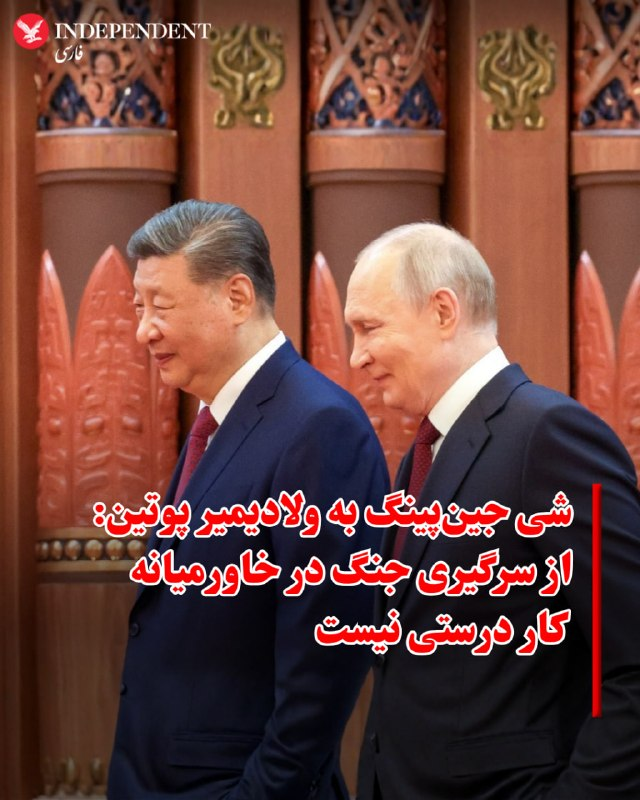
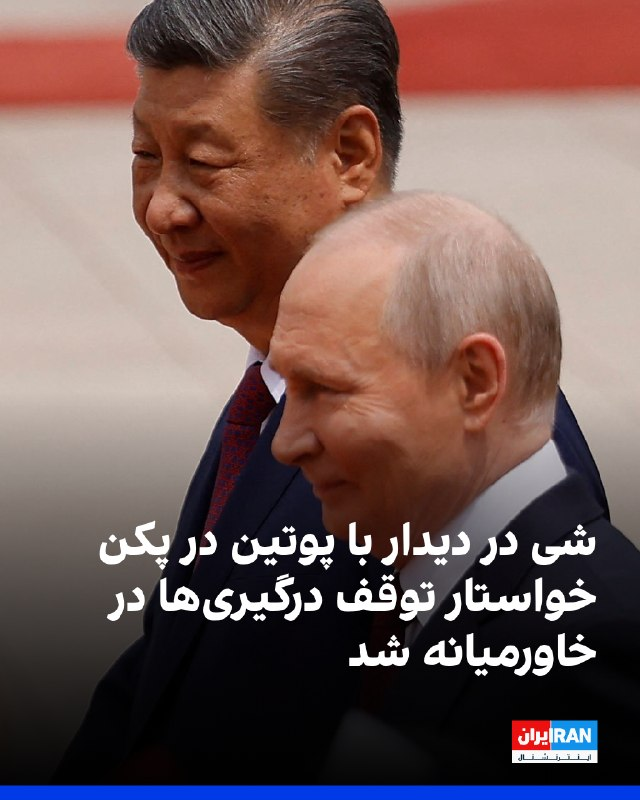
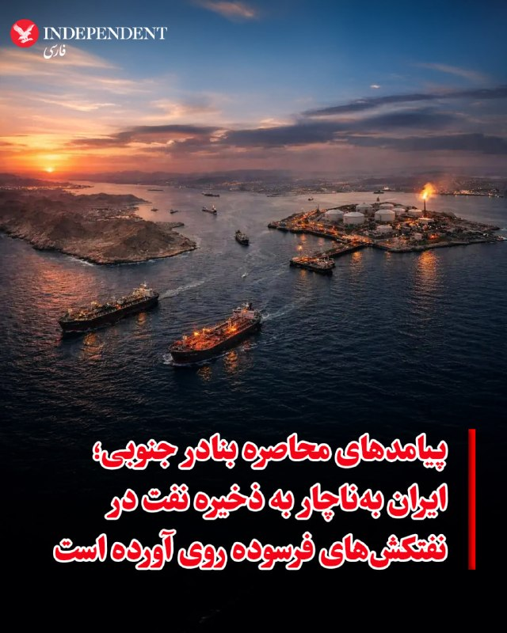
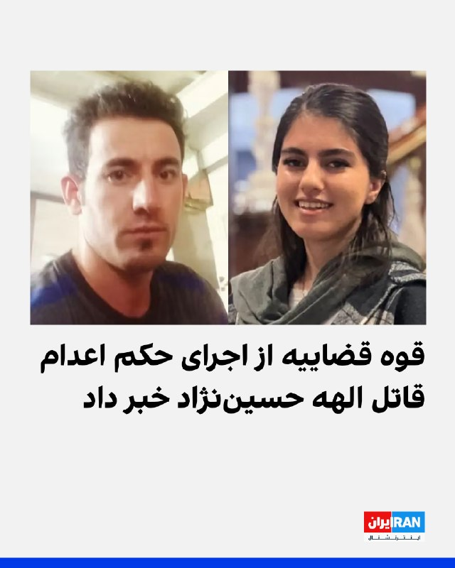
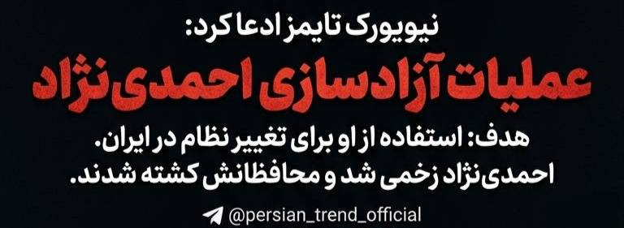
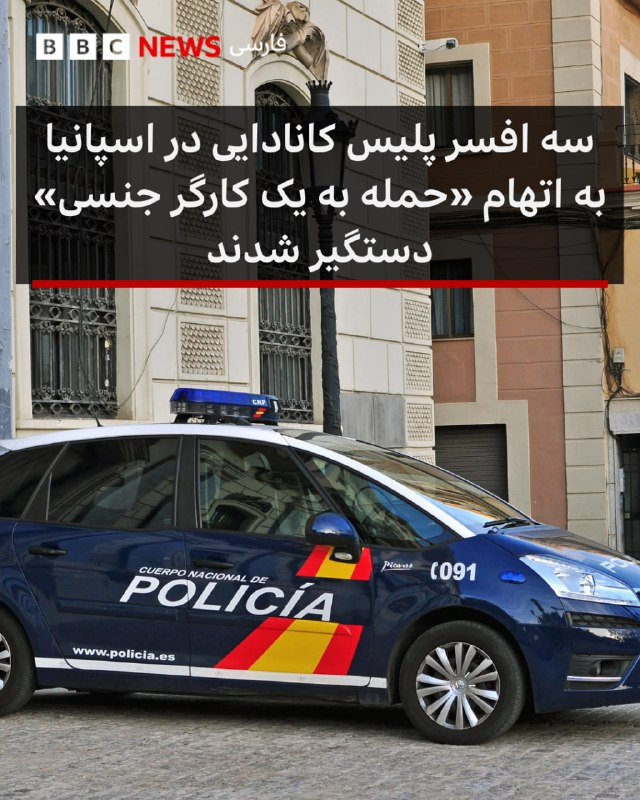
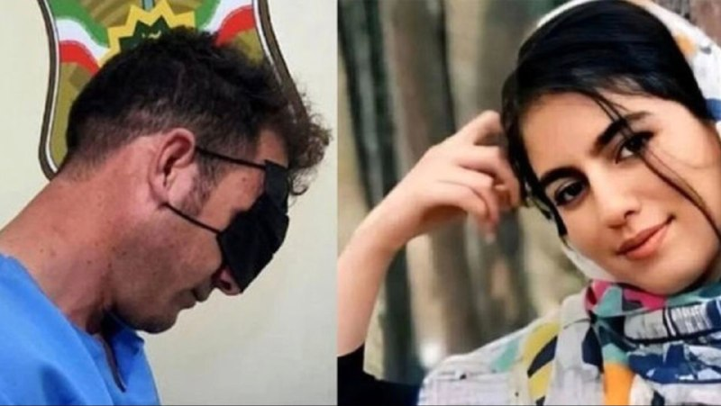

# خواننده تلگرام

<!-- MSG START -->

---
📅 بروزرسانی: 1405/02/30 09:44
---

## VahidOOnLine — post 241086

  

علی خضریان، عضو کمیسیون امنیت ملی مجلس، گفت مطلع شده است عباس عراقچی، وزیر خارجه جمهوری اسلامی، قرار است سفری به نیویورک داشته باشد و با کشورهای حوزه خلیج فارس درباره تنگه هرمز مذاکره کند.

او گفت: «امیدوارم این خبر دروغ باشد، چون برگزاری جلسه‌ای در نیویورک، یعنی در خاک دشمن، و کشورهای خلیج فارس نیز باید مورد بازخواست قرار بگیرند. چنین اقدامی جمهوری اسلامی را در موضع ضعف قرار می‌دهد.»
‌🏁 🇬🇧 IranintlTV

🤖 @VahidOOnLine

## VahidOOnLine — post 241085

  

♦️سردار آزمون، مهاجم با سابقه تیم ملی فوتبال ایران روز سه‌‌شنبه ۲۹ اردیبهشت با انتشار یک روایتگر در اینستاگرام، برای نخستین بار به خط خوردن از فهرست کاروان ایران در جام جهانی آمریکا واکنش نشان داد.

مهاجم شباب الاهلی امارات در این پیام نوشت: ««درسته پیشتون نیستم ولی رفیقام که هستین دلیلی نمیشه بهتون آرزوی موفقیت نکنم... خیلی‌ها می‌خوان خرابم کنن ولی این حرفا اصلا درست نیست، موفق باشین بچه‌ها.»

سردار آزمون پس از کشتار هزاران نفر در جریان انقلاب ملی ایرانیان، عبارت معروف «از خون جوانان وطن لاله دمیده» عارف قزوینی را روی دستش خالکوبی کرد. این مهاجم باسابقه تیم ملی فوتبال ایران در دی ماه ۱۴۰۴ با انتشار ویدیویی از کشته شدگان اعتراضات نوشت: «این‌ها قصه نبودند، واقعی بودند. هیچ‌وقت شما را از یاد نمی‌بریم.»
قوه قضائیه جمهوری اسلامی اموال سردار آزمون را هم پس از این وقایع و «به‌اتهام همکاری با دشمن» توقیف کرد.

پس از حملات جمهوری اسلامی به امارات متحده عربی، انتشار عکسی از سردار آزمون با محمد بن رشید، آل مکتوم، امیر دبی خبرساز شد.
‌🇸🇦 Indypersian

🤖 @VahidOOnLine

## VahidOOnLine — post 241084

  

خبرگزاری میزان، رسانه قوه قضاییه جمهوری اسلامی، اعلام کرد حکم اعدام بهمن فرزانه، قاتل الهه حسین‌نژاد، بامداد چهارشنبه اجرا شده است. الهه حسین‌نژاد در خرداد ۱۴۰۴ برای بازگشت به منزل سوار یک خودرو شده بود، اما راننده او را ربود و پیکر او را در بیابان‌های اطراف تهران رها کرد.
‌🏁 🇬🇧 IranintlTV

🤖 @VahidOOnLine

## VahidOOnLine — post 241083

  

♦️شی جین‌پینگ، رئیس جمهوری چین روز چهارشنبه ۳۰ اردیبهشت به ولادیمیر پوتین گفت ادامه از سرگیری جنگ در خاورمیانه، کار درستی نیست و دو طرف باید به یک آتش‌بس پایدار و مورد قبول دست یابند.

به گزارش خبرگزاری دولتی چین، شی به همتای روس خود گفت: «وضعیت در منطقه خلیج فارس در لحظاتی حیاتی بین جنگ و صلح قرار دارد. باید فورا به پایان کامل جنگ رسید. از سرگیری جنگ کار غلطی است و از سرگیری مذاکرات، واجب‌تر از همیشه است.»

این سخنان در حالی عنوان می‌شود که دونالد ترامپ شامگاه سه‌شنبه بار دیگر جمهوری اسلامی را به از سرگیری حملات تهدید کرد.
‌🇸🇦 Indypersian

🤖 @VahidOOnLine

## VahidOOnLine — post 241082

  

شورای هماهنگی تشکل‌های صنفی فرهنگیان ایران آموزش نظامی به کودکان در برخی مساجد و پایگاه‌های بسیج در ایران را نقض آشکار کنوانسیون حقوق کودک دانست و هشدار داد این روند نگرانی‌های جدی در حوزه حقوق کودک ایجاد کرده است.
این شورا افزود: بر اساس استانداردهای بین‌المللی، مشارکت یا آماده‌سازی افراد زیر ۱۸ سال برای فعالیت‌های نظامی می‌تواند در تعارض با اصل «منافع عالی کودک» تلقی شود.
شورای هماهنگی تشکل‌های صنفی فرهنگیان هشدار داد تداوم این نوع برنامه‌ها، می‌تواند مصداقی از نظامی‌سازی فضای کودکی و نقض تعهدات بین‌المللی در حوزه حقوق کودک باشد و نیازمند بررسی مستقل و شفاف از سوی نهادهای مسئول و بین‌المللی است.

‌🏁 🇬🇧 IranintlTV

🤖 @VahidOOnLine

## VahidOOnLine — post 241081

♦️شی جین‌پینگ، رئیس‌جمهوری چین روز چهارشنبه ۳۰ اردیبهشت و کمتر از یک هفته پس از دیدار با دونالد ترامپ، از ولادیمیر پوتین رئیس جمهوری روسیه استقبال کرد.
روسیه در قرن گذشته ابرقدرتی بود که برای مدت‌ها چین را در سایه خود قرار داده بود. روندی که به نظر می‌رسد هم‌اکنون با سرعت در حال تغییر است.
‌🇸🇦 Indypersian

🤖 @VahidOOnLine

## VahidOOnLine — post 241080

  

روسای جمهوری چین و روسیه در پکن دیدار کردند. شی جین‌پینگ در این دیدار با تاکید بر لزوم مذاکره برای رسیدگی به وضعیت خاورمیانه، خواستار توقف درگیری‌ها شد. او گفت پایان دادن به جنگ به کاهش اختلال در ثبات عرضه انرژی و نظم تجارت بین‌المللی کمک خواهد کرد.
دو طرف در این دیدار پیمان دوستی و همکاری چین و روسیه را تمدید کردند.
پوتین به شی گفت روابط میان روسیه و چین به سطحی بی‌سابقه رسیده است و از او دعوت کرد سال آینده به روسیه سفر کند.

‌🏁 🇬🇧 IranintlTV

🤖 @VahidOOnLine

## VahidOOnLine — post 241079

  

مایک والتز، سفیر آمریکا در سازمان ملل متحد در پستی در ایکس با اشاره به اینکه پول حکومت ایران رو به اتمام است و اقتصادش در حال فروپاشی است، گفت با این حال جمهوری اسلامی به جای تغییر رویه، مشغول اقدام‌های غیرقابل تحملی همچون حملات به زیرساخت‌های غیرنظامی است.
او گفت: «اما نیروهای نظامی جمهوری اسلامی به جای اتخاذ رویکردی جدید و مسالمت‌آمیز، درگیر حملات مکرر و بی‌ملاحظه، به زیرساخت‌های برق غیرنظامی، شده و به استراتژی سلاح‌های هسته‌ای پناه برده‌اند که خطر فرو بردن جهان در تاریکی را به همراه دارد.»
او افزود:«ما نمی‌توانیم این را تحمل کنیم و آن را تحمل نخواهیم کرد.»
والتز گفت: «رییس‌جمهوری ترامپ و ایالات متحده بارها و بارها در این درگیری مورد تردید قرار گرفته‌اند، اما به نظر من این بار دیگر روشن شده که رییس‌جمهوری در حال انجام اقداماتی است که برای تضمین آینده‌ای امن‌تر برای جهان ضروری است.»
سفیر آمریکا در سازمان ملل متحد افزود: «آنچه باید بر آن تمرکز کنیم، حکومتی است که به‌تازگی به یک نیروگاه هسته‌ای در یک کشور همسایه حمله کرده است.»

‌🏁 🇬🇧 IranintlTV

🤖 @VahidOOnLine

## VahidOOnLine — post 241078

  

♦️به گزارش فایننشال تایمز، ایران ناچار شده نفت خود را روی نفتکش‌های فرسوده‌ای که در خلیج فارس لنگر انداخته‌اند ذخیره کند، زیرا محاصره آمریکا به‌طور شدید توان صادرات نفت خام را محدود کرده است.
این نشریه با استناد به داده‌های سازمان «اتحاد علیه ایران هسته‌ای» گزارش داد که در حال حاضر حدود ۳۹ نفتکش حامل نفت و محصولات پتروشیمی ایران در خلیج فارس مستقر هستند؛ در حالی که پیش از اجرایی شدن این محاصره در ۱۳ آوریل، این رقم ۲۹ کشتی بود. تعداد زیادی از این کشتی‌ها در نزدیکی پایانه صادرات نفت ایران در جزیره خارگ تجمع کرده‌اند.
فایننشال تایمز همچنین ۱۳ نفتکش مشکوک دیگر را در نزدیکی بندر چابهار در خلیج عمان شناسایی کرده که در شرق تنگه هرمز قرار دارد و عملا در امتداد خط محاصره دریایی آمریکا واقع شده‌اند.
پیش از حملات آمریکا و اسرائیل، ایران ماهانه بین ۴۰ تا ۶۰ میلیون بشکه نفت صادر می‌کرد؛ حدود ۲ درصد از عرضه جهانی.
‌🇸🇦 Indypersian

🤖 @VahidOOnLine

## VahidOOnLine — post 241077

  <a href="telegram/content/VahidOOnLine_241077_1779257689.mp4">🎬 Download video</a>

♦️دو ماه و نیم پس از معرفی مجتبی خامنه‌ای به عنوان سومین رهبر نظام و در حالی که هنوز هیچ صدا و تصویر جدیدی از او منتشر نشده و رسانه‌های حکومتی با استفاده از هوش مصنوعی به تولید محتوا درباره او مشغولند، صداوسیما از «مشت گره کرده» منسوب به مجتبی خامنه‌ای رونمایی کرد. در دو ماه اخیر روایت‌های متعددی درباره وضعیت مجتبی خامنه‌ای که در روز نخست عملیات نظامی آمریکا و اسرائیل همراه با پدرش در مجموعه «بیت رهبری» هدف گرفته شده، منتشر شده است. در حالی که علی خامنه‌ای، رهبر سابق نیز هنوز دفن نشده، برخی منابع حکومتی ادعا کرده‌اند که پسرش زنده و سالم است اما برای اینکه مکان اختفای او شناسایی نشود، در انظار عمومی ظاهر نمی‌شود. به تدریج روایت‌هایی که بر سالم بودن او تاکید داشتند جای خود را به اینکه او مجروح شده تغییر پیدا کرد و بعد میزان و نوع جراحت موضوع روایت‌های متناقض شد. برآوردهای آمریکا و اسرائیل نیز در آغاز به احتمال مرگ یا در کما بودن او اشاره داشت و بعدا در بیشتر گزارش‌ها تاکید شد که مجتبی خامنه‌ای به شدت مجروح شده است. در این مدت، بیانیه‌‌هایی نوشتاری منسوب به او در صداوسیما قرائت شده است.
‌🇸🇦 Indypersian

🤖 @VahidOOnLine

## VahidOOnLine — post 241076

  

مریم طهماسبی، عروس معصومه ابتکار، گروگان‌گیر سفارت آمریکا در ایران و معاون پیشین رییس‌جمهور، در مصاحبه تلفنی با آسوشیتدپرس از یک بازداشتگاه مهاجرتی در تگزاس درباره علت اقامتشان در آمریکا گفت: «تنها چیزی که می‌خواستیم این بود که پسرمان زندگی عادی داشته باشد.»
او افزود: «من و همسرم، عیسی هاشمی، می‌خواهیم در حالی که پسرمان به دبیرستان بازمی‌گردد، تدریس را از سر بگیریم.»
طهماسبی گفت: «ما هرگز فکر نمی‌کردیم که دستگیر شویم. خانواده ما از طبقه متوسط است و هیچ ارتباطی با پول یا قدرت ندارد.»
عروس معصومه ابتکار خاطرنشان کرد: «فرض ما این بود که تا زمانی که از همه قوانین و مقررات پیروی کنیم، در امان خواهیم بود.»
به گزارش آسوشیتدپرس، این خانواده که یک دهه است در ایالات متحده زندگی می‌کنند، پس از دستگیری به دلیل ارتباط‌‌شان با معصومه ابتکار، خواستار آزادی خود از بازداشتگاه مهاجرتی شده‌اند.
یک قاضی فدرال پس از آن‌که این خانواده دادخواست‌هایی را علیه قانونی بودن بازداشت خود ارائه کرد، دولت را به طور موقت از اخراج آنها منع کرد. آنها از زمان دستگیری در اوایل آوریل در لس‌آنجلس، در مرکز مهاجرتی در ایالت تگزاس نگهداری می‌شوند.
‌🏁 🇬🇧 IranintlTV

🤖 @VahidOOnLine

## VahidOOnLine — post 241075

  <a href="telegram/content/VahidOOnLine_241075_1779257690.mp4">🎬 Download video</a>

♦️چارلز سوم، پادشاه بریتانیا، به همراه ملکه کامیلا در آغاز سفر سالانه خود به ایرلند شمالی، در رویدادی فرهنگی در «تامپسون داک» بلفاست شرکت کردند.
در این برنامه، آن‌ها در فضایی پرنشاط با موسیقی زنده و نمایش‌های فرهنگی ایرلندی همراه شدند؛ رویدادی که در آستانه برگزاری جشنواره موسیقی سنتی ایرلندی «Fleadh Cheoil» برگزار شد بزرگ‌ترین جشن سالانه موسیقی سنتی ایرلندی که امسال برای نخستین‌بار میزبانش شهر بلفاست خواهد بود.
پادشاه و ملکه همچنین از دستگاه‌های تقطیر تایتانیک «Titanic Distillers» بازدید کردند؛ جایی تاریخی که در ساختمان بازسازی‌شده‌ای قرار دارد که زمانی در ساخت کشتی تایتانیک نقش داشته و امروز به تولید ویسکی اختصاص یافته است.
‌🇸🇦 Indypersian

🤖 @VahidOOnLine

## VahidOnline — post 75566

  <a href="telegram/content/VahidOnline_75566_1779257690.mp4">🎬 Download video</a>

پوتین هم به خدمت شی رسید.
J74wabx

📡 @VahidOnline

## VahidOnline — post 75565

  

ترجمه ماشین
تیتر نیویورک‌تایمز: هدف اولیه جنگ، روی کار آوردن رئیس‌جمهور تندروی پیشین به عنوان رهبر ایران بود

بخش‌های خبری مطلب:
به گفته مقامات آمریکایی، حمله اسرائیل که با هدف آزادی محمود احمدی‌نژاد از حبس خانگی در تهران طراحی شده بود، بخشی از تلاش‌ها برای تغییر رژیم و به قدرت رساندن او بود.

چند روز پس از آنکه حملات اسرائیل در آغازین روزهای جنگ، رهبر ایران و سایر مقامات ارشد را به قتل رساند، پرزیدنت ترامپ علناً اظهار داشت که بهتر است «شخصی از درون» ایران کنترل کشور را به دست بگیرد.
اکنون مشخص شده است که ایالات متحده و اسرائیل با در نظر داشتن شخصیتی خاص و بسیار غافلگیرکننده وارد این درگیری شدند: محمود احمدی‌نژاد، رئیس‌جمهور پیشین ایران که به دلیل دیدگاه‌های تندرو، ضداسرائیلی و ضدآمریکایی‌اش شناخته می‌شود.

اما بر اساس گفته‌های مقامات آمریکاییِ مطلع از این موضوع، این طرح جسورانه که توسط اسرائیلی‌ها تدوین شده بود و با آقای احمدی‌نژاد نیز درباره آن مشورت شده بود، به سرعت با شکست مواجه شد.

مقامات آمریکایی و یکی از نزدیکان آقای احمدی‌نژاد اعلام کردند که او در روز اول جنگ بر اثر حمله اسرائیل به خانه‌اش در تهران - که برای رهایی او از حصر خانگی طراحی شده بود - مجروح شد. آن‌ها گفتند که او از این حمله جان سالم به در برد، اما پس از این خطر جانی، نسبت به طرح تغییر رژیم دلسرد و ناامید شد.

او از آن زمان تاکنون در انظار عمومی دیده نشده است و مکان و وضعیت فعلی او نامشخص است.
...
اینکه آقای احمدی‌نژاد چگونه برای مشارکت در این طرح به کار گرفته شد، هنوز در هاله‌ای از ابهام قرار دارد.
...
سخنگوی موساد، سازمان اطلاعات خارجی اسرائیل، از اظهارنظر در این باره خودداری کرد.
...
مقامات آمریکایی گفتند که این حمله - که توسط نیروی هوایی اسرائیل انجام شد - به منظور کشتن نگهبانان مراقب آقای احمدی‌نژاد و به عنوان بخشی از طرحی برای رهایی او از حبس خانگی صورت گرفت.
این حمله آسیب چندانی به خانه آقای احمدی‌نژاد که در انتهای یک کوچه بن‌بست قرار داشت، وارد نکرد. اما پاسگاه امنیتی در ورودی کوچه مورد اصابت قرار گرفت. تصاویر ماهواره‌ای نشان می‌دهد که آن ساختمان ویران شده است.

در روزهای پس از آن، خبرگزاری‌های رسمی روشن کردند که او جان سالم به در برده است، اما «محافظان» او - که در واقع اعضای سپاه پاسداران انقلاب اسلامی بودند و همزمان وظیفه محافظت و نگهداری او در حبس خانگی را بر عهده داشتند - کشته شده‌اند.

مقاله‌ای در نشریه آتلانتیک در ماه مارس، با استناد به منابع ناشناس نزدیک به آقای احمدی‌نژاد، نوشت که رئیس‌جمهور پیشین پس از حمله به خانه‌اش از حصر دولتی آزاد شده است؛ این مقاله آن رویداد را «در عمل یک عملیات فرار از زندان» توصیف کرد.

پس از انتشار آن مقاله، یکی از نزدیکان آقای احمدی‌نژاد در گفتگو با نیویورک تایمز تأیید کرد که آقای احمدی‌نژاد این حمله را به عنوان تلاشی برای آزادی خود تلقی کرده است. این فرد مطلع گفت که آمریکایی‌ها آقای احمدی‌نژاد را شخصی می‌دانستند که می‌تواند ایران را رهبری کند و توانایی مدیریت «وضعیت سیاسی، اجتماعی و نظامی ایران» را دارد.
این فرد مطلع اظهار داشت که آقای احمدی‌نژاد می‌توانست در آینده نزدیک «نقش بسیار مهمی» در ایران ایفا کند و اشاره کرد که ایالات متحده او را شبیه به دلسی رودریگز می‌دید؛ کسی که پس از دستگیری آقای مادورو توسط نیروهای آمریکایی در ونزوئلا قدرت را به دست گرفت و از آن زمان همکاری نزدیکی با دولت ترامپ داشته است.
...

در چند سال گذشته آقای احمدی‌نژاد سفرهایی به خارج از ایران داشته است که به گمانه‌زنی‌ها دامن زده است.
به گزارش مجله نیولاینز، او در سال ۲۰۲۳ به گواتمالا و در سال‌های ۲۰۲۴ و ۲۰۲۵ به مجارستان سفر کرد. هر دو کشور روابط نزدیکی با اسرائیل دارند.
ویکتور اوربان، نخست‌وزیر مجارستان در آن زمان، روابط نزدیکی با آقای نتانیاهو دارد. در طول این سفرها به مجارستان، آقای احمدی‌نژاد در دانشگاهی مرتبط با آقای اوربان سخنرانی کرد.

او تنها چند روز قبل از آغاز حملات اسرائیل به ایران در ژوئن گذشته از بوداپست بازگشت. زمانی که آن جنگ درگرفت، او حضور علنی کمرنگی داشت و تنها چند بیانیه در شبکه‌های اجتماعی منتشر کرد. سکوت نسبی او در مورد جنگ با کشوری که آقای احمدی‌نژاد مدت‌ها آن را دشمن اصلی ایران می‌دانست، مورد توجه بسیاری در شبکه‌های اجتماعی ایران قرار گرفت.
...
nytimes

📡 @VahidOnline

## IranIntlTV — post 338036

  <a href="telegram/content/IranIntlTV_338036_1779257691.mp4">🎬 Download video</a>

سازمان ملل متحد در گزارشی تازه هشدار داده تبعات جنگ در خاورمیانه اکنون از بازار انرژی فراتر رفته و از تورم و قیمت مواد غذایی تا رشد اقتصادی جهان را تحت تاثیر قرار داده است.

جزییات بیشتر با علیرضا محبی، خبرنگار ایران‌اینترنشنال
@iranintltv

## IranIntlTV — post 338035

  <a href="telegram/content/IranIntlTV_338035_1779257692.mp4">🎬 Download video</a>

شبکه ام‌تی‌وی لبنان گزارش داد حزب‌الله لبنان از جنبش‌های پیشاهنگی خود برای پرورش نسلی مطیع و آماده مرگ استفاده می‌کند. بر اساس این گزارش، این کودکان عمدتا فرزندان نیروهای حزب‌الله هستند و از برخی از آنها برای «جاسوسی» و «انتقال مهمات» استفاده می‌شود.
این گزارش همچنین تاکید کرد بخشی از این کودکان با وفاداری به روح‌الله خمینی و آرمان‌های او پرورش یافته‌اند.

گفت‌وگو با کامیار بهرنگ، عضو تحریریه ایران‌اینترنشنال
@iranintltv

## IranIntlTV — post 338034

  <a href="telegram/content/IranIntlTV_338034_1779257693.mp4">🎬 Download video</a>

میعاد ملکی، رییس پیشین دفتر هدف‌گذاری تحریم‌های وزارت خزانه‌داری آمریکا، گفت تحریم‌های جدید آمریکا علیه جمهوری اسلامی، انتقال درآمدهای نفتی و پتروشیمی را دشوارتر خواهد کرد. او همچنین گفت محاصره دریایی، تاثیر به‌مراتب بیشتری بر اقتصاد تهران خواهد داشت تا اقتصاد جهانی.
@iranintltv

## IranIntlTV — post 338033

  <a href="telegram/content/IranIntlTV_338033_1779257695.mp4">🎬 Download video</a>

دونالد ترامپ، رییس‌جمهوری آمریکا، گفت احتمال دارد ایالات متحده بار دیگر به جمهوری اسلامی حمله کند، اما هنوز تصمیم نهایی در این‌باره گرفته نشده است.

گفت‌وگو با شهرام خلدی، پژوهش‌گر تاریخ خاورمیانه و روابط بین‌الملل
@iranintltv

## IranIntlTV — post 338032

  <a href="telegram/content/IranIntlTV_338032_1779257697.mp4">🎬 Download video</a>

امید معماریان، تحلیل‌گر سیاسی در موسسه دان، گفت کاهش بخشی از نیروها و توان نظامی آمریکا در اروپا، هزینه‌های بیشتری بر سیاست‌های دفاعی و نظامی ناتو تحمیل خواهد کرد.
@iranintltv

## IranIntlTV — post 338031

  

علی خضریان، عضو کمیسیون امنیت ملی مجلس، گفت مطلع شده است عباس عراقچی، وزیر خارجه جمهوری اسلامی، قرار است سفری به نیویورک داشته باشد و با کشورهای حوزه خلیج فارس درباره تنگه هرمز مذاکره کند.

او گفت: «امیدوارم این خبر دروغ باشد، چون برگزاری جلسه‌ای در نیویورک، یعنی در خاک دشمن، و کشورهای خلیج فارس نیز باید مورد بازخواست قرار بگیرند. چنین اقدامی جمهوری اسلامی را در موضع ضعف قرار می‌دهد.»
https://iranintl.com/202605207168

## IranIntlTV — post 338030

  <a href="telegram/content/IranIntlTV_338030_1779257699.mp4">🎬 Download video</a>

بنابر گزارش وب‌سایت اتلتیک، فدراسیون جهانی فوتبال، فیفا، ممکن است به درخواست جمهوری اسلامی ورود پرچم شیر و خورشید به ورزشگاه‌های جام جهانی ۲۰۲۶ را ممنوع کند.

گفت‌وگو با عرفان قانعی‌فرد، تحلیل‌گر خاورمیانه
@iranintltv

## IranIntlTV — post 338029

  

خبرگزاری میزان، رسانه قوه قضاییه جمهوری اسلامی، اعلام کرد حکم اعدام بهمن فرزانه، قاتل الهه حسین‌نژاد، بامداد چهارشنبه اجرا شده است. الهه حسین‌نژاد در خرداد ۱۴۰۴ برای بازگشت به منزل سوار یک خودرو شده بود، اما راننده او را ربود و پیکر او را در بیابان‌های اطراف تهران رها کرد.
https://iranintl.com/202605200731

## IranIntlTV — post 338028

  <a href="telegram/content/IranIntlTV_338028_1779257700.mp4">🎬 Download video</a>

سرخط خبرهای چهارشنبه ۳۰ اردیبهشت
@iranintltv

## IranIntlTV — post 338027

  <a href="telegram/content/IranIntlTV_338027_1779257702.mp4">🎬 Download video</a>

سرخط خبرهای چهارشنبه ۳۰ اردیبهشت
@iranintltv

## IranIntlTV — post 338026

  

شورای هماهنگی تشکل‌های صنفی فرهنگیان ایران آموزش نظامی به کودکان در برخی مساجد و پایگاه‌های بسیج در ایران را نقض آشکار کنوانسیون حقوق کودک دانست و هشدار داد این روند نگرانی‌های جدی در حوزه حقوق کودک ایجاد کرده است.
این شورا افزود: بر اساس استانداردهای بین‌المللی، مشارکت یا آماده‌سازی افراد زیر ۱۸ سال برای فعالیت‌های نظامی می‌تواند در تعارض با اصل «منافع عالی کودک» تلقی شود.
شورای هماهنگی تشکل‌های صنفی فرهنگیان هشدار داد تداوم این نوع برنامه‌ها، می‌تواند مصداقی از نظامی‌سازی فضای کودکی و نقض تعهدات بین‌المللی در حوزه حقوق کودک باشد و نیازمند بررسی مستقل و شفاف از سوی نهادهای مسئول و بین‌المللی است.

https://iranintl.com/202605201370

## IranIntlTV — post 338025

  

روسای جمهوری چین و روسیه در پکن دیدار کردند. شی جین‌پینگ در این دیدار با تاکید بر لزوم مذاکره برای رسیدگی به وضعیت خاورمیانه، خواستار توقف درگیری‌ها شد. او گفت پایان دادن به جنگ به کاهش اختلال در ثبات عرضه انرژی و نظم تجارت بین‌المللی کمک خواهد کرد.
دو طرف در این دیدار پیمان دوستی و همکاری چین و روسیه را تمدید کردند.
پوتین به شی گفت روابط میان روسیه و چین به سطحی بی‌سابقه رسیده است و از او دعوت کرد سال آینده به روسیه سفر کند.

https://iranintl.com/202605201022

## IranIntlTV — post 338024

  

مایک والتز، سفیر آمریکا در سازمان ملل متحد در پستی در ایکس با اشاره به اینکه پول حکومت ایران رو به اتمام است و اقتصادش در حال فروپاشی است، گفت با این حال جمهوری اسلامی به جای تغییر رویه، مشغول اقدام‌های غیرقابل تحملی همچون حملات به زیرساخت‌های غیرنظامی است.
او گفت: «اما نیروهای نظامی جمهوری اسلامی به جای اتخاذ رویکردی جدید و مسالمت‌آمیز، درگیر حملات مکرر و بی‌ملاحظه، به زیرساخت‌های برق غیرنظامی، شده و به استراتژی سلاح‌های هسته‌ای پناه برده‌اند که خطر فرو بردن جهان در تاریکی را به همراه دارد.»
او افزود:«ما نمی‌توانیم این را تحمل کنیم و آن را تحمل نخواهیم کرد.»
والتز گفت: «رییس‌جمهوری ترامپ و ایالات متحده بارها و بارها در این درگیری مورد تردید قرار گرفته‌اند، اما به نظر من این بار دیگر روشن شده که رییس‌جمهوری در حال انجام اقداماتی است که برای تضمین آینده‌ای امن‌تر برای جهان ضروری است.»
سفیر آمریکا در سازمان ملل متحد افزود: «آنچه باید بر آن تمرکز کنیم، حکومتی است که به‌تازگی به یک نیروگاه هسته‌ای در یک کشور همسایه حمله کرده است.»

https://iranintl.com/202605208409

## IranIntlTV — post 338023

  

مریم طهماسبی، عروس معصومه ابتکار، گروگان‌گیر سفارت آمریکا در ایران و معاون پیشین رییس‌جمهور، در مصاحبه تلفنی با آسوشیتدپرس از یک بازداشتگاه مهاجرتی در تگزاس درباره علت اقامتشان در آمریکا گفت: «تنها چیزی که می‌خواستیم این بود که پسرمان زندگی عادی داشته باشد.»
او افزود: «من و همسرم، عیسی هاشمی، می‌خواهیم در حالی که پسرمان به دبیرستان بازمی‌گردد، تدریس را از سر بگیریم.»
طهماسبی گفت: «ما هرگز فکر نمی‌کردیم که دستگیر شویم. خانواده ما از طبقه متوسط است و هیچ ارتباطی با پول یا قدرت ندارد.»
عروس معصومه ابتکار خاطرنشان کرد: «فرض ما این بود که تا زمانی که از همه قوانین و مقررات پیروی کنیم، در امان خواهیم بود.»
به گزارش آسوشیتدپرس، این خانواده که یک دهه است در ایالات متحده زندگی می‌کنند، پس از دستگیری به دلیل ارتباط‌‌شان با معصومه ابتکار، خواستار آزادی خود از بازداشتگاه مهاجرتی شده‌اند.
یک قاضی فدرال پس از آن‌که این خانواده دادخواست‌هایی را علیه قانونی بودن بازداشت خود ارائه کرد، دولت را به طور موقت از اخراج آنها منع کرد. آنها از زمان دستگیری در اوایل آوریل در لس‌آنجلس، در مرکز مهاجرتی در ایالت تگزاس نگهداری می‌شوند.

## FarsiVOA — post 218200

  

آمارهای گمرکی چین حاکی از افت ۷۰ درصدی تجارت دوجانبه با ایران بعد از آغاز عملیات مشترک نظامی آمریکا و اسرائیل علیه جمهوری اسلامی است.

طبق داده‌های گمرک چین، این کشور در ماه‌های مارس و آوریل به طور متوسط ماهانه ۲۰۰ میلیون دلار تجارت دوجانبه با ایران داشته؛ در حالی که در ماه‌های ژانویه و فوریه این رقم حدود ۷۰۰ میلیون دلار بود.

گمرک چین سال‌هاست که آمارهای خرید نفت از ایران را از داده‌های مربوط به تجارت دوجانبه خارج کرده، اما آمارهای کپلر نشان می‌دهد خرید روزانه نفت ایران توسط پالایشگاه‌های چینی نیز در ماه گذشته تنها ۱.۱۶ میلیون بشکه بوده که حدود ۳۰ درصد کمتر از ماه‌های گذشته است.

⬇️ بیشتر بخوانید:
https://ir.voanews.com/a/8151968.html

## FarsiVOA — post 218199

  

نیویورک‌تایمز گزارش داد اسرائیل در جریان طراحی یک طرح چندمرحله‌ای برای سرنگونی جمهوری اسلامی، محمود احمدی‌نژاد را به‌عنوان گزینه‌ای برای رهبری ایران پس از حذف علی خامنه‌ای و شماری از مقام‌های ارشد حکومت در نظر گرفته بود.

به نوشته این روزنامه، هنوز روشن نیست احمدی‌نژاد چگونه وارد این طرح شده یا چه میزان از جزئیات آن اطلاع داشته است. با این حال، بسیاری از مشاوران دونالد ترامپ این ایده را غیرواقع‌بینانه می‌دانستند و برخی مقام‌های آمریکایی به‌ویژه درباره امکان بازگرداندن احمدی‌نژاد به قدرت تردید داشتند.

نیویورک‌تایمز همچنین نوشت شماری از مقام‌های جمهوری اسلامی که در حمله به بیت رهبری کشته شدند، از نگاه کاخ سفید در میان چهره‌هایی قرار داشتند که آمادگی بیشتری برای گفت‌وگو درباره تغییر حکومت داشتند.

در همان دوره، رسانه‌های ایران ابتدا گزارش‌هایی درباره کشته‌شدن احمدی‌نژاد در حمله هوایی به خانه‌اش منتشر کردند؛ اما بعداً اعلام شد او زنده مانده است. تصاویر ماهواره‌ای نشان می‌داد خانه او آسیب جدی ندیده، اما پایگاه امنیتی ورودی کوچه کاملاً تخریب شده است.
@FarsiVOA

## FarsiVOA — post 218198

  

قوه قضائیه جمهوری اسلامی اعلام کرد حکم قصاص متهم به قتل الهه حسین‌نژاد، پس از تأیید در دیوان عالی کشور و با درخواست اولیای دم، اجرا شده است. رسانه‌های داخلی نام متهم این پرونده را بهمن فرزانه اعلام کرده‌اند.

الهه حسین‌نژاد خرداد ۱۴۰۴ پس از سوار شدن به یک خودروی مسافرکش برای بازگشت به خانه ناپدید شد. چند روز بعد، پیکر او در بیابان‌های اطراف تهران پیدا شد.

در گزارش‌های رسمی ادعا شده متهم پس از بازداشت به قتل اعتراف کرده و کیفرخواست پرونده با اتهام قتل عمد، مخفی کردن جسد و صدمه به اموال مقتول به دادگاه کیفری یک استان تهران ارسال شده است.

اجرای این حکم در حالی اعلام می‌شود که گزارش تازه عفو بین‌الملل از افزایش شدید اعدام‌ها در ایران در سال ۲۰۲۵ خبر داده است.

بر اساس این گزارش، جمهوری اسلامی در سال ۲۰۲۵ دست‌کم ۲۱۵۹ نفر را اعدام کرده؛ رقمی که بیش از دو برابر آمار سال ۲۰۲۴ است و ایران را عامل اصلی جهش جهانی اعدام‌ها در بالاترین سطح ثبت‌شده طی ۴۴ سال گذشته معرفی می‌کند.

عفو بین‌الملل می‌گوید آمار جهانی اعدام‌ها در سال ۲۰۲۵، بدون احتساب چین، کره شمالی و ویتنام، به ۲۷۰۷ مورد رسیده است.
@FarsiVOA

## FarsiVOA — post 218197

⚡️سنتکام اعلام کرد که از زمان اجرای محاصره دریایی جمهوری اسلامی نیروهای آمریکایی ۸۹ کشتی را وادار به تغییر مسیر کرده‌اند. سنتکام گفت مانع هرگونه جریان تجاری به داخل و خارج از بنادر ایران شده است تا محاصره دریایی علیه جمهوری اسلامی به طور کامل اجرا شود.
@FarsiVOA

## DW_Farsi — post 124910

  

🔶 "ارتش آمریکا دست‌کم ۱۰ مین را در تنگه هرمز شناسایی کرده است"
 
سی‌بی‌اِس نیوز به نقل از مقام‌های ایالات متحده که نخواسته‌اند نام‌شان فاش شود، بر مبنای یک ارزیابی اطلاعاتی اخیر گزارش داده که نیروهای ارتش این کشور دست‌کم ۱۰ مین را در تنگه هرمز  شناسایی کرده‌اند.
 
سی‌بی‌اِس نیوز پیش‌تر در ماه مارس گزارش داده بود که بر اساس ارزیابی‌های اطلاعاتی آمریکا در آن زمان، دست‌کم ۱۲ مین زیرآبی در تنگه هرمز وجود داشته است. مقام‌های آمریکایی در ماه مارس گفته بودند مین‌هایی که اکنون جمهوری اسلامی در تنگه هرمز به کار گرفته، مین‌های چسبنده "مهام ۳" و "مهام ۷" ساخت ایران هستند. یک مقام دیگر ایالات متحده تعداد آن‌ها را کمتر از ۱۲ عدد اعلام کرده بود.
   
ایالات متحده هشدار داده است که عبور از مسیر عادی در تنگه هرمز می‌تواند به دلیل مین‌هایی که جمهوری اسلامی در تنگه هرمز کار گذاشته، "بسیار خطرناک" باشد.
 
پنتاگون پیش از این، تصویری گرافیکی منتشر کرده بود که نشان می‌داد جمهوری اسلامی در ۲۳ آوریل مین‌های جدیدی در تنگه هرمز کار گذاشته است.
 
@dw_farsi

## DW_Farsi — post 124909

🔶 ترامپ: جنگ با ایران را خیلی سریع پایان خواهیم داد
 
به گزارش خبرگزاری رویترز، دونالد ترامپ، رئیس ‌جمهور ایالات متحده، در کاخ سفید به اعضای کنگره گفته است که ایالات متحده، "جنگ با ایران را خیلی سریع" پایان خواهد داد.
 
همزمان دو مقام ایالات متحده به اکسیوس گفته‌اند که ترامپ، شامگاه دوشنبه جلسه‌ای با تیم ارشد امنیت ملی خود درباره ایران برگزار کرد که شامل ارائه گزارشی درباره گزینه‌های نظامی بود. بر اساس این گزارش، این جلسه چند ساعت پس از آن برگزار شد که ترامپ اعلام کرده بود حملات برنامه‌ریزی‌شده روز سه‌شنبه به ایران را متوقف کرده است.
 
ترامپ همچنان در تازه‌ترین اظهارنظرهای خود درباره جنگ ایران گفته است که جمهوری اسلامی تنها چند روز برای رسیدن به یک پیشرفت دیپلماتیک فرصت دارد.
 
او روز دوشنبه گفت که ضرب‌الاجل برای تعیین تکلیف این موضوع، "دو سه روز، شاید جمعه یا شنبه، یا اوایل هفته آینده" است.
 
به گفته مقام‌های ایالات متحده و منابع منطقه‌ای، تصمیم ترامپ برای خودداری از حمله تا حدی به دلیل نگرانی‌هایی بود که چند رهبر کشورهای خلیج فارس درباره حملات تلافی‌جویانه جمهوری اسلامی علیه تاسیسات نفتی و زیرساخت‌هایشان مطرح کرده بودند.
 
به گزارش اکسیوس، حاضران در جلسه با ترامپ، جی‌دی ونس، معاون او، مارکو روبیو، وزیر امور خارجه، استیو ویتکاف، فرستاده کاخ سفید، پیت هگست، وزیر دفاع، ژنرال دن کین، رئیس ستاد مشترک ارتش، جان رتکلیف، رئیس سازمان اطلاعات مرکزی آمریکا (سیا)، و دیگر مقام‌های ارشد بوده‌اند.
 
یک منبع منطقه‌ای نیز به اکسیوس گفته است که میانجی‌ها در تلاش هستند تا جمهوری اسلامی را متقاعد کنند موضعی انعطاف‌پذیرتر ارائه دهد که خواسته‌های هسته‌ای ایالات متحده را در بر بگیرد.
 
این در حالی است که ترامپ روز سه‌شنبه گفته بود: «ممکن است مجبور شویم یک ضربه بزرگ دیگر به ایران وارد کنیم. هنوز مطمئن نیستم. خیلی زود خواهید فهمید.»
 
این خبرگزاری پیش از این گزارش داده بود که ترامپ از زمان آغاز جنگ در ماه فوریه تا کنون "دست کم شش بار ضرب‌الاجل‌های اعلام‌شده را تمدید کرده و حمله‌های برنامه‌ریزی شده علیه جمهوری اسلامی را به تعویق انداخته است."
@dw_farsi

## DW_Farsi — post 124908

🔶 نمایش کلاشینکف روی آنتن؛ "بازگشت پروپاگاندای جنگی دهه شصت"
 
🔻 گزارشی از الینا فرهادی
 
در هفته‌های اخیر، آنتن شبکه‌های مختلف صدا و سیمای جمهوری اسلامی ایران شاهد تحولی بی‌سابقه و تامل‌برانگیز بوده است؛ قاب‌هایی که پیش از این به پادگان‌ها و رژه‌های نظامی محدود می‌شد، اکنون به برنامه‌های زنده، استودیوهای روتین و حتی دستان مجریان تلویزیونی راه یافته است.
 
از آموزش گام‌به‌گام باز و بسته کردن اسلحه کلاشنیکف تا نمایش تیربارهای سنگین و موشک‌اندازهای آرپی‌جی، رسانه رسمی حکومت ایران آشکارا یک "جامعه مسلح" و آماده برای بدترین سناریوها را تصویر می‌کند. بازوهای مدیریتی صداوسیما این روند را بخشی طبیعی از "آرایش جنگی رسانه ملی" در بحبوحه تنش‌های فزاینده منطقه‌ای می‌دانند. محسن برمهانی، معاون سیما، با صراحتی کم‌سابقه معتقد است در شرایط فعلی، وظیفه تلویزیون نه صرفا اطلاع‌رسانی، بلکه "تهییج و آموزش" برای مفاهیم جهاد و مقاومت است. در همین راستا، حسن عابدینی، معاون سیاسی این سازمان، نمایش اسلحه در دست مجریان و مهمانان را اقدامی "نمادین" برای بازنمایی آمادگی نیروهای داوطلب در برابر تهدیدات خارجی ارزیابی می‌کند.
 
 اما ناظران و حتی برخی رسانه‌های داخلی، این ویترین جدید را نشانه‌ای از یک بازآرایی استراتژیک با اهداف چندگانه داخلی و خارجی ارزیابی می‌کنند.
 
تحلیل‌گران مسائل سیاسی معتقدند این حجم از نظامی‌گری عریان بر صفحه تلویزیون، پیام پیچیده‌ای را حمل می‌کند که لزوما مخاطب خارجی یا دشمنان منطقه‌ای را هدف نگرفته است. منتقدان می‌گویند فراتر از نمایش بازدارندگی در برابر تهدیدهای بیرونی، این تصاویر پالس‌های مشخصی از ارعاب روانی را به جامعه معترض و مستعد بحران در داخل مخابره می‌کند؛ جامعه‌ای که زیر بار فشارهای خردکننده اقتصادی و انسداد سیاسی قرار دارد. در واقع، ابهام بزرگ اینجاست که آیا حاکمیت در حال آماده‌سازی هواداران خود برای یک رویارویی بزرگ نظامی است، یا آگاهانه بذر اضطراب اجتماعی را می‌پاشد تا هرگونه صدای مخالفت داخلی را در فضای گرگ‌ومیش "وضعیت جنگی" خفه کند؟
@dw_farsi

## Persian_Trend_Official — post 14515

  

💢واردات مواد اولیه پتروشیمی و پلیمری مجاز شد

💢مدیرکل دفتر مقررات صادرات و واردات وزارت صنعت، معدن و تجارت، در مکاتبه‌ای با مدیرکل واردات گمرک ایران، امکان واردات برخی مواد اولیه مرتبط با حوزه پتروشیمی و پلیمری از طریق رویه‌های ملوانی و کولبری را ابلاغ کرد.

🫆:Tony

📌 @persian_trend_official
پرشین ترند | متفاوت‌ترین کانال نظامی

## Persian_Trend_Official — post 14514

  <a href="telegram/content/Persian_Trend_Official_14514_1779257707.mp4">🎬 Download video</a>

کپشن با شما ...

📌 @persian_trend_official
پرشین ترند | متفاوت‌ترین کانال نظامی

## Persian_Trend_Official — post 14513

  

💢قاتل الهه حسین نژاد اعدام شد.

🫆:Tony
📌 @persian_trend_official
پرشین ترند | متفاوت‌ترین کانال نظامی

## Persian_Trend_Official — post 14512

حسین شریعتمداری : خاک بحرین متعلق به ایران است و مردم آن فارسی زبانند و خواستار الحاق این کشور به ایران هستند 💢دولت بحرین از جمهوری اسلامی ایران به سازمان ملل شکایت کرده و مدعی شده که ایران در امور داخلی بحرین دخالت می‌کند. 💢 اولا  بحرین متعلق به ایران است…

## Persian_Trend_Official — post 14511

حسین شریعتمداری : خاک بحرین متعلق به ایران است و مردم آن فارسی زبانند و خواستار الحاق این کشور به ایران هستند

💢دولت بحرین از جمهوری اسلامی ایران به سازمان ملل شکایت کرده و مدعی شده که ایران در امور داخلی بحرین دخالت می‌کند.

💢 اولا  بحرین متعلق به ایران است و مردم آن سامان خودشان را ایرانی می‌دانند. به زبان فارسی حرف می‌زنند و خواستار الحاق به وطن اصلی خود هستند.

💢ثانیاًً، حاکمان دست‌نشانده بحرین، خاک این جزیره ایرانی را برای حمله نظامی به ایران در اختیار آمریکا و رژیم صهیونیستی گذاشته‌اند. بنابراین، علاوه‌ بر خلع ید، باید محاکمه و مجازات هم بشوند.

🫆:Tony

📌 @persian_trend_official
پرشین ترند | متفاوت‌ترین کانال نظامی

## Persian_Trend_Official — post 14510

🔴 آزادی شهروند ایرانی دارای اقامت آمریکا پس از سال‌ها زندان

💢رسانه‌ها گزارش دادند «شهاب دلیلی» شهروند ایرانی دارای اقامت دائم آمریکا، پس از حدود ۱۰ سال از زندان ایران آزاد شده و به ایالات متحده بازگشته است.

▪️بر اساس گزارش‌ها:

▪️ دلیلی با اتهام «همکاری با دولت متخاصم» بازداشت شده بود
▪️ او پس از آزادی، از مسیر ارمنستان به آمریکا منتقل شده است
▪️ گفته می‌شود اکنون در کنار خانواده خود در واشینگتن حضور دارد
🫆:Tony

📌 @persian_trend_official
پرشین ترند | متفاوت‌ترین کانال نظامی

## Persian_Trend_Official — post 14509

  <a href="telegram/content/Persian_Trend_Official_14509_1779257709.mp4">🎬 Download video</a>

💢پوتین وارد تالار بزرگ خلق در پکن شد، جایی که قرار است با شی جین پینگ مذاکره کند

🫆:Tony

📌 @persian_trend_official
پرشین ترند | متفاوت‌ترین کانال نظامی

## Persian_Trend_Official — post 14508

  

💢نیویورک‌تایمز مدعی شد آمریکا و اسرائیل در روزهای ابتدایی عملیات مشترک نظامی علیه ایران، خانه محمود احمدی‌نژاد را هدف حمله هوایی قرار داده‌اند.

▪️بر اساس این گزارش:

▪️ هدف از این حمله، آزاد کردن احمدی‌نژاد از حصر خانگی و استفاده از او در پروژه تغییر نظام در ایران بوده است

▪️ احمدی‌نژاد به‌دلیل اختلاف با آیت‌الله خامنه‌ای تحت حصر قرار داشت

▪️ برنامه‌ریزان اسرائیلی پیش از آغاز جنگ با او ارتباط برقرار کرده بودند

در ادامه گزارش آمده:

▪️ حمله اسرائیل محافظان مستقر مقابل منزل احمدی‌نژاد در تهران را هدف قرار داده بود

▪️ احمدی‌نژادازحملهجانسالمبهدربردامازخمیشد

▪️ او پس از حمله نسبت به این طرح دچار تردید و ناامیدی شده است

💢طبق ادعای نیویورک‌تایمز:

▪️ طرح گسترده‌تر اسرائیل شامل حذف رهبران ارشد ایران، حمایت از ناآرامی‌های داخلی و ایجاد زمینه برای تشکیل دولت جایگزین بوده است

▪️ مقام‌های آمریکایی و اسرائیلی تصور می‌کردند برخی جریان‌های داخلی ایران پس از آغاز جنگ با واشینگتن همکاری خواهند کرد

🫆:Tony

📌 @persian_trend_official
پرشین ترند | متفاوت‌ترین کانال نظامی

## Persian_Trend_Official — post 14507

  <a href="telegram/content/Persian_Trend_Official_14507_1779257711.mp4">🎬 Download video</a>

صبحتون‌ بخیر ☕️🤍

📝 Nick
📌 @persian_trend_official
پرشین ترند | متفاوت‌ترین کانال نظامی

## RadioFarda — post 157369

سفیر آمریکا در سازمان ملل: اقتصاد ایران در حال فروپاشی است

🔸مایک والتز، سفیر آمریکا در سازمان ملل، می‌گوید منابع مالی حکومت ایران «در حال تمام شدن» و اقتصاد این کشور «در وضعیت فروپاشی» است.

🔸او افزوده که با این حال جمهوری اسلامی «به‌جای روی آوردن به رویکردی تازه و صلح‌آمیز، دست به حملات مکرر و گستاخانه‌ای علیه زیرساخت‌های غیرنظامی برق زده و همچنان به راهبرد دستیابی به سلاح هسته‌ای چنگ زده که می‌تواند جهان را در تاریکی فرو ببرد.»

🔸او تأکید کرده که «ما نمی‌توانیم این را تحمل کنیم و هرگز تحمل نخواهیم کرد.»

🔸اسکات بسنت، وزیر خزانه‌داری ایالات متحده، هم روز سه‌شنبه ۲۹ اردیبهشت در یک نشست مبارزه با تأمین مالی تروریسم در پاریس، گفت که این وزارتخانه، حکومت ایران را از درآمدهایی که برای «برنامه‌های تسلیحاتی، گروه‌های نیابتی تروریستی و جاه‌طلبی‌های هسته‌ای خود استفاده می‌کرد، محروم کرده است.»

🔸او افزود که واشینگتن «ده‌ها میلیارد دلار از درآمد پیش‌بینی‌شده نفتی» جمهوری اسلامی را مختل کرده است.

@RadioFarda

## RadioFarda — post 157368

  

🔸رسانه‌ها در ایران از اجرای حکم اعدام قاتل الهه حسین‌نژاد، که جسد او اوایل خرداد سال گذشته در بیابان‌های اطراف تهران پیدا شد، خبر می‌دهند.

🔸ارگان رسمی قوه قضائیه ایران، میزان، با انتشار این خبر نوشته که این حکم با درخواست اولیای دم و پس از طی تمامی مراحل قانونی و قضایی اجرا شد.

🔸عصر چهارم خرداد ۱۴۰۴ الهه حسین‌نژاد ۲۴ ساله از سالن زیبایی که در آنجا مشغول به کار بود، بیرون آمد تا به خانه‌اش در اسلامشهر برود، اما ناپدید شد و وقتی خانواده‌اش اعلام شکایت کردند بررسی‌های تیم جنایی نشان می‌داد الهه از میدان آزادی سوار یک خودروی عبوری شده است.

🔸جست و جوها برای یافتن الهه سرانجام پس از ۱۱ روز نتیجه داد و با دستگیری راننده خودرو به نام بهمن ۳۷ ساله و اعتراف به قتل الهه، جسد او در بیابان‌های اطراف تهران پیدا شد. متهم نیز پس از محاکمه به اعدام محکوم شد.

🔸این قتل جنجال زیادی درباره امنیت زنان در ایران به پا کرد و تا مدت‌ها رسانه‌ها درباره آن مطالب مختلفی منتشر می‌کردند.

@RadioFarda

## RadioFarda — post 157367

  <a href="https://t.me/radiofarda/157367">📎 Download file</a>

📻بشنوید: خبرهای ۸ صبح با رادیوفردا، ۳۰ اردیبهشت ۱۴۰۵‌

@RadioFarda

## BBCPersian — post 281570

🔻عبور دو نفتکش چینی از تنگه هرمز بعد از دو ماه معطلی

🔻دو نفتکش چینی حامل چهار میلیون بشکه نفت روز چهارشنبه از تنگه هرمز عبور کرده‌اند.

داده‌های کشتیرانی شرکت‌های کپلر و ال‌اس‌جی‌ای نشان می‌دهد که این دو ابرنفتکش چینی حامل نفت خام خاورمیانه، روز چهارشنبه پس از بیش از دو ماه انتظار در خلیج فارس، از تنگه هرمز خارج شدند.

در روزهای اخیر تنها تعداد انگشت‌شماری کشتی از این آبراه عبور کرده‌اند، اما این عبور موفقیت‌آمیز، همراه با افزایش لحن ملایم کاخ سفید، باعث کاهش اندک قیمت نفت شده است.

روز سه‌شنبه، رئیس جمهور ترامپ اصرار داشت که توافق صلح با ایران نزدیک است، هرچند تأکید کرد که هر توافقی که حاصل شود، مانع از دستیابی ایران به سلاح‌های هسته‌ای خواهد شد.

https://bbc.in/4v4WOoV
@BBCPersian

## BBCPersian — post 281569

  

🔻به گزارش رسانه‌های دولتی چین، شی جین‌پینگ در دیدار با ولادیمیر پوتین گفت که وضعیت خاورمیانه در «مرحله حساسی» قرار دارد و در حال حاضر در حال گذار از جنگ به صلح است.

رهبر چین افزود که پایان دادن به خصومت‌ها «ضروری» است و از سرگیری درگیری «غیرقابل قبول» خواهد بود.

به گزارش شینهوا، شی گفت: «پیشنهاد چهار ماده‌ای من برای حفظ و ارتقای صلح و ثبات در خاورمیانه با هدف ایجاد اجماع بین‌المللی بیشتر و کمک به کاهش تنش‌ها، کاهش درگیری‌ها و ارتقای صلح ارائه شده است.»

پیشنهاد چهار ماده‌ای شی که ماه گذشته در دیدار با ولیعهد ابوظبی مطرح شد، همزیستی مسالمت‌آمیز، حاکمیت ملی، حاکمیت قانون بین‌المللی و رویکردی هماهنگ برای توسعه و امنیت را ترویج می‌دهد.

رهبران چین و روسیه صبح امروز در پکن دیدار کردند.

📸AFP via Getty Images
https://bbc.in/49vRNgP
@BBCPersian

## BBCPersian — post 281568

🔻زوج بریتانیایی زندانی در ایران «اعتصاب غذا کردند»

🔻خانواده یک زوج بریتانیایی که پس از متهم شدن به جاسوسی در ایران زندانی شده‌اند، می‌گویند که این دو نفر اعتصاب غذا کرده‌اند.

لیندسی و کریگ فورمن در ژانویه ۲۰۲۵هنگام عبور از ایران با موتورسیکلت دستگیر شدند. آنها در نهایت به ده سال زندان محکوم شدند.

در همین حال، یک تبعه ایرانی که اقامت دائم ایالات متحده را دارد، پس از ده سال زندان در ایران آزاد شده و به ایالات متحده بازگشته است.

شهاب دلیلی به همکاری با یک دولت متخاصم متهم شده بود.
https://bbc.in/4f2MgSt
@BBCPersian

## BBCPersian — post 281562

🖋جوی سلیم
بی‌بی‌سی عربی

چند سال پیش، بانک برادسکو، یکی از بزرگ‌ترین بانک‌های برزیل، اعلام کرد که «بیا»، دستیار مجازی بانک که صدای زنانه‌ای دارد، روزانه با موجی از توهین‌های جنسی و تهدیدهای خشونت‌آمیز مشتریان روبه‌رو می‌شود.

جملاتی مانند «به تو تجاوز می‌کنم»، «لخت شو» و دیگر توهین‌های خشن، نثار یک ربات گفتگو می‌شد، فقط به این دلیل که صدای زنانه داشت. «بیا» تنها در سال ۲۰۲۰ نزدیک به ۹۵ هزار پیام دریافت کرد که ماهیت آزار جنسی داشتند.

این اتفاق فقط یک مورد استثنایی نبود بلکه یکی از نمونه‌های فراوانی است که در آن ربات‌های گفتگو با صدای زنانه، از جمله «سیری» اپل و «الکسا» آمازون، هدف آزارهای لفظی قرار می‌گیرند؛ آزارهایی که در واقع ادامه مستقیم همان خشونت جنسیت‌محوری است که پیش‌تر هم در فضای دیجیتال رواج داشته است.
ادامه مطلب⬇️

📸GettyImages
https://bbc.in/3RQLeix
@BBCPersian

## BBCPersian — post 281561

  

🔻خبرگزاری‌ها در ایران صبح چهارشنبه - ۳۰ اردیبهشت - از اعدام مردی که «قاتل الهه حسین‌نژاد» معرفی شده خبر دادند.

جسد الهه حسین‌نژاد اوایل خرداد سال گذشته در بیابان‌های اطراف تهران پیدا شد و قوه قضائیه ایران در همان روزها اعلام کرد که پرونده قتل این زن ۲۴ ساله ساکن اسلامشهر در حومه تهران بزرگ را به شعبه ویژه بازپرسی ارجاع کرده و دو نفر هم در این رابطه بازداشت شدند.

براساس گزارش‌ها متهم اصلی مسافرکشی می‌کرده و الهه حسین‌نژاد را برای رساندن به مقصد سوار می‌کند و او را برای «موبایل گرانقیمتش» با «چاقو» به قتل می‌رساند.

کشف جسد او ۱۲ روز پس از قتلش خشم افکار عمومی برانگیخت و گروهی از کاربران در شبکه‌های اجتماعی نوشته‌اند: «این پرونده یک کشته و ۹۰ میلیون زخمی داشت.»
📸elahe.hoseinnejad
https://bbc.in/4ukVA8J
@BBCPersian

## BBCPersian — post 281560

  

🔻روزنامه آمریکایی نیویورک تایمز در گزارشی اختصاصی نوشته تحقیقات این رسانه نشان داده که در اوایل جنگ آمریکا و اسرائیل با ایران، یک حمله هوایی به محل سکونت محمود احمدی‌نژاد، رئیس جمهور سابق ایران، صورت گرفت که هدف آن آزادی او از حصر خانگی و بخشی از تسهیل روند تغییر رژیم بوده است.

نیویورک تایمز روز سه‌شنبه در گزارشی اختصاصی نوشت: «چند روز پس از آنکه حملات اسرائیل در نخستین موج‌های جنگ، رهبر جمهوری اسلامی ایران و دیگر مقام‌های ارشد را کشت، دونالد ترامپ علنا مطرح کرد که شاید بهتر باشد «فردی از داخل» ایران اداره کشور را به دست بگیرد. اکنون مشخص شده است که آمریکا و اسرائیل با گزینه‌ای مشخص و بسیار غافلگیرکننده وارد این درگیری شده بودند: محمود احمدی‌نژاد، رئیس‌جمهور پیشین ایران که به مواضع تند ضداسرائیلی و ضدآمریکایی‌اش شناخته می‌شود.»
ادامه مطلب⬇️

📸EPA-EFE/REX/Shutterstock
https://bbc.in/3RmWpzo
@BBCPersian

## BBCPersian — post 281559

  

🔻عباس عراقچی، وزیر خارجه ایران در واکنش به اظهارات تهدیدآمیز دونالد ترامپ، رئیس جمهور آمریکا، درباره احتمال از سرگیری حمله نظامی به ایران گفته است: «مطمئن باشید بازگشت به میدان جنگ با شگفتی‌های بسیار بیشتری همراه خواهد بود

آقای عراقچی در پست جدیدی در شبکه ایکس نوشته است: «ماه‌ها پس از آغاز جنگ علیه ایران، کنگره آمریکا به نابودی ده‌ها فروند هواپیما به ارزش میلیاردها دلار اذعان کرد. اکنون به‌طور رسمی تأیید شده است که نیروهای مسلح قدرتمند ما نخستین نیرویی در جهان بودند که جنگنده پیشرفته و پرآوازه F-35 را سرنگون کردند.»

او در پایان این پست مدعی شده است که: «با درس‌هایی که آموخته‌ایم و دانشی که به دست آورده‌ایم، مطمئن باشید بازگشت به میدان جنگ با شگفتی‌های بسیار بیشتری همراه خواهد بود.»

دونالد ترامپ، رئیس جمهور آمریکا، روز گذشته مدعی شد که در آستانه حمله نظامی بزرگ به ایران، او به درخواست رهبران منطقه، دستور لغو حمله را داده است.

📸GettyImages
https://bbc.in/4dI4AxY
@BBCPersian

## BBCPersian — post 281558

  

🔻مقامات اسپانیایی اعلام کردند که سه پلیس کانادایی به دلیل اتهام حمله به یک کارگر جنسی در جریان تعطیلاتشان در شهر بارسلون دستگیر شده‌ بودند.
پلیس تورنتو اعلام کرد که یکی از این افسران پس از بازگشت به کانادا از کار تعلیق شد.

اداره پلیس اعلام کرده که دو افسر دیگر نیز به محض بازگشت از کار تعلیق خواهند شد.

اداره پلیس تورنتو در ایمیلی به بی‌بی‌سی تاکید کرده است: «این اتهامات جدی هستند.» در این بیانیه ضمن تایید هویت و شغل این افراد، اعلام کرده است که این سه نفر در سفر غیر رسمی و اداری بوده‌اند و تا زمان تکمیل پرونده، اظهار نظر بیشتری نخواهد کرد.

مقامات اسپانیایی در ایمیلی به بی‌بی‌سی گفتند که اولین بار در ساعات اولیه چهارشنبه ۱۳ مه/ ۲۳ اردیبهشت، پس از در خواست کمک زنی از داخل یک تاکسی، از این حادثه مطلع شدند. پلیس اسپانیا، دو نفر از سه مظنون شناسایی شده را دستگیر کرد. نفر سوم که فرار کرده بود، چند روز بعد دستگیر شد. این زن به پلیس گفت که او یک کارگر جنسی است که قبلا با یکی از افسران قرار ملاقات گذاشته بود.

ادامه مطلب⬇️
📸GettyImages
https://bbc.in/4dymLpr
@BBCPersian

## configx2ray — post 39069

  <a href="https://t.me/ConfigX2ray/39069">📎 Download file</a>

کانفیگ برای Npv tunnel ⭕️

به هیچ وج دانلود نزنید باهاش
❤️

رمز فایل : @ConfigX2ray

Channel : https://t.me/ConfigX2ray

## configx2ray — post 39068

  <a href="https://t.me/ConfigX2ray/39068">📎 Download file</a>

کانفیگ برای Npv tunnel ⭕️

به هیچ وج دانلود نزنید باهاش
❤️

رمز فایل : @ConfigX2ray

Channel : https://t.me/ConfigX2ray

## alonews — post 121208

  <a href="telegram/content/alonews_121208_1779257716.jpg">🎬 Download video</a>

👈الجزیره: قیمت نفت پس از اینکه ترامپ گفت جنگ با ایران «با سرعت بسیار زیادی» به پایان خواهد رسید، کاهش یافت

🔴هر بشکه نفت با کاهش ۰.۴ درصدی، به ۱۱۰ دلار و ۸۳ سنت رسید

✅ @AloNews خبر جنگ

## alonews — post 121207

  <a href="telegram/content/alonews_121207_1779257716.mp4">🎬 Download video</a>

👈 پوتین از شی جین پینگ دعوت کرد تا سال آینده به روسیه سفر کند

🔴سفر قبلی شی جین پینگ به روسیه در ماه مه ۲۰۲۵ بود، زمانی که رهبر چین در جشن‌های روز پیروزی روسیه شرکت کرد.

✅ @AloNews خبر جنگ

## alonews — post 121206

  <a href="telegram/content/alonews_121206_1779257717.jpg">🎬 Download video</a>

👈واردات مواد اولیه پتروشیمی و پلیمری از طریق رویه‌های ملوانی و کولبری مجاز شد.

✅ @AloNews خبر جنگ

## alonews — post 121204

  <a href="telegram/content/alonews_121204_1779257718.jpg">🎬 Download video</a>

👈ترامپ موبایل از راه رسید / گزارش NBC از موبایل جدید ترامپ:

🔴شبکه خبری ان‌بی‌سی نیوز به یکی از اولین نمونه‌های بررسی گوشی «ترامپ موبایل» دست پیدا کرده است؛ محصولی که دیگر با شعار «ساخت آمریکا» بازاریابی نمی‌شود. ادعایی که هنگام رونمایی اولیه از این گوشی مطرح شده بود.

🔴مدل T1 با قیمت «تشویقی» ۴۹۹ دلار به فروش می‌رسد و به صفحه‌نمایش ۶.۷۸ اینچی، دوربین اصلی ۵۰ مگاپیکسلی و حافظه ۵۱۲ گیگابایتی مجهز است.

🔴گوشی ترامپ موبایل در چهار نقطه از بدنه و نرم‌افزار، لوگوی «ترامپ» حک شده، پرچمی آمریکایی با ۱۱ راه‌راه به جای ۱۳ راه‌راه روی آن حک شده و از پیش، شبکهٔ «تروث سوشال» روی آن نصب است.

✅ @AloNews خبر جنگ

## alonews — post 121203

  <a href="telegram/content/alonews_121203_1779257718.jpg">🎬 Download video</a>

👈استریت ژورنال: میانجی‌ها می‌گویند مذاکرات ایران و آمریکا پیشرفت کمی داشته و دو طرف هنوز از هم فاصله زیادی دارند.

✅ @AloNews خبر جنگ

## alonews — post 121202

  <a href="telegram/content/alonews_121202_1779257718.jpg">🎬 Download video</a>

👈حکم اعدام بهمن فرزانه، قاتل الهه حسین‌نژاد، اجرا شد.

✅ @AloNews خبر حنن

## alonews — post 121201

  <a href="telegram/content/alonews_121201_1779257718.mp4">🎬 Download video</a>

👈رئیس‌جمهور چین: جنگ در خاورمیانه باید فورا تمام شود

🔴از سرگیری درگیری غیر قابل قبول‌ است

🔴تعهد به مذاکرات به‌ویژه حیاتی است

🔴اوضاع در خاورمیانه در مرحله‌ای تعیین‌کننده و آماده گذار از جنگ به صلح است.

✅ @AloNews خبر جنگ

## alonews — post 121200

  

👈بهمن فرزانه؛ قاتل الهه حسین نژاد صبح امروز اعـدام شد.

✅ @AloNews خبر جنگ

## alonews — post 121199

  <a href="telegram/content/alonews_121199_1779257720.mp4">🎬 Download video</a>

👈ترامپ درباره ایران: ما همه چیز را نابود می‌کنیم و این جنگ را خیلی سریع به پایان می‌رسانیم.
آن‌ها آنقدر خسته‌اند که می‌خواهند به شدت معامله کنند.

🔴این باید ۴۷ سال پیش اتفاق می‌افتاد. کسی باید کاری درباره‌اش انجام می‌داد. کسی باید کاری درباره‌اش انجام می‌داد.

🔴این اتفاق خواهد افتاد و خیلی سریع خواهد بود.

✅ @AloNews خبر جنگ

<!-- MSG END -->
<!-- NAV START -->
[صفحه قبل](telegram/content/archive_1.md)
<!-- NAV END -->
