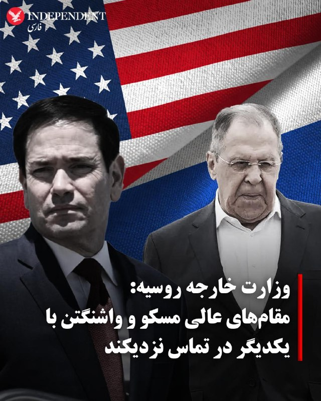
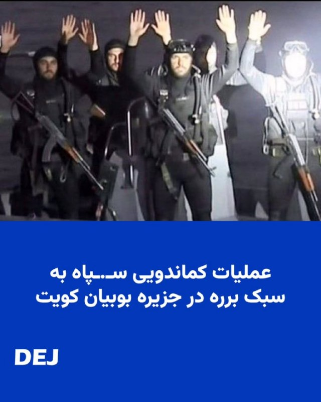
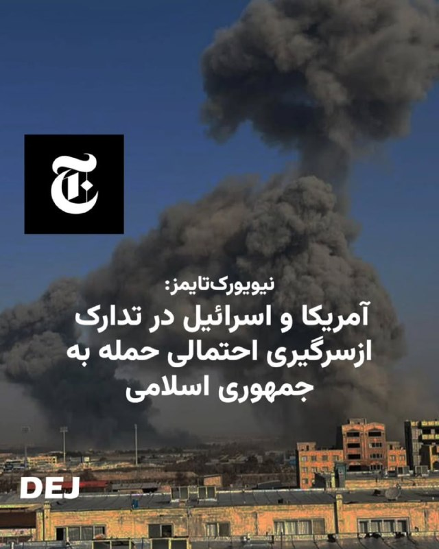
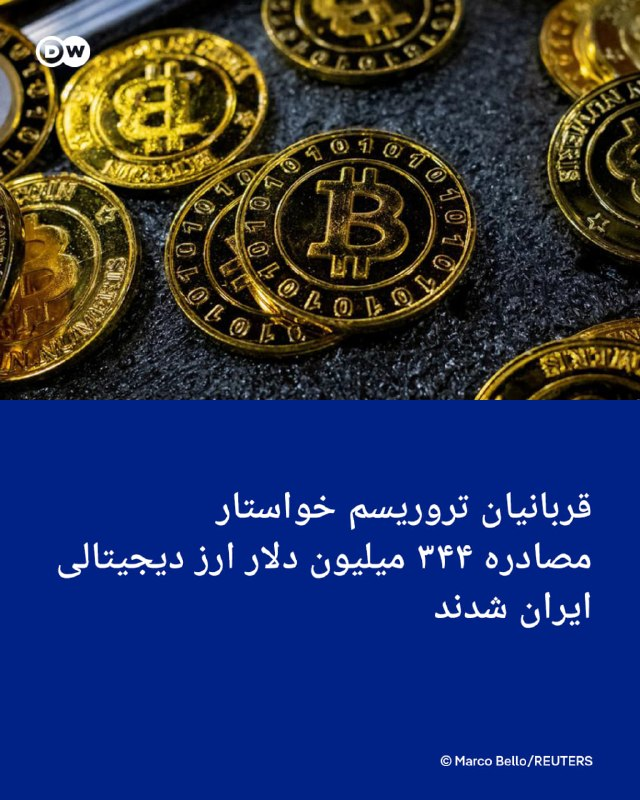
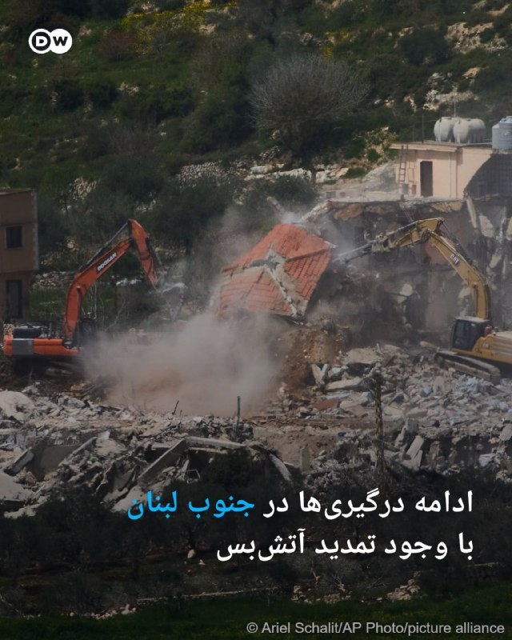
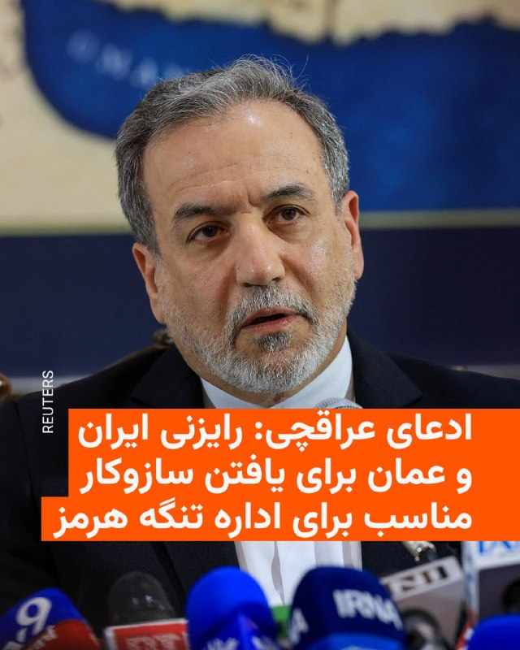
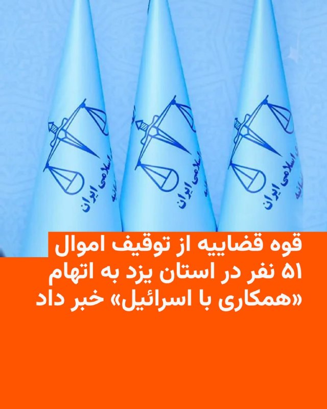
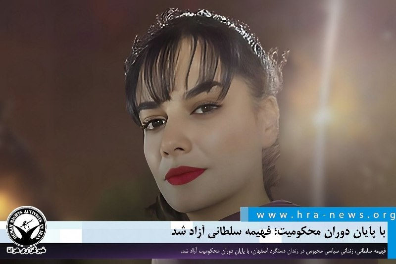

# خواننده تلگرام

<!-- MSG START -->

---
📅 بروزرسانی: 1405/02/26 13:33
---

## VahidOOnLine — post 240445

  <a href="telegram/content/VahidOOnLine_240445_1778925815.mp4">🎬 Download video</a>

یک شهروند ویدیویی به ایران اینترنشنال فرستاده که بحران در دسترسی به بنزین و تشکیل صف‌های طولانی در بندرعباس در روز شنبه ۲۶ اردیبهشت‌ماه را نشان می‌دهد.
‌🏁 🇬🇧 IranintlTV

🤖 @VahidOOnLine

## VahidOOnLine — post 240444

  

مشاهدات شما از بحران کمبود و گرانی سوخت در استان‌های مختلف ایران چیست؟

روی لینک زیر کلیک کنید و پیام‌های خود از طریق مدیا‌بات برای ما بفرستید.

t.me

پیام‌های شما به صورت زیر‌نویس در تلویزیون و همچنین در بخش‌های مختلف‌ خبری منتشر خواهد شد
‌🏁 🇬🇧 IranintlTV

🤖 @VahidOOnLine

## VahidOOnLine — post 240443

روایت شما از زندگی در آتش‌بس- شنبه ۲۶ اردیبهشت ۱۴۰۵

🔹 من یک معلول ضایعه نخاعی هستم، ۳۳ سال سن دارم. یک ساله بیکار شدم. هر جا می‌رم به خاطر معلولیتم به من کار نمی‌دن. الان هم که به خاطر شرایط جنگ، اکثر شرکت‌ها تعدیل نیرو دارن.
🔹 از ماهشهر، از وضع مردم خون به جگرم، اما حال و روز نیروی انتظامی دیدن داره، کنار خیابون بساط کردن. راستی از پرداختاتون چه خبر؟ ظاهراً ولتون کردن.
🔹 در حالی که سه ماهه وضع معیشتی سخت شده و بیکار شده‌ایم، قبض برق، گاز و آب گرون شده. سه ماهه مجلس هم تقریباً به‌هم ریخته. چرا نمایندگان مجلس باید حقوق آنچنانی بگیرند؟ مفت‌خورا.
🔹 من با هزار بدبختی به اینترنت وصل شدم. خواستم بگم دمِ خارج از کشور گرم که هوای ما رو دارن.
🔹 از بوشهر؛ جایگاه‌های سوخت بنزین ندارند. روزهای سختی با جمهوری اسلامی در راه است ولی ما تا سقوط این وضعیت تحمل می‌کنیم.
🔹 تسمه دینام پژو ۴۰۵ قبل از دی‌ماه ۴۰۰ تومن بود، الان شده یک میلیون و ششصد.
🔹 اولین بار که بعد از قطع نت وصل می‌شم. افزایش قیمت‌ها عجیب و غریب شده. دانش‌آموز و دانشجو بلاتکلیفن. بعضی‌ها هم از فرصت استفاده می‌کنن و دوباره زبان‌شون دراز شده. امیدوارم زودتر حمله بشه تا اینا برگردن سر جاشون. پاینده ایران.
‌🏁 🇬🇧 IranintlTV

🤖 @VahidOOnLine

## VahidOOnLine — post 240442

  

♦️مساجد شمال غزه روز شنبه اعلام کردند فرمانده شاخه نظامی حماس در حملات روز جمعه اسرائیل به این باریکه کشته شده است. ارتش اسرائیل پیش‌تر اعلام کرده بود رهبر شاخه مسلح حماس را در حملات هوایی هدف قرار داده است.
رویترز به نقل از شاهدان عینی گزارش داد مساجد شهر غزه خبر «شهادت» عزالدین الحداد را اعلام کرده‌اند.
با این حال، حماس تاکنون درباره سرنوشت فرمانده شاخه نظامی خود اظهار نظر رسمی نکرده است.
‌🇸🇦 Indypersian

🤖 @VahidOOnLine

## VahidOOnLine — post 240441

اصغر فرهادی،‌ کارگردان و تهیه‌کننده، ۲۵ اردیبهشت در نشست خبری فیلم «داستان‌های موازی» در جشنواره کن در پاسخ به پرسش خبرنگار ایران‌اینترنشنال درباره انقلاب ملی و سرکوب شهروندان گفت: «قتل انسان‌ها برای من قابل پذیرش نیست؛ چه با جنگ، چه اعدام و چه با کشتن معترضان.»

واکنش شماری از مخاطبان ایران‌اینترنشنال نشان می‌دهد که گروهی موضع‌گیری او را ناکافی دانسته‌اند و باور دارند که این فیلم‌ساز ایرانی، «حق مطلب» درباره جاویدنامان انقلاب ملی ایرانیان را ادا نکرده است.

بازخوانی پیام‌ها با هوش مصنوعی انجام گرفته است.
‌🏁 🇬🇧 IranintlTV

🤖 @VahidOOnLine

## VahidOOnLine — post 240440

  

الیاس حضرتی، رییس شورای اطلاع‌رسانی دولت، گفت اگر هدف از قطع یا محدودسازی اینترنت، جلوگیری از دسترسی مردم به برخی سایت‌ها بوده، این هدف نه‌تنها محقق نشده بلکه نتیجه معکوس داشته است. او افزود: «در برخی کشورها نیز محدودیت‌های مقطعی اینترنت اعمال می‌شود، اما این محدودیت‌ها بلافاصله به حالت عادی بازمی‌گردد.»
‌🏁 🇬🇧 IranintlTV

🤖 @VahidOOnLine

## VahidOOnLine — post 240439

  <a href="telegram/content/VahidOOnLine_240439_1778925819.mp4">🎬 Download video</a>

♦️هواداران خشمگین یک باشگاه فوتبال در طرابلس در اعتراض به تصمیم داور، نمای ساختمان و محوطه دفتر دولت وحدت ملی لیبی (GNU) را به آتش کشیدند.
رویترز به نقل از دو شاهد عینی و یک شبکه تلویزیونی محلی گزارش داد، این ناآرامی‌ها شامگاه پنج‌شنبه در پایتخت لیبی آغاز شد. زمانی که هواداران باشگاه الاتحاد طرابلس در اعتراض به تصمیم داور مبنی بر اعلام نشدن یک ضربه پنالتی در دیدار برابر تیم السویحلی مصراته به خیابان‌ها آمدند.
این مسابقه در ورزشگاه شهر ترهونه، حدود ۶۵ کیلومتری جنوب‌شرقی طرابلس برگزار شد. خبرنگار رویترز که در محل حضور داشت گزارش داد بازی در دقیقه ۸۷ و پس از اعتراض بازیکنان و هواداران الاتحاد متوقف شد.
بر اساس این گزارش، شماری از هواداران الاتحاد وارد زمین مسابقه شدند و درگیری‌هایی رخ داد که به آسیب‌دیدگی اموال و زخمی شدن نیروهای حفاظت ورزشگاه انجامید.
‌🇸🇦 Indypersian

🤖 @VahidOOnLine

## VahidOOnLine — post 240438

روایت شما از زندگی در آتش‌بس- شنبه ۲۶ اردیبهشت ۱۴۰۵

🔹 هر پرس استیک توی لاله‌پارک تبریز شده ۱ میلیون و ۶۰۰ هزار تومان، حقوق یک ماه کارگر معادل ۱۵ پرس استیک!
🔹 من به زور و هزار بدبختی وصل شدم. بدبختمون کردن، چیزی برامون نذاشتن. یک روغن شده ۲ میلیون و ۵۰۰، یک مرغ کوچیک شده ۵۰۰ هزار تومن. کل خانواده کار می‌کنن، بازم خرج زندگی درنمیاد. اینا نباید بمونن، تا از کشورمون نرن حال ایران خوب نمی‌شه. من از طرف پدربزرگ و مادربزرگم عذرخواهی می‌کنم که انقلاب کردن و زندگی تو بهشت را تبدیل به جهنم کردن. تنها امیدمون برگشت شاهزاده‌مونه، از طرف یک نسل زد.
🔹 از ایران؛ آقای ترامپ، برای مذاکره با این جانی‌ها فقط یک شرط بگذارید؛ برگزاری رفراندوم برای تعیین نوع حکومت تحت نظر نهادهای بین‌المللی. همه دنیا هم از شما حمایت خواهد کرد.
🔹 من مهندس ساختمان هستم. در صنعت ساختمان به‌قدری افزایش قیمت وجود داشته که بسیاری از کارگاه‌ها تعطیل شده‌اند. فقط کارگاه‌هایی فعال هستند که پیش‌فروش کردند و مجبور به تحویل هستند. با این روند، بیشتر مهندسین به‌زودی بیکار خواهند شد.
🔹 از مشهد؛ برای سوخت‌گیری به ۳ پمپ‌بنزین رفتم. میدان تلویزیون اصلاً سوخت نمی‌داد، در وکیل‌آباد ورودی دانشجو صف طولانی بود و در بلوار پیروزی بعد از یک ساعت انتظار در صف توانستم ۱۵ لیتر با کارت ۳۰۰۰ تومانی بزنم.
🔹 از مشهد. بعد از ۹ اسفند تازه امروز، ۲۶ اردیبهشت، به‌سختی وصل شدم. شرایط ایران خلاصه می‌شود در گرانی، فقر، نبود اینترنت و ناامیدی و افسردگی. لعنت به سیاست که مردم این وسط تاوان می‌دهند. امیدوارم روزی برسد که مردم ایران از ته دل شاد بشن، چون لیاقتشان بیشتر از این‌هاست.
‌🏁 🇬🇧 IranintlTV

🤖 @VahidOOnLine

## VahidOOnLine — post 240437

⭕️ آموزش استفاده از سلاح در صداوسیما؛
مجری به سمت پرچم امارات متحده عربی شلیک کرد

♦️شامگاه جمعه ۲۵ اردیبهشت‌ماه، برخی مجریان زن و مرد صداوسیمای جمهوری اسلامی در برنامه‌های تلویزیونی با در دست داشتن اسلحه ظاهر شدند. در یکی از ویدیوهای منتشرشده، فردی نظامی با پوشاندن صورت خود، نحوه استفاده از سلاح را آموزش می‌دهد و سپس اسلحه را در اختیار مجری برنامه قرار می‌دهد.
مجری برنامه که به‌نظر می‌رسد آشنایی چندانی با کار با اسلحه ندارد، به توضیحات و آموزش‌های فرد نظامی گوش می‌دهد. او سپس برای شلیک، سلاح را به سمت تصویر پرچم امارات متحده عربی که روی نمایشگر استودیو دیده می‌شود نشانه می‌گیرد و اقدام به شلیک می‌کند.
پخش این تصاویر در حالی صورت می‌گیرد که تنش‌ها میان جمهوری اسلامی ایران و ایالات متحده بار دیگر افزایش یافته و گمانه‌زنی‌ها درباره احتمال ورود دو طرف به دور تازه‌ای از تقابل‌های نظامی و امنیتی شدت گرفته است.
‌🇸🇦 Indypersian

🤖 @VahidOOnLine

## VahidOOnLine — post 240436

  

وحید شریعت، رییس انجمن روان‌پزشکان ایران، در مصاحبه با ایلنا گفت: «کمبود دارو در حوزه روان‌پزشکی جدی است و نسبت به شرایط پیش از جنگ، به‌طور قابل توجهی تشدید شده است.»

او افزود: «در ماه‌های اخیر، کمبود قابل توجهی در برخی اقلام دارویی مشاهده شده است که برخی از آن‌ها از پیش از آغاز جنگ تشدید یافته و برخی دیگر کاملا جدید هستند.»

شریعت اختلال در روند تولید، نبود مواد اولیه، محدود شدن توزیع به‌منظور آماده‌سازی بازار برای افزایش قیمت و تلاش برخی افراد برای ذخیره‌سازی دارو به‌دلیل ترس از جنگ را از عوامل اصلی بحران داروهای روان‌پزشکی عنوان کرد.
‌🏁 🇬🇧 IranintlTV

🤖 @VahidOOnLine

## VahidOOnLine — post 240435

  

♦️خبرگزاری‌های روسیه به نقل از سرگئی ریابکوف، معاون وزیر خارجه این کشور، گزارش دادند مسکو و واشنگتن همچنان تماس‌های بسیار نزدیک در سطوح عالی را حفظ کرده‌اند.
ریابکوف روز شنبه گفت احتمال دارد سرگئی لاوروف، وزیر خارجه روسیه، و مارکو روبیو، وزیر خارجه آمریکا، در دوره پیش‌رو تماس‌های بیشتری با یکدیگر داشته باشند.
او با این حال تاکید کرد روند بهبود و پیشرفت روابط میان روسیه و آمریکا «کند و دشوار» است.
مقام‌های رسمی روسیه و آمریکا، روز نهم اردیبهشت ماه از تماس تلفنی یک ساعت و نیمه میان دونالد ترامپ و ولادیمیر پوتین خبر داده بودند.
‌🇸🇦 Indypersian

🤖 @VahidOOnLine

## VahidOOnLine — post 240434

  

صدا و سیمای جمهوری اسلامی جمعه چند برنامه پخش کرد که در آنها مجریان در بخش‌های استودیویی با در دست داشتن تفنگ ظاهر شدند و کار با سلاح‌های سبک آموزش داده شد. مجریان در این برنامه‌ها اعلام کردند که در صورت لزوم به جنگ خواهند پیوست.

این برنامه‌ها که دست‌کم در سه بخش پخش شد، در رسانه‌های داخلی بازنشر و در شبکه‌های اجتماعی با واکنش‌هایی همراه شد. برخی کاربران شبکه‌های اجتماعی این بخش‌ها را نشانه‌ای از بسیج در شرایط جنگی توصیف کردند.

جکسون هینکل، مفسر سیاسی آمریکایی، در شبکه اجتماعی ایکس نوشت تلویزیون دولتی ایران نحوه استفاده و شلیک با کلاشینکف را به‌عنوان «آمادگی برای تهاجم زمینی آمریکا» نشان می‌دهد.
‌🏁 🇬🇧 IranintlTV

🤖 @VahidOOnLine

## VahidOOnLine — post 240433

  <a href="telegram/content/VahidOOnLine_240433_1778925823.mp4">🎬 Download video</a>

♦️سخنگوی وزارت کشور از فراهم شدن زمینه برای «شنیده شدن اعتراضات مردمی» خبر داد، اظهاراتی که در حالی مطرح می‌شود جمهوری اسلامی دی‌ماه گذشته در جریان انقلاب ملی ایرانیان، دست به یکی از بی‌سابقه‌ترین سرکوب‌های خیابانی زد و هزاران شهروند معترض را هدف گلوله قرار داد.
علی زینی‌وند، سخنگوی وزارت کشور، با اشاره به افزایش فشارهای اقتصادی و نارضایتی عمومی اعلام کرد که «گرانی برخی کالاها قابل انکار نیست» و دولت نیز از شرایط دشوار معیشتی مردم آگاه است. او گفت تمرکز ستاد تنظیم بازار بر کنترل قیمت‌هاست و همزمان موضوعاتی مانند افزایش احتمالی یارانه‌ها، اعطای مهلت در پرداخت اقساط و مالیات و برخی حمایت‌های معیشتی دیگر در دست بررسی قرار دارد.
زینی‌وند همچنین مدعی شد که بسترهایی برای شنیده شدن اعتراضات و مطالبات مردم توسط مسئولان در حال فراهم شدن است؛ این در حالی است که تنها چند ماه پیش، اعتراضات مردمی در شهرهای مختلف ایران با برخوردهای امنیتی گسترده، بازداشت‌های وسیع و تیراندازی مستقیم به معترضان و کشته شدن هزاران معترض مواجه شد.
‌🇸🇦 Indypersian

🤖 @VahidOOnLine

## pm_afshaa — post 90838

🔴کانال N12 اسرائیل: جنگ سوم با ایران نزدیک است

💧 Rainbet.com the #1 Non-KYC Crypto Casino & Sportsbook @rainbetcom

😁 @Pm_Afshaa

## pm_afshaa — post 90837

🔴جسی واترز، مجری فاکس نیوز: ترامپ درحال آماده‌شدن برای دور جدیدی از حملات نظامی به ایرانه

💧 Rainbet.com the #1 Non-KYC Crypto Casino & Sportsbook @rainbetcom

😁 @Pm_Afshaa

## pm_afshaa — post 90836

🔴ترامپ: 5 بار با ایران نزدیک توافق شدم، ولی روز بعدش زدن زیرش

💧 Rainbet.com the #1 Non-KYC Crypto Casino & Sportsbook @rainbetcom

😁 @Pm_Afshaa

## pm_afshaa — post 90835

🔴سنتکام:تمام کشتی ها قایق های ایران رو زیر نظر داریم

💧 Rainbet.com the #1 Non-KYC Crypto Casino & Sportsbook @rainbetcom

😁 @Pm_Afshaa

## pm_afshaa — post 90834

  

ارابه مرگ مردم ایران 1 میلیارد رو رد کرد

💧 Rainbet.com the #1 Non-KYC Crypto Casino & Sportsbook @rainbetcom

😁 @Pm_Afshaa

## DEJradio — post 4664

  <a href="telegram/content/DEJradio_4664_1778925826.mp4">🎬 Download video</a>

🤡
🔺 آموزش استفاده از سلاح در تلویزیون جمهوری اسلامی.

#کلاشنیکف #صداوسیما
@DEJradio

## DEJradio — post 4663

  <a href="telegram/content/DEJradio_4663_1778925828.mp4">🎬 Download video</a>

🤡
🔺 در صدا و سیمای حکومتی به طور سازمان یافته استفاده از کلاشنیکف را آموزش می‌دهند.

به بهانه تبلیغ پروژه امنیتی "جانفدا" در صدا و سیمای حکومتی، طرفداران نظام را ترغیب به استفاده از سلاح می‌کنند.

برای تلطیف این اقدام جنگ‌طلبانه، زنان وسیله تبلیغ می‌شوند.

#کلاشنیکف #صداوسیما
@DEJradio

## DEJradio — post 4662

  <a href="telegram/content/DEJradio_4662_1778925830.mp4">🎬 Download video</a>

🚨📢 جسد عبدالرحیم موسوی ۳۰ روز زیر آوار ماند

علی موسوی، پسر عبدالرحیم موسوی رئیس پیشن ستاد کل نیروهای مسلح جمهوری اسلامی، گفت که جنازه پدرش که در نخستین روز حملات اسرائیل و آمریکا به بین علی خامنه‌ای کشته شد نزدیک به ۳۰ روز در زیر آوار ماند و یک ماه در جستجوی جنازه‌اش بودند. موسوی پس از کشته شدن محمد باقری در جنگ ۱۲ روزه، به‌عنوان رییس ستاد کل نیروهای مسلح منصوب شده بود.

#جنگ۱۲روزه #IRGCterrorists
@DEJradio

## DEJradio — post 4661

  

🤡
🔺 بر اساس گزارش‌های منتشر شده، ارتش آمریکا در جریان جنگ اخیر از جزیره بوبیان کویت استفاده عملیاتی کرده است و رسانه‌های وابسته به نظام مدعی شلیک موشک‌های HIMARS آمریکایی در فروردین از این جزیره کویتی هستند، اما منابع کویتی این ادعا را رد می‌کنند.

در این میان، در تاریخ ۱۱ اردیبهشت، کماندوهای نیروی دریایی سـ.ـپاه که پیش از این تبلیغات زیادی درباره توانایی‌هایشان شده بود، در قالب یک تیم شش‌نفره به سمت جزیره بوبیان کویت حرکت کردند. هدف عملیاتی آن‌ها هنوز مشخص نیست، اما این به ‌اصطلاح کماندوها پیش از ورود به جزیره در یک درگیری کوتاه، شکست خوردند و چهار نفر از آنان، شامل سه افسر ارشد و یک افسر جزء، اسیر شدند و دو کماندوی دیگر سپاه نیز موفق به فرار شدند و شاید بتوان گفت فرار این دو موفق ترین، بخش عملیات آنها بوده است.

#نیروی_دریایی #IRGCterrorists
@DEJradio

## DEJradio — post 4658

  <a href="telegram/content/DEJradio_4658_1778925833.jpg">🎬 Download video</a>

🔺📢 محمدباقر الساعدی (داوود الساعدی) یکی از فرماندهان ارشد حـ.ـزب‌الله عراق توسط نیروهای امنیتی در یکی از کشورهای منطقه [احتمالا ترکیه، امارات یا اردن] بازداشت شده است. ماموران اف‌بی‌آی او را به آمریکا منتقل کرده‌اند تا محاکمه شود.

وزارت دادگستری آمریکا اعلام کرد، الساعدی رهبر کتائب حزب‌الله عراق با ۶ اتهام مرتبط با تروریسم روبرو است.

این اتهام‌ها به دلیل فعالیت‌های الساعدی با گردان‌های حـ.ـزب‌الله عراق و سـ.ـپاه پاسداران است. او روابط نزدیکی با قـ.ـاسم سـ.ـلیمانی فرمانده پیشین سـ.ـپاه قدس داشت.

براساس یک شکایت سعدی قصد داشته آمریکایی‌ها و یهودیان را در لس‌آنجلس و نیویورک به قتل برساند و برنامه‌ریزی برای حمله به یک کنیسه در نیویورک را آغاز کرده بود.
بازداشت او نشان داد تا چه اندازه نفوذ سرویس‌های امنیتی آمریکا در خاورمیانه زیاد است.

#حزب_الله #عراق
@DEJradio

## DEJradio — post 4657

  

🚨
⭕️ روزنامه «نیویورک‌تایمز» با اشاره به بن‌بست در مذاکرات جمهوری اسلامی و آمریکا، گزارش داد ایالات متحده و اسرائیل آماده‌سازی‌های گسترده‌ای را برای ازسرگیری احتمالی کارزار نظامی علیه جمهوری اسلامی آغاز کرده‌اند.

بر اساس این گزارش، مقام‌های دولت دونالد ترامپ طرح‌هایی برای عملیات نظامی علیه حکومت ایران تهیه کرده‌اند، اما رییس‌جمهوری آمریکا هنوز تصمیم نهایی را در این رابطه اتخاذ نکرده است.

در این گزارش تأکید شده گزینه‌های زیاد از بمباران گسترده تا عملیات زمینی علیه تاسیسات هسته‌ای جمهوری اسلامی روی میز قرار دارد.

#جنگ #مذاکرات #ترامپ
@DEJradio

## mamlekate — post 103540

  <a href="telegram/content/mamlekate_103540_1778925834.mp4">🎬 Download video</a>

سخنرانی حسین یکتا از تیرخلاص زن‌های دی‌ماه خونین… در کنار مزدوران تیم فوتبال جمهوری اسلامی!

CrimesArchives
@mamlekate

## mamlekate — post 103537

صداوسیما

@mamlekate

## mamlekate — post 103536

نرخ ارز طبق برنامه اعلام‌شده پیش رفته. تا سال آینده هم قراره به ۲۸۴۸۰۰ برسه که زودتر از برنامه هم بهش خواهد رسید. رشد اقتصادی هم منفی بوده (فروپاشی) که ننوشتن.

پست کانال در آبان ۱۴۰۳:
t.me/mamlekate/90970

## IranIntlTV — post 337441

  <a href="telegram/content/IranIntlTV_337441_1778925836.mp4">🎬 Download video</a>

یک شهروند ویدیویی به ایران اینترنشنال فرستاده که بحران در دسترسی به بنزین و تشکیل صف‌های طولانی در بندرعباس در روز شنبه ۲۶ اردیبهشت‌ماه را نشان می‌دهد.

## IranIntlTV — post 337440

  

مشاهدات شما از بحران کمبود و گرانی سوخت در استان‌های مختلف ایران چیست؟

روی لینک زیر کلیک کنید و پیام‌های خود از طریق مدیا‌بات برای ما بفرستید.

https://t.me/intlmedia_bot

پیام‌های شما به صورت زیر‌نویس در تلویزیون و همچنین در بخش‌های مختلف‌ خبری منتشر خواهد شد

## IranIntlTV — post 337439

  <a href="telegram/content/IranIntlTV_337439_1778925839.mp4">🎬 Download video</a>

دونالد ترامپ، رییس‌جمهوری آمریکا، گفت با تعلیق ۲۰ ساله غنی‌سازی اورانیوم در ایران موافق است، مشروط بر اینکه در این مدت، برنامه هسته‌ای جمهوری اسلامی به‌طور کامل پاکسازی شود.

گفت‌وگو با علی شیرازی، عضو تحریریه ایران‌اینترنشنال
@iranintltv

## IranIntlTV — post 337438

  <a href="https://t.me/IranintlTV/337438">📎 Download file</a>

🎧نسخه صوتی اخبار بامدادی | شنبه ۲۶ اردیبهشت
@iranintlTV

## IranIntlTV — post 337437

روایت شما از زندگی در آتش‌بس- شنبه ۲۶ اردیبهشت ۱۴۰۵

🔹 من یک معلول ضایعه نخاعی هستم، ۳۳ سال سن دارم. یک ساله بیکار شدم. هر جا می‌رم به خاطر معلولیتم به من کار نمی‌دن. الان هم که به خاطر شرایط جنگ، اکثر شرکت‌ها تعدیل نیرو دارن.
🔹 از ماهشهر، از وضع مردم خون به جگرم، اما حال و روز نیروی انتظامی دیدن داره، کنار خیابون بساط کردن. راستی از پرداختاتون چه خبر؟ ظاهراً ولتون کردن.
🔹 در حالی که سه ماهه وضع معیشتی سخت شده و بیکار شده‌ایم، قبض برق، گاز و آب گرون شده. سه ماهه مجلس هم تقریباً به‌هم ریخته. چرا نمایندگان مجلس باید حقوق آنچنانی بگیرند؟ مفت‌خورا.
🔹 من با هزار بدبختی به اینترنت وصل شدم. خواستم بگم دمِ خارج از کشور گرم که هوای ما رو دارن.
🔹 از بوشهر؛ جایگاه‌های سوخت بنزین ندارند. روزهای سختی با جمهوری اسلامی در راه است ولی ما تا سقوط این وضعیت تحمل می‌کنیم.
🔹 تسمه دینام پژو ۴۰۵ قبل از دی‌ماه ۴۰۰ تومن بود، الان شده یک میلیون و ششصد.
🔹 اولین بار که بعد از قطع نت وصل می‌شم. افزایش قیمت‌ها عجیب و غریب شده. دانش‌آموز و دانشجو بلاتکلیفن. بعضی‌ها هم از فرصت استفاده می‌کنن و دوباره زبان‌شون دراز شده. امیدوارم زودتر حمله بشه تا اینا برگردن سر جاشون. پاینده ایران.

## IranIntlTV — post 337436

اصغر فرهادی،‌ کارگردان و تهیه‌کننده، ۲۵ اردیبهشت در نشست خبری فیلم «داستان‌های موازی» در جشنواره کن در پاسخ به پرسش خبرنگار ایران‌اینترنشنال درباره انقلاب ملی و سرکوب شهروندان گفت: «قتل انسان‌ها برای من قابل پذیرش نیست؛ چه با جنگ، چه اعدام و چه با کشتن معترضان.»

واکنش شماری از مخاطبان ایران‌اینترنشنال نشان می‌دهد که گروهی موضع‌گیری او را ناکافی دانسته‌اند و باور دارند که این فیلم‌ساز ایرانی، «حق مطلب» درباره جاویدنامان انقلاب ملی ایرانیان را ادا نکرده است.

بازخوانی پیام‌ها با هوش مصنوعی انجام گرفته است.

## IranIntlTV — post 337435

  

الیاس حضرتی، رییس شورای اطلاع‌رسانی دولت، گفت اگر هدف از قطع یا محدودسازی اینترنت، جلوگیری از دسترسی مردم به برخی سایت‌ها بوده، این هدف نه‌تنها محقق نشده بلکه نتیجه معکوس داشته است. او افزود: «در برخی کشورها نیز محدودیت‌های مقطعی اینترنت اعمال می‌شود، اما این محدودیت‌ها بلافاصله به حالت عادی بازمی‌گردد.»
https://iranintl.com/202605165637

## IranIntlTV — post 337434

روایت شما از زندگی در آتش‌بس- شنبه ۲۶ اردیبهشت ۱۴۰۵

🔹 هر پرس استیک توی لاله‌پارک تبریز شده ۱ میلیون و ۶۰۰ هزار تومان، حقوق یک ماه کارگر معادل ۱۵ پرس استیک!
🔹 من به زور و هزار بدبختی وصل شدم. بدبختمون کردن، چیزی برامون نذاشتن. یک روغن شده ۲ میلیون و ۵۰۰، یک مرغ کوچیک شده ۵۰۰ هزار تومن. کل خانواده کار می‌کنن، بازم خرج زندگی درنمیاد. اینا نباید بمونن، تا از کشورمون نرن حال ایران خوب نمی‌شه. من از طرف پدربزرگ و مادربزرگم عذرخواهی می‌کنم که انقلاب کردن و زندگی تو بهشت را تبدیل به جهنم کردن. تنها امیدمون برگشت شاهزاده‌مونه، از طرف یک نسل زد.
🔹 از ایران؛ آقای ترامپ، برای مذاکره با این جانی‌ها فقط یک شرط بگذارید؛ برگزاری رفراندوم برای تعیین نوع حکومت تحت نظر نهادهای بین‌المللی. همه دنیا هم از شما حمایت خواهد کرد.
🔹 من مهندس ساختمان هستم. در صنعت ساختمان به‌قدری افزایش قیمت وجود داشته که بسیاری از کارگاه‌ها تعطیل شده‌اند. فقط کارگاه‌هایی فعال هستند که پیش‌فروش کردند و مجبور به تحویل هستند. با این روند، بیشتر مهندسین به‌زودی بیکار خواهند شد.
🔹 از مشهد؛ برای سوخت‌گیری به ۳ پمپ‌بنزین رفتم. میدان تلویزیون اصلاً سوخت نمی‌داد، در وکیل‌آباد ورودی دانشجو صف طولانی بود و در بلوار پیروزی بعد از یک ساعت انتظار در صف توانستم ۱۵ لیتر با کارت ۳۰۰۰ تومانی بزنم.
🔹 از مشهد. بعد از ۹ اسفند تازه امروز، ۲۶ اردیبهشت، به‌سختی وصل شدم. شرایط ایران خلاصه می‌شود در گرانی، فقر، نبود اینترنت و ناامیدی و افسردگی. لعنت به سیاست که مردم این وسط تاوان می‌دهند. امیدوارم روزی برسد که مردم ایران از ته دل شاد بشن، چون لیاقتشان بیشتر از این‌هاست.

## IranIntlTV — post 337433

  

وحید شریعت، رییس انجمن روان‌پزشکان ایران، در مصاحبه با ایلنا گفت: «کمبود دارو در حوزه روان‌پزشکی جدی است و نسبت به شرایط پیش از جنگ، به‌طور قابل توجهی تشدید شده است.»

او افزود: «در ماه‌های اخیر، کمبود قابل توجهی در برخی اقلام دارویی مشاهده شده است که برخی از آن‌ها از پیش از آغاز جنگ تشدید یافته و برخی دیگر کاملا جدید هستند.»

شریعت اختلال در روند تولید، نبود مواد اولیه، محدود شدن توزیع به‌منظور آماده‌سازی بازار برای افزایش قیمت و تلاش برخی افراد برای ذخیره‌سازی دارو به‌دلیل ترس از جنگ را از عوامل اصلی بحران داروهای روان‌پزشکی عنوان کرد.
https://iranintl.com/202605168467

## IranIntlTV — post 337432

  <a href="telegram/content/IranIntlTV_337432_1778925842.mp4">🎬 Download video</a>

یک شهروند با ارسال پیامی به ایران اینترنشنال می‌گوید: «من یه نقاشم و تنها دلخوشی‌ام همین نقاشی بود. الان توانِ خرید بوم را هم ندارم. حتی مقوایی که هفته پیش ۲۵۰ هزار تومان خریدم، این هفته شده ۳۲۰ هزار تومان.»

## IranIntlTV — post 337431

  

صدا و سیمای جمهوری اسلامی جمعه چند برنامه پخش کرد که در آنها مجریان در بخش‌های استودیویی با در دست داشتن تفنگ ظاهر شدند و کار با سلاح‌های سبک آموزش داده شد. مجریان در این برنامه‌ها اعلام کردند که در صورت لزوم به جنگ خواهند پیوست.

این برنامه‌ها که دست‌کم در سه بخش پخش شد، در رسانه‌های داخلی بازنشر و در شبکه‌های اجتماعی با واکنش‌هایی همراه شد. برخی کاربران شبکه‌های اجتماعی این بخش‌ها را نشانه‌ای از بسیج در شرایط جنگی توصیف کردند.

جکسون هینکل، مفسر سیاسی آمریکایی، در شبکه اجتماعی ایکس نوشت تلویزیون دولتی ایران نحوه استفاده و شلیک با کلاشینکف را به‌عنوان «آمادگی برای تهاجم زمینی آمریکا» نشان می‌دهد.
https://iranintl.com/202605169752

## IranIntlTV — post 337430

  <a href="telegram/content/IranIntlTV_337430_1778925844.mp4">🎬 Download video</a>

جشنواره فیلم کن در حالی وارد پنجمین روز خود شد که واکنش‌ها به نمایش و نشست خبری فیلم «داستان‌های موازی» ساخته اصغر فرهادی همچنان ادامه دارد.

لی‌لی نیکفر، خبرنگار ایران‌اینترنشنال، گزارش می‌دهد
@iranintltv

## FarsiVOA — post 217880

🔺آمریکا در تدارک اعلام جرم علیه رائول کاسترو رهبر پیشین کوبا

◾️رویترز به نقل از یک مقام وزارت دادگستری آمریکا گزارش داد دولت ترامپ قصد دارد روز چهارشنبه ۲۰ مه، اتهامات کیفری علیه رائول کاسترو، رهبر پیشین کوبا، را در میامی اعلام کند.

◾️به گفته این مقام، پرونده به حادثه سال ۱۹۹۶ بازمی‌گردد؛ زمانی که جنگنده‌های کوبا دو هواپیمای کوچک متعلق به گروه تبعیدیان کوبایی «برادران نجات» را سرنگون کردند و چهار نفر شهروند آمریکایی کشته شدند. رائول کاسترو در آن زمان وزیر دفاع کوبا بود.

◾️واشنگتن پس از این حادثه، در دوره بیل کلینتون، تحریم‌هایی علیه کوبا اعمال کرد؛ از جمله تعلیق پروازهای چارتر، محدود کردن رفت‌وآمد دیپلمات‌های کوبایی، و تلاش برای تشدید تحریم‌ها در کنگره.

⬇️ بیشتر بخوانید:
https://ir.voanews.com/a/8150655.html

## FarsiVOA — post 217879

  

بلومبرگ گزارش داد شرکت ملی نفت ابوظبی، ادنوک، با وجود اختلال‌های حمل‌ونقل در خلیج فارس، همچنان گاز طبیعی مایع را روی نفتکش‌هایی بارگیری می‌کند که سامانه‌های ردیابی خود را خاموش کرده‌اند.

بر اساس این گزارش، این کشتی‌ها برای عبور از تنگه هرمز موقعیت خود را پنهان می‌کنند؛ مسیری که از آغاز جنگ و افزایش تهدیدها علیه کشتیرانی، با خطر جدی روبه‌رو شده است.

ادنوک پیش‌تر اعلام کرده بود به دلیل اختلال در عبور کشتی‌ها از تنگه هرمز، تولید و صادرات ال‌ان‌جی و برخی محصولات صادراتی خود را به‌طور موقت تنظیم کرده است.

تأسیسات داس آیلند این شرکت در داخل خلیج فارس قرار دارد و صادرات آن برای رسیدن به بازارهای جهانی ناچار به عبور از تنگه هرمز است.

رویترز نیز اوایل ماه مه گزارش داد دومین نفتکش ال‌ان‌جی تحت مدیریت ادنوک، پس از خاموش کردن سامانه ردیابی خود، از تنگه هرمز عبور کرده است.

داده‌های رهگیری کشتی‌ها نشان می‌دهد شماری از نفتکش‌ها در هفته‌های اخیر برای کاهش خطر هدف‌گیری یا توقیف، موقعیت خود را پنهان کرده یا الگوهای شناسایی غیرعادی داشته‌اند.
@FarsiVOA

## FarsiVOA — post 217878

🔺خاموشی اینترنت در ایران وارد هفته دوازدهم شد

◾️نت‌بلاکس، نهاد ناظر بر اختلالات اینترنت، اعلام کرد خاموشی دیجیتال در ایران وارد هفته دوازدهم و روز هفتادوهشتم شده است

◾️این محدودیت بی‌سابقه، کشوری ۹۰ میلیونی را تا حد زیادی از اینترنت جهانی جدا کرده و حقوق بشر، اقتصاد و آزادی‌های بنیادین شهروندان را در مقیاسی گسترده فرسایش می‌دهد.

◾️مقام‌های دولتی مدعی هستند که اینترنت حق عمومی و برابر شهروندان است، اما ساختار دسترسی در عمل به سمت اینترنت گزینشی، لیست سفید و «اینترنت پرو» حرکت کرده است.

◾️همچنین دسترسی به زیرساخت حیاتی اینترنت، به‌جای آنکه برای همه شهروندان و فعالان اقتصادی تضمین شود، به فرآیندی اداری، صنفی و گزینشی تبدیل شده است.

⬇️ بیشتر بخوانید:
https://ir.voanews.com/a/8150654.html

## FarsiVOA — post 217877

  

رسانه وابسته به قوه قضائیه جمهوری اسلامی اعلام کرد اموال ۵۱ نفر در استان یزد، با دستور قضایی و به اتهام آنچه «خیانت به وطن» و «همکاری با دشمن» خوانده شده، توقیف شده است.

بر اساس این گزارش، پرونده این افراد در ارتباط با قانون موسوم به «تشدید مجازات جاسوسی و همکاری با رژیم صهیونیستی علیه امنیت و منافع ملی» در حال رسیدگی است و مقام‌های قضایی مدعی شده‌اند دارایی‌های توقیف‌شده قرار است برای «حفظ حقوق عامه» و بازسازی اماکن آسیب‌دیده از جنگ هزینه شود.

اموال توقیف‌شده شامل حساب‌های بانکی، دارایی‌های منقول و غیرمنقول، سهام شرکت‌ها و حتی اموال وکالتی عنوان شده است.

طبق گزارش میزان، از میان این ۵۱ نفر، ۲۰ نفر در داخل کشور حضور دارند و ۳۱ نفر دیگر در خارج از کشور به سر می‌برند.

این اقدام در ادامه موج تازه‌ای از مصادره و توقیف اموال شهروندان و مخالفان سیاسی صورت می‌گیرد؛ روندی که در عمل به ابزاری برای فشار، ارعاب و مصادره دارایی افراد تحت عنوان‌های سنگینی مانند «خیانت» و «همکاری با دشمن» تبدیل شده است.
@FarsiVOA

## DW_Farsi — post 124756

  

🔶 قربانیان تروریسم خواستار مصادره ۳۴۴ میلیون دلار ارز دیجیتالی ایران شدند

گروهی از خانواده‌های قربانیان تروریسم در آمریکا از یک قاضی فدرال در منهتن نیویورک خواسته‌اند شرکت ارز دیجیتالی "تتر"، صادرکننده "استیبل‌کوین" را ملزم کند بیش از ۳۴۴ میلیون دلار دارایی دیجیتال مسدودشده مرتبط با ایران را به وکلای آن‌ها منتقل کند.

این درخواست روز پنجشنبه ۲۴ اردیبهشت (۱۴ مه) در دادگاه منطقه منهتن نیویورک ثبت شده و مربوط به خانواده‌هایی است که با بمب‌گذاری سال ۱۹۹۷ حماس در اورشلیم ارتباط دارند و در پرونده‌های مختلف مرتبط با تروریسم، احکام پرداختی سنگینی علیه ایران دریافت کرده‌اند.

مجموع این احکام شامل حدود ۵۵۲ میلیون دلار غرامت و ۱.۸۶ میلیارد دلار خسارت تنبیهی است.

دارایی ارز دیجیتالی جمهوری اسلامی در چارچوب عملیات "خشم اقتصادی" دولت آمریکا و با هدف محدود کردن توان مالی ایران مسدود شده بود.

وزارت خزانه‌داری آمریکا اعلام کرده بود که شبکه‌های مالی مرتبط با سپاه پاسداران و حزب‌الله در این روند هدف قرار گرفته‌اند.

طبق اسناد پرونده، دو کیف پول رمزارزی که مجموعا حدود ۳۴۴ میلیون دلار در آن‌ها نگهداری می‌شد، توسط شرکت تتر مسدود شده‌اند. اکنون شاکیان درخواست کرده‌اند این دارایی‌ها برای اجرای احکام دادگاه‌های آمریکا علیه ایران به آن‌ها منتقل شود.

@dw_farsi

## DW_Farsi — post 124755

🔶 ایران متهم به هک سامانه‌های پایش سوخت پمپ‌بنزین‌های آمریکا

شبکه تلویزیونی سی‌ان‌ان در گزارشی اختصاصی نوشت مقام‌های آمریکایی گمان می‌کنند هکرهای ایرانی پشت مجموعه‌ای از نفوذهای سایبری به سامانه‌های پایش مخازن سوخت در پمپ‌بنزین‌های چندین ایالت آمریکا قرار دارند؛ سامانه‌هایی که میزان سوخت موجود در مخازن ذخیره را اندازه‌گیری و گزارش می‌کنند.

به گفته منابع آگاه از این فعالیت‌ها، هکرها از ضعف امنیتی سامانه‌های "سنجش خودکار مخازن (ATG)" سوءاستفاده کرده‌اند؛ سامانه‌هایی که به اینترنت متصل هستند و در برخی موارد حتی با رمز عبور محافظت نمی‌شده‌اند.

بر اساس گزارش سی‌ان‌ان، هکرها در برخی موارد توانسته‌اند داده‌های نمایش‌داده‌شده درباره سطح سوخت را دستکاری کنند، اما میزان واقعی سوخت موجود در مخازن تغییر نکرده است. تاکنون گزارشی از خسارت فیزیکی، انفجار، نشت یا آسیب مستقیم منتشر نشده، اما مقام‌های آمریکایی و کارشناسان بخش خصوصی هشدار داده‌اند که دسترسی به چنین سامانه‌هایی می‌تواند از نظر امنیتی خطرناک باشد؛ زیرا اصولاً ممکن است به مهاجم امکان دهد نشتی سوخت را از دید سامانه‌های هشدار پنهان کند.

@dw_farsi

## DW_Farsi — post 124754

  

📸 عکس روز: میزبان مهربان دریای کارائیب

یک لاک‌پشت دریایی روز جمعه، ۱۵ مه ۲۰۲۶ (۲۵ اردیبهشت ۱۴۰۵)، در ساحل پیسکادو واقع در منطقه وست‌پونت در جزیره کوراسائو، در میان گردشگرانی که مشغول غواصی سطحی هستند، شنا می‌کند. جزیره کوراسائو در دریای کارائیب به خاطر آب‌های زلال و حیات وحش دریایی غنی خود، یکی از مقاصد محبوب غواصان و دوستداران طبیعت است.

@dw_farsi

## DW_Farsi — post 124753

  

🔶 ترامپ: در عملیات مشترک آمریکا و نیجریه نفر دوم داعش کشته شد

دونالد ترامپ، رئیس‌جمهور آمریکا شامگاه جمعه ۲۵ اردیبهشت (۱۵ مه) اعلام کرد که "ابو بلال المینوکی"، نفر دوم گروه داعش در یک عملیات مشترک میان نیروهای آمریکا و ارتش نیجریه کشته شده است.

ترامپ در شبکه اجتماعی "تروث سوشال" نوشت این عملیات به دستور او و با اجرای نیروهای آمریکایی و نیروهای مسلح نیجریه "به‌صورت دقیق و پیچیده" انجام شده و هدف آن حذف "فعال‌ترین تروریست جهان" از میدان نبرد بوده است.

او افزود که المینوکی تصور می‌کرد می‌تواند در آفریقا مخفی شود، اما نیروهای اطلاعاتی آمریکا از فعالیت‌های او مطلع بوده‌اند.

رئیس جمهور آمریکا که پیش‌تر نیجریه را به ناتوانی در حفاظت از مسیحیان در برابر شبه‌نظامیان اسلام‌گرا در شمال‌غرب این کشور متهم کرده بود، از دولت نیجریه بابت همکاری در این عملیات قدردانی کرد.

دولت نیجریه هرگونه تبعیض مذهبی را رد و اعلام کرده است که نیروهای امنیتی این کشور با گروه‌های مسلحی مقابله می‌کنند که به مسیحیان و  مسلمانان حمله می‌کنند.

به گزارش رویترز، آمریکا پیش‌تر نیز در ماه دسامبر سال گذشته حملاتی علیه نیروهای وابسته به گروه داعش در نیجریه انجام داده بود.

واشنگتن بعد از این حملات پهپادهایی به همراه حدود ۲۰۰ نیروی نظامی برای آموزش و پشتیبانی اطلاعاتی در اختیار ارتش نیجریه قرار داد تا با شورش‌های وابسته به داعش و القاعده که در غرب آفریقا در حال گسترش هستند، مقابله کند.

@dw_farsi

## DW_Farsi — post 124751

  

🔶 ادامه درگیری‌ها در جنوب لبنان با وجود تمدید آتش‌بس

علی‌رغم تمدید آتش‌بس میان اسرائیل و حزب‌الله لبنان برای ۴۵ روز، صبح روز شنبه ۲۶ اردیبهشت (۱۶ مه) گزارش‌هایی از ادامه درگیری‌ها در جنوب لبنان منتشر شده است.

بر اساس یک گزارش رسانه‌ای، در حمله‌ای که گفته می‌شود توسط ارتش اسرائیل در جنوب لبنان انجام شده، دست‌کم شش نفر کشته و ۲۲ نفر زخمی شده‌اند.

خبرگزاری ملی لبنان "ان‌ان‌آ" گزارش داده است سه نفر از کشته‌شدگان از نیروهای امدادی در مرکز دفاع مدنی در منطقه نبطیه بوده‌اند.

ارتش اسرائیل تاکنون درباره این گزارش‌ها اظهار نظر نکرده است.

این گزارش درگیری در حالی منتشر شده است که روز جمعه ۱۵ مه سخنگوی وزارت خارجه آمریکا در شبکه ایکس از تمدید آتش‌بس میان اسرائیل و لبنان برای ۴۵ روز دیگر خبر داده بود.

این آتش‌بس از اواسط آوریل برقرار شده و پیش‌تر نیز یک‌بار تمدید شده بود، اما در هفته‌های گذشته بارها از سوی دو طرف نقض شده است.

@dw_farsi

## Persian_Trend_Official — post 14233

  

💢فراخوان مشمولان متولد ۱۳۵۵ تا ۱۳۸۷ برای تعیین‌تکلیف سربازی

🔹سازمان وظیفهٔ عمومی فراجا اعلام کرد: همهٔ مشمولان غایب و غیرغایب متولد سال‌های ۱۳۵۵تا ۱۳۸۷ باید خدمت وضعیت خدمتی خود را تعیین‌تکلیف کنند و مشمولانی که در مهلت تعیین‌شده وضعیت خود را مشخص نکنند، وارد غیبت می‌شوند و با محرومیت‌های اجتماعی مواجه خواهند شد.

🫆:Tony

📌 @persian_trend_official
پرشین ترند | متفاوت‌ترین کانال نظامی

## Persian_Trend_Official — post 14230

💢اجرای برنامه ها به صورت مسلح در صداوسیما ..

🫆:Tony

📌 @persian_trend_official
پرشین ترند | متفاوت‌ترین کانال نظامی

## Persian_Trend_Official — post 14229

## Persian_Trend_Official — post 14228

اگر به تاریخ، مسائل نظامی و پشت‌پرده اتفاقات منطقه علاقه داری، پیشنهاد می‌کنم حتماً پادکست پرشین ترند رو هم دنبال کنی.

این‌جا فقط خبر گفته نمی‌شه؛
موضوعات از پایه باز می‌شن، تحلیل می‌شن و با یک روایت قابل فهم ارائه می‌شن.

از بررسی سلاح‌ها و تکنولوژی‌های نظامی گرفته تا اتفاقات تاریخی و تحولات روز، با یک نگاه متفاوت و عمیق.

اگر دوست داری بدونی واقعاً پشت این خبرها چی می‌گذره، این پادکست رو از دست نده 👇

https://castbox.fm/channel/%D9%BE%D8%B1%D8%B4%DB%8C%D9%86-%D8%AA%D8%B1%D9%86%D8%AF-%7C-%D9%85%D8%AA%D9%81%D8%A7%D9%88%D8%AA-%D8%AA%D8%B1%DB%8C%D9%86-%D9%BE%D8%A7%D8%AF%DA%A9%D8%B3%D8%AA-%D8%AA%D8%A7%D8%B1%DB%8C%D8%AE%DB%8C-%D9%88-%D9%86%D8%B8%D8%A7%D9%85%DB%8C-%D9%81%D8%A7%D8%B1%D8%B3%DB%8C-id6056489?nojump=1&country=gb

## RadioFarda — post 157253

  

🔸عباس عراقچی، وزیر امور خارجه جمهوری اسلامی، روز جمعه ۲۵ اردیبهشت در گفت‌وگو با خبرنگاران در هند ادعا کرد که ایران با عمان در حال رایزنی برای ایجاد سازوکار مناسب برای اداره تنگه هرمز است.

🔸بر اساس ادعای عراقچی، از آنجا که ایران و عمان در دو سوی تنگه هرمز قرار دارند، آنها باید برای مدیریت این آبراهه تصمیم بگیرند.

🔸عمان تاکنون هیچ واکنشی به این اظهار نظر نداشته و در برابر آن سکوت کرده است.

🔸عباس عراقچی این طور توضیح داده است:‌ «ایران و عمان دو کشور ساحلی در دو سوی تنگه هرمز هستند و این تنگه در آب‌های سرزمینی دو کشور قرار دارد و میان آن آب‌های بین‌المللی وجود ندارد. بنابراین مدیریت این مسیر باید توسط ایران و عمان انجام شود.»

🔸این در حالی است که ایالات متحده با این که این تنگه باید در دست ایران باشد و تهران می‌تواند در ازای اجازه عبور از کشتی‌ها عوارض دریافت کند از ابتدا مخالفت کرده و می‌گوید که عمان هم با این موضع‌گیری موافق است.

@RadioFarda

## RadioFarda — post 157252

  

🔸قوه قضاییه جمهوری اسلامی روز شنبه ۲۶ اردیبهشت از توقیف اموال ۵۱ نفر در استان یزد به اتهام «جاسوسی و همکاری با کشور‌های متخاصم و گروه‌های معاند» خبر داد.

🔸بنا بر اعلام مرکز رسانه قوه قضائیه اموال این افراد «به نفع مردم و هزینه‌کرد برای بازسازی اماکن آسیب‌دیده از جنگ توقیف شده است.»

🔸بنابر این اطلاعیه قوه قضاییه ۲۰ نفر از این افراد در داخل کشور و ۳۱ نفر در خارج از ایران به‌سر می‌برند و اموال آن‌ها «شامل وجوه نقد بانکی، اموال منقول و غیرمنقول، سهام شرکت‌ها و حتی اموال وکالتی» است.

🔸این نهاد اسامی این افراد را اعلام نکرده و برای اتهامات علیه این افراد شواهد و مدارکی ارائه نداده است.

🔸پیش از این نیز گزارش‌های متعددی از توقیف اموال شماری از روزنامه‌نگاران، فعالان سیاسی و مدنی، هنرمندان، ورزشکاران و چهره‌های شناخته‌شده با اتهاماتی چون «خیانت» به وطن و «وابستگی» به اسرائیل و «همکاری با کشورهای متخاصم» منتشر شده بود.

@RadioFarda

## RadioFarda — post 157251

🔸 معاون سیاسی و سخنگوی وزارت کشور در نشست خبری روز شنبه ۲۶ اردیبهشت ضمن تأکید بر «حفظ انسجام» در کشور گفت: «اظهارات برخی در میادین مثلاً در موضوع بی‌حجابی سیاست رسمی کشور و نظام نیست و جامعه متکثر است.»

🔸 علی زینی‌وند در بخشی از سخنان امروز ضمن تأکید بر «تنوع جمعیت ۹۰ میلیون نفری ایران» به حضور زنان با «حجاب ضعیف» در کنار زنان چادری در تجمعات حکومتی اشاره کرد و گفت: «مهم این است که حاکمیت همه مردم را ببینید.»

🔸این اظهارات در حالی مطرح می‌شود که پدر مهسا امینی، بهمن‌ماه پارسال با انتشار عکسی از مصاحبه با یک زن در راهپیمایی ۲۲ بهمن توسط رسانه‌های حکومتی گفته بود «به خاطر چهار تار مو دختر معصوم من را کشتند و کسی جوابگو نشد و این که از دختران با سرهای برهنه و پوشش به قول آن‌ها غیر متعارف در مراسم رسمی فیلم می‌گیرند و کسی فریاد وا اسلاما سر نمی‌دهد، روزگار غریبی است!»

🔸 در ماه‌های گذشته رسانه‌های حکومتی تصاویر و گزارش‌های بسیاری از زنان بدون حجاب در رویدادهای حکومتی منتشر کرده‌اند.

🔸 چرخش سیاست حکومت در قبال حجاب با واکنش‌های افراد تندرو همراه شده است.

@RadioFarda

## IranianMinds — post 20230

  <a href="telegram/content/IranianMinds_20230_1778925852.mp4">🎬 Download video</a>

وسط پخش زنده میاد یادشون‌ میده چطوری شلیک کنن

@IranianMinds

## BBCPersian — post 281204

🔻اسرائیل از موج تازه حملات علیه مواضع حزب‌الله خبر داد

ارتش اسرائیل می‌گوید که موج تازه‌ای از حملات هوایی را علیه مواضع حزب‌الله در جنوب لبنان آغاز کرده است.

ارتش اسرائیل پیش‌تر به ساکنان چندین منطقه در جنوب لبنان دستور تخلیه داده بود.

این حملات جدید یک روز پس از آن انجام شد که نمایندگان اسرائیل و لبنان در نشستی در واشنگتن، آتش‌بس شکننده جاری را برای ۴۵ روز دیگر تمدید کردند.

پیش‌تر، مقام‌های لبنانی اسرائیل را متهم کردند که عمداً مراکز درمانی را هدف قرار داده است.

وزارت بهداشت لبنان اعلام کرد که اسرائیل یک مرکز امدادرسانی را هدف حمله قرار داده که در نتیجه آن شش نفر، از جمله سه امدادگر، کشته شدند.

اما اسرائیل هدف قرار دادن نیروهای امدادی و پزشکی را رد کرد.

https://bbc.in/4uQiCnV
@BBCPersian

## BBCPersian — post 281203

  

🔻ساعاتی پس از آنکه دونالد ترامپ گفت که هنوز در مورد فروش سلاح به تایوان تصمیم نگرفته است، رئیس‌جمهور تایوان بر اهمیت و لزوم این موضوع تاکید کرده است.

سخنگوی رئیس‌جمهور تایوان گفت که فروش تسلیحات آمریکا به تایوان نه تنها تعهدی حقوقی است، بلکه همواره یک عامل بازدارنده مشترک علیه تهدیدهای منطقه‌ای بوده است.

این موضعگیری تایوان پس از دیداردونالد ترامپ و همتای چینی‌اش شی‌ جین‌پینگ است که در آن رهبر چین هشدار داد که «مدیریت نامناسب» مساله تایوان می‌تواند به درگیری یا جنگ مستقیم بینجامد.

چین تایوان را یک استان متمرد خود می‌داند و امکان استفاده از زور برای تحت کنترل درآوردن آن را رد نکرده است.

واشنگتن بر اساس «قانون روابط با تایوان» موظف است برای این جزیره سلاح فراهم کند.

📷Getty Images
@BBCPersian

## idfinfarsi — post 11589

ارتش اسرائیل و شین‌بت عزالدین حداد را به هلاکت رساندند - رئیس شاخه نظامی سازمان تروریستی حماس و از آخرین مقامات ارشد این سازمان که کشتار خونین ۷ اکتبر را پیش بردند

سخنگوی ارتش اسرائیل و سخنگوی شین‌بت اعلام می‌کنند که در یک حمله دقیق دیروز (جمعه) در محدوده شهر غزه، تروریست عزالدین حداد - رئیس شاخه نظامی سازمان تروریستی حماس و از معماران کشتار ۷ اکتبر به هلاکت رسید.

حداد پس از به هلاکت رسیدن محمد سنوار به این سمت منصوب شد و در طول دوره اخیر برای بازسازی توانمندی‌های شاخه نظامی سازمان تروریستی فعالیت کرد و همچنین به برنامه‌ریزی طرح‌های تروریستی متعدد علیه شهروندان اسرائیل و نیروهای ارتش اسرائیل پرداخت.

در طول جنگ، حداد در نگهداری بسیاری از ربوده شدگان اسرائیلی در اسارت حماس دخیل بود. همچنین حداد سازوکار نگهداری ربوده شدگان را اداره کرد و خود را با اسیران اسرائیلی احاطه کرد به‌منظور جلوگیری از به هلاکت رسیدنش.

حداد یکی از باسابقه‌ترین فرماندهان در این سازمان است که در دوره تأسیس آن به صفوف آن پیوست و از نزدیک‌ترین افراد به رهبری حماس بود. در طول دوره حضور خود در سازمان، حداد نقش مرکزی در حاکمیت تروریستی داشت و مجموعه‌ای از مناصب کلیدی از جمله فرمانده تیپ شهر غزه و فرمانده واحدهای دیگر را بر عهده داشت.

حداد از آخرین فرماندهان ارشد در شاخه نظامی حماس است که بر برنامه‌ریزی و اجرای کشتار ۷ اکتبر و بر مدیریت جنگ علیه نیروهای ارتش اسرائیل فرماندهی کردند. به هلاکت رسیدن او به به هلاکت رسیدن بسیاری از مقامات ارشد حماس در طول جنگ اضافه می‌شود.

## Hranews — post 112966

گزارشی از بازداشت صباح بیواره در پیرانشهر

❗️
❗️
❗️
❗️
❗️– صباح بیواره، شهروند اهل پیرانشهر روز پنجشنبه ۲۴ اردیبهشت ماه، توسط نیروهای امنیتی در این شهرستان بازداشت شده و کماکان از محل نگهداری وی اطلاعی حاصل نشده است.

#صباح_بیواره

ادامه مطلب

↘️
@hranews_bot تماس ✉️ - @Hranews کانال هرانا 🆑

## Hranews — post 112965

اموال ۵۱ شهروند در استان یزد توقیف شد

❗️
❗️
❗️
❗️
❗️– دارایی‌ها و اموال ۵۱ شهروند در استان یزد مصادره شد. دستگاه قضایی این افراد را متهم به «همکاری با دشمن» دانسته است. ۲۰ تن از این شهروندان در داخل کشور و ۳۱ نفر دیگر در خارج از ایران سکونت دارند.

ادامه مطلب

↘️
@hranews_bot تماس ✉️ - @Hranews کانال هرانا 🆑

## Hranews — post 112964

  

با پایان دوران محکومیت؛ فهیمه سلطانی آزاد شد

خبرگزاری هرانا – فهیمه سلطانی، زندانی سیاسی محبوس در زندان دستگرد اصفهان، با پایان دوران محکومیت آزاد شد.

به گزارش خبرگزاری هرانا، ارگان خبری مجموعه فعالان حقوق بشر در ایران، فهیمه سلطانی آزاد شد.

بر اساس اطلاعات دریافتی هرانا، آزادی خانم سلطانی در تاریخ ۱۸ اردیبهشت ماه، با پایان دوران محکومیت وی از زندان دستگرد اصفهان صورت گرفته است.

#فهیمه_سلطانی

ادامه مطلب

↘️
@hranews_bot تماس ✉️ -  @Hranews  کانال هرانا 🆑

## alonews — post 120356

  <a href="telegram/content/alonews_120356_1778925854.mp4">🎬 Download video</a>

👈جنگنده‌های جدید "MiG-29" سوریه رسماً رفتن تو عملیات و دارن برای دفاع از حریم هوایی سوریه پرواز می‌کنن

✅ @AloNews خبر جنگ

## alonews — post 120355

  <a href="telegram/content/alonews_120355_1778925855.jpg">🎬 Download video</a>

👈یک مقام ارشد اسرائیلی در گفتگو با کانال ۱۲ اسرائیل: تل‌آویو در حال آماده شدن برای یک جنگ چند روزه یا چند هفته‌ای با ایران است

✅ @AloNews خبر جنگ

## alonews — post 120354

  <a href="telegram/content/alonews_120354_1778925855.jpg">🎬 Download video</a>

👈ترامپ: ۵ بار با ایران نزدیک توافق شدم، ولی روز بعدش زدن زیرش

✅ @AloNews خبر جنگ

## alonews — post 120353

  <a href="telegram/content/alonews_120353_1778925856.jpg">🎬 Download video</a>

👈حدادی، عضو کمیسیون صنایع: گران شدن خودرو توجیه فنی ندارد/قیمت‌ها باید به قبل از جنگ بازگردد

✅ @AloNews خبر جنگ

## alonews — post 120351

## alonews — post 120350

## alonews — post 120349

  <a href="telegram/content/alonews_120349_1778925856.jpg">🎬 Download video</a>

🔴فوری / ارتش اسرائیل : عزالدین الحداد فرمانده گردان‌های القسام، همراه با محافظ‌هاش ترور شد 
✅ @AloNews خبر جنگ

## alonews — post 120348

  <a href="telegram/content/alonews_120348_1778925856.jpg">🎬 Download video</a>

👈وزیر جدید نفت عراق، باسم محمد، اعلام کرد که عراق در ماه آوریل/نیمان ۱۰ میلیون بشکه نفت خود را از طریق تنگه هرمز صادر کرده است.

🔴وی توضیح داد که عراق قصد دارد با سازمان اوپک همکاری کند تا تولید و ظرفیت صادرات کشور را افزایش دهد و افزود که بغداد هدف دارد به ظرفیت تولید روزانه ۵ میلیون بشکه دست یابد.

✅ @AloNews خبر جنگ

## alonews — post 120347

  <a href="telegram/content/alonews_120347_1778925856.jpg">🎬 Download video</a>

👈سنتکام به نیویورک تایمز : کشتی‌های ایرانی رو با ماهواره و چند روش دیگه ردیابی می‌کنیم

✅ @AloNews خبر جنگ

## alonews — post 120346

  <a href="telegram/content/alonews_120346_1778925856.jpg">🎬 Download video</a>

👈منابع پاکستانی: سومین کشتی گاز مایع قطر با عبور از تنگه هرمز در کراچی پهلو گرفت

✅ @AloNews خبر جنگ

## alonews — post 120345

  <a href="telegram/content/alonews_120345_1778925857.jpg">🎬 Download video</a>

👈قطارهای چین به ایران سه برابر شد

🔴با وجود محاصره دریایی آمریکا، قطارهای باری چین به ایران از هفته‌ای یک بار به هر سه تا چهار روز یکبار رسیده‌ است

✅ @AloNews خبر جنگ

## alonews — post 120344

  <a href="telegram/content/alonews_120344_1778925857.jpg">🎬 Download video</a>

👈سخنگوی وزارت کشور: از نمایندگان مجلس توقع داریم در اظهارنظرهای خود در موضوعات مختلف بیشتر دقت کنند؛ انسجام ملی باید حفظ شود

✅ @AloNews خبر جنگ

<!-- MSG END -->
<!-- NAV START -->
[صفحه قبل](telegram/content/archive_1.md)
<!-- NAV END -->
